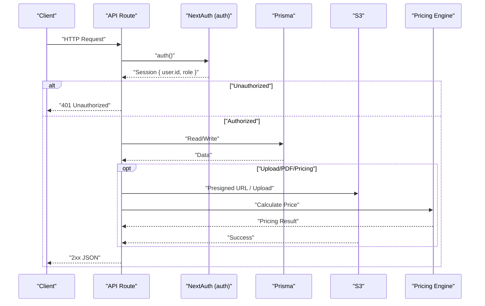
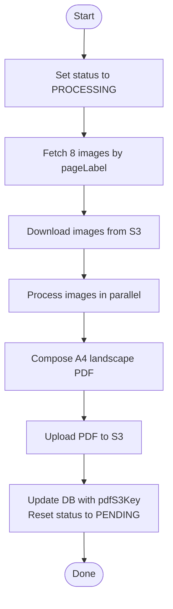
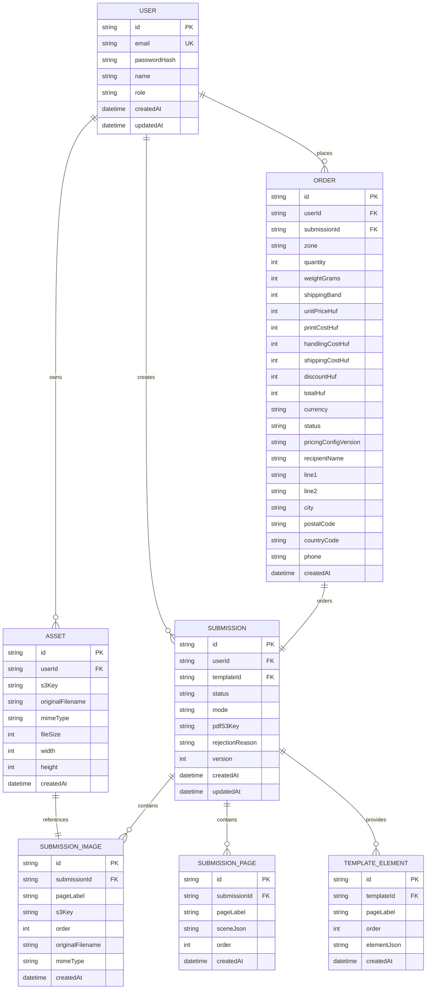
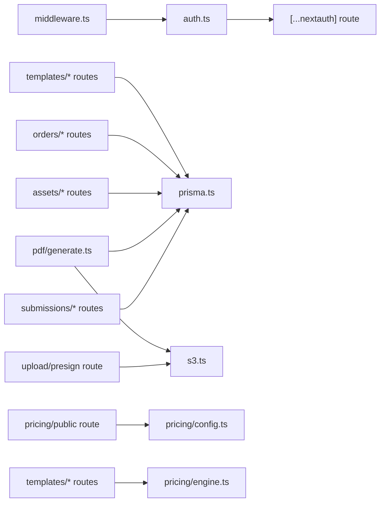

# API Reference

<cite>
**Referenced Files in This Document**
- [src/app/api/register/route.ts](file://src/app/api/register/route.ts)
- [src/app/api/submissions/route.ts](file://src/app/api/submissions/route.ts)
- [src/app/api/submissions/[id]/route.ts](file://src/app/api/submissions/[id]/route.ts)
- [src/app/api/submissions/[id]/pdf/route.ts](file://src/app/api/submissions/[id]/pdf/route.ts)
- [src/app/api/submissions/from-template/route.ts](file://src/app/api/submissions/from-template/route.ts)
- [src/app/api/admin/submissions/route.ts](file://src/app/api/admin/submissions/route.ts)
- [src/app/api/admin/submissions/[id]/route.ts](file://src/app/api/admin/submissions/[id]/route.ts)
- [src/app/api/upload/presign/route.ts](file://src/app/api/upload/presign/route.ts)
- [src/app/api/auth/[...nextauth]/route.ts](file://src/app/api/auth/[...nextauth]/route.ts)
- [src/app/api/assets/route.ts](file://src/app/api/assets/route.ts)
- [src/app/api/assets/[assetId]/route.ts](file://src/app/api/assets/[assetId]/route.ts)
- [src/app/api/templates/public/route.ts](file://src/app/api/templates/public/route.ts)
- [src/app/api/templates/[id]/elements/route.ts](file://src/app/api/templates/[id]/elements/route.ts)
- [src/app/api/orders/route.ts](file://src/app/api/orders/route.ts)
- [src/app/api/pricing/public/route.ts](file://src/app/api/pricing/public/route.ts)
- [src/auth.ts](file://src/auth.ts)
- [src/lib/constants.ts](file://src/lib/constants.ts)
- [src/lib/s3.ts](file://src/lib/s3.ts)
- [src/lib/pdf/generate.ts](file://src/lib/pdf/generate.ts)
- [src/lib/prisma.ts](file://src/lib/prisma.ts)
- [src/lib/pricing/config.ts](file://src/lib/pricing/config.ts)
- [src/lib/pricing/engine.ts](file://src/lib/pricing/engine.ts)
- [src/lib/pricing/schema.ts](file://src/lib/pricing/schema.ts)
- [prisma/schema.prisma](file://prisma/schema.prisma)
- [src/middleware.ts](file://src/middleware.ts)
- [package.json](file://package.json)
</cite>

## Update Summary
**Changes Made**
- Added comprehensive Assets API documentation for asset management
- Added complete Templates API documentation including template discovery and element retrieval
- Added complete Orders API documentation with pricing integration
- Added Pricing API documentation for public pricing configuration
- Enhanced Submission APIs with template-based creation and CRUD operations
- Updated data models to include new Asset, Order, and Template tables
- Expanded architectural overview to include new service layers

## Table of Contents
1. [Introduction](#introduction)
2. [Project Structure](#project-structure)
3. [Core Components](#core-components)
4. [Architecture Overview](#architecture-overview)
5. [Detailed Component Analysis](#detailed-component-analysis)
6. [Dependency Analysis](#dependency-analysis)
7. [Performance Considerations](#performance-considerations)
8. [Troubleshooting Guide](#troubleshooting-guide)
9. [Conclusion](#conclusion)
10. [Appendices](#appendices)

## Introduction
This document provides comprehensive API documentation for Titchybook Creator. It covers authentication via NextAuth integration, user registration, submission management (CRUD, status updates, bulk retrieval), PDF generation for booklet creation, file upload workflows including presigned URL generation, and the newly expanded services for assets, templates, orders, and pricing. It also documents request/response schemas, authentication requirements, error codes, status messages, curl examples, SDK integration guidance, rate limiting considerations, API versioning, backward compatibility, and deprecation policies.

## Project Structure
The API surface is implemented as Next.js App Router API routes under src/app/api. Authentication is handled by NextAuth with JWT session strategy. Data persistence uses Prisma ORM against a SQLite database. AWS S3 is used for file storage with signed URLs for uploads and downloads. The system now includes dedicated endpoints for assets, templates, orders, and pricing services.

```mermaid
graph TB
subgraph "Authentication & Core"
REG["POST /api/register"]
NEXTAUTH["[...nextauth] handlers"]
end
subgraph "Submission Management"
SUB_GETALL["GET /api/submissions"]
SUB_CREATE["POST /api/submissions"]
SUB_FROM_TEMPLATE["POST /api/submissions/from-template"]
SUB_GETONE["GET /api/submissions/[id]"]
SUB_PDF_GEN["POST /api/submissions/[id]/pdf"]
end
subgraph "Admin Operations"
ADMIN_SUB_ALL["GET /api/admin/submissions"]
ADMIN_SUB_PATCH["PATCH /api/admin/submissions/[id]"]
end
subgraph "File Management"
PRESIGN["GET /api/upload/presign"]
ASSETS["/api/assets/*"]
end
subgraph "Template System"
TEMPLATES_PUBLIC["GET /api/templates/public"]
TEMPLATES_ELEMENTS["GET /api/templates/[id]/elements"]
end
subgraph "Order & Pricing"
ORDERS["/api/orders/*"]
PRICING_PUBLIC["GET /api/pricing/public"]
end
subgraph "Libraries & Services"
AUTH["NextAuth (JWT)"]
PRISMA["Prisma Client"]
S3LIB["AWS S3 Client + Presigner"]
PDFGEN["PDF Generation"]
PRICING["Pricing Engine"]
end
subgraph "External Services"
DB["SQLite (via Prisma)"]
S3["S3 Bucket"]
end
REG --> AUTH
SUB_GETALL --> AUTH
SUB_CREATE --> AUTH
SUB_FROM_TEMPLATE --> AUTH
SUB_GETONE --> AUTH
SUB_PDF_GEN --> AUTH
PRESIGN --> AUTH
ADMIN_SUB_ALL --> AUTH
ADMIN_SUB_PATCH --> AUTH
ASSETS --> AUTH
TEMPLATES_PUBLIC --> AUTH
TEMPLATES_ELEMENTS --> AUTH
ORDERS --> AUTH
PRICING_PUBLIC --> AUTH
SUB_GETALL --> PRISMA
SUB_CREATE --> PRISMA
SUB_FROM_TEMPLATE --> PRISMA
SUB_GETONE --> PRISMA
ADMIN_SUB_ALL --> PRISMA
ADMIN_SUB_PATCH --> PRISMA
ASSETS --> PRISMA
TEMPLATES_PUBLIC --> PRISMA
TEMPLATES_ELEMENTS --> PRISMA
ORDERS --> PRISMA
PRESIGN --> S3LIB
SUB_PDF_GEN --> PDFGEN
PDFGEN --> S3LIB
PRICING_PUBLIC --> PRICING
PRICING --> PRISMA
S3LIB --> S3
PRISMA --> DB
```

**Diagram sources**
- [src/app/api/register/route.ts:1-47](file://src/app/api/register/route.ts#L1-L47)
- [src/app/api/submissions/route.ts:1-147](file://src/app/api/submissions/route.ts#L1-L147)
- [src/app/api/submissions/from-template/route.ts:1-100](file://src/app/api/submissions/from-template/route.ts#L1-L100)
- [src/app/api/submissions/[id]/route.ts:1-177](file://src/app/api/submissions/[id]/route.ts#L1-L177)
- [src/app/api/submissions/[id]/pdf/route.ts](file://src/app/api/submissions/[id]/pdf/route.ts#L1-L27)
- [src/app/api/admin/submissions/route.ts:1-38](file://src/app/api/admin/submissions/route.ts#L1-L38)
- [src/app/api/admin/submissions/[id]/route.ts](file://src/app/api/admin/submissions/[id]/route.ts#L1-L63)
- [src/app/api/upload/presign/route.ts:1-38](file://src/app/api/upload/presign/route.ts#L1-L38)
- [src/app/api/auth/[...nextauth]/route.ts](file://src/app/api/auth/[...nextauth]/route.ts#L1-L3)
- [src/app/api/assets/route.ts:1-89](file://src/app/api/assets/route.ts#L1-L89)
- [src/app/api/assets/[assetId]/route.ts:1-52](file://src/app/api/assets/[assetId]/route.ts#L1-L52)
- [src/app/api/templates/public/route.ts:1-35](file://src/app/api/templates/public/route.ts#L1-L35)
- [src/app/api/templates/[id]/elements/route.ts:1-178](file://src/app/api/templates/[id]/elements/route.ts#L1-L178)
- [src/app/api/orders/route.ts:1-131](file://src/app/api/orders/route.ts#L1-L131)
- [src/app/api/pricing/public/route.ts:1-31](file://src/app/api/pricing/public/route.ts#L1-L31)
- [src/auth.ts:1-80](file://src/auth.ts#L1-L80)
- [src/lib/s3.ts:1-81](file://src/lib/s3.ts#L1-L81)
- [src/lib/pdf/generate.ts:1-112](file://src/lib/pdf/generate.ts#L1-L112)
- [src/lib/prisma.ts:1-10](file://src/lib/prisma.ts#L1-L10)
- [src/lib/pricing/config.ts](file://src/lib/pricing/config.ts)
- [src/lib/pricing/engine.ts](file://src/lib/pricing/engine.ts)
- [src/lib/pricing/schema.ts](file://src/lib/pricing/schema.ts)

**Section sources**
- [src/app/api/register/route.ts:1-47](file://src/app/api/register/route.ts#L1-L47)
- [src/app/api/submissions/route.ts:1-147](file://src/app/api/submissions/route.ts#L1-L147)
- [src/app/api/submissions/from-template/route.ts:1-100](file://src/app/api/submissions/from-template/route.ts#L1-L100)
- [src/app/api/submissions/[id]/route.ts:1-177](file://src/app/api/submissions/[id]/route.ts#L1-L177)
- [src/app/api/submissions/[id]/pdf/route.ts](file://src/app/api/submissions/[id]/pdf/route.ts#L1-L27)
- [src/app/api/admin/submissions/route.ts:1-38](file://src/app/api/admin/submissions/route.ts#L1-L38)
- [src/app/api/admin/submissions/[id]/route.ts](file://src/app/api/admin/submissions/[id]/route.ts#L1-L63)
- [src/app/api/upload/presign/route.ts:1-38](file://src/app/api/upload/presign/route.ts#L1-L38)
- [src/app/api/auth/[...nextauth]/route.ts](file://src/app/api/auth/[...nextauth]/route.ts#L1-L3)
- [src/app/api/assets/route.ts:1-89](file://src/app/api/assets/route.ts#L1-L89)
- [src/app/api/assets/[assetId]/route.ts:1-52](file://src/app/api/assets/[assetId]/route.ts#L1-L52)
- [src/app/api/templates/public/route.ts:1-35](file://src/app/api/templates/public/route.ts#L1-L35)
- [src/app/api/templates/[id]/elements/route.ts:1-178](file://src/app/api/templates/[id]/elements/route.ts#L1-L178)
- [src/app/api/orders/route.ts:1-131](file://src/app/api/orders/route.ts#L1-L131)
- [src/app/api/pricing/public/route.ts:1-31](file://src/app/api/pricing/public/route.ts#L1-L31)
- [src/auth.ts:1-80](file://src/auth.ts#L1-L80)
- [src/lib/constants.ts:1-49](file://src/lib/constants.ts#L1-L49)
- [src/lib/s3.ts:1-81](file://src/lib/s3.ts#L1-L81)
- [src/lib/pdf/generate.ts:1-112](file://src/lib/pdf/generate.ts#L1-L112)
- [src/lib/prisma.ts:1-10](file://src/lib/prisma.ts#L1-L10)
- [src/lib/pricing/config.ts](file://src/lib/pricing/config.ts)
- [src/lib/pricing/engine.ts](file://src/lib/pricing/engine.ts)
- [src/lib/pricing/schema.ts](file://src/lib/pricing/schema.ts)
- [prisma/schema.prisma:1-48](file://prisma/schema.prisma#L1-L48)
- [src/middleware.ts:1-6](file://src/middleware.ts#L1-L6)
- [package.json:1-48](file://package.json#L1-L48)

## Core Components
- Authentication: NextAuth with Credentials provider and JWT session strategy. Exposes handlers for NextAuth and an auth helper for route guards.
- Data Access: Prisma client configured globally with support for new Asset, Order, and Template entities.
- Storage: AWS S3 via client and presigner; helpers for presigned upload/download and key building.
- PDF Generation: Asynchronous pipeline to compose A4 landscape PDFs from 8 images and upload to S3.
- Pricing Engine: Dynamic pricing calculation with configurable zones, weight bands, and currency rates.
- Template System: Published template management with element extraction and asset resolution.

**Section sources**
- [src/auth.ts:1-80](file://src/auth.ts#L1-L80)
- [src/lib/prisma.ts:1-10](file://src/lib/prisma.ts#L1-L10)
- [src/lib/s3.ts:1-81](file://src/lib/s3.ts#L1-L81)
- [src/lib/pdf/generate.ts:1-112](file://src/lib/pdf/generate.ts#L1-L112)
- [src/lib/pricing/config.ts](file://src/lib/pricing/config.ts)
- [src/lib/pricing/engine.ts](file://src/lib/pricing/engine.ts)

## Architecture Overview
The API follows a layered architecture with expanded service capabilities:
- Routes: Define endpoints and request/response handling for all core services.
- Auth: Enforce session checks and role-based access across all endpoints.
- Validation: Zod schemas for request bodies across all services.
- Persistence: Prisma models for Users, Submissions, Assets, Orders, Templates, and related entities.
- Storage: S3 for images, generated PDFs, and asset files.
- PDF Engine: pdf-lib composition with image processing.
- Pricing Engine: Configurable pricing calculations with currency conversion.
- Template Engine: Template-based submission creation with element inheritance.

**Diagram sources**
- [src/app/api/submissions/route.ts:1-147](file://src/app/api/submissions/route.ts#L1-L147)
- [src/app/api/admin/submissions/route.ts:1-38](file://src/app/api/admin/submissions/route.ts#L1-L38)
- [src/app/api/upload/presign/route.ts:1-38](file://src/app/api/upload/presign/route.ts#L1-L38)
- [src/app/api/submissions/[id]/pdf/route.ts](file://src/app/api/submissions/[id]/pdf/route.ts#L1-L27)
- [src/app/api/orders/route.ts:1-131](file://src/app/api/orders/route.ts#L1-L131)
- [src/app/api/pricing/public/route.ts:1-31](file://src/app/api/pricing/public/route.ts#L1-L31)
- [src/auth.ts:1-80](file://src/auth.ts#L1-L80)
- [src/lib/prisma.ts:1-10](file://src/lib/prisma.ts#L1-L10)
- [src/lib/s3.ts:1-81](file://src/lib/s3.ts#L1-L81)
- [src/lib/pricing/engine.ts](file://src/lib/pricing/engine.ts)

## Detailed Component Analysis

### Authentication Endpoints
- Endpoint: [src/app/api/auth/[...nextauth]/route.ts](file://src/app/api/auth/[...nextauth]/route.ts#L1-L3)
  - Methods: GET, POST
  - Purpose: Delegates NextAuth handlers for sign-in/sign-out and session management.
  - Authentication requirement: None for handlers themselves; routes are protected by NextAuth and middleware.
  - Response: NextAuth-managed session cookies and redirects as per NextAuth configuration.

- Session Guard:
  - Route protection uses the auth helper imported from [src/auth.ts:1-80](file://src/auth.ts#L1-L80).
  - Middleware enforces auth for protected paths: [src/middleware.ts:1-6](file://src/middleware.ts#L1-L6).

- Roles:
  - Users have role "USER".
  - Admins have role "ADMIN". Checked in admin endpoints.

**Section sources**
- [src/app/api/auth/[...nextauth]/route.ts](file://src/app/api/auth/[...nextauth]/route.ts#L1-L3)
- [src/auth.ts:1-80](file://src/auth.ts#L1-L80)
- [src/middleware.ts:1-6](file://src/middleware.ts#L1-L6)

### User Registration
- Endpoint: POST /api/register
- Request body schema:
  - name: string (required)
  - email: string (valid email)
  - password: string (minimum 8 characters)
- Response:
  - 201 Created on success with { success: true }
  - 400 Bad Request on validation failure or duplicate email
  - 500 Internal Server Error on unexpected errors
- Behavior:
  - Validates input with Zod.
  - Checks uniqueness by email.
  - Hashes password and creates user record.

curl example:
- curl -X POST https://your-host/api/register -H "Content-Type: application/json" -d '{"name":"Alice","email":"alice@example.com","password":"securepass"}'

**Section sources**
- [src/app/api/register/route.ts:1-47](file://src/app/api/register/route.ts#L1-L47)
- [src/lib/constants.ts:1-49](file://src/lib/constants.ts#L1-L49)

### Submission Management

#### List Submissions (User)
- Endpoint: GET /api/submissions
- Authentication: Required (JWT session)
- Response: { submissions: Submission[] }
- Notes: Returns only submissions owned by the current user, ordered by creation date descending.

**Section sources**
- [src/app/api/submissions/route.ts:1-147](file://src/app/api/submissions/route.ts#L1-L147)

#### Create Submission (User)
- Endpoint: POST /api/submissions
- Authentication: Required (JWT session)
- Request body schema:
  - images: array of 8 entries
    - pageLabel: enum value from PAGE_LABELS
    - s3Key: string (non-empty)
    - order: integer between 0 and 7
    - originalFilename: string (non-empty)
    - mimeType: string (non-empty)
- Validation:
  - Ensures exactly 8 unique page labels.
  - Uses Zod schema for request parsing.
- Response:
  - 201 Created with { submission: { id, status } }
  - 400 Bad Request on validation or missing labels
  - 500 Internal Server Error on unexpected errors
- Behavior:
  - Creates submission and associated images in a transaction.
  - Triggers asynchronous PDF generation.

curl example:
- curl -X POST https://your-host/api/submissions -H "Authorization: Bearer <JWT>" -H "Content-Type: application/json" -d '{"images":[{"pageLabel":"FRONT_COVER","s3Key":"...","order":0,"originalFilename":"cover.jpg","mimeType":"image/jpeg"},{"pageLabel":"PAGE_2","s3Key":"...","order":1,"originalFilename":"page2.jpg","mimeType":"image/jpeg"},...]}' 

**Section sources**
- [src/app/api/submissions/route.ts:1-147](file://src/app/api/submissions/route.ts#L1-L147)
- [src/lib/constants.ts:1-49](file://src/lib/constants.ts#L1-L49)

#### Create Submission from Template (User)
- Endpoint: POST /api/submissions/from-template
- Authentication: Required (JWT session)
- Request body schema:
  - templateId: string (required)
- Validation:
  - Ensures template exists and is approved.
  - Copies template page metadata and scene data.
- Response:
  - 201 Created with { submission: { id, templateId, templateVersion, status } }
  - 400 Bad Request on validation failures
  - 404 Not Found if template not found
  - 500 Internal Server Error on unexpected errors
- Behavior:
  - Creates a new submission instance from a published template.
  - Preserves template metadata and page structure.
  - Initializes with empty user layer elements.

curl example:
- curl -X POST https://your-host/api/submissions/from-template -H "Authorization: Bearer <JWT>" -H "Content-Type: application/json" -d '{"templateId":"template-id"}'

**Section sources**
- [src/app/api/submissions/from-template/route.ts:1-100](file://src/app/api/submissions/from-template/route.ts#L1-L100)

#### Get Submission (User/Admin)
- Endpoint: GET /api/submissions/[id]
- Authentication: Required (JWT session)
- Authorization: Owner of submission OR ADMIN
- Response:
  - { submission: Submission, pdfDownloadUrl: string|null }
  - pdfDownloadUrl is a presigned URL if pdfS3Key exists
- Behavior:
  - Fetches submission with images ordered by position.
  - Generates presigned download URL for PDF if present.

curl example:
- curl -X GET https://your-host/api/submissions/<submission-id> -H "Authorization: Bearer <JWT>"

**Section sources**
- [src/app/api/submissions/[id]/route.ts:1-177](file://src/app/api/submissions/[id]/route.ts#L1-L177)
- [src/lib/s3.ts:1-81](file://src/lib/s3.ts#L1-L81)

#### Regenerate PDF (User/Admin)
- Endpoint: POST /api/submissions/[id]/pdf
- Authentication: Required (JWT session)
- Authorization: Owner of submission OR ADMIN
- Response:
  - 200 OK with { success: true, pdfS3Key }
  - 401 Unauthorized
  - 500 Internal Server Error on generation failure
- Behavior:
  - Invokes PDF generation pipeline.

curl example:
- curl -X POST https://your-host/api/submissions/<submission-id>/pdf -H "Authorization: Bearer <JWT>"

**Section sources**
- [src/app/api/submissions/[id]/pdf/route.ts](file://src/app/api/submissions/[id]/pdf/route.ts#L1-L27)
- [src/lib/pdf/generate.ts:1-112](file://src/lib/pdf/generate.ts#L1-L112)

#### Admin: List Submissions with Presigned PDF URLs
- Endpoint: GET /api/admin/submissions
- Authentication: Required (JWT session)
- Authorization: ADMIN
- Query parameters:
  - status: optional filter by SubmissionStatus
- Response:
  - { submissions: Submission[] } with pdfDownloadUrl generated via presigned URL if pdfS3Key exists
- Behavior:
  - Retrieves all submissions optionally filtered by status.
  - Builds presigned download URLs for PDFs.

curl example:
- curl -X GET 'https://your-host/api/admin/submissions?status=PENDING' -H "Authorization: Bearer <ADMIN-JWT>"

**Section sources**
- [src/app/api/admin/submissions/route.ts:1-38](file://src/app/api/admin/submissions/route.ts#L1-L38)
- [src/lib/s3.ts:1-81](file://src/lib/s3.ts#L1-L81)

#### Admin: Approve/Reject Submission
- Endpoint: PATCH /api/admin/submissions/[id]
- Authentication: Required (JWT session)
- Authorization: ADMIN
- Request body schema:
  - action: "APPROVE" | "REJECT"
  - rejectionReason: string (optional when rejecting)
- Response:
  - 200 OK with updated submission
  - 400 Bad Request on invalid payload
  - 403 Forbidden if not admin
  - 404 Not Found if submission does not exist
  - 500 Internal Server Error on unexpected errors
- Behavior:
  - Updates status and clears/rejects reason accordingly.

curl example:
- curl -X PATCH https://your-host/api/admin/submissions/<submission-id> -H "Authorization: Bearer <ADMIN-JWT>" -H "Content-Type: application/json" -d '{"action":"APPROVE"}'

**Section sources**
- [src/app/api/admin/submissions/[id]/route.ts](file://src/app/api/admin/submissions/[id]/route.ts#L1-L63)
- [src/lib/constants.ts:1-49](file://src/lib/constants.ts#L1-L49)

### Assets Management

#### List User Assets
- Endpoint: GET /api/assets
- Authentication: Required (JWT session)
- Response:
  - { assets: Asset[] }
  - Each asset includes downloadUrl and previewUrl pointing to proxy endpoints
- Behavior:
  - Returns all assets owned by the current user.
  - Generates proxy URLs to avoid CORS issues.

#### Create Asset
- Endpoint: POST /api/assets
- Authentication: Required (JWT session)
- Request body schema:
  - s3Key: string (must start with "assets/{userId}/")
  - originalFilename: string (required)
  - mimeType: enum from ACCEPTED_IMAGE_TYPES
  - fileSize: number (positive, <= MAX_FILE_SIZE)
  - width: number (optional, positive, <= 20000)
  - height: number (optional, positive, <= 20000)
- Response:
  - 201 Created with asset details and presigned download URL
  - 400 Bad Request on validation or storage key errors
  - 500 Internal Server Error on unexpected errors
- Behavior:
  - Validates S3 storage key ownership.
  - Creates asset record in database.
  - Generates presigned download URL for immediate access.

#### Delete Asset
- Endpoint: DELETE /api/assets/[assetId]
- Authentication: Required (JWT session)
- Authorization: Asset owner
- Response:
  - 200 OK with { success: true }
  - 403 Forbidden if not asset owner
  - 404 Not Found if asset doesn't exist
  - 500 Internal Server Error on deletion failure
- Behavior:
  - Deletes asset from both S3 and database.
  - Continues database deletion even if S3 deletion fails.

curl example:
- curl -X POST https://your-host/api/assets -H "Authorization: Bearer <JWT>" -H "Content-Type: application/json" -d '{"s3Key":"assets/user123/image.jpg","originalFilename":"image.jpg","mimeType":"image/jpeg","fileSize":102400}'
- curl -X DELETE https://your-host/api/assets/asset-id -H "Authorization: Bearer <JWT>"

**Section sources**
- [src/app/api/assets/route.ts:1-89](file://src/app/api/assets/route.ts#L1-L89)
- [src/app/api/assets/[assetId]/route.ts:1-52](file://src/app/api/assets/[assetId]/route.ts#L1-L52)
- [src/lib/constants.ts:1-49](file://src/lib/constants.ts#L1-L49)
- [src/lib/s3.ts:1-81](file://src/lib/s3.ts#L1-L81)

### Templates System

#### List Public Templates
- Endpoint: GET /api/templates/public
- Authentication: Required (JWT session)
- Response:
  - { templates: TemplatePreview[] }
  - Each template includes id, title, and createdAt
- Behavior:
  - Returns all approved templates available for public use.
  - Ordered by creation date descending.

#### Get Template Elements
- Endpoint: GET /api/templates/[id]/elements
- Authentication: Required (JWT session)
- Authorization:
  - Admin users
  - Approved templates (publicly usable)
  - Users who own a submission linked to this template
- Response:
  - { templateId, templateVersion, templateElements, templateAssets }
  - templateElements: array of page elements with elementJson
  - templateAssets: resolved asset metadata with downloadUrl
- Behavior:
  - Supports both new TemplateElement storage and legacy sceneJson fallback.
  - Extracts asset IDs from element JSON and resolves asset metadata.
  - Returns proxy URLs for asset downloads.

curl example:
- curl -X GET https://your-host/api/templates/public -H "Authorization: Bearer <JWT>"
- curl -X GET https://your-host/api/templates/template-id/elements -H "Authorization: Bearer <JWT>"

**Section sources**
- [src/app/api/templates/public/route.ts:1-35](file://src/app/api/templates/public/route.ts#L1-L35)
- [src/app/api/templates/[id]/elements/route.ts:1-178](file://src/app/api/templates/[id]/elements/route.ts#L1-L178)

### Orders Management

#### List User Orders
- Endpoint: GET /api/orders
- Authentication: Required (JWT session)
- Response:
  - { orders: Order[] }
  - Each order includes submission metadata (id, title, status)
- Behavior:
  - Returns all orders owned by the current user.
  - Ordered by creation date descending.

#### Create Order
- Endpoint: POST /api/orders
- Authentication: Required (JWT session)
- Request body schema:
  - submissionId: string (required)
  - zone: string (required, must be in enabledZones)
  - quantity: number (required, positive)
  - currency: string (optional, defaults to DEFAULT_CURRENCY)
  - shippingAddress: { recipientName, line1, line2?, city, postalCode, countryCode, phone }
- Validation:
  - Ensures submission exists and belongs to user.
  - Verifies submission status is APPROVED.
  - Confirms PDF is ready for the submission.
  - Validates shipping zone availability.
- Response:
  - 201 Created with full order details including pricing breakdown
  - 400 Bad Request on validation failures
  - 403 Forbidden if submission doesn't belong to user
  - 404 Not Found if submission not found
  - 500 Internal Server Error on calculation failures
- Behavior:
  - Loads pricing configuration dynamically.
  - Calculates costs using pricing engine.
  - Creates order with all pricing details.

curl example:
- curl -X POST https://your-host/api/orders -H "Authorization: Bearer <JWT>" -H "Content-Type: application/json" -d '{"submissionId":"submission-id","zone":"EU","quantity":3,"shippingAddress":{"recipientName":"John Doe","line1":"123 Main St","city":"Budapest","postalCode":"1010","countryCode":"HU","phone":"+36123456789"}}'

**Section sources**
- [src/app/api/orders/route.ts:1-131](file://src/app/api/orders/route.ts#L1-L131)
- [src/lib/pricing/config.ts](file://src/lib/pricing/config.ts)
- [src/lib/pricing/engine.ts](file://src/lib/pricing/engine.ts)
- [src/lib/pricing/schema.ts](file://src/lib/pricing/schema.ts)

### Pricing Configuration

#### Get Public Pricing Configuration
- Endpoint: GET /api/pricing/public
- Authentication: Required (JWT session)
- Response:
  - { enabledZones, weightBands, weightPerBookGrams, priceTiers, shippingTable, handlingFixedHuf, handlingPercent, currencyRates, pricingConfigVersion }
- Behavior:
  - Returns pricing configuration safe for client-side use.
  - Filters out admin-only metadata.
  - Includes currency conversion rates for client-side calculations.

**Section sources**
- [src/app/api/pricing/public/route.ts:1-31](file://src/app/api/pricing/public/route.ts#L1-L31)
- [src/lib/pricing/config.ts](file://src/lib/pricing/config.ts)

### Upload Workflow

#### Presigned Upload URL
- Endpoint: GET /api/upload/presign
- Authentication: Required (JWT session)
- Query parameters:
  - filename: required
  - contentType: required (must be one of accepted image MIME types)
  - submissionId: required
  - pageLabel: required
- Response:
  - { uploadUrl: string, s3Key: string }
- Behavior:
  - Validates required parameters and content type.
  - Builds S3 key using helper and returns a presigned PUT URL.
  - Upload window: 10 minutes.

curl example:
- curl -X GET 'https://your-host/api/upload/presign?filename=front-cover.jpg&contentType=image/jpeg&submissionId=<uuid>&pageLabel=FRONT_COVER' -H "Authorization: Bearer <JWT>"

**Section sources**
- [src/app/api/upload/presign/route.ts:1-38](file://src/app/api/upload/presign/route.ts#L1-L38)
- [src/lib/constants.ts:1-49](file://src/lib/constants.ts#L1-L49)
- [src/lib/s3.ts:1-81](file://src/lib/s3.ts#L1-L81)

#### File Upload Workflow
- Steps:
  1. Call presign endpoint to obtain uploadUrl and s3Key.
  2. Upload file directly to S3 using the returned uploadUrl.
  3. Store s3Key along with metadata (pageLabel, order, filenames) in a submission.
- Notes:
  - Accepted content types: JPEG, PNG, WebP.
  - Maximum file size is enforced in constants.

**Section sources**
- [src/app/api/upload/presign/route.ts:1-38](file://src/app/api/upload/presign/route.ts#L1-L38)
- [src/lib/constants.ts:1-49](file://src/lib/constants.ts#L1-L49)
- [src/lib/s3.ts:1-81](file://src/lib/s3.ts#L1-L81)

### PDF Generation Pipeline
- Endpoint: POST /api/submissions/[id]/pdf (also invoked internally)
- Flow:
  1. Lock submission by setting status to PROCESSING.
  2. Fetch 8 images by pageLabel from DB.
  3. Download images from S3.
  4. Process images (resize, crop, rotate) in parallel.
  5. Compose A4 landscape PDF using pdf-lib.
  6. Upload PDF to S3 and update submission with pdfS3Key.
  7. Reset status to PENDING (admin approval required after regeneration).
- Response:
  - 200 OK with { success: true, pdfS3Key }
  - 500 Internal Server Error on failure

**Diagram sources**
- [src/lib/pdf/generate.ts:1-112](file://src/lib/pdf/generate.ts#L1-L112)
- [src/lib/s3.ts:1-81](file://src/lib/s3.ts#L1-L81)
- [src/lib/constants.ts:1-49](file://src/lib/constants.ts#L1-L49)

**Section sources**
- [src/lib/pdf/generate.ts:1-112](file://src/lib/pdf/generate.ts#L1-L112)
- [src/lib/s3.ts:1-81](file://src/lib/s3.ts#L1-L81)
- [src/lib/constants.ts:1-49](file://src/lib/constants.ts#L1-L49)

### Data Models

**Diagram sources**
- [prisma/schema.prisma:1-48](file://prisma/schema.prisma#L1-L48)

## Dependency Analysis
- Authentication: NextAuth (Credentials provider, JWT session).
- Validation: Zod schemas for requests across all services.
- Persistence: Prisma models for User, Submission, Asset, Order, TemplateElement.
- Storage: AWS S3 client and presigner.
- PDF: pdf-lib for composition, sharp for image processing.
- Pricing: Dynamic pricing engine with configuration loading.
- Middleware: Protects routes under /dashboard, /create, /admin.

**Diagram sources**
- [src/auth.ts:1-80](file://src/auth.ts#L1-L80)
- [src/app/api/submissions/route.ts:1-147](file://src/app/api/submissions/route.ts#L1-L147)
- [src/app/api/admin/submissions/route.ts:1-38](file://src/app/api/admin/submissions/route.ts#L1-L38)
- [src/app/api/upload/presign/route.ts:1-38](file://src/app/api/upload/presign/route.ts#L1-L38)
- [src/app/api/submissions/[id]/pdf/route.ts](file://src/app/api/submissions/[id]/pdf/route.ts#L1-L27)
- [src/app/api/assets/route.ts:1-89](file://src/app/api/assets/route.ts#L1-L89)
- [src/app/api/orders/route.ts:1-131](file://src/app/api/orders/route.ts#L1-L131)
- [src/app/api/pricing/public/route.ts:1-31](file://src/app/api/pricing/public/route.ts#L1-L31)
- [src/app/api/templates/[id]/elements/route.ts:1-178](file://src/app/api/templates/[id]/elements/route.ts#L1-L178)
- [src/lib/prisma.ts:1-10](file://src/lib/prisma.ts#L1-L10)
- [src/lib/s3.ts:1-81](file://src/lib/s3.ts#L1-L81)
- [src/lib/pdf/generate.ts:1-112](file://src/lib/pdf/generate.ts#L1-L112)
- [src/lib/pricing/config.ts](file://src/lib/pricing/config.ts)
- [src/lib/pricing/engine.ts](file://src/lib/pricing/engine.ts)
- [src/middleware.ts:1-6](file://src/middleware.ts#L1-L6)

**Section sources**
- [src/auth.ts:1-80](file://src/auth.ts#L1-L80)
- [src/lib/prisma.ts:1-10](file://src/lib/prisma.ts#L1-L10)
- [src/lib/s3.ts:1-81](file://src/lib/s3.ts#L1-L81)
- [src/lib/pdf/generate.ts:1-112](file://src/lib/pdf/generate.ts#L1-L112)
- [src/lib/pricing/config.ts](file://src/lib/pricing/config.ts)
- [src/lib/pricing/engine.ts](file://src/lib/pricing/engine.ts)
- [src/middleware.ts:1-6](file://src/middleware.ts#L1-L6)

## Performance Considerations
- Asynchronous PDF generation: Background execution prevents blocking API responses.
- Parallel operations: Image downloads and processing are executed concurrently.
- Presigned URLs: Direct S3 uploads reduce server bandwidth and latency.
- Pagination: Admin listing supports filtering by status to limit result sets.
- Rate limiting: Not implemented at the API level; consider adding rate limiting middleware or CDN controls.
- Template element caching: Template elements are resolved on-demand with asset metadata preloading.
- Pricing calculation: Dynamic configuration loading with client-side caching for public pricing data.

## Troubleshooting Guide
Common errors and resolutions:
- 401 Unauthorized
  - Cause: Missing or invalid JWT session.
  - Resolution: Authenticate via NextAuth and include a valid session.
- 403 Forbidden
  - Cause: Non-admin attempts admin endpoint or asset ownership violation.
  - Resolution: Use an admin account or ensure proper resource ownership.
- 400 Bad Request
  - Cause: Validation failures (missing fields, invalid content type, wrong number of images, duplicate labels, invalid template ID).
  - Resolution: Ensure request matches schemas and accepted content types.
- 404 Not Found
  - Cause: Submission ID not found or template not published.
  - Resolution: Verify submission ownership, admin privileges, or template approval status.
- 403 Forbidden (Orders)
  - Cause: Attempting to order a submission that isn't approved or doesn't have PDF ready.
  - Resolution: Ensure submission is APPROVED and PDF is generated.
- 500 Internal Server Error
  - Cause: Unexpected server errors during processing, PDF generation, or pricing calculation.
  - Resolution: Retry; check logs for detailed error messages.

**Section sources**
- [src/app/api/register/route.ts:1-47](file://src/app/api/register/route.ts#L1-L47)
- [src/app/api/submissions/route.ts:1-147](file://src/app/api/submissions/route.ts#L1-L147)
- [src/app/api/submissions/from-template/route.ts:1-100](file://src/app/api/submissions/from-template/route.ts#L1-L100)
- [src/app/api/submissions/[id]/route.ts:1-177](file://src/app/api/submissions/[id]/route.ts#L1-L177)
- [src/app/api/admin/submissions/route.ts:1-38](file://src/app/api/admin/submissions/route.ts#L1-L38)
- [src/app/api/admin/submissions/[id]/route.ts](file://src/app/api/admin/submissions/[id]/route.ts#L1-L63)
- [src/app/api/upload/presign/route.ts:1-38](file://src/app/api/upload/presign/route.ts#L1-L38)
- [src/app/api/submissions/[id]/pdf/route.ts](file://src/app/api/submissions/[id]/pdf/route.ts#L1-L27)
- [src/app/api/assets/route.ts:1-89](file://src/app/api/assets/route.ts#L1-L89)
- [src/app/api/assets/[assetId]/route.ts:1-52](file://src/app/api/assets/[assetId]/route.ts#L1-L52)
- [src/app/api/templates/public/route.ts:1-35](file://src/app/api/templates/public/route.ts#L1-L35)
- [src/app/api/templates/[id]/elements/route.ts:1-178](file://src/app/api/templates/[id]/elements/route.ts#L1-L178)
- [src/app/api/orders/route.ts:1-131](file://src/app/api/orders/route.ts#L1-L131)
- [src/app/api/pricing/public/route.ts:1-31](file://src/app/api/pricing/public/route.ts#L1-L31)

## Conclusion
Titchybook Creator's API provides a comprehensive and scalable interface for user registration, submission management, PDF generation, asset management, template systems, and order processing. The expanded API surface now includes dedicated endpoints for assets, templates, orders, and pricing, all built on the same robust foundation of NextAuth authentication, Zod validation, Prisma persistence, and AWS S3 storage. The addition of template-based submission creation enables powerful content reuse, while the integrated pricing system provides flexible commerce capabilities. Administrators can manage all aspects of the platform through enhanced submission moderation and pricing configuration endpoints.

## Appendices

### API Versioning, Backward Compatibility, and Deprecation
- Versioning: No explicit API versioning scheme is implemented in the current codebase.
- Backward compatibility: Maintained by avoiding breaking changes to request/response shapes and using string enums for statuses.
- Deprecation policy: Not defined; consider introducing a version header and deprecation headers for future changes.

### Authentication Requirements
- All user-facing endpoints require a valid JWT session.
- Admin endpoints additionally require role "ADMIN".
- Template element endpoints have special authorization logic for approved templates and owned instances.

**Section sources**
- [src/auth.ts:1-80](file://src/auth.ts#L1-L80)
- [src/app/api/submissions/route.ts:1-147](file://src/app/api/submissions/route.ts#L1-L147)
- [src/app/api/admin/submissions/route.ts:1-38](file://src/app/api/admin/submissions/route.ts#L1-L38)
- [src/app/api/templates/[id]/elements/route.ts:1-178](file://src/app/api/templates/[id]/elements/route.ts#L1-L178)

### Request/Response Schemas

#### Authentication & Registration
- POST /api/register
  - Request: { name: string, email: string, password: string }
  - Response: 201 { success: true } or 400/500

#### Submission Management
- POST /api/submissions
  - Request: { images: ImageEntry[] (exactly 8) }
  - ImageEntry: { pageLabel, s3Key, order, originalFilename, mimeType }
  - Response: 201 { submission: { id, status } } or 400/500

- POST /api/submissions/from-template
  - Request: { templateId: string }
  - Response: 201 { submission: { id, templateId, templateVersion, status } } or 400/404/500

- GET /api/submissions
  - Response: { submissions: Submission[] }

- GET /api/submissions/[id]
  - Response: { submission, pdfDownloadUrl }

- POST /api/submissions/[id]/pdf
  - Response: 200 { success: true, pdfS3Key } or 500

#### Admin Operations
- GET /api/admin/submissions
  - Query: status (optional)
  - Response: { submissions: Submission[] }

- PATCH /api/admin/submissions/[id]
  - Request: { action: "APPROVE"|"REJECT", rejectionReason? }
  - Response: 200 updated submission or 400/403/404/500

#### File Management
- GET /api/upload/presign
  - Query: filename, contentType, submissionId, pageLabel
  - Response: { uploadUrl, s3Key }

#### Assets Management
- GET /api/assets
  - Response: { assets: Asset[] }

- POST /api/assets
  - Request: { s3Key, originalFilename, mimeType, fileSize, width?, height? }
  - Response: 201 { asset: Asset & { downloadUrl: string } } or 400/500

- DELETE /api/assets/[assetId]
  - Response: 200 { success: true } or 403/404/500

#### Templates System
- GET /api/templates/public
  - Response: { templates: TemplatePreview[] }

- GET /api/templates/[id]/elements
  - Response: { templateId, templateVersion, templateElements, templateAssets }

#### Orders & Pricing
- GET /api/orders
  - Response: { orders: Order[] }

- POST /api/orders
  - Request: { submissionId, zone, quantity, currency?, shippingAddress }
  - Response: 201 { order: FullOrderDetails } or 400/403/404/500

- GET /api/pricing/public
  - Response: { enabledZones, weightBands, weightPerBookGrams, priceTiers, shippingTable, handlingFixedHuf, handlingPercent, currencyRates, pricingConfigVersion }

**Section sources**
- [src/app/api/register/route.ts:1-47](file://src/app/api/register/route.ts#L1-L47)
- [src/app/api/submissions/route.ts:1-147](file://src/app/api/submissions/route.ts#L1-L147)
- [src/app/api/submissions/from-template/route.ts:1-100](file://src/app/api/submissions/from-template/route.ts#L1-L100)
- [src/app/api/submissions/[id]/route.ts:1-177](file://src/app/api/submissions/[id]/route.ts#L1-L177)
- [src/app/api/submissions/[id]/pdf/route.ts](file://src/app/api/submissions/[id]/pdf/route.ts#L1-L27)
- [src/app/api/admin/submissions/route.ts:1-38](file://src/app/api/admin/submissions/route.ts#L1-L38)
- [src/app/api/admin/submissions/[id]/route.ts](file://src/app/api/admin/submissions/[id]/route.ts#L1-L63)
- [src/app/api/upload/presign/route.ts:1-38](file://src/app/api/upload/presign/route.ts#L1-L38)
- [src/app/api/assets/route.ts:1-89](file://src/app/api/assets/route.ts#L1-L89)
- [src/app/api/assets/[assetId]/route.ts:1-52](file://src/app/api/assets/[assetId]/route.ts#L1-L52)
- [src/app/api/templates/public/route.ts:1-35](file://src/app/api/templates/public/route.ts#L1-L35)
- [src/app/api/templates/[id]/elements/route.ts:1-178](file://src/app/api/templates/[id]/elements/route.ts#L1-L178)
- [src/app/api/orders/route.ts:1-131](file://src/app/api/orders/route.ts#L1-L131)
- [src/app/api/pricing/public/route.ts:1-31](file://src/app/api/pricing/public/route.ts#L1-L31)
- [src/lib/constants.ts:1-49](file://src/lib/constants.ts#L1-L49)

### Error Codes and Messages
- 400 Bad Request: Validation errors, missing parameters, invalid content type, template not found, shipping zone disabled
- 401 Unauthorized: No active session
- 403 Forbidden: Insufficient permissions (admin-only), asset ownership violation, submission ownership violation
- 404 Not Found: Resource not found, template not published, submission not approved
- 500 Internal Server Error: Unexpected server errors, pricing calculation failures, asset deletion failures

**Section sources**
- [src/app/api/register/route.ts:1-47](file://src/app/api/register/route.ts#L1-L47)
- [src/app/api/submissions/route.ts:1-147](file://src/app/api/submissions/route.ts#L1-L147)
- [src/app/api/submissions/from-template/route.ts:1-100](file://src/app/api/submissions/from-template/route.ts#L1-L100)
- [src/app/api/submissions/[id]/route.ts:1-177](file://src/app/api/submissions/[id]/route.ts#L1-L177)
- [src/app/api/admin/submissions/route.ts:1-38](file://src/app/api/admin/submissions/route.ts#L1-L38)
- [src/app/api/admin/submissions/[id]/route.ts](file://src/app/api/admin/submissions/[id]/route.ts#L1-L63)
- [src/app/api/upload/presign/route.ts:1-38](file://src/app/api/upload/presign/route.ts#L1-L38)
- [src/app/api/submissions/[id]/pdf/route.ts](file://src/app/api/submissions/[id]/pdf/route.ts#L1-L27)
- [src/app/api/assets/route.ts:1-89](file://src/app/api/assets/route.ts#L1-L89)
- [src/app/api/assets/[assetId]/route.ts:1-52](file://src/app/api/assets/[assetId]/route.ts#L1-L52)
- [src/app/api/templates/public/route.ts:1-35](file://src/app/api/templates/public/route.ts#L1-L35)
- [src/app/api/templates/[id]/elements/route.ts:1-178](file://src/app/api/templates/[id]/elements/route.ts#L1-L178)
- [src/app/api/orders/route.ts:1-131](file://src/app/api/orders/route.ts#L1-L131)
- [src/app/api/pricing/public/route.ts:1-31](file://src/app/api/pricing/public/route.ts#L1-L31)

### curl Examples
- Register: 
  - curl -X POST https://your-host/api/register -H "Content-Type: application/json" -d '{"name":"Alice","email":"alice@example.com","password":"securepass"}'
- Create Submission:
  - curl -X POST https://your-host/api/submissions -H "Authorization: Bearer <JWT>" -H "Content-Type: application/json" -d '{"images":[...]}' 
- Create Submission from Template:
  - curl -X POST https://your-host/api/submissions/from-template -H "Authorization: Bearer <JWT>" -H "Content-Type: application/json" -d '{"templateId":"template-id"}'
- Get Submission:
  - curl -X GET https://your-host/api/submissions/<submission-id> -H "Authorization: Bearer <JWT>"
- Regenerate PDF:
  - curl -X POST https://your-host/api/submissions/<submission-id>/pdf -H "Authorization: Bearer <JWT>"
- Admin List:
  - curl -X GET 'https://your-host/api/admin/submissions?status=PENDING' -H "Authorization: Bearer <ADMIN-JWT>"
- Admin Approve/Reject:
  - curl -X PATCH https://your-host/api/admin/submissions/<submission-id> -H "Authorization: Bearer <ADMIN-JWT>" -H "Content-Type: application/json" -d '{"action":"APPROVE"}'
- Presigned Upload:
  - curl -X GET 'https://your-host/api/upload/presign?filename=front-cover.jpg&contentType=image/jpeg&submissionId=<uuid>&pageLabel=FRONT_COVER' -H "Authorization: Bearer <JWT>"
- Assets Management:
  - curl -X POST https://your-host/api/assets -H "Authorization: Bearer <JWT>" -H "Content-Type: application/json" -d '{"s3Key":"assets/user123/image.jpg","originalFilename":"image.jpg","mimeType":"image/jpeg","fileSize":102400}'
  - curl -X DELETE https://your-host/api/assets/asset-id -H "Authorization: Bearer <JWT>"
- Templates:
  - curl -X GET https://your-host/api/templates/public -H "Authorization: Bearer <JWT>"
  - curl -X GET https://your-host/api/templates/template-id/elements -H "Authorization: Bearer <JWT>"
- Orders:
  - curl -X GET https://your-host/api/orders -H "Authorization: Bearer <JWT>"
  - curl -X POST https://your-host/api/orders -H "Authorization: Bearer <JWT>" -H "Content-Type: application/json" -d '{"submissionId":"submission-id","zone":"EU","quantity":3,"shippingAddress":{"recipientName":"John Doe","line1":"123 Main St","city":"Budapest","postalCode":"1010","countryCode":"HU","phone":"+36123456789"}}'
- Pricing:
  - curl -X GET https://your-host/api/pricing/public -H "Authorization: Bearer <JWT>"

### SDK Integration Guide
- Frontend SDK recommendations:
  - Use fetch or a lightweight HTTP client.
  - Persist JWT from NextAuth-managed session.
  - Implement retry with exponential backoff for transient errors.
  - Cache presigned URLs per upload session to avoid repeated calls.
  - Cache template elements and pricing configuration for better UX.
- Backend SDK recommendations:
  - Use AWS SDK v3 for S3 operations.
  - Wrap PDF generation in a queue/job system for scalability.
  - Add structured logging and monitoring around PDF generation steps.
  - Implement circuit breakers for pricing service calls.
  - Cache template element resolution results.

### Rate Limiting Information
- Not implemented in the current codebase.
- Recommended approaches:
  - Per-IP or per-user quotas with Redis or in-memory store.
  - Leverage CDN or API gateway rate limiting.
  - Apply stricter limits on PDF generation and bulk admin operations.
  - Consider separate rate limits for pricing queries and template element fetching.