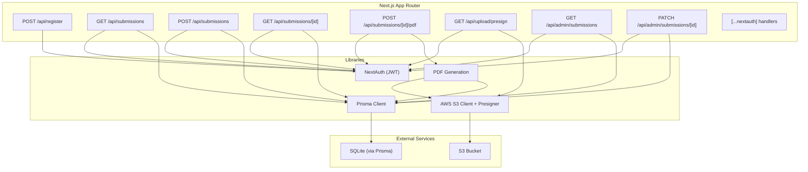
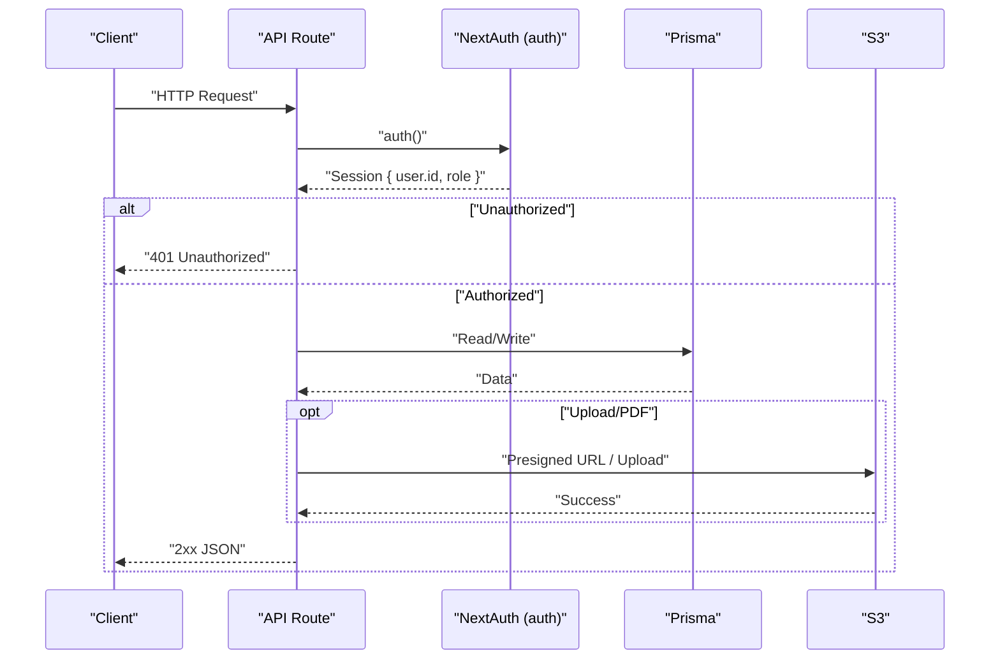
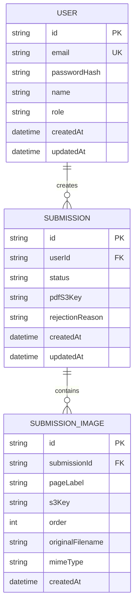
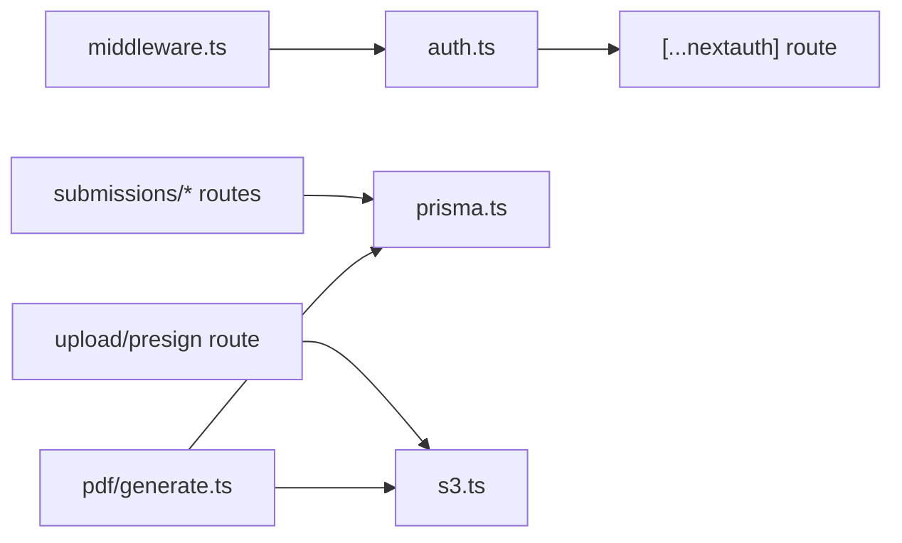

# API Reference

<cite>
**Referenced Files in This Document**
- [src/app/api/register/route.ts](file://src/app/api/register/route.ts)
- [src/app/api/submissions/route.ts](file://src/app/api/submissions/route.ts)
- [src/app/api/submissions/[id]/route.ts](file://src/app/api/submissions/[id]/route.ts)
- [src/app/api/submissions/[id]/pdf/route.ts](file://src/app/api/submissions/[id]/pdf/route.ts)
- [src/app/api/admin/submissions/route.ts](file://src/app/api/admin/submissions/route.ts)
- [src/app/api/admin/submissions/[id]/route.ts](file://src/app/api/admin/submissions/[id]/route.ts)
- [src/app/api/upload/presign/route.ts](file://src/app/api/upload/presign/route.ts)
- [src/app/api/auth/[...nextauth]/route.ts](file://src/app/api/auth/[...nextauth]/route.ts)
- [src/auth.ts](file://src/auth.ts)
- [src/lib/constants.ts](file://src/lib/constants.ts)
- [src/lib/s3.ts](file://src/lib/s3.ts)
- [src/lib/pdf/generate.ts](file://src/lib/pdf/generate.ts)
- [src/lib/prisma.ts](file://src/lib/prisma.ts)
- [prisma/schema.prisma](file://prisma/schema.prisma)
- [src/middleware.ts](file://src/middleware.ts)
- [package.json](file://package.json)
</cite>

## Table of Contents
1. [Introduction](#introduction)
2. [Project Structure](#project-structure)
3. [Core Components](#core-components)
4. [Architecture Overview](#architecture-overview)
5. [Detailed Component Analysis](#detailed-component-analysis)
6. [Dependency Analysis](#dependency-analysis)
7. [Performance Considerations](#performance-considerations)
8. [Troubleshooting Guide](#troubleshooting-guide)
9. [Conclusion](#conclusion)
10. [Appendices](#appendices)

## Introduction
This document provides comprehensive API documentation for Titchybook Creator. It covers authentication via NextAuth integration, user registration, submission management (CRUD, status updates, bulk retrieval), PDF generation for booklet creation, and file upload workflows including presigned URL generation. It also documents request/response schemas, authentication requirements, error codes, status messages, curl examples, SDK integration guidance, rate limiting considerations, API versioning, backward compatibility, and deprecation policies.

## Project Structure
The API surface is implemented as Next.js App Router API routes under src/app/api. Authentication is handled by NextAuth with JWT session strategy. Data persistence uses Prisma ORM against a SQLite database. AWS S3 is used for file storage with signed URLs for uploads and downloads.

**Diagram sources**
- [src/app/api/register/route.ts:1-47](file://src/app/api/register/route.ts#L1-L47)
- [src/app/api/submissions/route.ts:1-96](file://src/app/api/submissions/route.ts#L1-L96)
- [src/app/api/submissions/[id]/route.ts](file://src/app/api/submissions/[id]/route.ts#L1-L37)
- [src/app/api/submissions/[id]/pdf/route.ts](file://src/app/api/submissions/[id]/pdf/route.ts#L1-L27)
- [src/app/api/admin/submissions/route.ts:1-38](file://src/app/api/admin/submissions/route.ts#L1-L38)
- [src/app/api/admin/submissions/[id]/route.ts](file://src/app/api/admin/submissions/[id]/route.ts#L1-L63)
- [src/app/api/upload/presign/route.ts:1-38](file://src/app/api/upload/presign/route.ts#L1-L38)
- [src/app/api/auth/[...nextauth]/route.ts](file://src/app/api/auth/[...nextauth]/route.ts#L1-L3)
- [src/auth.ts:1-80](file://src/auth.ts#L1-L80)
- [src/lib/s3.ts:1-81](file://src/lib/s3.ts#L1-L81)
- [src/lib/pdf/generate.ts:1-112](file://src/lib/pdf/generate.ts#L1-L112)
- [src/lib/prisma.ts:1-10](file://src/lib/prisma.ts#L1-L10)

**Section sources**
- [src/app/api/register/route.ts:1-47](file://src/app/api/register/route.ts#L1-L47)
- [src/app/api/submissions/route.ts:1-96](file://src/app/api/submissions/route.ts#L1-L96)
- [src/app/api/submissions/[id]/route.ts](file://src/app/api/submissions/[id]/route.ts#L1-L37)
- [src/app/api/submissions/[id]/pdf/route.ts](file://src/app/api/submissions/[id]/pdf/route.ts#L1-L27)
- [src/app/api/admin/submissions/route.ts:1-38](file://src/app/api/admin/submissions/route.ts#L1-L38)
- [src/app/api/admin/submissions/[id]/route.ts](file://src/app/api/admin/submissions/[id]/route.ts#L1-L63)
- [src/app/api/upload/presign/route.ts:1-38](file://src/app/api/upload/presign/route.ts#L1-L38)
- [src/app/api/auth/[...nextauth]/route.ts](file://src/app/api/auth/[...nextauth]/route.ts#L1-L3)
- [src/auth.ts:1-80](file://src/auth.ts#L1-L80)
- [src/lib/constants.ts:1-49](file://src/lib/constants.ts#L1-L49)
- [src/lib/s3.ts:1-81](file://src/lib/s3.ts#L1-L81)
- [src/lib/pdf/generate.ts:1-112](file://src/lib/pdf/generate.ts#L1-L112)
- [src/lib/prisma.ts:1-10](file://src/lib/prisma.ts#L1-L10)
- [prisma/schema.prisma:1-48](file://prisma/schema.prisma#L1-L48)
- [src/middleware.ts:1-6](file://src/middleware.ts#L1-L6)
- [package.json:1-43](file://package.json#L1-L43)

## Core Components
- Authentication: NextAuth with Credentials provider and JWT session strategy. Exposes handlers for NextAuth and an auth helper for route guards.
- Data Access: Prisma client configured globally.
- Storage: AWS S3 via client and presigner; helpers for presigned upload/download and key building.
- PDF Generation: Asynchronous pipeline to compose A4 landscape PDFs from 8 images and upload to S3.

**Section sources**
- [src/auth.ts:1-80](file://src/auth.ts#L1-L80)
- [src/lib/prisma.ts:1-10](file://src/lib/prisma.ts#L1-L10)
- [src/lib/s3.ts:1-81](file://src/lib/s3.ts#L1-L81)
- [src/lib/pdf/generate.ts:1-112](file://src/lib/pdf/generate.ts#L1-L112)

## Architecture Overview
The API follows a layered architecture:
- Routes: Define endpoints and request/response handling.
- Auth: Enforce session checks and role-based access.
- Validation: Zod schemas for request bodies.
- Persistence: Prisma models for Users, Submissions, and SubmissionImages.
- Storage: S3 for images and generated PDFs.
- PDF Engine: pdf-lib composition with image processing.

**Diagram sources**
- [src/app/api/submissions/route.ts:1-96](file://src/app/api/submissions/route.ts#L1-L96)
- [src/app/api/admin/submissions/route.ts:1-38](file://src/app/api/admin/submissions/route.ts#L1-L38)
- [src/app/api/upload/presign/route.ts:1-38](file://src/app/api/upload/presign/route.ts#L1-L38)
- [src/app/api/submissions/[id]/pdf/route.ts](file://src/app/api/submissions/[id]/pdf/route.ts#L1-L27)
- [src/auth.ts:1-80](file://src/auth.ts#L1-L80)
- [src/lib/prisma.ts:1-10](file://src/lib/prisma.ts#L1-L10)
- [src/lib/s3.ts:1-81](file://src/lib/s3.ts#L1-L81)

## Detailed Component Analysis

### Authentication Endpoints
- Endpoint: [src/app/api/auth/[...nextauth]/route.ts](file://src/app/api/auth/[...nextauth]/route.ts#L1-L3)
  - Methods: GET, POST
  - Purpose: Delegates NextAuth handlers for sign-in/sign-out and session management.
  - Authentication requirement: None for handlers themselves; routes are protected by NextAuth and middleware.
  - Response: NextAuth-managed session cookies and redirects as per NextAuth configuration.

- Session Guard:
  - Route protection uses the auth helper imported from [src/auth.ts:1-80](file://src/auth.ts#L1-L80).
  - Middleware enforces auth for protected paths: [src/middleware.ts:1-6](file://src/middleware.ts#L1-L6).

- Roles:
  - Users have role "USER".
  - Admins have role "ADMIN". Checked in admin endpoints.

**Section sources**
- [src/app/api/auth/[...nextauth]/route.ts](file://src/app/api/auth/[...nextauth]/route.ts#L1-L3)
- [src/auth.ts:1-80](file://src/auth.ts#L1-L80)
- [src/middleware.ts:1-6](file://src/middleware.ts#L1-L6)

### User Registration
- Endpoint: POST /api/register
- Request body schema:
  - name: string (required)
  - email: string (valid email)
  - password: string (minimum 8 characters)
- Response:
  - 201 Created on success with { success: true }
  - 400 Bad Request on validation failure or duplicate email
  - 500 Internal Server Error on unexpected errors
- Behavior:
  - Validates input with Zod.
  - Checks uniqueness by email.
  - Hashes password and creates user record.

curl example:
- curl -X POST https://your-host/api/register -H "Content-Type: application/json" -d '{"name":"Alice","email":"alice@example.com","password":"securepass"}'

**Section sources**
- [src/app/api/register/route.ts:1-47](file://src/app/api/register/route.ts#L1-L47)
- [src/lib/constants.ts:1-49](file://src/lib/constants.ts#L1-L49)

### Submission Management

#### List Submissions (User)
- Endpoint: GET /api/submissions
- Authentication: Required (JWT session)
- Response: { submissions: Submission[] }
- Notes: Returns only submissions owned by the current user, ordered by creation date descending.

**Section sources**
- [src/app/api/submissions/route.ts:1-96](file://src/app/api/submissions/route.ts#L1-L96)

#### Create Submission (User)
- Endpoint: POST /api/submissions
- Authentication: Required (JWT session)
- Request body schema:
  - images: array of 8 entries
    - pageLabel: enum value from PAGE_LABELS
    - s3Key: string (non-empty)
    - order: integer between 0 and 7
    - originalFilename: string (non-empty)
    - mimeType: string (non-empty)
- Validation:
  - Ensures exactly 8 unique page labels.
  - Uses Zod schema for request parsing.
- Response:
  - 201 Created with { submission: { id, status } }
  - 400 Bad Request on validation or missing labels
  - 500 Internal Server Error on unexpected errors
- Behavior:
  - Creates submission and associated images in a transaction.
  - Triggers asynchronous PDF generation.

curl example:
- curl -X POST https://your-host/api/submissions -H "Authorization: Bearer <JWT>" -H "Content-Type: application/json" -d '{"images":[{"pageLabel":"FRONT_COVER","s3Key":"...","order":0,"originalFilename":"cover.jpg","mimeType":"image/jpeg"},{"pageLabel":"PAGE_2","s3Key":"...","order":1,"originalFilename":"page2.jpg","mimeType":"image/jpeg"},...]}' 

**Section sources**
- [src/app/api/submissions/route.ts:1-96](file://src/app/api/submissions/route.ts#L1-L96)
- [src/lib/constants.ts:1-49](file://src/lib/constants.ts#L1-L49)

#### Get Submission (User/Admin)
- Endpoint: GET /api/submissions/[id]
- Authentication: Required (JWT session)
- Authorization: Owner of submission OR ADMIN
- Response:
  - { submission: Submission, pdfDownloadUrl: string|null }
  - pdfDownloadUrl is a presigned URL if pdfS3Key exists
- Behavior:
  - Fetches submission with images ordered by position.
  - Generates presigned download URL for PDF if present.

curl example:
- curl -X GET https://your-host/api/submissions/<submission-id> -H "Authorization: Bearer <JWT>"

**Section sources**
- [src/app/api/submissions/[id]/route.ts](file://src/app/api/submissions/[id]/route.ts#L1-L37)
- [src/lib/s3.ts:1-81](file://src/lib/s3.ts#L1-L81)

#### Regenerate PDF (User/Admin)
- Endpoint: POST /api/submissions/[id]/pdf
- Authentication: Required (JWT session)
- Authorization: Owner of submission OR ADMIN
- Response:
  - 200 OK with { success: true, pdfS3Key }
  - 401 Unauthorized
  - 500 Internal Server Error on generation failure
- Behavior:
  - Invokes PDF generation pipeline.

curl example:
- curl -X POST https://your-host/api/submissions/<submission-id>/pdf -H "Authorization: Bearer <JWT>"

**Section sources**
- [src/app/api/submissions/[id]/pdf/route.ts](file://src/app/api/submissions/[id]/pdf/route.ts#L1-L27)
- [src/lib/pdf/generate.ts:1-112](file://src/lib/pdf/generate.ts#L1-L112)

#### Admin: List Submissions with Presigned PDF URLs
- Endpoint: GET /api/admin/submissions
- Authentication: Required (JWT session)
- Authorization: ADMIN
- Query parameters:
  - status: optional filter by SubmissionStatus
- Response:
  - { submissions: Submission[] } with pdfDownloadUrl generated via presigned URL if pdfS3Key exists
- Behavior:
  - Retrieves all submissions optionally filtered by status.
  - Builds presigned download URLs for PDFs.

curl example:
- curl -X GET 'https://your-host/api/admin/submissions?status=PENDING' -H "Authorization: Bearer <ADMIN-JWT>"

**Section sources**
- [src/app/api/admin/submissions/route.ts:1-38](file://src/app/api/admin/submissions/route.ts#L1-L38)
- [src/lib/s3.ts:1-81](file://src/lib/s3.ts#L1-L81)

#### Admin: Approve/Reject Submission
- Endpoint: PATCH /api/admin/submissions/[id]
- Authentication: Required (JWT session)
- Authorization: ADMIN
- Request body schema:
  - action: "APPROVE" | "REJECT"
  - rejectionReason: string (optional when rejecting)
- Response:
  - 200 OK with updated submission
  - 400 Bad Request on invalid payload
  - 403 Forbidden if not admin
  - 404 Not Found if submission does not exist
  - 500 Internal Server Error on unexpected errors
- Behavior:
  - Updates status and clears/rejects reason accordingly.

curl example:
- curl -X PATCH https://your-host/api/admin/submissions/<submission-id> -H "Authorization: Bearer <ADMIN-JWT>" -H "Content-Type: application/json" -d '{"action":"APPROVE"}'

**Section sources**
- [src/app/api/admin/submissions/[id]/route.ts](file://src/app/api/admin/submissions/[id]/route.ts#L1-L63)
- [src/lib/constants.ts:1-49](file://src/lib/constants.ts#L1-L49)

### Upload Workflow

#### Presigned Upload URL
- Endpoint: GET /api/upload/presign
- Authentication: Required (JWT session)
- Query parameters:
  - filename: required
  - contentType: required (must be one of accepted image MIME types)
  - submissionId: required
  - pageLabel: required
- Response:
  - { uploadUrl: string, s3Key: string }
- Behavior:
  - Validates required parameters and content type.
  - Builds S3 key using helper and returns a presigned PUT URL.
  - Upload window: 10 minutes.

curl example:
- curl -X GET 'https://your-host/api/upload/presign?filename=front-cover.jpg&contentType=image/jpeg&submissionId=<uuid>&pageLabel=FRONT_COVER' -H "Authorization: Bearer <JWT>"

**Section sources**
- [src/app/api/upload/presign/route.ts:1-38](file://src/app/api/upload/presign/route.ts#L1-L38)
- [src/lib/constants.ts:1-49](file://src/lib/constants.ts#L1-L49)
- [src/lib/s3.ts:1-81](file://src/lib/s3.ts#L1-L81)

#### File Upload Workflow
- Steps:
  1. Call presign endpoint to obtain uploadUrl and s3Key.
  2. Upload file directly to S3 using the returned uploadUrl.
  3. Store s3Key along with metadata (pageLabel, order, filenames) in a submission.
- Notes:
  - Accepted content types: JPEG, PNG, WebP.
  - Maximum file size is enforced in constants.

**Section sources**
- [src/app/api/upload/presign/route.ts:1-38](file://src/app/api/upload/presign/route.ts#L1-L38)
- [src/lib/constants.ts:1-49](file://src/lib/constants.ts#L1-L49)
- [src/lib/s3.ts:1-81](file://src/lib/s3.ts#L1-L81)

### PDF Generation Pipeline
- Endpoint: POST /api/submissions/[id]/pdf (also invoked internally)
- Flow:
  1. Lock submission by setting status to PROCESSING.
  2. Fetch 8 images by pageLabel from DB.
  3. Download images from S3.
  4. Process images (resize, crop, rotate) in parallel.
  5. Compose A4 landscape PDF using pdf-lib.
  6. Upload PDF to S3 and update submission with pdfS3Key.
  7. Reset status to PENDING (admin approval required after regeneration).
- Response:
  - 200 OK with { success: true, pdfS3Key }
  - 500 Internal Server Error on failure

**Diagram sources**
- [src/lib/pdf/generate.ts:1-112](file://src/lib/pdf/generate.ts#L1-L112)
- [src/lib/s3.ts:1-81](file://src/lib/s3.ts#L1-L81)
- [src/lib/constants.ts:1-49](file://src/lib/constants.ts#L1-L49)

**Section sources**
- [src/lib/pdf/generate.ts:1-112](file://src/lib/pdf/generate.ts#L1-L112)
- [src/lib/s3.ts:1-81](file://src/lib/s3.ts#L1-L81)
- [src/lib/constants.ts:1-49](file://src/lib/constants.ts#L1-L49)

### Data Models

**Diagram sources**
- [prisma/schema.prisma:1-48](file://prisma/schema.prisma#L1-L48)

## Dependency Analysis
- Authentication: NextAuth (Credentials provider, JWT session).
- Validation: Zod schemas for requests.
- Persistence: Prisma models for User, Submission, SubmissionImage.
- Storage: AWS S3 client and presigner.
- PDF: pdf-lib for composition, sharp for image processing (referenced in constants and PDF generation).
- Middleware: Protects routes under /dashboard, /create, /admin.

**Diagram sources**
- [src/auth.ts:1-80](file://src/auth.ts#L1-L80)
- [src/app/api/submissions/route.ts:1-96](file://src/app/api/submissions/route.ts#L1-L96)
- [src/app/api/admin/submissions/route.ts:1-38](file://src/app/api/admin/submissions/route.ts#L1-L38)
- [src/app/api/upload/presign/route.ts:1-38](file://src/app/api/upload/presign/route.ts#L1-L38)
- [src/app/api/submissions/[id]/pdf/route.ts](file://src/app/api/submissions/[id]/pdf/route.ts#L1-L27)
- [src/lib/prisma.ts:1-10](file://src/lib/prisma.ts#L1-L10)
- [src/lib/s3.ts:1-81](file://src/lib/s3.ts#L1-L81)
- [src/lib/pdf/generate.ts:1-112](file://src/lib/pdf/generate.ts#L1-L112)
- [src/middleware.ts:1-6](file://src/middleware.ts#L1-L6)

**Section sources**
- [src/auth.ts:1-80](file://src/auth.ts#L1-L80)
- [src/lib/prisma.ts:1-10](file://src/lib/prisma.ts#L1-L10)
- [src/lib/s3.ts:1-81](file://src/lib/s3.ts#L1-L81)
- [src/lib/pdf/generate.ts:1-112](file://src/lib/pdf/generate.ts#L1-L112)
- [src/middleware.ts:1-6](file://src/middleware.ts#L1-L6)

## Performance Considerations
- Asynchronous PDF generation: Background execution prevents blocking API responses.
- Parallel operations: Image downloads and processing are executed concurrently.
- Presigned URLs: Direct S3 uploads reduce server bandwidth and latency.
- Pagination: Admin listing supports filtering by status to limit result sets.
- Rate limiting: Not implemented at the API level; consider adding rate limiting middleware or CDN controls.

[No sources needed since this section provides general guidance]

## Troubleshooting Guide
Common errors and resolutions:
- 401 Unauthorized
  - Cause: Missing or invalid JWT session.
  - Resolution: Authenticate via NextAuth and include a valid session.
- 403 Forbidden
  - Cause: Non-admin attempts admin endpoint.
  - Resolution: Use an admin account or appropriate credentials.
- 400 Bad Request
  - Cause: Validation failures (missing fields, invalid content type, wrong number of images, duplicate labels).
  - Resolution: Ensure request matches schemas and accepted content types.
- 404 Not Found
  - Cause: Submission ID not found.
  - Resolution: Verify submission ownership or admin privileges.
- 500 Internal Server Error
  - Cause: Unexpected server errors during processing or PDF generation.
  - Resolution: Retry; check logs for detailed error messages.

**Section sources**
- [src/app/api/register/route.ts:1-47](file://src/app/api/register/route.ts#L1-L47)
- [src/app/api/submissions/route.ts:1-96](file://src/app/api/submissions/route.ts#L1-L96)
- [src/app/api/submissions/[id]/route.ts](file://src/app/api/submissions/[id]/route.ts#L1-L37)
- [src/app/api/admin/submissions/route.ts:1-38](file://src/app/api/admin/submissions/route.ts#L1-L38)
- [src/app/api/admin/submissions/[id]/route.ts](file://src/app/api/admin/submissions/[id]/route.ts#L1-L63)
- [src/app/api/upload/presign/route.ts:1-38](file://src/app/api/upload/presign/route.ts#L1-L38)
- [src/app/api/submissions/[id]/pdf/route.ts](file://src/app/api/submissions/[id]/pdf/route.ts#L1-L27)

## Conclusion
Titchybook Creator’s API provides a secure, validated, and scalable interface for user registration, submission management, and PDF generation. Authentication is handled centrally via NextAuth with JWT sessions, while uploads and PDF generation leverage AWS S3 and pdf-lib respectively. Administrators can manage submissions and approve/reject them. The design emphasizes asynchronous processing and presigned URLs for optimal performance.

[No sources needed since this section summarizes without analyzing specific files]

## Appendices

### API Versioning, Backward Compatibility, and Deprecation
- Versioning: No explicit API versioning scheme is implemented in the current codebase.
- Backward compatibility: Maintained by avoiding breaking changes to request/response shapes and using string enums for statuses.
- Deprecation policy: Not defined; consider introducing a version header and deprecation headers for future changes.

[No sources needed since this section provides general guidance]

### Authentication Requirements
- All user-facing endpoints require a valid JWT session.
- Admin endpoints additionally require role "ADMIN".

**Section sources**
- [src/auth.ts:1-80](file://src/auth.ts#L1-L80)
- [src/app/api/submissions/route.ts:1-96](file://src/app/api/submissions/route.ts#L1-L96)
- [src/app/api/admin/submissions/route.ts:1-38](file://src/app/api/admin/submissions/route.ts#L1-L38)

### Request/Response Schemas

- POST /api/register
  - Request: { name: string, email: string, password: string }
  - Response: 201 { success: true } or 400/500

- POST /api/submissions
  - Request: { images: ImageEntry[] (exactly 8) }
  - ImageEntry: { pageLabel, s3Key, order, originalFilename, mimeType }
  - Response: 201 { submission: { id, status } } or 400/500

- GET /api/submissions
  - Response: { submissions: Submission[] }

- GET /api/submissions/[id]
  - Response: { submission, pdfDownloadUrl }

- POST /api/submissions/[id]/pdf
  - Response: 200 { success: true, pdfS3Key } or 500

- GET /api/admin/submissions
  - Query: status (optional)
  - Response: { submissions: Submission[] }

- PATCH /api/admin/submissions/[id]
  - Request: { action: "APPROVE"|"REJECT", rejectionReason? }
  - Response: 200 updated submission or 400/403/404/500

- GET /api/upload/presign
  - Query: filename, contentType, submissionId, pageLabel
  - Response: { uploadUrl, s3Key }

**Section sources**
- [src/app/api/register/route.ts:1-47](file://src/app/api/register/route.ts#L1-L47)
- [src/app/api/submissions/route.ts:1-96](file://src/app/api/submissions/route.ts#L1-L96)
- [src/app/api/submissions/[id]/route.ts](file://src/app/api/submissions/[id]/route.ts#L1-L37)
- [src/app/api/submissions/[id]/pdf/route.ts](file://src/app/api/submissions/[id]/pdf/route.ts#L1-L27)
- [src/app/api/admin/submissions/route.ts:1-38](file://src/app/api/admin/submissions/route.ts#L1-L38)
- [src/app/api/admin/submissions/[id]/route.ts](file://src/app/api/admin/submissions/[id]/route.ts#L1-L63)
- [src/app/api/upload/presign/route.ts:1-38](file://src/app/api/upload/presign/route.ts#L1-L38)
- [src/lib/constants.ts:1-49](file://src/lib/constants.ts#L1-L49)

### Error Codes and Messages
- 400 Bad Request: Validation errors, missing parameters, invalid content type
- 401 Unauthorized: No active session
- 403 Forbidden: Insufficient permissions (admin-only)
- 404 Not Found: Resource not found
- 500 Internal Server Error: Unexpected server errors

**Section sources**
- [src/app/api/register/route.ts:1-47](file://src/app/api/register/route.ts#L1-L47)
- [src/app/api/submissions/route.ts:1-96](file://src/app/api/submissions/route.ts#L1-L96)
- [src/app/api/submissions/[id]/route.ts](file://src/app/api/submissions/[id]/route.ts#L1-L37)
- [src/app/api/admin/submissions/route.ts:1-38](file://src/app/api/admin/submissions/route.ts#L1-L38)
- [src/app/api/admin/submissions/[id]/route.ts](file://src/app/api/admin/submissions/[id]/route.ts#L1-L63)
- [src/app/api/upload/presign/route.ts:1-38](file://src/app/api/upload/presign/route.ts#L1-L38)
- [src/app/api/submissions/[id]/pdf/route.ts](file://src/app/api/submissions/[id]/pdf/route.ts#L1-L27)

### curl Examples
- Register: 
  - curl -X POST https://your-host/api/register -H "Content-Type: application/json" -d '{"name":"Alice","email":"alice@example.com","password":"securepass"}'
- Create Submission:
  - curl -X POST https://your-host/api/submissions -H "Authorization: Bearer <JWT>" -H "Content-Type: application/json" -d '{"images":[...]}' 
- Get Submission:
  - curl -X GET https://your-host/api/submissions/<submission-id> -H "Authorization: Bearer <JWT>"
- Regenerate PDF:
  - curl -X POST https://your-host/api/submissions/<submission-id>/pdf -H "Authorization: Bearer <JWT>"
- Admin List:
  - curl -X GET 'https://your-host/api/admin/submissions?status=PENDING' -H "Authorization: Bearer <ADMIN-JWT>"
- Admin Approve/Reject:
  - curl -X PATCH https://your-host/api/admin/submissions/<submission-id> -H "Authorization: Bearer <ADMIN-JWT>" -H "Content-Type: application/json" -d '{"action":"APPROVE"}'
- Presigned Upload:
  - curl -X GET 'https://your-host/api/upload/presign?filename=front-cover.jpg&contentType=image/jpeg&submissionId=<uuid>&pageLabel=FRONT_COVER' -H "Authorization: Bearer <JWT>"

[No sources needed since this section provides general guidance]

### SDK Integration Guide
- Frontend SDK recommendations:
  - Use fetch or a lightweight HTTP client.
  - Persist JWT from NextAuth-managed session.
  - Implement retry with exponential backoff for transient errors.
  - Cache presigned URLs per upload session to avoid repeated calls.
- Backend SDK recommendations:
  - Use AWS SDK v3 for S3 operations.
  - Wrap PDF generation in a queue/job system for scalability.
  - Add structured logging and monitoring around PDF generation steps.

[No sources needed since this section provides general guidance]

### Rate Limiting Information
- Not implemented in the current codebase.
- Recommended approaches:
  - Per-IP or per-user quotas with Redis or in-memory store.
  - Leverage CDN or API gateway rate limiting.
  - Apply stricter limits on PDF generation and bulk admin operations.

[No sources needed since this section provides general guidance]