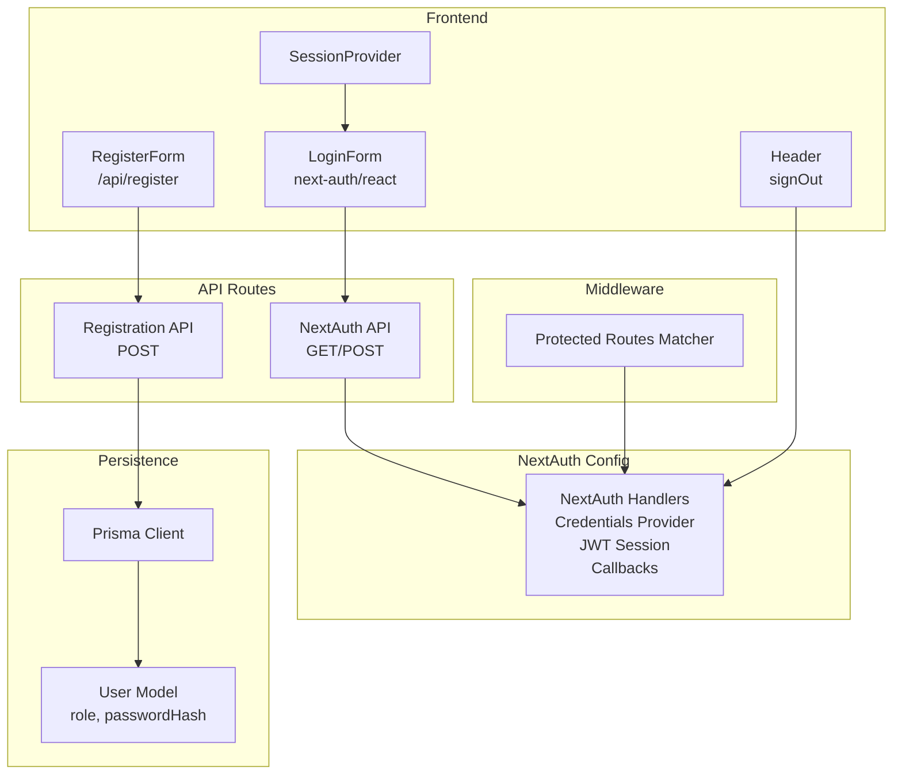
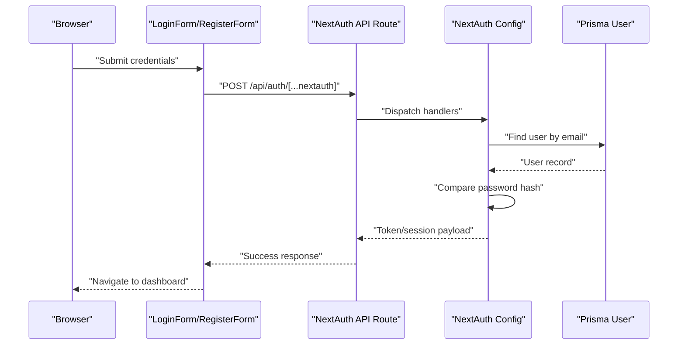
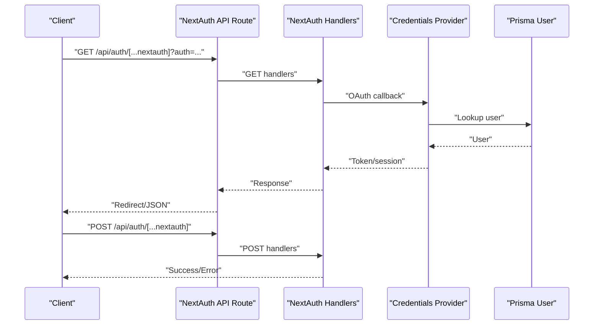
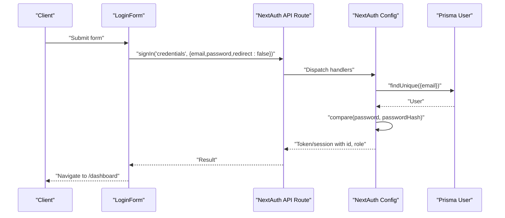
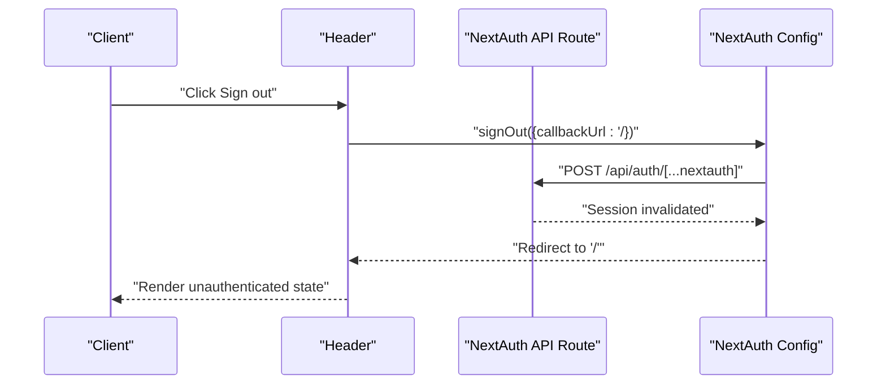
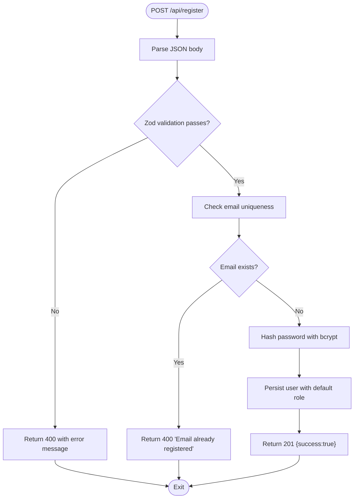
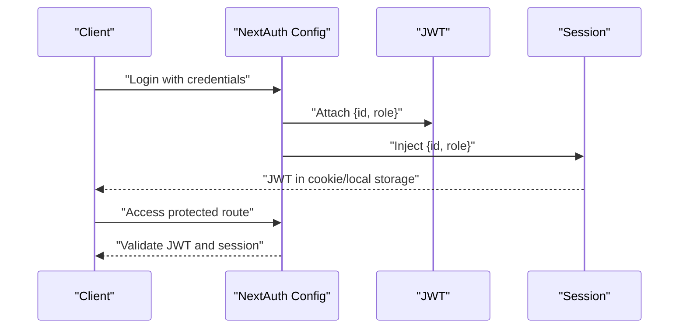
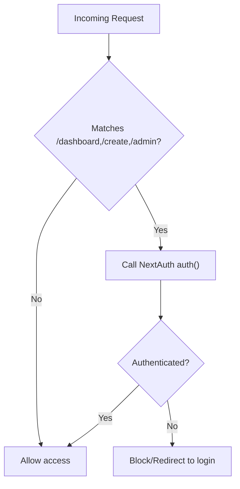
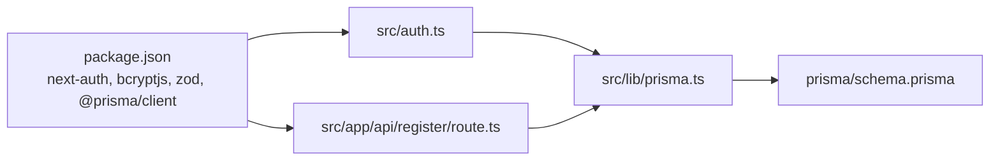

# Authentication APIs

<cite>
**Referenced Files in This Document**
- [src/app/api/auth/[...nextauth]/route.ts](file://src/app/api/auth/[...nextauth]/route.ts)
- [src/auth.ts](file://src/auth.ts)
- [src/middleware.ts](file://src/middleware.ts)
- [src/components/auth/LoginForm.tsx](file://src/components/auth/LoginForm.tsx)
- [src/components/auth/RegisterForm.tsx](file://src/components/auth/RegisterForm.tsx)
- [src/app/api/register/route.ts](file://src/app/api/register/route.ts)
- [src/lib/prisma.ts](file://src/lib/prisma.ts)
- [prisma/schema.prisma](file://prisma/schema.prisma)
- [src/components/layout/Header.tsx](file://src/components/layout/Header.tsx)
- [src/components/Providers.tsx](file://src/components/Providers.tsx)
- [src/app/(auth)/login/page.tsx](file://src/app/(auth)/login/page.tsx)
- [package.json](file://package.json)
</cite>

## Table of Contents
1. [Introduction](#introduction)
2. [Project Structure](#project-structure)
3. [Core Components](#core-components)
4. [Architecture Overview](#architecture-overview)
5. [Detailed Component Analysis](#detailed-component-analysis)
6. [Dependency Analysis](#dependency-analysis)
7. [Performance Considerations](#performance-considerations)
8. [Troubleshooting Guide](#troubleshooting-guide)
9. [Conclusion](#conclusion)

## Introduction
This document provides comprehensive API documentation for authentication endpoints in the application. It covers NextAuth integration endpoints (including OAuth flows, session management, and callback handling), login/logout endpoints with JWT token handling and session persistence, and the user registration API with validation rules, password hashing, and role assignment. It also documents request/response schemas, error responses, security headers, examples for social login integration, custom callbacks, and session refresh mechanisms, along with authentication middleware requirements, token expiration handling, and logout procedures.

## Project Structure
Authentication-related code is organized across API routes, NextAuth configuration, middleware, and frontend components:
- NextAuth integration endpoint: a catch-all API route that exposes NextAuth handlers for GET/POST.
- NextAuth configuration: defines providers, session strategy, pages, and callbacks.
- Middleware: enforces protected routes via NextAuth’s auth function.
- Registration API: validates input, checks uniqueness, hashes passwords, and persists users.
- Frontend forms: login and registration UIs that integrate with NextAuth and the registration API.
- Providers wrapper: wraps the app with NextAuth’s SessionProvider for client-side session management.
- Database schema: defines the User model with role and password hash fields.

**Diagram sources**
- [src/app/api/auth/[...nextauth]/route.ts](file://src/app/api/auth/[...nextauth]/route.ts#L1-L3)
- [src/auth.ts:27-79](file://src/auth.ts#L27-L79)
- [src/middleware.ts:1-5](file://src/middleware.ts#L1-L5)
- [src/app/api/register/route.ts:12-46](file://src/app/api/register/route.ts#L12-L46)
- [src/components/auth/LoginForm.tsx:19-32](file://src/components/auth/LoginForm.tsx#L19-L32)
- [src/components/auth/RegisterForm.tsx:20-38](file://src/components/auth/RegisterForm.tsx#L20-L38)
- [src/components/Providers.tsx:3-6](file://src/components/Providers.tsx#L3-L6)
- [src/components/layout/Header.tsx:42-46](file://src/components/layout/Header.tsx#L42-L46)
- [src/lib/prisma.ts:1-10](file://src/lib/prisma.ts#L1-L10)
- [prisma/schema.prisma:10-19](file://prisma/schema.prisma#L10-L19)

**Section sources**
- [src/app/api/auth/[...nextauth]/route.ts](file://src/app/api/auth/[...nextauth]/route.ts#L1-L3)
- [src/auth.ts:27-79](file://src/auth.ts#L27-L79)
- [src/middleware.ts:1-5](file://src/middleware.ts#L1-L5)
- [src/app/api/register/route.ts:12-46](file://src/app/api/register/route.ts#L12-L46)
- [src/components/auth/LoginForm.tsx:19-32](file://src/components/auth/LoginForm.tsx#L19-L32)
- [src/components/auth/RegisterForm.tsx:20-38](file://src/components/auth/RegisterForm.tsx#L20-L38)
- [src/components/Providers.tsx:3-6](file://src/components/Providers.tsx#L3-L6)
- [src/components/layout/Header.tsx:42-46](file://src/components/layout/Header.tsx#L42-L46)
- [src/lib/prisma.ts:1-10](file://src/lib/prisma.ts#L1-L10)
- [prisma/schema.prisma:10-19](file://prisma/schema.prisma#L10-L19)

## Core Components
- NextAuth API route: Exposes NextAuth handlers for GET/POST to support OAuth flows, callbacks, and session management.
- NextAuth configuration: Defines the Credentials provider, JWT session strategy, pages, and callbacks to attach role and id to tokens and sessions.
- Middleware: Protects routes by enforcing NextAuth’s auth function with a matcher for protected paths.
- Registration API: Validates inputs, checks email uniqueness, hashes passwords, and creates users with default role.
- Login form: Submits credentials to NextAuth’s credentials provider and navigates on success.
- Registration form: Calls the registration API and redirects on success.
- SessionProvider: Wraps the app to enable client-side session access.
- Logout: Uses next-auth/react’s signOut with a callback URL.

**Section sources**
- [src/app/api/auth/[...nextauth]/route.ts](file://src/app/api/auth/[...nextauth]/route.ts#L1-L3)
- [src/auth.ts:27-79](file://src/auth.ts#L27-L79)
- [src/middleware.ts:1-5](file://src/middleware.ts#L1-L5)
- [src/app/api/register/route.ts:12-46](file://src/app/api/register/route.ts#L12-L46)
- [src/components/auth/LoginForm.tsx:19-32](file://src/components/auth/LoginForm.tsx#L19-L32)
- [src/components/auth/RegisterForm.tsx:20-38](file://src/components/auth/RegisterForm.tsx#L20-L38)
- [src/components/Providers.tsx:3-6](file://src/components/Providers.tsx#L3-L6)
- [src/components/layout/Header.tsx:42-46](file://src/components/layout/Header.tsx#L42-L46)

## Architecture Overview
The authentication architecture integrates NextAuth for server-side session management and JWT tokens, with client-side UI components leveraging next-auth/react for sign-in/sign-out and session access. Protected routes are enforced by middleware that delegates to NextAuth.

**Diagram sources**
- [src/components/auth/LoginForm.tsx:19-32](file://src/components/auth/LoginForm.tsx#L19-L32)
- [src/app/api/auth/[...nextauth]/route.ts](file://src/app/api/auth/[...nextauth]/route.ts#L1-L3)
- [src/auth.ts:35-57](file://src/auth.ts#L35-L57)
- [src/lib/prisma.ts:1-10](file://src/lib/prisma.ts#L1-L10)

## Detailed Component Analysis

### NextAuth Integration Endpoints
- Endpoint: GET/POST /api/auth/[...nextauth]
- Purpose: Expose NextAuth handlers to manage OAuth flows, callbacks, and session lifecycle.
- Behavior:
  - GET: Handles OAuth authorization and callback flows.
  - POST: Handles sign-in/sign-out actions for configured providers.
- Security:
  - Sessions use JWT strategy with custom claims for id and role.
  - Callbacks enrich JWT and session with user metadata.
- Notes:
  - The catch-all route forwards requests to NextAuth handlers.

**Diagram sources**
- [src/app/api/auth/[...nextauth]/route.ts](file://src/app/api/auth/[...nextauth]/route.ts#L1-L3)
- [src/auth.ts:27-79](file://src/auth.ts#L27-L79)
- [src/lib/prisma.ts:1-10](file://src/lib/prisma.ts#L1-L10)

**Section sources**
- [src/app/api/auth/[...nextauth]/route.ts](file://src/app/api/auth/[...nextauth]/route.ts#L1-L3)
- [src/auth.ts:27-79](file://src/auth.ts#L27-L79)

### Login Endpoint (NextAuth Credentials Provider)
- Endpoint: POST /api/auth/[...nextauth]
- Purpose: Authenticate users with email/password via the Credentials provider.
- Request payload:
  - email: string (required)
  - password: string (required)
- Response:
  - On success: Redirects to dashboard and returns success metadata.
  - On failure: Returns error indicating invalid credentials.
- Frontend usage:
  - LoginForm submits credentials to the Credentials provider with redirect disabled.
- Security:
  - Password comparison uses bcrypt.
  - Session strategy is JWT with role and id attached via callbacks.

**Diagram sources**
- [src/components/auth/LoginForm.tsx:19-32](file://src/components/auth/LoginForm.tsx#L19-L32)
- [src/app/api/auth/[...nextauth]/route.ts](file://src/app/api/auth/[...nextauth]/route.ts#L1-L3)
- [src/auth.ts:35-57](file://src/auth.ts#L35-L57)
- [src/lib/prisma.ts:1-10](file://src/lib/prisma.ts#L1-L10)

**Section sources**
- [src/components/auth/LoginForm.tsx:19-32](file://src/components/auth/LoginForm.tsx#L19-L32)
- [src/app/api/auth/[...nextauth]/route.ts](file://src/app/api/auth/[...nextauth]/route.ts#L1-L3)
- [src/auth.ts:35-57](file://src/auth.ts#L35-L57)

### Logout Endpoint (NextAuth)
- Endpoint: POST /api/auth/[...nextauth]
- Purpose: Invalidate current session and clear cookies/tokens.
- Frontend usage:
  - Header component triggers signOut with a callback URL to root.
- Behavior:
  - Clears session and redirects to the specified callback URL.

**Diagram sources**
- [src/components/layout/Header.tsx:42-46](file://src/components/layout/Header.tsx#L42-L46)
- [src/app/api/auth/[...nextauth]/route.ts](file://src/app/api/auth/[...nextauth]/route.ts#L1-L3)
- [src/auth.ts:27-79](file://src/auth.ts#L27-L79)

**Section sources**
- [src/components/layout/Header.tsx:42-46](file://src/components/layout/Header.tsx#L42-L46)
- [src/app/api/auth/[...nextauth]/route.ts](file://src/app/api/auth/[...nextauth]/route.ts#L1-L3)
- [src/auth.ts:27-79](file://src/auth.ts#L27-L79)

### User Registration API
- Endpoint: POST /api/register
- Purpose: Create a new user account with validated credentials.
- Request payload:
  - name: string (required)
  - email: string (required, valid email)
  - password: string (required, minimum 8 characters)
- Validation:
  - Zod schema enforces presence and format.
  - Duplicate email check via Prisma.
- Processing:
  - Hash password using bcrypt.
  - Persist user with default role.
- Responses:
  - 201 Created on success.
  - 400 Bad Request on validation or duplicate email.
  - 500 Internal Server Error on unexpected failures.
- Frontend usage:
  - RegisterForm posts to /api/register and redirects to login on success.

**Diagram sources**
- [src/app/api/register/route.ts:12-46](file://src/app/api/register/route.ts#L12-L46)
- [src/lib/prisma.ts:1-10](file://src/lib/prisma.ts#L1-L10)

**Section sources**
- [src/app/api/register/route.ts:12-46](file://src/app/api/register/route.ts#L12-L46)
- [src/components/auth/RegisterForm.tsx:20-38](file://src/components/auth/RegisterForm.tsx#L20-L38)
- [prisma/schema.prisma:10-19](file://prisma/schema.prisma#L10-L19)

### Session Management and JWT Token Handling
- Strategy: JWT session with custom claims.
- Claims:
  - id: user identifier
  - role: user role
- Callbacks:
  - jwt: attaches id and role to the token when a user logs in.
  - session: injects id and role into the session object.
- Persistence:
  - Sessions are stored as encrypted JWTs; no server-side session store is used.
- Refresh:
  - Clients can re-authenticate to obtain a new JWT; there is no dedicated refresh endpoint in the current implementation.

**Diagram sources**
- [src/auth.ts:65-77](file://src/auth.ts#L65-L77)

**Section sources**
- [src/auth.ts:65-77](file://src/auth.ts#L65-L77)

### Authentication Middleware Requirements
- Purpose: Enforce authentication for protected routes.
- Configuration:
  - matcher: ["dashboard/:path*", "create/:path*", "admin/:path*"]
- Behavior:
  - Delegates to NextAuth’s auth function to validate incoming requests.
  - Blocks unauthenticated requests to protected paths.

**Diagram sources**
- [src/middleware.ts:3-5](file://src/middleware.ts#L3-L5)
- [src/auth.ts:27-79](file://src/auth.ts#L27-L79)

**Section sources**
- [src/middleware.ts:1-5](file://src/middleware.ts#L1-L5)
- [src/auth.ts:27-79](file://src/auth.ts#L27-L79)

### Social Login Integration (Conceptual)
- Current implementation uses the Credentials provider.
- To add OAuth providers (e.g., Google, GitHub):
  - Extend the providers array in NextAuth configuration.
  - Add provider-specific configuration and environment variables.
  - NextAuth handles OAuth authorization and callback flows automatically.

[No sources needed since this section provides conceptual guidance]

### Custom Callbacks (Conceptual)
- The implementation already demonstrates:
  - jwt callback: enriches token with id and role.
  - session callback: injects id and role into session.
- Additional callbacks can be added (e.g., authorizedRoles) to enforce role-based access in middleware or API routes.

[No sources needed since this section provides conceptual guidance]

### Session Refresh Mechanisms (Conceptual)
- The current JWT strategy does not include a dedicated refresh endpoint.
- Typical approaches:
  - Short-lived access tokens with long-lived refresh tokens.
  - Re-authentication to obtain a new JWT.
- Implementation would require adding a refresh endpoint and managing token rotation.

[No sources needed since this section provides conceptual guidance]

## Dependency Analysis
- NextAuth dependency: next-auth v5.x is used for authentication.
- Prisma integration: Prisma client is used for user lookup and persistence.
- Validation: Zod validates registration payloads.
- Password hashing: bcryptjs is used for password hashing.
- Frontend session provider: next-auth/react provides SessionProvider and hooks.

**Diagram sources**
- [package.json:11-24](file://package.json#L11-L24)
- [src/auth.ts:1-4](file://src/auth.ts#L1-L4)
- [src/app/api/register/route.ts:1-4](file://src/app/api/register/route.ts#L1-L4)
- [src/lib/prisma.ts:1-10](file://src/lib/prisma.ts#L1-L10)
- [prisma/schema.prisma:10-19](file://prisma/schema.prisma#L10-L19)

**Section sources**
- [package.json:11-24](file://package.json#L11-L24)
- [src/auth.ts:1-4](file://src/auth.ts#L1-L4)
- [src/app/api/register/route.ts:1-4](file://src/app/api/register/route.ts#L1-L4)
- [src/lib/prisma.ts:1-10](file://src/lib/prisma.ts#L1-L10)
- [prisma/schema.prisma:10-19](file://prisma/schema.prisma#L10-L19)

## Performance Considerations
- Password hashing cost: bcrypt uses a configurable cost; ensure it balances security and performance for your workload.
- Database queries: User lookups are O(log n) with unique index on email.
- Middleware overhead: NextAuth auth() is invoked per protected route; keep matcher precise to minimize checks.
- Token size: JWT includes id and role; avoid adding large payloads to reduce bandwidth.

[No sources needed since this section provides general guidance]

## Troubleshooting Guide
- Invalid credentials during login:
  - Ensure email and password are provided and correct.
  - Verify password hash matches stored value.
- Registration errors:
  - Validation failures return 400 with a specific message.
  - Duplicate email returns 400 with “Email already registered”.
  - Unexpected errors return 500.
- Protected route access denied:
  - Confirm middleware matcher includes the route.
  - Ensure the session is valid and not expired.
- Logout not working:
  - Verify signOut is called with a callback URL.
  - Confirm NextAuth API route is reachable.

**Section sources**
- [src/components/auth/LoginForm.tsx:27-32](file://src/components/auth/LoginForm.tsx#L27-L32)
- [src/app/api/register/route.ts:17-32](file://src/app/api/register/route.ts#L17-L32)
- [src/middleware.ts:3-5](file://src/middleware.ts#L3-L5)
- [src/components/layout/Header.tsx:42-46](file://src/components/layout/Header.tsx#L42-L46)

## Conclusion
The authentication system leverages NextAuth with a JWT session strategy, providing secure login, logout, and protected routing. The registration API ensures robust input validation and password hashing. While the current implementation focuses on credentials-based authentication, the architecture supports extending to OAuth providers and customizing callbacks for advanced scenarios. Middleware enforcement and client-side session management deliver a cohesive authentication experience.