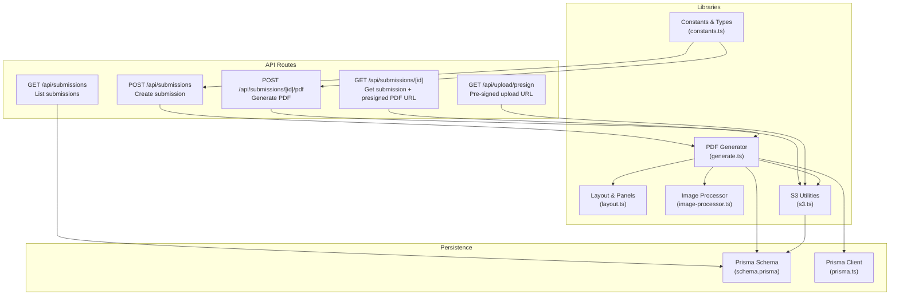
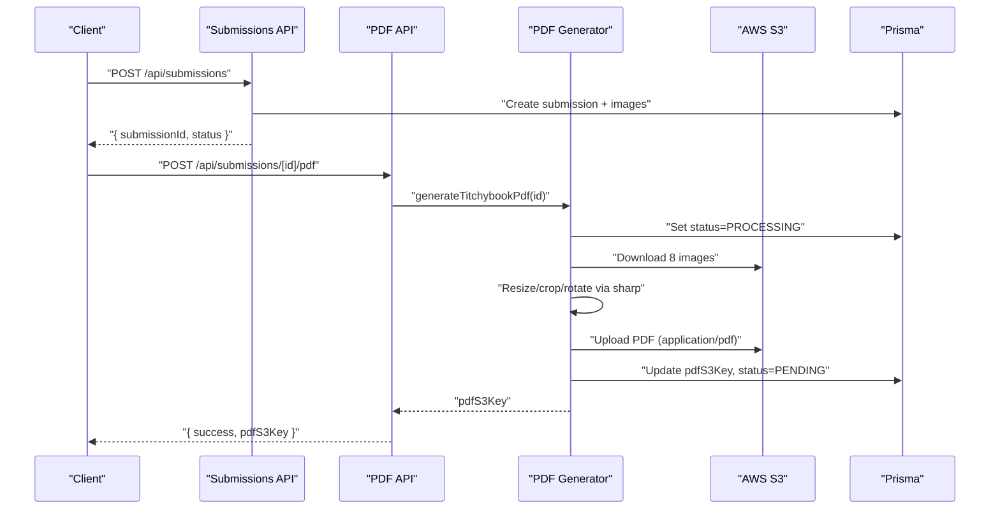
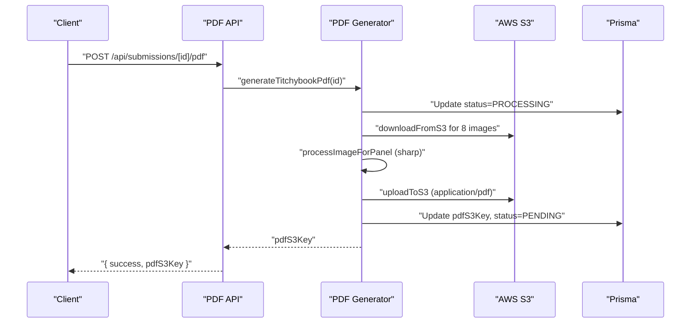
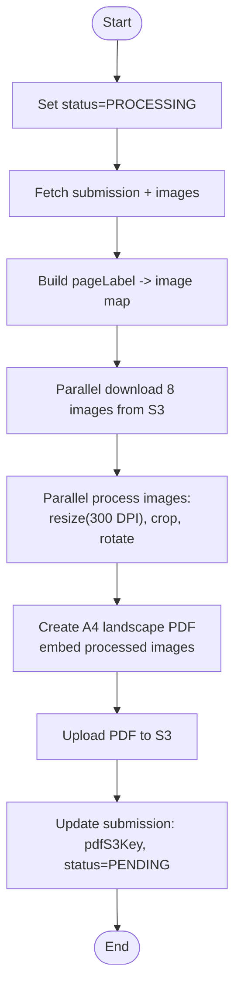
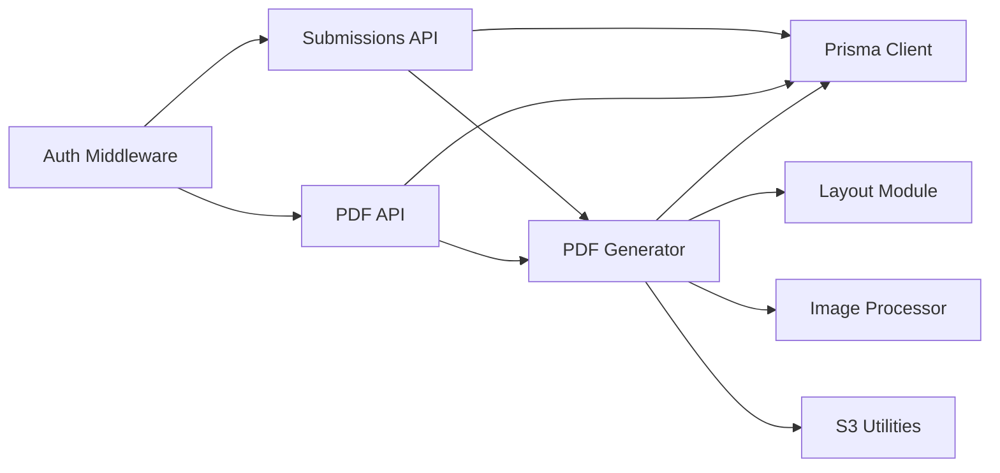

# PDF Generation APIs

<cite>
**Referenced Files in This Document**
- [route.ts](file://src/app/api/submissions/[id]/pdf/route.ts)
- [route.ts](file://src/app/api/submissions/[id]/route.ts)
- [route.ts](file://src/app/api/submissions/route.ts)
- [route.ts](file://src/app/api/upload/presign/route.ts)
- [generate.ts](file://src/lib/pdf/generate.ts)
- [layout.ts](file://src/lib/pdf/layout.ts)
- [image-processor.ts](file://src/lib/pdf/image-processor.ts)
- [s3.ts](file://src/lib/s3.ts)
- [constants.ts](file://src/lib/constants.ts)
- [schema.prisma](file://prisma/schema.prisma)
- [prisma.ts](file://src/lib/prisma.ts)
</cite>

## Table of Contents
1. [Introduction](#introduction)
2. [Project Structure](#project-structure)
3. [Core Components](#core-components)
4. [Architecture Overview](#architecture-overview)
5. [Detailed Component Analysis](#detailed-component-analysis)
6. [Dependency Analysis](#dependency-analysis)
7. [Performance Considerations](#performance-considerations)
8. [Troubleshooting Guide](#troubleshooting-guide)
9. [Conclusion](#conclusion)
10. [Appendices](#appendices)

## Introduction
This document provides comprehensive API documentation for the PDF generation endpoints that produce 8-page micro booklets from uploaded images. It covers request parameters, response formats, error handling, and integration with AWS S3 for storage and delivery. It also explains the generation workflow, quality settings, and output customization options.

## Project Structure
The PDF generation feature spans several API routes and supporting libraries:
- Submission creation and retrieval endpoints
- PDF generation endpoint per submission
- Pre-signed upload endpoint for images
- PDF generation library with layout and image processing
- AWS S3 integration utilities
- Prisma schema for persistence

**Diagram sources**
- [route.ts:1-96](file://src/app/api/submissions/route.ts#L1-L96)
- [route.ts:1-37](file://src/app/api/submissions/[id]/route.ts#L1-L37)
- [route.ts:1-27](file://src/app/api/submissions/[id]/pdf/route.ts#L1-L27)
- [route.ts:1-38](file://src/app/api/upload/presign/route.ts#L1-L38)
- [generate.ts:1-112](file://src/lib/pdf/generate.ts#L1-L112)
- [layout.ts:1-105](file://src/lib/pdf/layout.ts#L1-L105)
- [image-processor.ts:1-30](file://src/lib/pdf/image-processor.ts#L1-L30)
- [s3.ts:1-81](file://src/lib/s3.ts#L1-L81)
- [constants.ts:1-49](file://src/lib/constants.ts#L1-L49)
- [schema.prisma:1-48](file://prisma/schema.prisma#L1-L48)
- [prisma.ts:1-10](file://src/lib/prisma.ts#L1-L10)

**Section sources**
- [route.ts:1-96](file://src/app/api/submissions/route.ts#L1-L96)
- [route.ts:1-37](file://src/app/api/submissions/[id]/route.ts#L1-L37)
- [route.ts:1-27](file://src/app/api/submissions/[id]/pdf/route.ts#L1-L27)
- [route.ts:1-38](file://src/app/api/upload/presign/route.ts#L1-L38)
- [generate.ts:1-112](file://src/lib/pdf/generate.ts#L1-L112)
- [layout.ts:1-105](file://src/lib/pdf/layout.ts#L1-L105)
- [image-processor.ts:1-30](file://src/lib/pdf/image-processor.ts#L1-L30)
- [s3.ts:1-81](file://src/lib/s3.ts#L1-L81)
- [constants.ts:1-49](file://src/lib/constants.ts#L1-L49)
- [schema.prisma:1-48](file://prisma/schema.prisma#L1-L48)
- [prisma.ts:1-10](file://src/lib/prisma.ts#L1-L10)

## Core Components
- Submission creation endpoint validates and persists 8 images with page labels and ordering.
- PDF generation endpoint triggers asynchronous PDF creation and returns a PDF S3 key.
- Pre-signed upload endpoint provides signed URLs for uploading images to S3.
- PDF generator composes an A4 landscape PDF using predefined panel layouts and 300 DPI output.
- S3 utilities manage pre-signed URLs, uploads, and downloads.

**Section sources**
- [route.ts:35-95](file://src/app/api/submissions/route.ts#L35-L95)
- [route.ts:5-26](file://src/app/api/submissions/[id]/pdf/route.ts#L5-L26)
- [route.ts:6-37](file://src/app/api/upload/presign/route.ts#L6-L37)
- [generate.ts:13-22](file://src/lib/pdf/generate.ts#L13-L22)
- [s3.ts:18-80](file://src/lib/s3.ts#L18-L80)

## Architecture Overview
The PDF generation workflow integrates user actions, image uploads, database persistence, background processing, and S3-backed delivery.

**Diagram sources**
- [route.ts:35-95](file://src/app/api/submissions/route.ts#L35-L95)
- [route.ts:5-26](file://src/app/api/submissions/[id]/pdf/route.ts#L5-L26)
- [generate.ts:23-112](file://src/lib/pdf/generate.ts#L23-L112)
- [s3.ts:38-64](file://src/lib/s3.ts#L38-L64)
- [schema.prisma:21-47](file://prisma/schema.prisma#L21-L47)

## Detailed Component Analysis

### Submission Creation Endpoint
- Purpose: Create a new submission with exactly 8 images, each mapped to a unique page label and ordered position.
- Authentication: Requires a valid user session.
- Request body validation:
  - images: array of 8 entries
  - Each entry requires:
    - pageLabel: one of the predefined labels
    - s3Key: S3 object key for the image
    - order: integer from 0 to 7
    - originalFilename: source filename
    - mimeType: accepted image MIME type
- Behavior:
  - Validates schema and ensures all 8 page labels are present.
  - Creates submission and associated images in a single transaction.
  - Triggers background PDF generation asynchronously.
- Responses:
  - 201 Created: { submission: { id, status } }
  - 400 Bad Request: Validation errors
  - 401 Unauthorized: No session
  - 500 Internal Server Error: Unexpected failure

**Section sources**
- [route.ts:8-18](file://src/app/api/submissions/route.ts#L8-L18)
- [route.ts:35-95](file://src/app/api/submissions/route.ts#L35-L95)
- [constants.ts:18-27](file://src/lib/constants.ts#L18-L27)
- [constants.ts:42-46](file://src/lib/constants.ts#L42-L46)

### PDF Generation Endpoint
- Purpose: Trigger PDF generation for a given submission ID.
- Authentication: Requires a valid user session.
- Path parameters:
  - id: submission identifier
- Behavior:
  - Verifies user ownership or admin role.
  - Invokes the PDF generator which:
    - Sets status to PROCESSING
    - Downloads all 8 images from S3
    - Processes images (resize to 300 DPI, crop to fill, optional 180° rotation)
    - Composes a single A4 landscape PDF using predefined panels
    - Uploads the PDF to S3 under a dedicated key
    - Updates the submission with pdfS3Key and resets status to PENDING
- Responses:
  - 200 OK: { success: true, pdfS3Key }
  - 401 Unauthorized: No session
  - 500 Internal Server Error: Generation failure

**Diagram sources**
- [route.ts:5-26](file://src/app/api/submissions/[id]/pdf/route.ts#L5-L26)
- [generate.ts:23-112](file://src/lib/pdf/generate.ts#L23-L112)
- [image-processor.ts:9-29](file://src/lib/pdf/image-processor.ts#L9-L29)
- [s3.ts:38-64](file://src/lib/s3.ts#L38-L64)

**Section sources**
- [route.ts:5-26](file://src/app/api/submissions/[id]/pdf/route.ts#L5-L26)
- [generate.ts:13-22](file://src/lib/pdf/generate.ts#L13-L22)
- [generate.ts:23-112](file://src/lib/pdf/generate.ts#L23-L112)

### Submission Retrieval Endpoint
- Purpose: Retrieve a submission with its images and optionally a pre-signed PDF download URL.
- Authentication: Requires a valid user session.
- Path parameters:
  - id: submission identifier
- Behavior:
  - Validates ownership or admin role.
  - Builds a pre-signed download URL for the PDF if pdfS3Key exists.
- Responses:
  - 200 OK: { submission, pdfDownloadUrl }
  - 401 Unauthorized: No session
  - 403 Forbidden: Not owner and not admin
  - 404 Not Found: Submission does not exist

**Section sources**
- [route.ts:6-36](file://src/app/api/submissions/[id]/route.ts#L6-L36)

### Pre-Signed Upload Endpoint
- Purpose: Obtain a short-lived pre-signed URL to upload an image to S3.
- Authentication: Requires a valid user session.
- Query parameters:
  - filename: target filename (extension determines content type)
  - contentType: accepted image MIME type (JPG, PNG, WebP)
  - submissionId: target submission
  - pageLabel: page label for the image
- Behavior:
  - Validates required parameters and content type.
  - Generates an S3 key using user ID, submission ID, page label, and extension.
  - Returns a pre-signed upload URL and the S3 key.
- Responses:
  - 200 OK: { uploadUrl, s3Key }
  - 400 Bad Request: Missing parameters or invalid content type
  - 401 Unauthorized: No session

**Section sources**
- [route.ts:6-37](file://src/app/api/upload/presign/route.ts#L6-L37)
- [constants.ts:42-46](file://src/lib/constants.ts#L42-L46)
- [s3.ts:66-73](file://src/lib/s3.ts#L66-L73)

### PDF Generation Library
- Responsibilities:
  - Fetch submission and images from the database
  - Download images from S3
  - Process images with sharp (resize to 300 DPI, cover + center crop, optional 180° rotation)
  - Compose a single A4 landscape PDF using pdf-lib
  - Upload PDF to S3 and update submission metadata
- Quality settings:
  - Target DPI: 300
  - Fit mode: cover with center crop
  - Rotation: 180° for bottom-row panels
- Output customization:
  - Fixed A4 landscape page size
  - Panel layout defined by mm coordinates and rotations
  - PDF saved as PNG buffers and embedded into the PDF

**Diagram sources**
- [generate.ts:23-112](file://src/lib/pdf/generate.ts#L23-L112)
- [layout.ts:29-104](file://src/lib/pdf/layout.ts#L29-L104)
- [image-processor.ts:9-29](file://src/lib/pdf/image-processor.ts#L9-L29)
- [s3.ts:38-64](file://src/lib/s3.ts#L38-L64)

**Section sources**
- [generate.ts:13-22](file://src/lib/pdf/generate.ts#L13-L22)
- [generate.ts:23-112](file://src/lib/pdf/generate.ts#L23-L112)
- [layout.ts:14-20](file://src/lib/pdf/layout.ts#L14-L20)
- [layout.ts:29-104](file://src/lib/pdf/layout.ts#L29-L104)
- [image-processor.ts:9-29](file://src/lib/pdf/image-processor.ts#L9-L29)

### AWS S3 Integration
- Pre-signed upload URL:
  - Expires in 10 minutes
  - Uses PUT with provided content type
- Pre-signed download URL:
  - Expires in 1 hour
  - Uses GET for PDF retrieval
- Upload/download helpers:
  - downloadFromS3: streams object body into a Buffer
  - uploadToS3: uploads Buffer with content type application/pdf
- Key builders:
  - buildUploadKey: uploads/{userId}/{submissionId}/{pageLabel}.{ext}
  - buildPdfKey: pdfs/{userId}/{submissionId}/titchybook.pdf

**Section sources**
- [s3.ts:18-36](file://src/lib/s3.ts#L18-L36)
- [s3.ts:38-64](file://src/lib/s3.ts#L38-L64)
- [s3.ts:66-80](file://src/lib/s3.ts#L66-L80)

### Data Model and Persistence
- Submission model:
  - Fields: id, userId, status (default PENDING), pdfS3Key, rejectionReason, timestamps
  - Relations: belongs to User, contains SubmissionImage entries
- SubmissionImage model:
  - Fields: id, submissionId, pageLabel, s3Key, order, originalFilename, mimeType, timestamps
- Prisma client initialization and usage are encapsulated in the application.

**Section sources**
- [schema.prisma:21-47](file://prisma/schema.prisma#L21-L47)
- [prisma.ts:1-10](file://src/lib/prisma.ts#L1-L10)

## Dependency Analysis
The PDF generation pipeline depends on:
- Authentication middleware for route protection
- Prisma for submission and image persistence
- PDF generator for orchestration and composition
- Layout module for panel geometry and DPI conversion
- Image processor for resizing and cropping
- S3 utilities for cloud storage operations

**Diagram sources**
- [route.ts:1-96](file://src/app/api/submissions/route.ts#L1-L96)
- [route.ts:1-27](file://src/app/api/submissions/[id]/pdf/route.ts#L1-L27)
- [generate.ts:1-12](file://src/lib/pdf/generate.ts#L1-L12)
- [layout.ts:1-11](file://src/lib/pdf/layout.ts#L1-L11)
- [image-processor.ts:1-1](file://src/lib/pdf/image-processor.ts#L1-L1)
- [s3.ts:1-6](file://src/lib/s3.ts#L1-L6)
- [prisma.ts:1-10](file://src/lib/prisma.ts#L1-L10)

**Section sources**
- [route.ts:1-96](file://src/app/api/submissions/route.ts#L1-L96)
- [route.ts:1-27](file://src/app/api/submissions/[id]/pdf/route.ts#L1-L27)
- [generate.ts:1-12](file://src/lib/pdf/generate.ts#L1-L12)

## Performance Considerations
- Parallelization:
  - Downloads and image processing occur in parallel for all 8 panels.
  - PDF composition is single-threaded but benefits from preprocessed PNG buffers.
- Quality vs. size:
  - 300 DPI at panel dimensions yields high-quality prints suitable for A7 folded booklets.
  - Cover and inner pages share the same DPI target for consistency.
- Storage efficiency:
  - Pre-signed uploads avoid server-side buffering.
  - PDFs are stored compressed in S3 and delivered via pre-signed URLs.

[No sources needed since this section provides general guidance]

## Troubleshooting Guide
Common issues and resolutions:
- Missing submission:
  - Symptom: 404 Not Found when retrieving or generating PDF.
  - Resolution: Ensure the submission ID exists and belongs to the current user or is accessible by admins.
- Unauthorized access:
  - Symptom: 401 Unauthorized on any protected route.
  - Resolution: Authenticate and include a valid session.
- Forbidden access:
  - Symptom: 403 Forbidden when accessing another user's submission.
  - Resolution: Only the owner or admins can access submissions.
- Invalid image formats:
  - Symptom: 400 Bad Request during pre-signed upload.
  - Resolution: Use accepted content types: JPG, PNG, WebP.
- Missing page labels:
  - Symptom: 400 Bad Request during submission creation.
  - Resolution: Provide exactly 8 images with distinct page labels.
- Generation failures:
  - Symptom: 500 Internal Server Error on PDF generation.
  - Resolution: Check logs for missing images, S3 connectivity, or sharp processing errors.

**Section sources**
- [route.ts:22-28](file://src/app/api/submissions/[id]/route.ts#L22-L28)
- [route.ts:18-30](file://src/app/api/upload/presign/route.ts#L18-L30)
- [route.ts:45-61](file://src/app/api/submissions/route.ts#L45-L61)
- [route.ts:19-25](file://src/app/api/submissions/[id]/pdf/route.ts#L19-L25)
- [generate.ts:44-47](file://src/lib/pdf/generate.ts#L44-L47)

## Conclusion
The PDF generation APIs provide a robust pipeline for transforming 8 uploaded images into a print-ready A4 landscape PDF optimized for folding into an 8-page micro booklet. With strict validation, parallel processing, and S3-backed storage, the system supports reliable, scalable generation workflows while maintaining clear error handling and access controls.

[No sources needed since this section summarizes without analyzing specific files]

## Appendices

### API Definitions

- Create Submission
  - Method: POST
  - Path: /api/submissions
  - Request body:
    - images: array of 8 entries
      - pageLabel: enum value
      - s3Key: string
      - order: integer (0–7)
      - originalFilename: string
      - mimeType: accepted image MIME type
  - Responses:
    - 201 Created: { submission: { id, status } }
    - 400 Bad Request: Validation errors
    - 401 Unauthorized: No session
    - 500 Internal Server Error: Unexpected failure

- List Submissions
  - Method: GET
  - Path: /api/submissions
  - Responses:
    - 200 OK: { submissions: [...] }
    - 401 Unauthorized: No session

- Get Submission with PDF URL
  - Method: GET
  - Path: /api/submissions/[id]
  - Responses:
    - 200 OK: { submission, pdfDownloadUrl }
    - 401 Unauthorized: No session
    - 403 Forbidden: Not owner and not admin
    - 404 Not Found: Submission does not exist

- Generate PDF
  - Method: POST
  - Path: /api/submissions/[id]/pdf
  - Responses:
    - 200 OK: { success: true, pdfS3Key }
    - 401 Unauthorized: No session
    - 500 Internal Server Error: Generation failure

- Pre-signed Upload URL
  - Method: GET
  - Path: /api/upload/presign
  - Query parameters:
    - filename: string
    - contentType: accepted image MIME type
    - submissionId: string
    - pageLabel: string
  - Responses:
    - 200 OK: { uploadUrl, s3Key }
    - 400 Bad Request: Missing parameters or invalid content type
    - 401 Unauthorized: No session

**Section sources**
- [route.ts:20-95](file://src/app/api/submissions/route.ts#L20-L95)
- [route.ts:6-36](file://src/app/api/submissions/[id]/route.ts#L6-L36)
- [route.ts:5-26](file://src/app/api/submissions/[id]/pdf/route.ts#L5-L26)
- [route.ts:6-37](file://src/app/api/upload/presign/route.ts#L6-L37)

### Quality and Output Settings
- Target DPI: 300
- Fit mode: cover with center crop
- Page size: A4 landscape
- Panel layout: 8 panels arranged in two rows with bottom-row rotated 180°
- Output format: PDF (application/pdf) stored in S3

**Section sources**
- [layout.ts:14-20](file://src/lib/pdf/layout.ts#L14-L20)
- [layout.ts:29-104](file://src/lib/pdf/layout.ts#L29-L104)
- [image-processor.ts:9-29](file://src/lib/pdf/image-processor.ts#L9-L29)
- [generate.ts:96-98](file://src/lib/pdf/generate.ts#L96-L98)