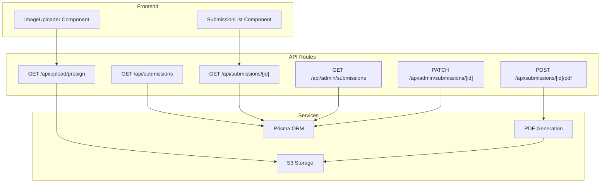
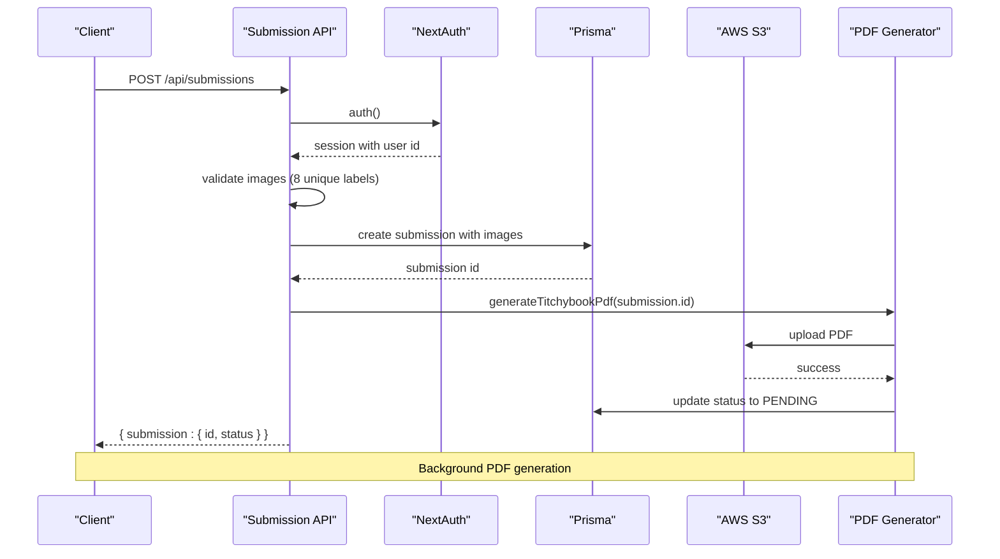
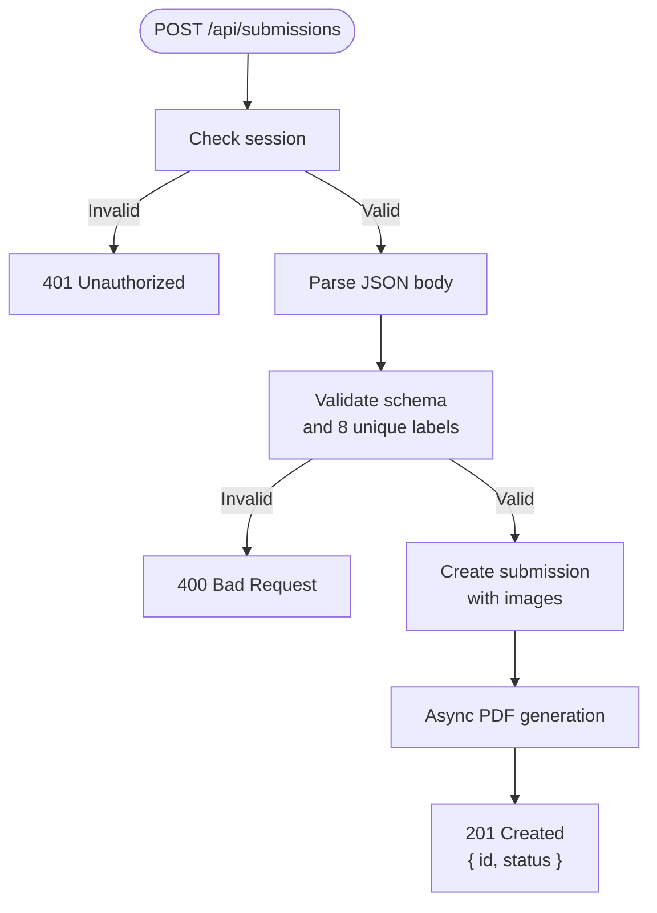
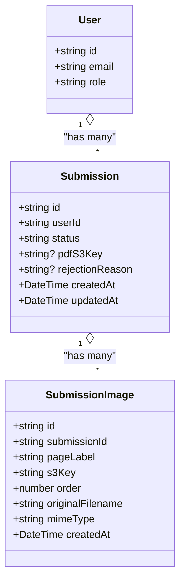

# Submission APIs

<cite>
**Referenced Files in This Document**
- [src/app/api/submissions/route.ts](file://src/app/api/submissions/route.ts)
- [src/app/api/submissions/[id]/route.ts](file://src/app/api/submissions/[id]/route.ts)
- [src/app/api/submissions/[id]/pdf/route.ts](file://src/app/api/submissions/[id]/pdf/route.ts)
- [src/app/api/admin/submissions/route.ts](file://src/app/api/admin/submissions/route.ts)
- [src/app/api/admin/submissions/[id]/route.ts](file://src/app/api/admin/submissions/[id]/route.ts)
- [src/app/api/upload/presign/route.ts](file://src/app/api/upload/presign/route.ts)
- [src/lib/pdf/generate.ts](file://src/lib/pdf/generate.ts)
- [src/lib/s3.ts](file://src/lib/s3.ts)
- [src/lib/constants.ts](file://src/lib/constants.ts)
- [prisma/schema.prisma](file://prisma/schema.prisma)
- [src/auth.ts](file://src/auth.ts)
- [src/middleware.ts](file://src/middleware.ts)
- [src/components/create/ImageUploader.tsx](file://src/components/create/ImageUploader.tsx)
- [src/components/submissions/SubmissionList.tsx](file://src/components/submissions/SubmissionList.tsx)
</cite>

## Table of Contents
1. [Introduction](#introduction)
2. [Project Structure](#project-structure)
3. [Core Components](#core-components)
4. [Architecture Overview](#architecture-overview)
5. [Detailed Component Analysis](#detailed-component-analysis)
6. [Dependency Analysis](#dependency-analysis)
7. [Performance Considerations](#performance-considerations)
8. [Troubleshooting Guide](#troubleshooting-guide)
9. [Conclusion](#conclusion)

## Introduction
This document provides comprehensive API documentation for the submission management system. It covers CRUD operations for user submissions, status management with PENDING, APPROVED, REJECTED, and PROCESSING states, admin endpoints for moderation, and request/response schemas. It also documents pagination, filtering, sorting, error handling, and the complete workflow from image uploads to PDF generation.

## Project Structure
The submission APIs are organized under Next.js App Router API routes:
- User-facing submission endpoints: `/api/submissions` (list/create) and `/api/submissions/[id]` (retrieve)
- PDF generation endpoint: `/api/submissions/[id]/pdf`
- Admin endpoints: `/api/admin/submissions` (list/filter) and `/api/admin/submissions/[id]` (approve/reject)
- Upload presigned URL endpoint: `/api/upload/presign`

**Diagram sources**
- [src/app/api/submissions/route.ts:20-33](file://src/app/api/submissions/route.ts#L20-L33)
- [src/app/api/submissions/[id]/route.ts](file://src/app/api/submissions/[id]/route.ts#L6-L36)
- [src/app/api/submissions/[id]/pdf/route.ts](file://src/app/api/submissions/[id]/pdf/route.ts#L5-L26)
- [src/app/api/admin/submissions/route.ts:6-37](file://src/app/api/admin/submissions/route.ts#L6-L37)
- [src/app/api/admin/submissions/[id]/route.ts](file://src/app/api/admin/submissions/[id]/route.ts#L12-L62)
- [src/app/api/upload/presign/route.ts:6-37](file://src/app/api/upload/presign/route.ts#L6-L37)
- [src/lib/pdf/generate.ts:23-111](file://src/lib/pdf/generate.ts#L23-L111)
- [src/lib/s3.ts:1-81](file://src/lib/s3.ts#L1-L81)
- [prisma/schema.prisma:21-47](file://prisma/schema.prisma#L21-L47)

**Section sources**
- [src/app/api/submissions/route.ts:1-96](file://src/app/api/submissions/route.ts#L1-L96)
- [src/app/api/admin/submissions/route.ts:1-38](file://src/app/api/admin/submissions/route.ts#L1-L38)
- [src/app/api/upload/presign/route.ts:1-38](file://src/app/api/upload/presign/route.ts#L1-L38)

## Core Components
- Submission model with status, rejection reason, and associated images
- Image metadata schema with page labels, S3 keys, ordering, and MIME types
- PDF generation pipeline with image processing and A4 landscape composition
- S3 integration for uploads/downloads with presigned URLs
- Authentication and authorization via NextAuth with role-based access control

**Section sources**
- [prisma/schema.prisma:21-47](file://prisma/schema.prisma#L21-L47)
- [src/lib/constants.ts:6-49](file://src/lib/constants.ts#L6-L49)
- [src/lib/pdf/generate.ts:23-111](file://src/lib/pdf/generate.ts#L23-L111)
- [src/lib/s3.ts:1-81](file://src/lib/s3.ts#L1-L81)
- [src/auth.ts:27-79](file://src/auth.ts#L27-L79)

## Architecture Overview
The system follows a layered architecture:
- Presentation layer: Next.js App Router API routes
- Business logic: Validation, status transitions, PDF generation
- Data access: Prisma ORM with SQLite
- Storage: AWS S3 for images and generated PDFs
- Authentication: NextAuth with JWT sessions and role claims

**Diagram sources**
- [src/app/api/submissions/route.ts:35-95](file://src/app/api/submissions/route.ts#L35-L95)
- [src/lib/pdf/generate.ts:23-111](file://src/lib/pdf/generate.ts#L23-L111)
- [src/lib/s3.ts:52-64](file://src/lib/s3.ts#L52-L64)

## Detailed Component Analysis

### Submission Creation API
- Endpoint: POST /api/submissions
- Purpose: Create a new submission with exactly 8 images
- Authentication: Required (user must be logged in)
- Request Schema:
  - images: array of 8 entries
    - pageLabel: enum from PAGE_LABELS
    - s3Key: string (non-empty)
    - order: integer (0-7)
    - originalFilename: string (non-empty)
    - mimeType: string (non-empty)
- Validation:
  - Zod schema enforces array length 8
  - Ensures all 8 unique page labels are present
  - Rejects invalid requests with 400
- Response:
  - 201 Created with { submission: { id, status } }
  - 401 Unauthorized if not authenticated
  - 500 Internal server error on failure
- Workflow:
  - Creates submission with associated images
  - Triggers asynchronous PDF generation (background)

**Diagram sources**
- [src/app/api/submissions/route.ts:35-95](file://src/app/api/submissions/route.ts#L35-L95)
- [src/lib/constants.ts:18-27](file://src/lib/constants.ts#L18-L27)

**Section sources**
- [src/app/api/submissions/route.ts:8-18](file://src/app/api/submissions/route.ts#L8-L18)
- [src/app/api/submissions/route.ts:35-95](file://src/app/api/submissions/route.ts#L35-L95)
- [src/lib/constants.ts:18-27](file://src/lib/constants.ts#L18-L27)

### Submission Retrieval API
- Endpoint: GET /api/submissions
- Purpose: List current user's submissions
- Authentication: Required
- Response: Array of submissions ordered by creation date (newest first)
- Each submission includes associated images ordered by page order

**Section sources**
- [src/app/api/submissions/route.ts:20-33](file://src/app/api/submissions/route.ts#L20-L33)

### Individual Submission Retrieval API
- Endpoint: GET /api/submissions/[id]
- Purpose: Retrieve a specific submission
- Authentication: Required
- Authorization: Owner or ADMIN
- Response: Submission with images and optional presigned PDF download URL
- Error handling:
  - 401 Unauthorized if not authenticated
  - 403 Forbidden if not owner and not ADMIN
  - 404 Not found if submission does not exist

**Section sources**
- [src/app/api/submissions/[id]/route.ts](file://src/app/api/submissions/[id]/route.ts#L6-L36)

### PDF Generation API
- Endpoint: POST /api/submissions/[id]/pdf
- Purpose: Force regenerate PDF for a submission
- Authentication: Required
- Authorization: Must be authenticated (no role requirement)
- Response: { success: true, pdfS3Key }
- Error handling:
  - 401 Unauthorized if not authenticated
  - 500 Internal server error on generation failure

**Section sources**
- [src/app/api/submissions/[id]/pdf/route.ts](file://src/app/api/submissions/[id]/pdf/route.ts#L5-L26)

### Admin Submission Listing API
- Endpoint: GET /api/admin/submissions
- Purpose: List all submissions with optional status filter
- Authentication: Required
- Authorization: ADMIN role
- Query parameters:
  - status: filter by submission status (PENDING, APPROVED, REJECTED, PROCESSING)
- Response: Array of submissions with user info and presigned PDF download URLs
- Sorting: Newest first by creation date

**Section sources**
- [src/app/api/admin/submissions/route.ts:6-37](file://src/app/api/admin/submissions/route.ts#L6-L37)

### Admin Submission Status Update API
- Endpoint: PATCH /api/admin/submissions/[id]
- Purpose: Approve or reject a submission
- Authentication: Required
- Authorization: ADMIN role
- Request body:
  - action: "APPROVE" or "REJECT"
  - rejectionReason: optional string (required when rejecting)
- Response: Updated submission
- Validation:
  - 400 Bad Request for invalid action or missing rejectionReason when rejecting
  - 404 Not found if submission does not exist
  - 500 Internal server error on failure

**Section sources**
- [src/app/api/admin/submissions/[id]/route.ts](file://src/app/api/admin/submissions/[id]/route.ts#L7-L10)
- [src/app/api/admin/submissions/[id]/route.ts](file://src/app/api/admin/submissions/[id]/route.ts#L12-L62)

### Upload Presigned URL API
- Endpoint: GET /api/upload/presign
- Purpose: Generate presigned upload URL for direct S3 upload
- Authentication: Required
- Query parameters:
  - filename: original filename
  - contentType: image MIME type
  - submissionId: target submission ID
  - pageLabel: page label for this image
- Validation:
  - 400 Bad Request for missing parameters
  - 400 Bad Request for invalid content type
- Response: { uploadUrl, s3Key }
- File constraints:
  - Accepted types: JPEG, PNG, WebP
  - Max size: 10MB

**Section sources**
- [src/app/api/upload/presign/route.ts:6-37](file://src/app/api/upload/presign/route.ts#L6-L37)
- [src/lib/constants.ts:42-49](file://src/lib/constants.ts#L42-L49)

### PDF Generation Pipeline
- Status transitions:
  - Before generation: set to PROCESSING
  - On completion: set to PENDING
- Steps:
  1. Fetch submission images from DB
  2. Download all 8 images from S3
  3. Process each image (resize/crop/rotate)
  4. Compose into A4 landscape PDF
  5. Upload PDF to S3
  6. Update submission record with PDF key and reset status

**Section sources**
- [src/lib/pdf/generate.ts:23-111](file://src/lib/pdf/generate.ts#L23-L111)

### Data Model and Status Management
- Submission model fields:
  - id, userId, status (default PENDING), pdfS3Key, rejectionReason
  - createdAt, updatedAt
- SubmissionImage model fields:
  - id, submissionId, pageLabel, s3Key, order, originalFilename, mimeType
- Status enum: PENDING, APPROVED, REJECTED, PROCESSING
- Page labels: FRONT_COVER, BACK_COVER, PAGE_2..PAGE_7

**Section sources**
- [prisma/schema.prisma:21-47](file://prisma/schema.prisma#L21-L47)
- [src/lib/constants.ts:6-27](file://src/lib/constants.ts#L6-L27)

## Dependency Analysis

**Diagram sources**
- [prisma/schema.prisma:21-47](file://prisma/schema.prisma#L21-L47)

**Section sources**
- [prisma/schema.prisma:10-47](file://prisma/schema.prisma#L10-L47)

## Performance Considerations
- Asynchronous PDF generation: Background processing prevents blocking API responses
- Parallel operations: Image downloads and processing use Promise.all for concurrency
- Presigned URLs: Direct S3 uploads reduce server bandwidth and latency
- Pagination: No built-in pagination; consider adding limit/offset or cursor-based pagination for large datasets
- Filtering: Admin endpoint supports status filtering; consider adding more filters (date ranges, user ID)
- Sorting: Default sorting by creation date; consider configurable sort options

## Troubleshooting Guide

### Common Validation Errors
- Missing or invalid image metadata:
  - 400 Bad Request with specific field message
  - Ensure all 8 page labels are unique and present
- Invalid content type for uploads:
  - 400 Bad Request for unsupported MIME types
  - Only JPEG, PNG, WebP accepted
- File size limits:
  - 400 Bad Request for files larger than 10MB

### Authentication and Authorization Issues
- Unauthenticated requests:
  - 401 Unauthorized for all protected endpoints
- Insufficient permissions:
  - 403 Forbidden for admin-only endpoints
  - Non-owner access to submissions denied

### PDF Generation Failures
- Missing image for required panel:
  - Generation fails with error indicating missing panel
- S3 connectivity issues:
  - PDF generation errors logged and returned as 500

### Frontend Integration Tips
- Use ImageUploader component for consistent upload behavior
- SubmissionList handles loading states and displays appropriate actions based on status
- Ensure proper error handling for network failures and validation errors

**Section sources**
- [src/app/api/submissions/route.ts:45-61](file://src/app/api/submissions/route.ts#L45-L61)
- [src/app/api/upload/presign/route.ts:18-30](file://src/app/api/upload/presign/route.ts#L18-L30)
- [src/lib/pdf/generate.ts:45-47](file://src/lib/pdf/generate.ts#L45-L47)
- [src/components/create/ImageUploader.tsx:22-73](file://src/components/create/ImageUploader.tsx#L22-L73)
- [src/components/submissions/SubmissionList.tsx:15-118](file://src/components/submissions/SubmissionList.tsx#L15-L118)

## Conclusion
The submission management system provides a robust API for user-generated content with comprehensive validation, secure authentication, and efficient PDF generation. The architecture supports both user self-service and admin moderation workflows while maintaining clear status tracking and error handling. Future enhancements could include pagination, advanced filtering, and bulk operations for improved scalability and admin productivity.