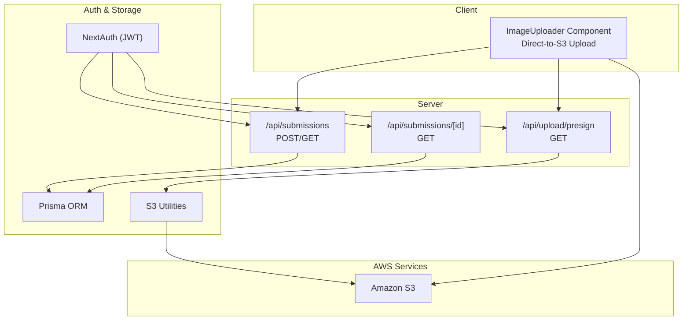
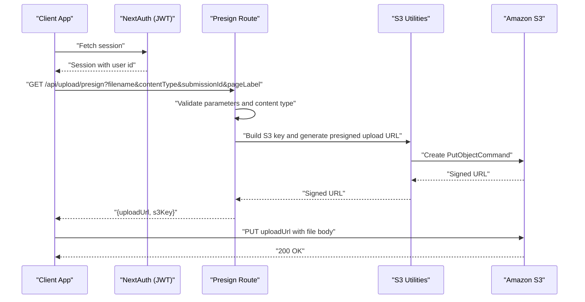
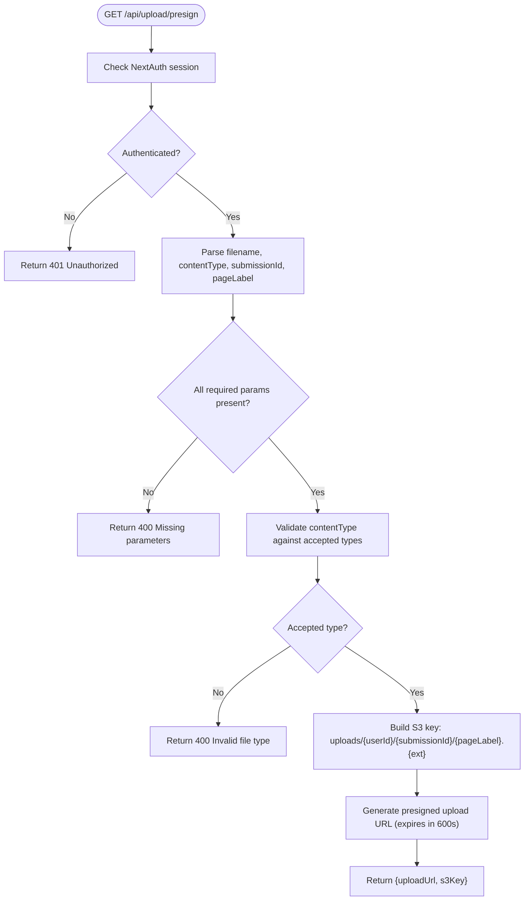
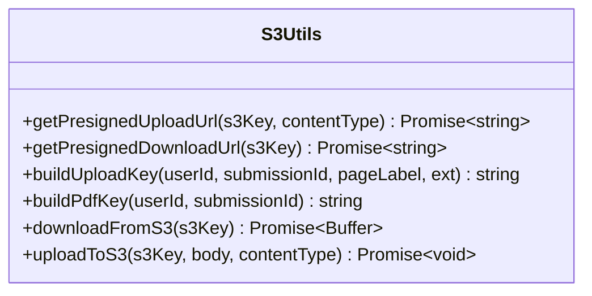
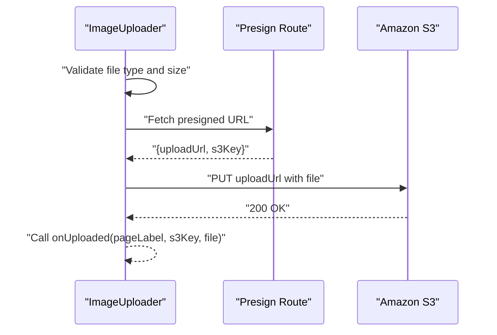
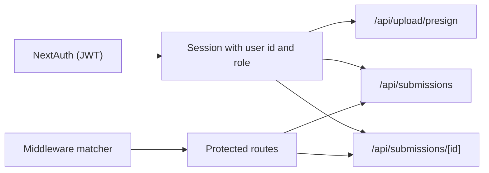
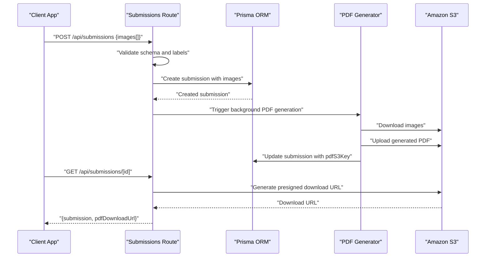
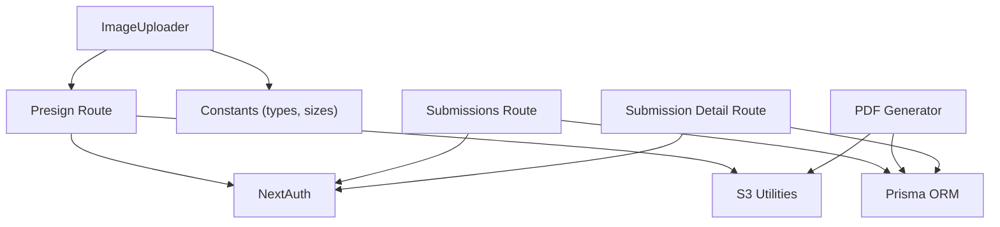

# Upload APIs

<cite>
**Referenced Files in This Document**
- [route.ts](file://src/app/api/upload/presign/route.ts)
- [s3.ts](file://src/lib/s3.ts)
- [constants.ts](file://src/lib/constants.ts)
- [ImageUploader.tsx](file://src/components/create/ImageUploader.tsx)
- [auth.ts](file://src/auth.ts)
- [middleware.ts](file://src/middleware.ts)
- [route.ts](file://src/app/api/submissions/route.ts)
- [route.ts](file://src/app/api/submissions/[id]/route.ts)
- [generate.ts](file://src/lib/pdf/generate.ts)
- [schema.prisma](file://prisma/schema.prisma)
</cite>

## Table of Contents
1. [Introduction](#introduction)
2. [Project Structure](#project-structure)
3. [Core Components](#core-components)
4. [Architecture Overview](#architecture-overview)
5. [Detailed Component Analysis](#detailed-component-analysis)
6. [Dependency Analysis](#dependency-analysis)
7. [Performance Considerations](#performance-considerations)
8. [Troubleshooting Guide](#troubleshooting-guide)
9. [Conclusion](#conclusion)

## Introduction
This document provides comprehensive API documentation for the upload management endpoints, focusing on the presigned URL generation endpoint used to securely upload images to AWS S3. It covers request parameters, validation rules, response formats, security considerations, integration with NextAuth for authentication and role-based access control, and practical examples of upload workflows including direct-to-S3 uploads and error handling.

## Project Structure
The upload system spans several layers:
- API routes for presigned URL generation and submission management
- AWS S3 integration utilities for generating signed URLs and managing keys
- Frontend uploader component that orchestrates the upload flow
- Authentication and authorization via NextAuth
- Prisma schema modeling submissions and associated images

**Diagram sources**
- [route.ts:1-38](file://src/app/api/upload/presign/route.ts#L1-L38)
- [s3.ts:1-81](file://src/lib/s3.ts#L1-L81)
- [ImageUploader.tsx:1-148](file://src/components/create/ImageUploader.tsx#L1-L148)
- [route.ts:1-96](file://src/app/api/submissions/route.ts#L1-L96)
- [route.ts:1-37](file://src/app/api/submissions/[id]/route.ts#L1-L37)
- [auth.ts:1-80](file://src/auth.ts#L1-L80)

**Section sources**
- [route.ts:1-38](file://src/app/api/upload/presign/route.ts#L1-L38)
- [s3.ts:1-81](file://src/lib/s3.ts#L1-L81)
- [ImageUploader.tsx:1-148](file://src/components/create/ImageUploader.tsx#L1-L148)
- [auth.ts:1-80](file://src/auth.ts#L1-L80)
- [route.ts:1-96](file://src/app/api/submissions/route.ts#L1-L96)
- [route.ts:1-37](file://src/app/api/submissions/[id]/route.ts#L1-L37)

## Core Components
- Presigned URL Generation Endpoint: Validates authenticated session, checks required parameters, enforces accepted content types, constructs S3 key, and returns a short-lived signed URL for direct S3 upload.
- S3 Utilities: Provides functions to generate signed URLs for uploads and downloads, construct S3 keys, and perform direct S3 operations.
- Frontend Uploader: Handles client-side validation (file type and size), obtains a presigned URL, performs a direct PUT to S3, and notifies parent components upon success.
- Authentication and Authorization: Uses NextAuth with JWT strategy; enforces user ID ownership and admin privileges for protected routes.
- Submission Management: Creates submissions with validated image entries and triggers asynchronous PDF generation.

**Section sources**
- [route.ts:6-37](file://src/app/api/upload/presign/route.ts#L6-L37)
- [s3.ts:18-36](file://src/lib/s3.ts#L18-L36)
- [ImageUploader.tsx:22-73](file://src/components/create/ImageUploader.tsx#L22-L73)
- [auth.ts:65-79](file://src/auth.ts#L65-L79)
- [route.ts:35-95](file://src/app/api/submissions/route.ts#L35-L95)

## Architecture Overview
The upload architecture follows a secure pattern:
- Client requests a presigned URL from the backend after authenticating via NextAuth.
- Backend validates the request and returns a short-lived signed URL for S3 PUT.
- Client uploads directly to S3 using the signed URL.
- After successful upload, the client informs the backend to create or update a submission record.
- Background job generates a PDF from uploaded images and stores it in S3.

**Diagram sources**
- [route.ts:6-37](file://src/app/api/upload/presign/route.ts#L6-L37)
- [s3.ts:18-28](file://src/lib/s3.ts#L18-L28)
- [ImageUploader.tsx:42-64](file://src/components/create/ImageUploader.tsx#L42-L64)

## Detailed Component Analysis

### Presigned URL Generation Endpoint
- Endpoint: GET /api/upload/presign
- Purpose: Generate a short-lived signed URL for direct S3 upload.
- Authentication: Requires a valid NextAuth session; unauthorized requests receive 401.
- Request Parameters:
  - filename: Required. Used to derive extension for S3 key construction.
  - contentType: Required. Must match accepted image MIME types.
  - submissionId: Required. Associates the upload with a specific submission.
  - pageLabel: Required. Identifies the page slot for the image.
- Validation:
  - Missing any required parameter results in 400.
  - contentType must be one of the accepted image types; otherwise 400.
  - File extension derived from filename is used to finalize S3 key.
- S3 Key Construction:
  - Key format: uploads/{userId}/{submissionId}/{pageLabel}.{ext}
  - Ensures isolation by user and submission, and preserves original file extension.
- Response:
  - uploadUrl: Signed URL for PUT operation to S3.
  - s3Key: The constructed S3 key used for the upload.
- Security:
  - Expiration: Presigned URL expires after 600 seconds (10 minutes).
  - Access Control: Only authenticated users can request presigned URLs.
  - Content Type: Enforced at both client and server level.

**Diagram sources**
- [route.ts:6-37](file://src/app/api/upload/presign/route.ts#L6-L37)
- [s3.ts:18-28](file://src/lib/s3.ts#L18-L28)
- [constants.ts:42-46](file://src/lib/constants.ts#L42-L46)

**Section sources**
- [route.ts:6-37](file://src/app/api/upload/presign/route.ts#L6-L37)
- [s3.ts:18-28](file://src/lib/s3.ts#L18-L28)
- [constants.ts:42-46](file://src/lib/constants.ts#L42-L46)

### S3 Utilities
- getPresignedUploadUrl:
  - Creates a PutObjectCommand for the given S3 key and content type.
  - Returns a signed URL with 600-second expiration.
- getPresignedDownloadUrl:
  - Creates a GetObjectCommand and returns a signed URL with 3600-second expiration.
- buildUploadKey:
  - Constructs the S3 key path for images: uploads/{userId}/{submissionId}/{pageLabel}.{ext}.
- buildPdfKey:
  - Constructs the S3 key path for generated PDFs: pdfs/{userId}/{submissionId}/titchybook.pdf.
- downloadFromS3 and uploadToS3:
  - Low-level helpers to fetch and upload buffers to S3.

**Diagram sources**
- [s3.ts:18-81](file://src/lib/s3.ts#L18-L81)

**Section sources**
- [s3.ts:18-81](file://src/lib/s3.ts#L18-L81)

### Frontend Image Uploader
- Responsibilities:
  - Validates file type (only JPG, PNG, WebP) and size (max 10MB).
  - Generates a preview of the selected image.
  - Requests a presigned URL from the backend.
  - Performs a direct PUT to S3 using the returned URL.
  - Notifies parent component on success with pageLabel, s3Key, and file metadata.
- Error Handling:
  - Displays user-friendly errors for invalid types, oversized files, and upload failures.
  - Clears preview on failure and resets uploading state.

**Diagram sources**
- [ImageUploader.tsx:22-73](file://src/components/create/ImageUploader.tsx#L22-L73)
- [route.ts:6-37](file://src/app/api/upload/presign/route.ts#L6-L37)

**Section sources**
- [ImageUploader.tsx:22-73](file://src/components/create/ImageUploader.tsx#L22-L73)

### Authentication and Authorization
- NextAuth Integration:
  - JWT strategy is configured; session includes user id and role.
  - Callbacks enrich JWT and session with user role for downstream checks.
- Middleware:
  - Protects routes under /dashboard, /create, and /admin using the auth matcher.
- Protected Routes:
  - Submission detail endpoint enforces ownership (userId) or admin role.
  - Submission creation endpoint requires authenticated user.
  - Presigned URL endpoint requires authenticated user.

**Diagram sources**
- [auth.ts:27-79](file://src/auth.ts#L27-L79)
- [middleware.ts:3-5](file://src/middleware.ts#L3-L5)
- [route.ts:10-28](file://src/app/api/submissions/[id]/route.ts#L10-L28)

**Section sources**
- [auth.ts:27-79](file://src/auth.ts#L27-L79)
- [middleware.ts:3-5](file://src/middleware.ts#L3-L5)
- [route.ts:10-28](file://src/app/api/submissions/[id]/route.ts#L10-L28)

### Submission Management and PDF Generation
- Submission Creation:
  - Validates that exactly 8 unique page labels are provided.
  - Creates a submission with associated images in a single transaction.
  - Triggers asynchronous PDF generation.
- Submission Retrieval:
  - Returns submission details and, if available, a presigned download URL for the generated PDF.
- PDF Generation:
  - Downloads all 8 images from S3, processes them, composes an A4 landscape PDF, uploads it to S3, and updates the submission record.

**Diagram sources**
- [route.ts:35-95](file://src/app/api/submissions/route.ts#L35-L95)
- [generate.ts:23-112](file://src/lib/pdf/generate.ts#L23-L112)
- [route.ts:30-33](file://src/app/api/submissions/[id]/route.ts#L30-L33)

**Section sources**
- [route.ts:35-95](file://src/app/api/submissions/route.ts#L35-L95)
- [generate.ts:23-112](file://src/lib/pdf/generate.ts#L23-L112)
- [route.ts:30-33](file://src/app/api/submissions/[id]/route.ts#L30-L33)

## Dependency Analysis
- Authentication Dependencies:
  - Presign route depends on NextAuth for session validation.
  - Submission routes depend on NextAuth for ownership and role checks.
- S3 Dependencies:
  - Presign route uses S3 utilities to build keys and generate presigned URLs.
  - PDF generator uses S3 utilities to download images and upload the generated PDF.
- Frontend Dependencies:
  - ImageUploader depends on constants for accepted types and size limits.
  - ImageUploader depends on the presign endpoint for signed URLs.

**Diagram sources**
- [route.ts:1-3](file://src/app/api/upload/presign/route.ts#L1-L3)
- [s3.ts:1-81](file://src/lib/s3.ts#L1-L81)
- [ImageUploader.tsx:1-10](file://src/components/create/ImageUploader.tsx#L1-L10)
- [route.ts:1-6](file://src/app/api/submissions/route.ts#L1-L6)
- [generate.ts:1-6](file://src/lib/pdf/generate.ts#L1-L6)
- [route.ts:1-4](file://src/app/api/submissions/[id]/route.ts#L1-L4)

**Section sources**
- [route.ts:1-3](file://src/app/api/upload/presign/route.ts#L1-L3)
- [s3.ts:1-81](file://src/lib/s3.ts#L1-L81)
- [ImageUploader.tsx:1-10](file://src/components/create/ImageUploader.tsx#L1-L10)
- [route.ts:1-6](file://src/app/api/submissions/route.ts#L1-L6)
- [generate.ts:1-6](file://src/lib/pdf/generate.ts#L1-L6)
- [route.ts:1-4](file://src/app/api/submissions/[id]/route.ts#L1-L4)

## Performance Considerations
- Presigned URL Expiration: Short-lived URLs (10 minutes) reduce exposure windows and improve security.
- Direct-to-S3 Uploads: Eliminate server bandwidth and CPU overhead by bypassing the application server during upload.
- Parallel Operations: PDF generation downloads and processes images in parallel to minimize latency.
- Caching: Consider caching frequently accessed presigned download URLs for PDFs to reduce repeated signing operations.

[No sources needed since this section provides general guidance]

## Troubleshooting Guide
- 401 Unauthorized on Presign:
  - Ensure the user is authenticated and the session contains a valid user id.
  - Verify NextAuth configuration and cookies/session handling.
- 400 Missing Parameters:
  - Confirm filename, contentType, submissionId, and pageLabel are provided.
- 400 Invalid File Type:
  - Only JPG, PNG, and WebP are accepted. Adjust client validation accordingly.
- 400 File Too Large:
  - Client enforces a 10MB limit; adjust uploads or client validation if needed.
- Upload Failure to S3:
  - Check network connectivity and S3 bucket permissions.
  - Verify the presigned URL has not expired.
- Submission Creation Errors:
  - Ensure exactly 8 unique page labels are provided.
  - Validate image entries meet schema requirements.
- PDF Generation Issues:
  - Confirm all 8 images are present and accessible in S3.
  - Review background job logs for errors.

**Section sources**
- [route.ts:8-30](file://src/app/api/upload/presign/route.ts#L8-L30)
- [ImageUploader.tsx:24-31](file://src/components/create/ImageUploader.tsx#L24-L31)
- [route.ts:45-61](file://src/app/api/submissions/route.ts#L45-L61)

## Conclusion
The upload system provides a secure, scalable solution for image uploads to AWS S3 using presigned URLs, with robust client-side validation and server-side enforcement. Integration with NextAuth ensures authenticated access and role-based controls, while submission management and background PDF generation round out a complete workflow. Adhering to the documented parameters, validations, and security practices will help ensure reliable and secure uploads.