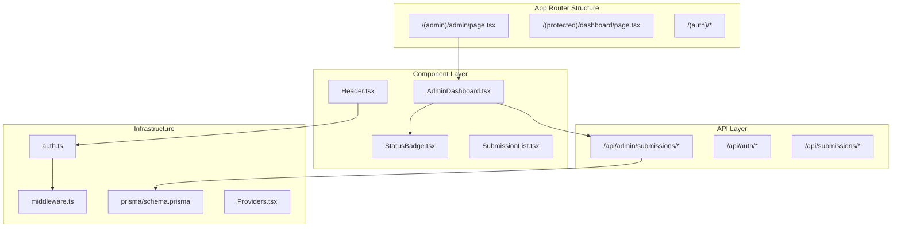
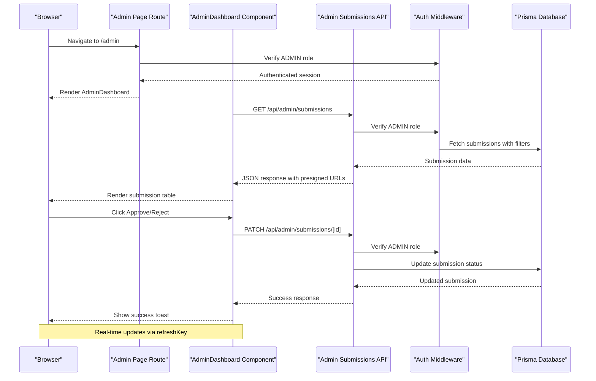
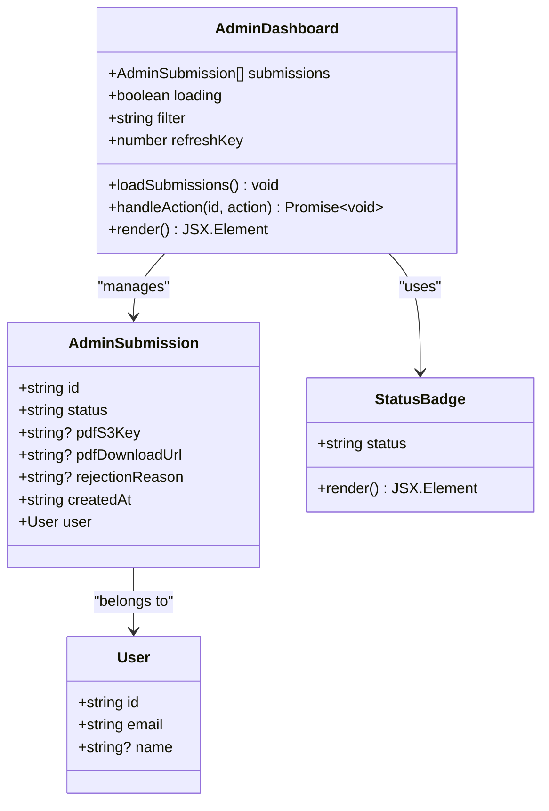
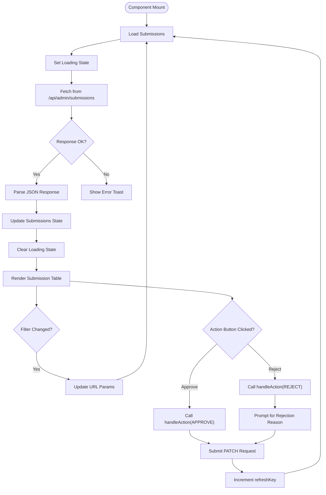
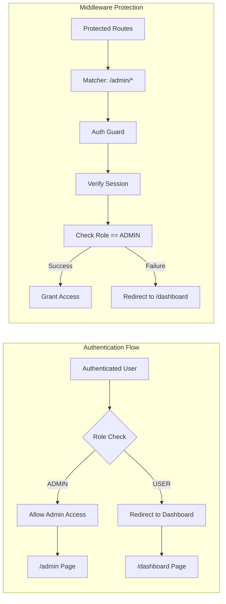
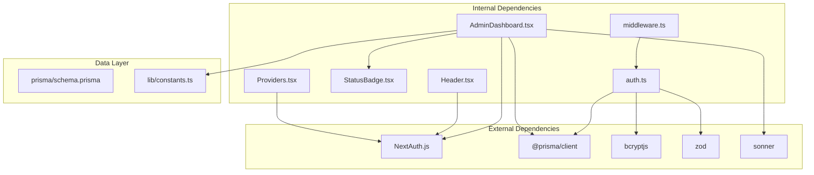

# Admin Dashboard Interface

<cite>
**Referenced Files in This Document**
- [AdminDashboard.tsx](file://src/components/admin/AdminDashboard.tsx)
- [Admin Page](file://src/app/(admin)/admin/page.tsx)
- [Admin Submissions API](file://src/app/api/admin/submissions/route.ts)
- [Admin Submission Action API](file://src/app/api/admin/submissions/[id]/route.ts)
- [Header Component](file://src/components/layout/Header.tsx)
- [Root Layout](file://src/app/layout.tsx)
- [Providers Component](file://src/components/Providers.tsx)
- [Auth Configuration](file://src/auth.ts)
- [Middleware](file://src/middleware.ts)
- [Prisma Schema](file://prisma/schema.prisma)
- [Constants](file://src/lib/constants.ts)
- [StatusBadge Component](file://src/components/submissions/StatusBadge.tsx)
- [SubmissionList Component](file://src/components/submissions/SubmissionList.tsx)
</cite>

## Table of Contents
1. [Introduction](#introduction)
2. [Project Structure](#project-structure)
3. [Core Components](#core-components)
4. [Architecture Overview](#architecture-overview)
5. [Detailed Component Analysis](#detailed-component-analysis)
6. [Dependency Analysis](#dependency-analysis)
7. [Performance Considerations](#performance-considerations)
8. [Accessibility Features](#accessibility-features)
9. [Responsive Design](#responsive-design)
10. [Customization Guide](#customization-guide)
11. [Troubleshooting Guide](#troubleshooting-guide)
12. [Conclusion](#conclusion)

## Introduction
The Titchybook Creator admin dashboard provides centralized administrative controls for content moderation and user management. Built with Next.js App Router, the dashboard offers administrators a streamlined interface to review, approve, and reject user-submitted content while maintaining strict role-based access control. The system integrates seamlessly with authentication middleware and provides real-time feedback through toast notifications and loading states.

## Project Structure
The admin dashboard follows a modular architecture organized by feature domains:

**Diagram sources**
- [Admin Page](file://src/app/(admin)/admin/page.tsx#L1-L13)
- [AdminDashboard.tsx:1-168](file://src/components/admin/AdminDashboard.tsx#L1-L168)
- [Header Component:1-69](file://src/components/layout/Header.tsx#L1-L69)

**Section sources**
- [Admin Page](file://src/app/(admin)/admin/page.tsx#L1-L13)
- [Root Layout:1-42](file://src/app/layout.tsx#L1-L42)

## Core Components
The admin dashboard consists of several interconnected components working together to provide comprehensive administrative functionality:

### AdminDashboard Component
The primary dashboard component manages submission listings, filtering, and administrative actions. It implements a clean table-based interface with status indicators and action buttons.

### Authentication Integration
The dashboard integrates with NextAuth.js for secure authentication and role-based access control, ensuring only administrators can access the dashboard.

### API Communication
The component communicates with backend APIs for fetching submission data and processing administrative actions, implementing proper error handling and loading states.

**Section sources**
- [AdminDashboard.tsx:21-167](file://src/components/admin/AdminDashboard.tsx#L21-L167)
- [Auth Configuration:27-79](file://src/auth.ts#L27-L79)

## Architecture Overview
The admin dashboard follows a client-server architecture with clear separation of concerns:

**Diagram sources**
- [Admin Page](file://src/app/(admin)/admin/page.tsx#L5-L12)
- [Admin Submissions API:6-37](file://src/app/api/admin/submissions/route.ts#L6-L37)
- [Admin Submission Action API:12-62](file://src/app/api/admin/submissions/[id]/route.ts#L12-L62)

## Detailed Component Analysis

### AdminDashboard Component Structure
The AdminDashboard component implements a comprehensive submission management interface:

**Diagram sources**
- [AdminDashboard.tsx:7-19](file://src/components/admin/AdminDashboard.tsx#L7-L19)
- [StatusBadge Component:1-18](file://src/components/submissions/StatusBadge.tsx#L1-L18)

#### Data Flow Implementation
The component implements a sophisticated data flow pattern with state management and real-time updates:

**Diagram sources**
- [AdminDashboard.tsx:27-62](file://src/components/admin/AdminDashboard.tsx#L27-L62)

#### Administrative Controls
The dashboard provides three primary administrative actions:

1. **Approve Submission**: Changes status to APPROVED and generates download links
2. **Reject Submission**: Changes status to REJECTED with optional rejection reason
3. **Filter Management**: Allows filtering by submission status (All, PENDING, APPROVED, REJECTED)

**Section sources**
- [AdminDashboard.tsx:43-62](file://src/components/admin/AdminDashboard.tsx#L43-L62)
- [AdminDashboard.tsx:68-82](file://src/components/admin/AdminDashboard.tsx#L68-L82)

### Authentication and Role-Based Access Control
The system implements robust authentication and authorization mechanisms:

**Diagram sources**
- [Admin Page](file://src/app/(admin)/admin/page.tsx#L7-L9)
- [Middleware:3-5](file://src/middleware.ts#L3-L5)
- [Auth Configuration:65-78](file://src/auth.ts#L65-L78)

**Section sources**
- [Admin Page](file://src/app/(admin)/admin/page.tsx#L5-L12)
- [Auth Configuration:27-79](file://src/auth.ts#L27-L79)
- [Middleware:1-6](file://src/middleware.ts#L1-L6)

### API Integration and Data Management
The dashboard integrates with multiple API endpoints for comprehensive functionality:

#### Submission Retrieval API
The `/api/admin/submissions` endpoint provides filtered access to submission data with presigned URL generation for PDF downloads.

#### Action Processing API
The `/api/admin/submissions/[id]` endpoint handles administrative actions with strict validation and error handling.

**Section sources**
- [Admin Submissions API:6-37](file://src/app/api/admin/submissions/route.ts#L6-L37)
- [Admin Submission Action API:12-62](file://src/app/api/admin/submissions/[id]/route.ts#L12-L62)

## Dependency Analysis
The admin dashboard has well-defined dependencies that support maintainable architecture:

**Diagram sources**
- [AdminDashboard.tsx:3-5](file://src/components/admin/AdminDashboard.tsx#L3-L5)
- [Auth Configuration:1-4](file://src/auth.ts#L1-L4)
- [Prisma Schema:1-48](file://prisma/schema.prisma#L1-L48)

**Section sources**
- [AdminDashboard.tsx:1-168](file://src/components/admin/AdminDashboard.tsx#L1-L168)
- [Auth Configuration:1-80](file://src/auth.ts#L1-L80)

## Performance Considerations
The admin dashboard implements several performance optimization strategies:

### Client-Side Caching and State Management
- Efficient state updates using React hooks
- Loading state management to prevent unnecessary re-renders
- Optimistic UI updates with proper rollback on failure

### API Optimization
- Selective data fetching with status filtering
- Presigned URL generation for efficient PDF access
- Batch operations where possible

### Memory Management
- Proper cleanup of event listeners and timers
- Controlled re-rendering through dependency arrays
- Efficient table rendering with virtualization-ready structure

## Accessibility Features
The dashboard incorporates comprehensive accessibility features:

### Keyboard Navigation
- Full keyboard support for all interactive elements
- Logical tab order through form controls and buttons
- Focus management for modals and dialogs

### Screen Reader Support
- Semantic HTML structure with proper headings
- Descriptive button labels and aria attributes
- Success/error messaging through accessible notifications

### Color Contrast and Visual Design
- High contrast color schemes for status indicators
- Sufficient color differentiation for accessibility
- Alternative text for all decorative elements

### Responsive Design Patterns
- Mobile-first responsive layout
- Flexible grid systems for different screen sizes
- Touch-friendly button sizing and spacing

## Responsive Design
The admin dashboard implements a comprehensive responsive design strategy:

### Breakpoint Strategy
The interface adapts gracefully across device sizes:
- Mobile: Single column layout with stacked elements
- Tablet: Optimized two-column arrangement
- Desktop: Full-width table with optimal spacing

### Adaptive Components
- Flexible table layout with horizontal scrolling on small screens
- Responsive typography scaling
- Adaptive button sizing and spacing

### Touch Interface Optimization
- Sufficient touch target sizes
- Appropriate spacing for mobile interaction
- Gesture-friendly navigation patterns

## Customization Guide

### Adding New Administrative Widgets
To extend the dashboard with new administrative widgets:

1. **Create Widget Component**: Develop a new component in `src/components/admin/`
2. **Integrate into Layout**: Add the widget to the main dashboard layout
3. **Add API Integration**: Implement necessary API endpoints for data fetching
4. **Update Permissions**: Ensure proper role-based access control

### Customizing Dashboard Views
The dashboard supports flexible customization through:

- **Filter Extensions**: Add new filter criteria to the existing filter system
- **Column Customization**: Extend the table component to show additional submission data
- **Action Extensions**: Implement new administrative actions with proper validation

### Adding New Administrative Actions
To implement additional administrative capabilities:

1. **Define Action Schema**: Create validation schemas for new actions
2. **Update API Endpoints**: Add new PATCH endpoints for action processing
3. **Enhance Frontend**: Add UI controls and confirmation dialogs
4. **Update Permissions**: Ensure proper authorization checks

**Section sources**
- [AdminDashboard.tsx:43-62](file://src/components/admin/AdminDashboard.tsx#L43-L62)
- [Admin Submission Action API:7-10](file://src/app/api/admin/submissions/[id]/route.ts#L7-L10)

## Troubleshooting Guide

### Common Issues and Solutions

#### Authentication Problems
- **Issue**: Users redirected to dashboard despite ADMIN role
- **Solution**: Verify JWT callback implementation and session storage
- **Location**: Check auth.ts callbacks and middleware configuration

#### API Access Denied
- **Issue**: 403 Forbidden errors on admin endpoints
- **Solution**: Ensure proper session validation and role checking
- **Location**: Review admin API route authorization logic

#### Data Loading Issues
- **Issue**: Submissions not loading or displaying incorrectly
- **Solution**: Check API response format and error handling
- **Location**: Examine submission API and dashboard data parsing

#### Action Processing Failures
- **Issue**: Approve/Reject actions not updating submission status
- **Solution**: Verify database transaction completion and error handling
- **Location**: Review action API endpoint and database operations

**Section sources**
- [Admin Page](file://src/app/(admin)/admin/page.tsx#L7-L9)
- [Admin Submissions API:8-10](file://src/app/api/admin/submissions/route.ts#L8-L10)
- [Admin Submission Action API:16-19](file://src/app/api/admin/submissions/[id]/route.ts#L16-L19)

## Conclusion
The Titchybook Creator admin dashboard provides a robust, scalable solution for content moderation and administrative oversight. Its modular architecture, comprehensive authentication system, and responsive design ensure effective administration while maintaining excellent user experience. The clear separation of concerns, extensive error handling, and accessibility features make it suitable for production deployment with minimal modifications.

The dashboard's extensible design allows for easy addition of new administrative features while maintaining security and performance standards. The integration with Next.js App Router and modern React patterns ensures future maintainability and scalability as the application grows.