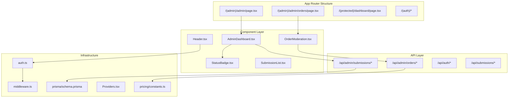
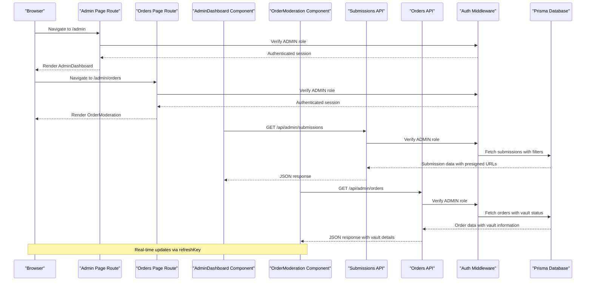
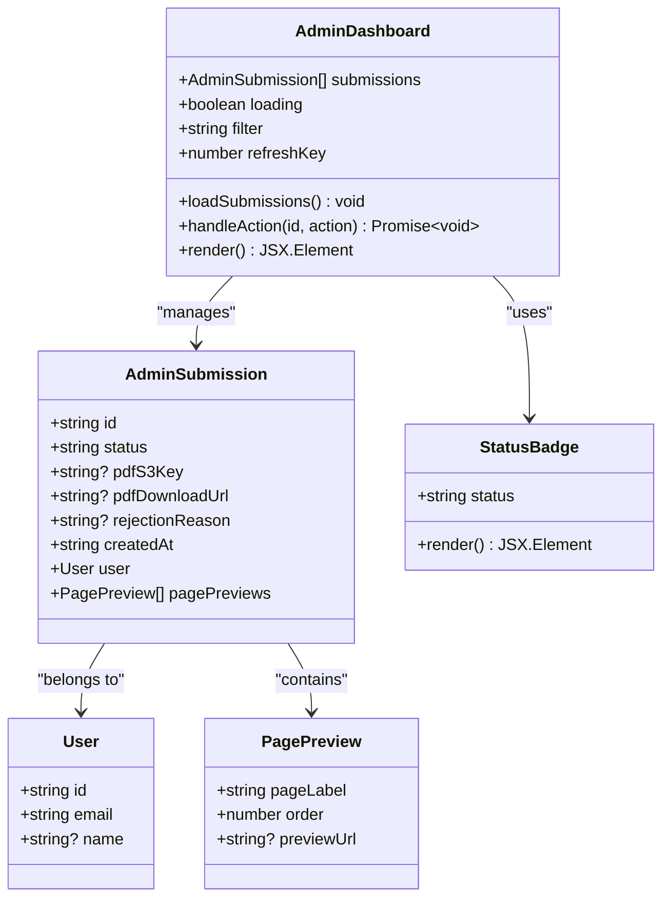
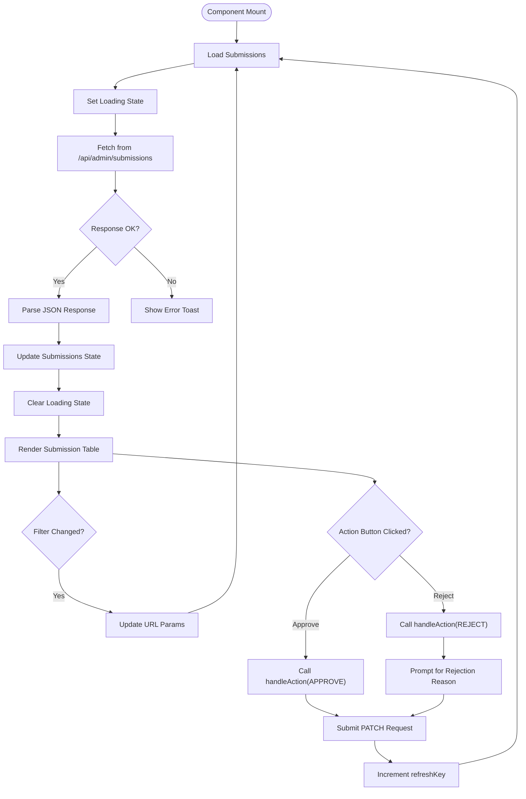
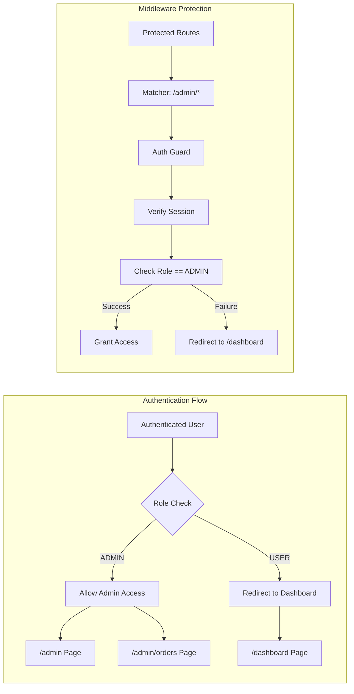
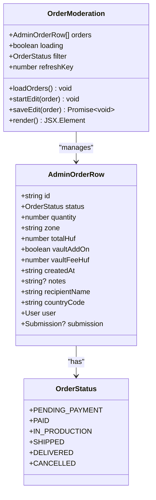
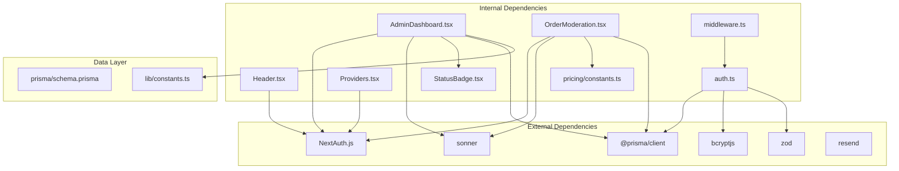

# Admin Dashboard Interface

<cite>
**Referenced Files in This Document**
- [AdminDashboard.tsx](file://src/components/admin/AdminDashboard.tsx)
- [OrderModeration.tsx](file://src/components/admin/OrderModeration.tsx)
- [Admin Page](file://src/app/(admin)/admin/page.tsx)
- [Admin Orders Page](file://src/app/(admin)/admin/orders/page.tsx)
- [Admin Submissions API](file://src/app/api/admin/submissions/route.ts)
- [Admin Orders API](file://src/app/api/admin/orders/route.ts)
- [Admin Order Action API](file://src/app/api/admin/orders/[id]/route.ts)
- [Header Component](file://src/components/layout/Header.tsx)
- [Root Layout](file://src/app/layout.tsx)
- [Providers Component](file://src/components/Providers.tsx)
- [Auth Configuration](file://src/auth.ts)
- [Middleware](file://src/middleware.ts)
- [Prisma Schema](file://prisma/schema.prisma)
- [Constants](file://src/lib/constants.ts)
- [Pricing Constants](file://src/lib/pricing/constants.ts)
- [StatusBadge Component](file://src/components/submissions/StatusBadge.tsx)
- [SubmissionList Component](file://src/components/submissions/SubmissionList.tsx)
</cite>

## Update Summary
**Changes Made**
- Enhanced admin order moderation with vault status columns and automated vault entry creation
- Implemented privacy improvements replacing email fallbacks with 'Anonymous' for public vault listings
- Improved error handling throughout admin interfaces with better validation and user feedback
- Added comprehensive order management system with status transitions and notes tracking
- Integrated vault add-on functionality into the order moderation workflow

## Table of Contents
1. [Introduction](#introduction)
2. [Project Structure](#project-structure)
3. [Core Components](#core-components)
4. [Architecture Overview](#architecture-overview)
5. [Detailed Component Analysis](#detailed-component-analysis)
6. [Enhanced Order Moderation System](#enhanced-order-moderation-system)
7. [Privacy and Security Improvements](#privacy-and-security-improvements)
8. [Error Handling and Validation](#error-handling-and-validation)
9. [Dependency Analysis](#dependency-analysis)
10. [Performance Considerations](#performance-considerations)
11. [Accessibility Features](#accessibility-features)
12. [Responsive Design](#responsive-design)
13. [Customization Guide](#customization-guide)
14. [Troubleshooting Guide](#troubleshooting-guide)
15. [Conclusion](#conclusion)

## Introduction
The Titchybook Creator admin dashboard provides centralized administrative controls for content moderation, order management, and user oversight. Built with Next.js App Router, the dashboard offers administrators a streamlined interface to review submissions, manage orders, and maintain strict role-based access control. The system now includes enhanced order moderation capabilities with vault status tracking, improved privacy protections, and comprehensive error handling mechanisms.

## Project Structure
The admin dashboard follows a modular architecture organized by feature domains with enhanced order management:

```mermaid
graph TB
subgraph "App Router Structure"
AdminRoute["/(admin)/admin/page.tsx"]
OrdersRoute["/(admin)/admin/orders/page.tsx"]
ProtectedRoute["/(protected)/dashboard/page.tsx"]
AuthRoutes["/(auth)/*"]
end
subgraph "Component Layer"
AdminDashboard["AdminDashboard.tsx"]
OrderModeration["OrderModeration.tsx"]
Header["Header.tsx"]
StatusBadge["StatusBadge.tsx"]
SubmissionList["SubmissionList.tsx"]
end
subgraph "API Layer"
AdminAPI["/api/admin/submissions/*"]
OrdersAPI["/api/admin/orders/*"]
AuthAPI["/api/auth/*"]
SubmissionAPI["/api/submissions/*"]
end
subgraph "Infrastructure"
AuthConfig["auth.ts"]
Middleware["middleware.ts"]
Prisma["prisma/schema.prisma"]
Providers["Providers.tsx"]
PricingConstants["pricing/constants.ts"]
end
AdminRoute --> AdminDashboard
OrdersRoute --> OrderModeration
AdminDashboard --> AdminAPI
OrderModeration --> OrdersAPI
AdminDashboard --> StatusBadge
Header --> AuthConfig
AuthConfig --> Middleware
AdminAPI --> Prisma
OrdersAPI --> PricingConstants
```

**Diagram sources**
- [Admin Page:1-13](file://src/app/(admin)/admin/page.tsx#L1-L13)
- [Admin Orders Page:1-45](file://src/app/(admin)/admin/orders/page.tsx#L1-L45)
- [AdminDashboard.tsx:1-364](file://src/components/admin/AdminDashboard.tsx#L1-L364)
- [OrderModeration.tsx:1-436](file://src/components/admin/OrderModeration.tsx#L1-L436)

**Section sources**
- [Admin Page:1-13](file://src/app/(admin)/admin/page.tsx#L1-L13)
- [Admin Orders Page:1-45](file://src/app/(admin)/admin/orders/page.tsx#L1-L45)
- [Root Layout:1-42](file://src/app/layout.tsx#L1-L42)

## Core Components
The admin dashboard consists of several interconnected components working together to provide comprehensive administrative functionality:

### AdminDashboard Component
The primary dashboard component manages submission listings, filtering, and administrative actions with enhanced user privacy protection. It implements a clean table-based interface with status indicators, action buttons, and page preview expansion capabilities.

### OrderModeration Component
A new comprehensive order management system that handles order status transitions, vault add-ons, and administrative notes. This component provides detailed order tracking with vault status columns and automated vault entry creation.

### Authentication Integration
The dashboard integrates with NextAuth.js for secure authentication and role-based access control, ensuring only administrators can access both submission and order management features.

### API Communication
The component communicates with backend APIs for fetching submission data, processing administrative actions, and managing order workflows, implementing proper error handling and loading states.

**Section sources**
- [AdminDashboard.tsx:30-364](file://src/components/admin/AdminDashboard.tsx#L30-L364)
- [OrderModeration.tsx:29-436](file://src/components/admin/OrderModeration.tsx#L29-L436)
- [Auth Configuration:27-79](file://src/auth.ts#L27-L79)

## Architecture Overview
The admin dashboard follows a client-server architecture with clear separation of concerns and enhanced order management capabilities:

```mermaid
sequenceDiagram
participant Browser as "Browser"
participant AdminPage as "Admin Page Route"
participant OrdersPage as "Orders Page Route"
participant Dashboard as "AdminDashboard Component"
participant OrderModeration as "OrderModeration Component"
participant SubmissionsAPI as "Submissions API"
participant OrdersAPI as "Orders API"
participant Auth as "Auth Middleware"
participant DB as "Prisma Database"
Browser->>AdminPage : Navigate to /admin
AdminPage->>Auth : Verify ADMIN role
Auth-->>AdminPage : Authenticated session
AdminPage-->>Browser : Render AdminDashboard
Browser->>OrdersPage : Navigate to /admin/orders
OrdersPage->>Auth : Verify ADMIN role
Auth-->>OrdersPage : Authenticated session
OrdersPage-->>Browser : Render OrderModeration
Dashboard->>SubmissionsAPI : GET /api/admin/submissions
SubmissionsAPI->>Auth : Verify ADMIN role
Auth->>DB : Fetch submissions with filters
DB-->>SubmissionsAPI : Submission data with presigned URLs
SubmissionsAPI-->>Dashboard : JSON response
OrderModeration->>OrdersAPI : GET /api/admin/orders
OrdersAPI->>Auth : Verify ADMIN role
Auth->>DB : Fetch orders with vault status
DB-->>OrdersAPI : Order data with vault information
OrdersAPI-->>OrderModeration : JSON response with vault details
Note over Browser,OrderModeration : Real-time updates via refreshKey
```

**Diagram sources**
- [Admin Page:5-12](file://src/app/(admin)/admin/page.tsx#L5-L12)
- [Admin Orders Page:6-45](file://src/app/(admin)/admin/orders/page.tsx#L6-L45)
- [Admin Submissions API:8-57](file://src/app/api/admin/submissions/route.ts#L8-L57)
- [Admin Orders API:8-42](file://src/app/api/admin/orders/route.ts#L8-L42)

## Detailed Component Analysis

### AdminDashboard Component Structure
The AdminDashboard component implements a comprehensive submission management interface with enhanced privacy protection:

```mermaid
classDiagram
class AdminDashboard {
+AdminSubmission[] submissions
+boolean loading
+string filter
+number refreshKey
+loadSubmissions() void
+handleAction(id, action) Promise~void~
+render() JSX.Element
}
class AdminSubmission {
+string id
+string status
+string? pdfS3Key
+string? pdfDownloadUrl
+string? rejectionReason
+string createdAt
+User user
+PagePreview[] pagePreviews
}
class User {
+string id
+string email
+string? name
}
class PagePreview {
+string pageLabel
+number order
+string? previewUrl
}
class StatusBadge {
+string status
+render() JSX.Element
}
AdminDashboard --> AdminSubmission : "manages"
AdminSubmission --> User : "belongs to"
AdminSubmission --> PagePreview : "contains"
AdminDashboard --> StatusBadge : "uses"
```

**Diagram sources**
- [AdminDashboard.tsx:7-28](file://src/components/admin/AdminDashboard.tsx#L7-L28)
- [StatusBadge Component:1-18](file://src/components/submissions/StatusBadge.tsx#L1-L18)

#### Data Flow Implementation
The component implements a sophisticated data flow pattern with state management and real-time updates:

```mermaid
flowchart TD
Start([Component Mount]) --> LoadData["Load Submissions"]
LoadData --> SetLoading["Set Loading State"]
SetLoading --> FetchAPI["Fetch from /api/admin/submissions"]
FetchAPI --> CheckResponse{"Response OK?"}
CheckResponse --> |Yes| ParseData["Parse JSON Response"]
CheckResponse --> |No| HandleError["Show Error Toast"]
ParseData --> UpdateState["Update Submissions State"]
UpdateState --> ClearLoading["Clear Loading State"]
ClearLoading --> RenderTable["Render Submission Table"]
RenderTable --> FilterChange{"Filter Changed?"}
FilterChange --> |Yes| UpdateParams["Update URL Params"]
UpdateParams --> LoadData
RenderTable --> ActionClick{"Action Button Clicked?"}
ActionClick --> |Approve| CallApprove["Call handleAction(APPROVE)"]
ActionClick --> |Reject| CallReject["Call handleAction(REJECT)"]
CallApprove --> SubmitAction["Submit PATCH Request"]
CallReject --> GetReason["Prompt for Rejection Reason"]
GetReason --> SubmitAction
SubmitAction --> RefreshData["Increment refreshKey"]
RefreshData --> LoadData
```

**Diagram sources**
- [AdminDashboard.tsx:37-78](file://src/components/admin/AdminDashboard.tsx#L37-L78)

#### Administrative Controls
The dashboard provides three primary administrative actions with enhanced error handling:

1. **Approve Submission**: Changes status to APPROVED and generates download links
2. **Reject Submission**: Changes status to REJECTED with optional rejection reason
3. **Filter Management**: Allows filtering by submission status (All, PENDING, APPROVED, REJECTED)

**Section sources**
- [AdminDashboard.tsx:55-78](file://src/components/admin/AdminDashboard.tsx#L55-L78)
- [AdminDashboard.tsx:92-108](file://src/components/admin/AdminDashboard.tsx#L92-L108)

### Authentication and Role-Based Access Control
The system implements robust authentication and authorization mechanisms for both submissions and orders:

```mermaid
flowchart LR
subgraph "Authentication Flow"
User["Authenticated User"] --> CheckRole{"Role Check"}
CheckRole --> |ADMIN| AllowAccess["Allow Admin Access"]
CheckRole --> |USER| DenyAccess["Redirect to Dashboard"]
AllowAccess --> AdminPage["/admin Page"]
AllowAccess --> OrdersPage["/admin/orders Page"]
DenyAccess --> Dashboard["/dashboard Page"]
end
subgraph "Middleware Protection"
Route["Protected Routes"] --> Matcher["Matcher: /admin/*"]
Matcher --> AuthGuard["Auth Guard"]
AuthGuard --> Session["Verify Session"]
Session --> RoleCheck["Check Role == ADMIN"]
RoleCheck --> |Success| Access["Grant Access"]
RoleCheck --> |Failure| Redirect["Redirect to /dashboard"]
end
```

**Diagram sources**
- [Admin Page:5-12](file://src/app/(admin)/admin/page.tsx#L5-L12)
- [Admin Orders Page:6-11](file://src/app/(admin)/admin/orders/page.tsx#L6-L11)
- [Middleware:1-6](file://src/middleware.ts#L1-L6)

**Section sources**
- [Admin Page:5-12](file://src/app/(admin)/admin/page.tsx#L5-L12)
- [Admin Orders Page:6-11](file://src/app/(admin)/admin/orders/page.tsx#L6-L11)
- [Auth Configuration:27-79](file://src/auth.ts#L27-L79)
- [Middleware:1-6](file://src/middleware.ts#L1-L6)

### API Integration and Data Management
The dashboard integrates with multiple API endpoints for comprehensive functionality with enhanced order management:

#### Submission Retrieval API
The `/api/admin/submissions` endpoint provides filtered access to submission data with presigned URL generation for PDF downloads and enhanced privacy protection.

#### Order Management API
The `/api/admin/orders` endpoints provide comprehensive order management with vault status tracking, status transitions, and automated vault entry creation.

**Section sources**
- [Admin Submissions API:8-57](file://src/app/api/admin/submissions/route.ts#L8-L57)
- [Admin Orders API:8-42](file://src/app/api/admin/orders/route.ts#L8-L42)
- [Admin Order Action API:34-130](file://src/app/api/admin/orders/[id]/route.ts#L34-L130)

## Enhanced Order Moderation System

### Order Management Interface
The OrderModeration component provides a comprehensive interface for managing print orders with advanced features:

```mermaid
classDiagram
class OrderModeration {
+AdminOrderRow[] orders
+boolean loading
+OrderStatus filter
+number refreshKey
+loadOrders() void
+startEdit(order) void
+saveEdit(order) Promise~void~
+render() JSX.Element
}
class AdminOrderRow {
+string id
+OrderStatus status
+number quantity
+string zone
+number totalHuf
+boolean vaultAddOn
+number vaultFeeHuf
+string createdAt
+string? notes
+string recipientName
+string countryCode
+User user
+Submission? submission
}
class OrderStatus {
+PENDING_PAYMENT
+PAID
+IN_PRODUCTION
+SHIPPED
+DELIVERED
+CANCELLED
}
OrderModeration --> AdminOrderRow : "manages"
AdminOrderRow --> OrderStatus : "has"
```

**Diagram sources**
- [OrderModeration.tsx:11-25](file://src/components/admin/OrderModeration.tsx#L11-L25)
- [Pricing Constants:65-87](file://src/lib/pricing/constants.ts#L65-L87)

### Vault Status Integration
The order moderation system now includes comprehensive vault status tracking:

- **Vault Add-On Detection**: Automatic detection of vault add-ons in orders
- **Vault Fee Tracking**: Individual vault fee calculation and display
- **Automated Entry Creation**: Automatic vault entry creation when orders transition to PAID status
- **Privacy Protection**: Anonymous author names for public vault listings

### Status Transition Management
The system implements strict order status lifecycle management:

1. **PENDING_PAYMENT**: Initial order state awaiting payment
2. **PAID**: Payment confirmed, triggers vault entry creation if applicable
3. **IN_PRODUCTION**: Order in production phase
4. **SHIPPED**: Order has been shipped
5. **DELIVERED**: Order successfully delivered
6. **CANCELLED**: Order cancelled (available from most states)

**Section sources**
- [OrderModeration.tsx:29-436](file://src/components/admin/OrderModeration.tsx#L29-L436)
- [Admin Orders API:8-42](file://src/app/api/admin/orders/route.ts#L8-L42)
- [Admin Order Action API:34-130](file://src/app/api/admin/orders/[id]/route.ts#L34-L130)

## Privacy and Security Improvements

### Anonymous Author Protection
The system now implements comprehensive privacy protection for public vault listings:

- **Fallback to Anonymous**: When user names are not available, the system automatically uses "Anonymous" instead of exposing email addresses or other personal information
- **Vault Entry Privacy**: All public vault entries use anonymous author names to protect user identity
- **Email Fallback Prevention**: Eliminates exposure of user email addresses in public-facing interfaces

### Enhanced Data Validation
Improved input validation and sanitization across all admin interfaces:

- **Zod Schema Validation**: Comprehensive request validation using Zod schemas
- **Type Safety**: Strong TypeScript typing throughout the application
- **Input Sanitization**: Proper sanitization of user inputs before database operations

### Secure API Endpoints
Enhanced security measures for all administrative endpoints:

- **Role-Based Access Control**: Strict verification of ADMIN role for all endpoints
- **Session Validation**: Comprehensive session validation and timeout handling
- **Error Response Standardization**: Consistent error response format across all APIs

**Section sources**
- [Admin Order Action API:94-126](file://src/app/api/admin/orders/[id]/route.ts#L94-L126)
- [Admin Orders API:14-21](file://src/app/api/admin/orders/route.ts#L14-L21)
- [Admin Order Action API:45-58](file://src/app/api/admin/orders/[id]/route.ts#L45-L58)

## Error Handling and Validation

### Comprehensive Error Handling
The admin interfaces now implement robust error handling strategies:

- **Network Error Handling**: Graceful handling of network failures with user-friendly messages
- **Validation Errors**: Clear error messages for invalid inputs and data
- **Database Errors**: Proper error propagation and logging for database operations
- **API Error Responses**: Standardized error responses with descriptive messages

### Input Validation and Sanitization
Enhanced input validation throughout the application:

- **Request Validation**: Comprehensive validation of incoming requests using Zod schemas
- **Type Safety**: Strong TypeScript enforcement throughout the codebase
- **Data Sanitization**: Proper sanitization of user inputs before processing
- **Edge Case Handling**: Robust handling of edge cases and unexpected inputs

### User Feedback and Notifications
Improved user experience through better error feedback:

- **Toast Notifications**: Real-time feedback for successful and failed operations
- **Loading States**: Proper loading indicators during async operations
- **Error Display**: User-friendly error messages with actionable guidance
- **Form Validation**: Real-time form validation with helpful error messages

**Section sources**
- [OrderModeration.tsx:62-87](file://src/components/admin/OrderModeration.tsx#L62-L87)
- [Admin Order Action API:45-83](file://src/app/api/admin/orders/[id]/route.ts#L45-L83)
- [Admin Orders API:14-21](file://src/app/api/admin/orders/route.ts#L14-L21)

## Dependency Analysis
The admin dashboard has well-defined dependencies that support maintainable architecture with enhanced order management:

```mermaid
graph TD
subgraph "External Dependencies"
NextAuth["NextAuth.js"]
Prisma["@prisma/client"]
Bcrypt["bcryptjs"]
Zod["zod"]
Sonner["sonner"]
Resend["resend"]
end
subgraph "Internal Dependencies"
AdminDashboard["AdminDashboard.tsx"]
OrderModeration["OrderModeration.tsx"]
Header["Header.tsx"]
StatusBadge["StatusBadge.tsx"]
Providers["Providers.tsx"]
AuthConfig["auth.ts"]
Middleware["middleware.ts"]
PricingConstants["pricing/constants.ts"]
end
subgraph "Data Layer"
PrismaSchema["prisma/schema.prisma"]
Constants["lib/constants.ts"]
end
AdminDashboard --> NextAuth
AdminDashboard --> Sonner
AdminDashboard --> StatusBadge
OrderModeration --> NextAuth
OrderModeration --> Sonner
OrderModeration --> PricingConstants
Header --> NextAuth
AuthConfig --> Prisma
AuthConfig --> Bcrypt
AuthConfig --> Zod
AdminDashboard --> Prisma
OrderModeration --> Prisma
AdminDashboard --> Constants
Providers --> NextAuth
Middleware --> AuthConfig
```

**Diagram sources**
- [AdminDashboard.tsx:3-5](file://src/components/admin/AdminDashboard.tsx#L3-L5)
- [OrderModeration.tsx:3-9](file://src/components/admin/OrderModeration.tsx#L3-L9)
- [Auth Configuration:1-4](file://src/auth.ts#L1-L4)
- [Pricing Constants:1-137](file://src/lib/pricing/constants.ts#L1-L137)

**Section sources**
- [AdminDashboard.tsx:1-364](file://src/components/admin/AdminDashboard.tsx#L1-L364)
- [OrderModeration.tsx:1-436](file://src/components/admin/OrderModeration.tsx#L1-L436)
- [Auth Configuration:1-80](file://src/auth.ts#L1-L80)

## Performance Considerations
The admin dashboard implements several performance optimization strategies with enhanced order management:

### Client-Side Caching and State Management
- Efficient state updates using React hooks
- Loading state management to prevent unnecessary re-renders
- Optimistic UI updates with proper rollback on failure
- Pagination support for large order datasets

### API Optimization
- Selective data fetching with status filtering
- Presigned URL generation for efficient PDF access
- Batch operations where possible
- Optimized order queries with proper indexing

### Memory Management
- Proper cleanup of event listeners and timers
- Controlled re-rendering through dependency arrays
- Efficient table rendering with virtualization-ready structure
- Lazy loading of order details and related data

## Accessibility Features
The dashboard incorporates comprehensive accessibility features across all administrative interfaces:

### Keyboard Navigation
- Full keyboard support for all interactive elements
- Logical tab order through form controls and buttons
- Focus management for modals and dialogs
- Keyboard shortcuts for common administrative actions

### Screen Reader Support
- Semantic HTML structure with proper headings
- Descriptive button labels and aria attributes
- Success/error messaging through accessible notifications
- ARIA live regions for dynamic content updates

### Color Contrast and Visual Design
- High contrast color schemes for status indicators
- Sufficient color differentiation for accessibility
- Alternative text for all decorative elements
- Focus indicators for keyboard navigation

### Responsive Design Patterns
- Mobile-first responsive layout
- Flexible grid systems for different screen sizes
- Touch-friendly button sizing and spacing
- Adaptive table layouts for mobile devices

## Responsive Design
The admin dashboard implements a comprehensive responsive design strategy across all administrative interfaces:

### Breakpoint Strategy
The interface adapts gracefully across device sizes:
- Mobile: Single column layout with stacked elements
- Tablet: Optimized two-column arrangement
- Desktop: Full-width tables with optimal spacing

### Adaptive Components
- Flexible table layout with horizontal scrolling on small screens
- Responsive typography scaling
- Adaptive button sizing and spacing
- Collapsible sections for complex order details

### Touch Interface Optimization
- Sufficient touch target sizes
- Appropriate spacing for mobile interaction
- Gesture-friendly navigation patterns
- Swipe gestures for order status changes

## Customization Guide

### Adding New Administrative Widgets
To extend the dashboard with new administrative widgets:

1. **Create Widget Component**: Develop a new component in `src/components/admin/`
2. **Integrate into Layout**: Add the widget to the main dashboard layout
3. **Add API Integration**: Implement necessary API endpoints for data fetching
4. **Update Permissions**: Ensure proper role-based access control

### Customizing Dashboard Views
The dashboard supports flexible customization through:

- **Filter Extensions**: Add new filter criteria to the existing filter system
- **Column Customization**: Extend the table component to show additional submission or order data
- **Action Extensions**: Implement new administrative actions with proper validation
- **Status Customization**: Add new order statuses and transitions

### Adding New Administrative Actions
To implement additional administrative capabilities:

1. **Define Action Schema**: Create validation schemas for new actions using Zod
2. **Update API Endpoints**: Add new PATCH endpoints for action processing
3. **Enhance Frontend**: Add UI controls and confirmation dialogs
4. **Update Permissions**: Ensure proper authorization checks
5. **Implement Error Handling**: Add comprehensive error handling and user feedback

**Section sources**
- [AdminDashboard.tsx:55-78](file://src/components/admin/AdminDashboard.tsx#L55-L78)
- [OrderModeration.tsx:62-87](file://src/components/admin/OrderModeration.tsx#L62-L87)
- [Admin Order Action API:34-130](file://src/app/api/admin/orders/[id]/route.ts#L34-L130)

## Troubleshooting Guide

### Common Issues and Solutions

#### Authentication Problems
- **Issue**: Users redirected to dashboard despite ADMIN role
- **Solution**: Verify JWT callback implementation and session storage
- **Location**: Check auth.ts callbacks and middleware configuration

#### API Access Denied
- **Issue**: 403 Forbidden errors on admin endpoints
- **Solution**: Ensure proper session validation and role checking
- **Location**: Review admin API route authorization logic

#### Data Loading Issues
- **Issue**: Submissions or orders not loading or displaying incorrectly
- **Solution**: Check API response format and error handling
- **Location**: Examine submission and order API endpoints

#### Order Status Transitions
- **Issue**: Order status changes not updating correctly
- **Solution**: Verify status transition validation and database updates
- **Location**: Review order update API endpoint and status transition logic

#### Vault Integration Issues
- **Issue**: Vault entries not created automatically for paid orders
- **Solution**: Check vault add-on detection and automatic entry creation
- **Location**: Examine order update logic and vault entry creation

#### Error Handling Problems
- **Issue**: Generic error messages without specific details
- **Solution**: Enhance error handling with more descriptive messages
- **Location**: Review API error responses and frontend error display

**Section sources**
- [Admin Page:5-12](file://src/app/(admin)/admin/page.tsx#L5-L12)
- [Admin Orders API:8-42](file://src/app/api/admin/orders/route.ts#L8-L42)
- [Admin Order Action API:34-130](file://src/app/api/admin/orders/[id]/route.ts#L34-L130)

## Conclusion
The Titchybook Creator admin dashboard provides a robust, scalable solution for content moderation, order management, and administrative oversight. Its modular architecture, comprehensive authentication system, and responsive design ensure effective administration while maintaining excellent user experience. The recent enhancements include sophisticated order management capabilities, improved privacy protections, and comprehensive error handling mechanisms.

The dashboard's extensible design allows for easy addition of new administrative features while maintaining security and performance standards. The integration with Next.js App Router and modern React patterns ensures future maintainability and scalability as the application grows. The enhanced order moderation system with vault status tracking and privacy improvements makes it suitable for production deployment with minimal modifications.

Key improvements include:
- **Enhanced Order Management**: Comprehensive order lifecycle management with status transitions
- **Privacy Protection**: Anonymous author names and email fallback prevention
- **Vault Integration**: Automated vault entry creation and status tracking
- **Error Handling**: Robust error handling and validation throughout the application
- **User Experience**: Improved feedback mechanisms and loading states

These enhancements make the admin dashboard a powerful tool for managing Titchybook content and orders while maintaining high standards of security, privacy, and usability.