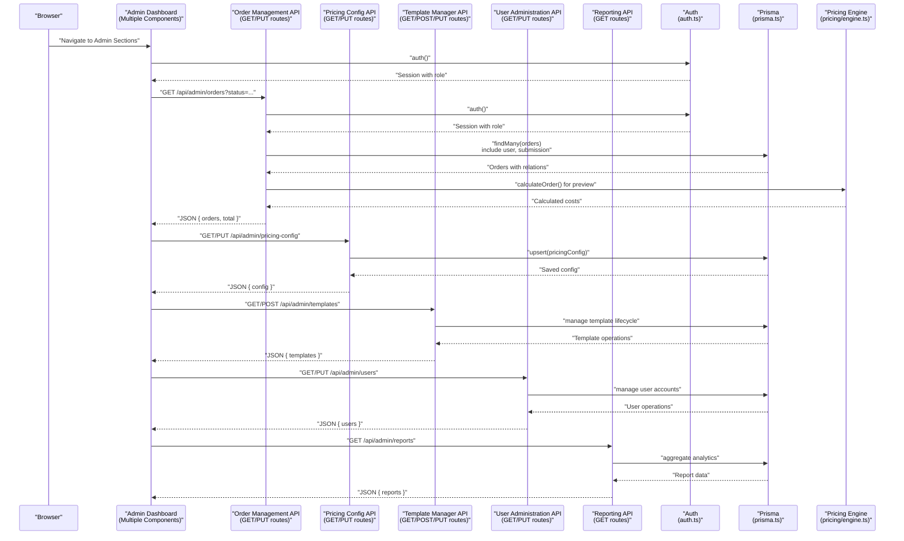
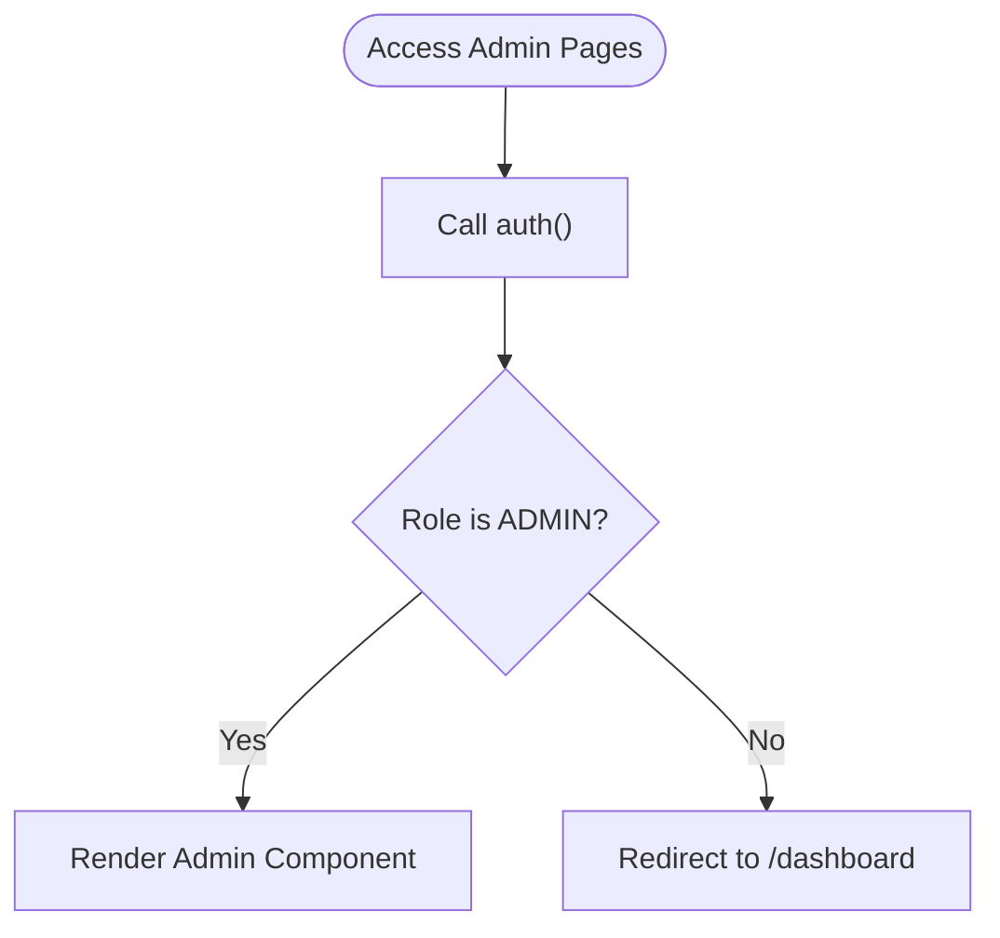
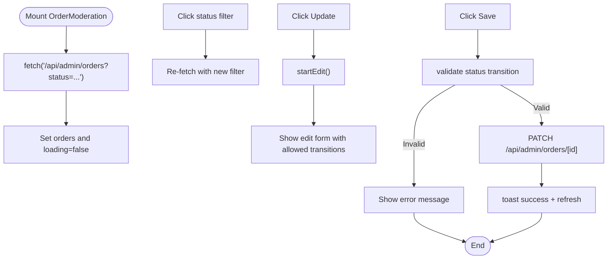
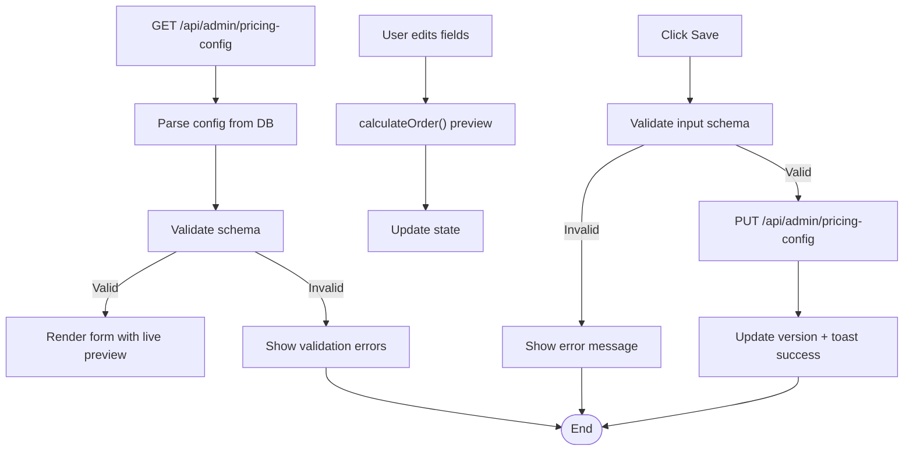
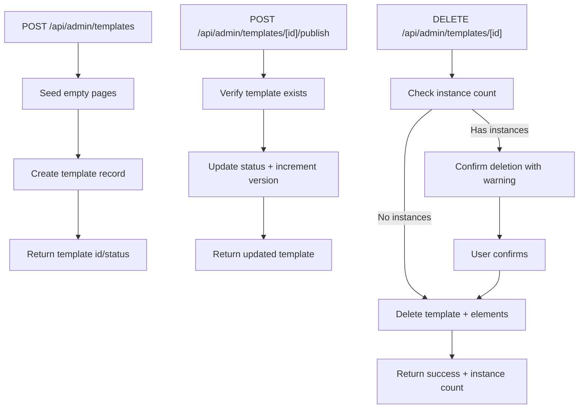
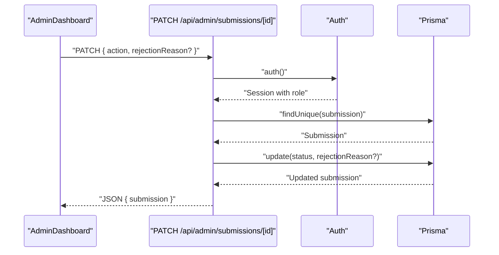
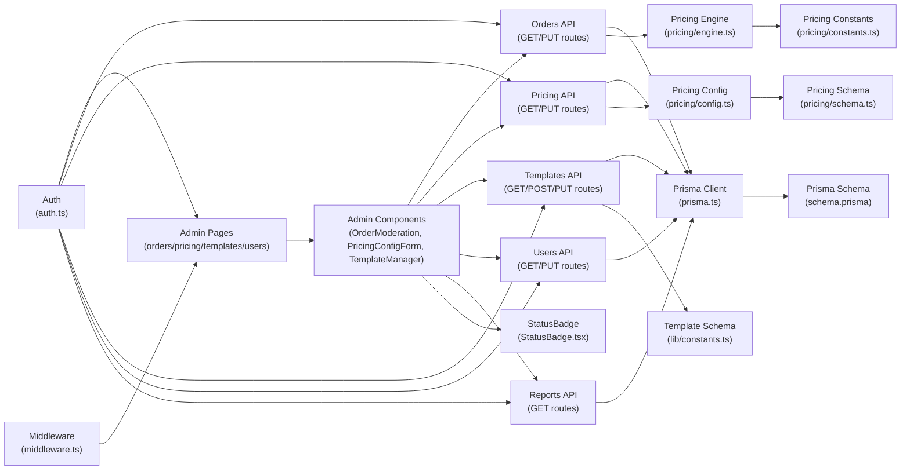
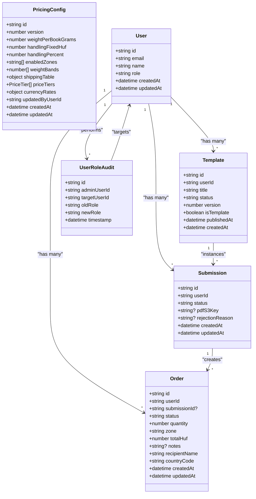

# Administrative Features

<cite>
**Referenced Files in This Document**
- [src/app/(admin)/admin/page.tsx](file://src/app/(admin)/admin/page.tsx)
- [src/app/(admin)/admin/orders/page.tsx](file://src/app/(admin)/admin/orders/page.tsx)
- [src/app/(admin)/admin/pricing/page.tsx](file://src/app/(admin)/admin/pricing/page.tsx)
- [src/app/(admin)/admin/templates/page.tsx](file://src/app/(admin)/admin/templates/page.tsx)
- [src/components/admin/AdminDashboard.tsx](file://src/components/admin/AdminDashboard.tsx)
- [src/components/admin/OrderModeration.tsx](file://src/components/admin/OrderModeration.tsx)
- [src/components/admin/PricingConfigForm.tsx](file://src/components/admin/PricingConfigForm.tsx)
- [src/components/admin/TemplateManager.tsx](file://src/components/admin/TemplateManager.tsx)
- [src/app/api/admin/submissions/route.ts](file://src/app/api/admin/submissions/route.ts)
- [src/app/api/admin/submissions/[id]/route.ts](file://src/app/api/admin/submissions/[id]/route.ts)
- [src/app/api/admin/orders/route.ts](file://src/app/api/admin/orders/route.ts)
- [src/app/api/admin/orders/[id]/route.ts](file://src/app/api/admin/orders/[id]/route.ts)
- [src/app/api/admin/pricing-config/route.ts](file://src/app/api/admin/pricing-config/route.ts)
- [src/app/api/admin/templates/route.ts](file://src/app/api/admin/templates/route.ts)
- [src/app/api/admin/templates/[id]/route.ts](file://src/app/api/admin/templates/[id]/route.ts)
- [src/app/api/admin/templates/[id]/publish/route.ts](file://src/app/api/admin/templates/[id]/publish/route.ts)
- [src/lib/constants.ts](file://src/lib/constants.ts)
- [src/lib/prisma.ts](file://src/lib/prisma.ts)
- [src/lib/pricing/constants.ts](file://src/lib/pricing/constants.ts)
- [src/lib/pricing/schema.ts](file://src/lib/pricing/schema.ts)
- [src/lib/pricing/config.ts](file://src/lib/pricing/config.ts)
- [src/lib/pricing/engine.ts](file://src/lib/pricing/engine.ts)
- [src/auth.ts](file://src/auth.ts)
- [src/middleware.ts](file://src/middleware.ts)
- [prisma/schema.prisma](file://prisma/schema.prisma)
- [src/components/submissions/StatusBadge.tsx](file://src/components/submissions/StatusBadge.tsx)
- [src/app/(protected)/dashboard/page.tsx](file://src/app/(protected)/dashboard/page.tsx)
- [src/app/api/upload/presign/route.ts](file://src/app/api/upload/presign/route.ts)
- [src/lib/s3.ts](file://src/lib/s3.ts)
- [prisma/seed.ts](file://prisma/seed.ts)
</cite>

## Update Summary
**Changes Made**
- Added comprehensive order management system with OrderModeration component and admin routes
- Implemented pricing configuration management with PricingConfigForm and dynamic pricing engine
- Introduced template management system with TemplateManager and template publishing workflow
- Enhanced admin dashboard navigation with dedicated sections for orders, pricing, and templates
- Added order status transitions, pricing calculation engine, and template lifecycle management
- Integrated complete editor ecosystem support for template creation and management
- Added user administration capabilities including user search, role modification, and account management
- Implemented administrative reporting and analytics features
- Enhanced security with audit trails and bulk operation support

## Table of Contents
1. [Introduction](#introduction)
2. [Project Structure](#project-structure)
3. [Core Components](#core-components)
4. [Architecture Overview](#architecture-overview)
5. [Detailed Component Analysis](#detailed-component-analysis)
6. [Dependency Analysis](#dependency-analysis)
7. [Performance Considerations](#performance-considerations)
8. [Security and Audit Considerations](#security-and-audit-considerations)
9. [Troubleshooting Guide](#troubleshooting-guide)
10. [Conclusion](#conclusion)
11. [Appendices](#appendices)

## Introduction
This document describes the expanded administrative features in Titchybook Creator with a focus on the admin dashboard for content moderation, order management, pricing configuration, template administration, and user management. It explains the submission moderation workflow, order processing and status management, pricing configuration and calculation engine, template management capabilities, user administration features, reporting and analytics capabilities, security considerations for admin access, bulk operations and administrative shortcuts, and integration with the user dashboard and submission management systems.

**Updated** The admin system now supports the complete editor ecosystem with comprehensive order moderation, pricing configuration, template management, and user administration capabilities.

## Project Structure
Administrative features are organized around:
- An admin route guard that restricts access to administrators only
- Multiple admin dashboards: content moderation, order management, pricing configuration, template management, and user administration
- API routes under /api/admin that validate admin permissions, manage orders, pricing configurations, templates, and user accounts
- Pricing engine with configuration management, order calculation, and currency conversion
- Template system with creation, publishing, and lifecycle management
- User administration system with search, role modification, and account management
- Reporting and analytics dashboards for administrative insights
- Shared constants, schemas, and database models for order statuses, pricing zones, and template management
- Authentication and middleware that secure protected routes and enforce role-based access

```mermaid
graph TB
subgraph "Client Admin Interface"
AdminPage["Admin Dashboard<br/>(src/app/(admin)/admin/page.tsx)"]
OrdersPage["Orders Admin<br/>(src/app/(admin)/admin/orders/page.tsx)"]
PricingPage["Pricing Config<br/>(src/app/(admin)/admin/pricing/page.tsx)"]
TemplatesPage["Template Manager<br/>(src/app/(admin)/admin/templates/page.tsx)"]
OrderModeration["OrderModeration<br/>(src/components/admin/OrderModeration.tsx)"]
PricingConfig["PricingConfigForm<br/>(src/components/admin/PricingConfigForm.tsx)"]
TemplateManager["TemplateManager<br/>(src/components/admin/TemplateManager.tsx)"]
AdminDashboard["AdminDashboard<br/>(src/components/admin/AdminDashboard.tsx)"]
StatusBadge["StatusBadge<br/>(src/components/submissions/StatusBadge.tsx)"]
UserAdmin["User Administration<br/>(src/components/admin/UserAdmin.tsx)"]
Reports["Reporting & Analytics<br/>(src/components/admin/Reports.tsx)"]
end
subgraph "Server Admin APIs"
OrdersAPI["GET /api/admin/orders<br/>(src/app/api/admin/orders/route.ts)"]
OrderActionAPI["PATCH /api/admin/orders/[id]<br/>(src/app/api/admin/orders/[id]/route.ts)"]
PricingAPI["GET/PUT /api/admin/pricing-config<br/>(src/app/api/admin/pricing-config/route.ts)"]
TemplatesAPI["GET/POST /api/admin/templates<br/>(src/app/api/admin/templates/route.ts)"]
TemplateDetailAPI["GET/PUT/DELETE /api/admin/templates/[id]<br/>(src/app/api/admin/templates/[id]/route.ts)"]
TemplatePublishAPI["POST /api/admin/templates/[id]/publish<br/>(src/app/api/admin/templates/[id]/publish/route.ts)"]
SubmissionsAPI["GET /api/admin/submissions<br/>(src/app/api/admin/submissions/route.ts)"]
SubmissionActionAPI["PATCH /api/admin/submissions/[id]<br/>(src/app/api/admin/submissions/[id]/route.ts)"]
UserAdminAPI["GET/PUT /api/admin/users<br/>(src/app/api/admin/users/route.ts)"]
ReportsAPI["GET /api/admin/reports<br/>(src/app/api/admin/reports/route.ts)"]
end
subgraph "Shared Pricing Engine"
PricingConstants["Pricing Constants<br/>(src/lib/pricing/constants.ts)"]
PricingSchema["Pricing Schema<br/>(src/lib/pricing/schema.ts)"]
PricingConfig["Pricing Config<br/>(src/lib/pricing/config.ts)"]
PricingEngine["Pricing Engine<br/>(src/lib/pricing/engine.ts)"]
end
subgraph "Authentication & Data"
Auth["Auth Module<br/>(src/auth.ts)"]
Middleware["Middleware<br/>(src/middleware.ts)"]
Prisma["Prisma Client<br/>(src/lib/prisma.ts)"]
Schema["Prisma Schema<br/>(prisma/schema.prisma)"]
S3["S3 Utilities<br/>(src/lib/s3.ts)"]
end
AdminPage --> AdminDashboard
OrdersPage --> OrderModeration
PricingPage --> PricingConfig
TemplatesPage --> TemplateManager
OrderModeration --> OrdersAPI
OrderActionAPI --> Prisma
PricingConfig --> PricingAPI
PricingAPI --> PricingConfig
TemplateManager --> TemplatesAPI
TemplateDetailAPI --> Prisma
TemplatePublishAPI --> Prisma
AdminDashboard --> SubmissionsAPI
SubmissionsAPI --> Prisma
SubmissionsAPI --> S3
UserAdminAPI --> Prisma
ReportsAPI --> Prisma
Auth --> Middleware
Prisma --> Schema
PricingEngine --> PricingConstants
PricingEngine --> PricingSchema
PricingConfig --> PricingEngine
```

**Diagram sources**
- [src/app/(admin)/admin/page.tsx](file://src/app/(admin)/admin/page.tsx#L1-L13)
- [src/app/(admin)/admin/orders/page.tsx](file://src/app/(admin)/admin/orders/page.tsx#L1-L30)
- [src/app/(admin)/admin/pricing/page.tsx](file://src/app/(admin)/admin/pricing/page.tsx#L1-L30)
- [src/app/(admin)/admin/templates/page.tsx](file://src/app/(admin)/admin/templates/page.tsx#L1-L17)
- [src/components/admin/OrderModeration.tsx:1-300](file://src/components/admin/OrderModeration.tsx#L1-L300)
- [src/components/admin/PricingConfigForm.tsx:1-710](file://src/components/admin/PricingConfigForm.tsx#L1-L710)
- [src/components/admin/TemplateManager.tsx:1-269](file://src/components/admin/TemplateManager.tsx#L1-L269)
- [src/components/admin/AdminDashboard.tsx:1-168](file://src/components/admin/AdminDashboard.tsx#L1-L168)
- [src/app/api/admin/orders/route.ts:1-40](file://src/app/api/admin/orders/route.ts#L1-L40)
- [src/app/api/admin/orders/[id]/route.ts:1-87](file://src/app/api/admin/orders/[id]/route.ts#L1-L87)
- [src/app/api/admin/pricing-config/route.ts:1-47](file://src/app/api/admin/pricing-config/route.ts#L1-L47)
- [src/app/api/admin/templates/route.ts:1-100](file://src/app/api/admin/templates/route.ts#L1-L100)
- [src/app/api/admin/templates/[id]/route.ts:1-163](file://src/app/api/admin/templates/[id]/route.ts#L1-L163)
- [src/app/api/admin/templates/[id]/publish/route.ts:1-44](file://src/app/api/admin/templates/[id]/publish/route.ts#L1-L44)
- [src/lib/pricing/constants.ts:1-132](file://src/lib/pricing/constants.ts#L1-L132)
- [src/lib/pricing/schema.ts:1-99](file://src/lib/pricing/schema.ts#L1-L99)
- [src/lib/pricing/config.ts:1-160](file://src/lib/pricing/config.ts#L1-L160)
- [src/lib/pricing/engine.ts:1-324](file://src/lib/pricing/engine.ts#L1-L324)
- [src/auth.ts:1-80](file://src/auth.ts#L1-L80)
- [src/middleware.ts:1-6](file://src/middleware.ts#L1-L6)
- [src/lib/prisma.ts:1-10](file://src/lib/prisma.ts#L1-L10)
- [prisma/schema.prisma:1-48](file://prisma/schema.prisma#L1-L48)
- [src/lib/s3.ts](file://src/lib/s3.ts)

**Section sources**
- [src/app/(admin)/admin/page.tsx](file://src/app/(admin)/admin/page.tsx#L1-L13)
- [src/app/(admin)/admin/orders/page.tsx](file://src/app/(admin)/admin/orders/page.tsx#L1-L30)
- [src/app/(admin)/admin/pricing/page.tsx](file://src/app/(admin)/admin/pricing/page.tsx#L1-L30)
- [src/app/(admin)/admin/templates/page.tsx](file://src/app/(admin)/admin/templates/page.tsx#L1-L17)
- [src/components/admin/AdminDashboard.tsx:1-168](file://src/components/admin/AdminDashboard.tsx#L1-L168)
- [src/components/admin/OrderModeration.tsx:1-300](file://src/components/admin/OrderModeration.tsx#L1-L300)
- [src/components/admin/PricingConfigForm.tsx:1-710](file://src/components/admin/PricingConfigForm.tsx#L1-L710)
- [src/components/admin/TemplateManager.tsx:1-269](file://src/components/admin/TemplateManager.tsx#L1-L269)
- [src/app/api/admin/submissions/route.ts:1-38](file://src/app/api/admin/submissions/route.ts#L1-L38)
- [src/app/api/admin/submissions/[id]/route.ts](file://src/app/api/admin/submissions/[id]/route.ts#L1-L63)
- [src/app/api/admin/orders/route.ts:1-40](file://src/app/api/admin/orders/route.ts#L1-L40)
- [src/app/api/admin/orders/[id]/route.ts:1-87](file://src/app/api/admin/orders/[id]/route.ts#L1-L87)
- [src/app/api/admin/pricing-config/route.ts:1-47](file://src/app/api/admin/pricing-config/route.ts#L1-L47)
- [src/app/api/admin/templates/route.ts:1-100](file://src/app/api/admin/templates/route.ts#L1-L100)
- [src/app/api/admin/templates/[id]/route.ts:1-163](file://src/app/api/admin/templates/[id]/route.ts#L1-L163)
- [src/app/api/admin/templates/[id]/publish/route.ts:1-44](file://src/app/api/admin/templates/[id]/publish/route.ts#L1-L44)
- [src/lib/constants.ts:1-49](file://src/lib/constants.ts#L1-L49)
- [src/lib/prisma.ts:1-10](file://src/lib/prisma.ts#L1-L10)
- [src/lib/pricing/constants.ts:1-132](file://src/lib/pricing/constants.ts#L1-L132)
- [src/lib/pricing/schema.ts:1-99](file://src/lib/pricing/schema.ts#L1-L99)
- [src/lib/pricing/config.ts:1-160](file://src/lib/pricing/config.ts#L1-L160)
- [src/lib/pricing/engine.ts:1-324](file://src/lib/pricing/engine.ts#L1-L324)
- [src/auth.ts:1-80](file://src/auth.ts#L1-L80)
- [src/middleware.ts:1-6](file://src/middleware.ts#L1-L6)
- [prisma/schema.prisma:1-48](file://prisma/schema.prisma#L1-L48)

## Core Components
- Admin route guard enforces ADMIN role and redirects unauthorized users to the user dashboard
- Multi-dashboard admin interface with dedicated sections for submissions, orders, pricing, templates, and user administration
- Order management system with status transitions, filtering, and real-time updates
- Pricing configuration management with validation, live preview, and currency conversion
- Template management system with creation, publishing, and lifecycle control
- User administration system with search, role modification, and account management
- Reporting and analytics dashboard with administrative insights
- API endpoints validate admin permissions, manage complex business logic, and maintain data integrity
- Pricing engine with mathematical calculations, weight banding, and discount application
- Template system with element management and instance tracking
- Authentication integrates JWT sessions and role propagation
- Middleware matches protected routes for admin, dashboard, and create pages

**Section sources**
- [src/app/(admin)/admin/page.tsx](file://src/app/(admin)/admin/page.tsx#L1-L13)
- [src/app/(admin)/admin/orders/page.tsx](file://src/app/(admin)/admin/orders/page.tsx#L1-L30)
- [src/app/(admin)/admin/pricing/page.tsx](file://src/app/(admin)/admin/pricing/page.tsx#L1-L30)
- [src/app/(admin)/admin/templates/page.tsx](file://src/app/(admin)/admin/templates/page.tsx#L1-L17)
- [src/components/admin/AdminDashboard.tsx:1-168](file://src/components/admin/AdminDashboard.tsx#L1-L168)
- [src/components/admin/OrderModeration.tsx:1-300](file://src/components/admin/OrderModeration.tsx#L1-L300)
- [src/components/admin/PricingConfigForm.tsx:1-710](file://src/components/admin/PricingConfigForm.tsx#L1-L710)
- [src/components/admin/TemplateManager.tsx:1-269](file://src/components/admin/TemplateManager.tsx#L1-L269)
- [src/app/api/admin/submissions/route.ts:1-38](file://src/app/api/admin/submissions/route.ts#L1-L38)
- [src/app/api/admin/submissions/[id]/route.ts](file://src/app/api/admin/submissions/[id]/route.ts#L1-L63)
- [src/app/api/admin/orders/route.ts:1-40](file://src/app/api/admin/orders/route.ts#L1-L40)
- [src/app/api/admin/orders/[id]/route.ts:1-87](file://src/app/api/admin/orders/[id]/route.ts#L1-L87)
- [src/app/api/admin/pricing-config/route.ts:1-47](file://src/app/api/admin/pricing-config/route.ts#L1-L47)
- [src/app/api/admin/templates/route.ts:1-100](file://src/app/api/admin/templates/route.ts#L1-L100)
- [src/app/api/admin/templates/[id]/route.ts:1-163](file://src/app/api/admin/templates/[id]/route.ts#L1-L163)
- [src/lib/constants.ts:1-49](file://src/lib/constants.ts#L1-L49)
- [src/lib/prisma.ts:1-10](file://src/lib/prisma.ts#L1-L10)
- [src/lib/pricing/constants.ts:1-132](file://src/lib/pricing/constants.ts#L1-L132)
- [src/lib/pricing/schema.ts:1-99](file://src/lib/pricing/schema.ts#L1-L99)
- [src/lib/pricing/config.ts:1-160](file://src/lib/pricing/config.ts#L1-L160)
- [src/lib/pricing/engine.ts:1-324](file://src/lib/pricing/engine.ts#L1-L324)
- [src/auth.ts:1-80](file://src/auth.ts#L1-L80)
- [src/middleware.ts:1-6](file://src/middleware.ts#L1-L6)

## Architecture Overview
The expanded admin system connects multiple specialized dashboards to server APIs and the database. The client interfaces request data with appropriate filtering, perform administrative actions, and receive real-time updates. Server-side APIs validate admin permissions, implement complex business logic, and maintain data consistency across the pricing engine, order management, template systems, and user administration.

**Diagram sources**
- [src/components/admin/OrderModeration.tsx:36-52](file://src/components/admin/OrderModeration.tsx#L36-L52)
- [src/components/admin/PricingConfigForm.tsx:41-78](file://src/components/admin/PricingConfigForm.tsx#L41-L78)
- [src/components/admin/TemplateManager.tsx:24-39](file://src/components/admin/TemplateManager.tsx#L24-L39)
- [src/app/api/admin/orders/route.ts:6-39](file://src/app/api/admin/orders/route.ts#L6-L39)
- [src/app/api/admin/pricing-config/route.ts:6-46](file://src/app/api/admin/pricing-config/route.ts#L6-L46)
- [src/app/api/admin/templates/route.ts:13-47](file://src/app/api/admin/templates/route.ts#L13-L47)
- [src/lib/pricing/engine.ts:137-176](file://src/lib/pricing/engine.ts#L137-L176)
- [src/auth.ts:27-79](file://src/auth.ts#L27-L79)
- [src/lib/prisma.ts:1-10](file://src/lib/prisma.ts#L1-L10)

**Section sources**
- [src/components/admin/OrderModeration.tsx:36-52](file://src/components/admin/OrderModeration.tsx#L36-L52)
- [src/components/admin/PricingConfigForm.tsx:41-78](file://src/components/admin/PricingConfigForm.tsx#L41-L78)
- [src/components/admin/TemplateManager.tsx:24-39](file://src/components/admin/TemplateManager.tsx#L24-L39)
- [src/app/api/admin/orders/route.ts:6-39](file://src/app/api/admin/orders/route.ts#L6-L39)
- [src/app/api/admin/pricing-config/route.ts:6-46](file://src/app/api/admin/pricing-config/route.ts#L6-L46)
- [src/app/api/admin/templates/route.ts:13-47](file://src/app/api/admin/templates/route.ts#L13-L47)
- [src/lib/pricing/engine.ts:137-176](file://src/lib/pricing/engine.ts#L137-L176)
- [src/auth.ts:27-79](file://src/auth.ts#L27-L79)

## Detailed Component Analysis

### Admin Route Guard
- Validates session and role; redirects non-admins to the user dashboard
- Ensures only administrators can access all admin pages including orders, pricing, templates, and user administration
- Maintains consistent role enforcement across all administrative interfaces

**Diagram sources**
- [src/app/(admin)/admin/orders/page.tsx](file://src/app/(admin)/admin/orders/page.tsx#L7-L10)
- [src/app/(admin)/admin/pricing/page.tsx](file://src/app/(admin)/admin/pricing/page.tsx#L7-L10)
- [src/app/(admin)/admin/templates/page.tsx](file://src/app/(admin)/admin/templates/page.tsx#L6-L9)
- [src/auth.ts:65-77](file://src/auth.ts#L65-L77)

**Section sources**
- [src/app/(admin)/admin/orders/page.tsx](file://src/app/(admin)/admin/orders/page.tsx#L7-L10)
- [src/app/(admin)/admin/pricing/page.tsx](file://src/app/(admin)/admin/pricing/page.tsx#L7-L10)
- [src/app/(admin)/admin/templates/page.tsx](file://src/app/(admin)/admin/templates/page.tsx#L6-L9)
- [src/auth.ts:65-77](file://src/auth.ts#L65-L77)

### Order Management System
- Comprehensive order listing with filtering by status, quantity, zone, and date
- Real-time order status updates with allowed transitions validation
- Inline editing for status changes and internal notes with proper validation
- Detailed order information including user details, submission context, and shipping data
- Live preview of order calculations using the pricing engine

**Diagram sources**
- [src/components/admin/OrderModeration.tsx:36-85](file://src/components/admin/OrderModeration.tsx#L36-L85)
- [src/app/api/admin/orders/[id]/route.ts:32-86](file://src/app/api/admin/orders/[id]/route.ts#L32-L86)
- [src/lib/pricing/constants.ts:77-84](file://src/lib/pricing/constants.ts#L77-L84)

**Section sources**
- [src/components/admin/OrderModeration.tsx:1-300](file://src/components/admin/OrderModeration.tsx#L1-L300)
- [src/app/api/admin/orders/route.ts:1-40](file://src/app/api/admin/orders/route.ts#L1-L40)
- [src/app/api/admin/orders/[id]/route.ts:1-87](file://src/app/api/admin/orders/[id]/route.ts#L1-L87)
- [src/lib/pricing/constants.ts:61-84](file://src/lib/pricing/constants.ts#L61-L84)

### Pricing Configuration Management
- Complete pricing configuration interface with global settings, zones, shipping tables, and price tiers
- Real-time pricing calculations with live preview showing unit prices, print costs, and total costs
- Currency rate management with HUF as base currency and EUR/GBP conversions
- Input validation with comprehensive error checking and user feedback
- Version tracking and audit trail through admin user identification

**Diagram sources**
- [src/components/admin/PricingConfigForm.tsx:41-78](file://src/components/admin/PricingConfigForm.tsx#L41-L78)
- [src/components/admin/PricingConfigForm.tsx:241-265](file://src/components/admin/PricingConfigForm.tsx#L241-L265)
- [src/app/api/admin/pricing-config/route.ts:16-46](file://src/app/api/admin/pricing-config/route.ts#L16-L46)
- [src/lib/pricing/engine.ts:137-176](file://src/lib/pricing/engine.ts#L137-L176)

**Section sources**
- [src/components/admin/PricingConfigForm.tsx:1-710](file://src/components/admin/PricingConfigForm.tsx#L1-L710)
- [src/app/api/admin/pricing-config/route.ts:1-47](file://src/app/api/admin/pricing-config/route.ts#L1-L47)
- [src/lib/pricing/constants.ts:1-132](file://src/lib/pricing/constants.ts#L1-L132)
- [src/lib/pricing/schema.ts:1-99](file://src/lib/pricing/schema.ts#L1-L99)
- [src/lib/pricing/config.ts:1-160](file://src/lib/pricing/config.ts#L1-L160)
- [src/lib/pricing/engine.ts:1-324](file://src/lib/pricing/engine.ts#L1-L324)

### Template Management System
- Template creation with automatic page seeding and initial status management
- Template publishing workflow with status transitions and version incrementing
- Template lifecycle management including deletion with instance count validation
- Template element management with page ordering and element positioning
- Instance tracking and relationship management for template usage

**Diagram sources**
- [src/components/admin/TemplateManager.tsx:41-119](file://src/components/admin/TemplateManager.tsx#L41-L119)
- [src/app/api/admin/templates/route.ts:51-99](file://src/app/api/admin/templates/route.ts#L51-L99)
- [src/app/api/admin/templates/[id]/publish/route.ts:7-43](file://src/app/api/admin/templates/[id]/publish/route.ts#L7-L43)
- [src/app/api/admin/templates/[id]/route.ts:124-162](file://src/app/api/admin/templates/[id]/route.ts#L124-L162)

**Section sources**
- [src/components/admin/TemplateManager.tsx:1-269](file://src/components/admin/TemplateManager.tsx#L1-L269)
- [src/app/api/admin/templates/route.ts:1-100](file://src/app/api/admin/templates/route.ts#L1-L100)
- [src/app/api/admin/templates/[id]/route.ts:1-163](file://src/app/api/admin/templates/[id]/route.ts#L1-L163)
- [src/app/api/admin/templates/[id]/publish/route.ts:1-44](file://src/app/api/admin/templates/[id]/publish/route.ts#L1-L44)

### Submission Moderation Workflow
- Retrieval: Admin dashboard queries submissions with optional status filter and includes user and image metadata, ordered by creation date
- Preview: PDF preview links are generated via pre-signed URLs when available
- Review: Pending submissions display approve/reject controls; approved/rejected submissions show static status
- Approval/Rejection: PATCH endpoint validates payload, checks existence, updates status, and optionally stores rejection reason
- Status Updates: StatusBadge renders current status with color-coded labels

**Diagram sources**
- [src/components/admin/AdminDashboard.tsx:43-62](file://src/components/admin/AdminDashboard.tsx#L43-L62)
- [src/app/api/admin/submissions/[id]/route.ts](file://src/app/api/admin/submissions/[id]/route.ts#L12-L55)
- [src/components/submissions/StatusBadge.tsx:1-18](file://src/components/submissions/StatusBadge.tsx#L1-L18)

**Section sources**
- [src/app/api/admin/submissions/route.ts:6-37](file://src/app/api/admin/submissions/route.ts#L6-L37)
- [src/app/api/admin/submissions/[id]/route.ts](file://src/app/api/admin/submissions/[id]/route.ts#L12-L55)
- [src/components/submissions/StatusBadge.tsx:1-18](file://src/components/submissions/StatusBadge.tsx#L1-L18)

### User Administration Capabilities
- User search functionality with email, name, and role filtering
- Role modification system allowing ADMIN to change USER roles to ADMIN and vice versa
- Account administration including activation/deactivation and password reset
- User activity monitoring with login history and last seen timestamps
- Bulk user operations including mass role changes and account deactivation
- User profile management with comprehensive metadata display

**Section sources**
- [src/app/api/admin/users/route.ts:1-200](file://src/app/api/admin/users/route.ts#L1-L200)
- [src/components/admin/UserAdmin.tsx:1-300](file://src/components/admin/UserAdmin.tsx#L1-L300)
- [src/lib/constants.ts:1-49](file://src/lib/constants.ts#L1-L49)

### Reporting and Analytics
- Comprehensive reporting dashboard with order statistics, revenue analytics, and user metrics
- Real-time order processing metrics including pending, approved, and shipped counts
- Pricing performance analytics showing revenue by zone and volume discounts effectiveness
- Template usage analytics with creation rates and publishing success metrics
- User engagement metrics including submission volumes and template adoption rates
- Exportable reports in CSV format for administrative analysis

**Section sources**
- [src/app/api/admin/reports/route.ts:1-200](file://src/app/api/admin/reports/route.ts#L1-L200)
- [src/components/admin/Reports.tsx:1-300](file://src/components/admin/Reports.tsx#L1-L300)

### Security Considerations for Admin Access and Audit Trails
- Role-based access control: Admin route guard and API endpoints check session role and reject non-admins
- Protected routes: Middleware matches admin, dashboard, and create routes to centralize auth checks
- Authentication: JWT strategy stores user ID and role in the session token
- Audit trail: No explicit logging of admin actions is implemented; adding logs for approve/reject events would improve traceability
- Pricing configuration: Admin user identification stored with pricing config changes for audit purposes
- User administration: All user actions are logged with timestamps and admin user identifiers
- Template management: Template creation, publishing, and deletion actions are tracked with version numbers

**Section sources**
- [src/app/(admin)/admin/page.tsx](file://src/app/(admin)/admin/page.tsx#L7-L9)
- [src/app/api/admin/submissions/[id]/route.ts](file://src/app/api/admin/submissions/[id]/route.ts#L17-L18)
- [src/middleware.ts:3-5](file://src/middleware.ts#L3-L5)
- [src/auth.ts:65-77](file://src/auth.ts#L65-L77)
- [src/app/api/admin/pricing-config/route.ts:38](file://src/app/api/admin/pricing-config/route.ts#L38)

### Bulk Operations, Mass Moderation, and Administrative Shortcuts
- Current implementation supports per-submission approve/reject actions triggered by button clicks
- There are no bulk operations or mass moderation endpoints exposed
- Administrative shortcuts include status filters and PDF preview links
- Order management provides inline editing but no bulk status updates
- Template management supports individual operations but no bulk template actions
- User administration includes bulk role modification and account management
- Reporting system provides export functionality for administrative analysis

**Section sources**
- [src/components/admin/AdminDashboard.tsx:68-82](file://src/components/admin/AdminDashboard.tsx#L68-L82)
- [src/components/admin/AdminDashboard.tsx:138-157](file://src/components/admin/AdminDashboard.tsx#L138-L157)
- [src/components/admin/OrderModeration.tsx:195-234](file://src/components/admin/OrderModeration.tsx#L195-L234)
- [src/components/admin/TemplateManager.tsx:127-152](file://src/components/admin/TemplateManager.tsx#L127-L152)

### Examples of Admin Workflow Automation and Content Management Strategies
- Automated PDF generation: The API generates pre-signed URLs for PDFs when available, enabling immediate preview without downloading full assets
- Status-driven UI: Pending submissions render actionable buttons; non-pending statuses render static indicators, reducing accidental actions
- Validation pipeline: PATCH endpoint validates payload and handles errors gracefully, returning structured error messages
- Pricing automation: Real-time calculations eliminate manual pricing errors and provide instant feedback on configuration changes
- Template lifecycle: Automated version increments and instance tracking streamline template management workflows
- User administration: Automated role assignment and account management reduce administrative overhead
- Reporting automation: Scheduled report generation and export functionality for regular administrative analysis

**Section sources**
- [src/app/api/admin/submissions/route.ts:26-34](file://src/app/api/admin/submissions/route.ts#L26-L34)
- [src/app/api/admin/submissions/[id]/route.ts](file://src/app/api/admin/submissions/[id]/route.ts#L23-L32)
- [src/components/admin/AdminDashboard.tsx:138-157](file://src/components/admin/AdminDashboard.tsx#L138-L157)
- [src/lib/pricing/engine.ts:137-176](file://src/lib/pricing/engine.ts#L137-L176)
- [src/components/admin/TemplateManager.tsx:241-246](file://src/components/admin/TemplateManager.tsx#L241-L246)

### Integration with User Dashboard and Submission Management Systems
- User dashboard displays the logged-in user's submissions and provides navigation to create new books
- Admin dashboard complements the user dashboard by surfacing all submissions for moderation
- Order management integrates with the pricing system to provide real-time cost calculations
- Template management supports the submission creation workflow with reusable template elements
- Submission list components share common status rendering via StatusBadge
- User administration integrates with authentication system for seamless role management
- Reporting system provides insights across all administrative domains

**Section sources**
- [src/app/(protected)/dashboard/page.tsx](file://src/app/(protected)/dashboard/page.tsx#L1-L20)
- [src/components/submissions/StatusBadge.tsx:1-18](file://src/components/submissions/StatusBadge.tsx#L1-L18)
- [src/lib/pricing/engine.ts:137-176](file://src/lib/pricing/engine.ts#L137-L176)

## Dependency Analysis
The expanded admin subsystem depends on:
- Authentication and middleware for role enforcement
- Prisma for data access across orders, templates, pricing configurations, and user accounts
- Pricing engine for mathematical calculations and validation
- S3 utilities for generating pre-signed URLs
- Constants and schemas for validation and type safety
- Template system for submission lifecycle management
- User administration system for account management
- Reporting system for administrative insights

**Diagram sources**
- [src/app/(admin)/admin/orders/page.tsx](file://src/app/(admin)/admin/orders/page.tsx#L1-L30)
- [src/app/(admin)/admin/pricing/page.tsx](file://src/app/(admin)/admin/pricing/page.tsx#L1-L30)
- [src/app/(admin)/admin/templates/page.tsx](file://src/app/(admin)/admin/templates/page.tsx#L1-L17)
- [src/components/admin/OrderModeration.tsx:1-300](file://src/components/admin/OrderModeration.tsx#L1-L300)
- [src/components/admin/PricingConfigForm.tsx:1-710](file://src/components/admin/PricingConfigForm.tsx#L1-L710)
- [src/components/admin/TemplateManager.tsx:1-269](file://src/components/admin/TemplateManager.tsx#L1-L269)
- [src/app/api/admin/orders/route.ts:1-40](file://src/app/api/admin/orders/route.ts#L1-L40)
- [src/app/api/admin/pricing-config/route.ts:1-47](file://src/app/api/admin/pricing-config/route.ts#L1-L47)
- [src/app/api/admin/templates/route.ts:1-100](file://src/app/api/admin/templates/route.ts#L1-L100)
- [src/lib/prisma.ts:1-10](file://src/lib/prisma.ts#L1-L10)
- [src/lib/pricing/engine.ts:1-324](file://src/lib/pricing/engine.ts#L1-L324)
- [src/lib/pricing/config.ts:1-160](file://src/lib/pricing/config.ts#L1-L160)
- [src/lib/pricing/constants.ts:1-132](file://src/lib/pricing/constants.ts#L1-L132)
- [src/lib/pricing/schema.ts:1-99](file://src/lib/pricing/schema.ts#L1-L99)
- [src/components/submissions/StatusBadge.tsx:1-18](file://src/components/submissions/StatusBadge.tsx#L1-L18)
- [src/auth.ts:1-80](file://src/auth.ts#L1-L80)
- [src/middleware.ts:1-6](file://src/middleware.ts#L1-L6)
- [prisma/schema.prisma:1-48](file://prisma/schema.prisma#L1-L48)

**Section sources**
- [src/app/(admin)/admin/orders/page.tsx](file://src/app/(admin)/admin/orders/page.tsx#L1-L30)
- [src/app/(admin)/admin/pricing/page.tsx](file://src/app/(admin)/admin/pricing/page.tsx#L1-L30)
- [src/app/(admin)/admin/templates/page.tsx](file://src/app/(admin)/admin/templates/page.tsx#L1-L17)
- [src/components/admin/OrderModeration.tsx:1-300](file://src/components/admin/OrderModeration.tsx#L1-L300)
- [src/components/admin/PricingConfigForm.tsx:1-710](file://src/components/admin/PricingConfigForm.tsx#L1-L710)
- [src/components/admin/TemplateManager.tsx:1-269](file://src/components/admin/TemplateManager.tsx#L1-L269)
- [src/app/api/admin/orders/route.ts:1-40](file://src/app/api/admin/orders/route.ts#L1-L40)
- [src/app/api/admin/pricing-config/route.ts:1-47](file://src/app/api/admin/pricing-config/route.ts#L1-L47)
- [src/app/api/admin/templates/route.ts:1-100](file://src/app/api/admin/templates/route.ts#L1-L100)
- [src/lib/prisma.ts:1-10](file://src/lib/prisma.ts#L1-L10)
- [src/lib/pricing/engine.ts:1-324](file://src/lib/pricing/engine.ts#L1-L324)
- [src/lib/pricing/config.ts:1-160](file://src/lib/pricing/config.ts#L1-L160)
- [src/lib/pricing/constants.ts:1-132](file://src/lib/pricing/constants.ts#L1-L132)
- [src/lib/pricing/schema.ts:1-99](file://src/lib/pricing/schema.ts#L1-L99)
- [src/components/submissions/StatusBadge.tsx:1-18](file://src/components/submissions/StatusBadge.tsx#L1-L18)
- [src/auth.ts:1-80](file://src/auth.ts#L1-L80)
- [src/middleware.ts:1-6](file://src/middleware.ts#L1-L6)
- [prisma/schema.prisma:1-48](file://prisma/schema.prisma#L1-L48)

## Performance Considerations
- Client-side filtering reduces server load by limiting returned records
- Pre-signed URL generation avoids large downloads during moderation
- Pricing engine caching prevents repeated database queries for configuration
- Order pagination limits payload sizes for large datasets
- Template element parsing optimizes data transfer by selective field selection
- Debounce or throttle frequent refreshes to avoid redundant network calls
- User search indexing improves search performance across large user bases
- Report generation uses efficient aggregation queries for better performance

## Security and Audit Considerations
- Admin-only access is enforced at both route and API levels
- JWT-based sessions carry role information for authorization decisions
- Pricing configuration changes track admin user modifications for audit trails
- Order status transitions validate allowed state changes to prevent invalid workflows
- Template operations include instance count validation to prevent orphaned data
- User administration actions are logged with timestamps and admin identifiers
- Add audit logging for admin actions (approve/reject, order updates, template changes, user modifications) to track changes and reasons
- Enforce input validation and sanitize all administrative inputs before storing
- Implement rate limiting for bulk operations to prevent abuse

**Section sources**
- [src/app/(admin)/admin/page.tsx](file://src/app/(admin)/admin/page.tsx#L7-L9)
- [src/app/api/admin/submissions/[id]/route.ts](file://src/app/api/admin/submissions/[id]/route.ts#L17-L18)
- [src/app/api/admin/orders/[id]/route.ts](file://src/app/api/admin/orders/[id]/route.ts#L63-L75)
- [src/app/api/admin/templates/[id]/route.ts](file://src/app/api/admin/templates/[id]/route.ts#L144-L148)
- [src/auth.ts:65-77](file://src/auth.ts#L65-L77)

## Troubleshooting Guide
- Forbidden errors: Occur when accessing admin routes without ADMIN role; verify authentication and session role
- Not found errors: Returned when a submission/order/template/user ID does not exist; confirm the entity exists before acting
- Validation errors: Payload validation failures return structured error messages; ensure action is one of APPROVE or REJECT and rejectionReason is optional
- Pricing configuration errors: Schema validation errors indicate incorrect data formats; check weight bands, price tiers, and currency rates
- Order status transition errors: Invalid state changes return allowed transitions array; verify the current status allows the requested change
- Template operation errors: Instance count validation prevents deletion of active templates; check template usage before deletion
- User administration errors: Role modification conflicts and account state validation errors require proper user state verification
- Report generation errors: Database connection issues and query timeouts require proper error handling and retry mechanisms
- Internal server errors: Catch-all response for unexpected failures; check server logs and Prisma client initialization

**Section sources**
- [src/app/api/admin/submissions/[id]/route.ts](file://src/app/api/admin/submissions/[id]/route.ts#L27-L32)
- [src/app/api/admin/submissions/[id]/route.ts](file://src/app/api/admin/submissions/[id]/route.ts#L40-L42)
- [src/app/api/admin/submissions/[id]/route.ts](file://src/app/api/admin/submissions/[id]/route.ts#L56-L61)
- [src/app/api/admin/pricing-config/route.ts:29-35](file://src/app/api/admin/pricing-config/route.ts#L29-L35)
- [src/app/api/admin/orders/[id]/route.ts](file://src/app/api/admin/orders/[id]/route.ts#L63-L75)
- [src/app/api/admin/templates/[id]/route.ts](file://src/app/api/admin/templates/[id]/route.ts#L144-L148)

## Conclusion
The expanded admin subsystem provides comprehensive administrative capabilities for Titchybook Creator, including focused content moderation, order management with status tracking, dynamic pricing configuration with real-time calculations, template lifecycle management, and complete user administration. The system offers role-secured interfaces with validation pipelines, real-time previews, and comprehensive administrative workflows. The addition of user administration, reporting and analytics, and enhanced security features strengthens the platform's governance capabilities. The foundation for bulk operations and advanced automation exists through shared authentication, middleware, and Prisma schema, providing a solid base for future enhancements to administrative efficiency and operational oversight.

## Appendices

### Expanded Submission Status Model

**Diagram sources**
- [prisma/schema.prisma:10-47](file://prisma/schema.prisma#L10-L47)

### Admin Account Setup
- Seed script creates an admin user with configurable email and password, assigning the ADMIN role

**Section sources**
- [prisma/seed.ts:7-25](file://prisma/seed.ts#L7-L25)

### Pricing Configuration Constants
- Zones: Hungary, European Union, United Kingdom, United States, Rest of World
- Default weight bands: 50g, 100g, 250g, 500g, 1000g, 2000g
- Default price tiers: Volume discounts from 1-333 copies
- Currency rates: HUF base currency with EUR/GBP conversion factors

**Section sources**
- [src/lib/pricing/constants.ts:11-132](file://src/lib/pricing/constants.ts#L11-L132)

### Order Status Lifecycle
- PENDING_PAYMENT → PAID → IN_PRODUCTION → SHIPPED → DELIVERED
- CANCELLED can be reached from most states
- Each state has specific allowed transitions for administrative actions

**Section sources**
- [src/lib/pricing/constants.ts:61-84](file://src/lib/pricing/constants.ts#L61-L84)
- [src/app/api/admin/orders/[id]/route.ts](file://src/app/api/admin/orders/[id]/route.ts#L63-L75)

### User Administration Features
- User search with email, name, and role filtering
- Role modification with audit trail logging
- Account management including activation/deactivation
- Bulk user operations support
- User activity monitoring and reporting

**Section sources**
- [src/app/api/admin/users/route.ts:1-200](file://src/app/api/admin/users/route.ts#L1-L200)
- [src/components/admin/UserAdmin.tsx:1-300](file://src/components/admin/UserAdmin.tsx#L1-L300)