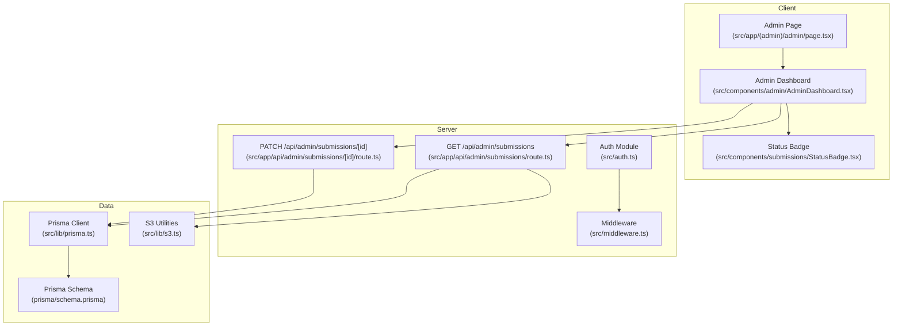
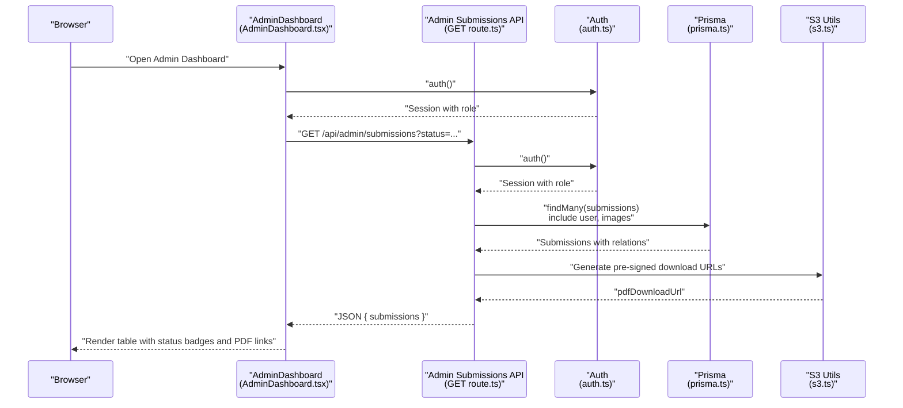
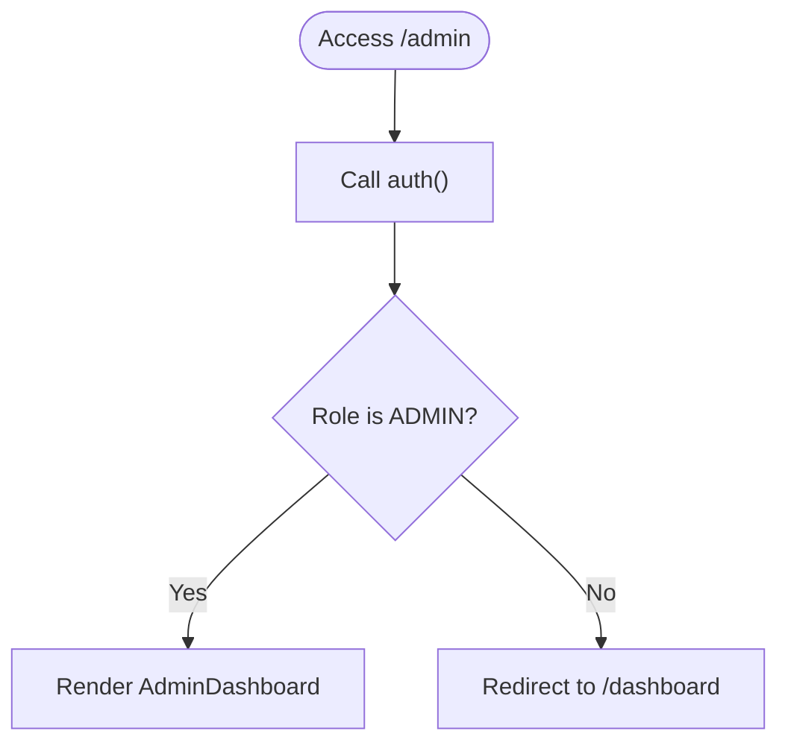
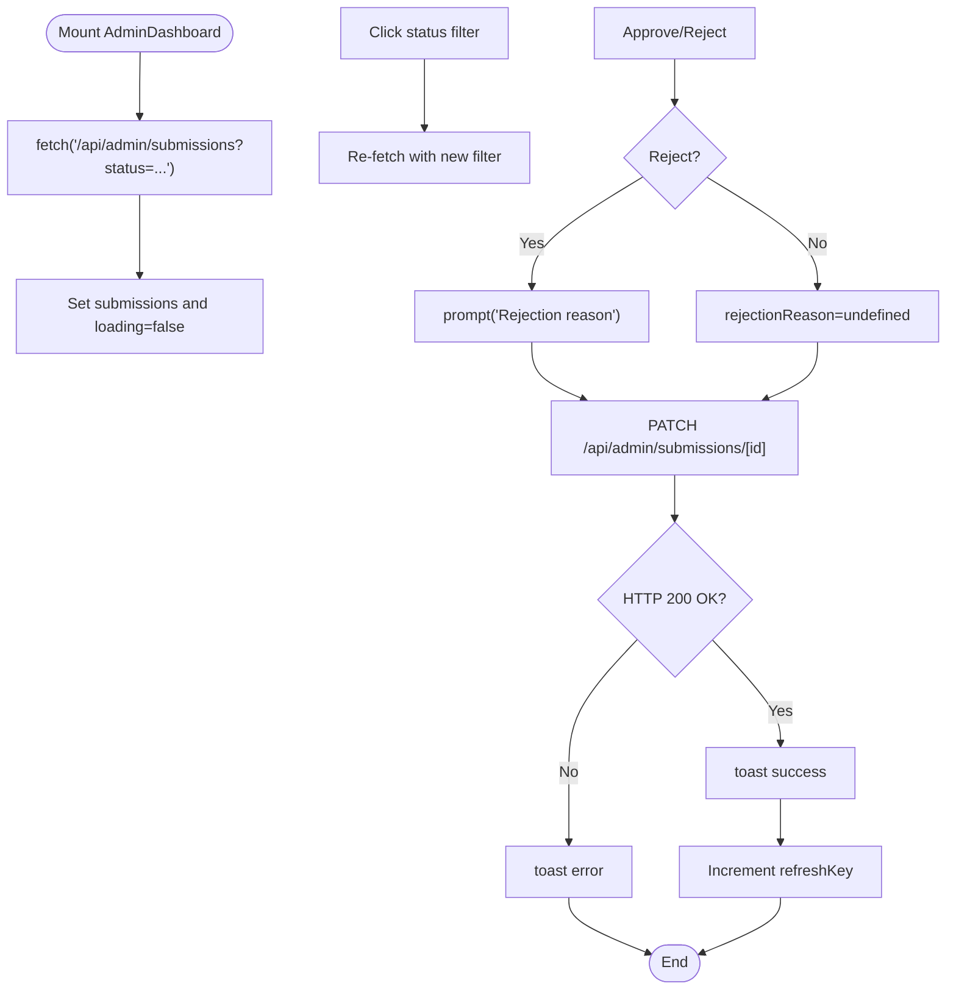
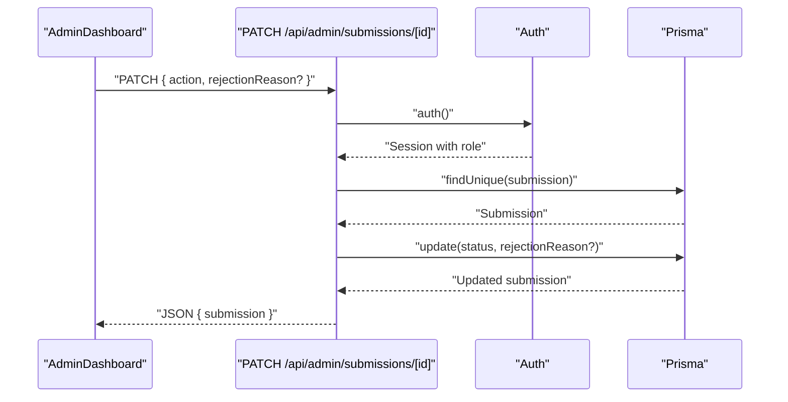
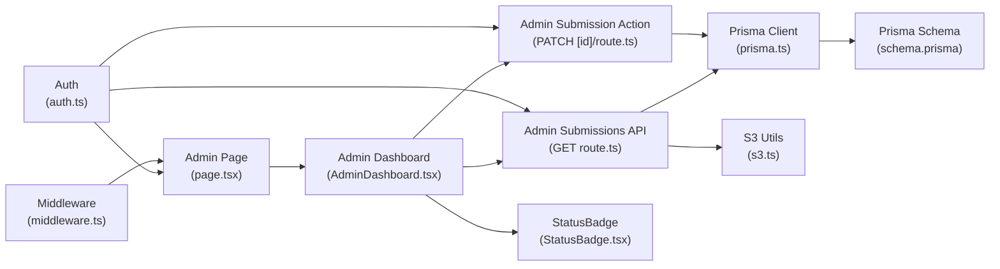
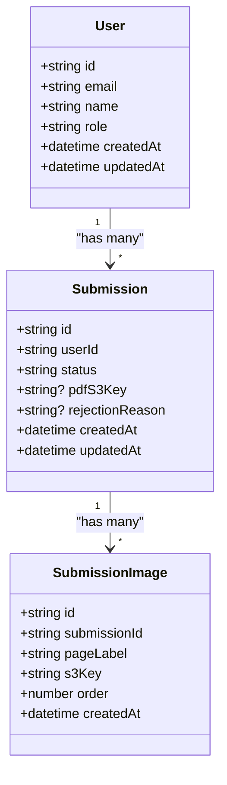

# Administrative Features

<cite>
**Referenced Files in This Document**
- [src/app/(admin)/admin/page.tsx](file://src/app/(admin)/admin/page.tsx)
- [src/components/admin/AdminDashboard.tsx](file://src/components/admin/AdminDashboard.tsx)
- [src/app/api/admin/submissions/route.ts](file://src/app/api/admin/submissions/route.ts)
- [src/app/api/admin/submissions/[id]/route.ts](file://src/app/api/admin/submissions/[id]/route.ts)
- [src/lib/constants.ts](file://src/lib/constants.ts)
- [src/lib/prisma.ts](file://src/lib/prisma.ts)
- [src/auth.ts](file://src/auth.ts)
- [src/middleware.ts](file://src/middleware.ts)
- [prisma/schema.prisma](file://prisma/schema.prisma)
- [src/components/submissions/StatusBadge.tsx](file://src/components/submissions/StatusBadge.tsx)
- [src/app/(protected)/dashboard/page.tsx](file://src/app/(protected)/dashboard/page.tsx)
- [src/app/api/upload/presign/route.ts](file://src/app/api/upload/presign/route.ts)
- [src/lib/s3.ts](file://src/lib/s3.ts)
- [prisma/seed.ts](file://prisma/seed.ts)
</cite>

## Table of Contents
1. [Introduction](#introduction)
2. [Project Structure](#project-structure)
3. [Core Components](#core-components)
4. [Architecture Overview](#architecture-overview)
5. [Detailed Component Analysis](#detailed-component-analysis)
6. [Dependency Analysis](#dependency-analysis)
7. [Performance Considerations](#performance-considerations)
8. [Security and Audit Considerations](#security-and-audit-considerations)
9. [Troubleshooting Guide](#troubleshooting-guide)
10. [Conclusion](#conclusion)
11. [Appendices](#appendices)

## Introduction
This document describes the administrative features in Titchybook Creator with a focus on the admin dashboard for content moderation and user administration. It explains the submission moderation workflow, user management capabilities, reporting and analytics features, security considerations for admin access, bulk operations and shortcuts, and integration with the user dashboard and submission management systems.

## Project Structure
Administrative features are organized around:
- An admin route guard that restricts access to administrators only
- A client-side admin dashboard that lists submissions, filters by status, previews PDFs, and approves or rejects submissions
- API routes under /api/admin that validate admin permissions, query submissions, and update submission statuses
- Shared constants and database schema that define submission statuses and relations
- Authentication and middleware that secure protected routes and enforce role-based access

**Diagram sources**
- [src/app/(admin)/admin/page.tsx](file://src/app/(admin)/admin/page.tsx#L1-L13)
- [src/components/admin/AdminDashboard.tsx:1-168](file://src/components/admin/AdminDashboard.tsx#L1-L168)
- [src/app/api/admin/submissions/route.ts:1-38](file://src/app/api/admin/submissions/route.ts#L1-L38)
- [src/app/api/admin/submissions/[id]/route.ts](file://src/app/api/admin/submissions/[id]/route.ts#L1-L63)
- [src/auth.ts:1-80](file://src/auth.ts#L1-L80)
- [src/middleware.ts:1-6](file://src/middleware.ts#L1-L6)
- [src/lib/prisma.ts:1-10](file://src/lib/prisma.ts#L1-L10)
- [prisma/schema.prisma:1-48](file://prisma/schema.prisma#L1-L48)
- [src/lib/s3.ts](file://src/lib/s3.ts)

**Section sources**
- [src/app/(admin)/admin/page.tsx](file://src/app/(admin)/admin/page.tsx#L1-L13)
- [src/components/admin/AdminDashboard.tsx:1-168](file://src/components/admin/AdminDashboard.tsx#L1-L168)
- [src/app/api/admin/submissions/route.ts:1-38](file://src/app/api/admin/submissions/route.ts#L1-L38)
- [src/app/api/admin/submissions/[id]/route.ts](file://src/app/api/admin/submissions/[id]/route.ts#L1-L63)
- [src/lib/constants.ts:1-49](file://src/lib/constants.ts#L1-L49)
- [src/lib/prisma.ts:1-10](file://src/lib/prisma.ts#L1-L10)
- [src/auth.ts:1-80](file://src/auth.ts#L1-L80)
- [src/middleware.ts:1-6](file://src/middleware.ts#L1-L6)
- [prisma/schema.prisma:1-48](file://prisma/schema.prisma#L1-L48)

## Core Components
- Admin route guard enforces ADMIN role and redirects unauthorized users to the user dashboard.
- Admin dashboard displays submissions with filtering, preview links, and approve/reject actions.
- API endpoints validate admin permissions, fetch paginated submissions with user and image metadata, and update submission status with optional rejection reason.
- Constants define submission statuses and validation helpers.
- Authentication integrates JWT sessions and role propagation.
- Middleware matches protected routes for admin, dashboard, and create pages.

**Section sources**
- [src/app/(admin)/admin/page.tsx](file://src/app/(admin)/admin/page.tsx#L1-L13)
- [src/components/admin/AdminDashboard.tsx:1-168](file://src/components/admin/AdminDashboard.tsx#L1-L168)
- [src/app/api/admin/submissions/route.ts:1-38](file://src/app/api/admin/submissions/route.ts#L1-L38)
- [src/app/api/admin/submissions/[id]/route.ts](file://src/app/api/admin/submissions/[id]/route.ts#L1-L63)
- [src/lib/constants.ts:1-49](file://src/lib/constants.ts#L1-L49)
- [src/auth.ts:1-80](file://src/auth.ts#L1-L80)
- [src/middleware.ts:1-6](file://src/middleware.ts#L1-L6)

## Architecture Overview
The admin moderation flow connects the client dashboard to server APIs and the database. The client requests submissions filtered by status, previews PDFs via signed URLs, and performs approve/reject actions. Server-side APIs validate admin permissions, query submissions with related data, and update statuses atomically.

**Diagram sources**
- [src/components/admin/AdminDashboard.tsx:27-41](file://src/components/admin/AdminDashboard.tsx#L27-L41)
- [src/app/api/admin/submissions/route.ts:6-37](file://src/app/api/admin/submissions/route.ts#L6-L37)
- [src/auth.ts:27-79](file://src/auth.ts#L27-L79)
- [src/lib/prisma.ts:1-10](file://src/lib/prisma.ts#L1-L10)
- [src/lib/s3.ts](file://src/lib/s3.ts)

**Section sources**
- [src/components/admin/AdminDashboard.tsx:27-41](file://src/components/admin/AdminDashboard.tsx#L27-L41)
- [src/app/api/admin/submissions/route.ts:6-37](file://src/app/api/admin/submissions/route.ts#L6-L37)
- [src/auth.ts:27-79](file://src/auth.ts#L27-L79)

## Detailed Component Analysis

### Admin Route Guard
- Validates session and role; redirects non-admins to the user dashboard.
- Ensures only administrators can access the admin page.

**Diagram sources**
- [src/app/(admin)/admin/page.tsx](file://src/app/(admin)/admin/page.tsx#L5-L12)
- [src/auth.ts:65-77](file://src/auth.ts#L65-L77)

**Section sources**
- [src/app/(admin)/admin/page.tsx](file://src/app/(admin)/admin/page.tsx#L5-L12)
- [src/auth.ts:65-77](file://src/auth.ts#L65-L77)

### Admin Dashboard
- Fetches submissions with optional status filter and refresh mechanism.
- Renders user info, creation date, status badge, and PDF preview link.
- Provides approve/reject actions only for pending submissions.
- Generates toast notifications for success/failure.

**Diagram sources**
- [src/components/admin/AdminDashboard.tsx:27-62](file://src/components/admin/AdminDashboard.tsx#L27-L62)
- [src/app/api/admin/submissions/[id]/route.ts](file://src/app/api/admin/submissions/[id]/route.ts#L12-L55)

**Section sources**
- [src/components/admin/AdminDashboard.tsx:1-168](file://src/components/admin/AdminDashboard.tsx#L1-L168)

### Submission Moderation Workflow
- Retrieval: Admin dashboard queries submissions with optional status filter and includes user and image metadata, ordered by creation date.
- Preview: PDF preview links are generated via pre-signed URLs when available.
- Review: Pending submissions display approve/reject controls; approved/rejected submissions show static status.
- Approval/Rejection: PATCH endpoint validates payload, checks existence, updates status, and optionally stores rejection reason.
- Status Updates: StatusBadge renders current status with color-coded labels.

**Diagram sources**
- [src/components/admin/AdminDashboard.tsx:43-62](file://src/components/admin/AdminDashboard.tsx#L43-L62)
- [src/app/api/admin/submissions/[id]/route.ts](file://src/app/api/admin/submissions/[id]/route.ts#L12-L55)
- [src/components/submissions/StatusBadge.tsx:1-18](file://src/components/submissions/StatusBadge.tsx#L1-L18)

**Section sources**
- [src/app/api/admin/submissions/route.ts:6-37](file://src/app/api/admin/submissions/route.ts#L6-L37)
- [src/app/api/admin/submissions/[id]/route.ts](file://src/app/api/admin/submissions/[id]/route.ts#L12-L55)
- [src/components/submissions/StatusBadge.tsx:1-18](file://src/components/submissions/StatusBadge.tsx#L1-L18)

### User Management Capabilities
- Current implementation focuses on submission moderation and does not expose dedicated user search, role modification, or account administration endpoints.
- Role enforcement occurs at the route guard and API endpoints using the session’s role field.
- The database schema defines a role field on the User model with a default value of USER.

**Section sources**
- [src/app/(admin)/admin/page.tsx](file://src/app/(admin)/admin/page.tsx#L7-L9)
- [src/app/api/admin/submissions/[id]/route.ts](file://src/app/api/admin/submissions/[id]/route.ts#L17-L18)
- [prisma/schema.prisma:10-19](file://prisma/schema.prisma#L10-L19)

### Reporting and Analytics
- No built-in reporting or analytics features are present in the current codebase.
- The admin dashboard lists submissions with basic metadata; advanced metrics would require additional endpoints and aggregation logic.

**Section sources**
- [src/components/admin/AdminDashboard.tsx:84-164](file://src/components/admin/AdminDashboard.tsx#L84-L164)

### Security Considerations for Admin Access and Audit Trails
- Role-based access control: Admin route guard and API endpoints check session role and reject non-admins.
- Protected routes: Middleware matches admin, dashboard, and create routes to centralize auth checks.
- Authentication: JWT strategy stores user ID and role in the session token.
- Audit trail: No explicit logging of admin actions is implemented; adding logs for approve/reject events would improve traceability.

**Section sources**
- [src/app/(admin)/admin/page.tsx](file://src/app/(admin)/admin/page.tsx#L7-L9)
- [src/app/api/admin/submissions/[id]/route.ts](file://src/app/api/admin/submissions/[id]/route.ts#L17-L18)
- [src/middleware.ts:3-5](file://src/middleware.ts#L3-L5)
- [src/auth.ts:65-77](file://src/auth.ts#L65-L77)

### Bulk Operations, Mass Moderation, and Administrative Shortcuts
- Current implementation supports per-submission approve/reject actions triggered by button clicks.
- There are no bulk operations or mass moderation endpoints exposed.
- Administrative shortcuts include status filters and PDF preview links.

**Section sources**
- [src/components/admin/AdminDashboard.tsx:68-82](file://src/components/admin/AdminDashboard.tsx#L68-L82)
- [src/components/admin/AdminDashboard.tsx:138-157](file://src/components/admin/AdminDashboard.tsx#L138-L157)

### Examples of Admin Workflow Automation and Content Management Strategies
- Automated PDF generation: The API generates pre-signed URLs for PDFs when available, enabling immediate preview without downloading full assets.
- Status-driven UI: Pending submissions render actionable buttons; non-pending statuses render static indicators, reducing accidental actions.
- Validation pipeline: PATCH endpoint validates payload and handles errors gracefully, returning structured error messages.

**Section sources**
- [src/app/api/admin/submissions/route.ts:26-34](file://src/app/api/admin/submissions/route.ts#L26-L34)
- [src/app/api/admin/submissions/[id]/route.ts](file://src/app/api/admin/submissions/[id]/route.ts#L23-L32)
- [src/components/admin/AdminDashboard.tsx:138-157](file://src/components/admin/AdminDashboard.tsx#L138-L157)

### Integration with User Dashboard and Submission Management Systems
- User dashboard displays the logged-in user’s submissions and provides navigation to create new books.
- Admin dashboard complements the user dashboard by surfacing all submissions for moderation.
- Submission list components share common status rendering via StatusBadge.

**Section sources**
- [src/app/(protected)/dashboard/page.tsx](file://src/app/(protected)/dashboard/page.tsx#L1-L20)
- [src/components/submissions/StatusBadge.tsx:1-18](file://src/components/submissions/StatusBadge.tsx#L1-L18)

## Dependency Analysis
The admin subsystem depends on:
- Authentication and middleware for role enforcement
- Prisma for data access
- S3 utilities for generating pre-signed URLs
- Constants for submission status values

**Diagram sources**
- [src/app/(admin)/admin/page.tsx](file://src/app/(admin)/admin/page.tsx#L1-L13)
- [src/components/admin/AdminDashboard.tsx:1-168](file://src/components/admin/AdminDashboard.tsx#L1-L168)
- [src/app/api/admin/submissions/route.ts:1-38](file://src/app/api/admin/submissions/route.ts#L1-L38)
- [src/app/api/admin/submissions/[id]/route.ts](file://src/app/api/admin/submissions/[id]/route.ts#L1-L63)
- [src/lib/prisma.ts:1-10](file://src/lib/prisma.ts#L1-L10)
- [src/lib/s3.ts](file://src/lib/s3.ts)
- [src/components/submissions/StatusBadge.tsx:1-18](file://src/components/submissions/StatusBadge.tsx#L1-L18)
- [src/auth.ts:1-80](file://src/auth.ts#L1-L80)
- [src/middleware.ts:1-6](file://src/middleware.ts#L1-L6)
- [prisma/schema.prisma:1-48](file://prisma/schema.prisma#L1-L48)

**Section sources**
- [src/app/(admin)/admin/page.tsx](file://src/app/(admin)/admin/page.tsx#L1-L13)
- [src/components/admin/AdminDashboard.tsx:1-168](file://src/components/admin/AdminDashboard.tsx#L1-L168)
- [src/app/api/admin/submissions/route.ts:1-38](file://src/app/api/admin/submissions/route.ts#L1-L38)
- [src/app/api/admin/submissions/[id]/route.ts](file://src/app/api/admin/submissions/[id]/route.ts#L1-L63)
- [src/lib/prisma.ts:1-10](file://src/lib/prisma.ts#L1-L10)
- [src/lib/s3.ts](file://src/lib/s3.ts)
- [src/components/submissions/StatusBadge.tsx:1-18](file://src/components/submissions/StatusBadge.tsx#L1-L18)
- [src/auth.ts:1-80](file://src/auth.ts#L1-L80)
- [src/middleware.ts:1-6](file://src/middleware.ts#L1-L6)
- [prisma/schema.prisma:1-48](file://prisma/schema.prisma#L1-L48)

## Performance Considerations
- Client-side filtering reduces server load by limiting returned records.
- Pre-signed URL generation avoids large downloads during moderation.
- Consider pagination for large datasets to reduce payload sizes.
- Debounce or throttle frequent refreshes to avoid redundant network calls.

## Security and Audit Considerations
- Admin-only access is enforced at both route and API levels.
- JWT-based sessions carry role information for authorization decisions.
- Add audit logging for admin actions (approve/reject) to track changes and reasons.
- Enforce input validation and sanitize rejection reasons before storing.

**Section sources**
- [src/app/(admin)/admin/page.tsx](file://src/app/(admin)/admin/page.tsx#L7-L9)
- [src/app/api/admin/submissions/[id]/route.ts](file://src/app/api/admin/submissions/[id]/route.ts#L17-L18)
- [src/auth.ts:65-77](file://src/auth.ts#L65-L77)

## Troubleshooting Guide
- Forbidden errors: Occur when accessing admin routes without ADMIN role; verify authentication and session role.
- Not found errors: Returned when a submission ID does not exist; confirm the submission exists before acting.
- Validation errors: Payload validation failures return structured error messages; ensure action is one of APPROVE or REJECT and rejectionReason is optional.
- Internal server errors: Catch-all response for unexpected failures; check server logs and Prisma client initialization.

**Section sources**
- [src/app/api/admin/submissions/[id]/route.ts](file://src/app/api/admin/submissions/[id]/route.ts#L27-L32)
- [src/app/api/admin/submissions/[id]/route.ts](file://src/app/api/admin/submissions/[id]/route.ts#L40-L42)
- [src/app/api/admin/submissions/[id]/route.ts](file://src/app/api/admin/submissions/[id]/route.ts#L56-L61)

## Conclusion
The admin subsystem provides a focused, role-secured interface for reviewing and approving submissions, with status filtering, PDF previews, and straightforward approve/reject actions. While user management and reporting features are not implemented, the foundation for extending these capabilities exists through the shared authentication, middleware, and Prisma schema. Future enhancements could include bulk moderation, user administration endpoints, and audit logging to strengthen governance and operational efficiency.

## Appendices

### Submission Status Model

**Diagram sources**
- [prisma/schema.prisma:10-47](file://prisma/schema.prisma#L10-L47)

### Admin Account Setup
- Seed script creates an admin user with configurable email and password, assigning the ADMIN role.

**Section sources**
- [prisma/seed.ts:7-25](file://prisma/seed.ts#L7-L25)