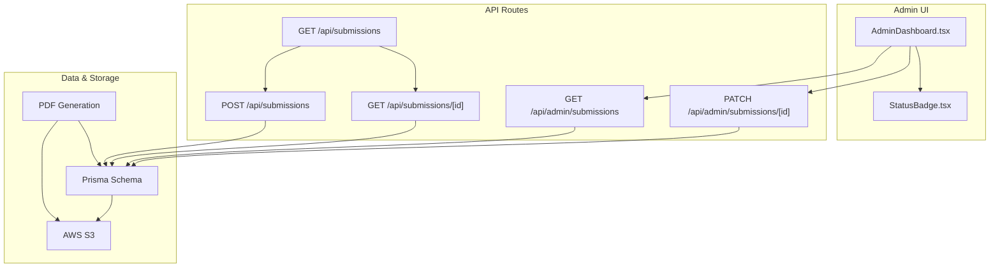
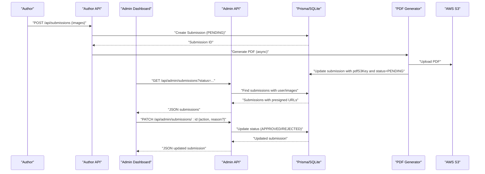
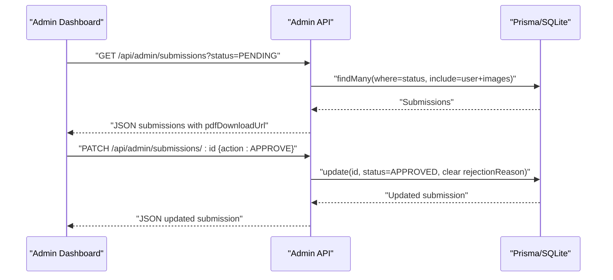
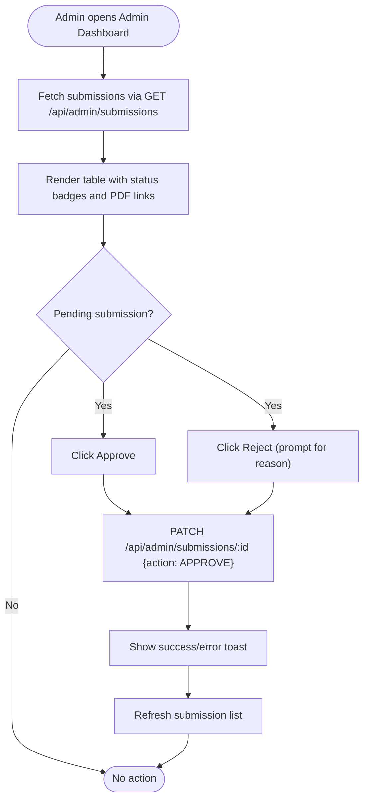
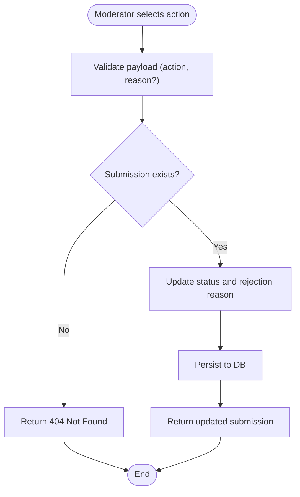
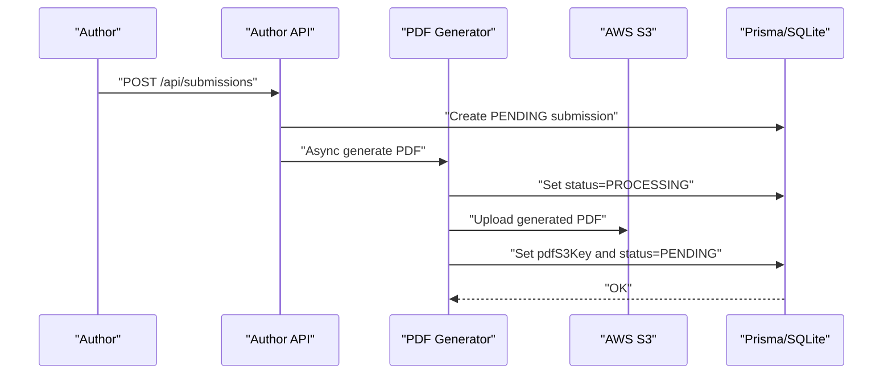
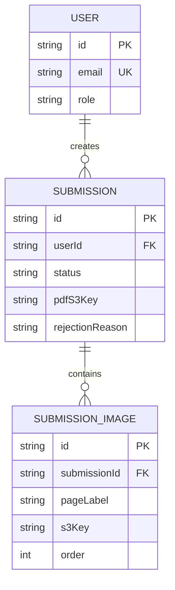
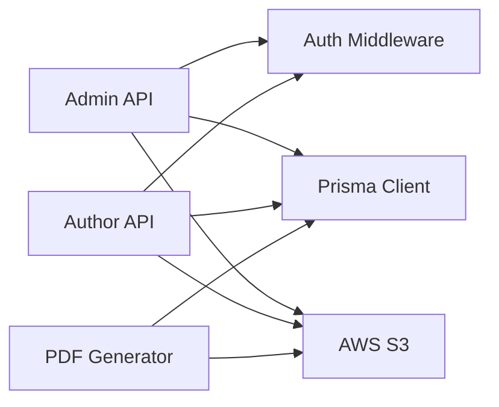

# Submission Moderation Workflow

<cite>
**Referenced Files in This Document**
- [src/app/api/admin/submissions/route.ts](file://src/app/api/admin/submissions/route.ts)
- [src/app/api/admin/submissions/[id]/route.ts](file://src/app/api/admin/submissions/[id]/route.ts)
- [src/components/admin/AdminDashboard.tsx](file://src/components/admin/AdminDashboard.tsx)
- [src/components/submissions/StatusBadge.tsx](file://src/components/submissions/StatusBadge.tsx)
- [src/components/submissions/SubmissionList.tsx](file://src/components/submissions/SubmissionList.tsx)
- [src/app/(admin)/admin/page.tsx](file://src/app/(admin)/admin/page.tsx)
- [src/app/api/submissions/route.ts](file://src/app/api/submissions/route.ts)
- [src/app/api/submissions/[id]/route.ts](file://src/app/api/submissions/[id]/route.ts)
- [src/lib/constants.ts](file://src/lib/constants.ts)
- [prisma/schema.prisma](file://prisma/schema.prisma)
- [src/lib/pdf/generate.ts](file://src/lib/pdf/generate.ts)
- [src/lib/s3.ts](file://src/lib/s3.ts)
- [src/app/api/upload/presign/route.ts](file://src/app/api/upload/presign/route.ts)
</cite>

## Table of Contents
1. [Introduction](#introduction)
2. [Project Structure](#project-structure)
3. [Core Components](#core-components)
4. [Architecture Overview](#architecture-overview)
5. [Detailed Component Analysis](#detailed-component-analysis)
6. [Dependency Analysis](#dependency-analysis)
7. [Performance Considerations](#performance-considerations)
8. [Troubleshooting Guide](#troubleshooting-guide)
9. [Conclusion](#conclusion)
10. [Appendices](#appendices)

## Introduction
This document describes the submission moderation workflow in Titchybook Creator. It covers the end-to-end process from author submission creation to administrative review and final approval or rejection. It documents the administrative endpoints for listing, updating, and removing submissions, the moderation interface components and user interactions, the approval/rejection workflow, notifications, and audit trail considerations. It also outlines moderation queue management, priority handling, reporting features, and best practices for content policy enforcement.

## Project Structure
The moderation workflow spans API routes, React components, Prisma schema, and PDF/S3 integrations:
- Administrative endpoints under `/api/admin/submissions` manage moderation actions.
- Author-facing endpoints under `/api/submissions` handle submission creation and retrieval.
- The admin dashboard component renders the moderation queue and actions.
- Prisma models define submission lifecycle and relations.
- PDF generation and S3 integration support preflight previews and final downloads.

**Diagram sources**
- [src/components/admin/AdminDashboard.tsx:1-168](file://src/components/admin/AdminDashboard.tsx#L1-L168)
- [src/app/api/admin/submissions/route.ts:1-38](file://src/app/api/admin/submissions/route.ts#L1-L38)
- [src/app/api/admin/submissions/[id]/route.ts](file://src/app/api/admin/submissions/[id]/route.ts#L1-L63)
- [src/app/api/submissions/route.ts:1-96](file://src/app/api/submissions/route.ts#L1-L96)
- [src/app/api/submissions/[id]/route.ts](file://src/app/api/submissions/[id]/route.ts#L1-L37)
- [prisma/schema.prisma:1-48](file://prisma/schema.prisma#L1-L48)
- [src/lib/pdf/generate.ts:1-112](file://src/lib/pdf/generate.ts#L1-L112)
- [src/lib/s3.ts:1-81](file://src/lib/s3.ts#L1-L81)

**Section sources**
- [src/app/(admin)/admin/page.tsx](file://src/app/(admin)/admin/page.tsx#L1-L13)
- [src/app/api/admin/submissions/route.ts:1-38](file://src/app/api/admin/submissions/route.ts#L1-L38)
- [src/app/api/admin/submissions/[id]/route.ts](file://src/app/api/admin/submissions/[id]/route.ts#L1-L63)
- [src/app/api/submissions/route.ts:1-96](file://src/app/api/submissions/route.ts#L1-L96)
- [src/app/api/submissions/[id]/route.ts](file://src/app/api/submissions/[id]/route.ts#L1-L37)
- [src/components/admin/AdminDashboard.tsx:1-168](file://src/components/admin/AdminDashboard.tsx#L1-L168)
- [src/components/submissions/StatusBadge.tsx:1-18](file://src/components/submissions/StatusBadge.tsx#L1-L18)
- [src/components/submissions/SubmissionList.tsx:1-119](file://src/components/submissions/SubmissionList.tsx#L1-L119)
- [prisma/schema.prisma:1-48](file://prisma/schema.prisma#L1-L48)
- [src/lib/pdf/generate.ts:1-112](file://src/lib/pdf/generate.ts#L1-L112)
- [src/lib/s3.ts:1-81](file://src/lib/s3.ts#L1-L81)
- [src/app/api/upload/presign/route.ts:1-38](file://src/app/api/upload/presign/route.ts#L1-L38)

## Core Components
- Submission model with status lifecycle and optional rejection reason.
- Administrative endpoints for listing and updating submissions.
- Admin dashboard for filtering, previewing, and approving/rejecting.
- Author-facing submission list and retrieval with status badges and PDF download.
- PDF generation pipeline and S3 integration for previews and final downloads.

**Section sources**
- [prisma/schema.prisma:21-33](file://prisma/schema.prisma#L21-L33)
- [src/lib/constants.ts:6-11](file://src/lib/constants.ts#L6-L11)
- [src/app/api/admin/submissions/route.ts:6-37](file://src/app/api/admin/submissions/route.ts#L6-L37)
- [src/app/api/admin/submissions/[id]/route.ts](file://src/app/api/admin/submissions/[id]/route.ts#L12-L62)
- [src/components/admin/AdminDashboard.tsx:21-167](file://src/components/admin/AdminDashboard.tsx#L21-L167)
- [src/components/submissions/SubmissionList.tsx:15-118](file://src/components/submissions/SubmissionList.tsx#L15-L118)
- [src/lib/pdf/generate.ts:23-111](file://src/lib/pdf/generate.ts#L23-L111)
- [src/lib/s3.ts:30-36](file://src/lib/s3.ts#L30-L36)

## Architecture Overview
The moderation workflow follows a clear separation of concerns:
- Authors submit Titchybooks via the author API, which creates a PENDING submission and triggers asynchronous PDF generation.
- Administrators access the admin dashboard to review submissions, filter by status, preview PDFs, and approve or reject.
- Approved submissions expose a presigned download URL for PDF retrieval; rejected submissions show a rejection reason and allow re-upload.

**Diagram sources**
- [src/app/api/submissions/route.ts:35-95](file://src/app/api/submissions/route.ts#L35-L95)
- [src/lib/pdf/generate.ts:23-111](file://src/lib/pdf/generate.ts#L23-L111)
- [src/lib/s3.ts:52-64](file://src/lib/s3.ts#L52-L64)
- [src/app/api/admin/submissions/route.ts:6-37](file://src/app/api/admin/submissions/route.ts#L6-L37)
- [src/app/api/admin/submissions/[id]/route.ts](file://src/app/api/admin/submissions/[id]/route.ts#L12-L62)

## Detailed Component Analysis

### Administrative Endpoints
- GET /api/admin/submissions
  - Filters submissions by optional status query parameter.
  - Includes user and ordered images; orders by creation date descending.
  - Generates presigned download URLs for PDFs when available.
- PATCH /api/admin/submissions/[id]
  - Validates action as APPROVE or REJECT and optional rejection reason.
  - Updates submission status and clears or sets rejection reason.
  - Returns the updated submission.

**Diagram sources**
- [src/app/api/admin/submissions/route.ts:6-37](file://src/app/api/admin/submissions/route.ts#L6-L37)
- [src/app/api/admin/submissions/[id]/route.ts](file://src/app/api/admin/submissions/[id]/route.ts#L12-L62)

**Section sources**
- [src/app/api/admin/submissions/route.ts:6-37](file://src/app/api/admin/submissions/route.ts#L6-L37)
- [src/app/api/admin/submissions/[id]/route.ts](file://src/app/api/admin/submissions/[id]/route.ts#L12-L62)

### Moderation Interface Components
- AdminDashboard
  - Loads submissions with optional status filter.
  - Renders a table with user info, creation date, status badge, PDF preview link, and action buttons.
  - Handles approve/reject actions via PATCH endpoint and refreshes the list.
- StatusBadge
  - Visual indicator for submission status with color-coded labels.
- SubmissionList (Author)
  - Lists own submissions, shows status, rejection reason if applicable, and enables PDF download for approved submissions or re-upload for rejected ones.

**Diagram sources**
- [src/components/admin/AdminDashboard.tsx:27-62](file://src/components/admin/AdminDashboard.tsx#L27-L62)
- [src/components/submissions/StatusBadge.tsx:1-18](file://src/components/submissions/StatusBadge.tsx#L1-L18)
- [src/components/submissions/SubmissionList.tsx:62-118](file://src/components/submissions/SubmissionList.tsx#L62-L118)

**Section sources**
- [src/components/admin/AdminDashboard.tsx:21-167](file://src/components/admin/AdminDashboard.tsx#L21-L167)
- [src/components/submissions/StatusBadge.tsx:1-18](file://src/components/submissions/StatusBadge.tsx#L1-L18)
- [src/components/submissions/SubmissionList.tsx:15-118](file://src/components/submissions/SubmissionList.tsx#L15-L118)

### Approval/Rejection Workflow
- Validation and enforcement
  - Action schema enforces APPROVE or REJECT with optional rejection reason.
  - Submission existence is verified before update.
- Status transitions
  - APPROVE sets status to APPROVED and clears rejection reason.
  - REJECT sets status to REJECTED and stores rejection reason.
- Notifications and feedback
  - UI provides toast notifications for success/failure of moderation actions.
- Audit trail
  - Submission timestamps and status history are persisted in the database.

**Diagram sources**
- [src/app/api/admin/submissions/[id]/route.ts](file://src/app/api/admin/submissions/[id]/route.ts#L23-L55)

**Section sources**
- [src/app/api/admin/submissions/[id]/route.ts](file://src/app/api/admin/submissions/[id]/route.ts#L7-L10)
- [src/app/api/admin/submissions/[id]/route.ts](file://src/app/api/admin/submissions/[id]/route.ts#L36-L53)
- [src/components/admin/AdminDashboard.tsx:43-62](file://src/components/admin/AdminDashboard.tsx#L43-L62)

### PDF Generation and Preview
- Background generation
  - On successful submission creation, PDF generation runs asynchronously.
  - Submission status is temporarily set to PROCESSING during generation.
  - On completion, the PDF S3 key is stored and status resets to PENDING for moderation.
- Presigned URLs
  - Admin endpoint generates presigned download URLs for PDFs.
  - Author endpoint generates presigned download URLs for approved submissions.

**Diagram sources**
- [src/app/api/submissions/route.ts:35-95](file://src/app/api/submissions/route.ts#L35-L95)
- [src/lib/pdf/generate.ts:23-111](file://src/lib/pdf/generate.ts#L23-L111)
- [src/lib/s3.ts:52-64](file://src/lib/s3.ts#L52-L64)

**Section sources**
- [src/app/api/submissions/route.ts:35-95](file://src/app/api/submissions/route.ts#L35-L95)
- [src/lib/pdf/generate.ts:23-111](file://src/lib/pdf/generate.ts#L23-L111)
- [src/lib/s3.ts:30-36](file://src/lib/s3.ts#L30-L36)

### Submission Model and Status Lifecycle
- Submission fields include status, optional rejection reason, and optional PDF S3 key.
- Status lifecycle includes PENDING, APPROVED, REJECTED, and PROCESSING.
- Images are associated with submissions and ordered for PDF composition.

**Diagram sources**
- [prisma/schema.prisma:10-47](file://prisma/schema.prisma#L10-L47)
- [src/lib/constants.ts:6-11](file://src/lib/constants.ts#L6-L11)

**Section sources**
- [prisma/schema.prisma:21-33](file://prisma/schema.prisma#L21-L33)
- [src/lib/constants.ts:6-11](file://src/lib/constants.ts#L6-L11)

### Author Submission Creation and Retrieval
- POST /api/submissions validates image entries, ensures all 8 page labels are present, and creates the submission with associated images.
- GET /api/submissions lists the current user’s submissions.
- GET /api/submissions/[id] retrieves a specific submission and its images, and provides a presigned PDF download URL when available.

**Section sources**
- [src/app/api/submissions/route.ts:20-95](file://src/app/api/submissions/route.ts#L20-L95)
- [src/app/api/submissions/[id]/route.ts](file://src/app/api/submissions/[id]/route.ts#L6-L36)

### Upload Pre-sign Endpoint
- GET /api/upload/presign validates content type against accepted image types and constructs a pre-signed upload URL for S3 along with the S3 key.

**Section sources**
- [src/app/api/upload/presign/route.ts:6-37](file://src/app/api/upload/presign/route.ts#L6-L37)

## Dependency Analysis
- Authentication and authorization
  - Admin endpoints require ADMIN role; author endpoints require authenticated user.
- Data integrity
  - Submission images are ordered and validated to ensure completeness.
- External dependencies
  - AWS S3 for uploads/downloads and pre-signed URLs.
  - PDF generation library for composing A4 landscape PDFs.

**Diagram sources**
- [src/app/api/admin/submissions/route.ts:1-3](file://src/app/api/admin/submissions/route.ts#L1-L3)
- [src/app/api/admin/submissions/[id]/route.ts](file://src/app/api/admin/submissions/[id]/route.ts#L1-L5)
- [src/app/api/submissions/route.ts:1-6](file://src/app/api/submissions/route.ts#L1-L6)
- [src/lib/pdf/generate.ts:1-11](file://src/lib/pdf/generate.ts#L1-L11)
- [src/lib/s3.ts:1-14](file://src/lib/s3.ts#L1-L14)

**Section sources**
- [src/app/api/admin/submissions/route.ts:7-10](file://src/app/api/admin/submissions/route.ts#L7-L10)
- [src/app/api/admin/submissions/[id]/route.ts](file://src/app/api/admin/submissions/[id]/route.ts#L16-L19)
- [src/app/api/submissions/route.ts:20-24](file://src/app/api/submissions/route.ts#L20-L24)
- [src/app/api/submissions/[id]/route.ts](file://src/app/api/submissions/[id]/route.ts#L10-L13)

## Performance Considerations
- Asynchronous PDF generation prevents blocking the submission creation response.
- Parallelization in PDF generation reduces latency when processing multiple images.
- Presigned URLs offload download bandwidth from the application server.
- Filtering by status and ordering by creation date optimize admin list queries.

[No sources needed since this section provides general guidance]

## Troubleshooting Guide
- Unauthorized access
  - Admin endpoints return 403 for non-admin users; author endpoints return 401 for unauthenticated users.
- Missing or invalid parameters
  - Admin PATCH requires action and optional rejection reason; invalid payloads return 400.
  - Upload pre-sign requires filename, contentType, submissionId, and pageLabel; invalid types return 400.
- Submission not found
  - Admin PATCH returns 404 if the submission does not exist.
- Internal errors
  - Catch-all handlers return 500 for unexpected failures.

**Section sources**
- [src/app/api/admin/submissions/route.ts:7-10](file://src/app/api/admin/submissions/route.ts#L7-L10)
- [src/app/api/admin/submissions/[id]/route.ts](file://src/app/api/admin/submissions/[id]/route.ts#L16-L19)
- [src/app/api/admin/submissions/[id]/route.ts](file://src/app/api/admin/submissions/[id]/route.ts#L27-L32)
- [src/app/api/admin/submissions/[id]/route.ts](file://src/app/api/admin/submissions/[id]/route.ts#L40-L42)
- [src/app/api/admin/submissions/[id]/route.ts](file://src/app/api/admin/submissions/[id]/route.ts#L56-L61)
- [src/app/api/upload/presign/route.ts:18-30](file://src/app/api/upload/presign/route.ts#L18-L30)

## Conclusion
The moderation workflow in Titchybook Creator is designed around a clean separation of author submission creation and administrative review. Submissions are created with validation, asynchronously processed into PDFs, and presented to administrators for approval or rejection. The system leverages presigned URLs for efficient PDF delivery, maintains a clear status lifecycle, and provides a straightforward UI for moderation tasks. Extending the workflow to include bulk operations, priority handling, and reporting would build upon the existing foundation.

[No sources needed since this section summarizes without analyzing specific files]

## Appendices

### Administrative Endpoints Reference
- GET /api/admin/submissions
  - Query parameters: status (optional)
  - Response: array of submissions with user, images, and pdfDownloadUrl
- PATCH /api/admin/submissions/[id]
  - Request body: { action: "APPROVE" | "REJECT", rejectionReason?: string }
  - Response: updated submission

**Section sources**
- [src/app/api/admin/submissions/route.ts:6-37](file://src/app/api/admin/submissions/route.ts#L6-L37)
- [src/app/api/admin/submissions/[id]/route.ts](file://src/app/api/admin/submissions/[id]/route.ts#L12-L62)

### Author Endpoints Reference
- GET /api/submissions
  - Response: array of current user’s submissions
- POST /api/submissions
  - Request body: array of 8 image entries with pageLabel, s3Key, order, originalFilename, mimeType
  - Response: { id, status }
- GET /api/submissions/[id]
  - Response: submission with images and optional pdfDownloadUrl

**Section sources**
- [src/app/api/submissions/route.ts:20-95](file://src/app/api/submissions/route.ts#L20-L95)
- [src/app/api/submissions/[id]/route.ts](file://src/app/api/submissions/[id]/route.ts#L6-L36)

### Moderation Scenarios and Automation
- Scenario: Approve a pending submission
  - Filter submissions by status=PENDING, click Approve, receive success toast, and refresh the list.
- Scenario: Reject a submission with a reason
  - Filter submissions by status=PENDING, click Reject, enter optional reason, receive success toast, and refresh the list.
- Scenario: Bulk operations
  - Extend the admin API to accept batch actions (e.g., approve/reject multiple IDs) and add a bulk PATCH endpoint.
- Scenario: Priority handling
  - Add a priority field to submissions and sort admin list by priority and creation date.
- Scenario: Reporting
  - Add endpoints to export moderation metrics (counts by status, rejection reasons, time-to-moderate).

**Section sources**
- [src/components/admin/AdminDashboard.tsx:43-62](file://src/components/admin/AdminDashboard.tsx#L43-L62)
- [src/app/api/admin/submissions/route.ts:12-24](file://src/app/api/admin/submissions/route.ts#L12-L24)

### Best Practices and Content Policy Enforcement
- Enforce strict image validation and completeness checks during submission creation.
- Require rejection reasons for REJECTED submissions to maintain transparency.
- Implement rate limiting and quotas to prevent spam submissions.
- Add automated content scanning hooks prior to approval.
- Log moderation actions for audit trails and reporting.

[No sources needed since this section provides general guidance]