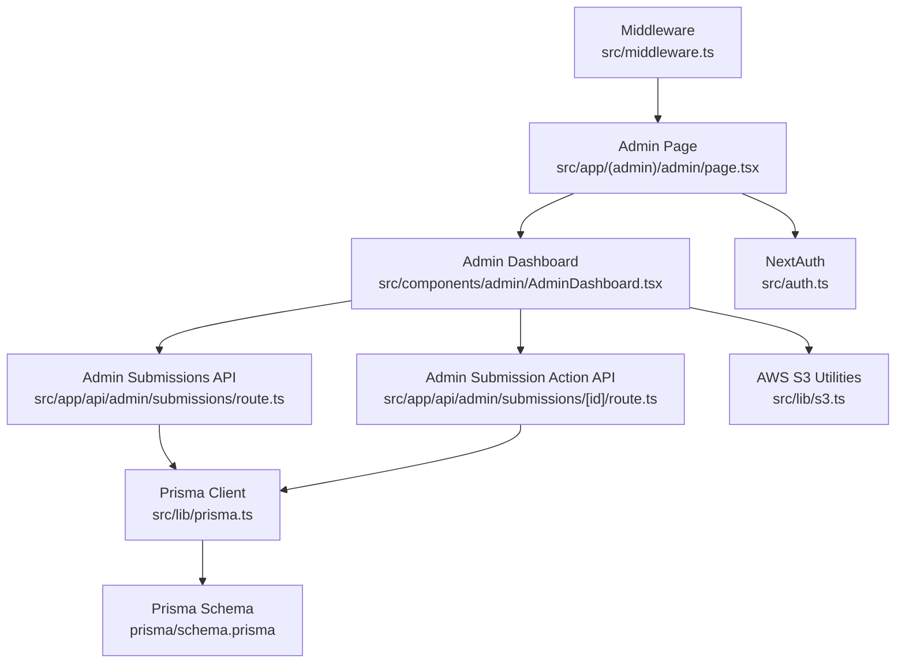
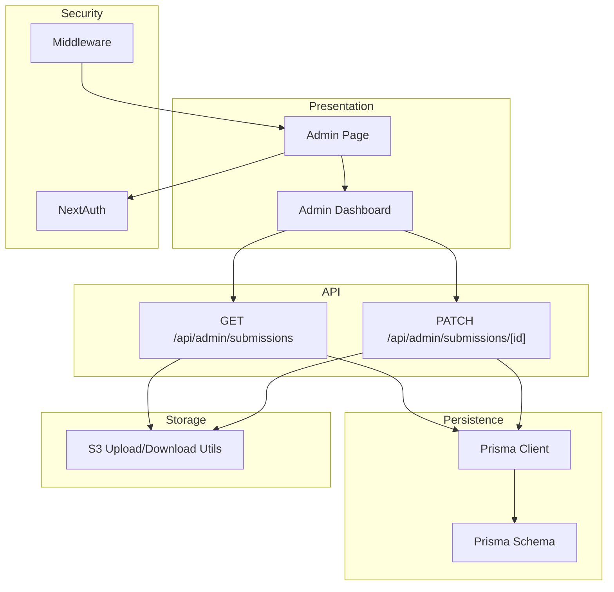
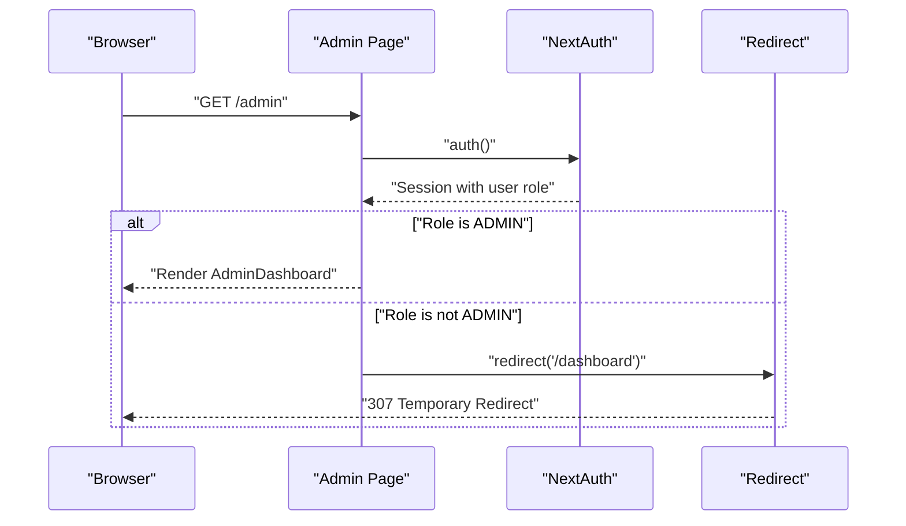
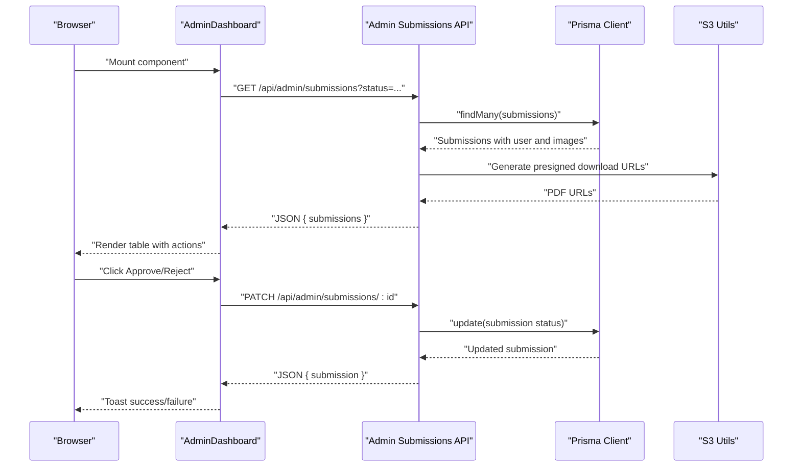
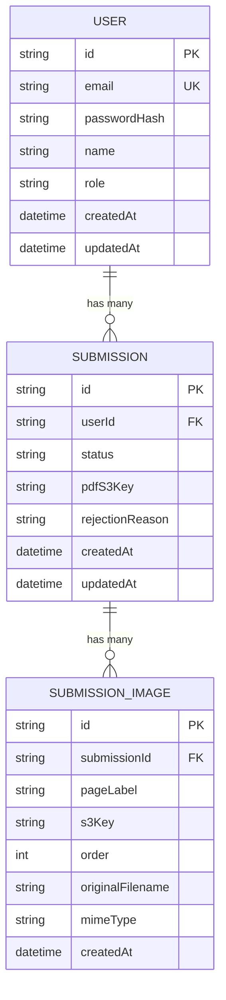
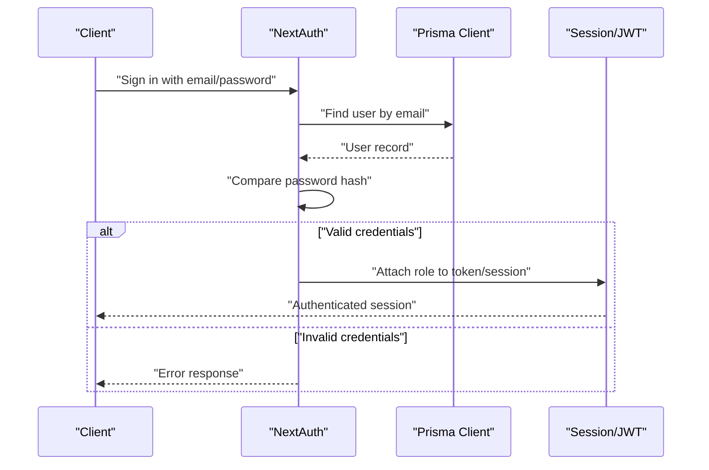
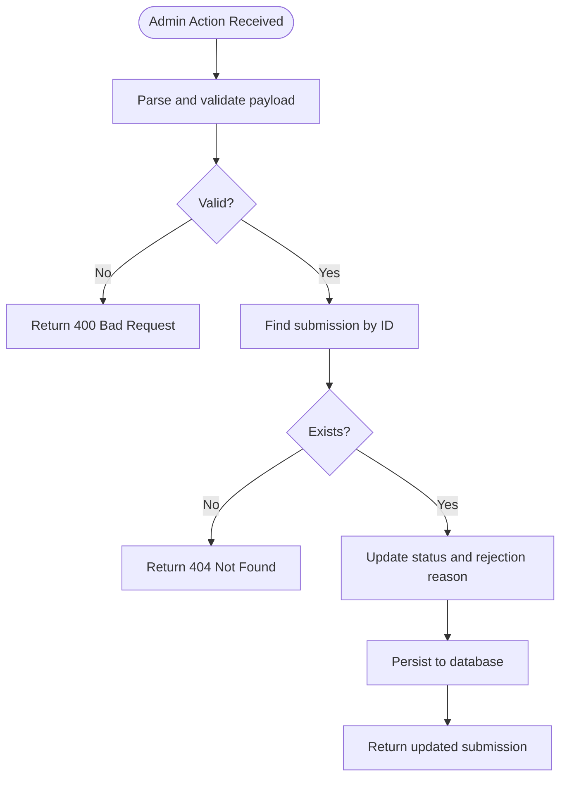
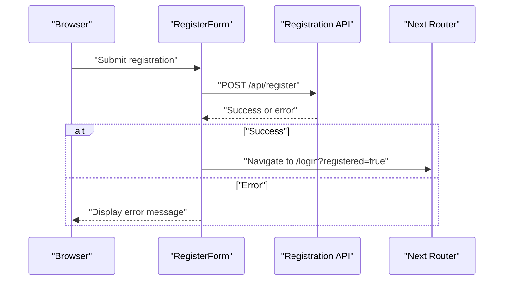
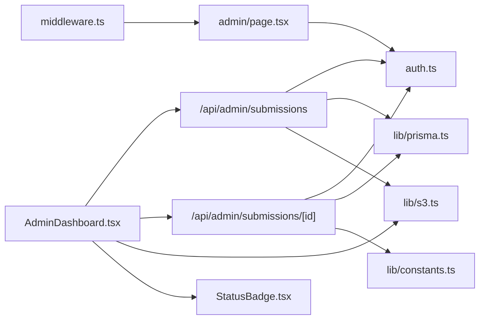
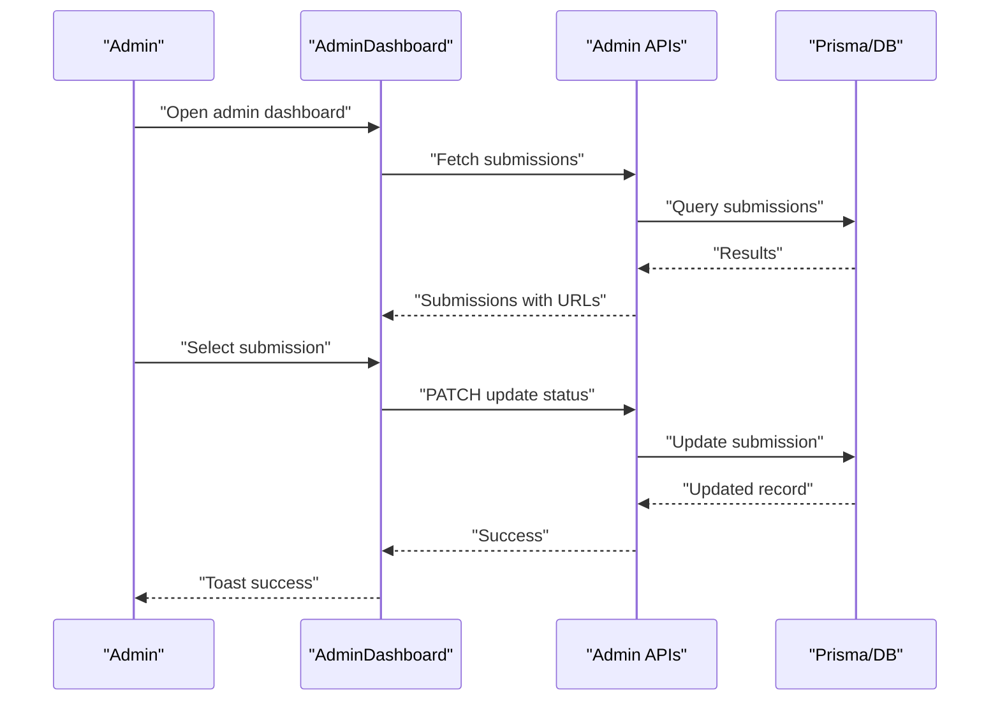

# User Management System

<cite>
**Referenced Files in This Document**
- [src/app/(admin)/admin/page.tsx](file://src/app/(admin)/admin/page.tsx)
- [src/components/admin/AdminDashboard.tsx](file://src/components/admin/AdminDashboard.tsx)
- [src/app/api/admin/submissions/route.ts](file://src/app/api/admin/submissions/route.ts)
- [src/app/api/admin/submissions/[id]/route.ts](file://src/app/api/admin/submissions/[id]/route.ts)
- [src/lib/prisma.ts](file://src/lib/prisma.ts)
- [prisma/schema.prisma](file://prisma/schema.prisma)
- [src/auth.ts](file://src/auth.ts)
- [src/middleware.ts](file://src/middleware.ts)
- [src/lib/constants.ts](file://src/lib/constants.ts)
- [src/lib/s3.ts](file://src/lib/s3.ts)
- [src/components/submissions/StatusBadge.tsx](file://src/components/submissions/StatusBadge.tsx)
- [src/components/submissions/SubmissionList.tsx](file://src/components/submissions/SubmissionList.tsx)
- [src/components/auth/LoginForm.tsx](file://src/components/auth/LoginForm.tsx)
- [src/components/auth/RegisterForm.tsx](file://src/components/auth/RegisterForm.tsx)
</cite>

## Table of Contents
1. [Introduction](#introduction)
2. [Project Structure](#project-structure)
3. [Core Components](#core-components)
4. [Architecture Overview](#architecture-overview)
5. [Detailed Component Analysis](#detailed-component-analysis)
6. [Dependency Analysis](#dependency-analysis)
7. [Performance Considerations](#performance-considerations)
8. [Troubleshooting Guide](#troubleshooting-guide)
9. [Conclusion](#conclusion)
10. [Appendices](#appendices)

## Introduction
This document describes the administrative user management system for managing user accounts and their content within the application. It focuses on administrative capabilities for viewing user submissions, approving or rejecting them, and understanding the underlying data model and security controls. The current implementation centers around submission moderation and does not include explicit user account management features such as role changes, account status toggles, or bulk operations. Guidance is provided on extending the system to support additional administrative tasks while maintaining security and compliance.

## Project Structure
The administrative user management functionality is organized around:
- An admin-only page that enforces role-based access
- An admin dashboard component that lists submissions and allows moderation actions
- API endpoints for fetching submissions and updating submission status
- Authentication and authorization via NextAuth with role-based routing
- Data persistence using Prisma ORM and a SQLite database
- AWS S3 integration for secure file access

**Diagram sources**
- [src/app/(admin)/admin/page.tsx:1-13](file://src/app/(admin)/admin/page.tsx#L1-L13)
- [src/components/admin/AdminDashboard.tsx:1-168](file://src/components/admin/AdminDashboard.tsx#L1-L168)
- [src/app/api/admin/submissions/route.ts:1-38](file://src/app/api/admin/submissions/route.ts#L1-L38)
- [src/app/api/admin/submissions/[id]/route.ts:1-63](file://src/app/api/admin/submissions/[id]/route.ts#L1-L63)
- [src/lib/prisma.ts:1-10](file://src/lib/prisma.ts#L1-L10)
- [prisma/schema.prisma:1-48](file://prisma/schema.prisma#L1-L48)
- [src/auth.ts:1-80](file://src/auth.ts#L1-L80)
- [src/middleware.ts:1-5](file://src/middleware.ts#L1-L5)
- [src/lib/s3.ts:1-81](file://src/lib/s3.ts#L1-L81)

**Section sources**
- [src/app/(admin)/admin/page.tsx:1-13](file://src/app/(admin)/admin/page.tsx#L1-L13)
- [src/components/admin/AdminDashboard.tsx:1-168](file://src/components/admin/AdminDashboard.tsx#L1-L168)
- [src/app/api/admin/submissions/route.ts:1-38](file://src/app/api/admin/submissions/route.ts#L1-L38)
- [src/app/api/admin/submissions/[id]/route.ts:1-63](file://src/app/api/admin/submissions/[id]/route.ts#L1-L63)
- [src/lib/prisma.ts:1-10](file://src/lib/prisma.ts#L1-L10)
- [prisma/schema.prisma:1-48](file://prisma/schema.prisma#L1-L48)
- [src/auth.ts:1-80](file://src/auth.ts#L1-L80)
- [src/middleware.ts:1-5](file://src/middleware.ts#L1-L5)
- [src/lib/s3.ts:1-81](file://src/lib/s3.ts#L1-L81)

## Core Components
- Admin Page: Enforces ADMIN role and renders the Admin Dashboard.
- Admin Dashboard: Fetches submissions, filters by status, displays user info, and allows approve/reject actions.
- Admin Submissions API: Lists submissions with optional status filtering and generates presigned download URLs for PDFs.
- Admin Submission Action API: Updates submission status and rejection reason for a given submission ID.
- Authentication and Authorization: NextAuth with JWT strategy and role callbacks; middleware protects admin routes.
- Data Model: User and Submission entities with SubmissionImage relations; Submission status lifecycle.
- AWS S3 Utilities: Presigned URLs for uploads/downloads and helpers for building keys.

**Section sources**
- [src/app/(admin)/admin/page.tsx:5-12](file://src/app/(admin)/admin/page.tsx#L5-L12)
- [src/components/admin/AdminDashboard.tsx:21-167](file://src/components/admin/AdminDashboard.tsx#L21-L167)
- [src/app/api/admin/submissions/route.ts:6-37](file://src/app/api/admin/submissions/route.ts#L6-L37)
- [src/app/api/admin/submissions/[id]/route.ts:12-62](file://src/app/api/admin/submissions/[id]/route.ts#L12-L62)
- [src/auth.ts:27-79](file://src/auth.ts#L27-L79)
- [src/middleware.ts:1-5](file://src/middleware.ts#L1-L5)
- [prisma/schema.prisma:10-47](file://prisma/schema.prisma#L10-L47)
- [src/lib/s3.ts:18-81](file://src/lib/s3.ts#L18-L81)

## Architecture Overview
The admin user management system follows a layered architecture:
- Presentation Layer: Admin page and dashboard component render UI and collect user actions.
- API Layer: Admin endpoints validate roles, query data, and update statuses.
- Persistence Layer: Prisma ORM interacts with the SQLite database.
- Storage Layer: AWS S3 provides secure access to uploaded images and generated PDFs.
- Security Layer: NextAuth handles authentication and authorization, enforced by middleware and route guards.

**Diagram sources**
- [src/app/(admin)/admin/page.tsx:1-13](file://src/app/(admin)/admin/page.tsx#L1-L13)
- [src/components/admin/AdminDashboard.tsx:27-62](file://src/components/admin/AdminDashboard.tsx#L27-L62)
- [src/app/api/admin/submissions/route.ts:6-37](file://src/app/api/admin/submissions/route.ts#L6-L37)
- [src/app/api/admin/submissions/[id]/route.ts:12-62](file://src/app/api/admin/submissions/[id]/route.ts#L12-L62)
- [src/lib/prisma.ts:1-10](file://src/lib/prisma.ts#L1-L10)
- [prisma/schema.prisma:1-48](file://prisma/schema.prisma#L1-L48)
- [src/lib/s3.ts:18-81](file://src/lib/s3.ts#L18-L81)
- [src/auth.ts:27-79](file://src/auth.ts#L27-L79)
- [src/middleware.ts:1-5](file://src/middleware.ts#L1-L5)

## Detailed Component Analysis

### Admin Page and Role-Based Access
- Validates session and ensures the user has ADMIN role before rendering the dashboard.
- Redirects unauthorized users to the dashboard.

**Diagram sources**
- [src/app/(admin)/admin/page.tsx:5-12](file://src/app/(admin)/admin/page.tsx#L5-L12)
- [src/auth.ts:27-79](file://src/auth.ts#L27-L79)

**Section sources**
- [src/app/(admin)/admin/page.tsx:5-12](file://src/app/(admin)/admin/page.tsx#L5-L12)
- [src/auth.ts:27-79](file://src/auth.ts#L27-L79)

### Admin Dashboard: Submission Listing and Moderation
- Loads submissions with optional status filter.
- Generates presigned URLs for PDF previews.
- Allows approve/reject actions with optional rejection reason.
- Uses toast notifications for feedback and refreshes data after successful actions.

**Diagram sources**
- [src/components/admin/AdminDashboard.tsx:27-62](file://src/components/admin/AdminDashboard.tsx#L27-L62)
- [src/app/api/admin/submissions/route.ts:6-37](file://src/app/api/admin/submissions/route.ts#L6-L37)
- [src/app/api/admin/submissions/[id]/route.ts:12-62](file://src/app/api/admin/submissions/[id]/route.ts#L12-L62)
- [src/lib/s3.ts:30-36](file://src/lib/s3.ts#L30-L36)

**Section sources**
- [src/components/admin/AdminDashboard.tsx:21-167](file://src/components/admin/AdminDashboard.tsx#L21-L167)
- [src/app/api/admin/submissions/route.ts:6-37](file://src/app/api/admin/submissions/route.ts#L6-L37)
- [src/app/api/admin/submissions/[id]/route.ts:12-62](file://src/app/api/admin/submissions/[id]/route.ts#L12-L62)
- [src/lib/s3.ts:30-36](file://src/lib/s3.ts#L30-L36)

### Data Model: Users, Submissions, and Images
- User entity stores id, email, password hash, name, role, and timestamps.
- Submission entity links to a user, tracks status, PDF S3 key, rejection reason, and timestamps.
- SubmissionImage entity links to a submission, stores page metadata, S3 key, and ordering.

**Diagram sources**
- [prisma/schema.prisma:10-47](file://prisma/schema.prisma#L10-L47)

**Section sources**
- [prisma/schema.prisma:10-47](file://prisma/schema.prisma#L10-L47)

### Authentication and Authorization
- NextAuth with Credentials provider validates credentials against hashed passwords.
- JWT strategy stores user role in the token/session.
- Middleware restricts access to admin routes; admin page enforces role check.

**Diagram sources**
- [src/auth.ts:27-79](file://src/auth.ts#L27-L79)
- [src/lib/prisma.ts:1-10](file://src/lib/prisma.ts#L1-L10)

**Section sources**
- [src/auth.ts:27-79](file://src/auth.ts#L27-L79)
- [src/middleware.ts:1-5](file://src/middleware.ts#L1-L5)

### Submission Status Lifecycle and Validation
- SubmissionStatus enum defines PENDING, APPROVED, REJECTED, and PROCESSING.
- Admin action endpoint validates action payload and updates status accordingly.
- Rejection reason is stored only when rejection action is performed.

**Diagram sources**
- [src/app/api/admin/submissions/[id]/route.ts:7-10](file://src/app/api/admin/submissions/[id]/route.ts#L7-L10)
- [src/app/api/admin/submissions/[id]/route.ts:23-55](file://src/app/api/admin/submissions/[id]/route.ts#L23-L55)
- [src/lib/constants.ts:6-11](file://src/lib/constants.ts#L6-L11)

**Section sources**
- [src/app/api/admin/submissions/[id]/route.ts:7-10](file://src/app/api/admin/submissions/[id]/route.ts#L7-L10)
- [src/app/api/admin/submissions/[id]/route.ts:23-55](file://src/app/api/admin/submissions/[id]/route.ts#L23-L55)
- [src/lib/constants.ts:6-11](file://src/lib/constants.ts#L6-L11)

### User Registration and Login Components
- Registration form posts user data to the registration API and navigates to login on success.
- Login form authenticates via NextAuth credentials provider and redirects to dashboard upon success.

**Diagram sources**
- [src/components/auth/RegisterForm.tsx:14-39](file://src/components/auth/RegisterForm.tsx#L14-L39)

**Section sources**
- [src/components/auth/RegisterForm.tsx:14-39](file://src/components/auth/RegisterForm.tsx#L14-L39)
- [src/components/auth/LoginForm.tsx:14-33](file://src/components/auth/LoginForm.tsx#L14-L33)

## Dependency Analysis
- AdminDashboard depends on:
  - Admin Submissions API for listing submissions
  - Admin Submission Action API for moderation actions
  - S3 utilities for generating presigned URLs
  - StatusBadge component for status display
- Admin Submissions API depends on:
  - NextAuth for role verification
  - Prisma for data retrieval
  - S3 utilities for presigned URLs
- Admin Submission Action API depends on:
  - NextAuth for role verification
  - Prisma for data updates
  - Zod for payload validation
  - SubmissionStatus enum for status values
- Authentication integrates with:
  - Prisma for user lookup and validation
  - Middleware for route protection

**Diagram sources**
- [src/components/admin/AdminDashboard.tsx:1-168](file://src/components/admin/AdminDashboard.tsx#L1-L168)
- [src/app/api/admin/submissions/route.ts:1-38](file://src/app/api/admin/submissions/route.ts#L1-L38)
- [src/app/api/admin/submissions/[id]/route.ts:1-63](file://src/app/api/admin/submissions/[id]/route.ts#L1-L63)
- [src/lib/s3.ts:1-81](file://src/lib/s3.ts#L1-L81)
- [src/components/submissions/StatusBadge.tsx:1-17](file://src/components/submissions/StatusBadge.tsx#L1-L17)
- [src/auth.ts:1-80](file://src/auth.ts#L1-L80)
- [src/lib/prisma.ts:1-10](file://src/lib/prisma.ts#L1-L10)
- [src/lib/constants.ts:1-49](file://src/lib/constants.ts#L1-L49)
- [src/middleware.ts:1-5](file://src/middleware.ts#L1-L5)
- [src/app/(admin)/admin/page.tsx:1-13](file://src/app/(admin)/admin/page.tsx#L1-L13)

**Section sources**
- [src/components/admin/AdminDashboard.tsx:1-168](file://src/components/admin/AdminDashboard.tsx#L1-L168)
- [src/app/api/admin/submissions/route.ts:1-38](file://src/app/api/admin/submissions/route.ts#L1-L38)
- [src/app/api/admin/submissions/[id]/route.ts:1-63](file://src/app/api/admin/submissions/[id]/route.ts#L1-L63)
- [src/lib/s3.ts:1-81](file://src/lib/s3.ts#L1-L81)
- [src/components/submissions/StatusBadge.tsx:1-17](file://src/components/submissions/StatusBadge.tsx#L1-L17)
- [src/auth.ts:1-80](file://src/auth.ts#L1-L80)
- [src/lib/prisma.ts:1-10](file://src/lib/prisma.ts#L1-L10)
- [src/lib/constants.ts:1-49](file://src/lib/constants.ts#L1-L49)
- [src/middleware.ts:1-5](file://src/middleware.ts#L1-L5)
- [src/app/(admin)/admin/page.tsx:1-13](file://src/app/(admin)/admin/page.tsx#L1-L13)

## Performance Considerations
- API pagination: The current listing endpoint retrieves all submissions and sorts by creation date. For large datasets, implement pagination and cursor-based navigation to reduce memory usage and improve responsiveness.
- Filtering: Add indexing on Submission.status and Submission.userId to optimize queries.
- S3 presigned URLs: Generate URLs lazily only when needed to avoid unnecessary overhead.
- Client-side caching: Cache submission lists with ETag/Last-Modified headers to minimize redundant network requests.
- Concurrency: Batch moderation actions if bulk operations are introduced to reduce API round trips.

[No sources needed since this section provides general guidance]

## Troubleshooting Guide
- Unauthorized Access:
  - Symptom: 403 Forbidden when accessing admin endpoints.
  - Cause: Missing or non-ADMIN role in session.
  - Resolution: Verify authentication and role assignment in NextAuth callbacks.
- Missing PDF Preview:
  - Symptom: "Generating..." shown instead of preview link.
  - Cause: pdfS3Key is null or presigned URL generation fails.
  - Resolution: Confirm PDF generation pipeline and S3 bucket permissions.
- Action Failure:
  - Symptom: Toast indicates action failure.
  - Cause: Network error or backend validation failure.
  - Resolution: Inspect API response and server logs; ensure payload matches schema.
- No Submissions Found:
  - Symptom: Empty table with "No submissions found."
  - Cause: No submissions match the selected filter or none exist.
  - Resolution: Clear filters or verify submission creation flow.

**Section sources**
- [src/app/api/admin/submissions/route.ts:6-10](file://src/app/api/admin/submissions/route.ts#L6-L10)
- [src/app/api/admin/submissions/[id]/route.ts:16-19](file://src/app/api/admin/submissions/[id]/route.ts#L16-L19)
- [src/lib/s3.ts:30-36](file://src/lib/s3.ts#L30-L36)

## Conclusion
The current administrative user management system focuses on submission moderation with robust role-based access control, secure file handling via S3, and a clean separation between presentation, API, persistence, and storage layers. While explicit user account management features are not present, the existing architecture provides a strong foundation for future enhancements such as user search, profile viewing, role changes, account status controls, bulk operations, and audit trails.

[No sources needed since this section summarizes without analyzing specific files]

## Appendices

### Administrative Workflows

#### Submission Moderation Workflow
- Navigate to the admin dashboard.
- Filter submissions by status if needed.
- Review submission details and preview PDF.
- Approve or reject with optional rejection reason.
- Observe success/failure feedback and refreshed list.

**Diagram sources**
- [src/components/admin/AdminDashboard.tsx:27-62](file://src/components/admin/AdminDashboard.tsx#L27-L62)
- [src/app/api/admin/submissions/route.ts:6-37](file://src/app/api/admin/submissions/route.ts#L6-L37)
- [src/app/api/admin/submissions/[id]/route.ts:12-62](file://src/app/api/admin/submissions/[id]/route.ts#L12-L62)

### Security Measures
- Role enforcement: Admin-only access to admin routes and endpoints.
- Authentication: JWT-based session with hashed password validation.
- Authorization: Middleware and route guards prevent unauthorized access.
- Data exposure: Sensitive fields are not exposed in public APIs; only necessary fields are returned.

**Section sources**
- [src/middleware.ts:1-5](file://src/middleware.ts#L1-L5)
- [src/app/(admin)/admin/page.tsx:7-9](file://src/app/(admin)/admin/page.tsx#L7-L9)
- [src/app/api/admin/submissions/route.ts:8-10](file://src/app/api/admin/submissions/route.ts#L8-L10)
- [src/app/api/admin/submissions/[id]/route.ts:17-19](file://src/app/api/admin/submissions/[id]/route.ts#L17-L19)

### Data Privacy and Compliance Considerations
- Current model includes email and name; ensure compliance with applicable privacy regulations.
- Minimize data retention and implement deletion mechanisms as required.
- Use encrypted storage and secure transmission for sensitive data.
- Provide users with access to their data and the ability to request deletion.

[No sources needed since this section provides general guidance]

### User Onboarding and Support Strategies
- Onboarding: Use registration and login components to guide new users through account creation and authentication.
- Support: Provide clear feedback via toast notifications and error messages during administrative actions.
- Communication: Extend the system to support notifications and communication tools as part of future enhancements.

**Section sources**
- [src/components/auth/RegisterForm.tsx:14-39](file://src/components/auth/RegisterForm.tsx#L14-L39)
- [src/components/auth/LoginForm.tsx:14-33](file://src/components/auth/LoginForm.tsx#L14-L33)
- [src/components/admin/AdminDashboard.tsx:56-61](file://src/components/admin/AdminDashboard.tsx#L56-L61)