# AI Book Generation System

<cite>
**Referenced Files in This Document**
- [README.md](file://README.md)
- [package.json](file://package.json)
- [schema.prisma](file://prisma/schema.prisma)
- [ai-book-worker.ts](file://src/workers/ai-book-worker.ts)
- [render-worker.ts](file://src/workers/render-worker.ts)
- [books route.ts](file://src/app/api/ai/books/route.ts)
- [book status route.ts](file://src/app/api/ai/books/[id]/route.ts)
- [ai-book-job.ts](file://src/lib/ai/ai-book-job.ts)
- [pipeline.ts](file://src/lib/ai/pipeline.ts)
- [content-plan.ts](file://src/lib/ai/content-plan.ts)
- [composer.ts](file://src/lib/ai/composer.ts)
- [qa.ts](file://src/lib/ai/qa.ts)
- [ai-book-pipeline.test.ts](file://tests/integration/ai-book-pipeline.test.ts)
</cite>

## Update Summary
**Changes Made**
- Enhanced lease-fencing mechanism with Prisma transaction support for improved concurrency safety
- Added new error classes `AiBookTerminalError` and `LeaseLostError` for better error classification
- Implemented transaction-scoped QA approval workflow to prevent stale worker approvals
- Added defensive programming in COMPOSE stage with lazy slot reloading
- Expanded integration test coverage for lease loss scenarios and P2025 error mapping

## Table of Contents
1. [Introduction](#introduction)
2. [Project Structure](#project-structure)
3. [Core Components](#core-components)
4. [Architecture Overview](#architecture-overview)
5. [Detailed Component Analysis](#detailed-component-analysis)
6. [Dependency Analysis](#dependency-analysis)
7. [Performance Considerations](#performance-considerations)
8. [Troubleshooting Guide](#troubleshooting-guide)
9. [Conclusion](#conclusion)

## Introduction
This document explains the AI book generation system that powers autonomous creation of small printed booklets. The system accepts a user concept, selects or validates a template, generates structured content via an LLM, composes a submission instance, renders it to PDF, and runs automated quality checks before approving the result. It is built on Next.js with Prisma for persistence, OpenAI for text generation and moderation, and background workers for long-running jobs.

The repository also includes a visual editor, order management, pricing configuration, asset storage, and admin features, but this document focuses specifically on the AI book pipeline and its supporting components.

**Section sources**
- [README.md:1-37](file://README.md#L1-L37)

## Project Structure
At a high level, the AI book feature spans API routes, worker processes, domain libraries, and database models:

- API layer exposes endpoints to start and poll AI book jobs.
- Worker processes claim and execute jobs from the database.
- Domain libraries implement job leasing, pipeline orchestration, content planning, composition, and QA.
- Database schema defines users, submissions, templates, orders, render jobs, and AI book jobs.

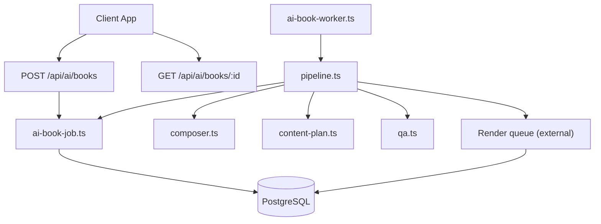

**Diagram sources**
- [books route.ts:1-53](file://src/app/api/ai/books/route.ts#L1-L53)
- [book status route.ts:1-36](file://src/app/api/ai/books/[id]/route.ts#L1-L36)
- [ai-book-job.ts:1-186](file://src/lib/ai/ai-book-job.ts#L1-L186)
- [pipeline.ts:1-371](file://src/lib/ai/pipeline.ts#L1-L371)
- [composer.ts:1-68](file://src/lib/ai/composer.ts#L1-L68)
- [content-plan.ts:1-30](file://src/lib/ai/content-plan.ts#L1-L30)
- [qa.ts:1-181](file://src/lib/ai/qa.ts#L1-L181)

**Section sources**
- [package.json:1-63](file://package.json#L1-L63)
- [schema.prisma:1-275](file://prisma/schema.prisma#L1-L275)

## Core Components
- Autonomous job lifecycle: enqueueing, claiming with leases, heartbeat, stage advancement, completion, and failure with retry backoff.
- Multi-stage pipeline: CONCEPT, CONTENT, COMPOSE, RENDER, QA.
- Template-aware content generation: resolves approved templates, extracts editable text slots, validates LLM output, and builds per-page overrides.
- Automated QA: structural checks, text fit estimation, image DPI validation, and content moderation.
- Background workers: separate processes for AI book processing and PDF rendering.

Key responsibilities by file:
- ai-book-job.ts: job model helpers, enhanced lease fencing with Prisma transactions, retries, and progress persistence.
- pipeline.ts: orchestrates stages, integrates with LLMs, submission store, and render queue with improved error handling.
- content-plan.ts: Zod schema and parser for LLM-generated content plans.
- composer.ts: server-side validation and mapping of content plans into page-scoped overrides with defensive programming.
- qa.ts: automated checklist including moderation and layout heuristics.
- ai-book-worker.ts: polling loop for AI book jobs.
- render-worker.ts: polling loop for render jobs.
- books route.ts: authenticated endpoint to start a job with rate limiting.
- book status route.ts: authenticated endpoint to poll job status.

**Section sources**
- [ai-book-job.ts:1-186](file://src/lib/ai/ai-book-job.ts#L1-L186)
- [pipeline.ts:1-371](file://src/lib/ai/pipeline.ts#L1-L371)
- [content-plan.ts:1-30](file://src/lib/ai/content-plan.ts#L1-L30)
- [composer.ts:1-68](file://src/lib/ai/composer.ts#L1-L68)
- [qa.ts:1-181](file://src/lib/ai/qa.ts#L1-L181)
- [ai-book-worker.ts:1-34](file://src/workers/ai-book-worker.ts#L1-L34)
- [render-worker.ts:1-33](file://src/workers/render-worker.ts#L1-L33)
- [books route.ts:1-53](file://src/app/api/ai/books/route.ts#L1-L53)
- [book status route.ts:1-36](file://src/app/api/ai/books/[id]/route.ts#L1-L36)

## Architecture Overview
The AI book system follows a durable queue pattern backed by PostgreSQL. Clients submit concepts; the API enqueues a job and returns a job ID. Workers poll for work, claim it with a time-bound lease, and advance through stages. Each stage persists partial results so retries resume safely. Rendering is delegated to a separate render queue and worker.

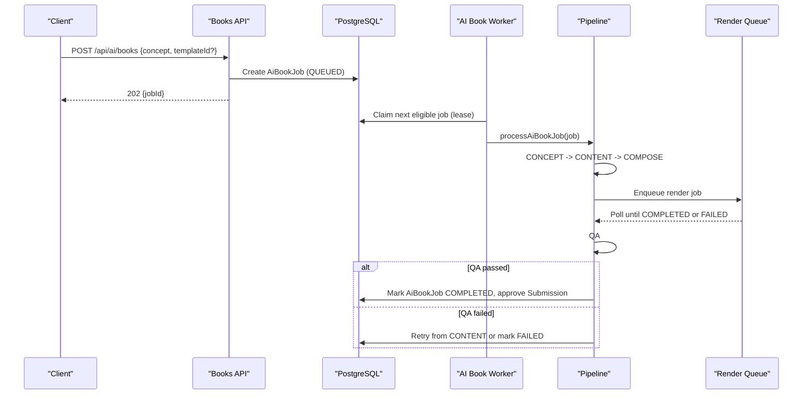

**Diagram sources**
- [books route.ts:1-53](file://src/app/api/ai/books/route.ts#L1-L53)
- [ai-book-job.ts:1-186](file://src/lib/ai/ai-book-job.ts#L1-L186)
- [pipeline.ts:1-371](file://src/lib/ai/pipeline.ts#L1-L371)
- [ai-book-worker.ts:1-34](file://src/workers/ai-book-worker.ts#L1-L34)

## Detailed Component Analysis

### Enhanced Lease Management and Error Handling
The job lifecycle ensures safe concurrent execution across multiple workers with enhanced lease fencing:
- Enqueueing validates AI configuration and active job limits.
- Claiming uses a database-level lock and sets a lease expiration with improved transaction support.
- Heartbeats extend the lease while work proceeds.
- Stage advancement merges partial outputs to support resumption with transaction-scoped operations.
- Completion clears lease state and can perform side effects atomically within fenced transactions.
- Failure schedules retries with exponential backoff or marks terminal failures.
- **New**: `AiBookTerminalError` class for non-retryable failures and `LeaseLostError` for lease conflicts.

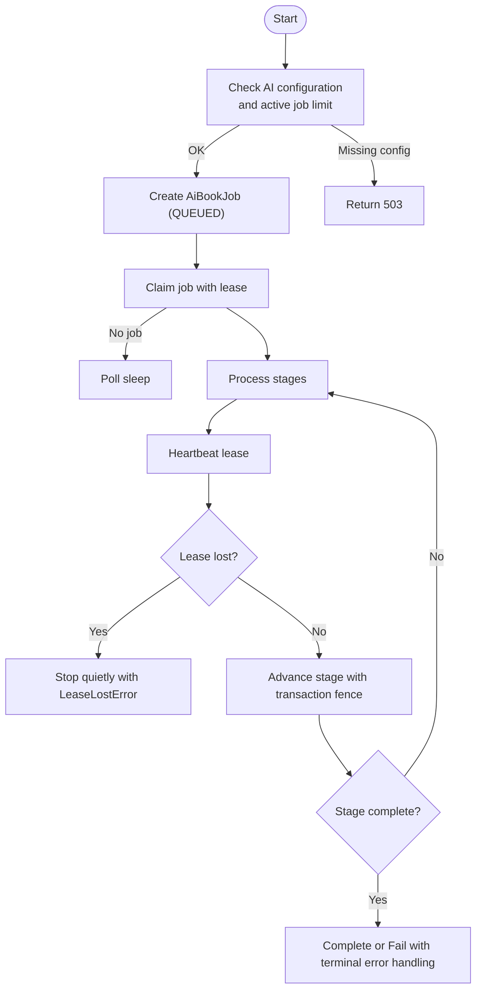

**Updated** Enhanced with Prisma transaction support and improved error classification

**Diagram sources**
- [ai-book-job.ts:33-186](file://src/lib/ai/ai-book-job.ts#L33-L186)
- [pipeline.ts:317-371](file://src/lib/ai/pipeline.ts#L317-L371)

**Section sources**
- [ai-book-job.ts:1-186](file://src/lib/ai/ai-book-job.ts#L1-L186)

### Improved Pipeline Orchestration with Defensive Programming
The pipeline executes five stages in order with enhanced error handling and defensive programming:
- CONCEPT: resolve template (user-specified or AI-selected).
- CONTENT: generate validated content plan for template text slots.
- COMPOSE: create or update a submission instance with per-page overrides and lazy slot reloading.
- RENDER: enqueue PDF rendering and wait for completion.
- QA: run automated checks; approve if passing, otherwise retry or fail.

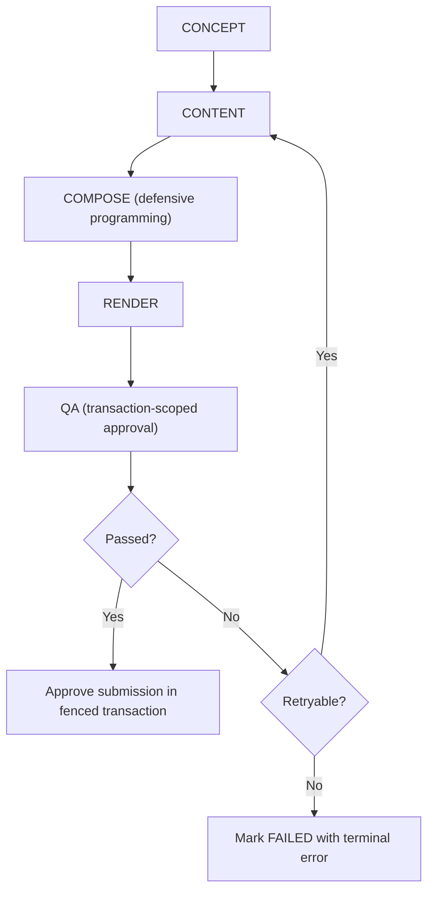

**Updated** Added defensive programming in COMPOSE stage and transaction-scoped QA approval

**Diagram sources**
- [pipeline.ts:50-56](file://src/lib/ai/pipeline.ts#L50-L56)
- [pipeline.ts:179-301](file://src/lib/ai/pipeline.ts#L179-L301)

**Section sources**
- [pipeline.ts:1-371](file://src/lib/ai/pipeline.ts#L1-L371)

### Template Resolution and Text Slot Discovery
Template resolution supports:
- User-provided template ID validated against approved templates.
- Automatic selection when no template is provided, based on available approved templates and their editable text slots.
- Extraction of text-only elements from template elements to inform content generation.

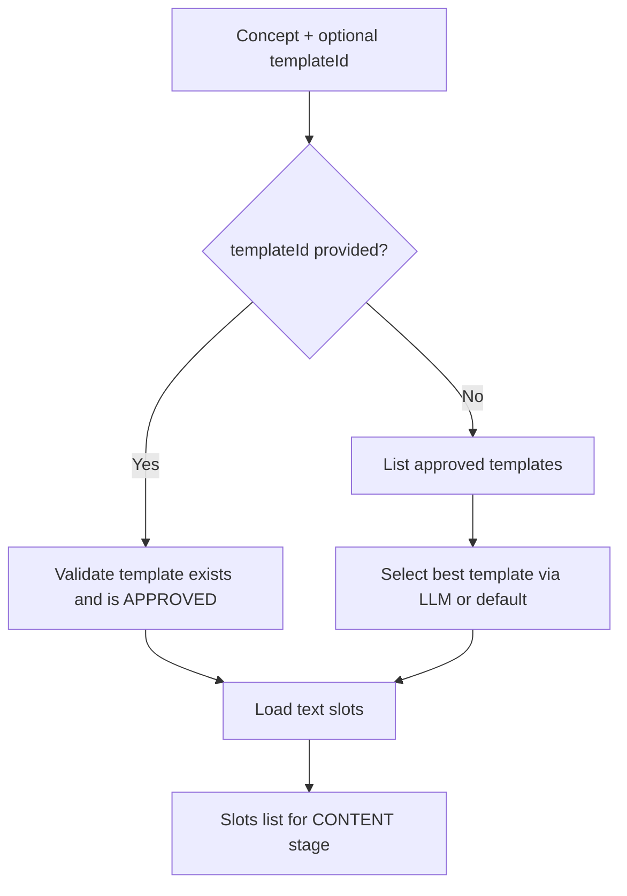

**Diagram sources**
- [pipeline.ts:88-134](file://src/lib/ai/pipeline.ts#L88-L134)

**Section sources**
- [pipeline.ts:88-134](file://src/lib/ai/pipeline.ts#L88-L134)

### Content Plan Schema and Validation
The content plan contract ensures the LLM produces a title and a set of overrides keyed by known template element IDs. Server-side validation rejects unknown or duplicate IDs and groups overrides by page label for composition.

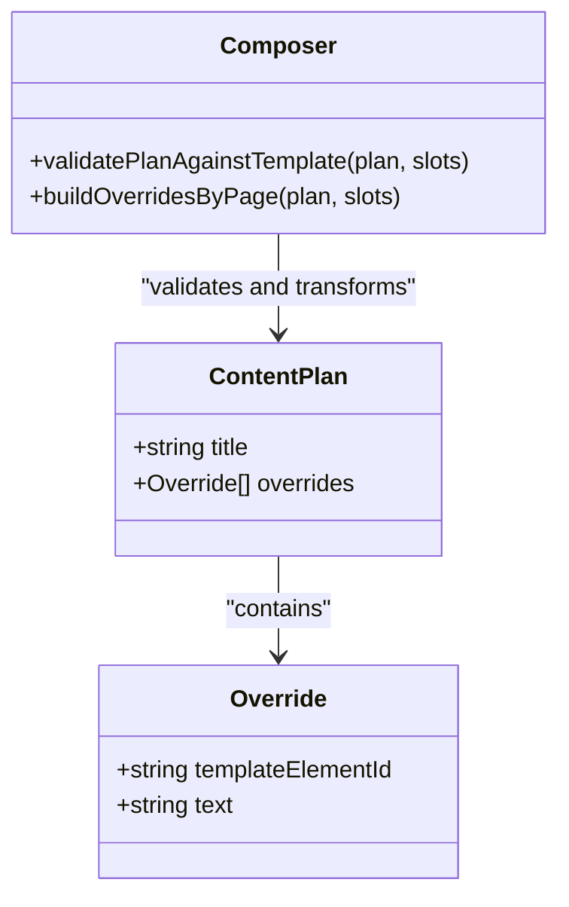

**Diagram sources**
- [content-plan.ts:1-30](file://src/lib/ai/content-plan.ts#L1-L30)
- [composer.ts:1-68](file://src/lib/ai/composer.ts#L1-L68)

**Section sources**
- [content-plan.ts:1-30](file://src/lib/ai/content-plan.ts#L1-L30)
- [composer.ts:1-68](file://src/lib/ai/composer.ts#L1-L68)

### Enhanced Composition with Defensive Programming
Composition maps validated content plans into per-page overrides and creates or rewrites a submission instance tied to the chosen template. **Updated** with defensive programming including lazy slot reloading and improved error handling. If a submission already exists, it updates the instance's overrides rather than duplicating data.

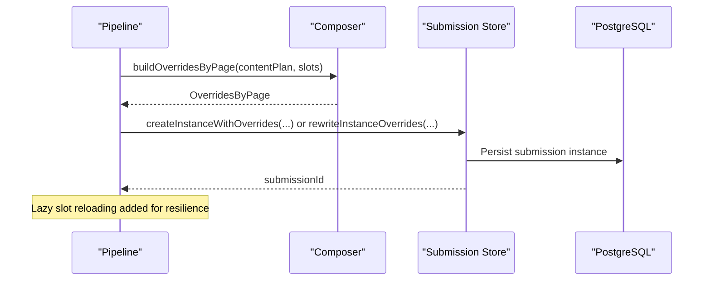

**Updated** Added defensive programming with lazy slot reloading

**Diagram sources**
- [pipeline.ts:192-215](file://src/lib/ai/pipeline.ts#L192-L215)
- [composer.ts:48-68](file://src/lib/ai/composer.ts#L48-L68)

**Section sources**
- [pipeline.ts:192-215](file://src/lib/ai/pipeline.ts#L192-L215)
- [composer.ts:48-68](file://src/lib/ai/composer.ts#L48-L68)

### Rendering Integration and Retry Strategy
Rendering is delegated to a separate queue. The pipeline enqueues a render job and polls until completion. If low-resolution assets are detected, it retries once with a force flag and records that detail. A timeout triggers a retryable failure.

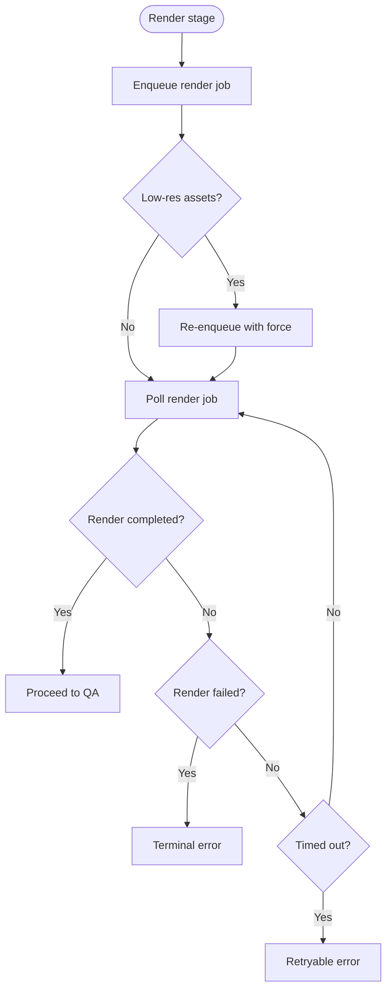

**Diagram sources**
- [pipeline.ts:227-270](file://src/lib/ai/pipeline.ts#L227-L270)

**Section sources**
- [pipeline.ts:227-270](file://src/lib/ai/pipeline.ts#L227-L270)

### Transaction-Scoped QA Approval Workflow
The QA stage performs several checks with **updated** transaction-scoped approval workflow:
- Title length within limits.
- PDF artifact presence in storage.
- Page completeness and schema validity.
- Non-empty text elements.
- Estimated text fit within boxes.
- Image DPI thresholds.
- Content moderation using LLM moderation API.

**Updated** QA approval now runs within a fenced transaction to prevent stale worker approvals

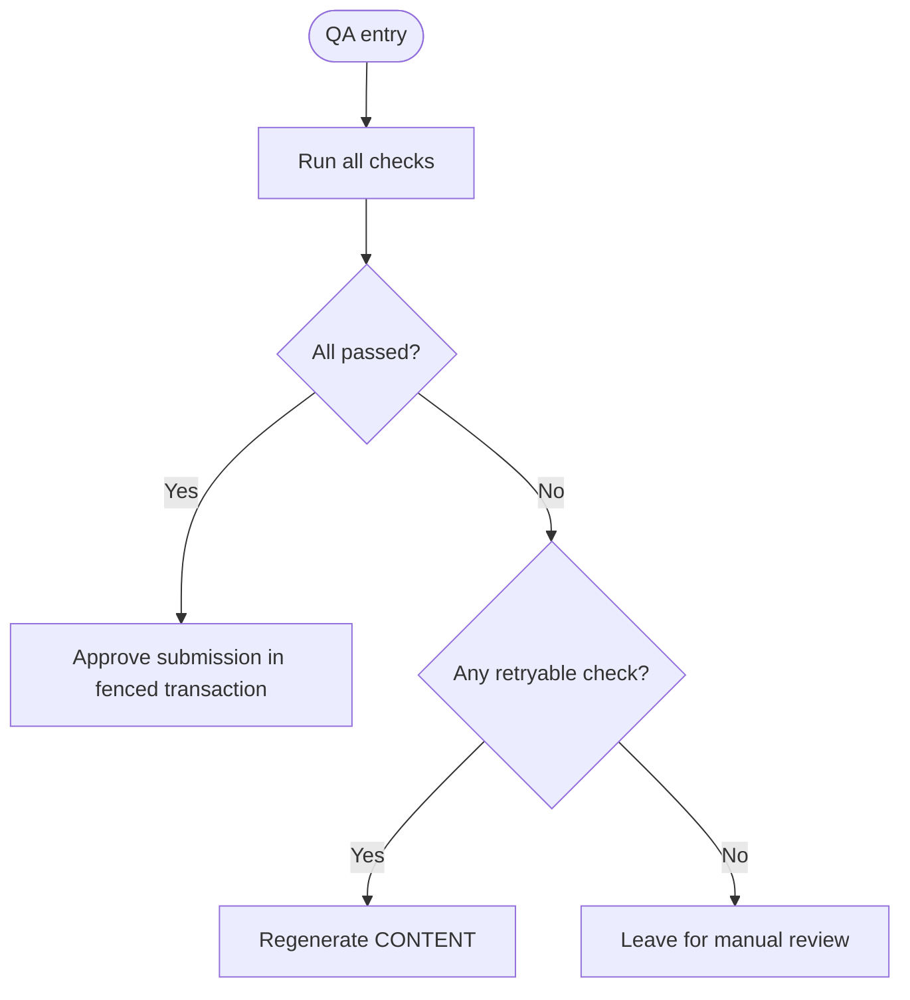

**Diagram sources**
- [qa.ts:22-25](file://src/lib/ai/qa.ts#L22-L25)
- [qa.ts:86-181](file://src/lib/ai/qa.ts#L86-L181)
- [pipeline.ts:272-301](file://src/lib/ai/pipeline.ts#L272-L301)

**Section sources**
- [qa.ts:1-181](file://src/lib/ai/qa.ts#L1-L181)

### API Endpoints
- POST /api/ai/books: authenticates the user, applies per-user rate limiting, validates input, and enqueues an AI book job. Returns 202 with jobId.
- GET /api/ai/books/:id: authenticates the user, verifies ownership or admin role, and returns current job status, stage, submissionId, error message, and QA report.

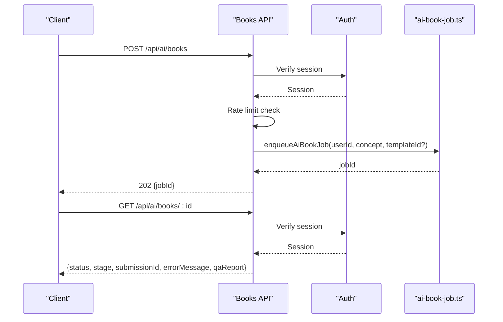

**Diagram sources**
- [books route.ts:1-53](file://src/app/api/ai/books/route.ts#L1-L53)
- [book status route.ts:1-36](file://src/app/api/ai/books/[id]/route.ts#L1-L36)
- [ai-book-job.ts:42-60](file://src/lib/ai/ai-book-job.ts#L42-L60)

**Section sources**
- [books route.ts:1-53](file://src/app/api/ai/books/route.ts#L1-L53)
- [book status route.ts:1-36](file://src/app/api/ai/books/[id]/route.ts#L1-L36)

### Background Workers
- ai-book-worker.ts: polls for AI book jobs, claims them, logs events, and invokes the pipeline. Handles graceful shutdown and reconnects on errors.
- render-worker.ts: polls for render jobs, claims them, processes them, and handles graceful shutdown.

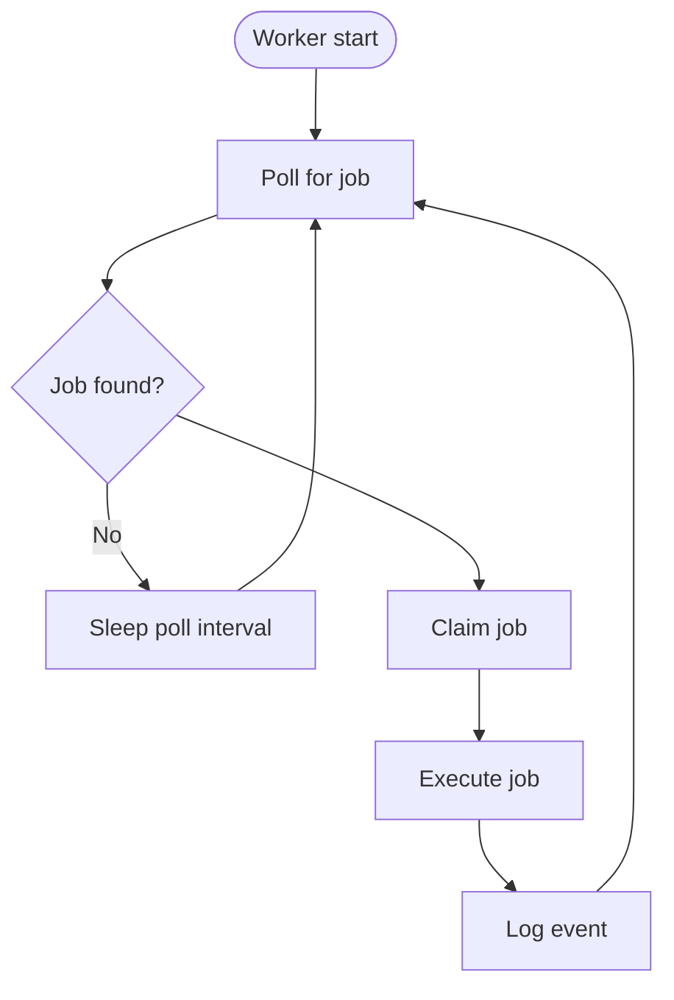

**Diagram sources**
- [ai-book-worker.ts:1-34](file://src/workers/ai-book-worker.ts#L1-L34)
- [render-worker.ts:1-33](file://src/workers/render-worker.ts#L1-L33)

**Section sources**
- [ai-book-worker.ts:1-34](file://src/workers/ai-book-worker.ts#L1-L34)
- [render-worker.ts:1-33](file://src/workers/render-worker.ts#L1-L33)

## Dependency Analysis
The AI book system has clear boundaries between API, workers, and domain logic with enhanced error handling:

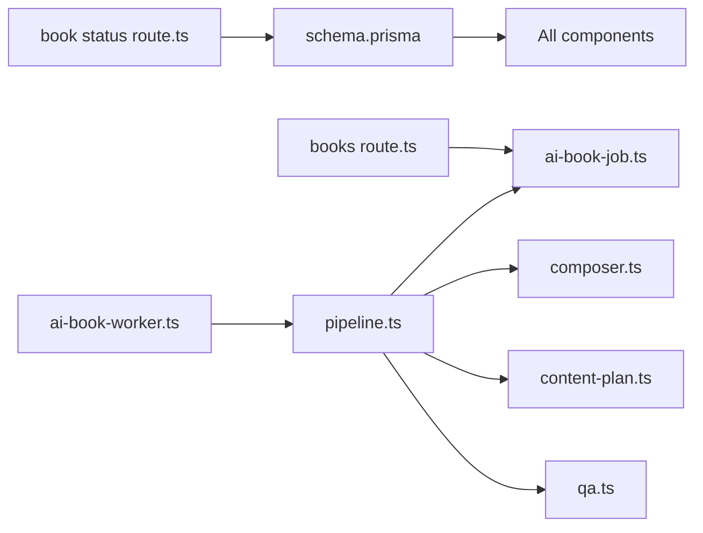

**Diagram sources**
- [books route.ts:1-53](file://src/app/api/ai/books/route.ts#L1-L53)
- [book status route.ts:1-36](file://src/app/api/ai/books/[id]/route.ts#L1-L36)
- [ai-book-worker.ts:1-34](file://src/workers/ai-book-worker.ts#L1-L34)
- [pipeline.ts:1-371](file://src/lib/ai/pipeline.ts#L1-L371)
- [composer.ts:1-68](file://src/lib/ai/composer.ts#L1-L68)
- [content-plan.ts:1-30](file://src/lib/ai/content-plan.ts#L1-L30)
- [qa.ts:1-181](file://src/lib/ai/qa.ts#L1-L181)
- [schema.prisma:1-275](file://prisma/schema.prisma#L1-L275)

**Section sources**
- [schema.prisma:223-275](file://prisma/schema.prisma#L223-L275)

## Performance Considerations
- Lease-based concurrency: Jobs are claimed with a database-level lock and lease expiration to avoid duplicate processing.
- Heartbeats: Periodic lease extensions prevent premature reclamation during long-running stages.
- Retry backoff: Failures schedule retries with increasing delays to reduce load spikes.
- Active job limits: Per-user limits prevent resource exhaustion.
- Render polling: Rendering waits with bounded polling intervals and caps total wait time.
- Rate limiting: Simple in-memory per-user throttling reduces bursty requests to the API.
- **Enhanced**: Transaction-scoped operations improve consistency and reduce race conditions.

## Troubleshooting Guide
Common issues and diagnostics:
- AI not configured: Enqueueing fails with a service unavailable error when the required AI configuration is missing.
- Too many active jobs: Enqueueing returns a rate-limited response when the user exceeds the active job limit.
- Lease lost: Pipeline stops without modifying state when another worker takes over; check logs for lease-lost events.
- Rendering timeouts: Pipeline treats render timeouts as retryable; verify render worker health and queue backlog.
- QA failures: Review the QA report attached to the job; retryable failures regenerate content, while terminal failures require manual review.
- **New**: P2025 errors during completion indicate missing submissions and should be treated as terminal failures.

Operational tips:
- Monitor worker logs for claimed and finished events.
- Inspect job status via the polling endpoint to track stage transitions and errors.
- Ensure environment variables for polling intervals and lease durations are valid.
- **Updated**: Watch for `LeaseLostError` exceptions which indicate concurrent access conflicts.

**Section sources**
- [ai-book-job.ts:27-186](file://src/lib/ai/ai-book-job.ts#L27-L186)
- [pipeline.ts:357-371](file://src/lib/ai/pipeline.ts#L357-L371)
- [qa.ts:22-25](file://src/lib/ai/qa.ts#L22-L25)
- [ai-book-worker.ts:18-33](file://src/workers/ai-book-worker.ts#L18-L33)
- [render-worker.ts:17-32](file://src/workers/render-worker.ts#L17-L32)

## Conclusion
The AI book generation system combines robust job leasing with enhanced transaction support, staged orchestration, template-aware content generation, and automated QA to deliver reliable, scalable booklet creation. Its separation of concerns—API, workers, and domain libraries—supports maintainability and observability. With careful tuning of lease durations, polling intervals, and retry policies, the system can handle variable workloads while preserving correctness and safety.

**Updated** Recent enhancements include improved lease fencing with Prisma transactions, better error classification with dedicated error classes, transaction-scoped QA approval, defensive programming patterns, and comprehensive integration test coverage for edge cases like lease loss and missing submissions.