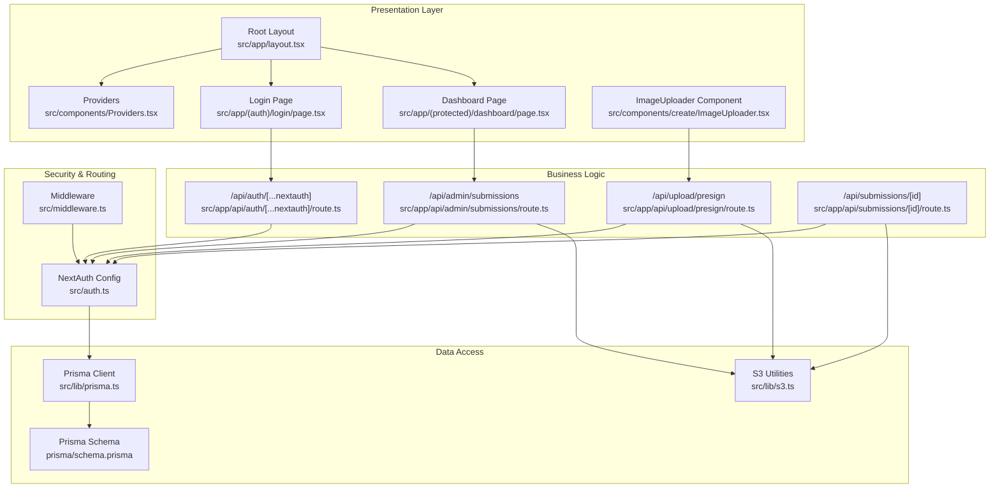
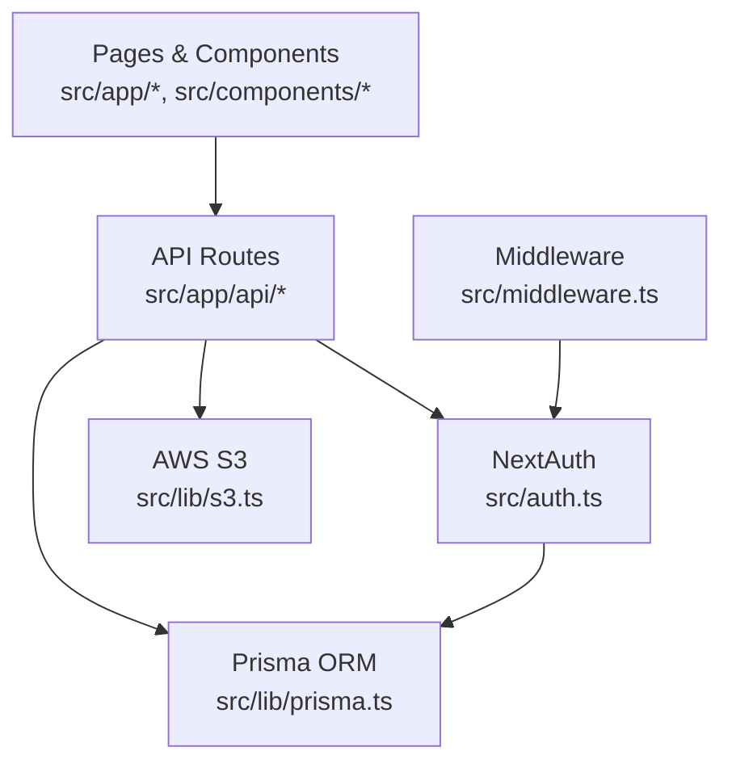
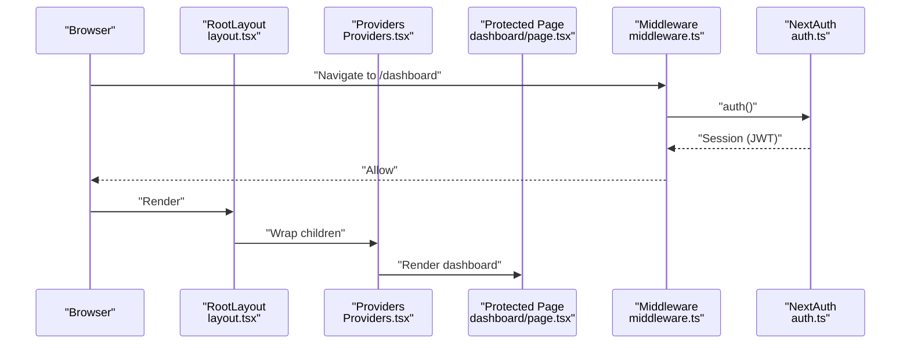
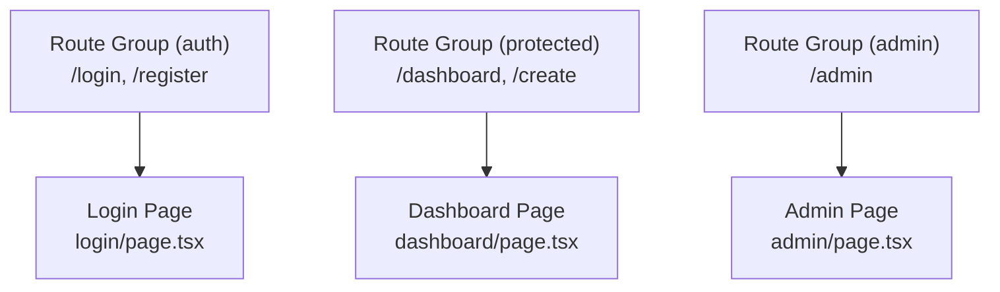
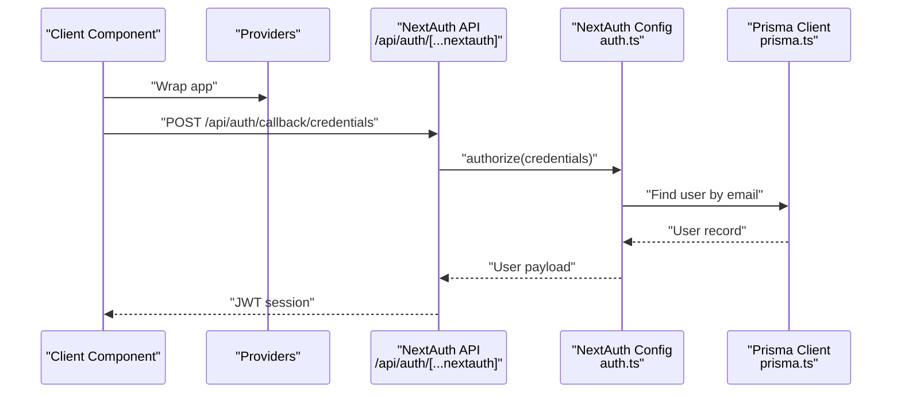
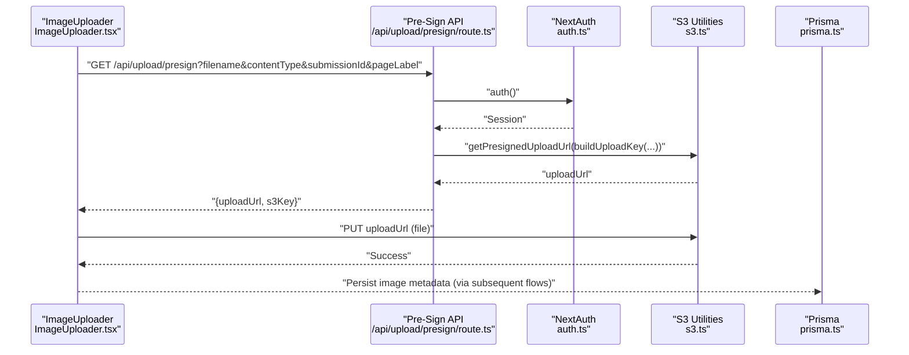
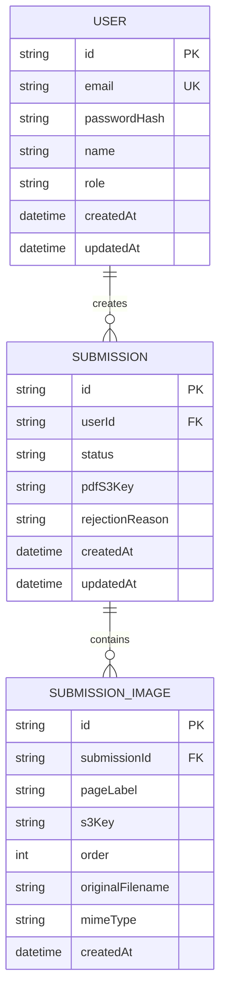
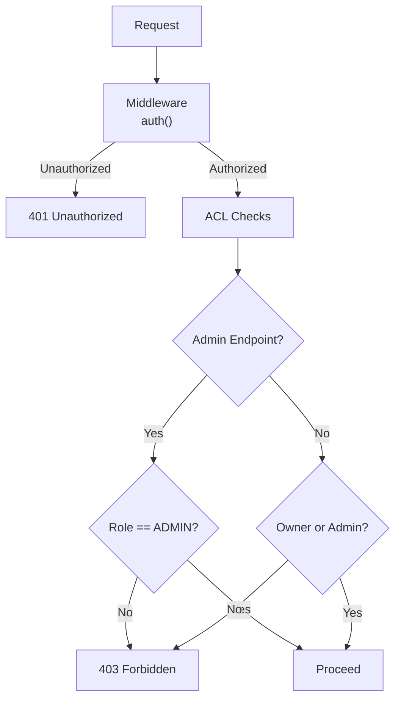
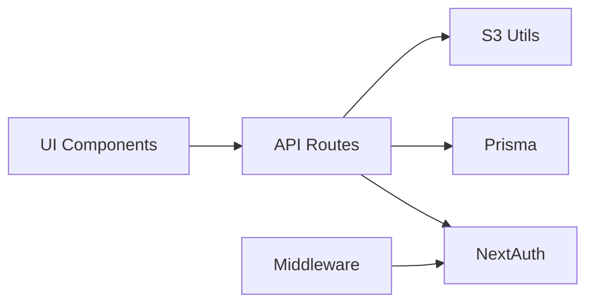

# Architecture Overview

<cite>
**Referenced Files in This Document**
- [src/app/layout.tsx](file://src/app/layout.tsx)
- [src/components/Providers.tsx](file://src/components/Providers.tsx)
- [src/middleware.ts](file://src/middleware.ts)
- [src/auth.ts](file://src/auth.ts)
- [src/app/api/auth/[...nextauth]/route.ts](file://src/app/api/auth/[...nextauth]/route.ts)
- [src/lib/prisma.ts](file://src/lib/prisma.ts)
- [prisma/schema.prisma](file://prisma/schema.prisma)
- [src/lib/s3.ts](file://src/lib/s3.ts)
- [src/lib/constants.ts](file://src/lib/constants.ts)
- [src/app/(auth)/login/page.tsx](file://src/app/(auth)/login/page.tsx)
- [src/app/(protected)/dashboard/page.tsx](file://src/app/(protected)/dashboard/page.tsx)
- [src/app/api/admin/submissions/route.ts](file://src/app/api/admin/submissions/route.ts)
- [src/app/api/upload/presign/route.ts](file://src/app/api/upload/presign/route.ts)
- [src/app/api/submissions/[id]/route.ts](file://src/app/api/submissions/[id]/route.ts)
- [src/components/create/ImageUploader.tsx](file://src/components/create/ImageUploader.tsx)
</cite>

## Table of Contents
1. [Introduction](#introduction)
2. [Project Structure](#project-structure)
3. [Core Components](#core-components)
4. [Architecture Overview](#architecture-overview)
5. [Detailed Component Analysis](#detailed-component-analysis)
6. [Dependency Analysis](#dependency-analysis)
7. [Performance Considerations](#performance-considerations)
8. [Troubleshooting Guide](#troubleshooting-guide)
9. [Conclusion](#conclusion)

## Introduction
This document describes the system architecture of Titchybook Creator, a Next.js application that enables users to create printable 8-page micro booklets from uploaded images. The system follows a layered architecture with presentation, business logic, and data access layers. It leverages the Next.js App Router with route groups to organize authentication, protected, and administrative areas. Security is enforced via middleware and NextAuth-based session management. Data persistence uses Prisma ORM with a local SQLite database, while binary assets are stored in AWS S3 using pre-signed URLs for secure uploads and downloads.

## Project Structure
The project is organized around the Next.js App Router:
- Presentation layer: React components under src/components and pages under src/app.
- Business logic: Route handlers under src/app/api implement request handling and orchestrate domain operations.
- Data access: Prisma client in src/lib/prisma.ts and S3 utilities in src/lib/s3.ts.
- Authentication and middleware: src/auth.ts defines NextAuth configuration, src/middleware.ts enforces route protection, and src/app/api/auth/[...nextauth]/route.ts exposes NextAuth endpoints.

**Diagram sources**
- [src/app/layout.tsx:23-41](file://src/app/layout.tsx#L23-L41)
- [src/components/Providers.tsx:5-7](file://src/components/Providers.tsx#L5-L7)
- [src/app/(auth)/login/page.tsx](file://src/app/(auth)/login/page.tsx#L1-L13)
- [src/app/(protected)/dashboard/page.tsx](file://src/app/(protected)/dashboard/page.tsx#L1-L20)
- [src/app/api/auth/[...nextauth]/route.ts](file://src/app/api/auth/[...nextauth]/route.ts#L1-L4)
- [src/app/api/upload/presign/route.ts:1-38](file://src/app/api/upload/presign/route.ts#L1-L38)
- [src/app/api/admin/submissions/route.ts:1-38](file://src/app/api/admin/submissions/route.ts#L1-L38)
- [src/app/api/submissions/[id]/route.ts](file://src/app/api/submissions/[id]/route.ts#L1-L37)
- [src/auth.ts:27-79](file://src/auth.ts#L27-L79)
- [src/middleware.ts:1-6](file://src/middleware.ts#L1-L6)
- [src/lib/prisma.ts:1-10](file://src/lib/prisma.ts#L1-L10)
- [prisma/schema.prisma:1-48](file://prisma/schema.prisma#L1-L48)
- [src/lib/s3.ts:1-81](file://src/lib/s3.ts#L1-L81)

**Section sources**
- [src/app/layout.tsx:1-42](file://src/app/layout.tsx#L1-L42)
- [src/components/Providers.tsx:1-8](file://src/components/Providers.tsx#L1-L8)
- [src/middleware.ts:1-6](file://src/middleware.ts#L1-L6)
- [src/auth.ts:1-80](file://src/auth.ts#L1-L80)
- [src/app/api/auth/[...nextauth]/route.ts](file://src/app/api/auth/[...nextauth]/route.ts#L1-L4)
- [src/lib/prisma.ts:1-10](file://src/lib/prisma.ts#L1-L10)
- [prisma/schema.prisma:1-48](file://prisma/schema.prisma#L1-L48)
- [src/lib/s3.ts:1-81](file://src/lib/s3.ts#L1-L81)
- [src/lib/constants.ts:1-49](file://src/lib/constants.ts#L1-L49)
- [src/app/(auth)/login/page.tsx](file://src/app/(auth)/login/page.tsx#L1-L13)
- [src/app/(protected)/dashboard/page.tsx](file://src/app/(protected)/dashboard/page.tsx#L1-L20)
- [src/app/api/admin/submissions/route.ts:1-38](file://src/app/api/admin/submissions/route.ts#L1-L38)
- [src/app/api/upload/presign/route.ts:1-38](file://src/app/api/upload/presign/route.ts#L1-L38)
- [src/app/api/submissions/[id]/route.ts](file://src/app/api/submissions/[id]/route.ts#L1-L37)
- [src/components/create/ImageUploader.tsx:1-148](file://src/components/create/ImageUploader.tsx#L1-L148)

## Core Components
- Root layout and providers: The root layout composes Providers to enable session management across the app. See [src/app/layout.tsx:23-41](file://src/app/layout.tsx#L23-L41) and [src/components/Providers.tsx:5-7](file://src/components/Providers.tsx#L5-L7).
- Middleware: Enforces authentication for protected routes using NextAuth. See [src/middleware.ts:1-6](file://src/middleware.ts#L1-L6).
- Authentication: NextAuth configuration with JWT session strategy, credential provider, and typed session/JWT interfaces. See [src/auth.ts:27-79](file://src/auth.ts#L27-L79).
- API routes: Implement business logic for authentication, upload pre-signing, admin submissions, and submission retrieval. See:
  - [src/app/api/auth/[...nextauth]/route.ts](file://src/app/api/auth/[...nextauth]/route.ts#L1-L4)
  - [src/app/api/upload/presign/route.ts:1-38](file://src/app/api/upload/presign/route.ts#L1-L38)
  - [src/app/api/admin/submissions/route.ts:1-38](file://src/app/api/admin/submissions/route.ts#L1-L38)
  - [src/app/api/submissions/[id]/route.ts](file://src/app/api/submissions/[id]/route.ts#L1-L37)
- Data access:
  - Prisma client initialization and schema modeling. See [src/lib/prisma.ts:1-10](file://src/lib/prisma.ts#L1-L10) and [prisma/schema.prisma:1-48](file://prisma/schema.prisma#L1-L48).
  - S3 utilities for pre-signed URLs and direct uploads/downloads. See [src/lib/s3.ts:1-81](file://src/lib/s3.ts#L1-L81).
- Constants and types: Submission statuses, page labels, accepted image types, and sizes. See [src/lib/constants.ts:1-49](file://src/lib/constants.ts#L1-L49).
- Presentation components:
  - Login page and dashboard page. See [src/app/(auth)/login/page.tsx](file://src/app/(auth)/login/page.tsx#L1-L13) and [src/app/(protected)/dashboard/page.tsx](file://src/app/(protected)/dashboard/page.tsx#L1-L20).
  - Image uploader component that integrates with the pre-sign API. See [src/components/create/ImageUploader.tsx:1-148](file://src/components/create/ImageUploader.tsx#L1-L148).

**Section sources**
- [src/app/layout.tsx:23-41](file://src/app/layout.tsx#L23-L41)
- [src/components/Providers.tsx:5-7](file://src/components/Providers.tsx#L5-L7)
- [src/middleware.ts:1-6](file://src/middleware.ts#L1-L6)
- [src/auth.ts:27-79](file://src/auth.ts#L27-L79)
- [src/app/api/auth/[...nextauth]/route.ts](file://src/app/api/auth/[...nextauth]/route.ts#L1-L4)
- [src/app/api/upload/presign/route.ts:1-38](file://src/app/api/upload/presign/route.ts#L1-L38)
- [src/app/api/admin/submissions/route.ts:1-38](file://src/app/api/admin/submissions/route.ts#L1-L38)
- [src/app/api/submissions/[id]/route.ts](file://src/app/api/submissions/[id]/route.ts#L1-L37)
- [src/lib/prisma.ts:1-10](file://src/lib/prisma.ts#L1-L10)
- [prisma/schema.prisma:1-48](file://prisma/schema.prisma#L1-L48)
- [src/lib/s3.ts:1-81](file://src/lib/s3.ts#L1-L81)
- [src/lib/constants.ts:1-49](file://src/lib/constants.ts#L1-L49)
- [src/app/(auth)/login/page.tsx](file://src/app/(auth)/login/page.tsx#L1-L13)
- [src/app/(protected)/dashboard/page.tsx](file://src/app/(protected)/dashboard/page.tsx#L1-L20)
- [src/components/create/ImageUploader.tsx:1-148](file://src/components/create/ImageUploader.tsx#L1-L148)

## Architecture Overview
The system employs a layered architecture:
- Presentation layer: Next.js App Router pages and React components render UI and collect user input.
- Business logic layer: API routes encapsulate request handling, validation, authorization checks, and orchestration of data access.
- Data access layer: Prisma ORM manages relational data, and S3 utilities manage binary assets with pre-signed URLs.

**Diagram sources**
- [src/app/(auth)/login/page.tsx](file://src/app/(auth)/login/page.tsx#L1-L13)
- [src/app/(protected)/dashboard/page.tsx](file://src/app/(protected)/dashboard/page.tsx#L1-L20)
- [src/components/create/ImageUploader.tsx:1-148](file://src/components/create/ImageUploader.tsx#L1-L148)
- [src/app/api/upload/presign/route.ts:1-38](file://src/app/api/upload/presign/route.ts#L1-L38)
- [src/app/api/admin/submissions/route.ts:1-38](file://src/app/api/admin/submissions/route.ts#L1-L38)
- [src/app/api/submissions/[id]/route.ts](file://src/app/api/submissions/[id]/route.ts#L1-L37)
- [src/auth.ts:27-79](file://src/auth.ts#L27-L79)
- [src/lib/prisma.ts:1-10](file://src/lib/prisma.ts#L1-L10)
- [src/lib/s3.ts:1-81](file://src/lib/s3.ts#L1-L81)
- [src/middleware.ts:1-6](file://src/middleware.ts#L1-L6)

## Detailed Component Analysis

### Layered Architecture and Component Hierarchy
- Root layout composes Providers to enable session management for all pages. Providers wraps the header, main content, and toast notifications.
- Pages under route groups:
  - Authentication group: login page renders LoginForm and delegates to NextAuth endpoints.
  - Protected group: dashboard page lists user submissions and links to creation flow.
- Component hierarchy starts at the root layout, passes through Providers, and reaches individual pages and shared components.

**Diagram sources**
- [src/app/layout.tsx:23-41](file://src/app/layout.tsx#L23-L41)
- [src/components/Providers.tsx:5-7](file://src/components/Providers.tsx#L5-L7)
- [src/app/(protected)/dashboard/page.tsx](file://src/app/(protected)/dashboard/page.tsx#L1-L20)
- [src/middleware.ts:1-6](file://src/middleware.ts#L1-L6)
- [src/auth.ts:27-79](file://src/auth.ts#L27-L79)

**Section sources**
- [src/app/layout.tsx:23-41](file://src/app/layout.tsx#L23-L41)
- [src/components/Providers.tsx:5-7](file://src/components/Providers.tsx#L5-L7)
- [src/app/(protected)/dashboard/page.tsx](file://src/app/(protected)/dashboard/page.tsx#L1-L20)
- [src/middleware.ts:1-6](file://src/middleware.ts#L1-L6)
- [src/auth.ts:27-79](file://src/auth.ts#L27-L79)

### Next.js App Router Pattern and Route Groups
- Route groups segment functionality:
  - (auth): Login and registration flows.
  - (protected): User dashboard and creation flows.
  - (admin): Administrative submission management.
- Grouping allows clean separation of concerns and simplified routing without affecting URLs.

**Diagram sources**
- [src/app/(auth)/login/page.tsx](file://src/app/(auth)/login/page.tsx#L1-L13)
- [src/app/(protected)/dashboard/page.tsx](file://src/app/(protected)/dashboard/page.tsx#L1-L20)
- [src/app/(admin)/admin/page.tsx](file://src/app/(admin)/admin/page.tsx)

**Section sources**
- [src/app/(auth)/login/page.tsx](file://src/app/(auth)/login/page.tsx#L1-L13)
- [src/app/(protected)/dashboard/page.tsx](file://src/app/(protected)/dashboard/page.tsx#L1-L20)

### Middleware Implementation for Route Protection
- Middleware exports NextAuth’s auth function and matches protected routes.
- Unauthorized access is blocked before rendering protected pages.

**Diagram sources**
- [src/middleware.ts:1-6](file://src/middleware.ts#L1-L6)
- [src/auth.ts:27-79](file://src/auth.ts#L27-L79)

**Section sources**
- [src/middleware.ts:1-6](file://src/middleware.ts#L1-L6)
- [src/auth.ts:27-79](file://src/auth.ts#L27-L79)

### Authentication Flow and Session Management
- NextAuth handles credential-based login, JWT session storage, and typed session/JWT payloads.
- NextAuth endpoints are exposed via a catch-all API route.
- The Providers component wraps the app to make session data available to client components.

**Diagram sources**
- [src/components/Providers.tsx:5-7](file://src/components/Providers.tsx#L5-L7)
- [src/app/api/auth/[...nextauth]/route.ts](file://src/app/api/auth/[...nextauth]/route.ts#L1-L4)
- [src/auth.ts:27-79](file://src/auth.ts#L27-L79)
- [src/lib/prisma.ts:1-10](file://src/lib/prisma.ts#L1-L10)

**Section sources**
- [src/components/Providers.tsx:5-7](file://src/components/Providers.tsx#L5-L7)
- [src/app/api/auth/[...nextauth]/route.ts](file://src/app/api/auth/[...nextauth]/route.ts#L1-L4)
- [src/auth.ts:27-79](file://src/auth.ts#L27-L79)
- [src/lib/prisma.ts:1-10](file://src/lib/prisma.ts#L1-L10)

### Integration Patterns: React Components, API Routes, Prisma, and S3
- ImageUploader component:
  - Validates file type and size.
  - Requests a pre-signed upload URL from /api/upload/presign.
  - Uploads directly to S3 and notifies parent on success.
- Pre-signed URL generation:
  - API validates session, constructs S3 key, and returns a pre-signed PUT URL.
- Submission retrieval:
  - API validates session, enforces ownership or admin privileges, and optionally generates a pre-signed PDF download URL.
- Admin submissions:
  - API validates admin role, queries submissions with filters, and enriches results with pre-signed PDF URLs.

**Diagram sources**
- [src/components/create/ImageUploader.tsx:22-73](file://src/components/create/ImageUploader.tsx#L22-L73)
- [src/app/api/upload/presign/route.ts:6-37](file://src/app/api/upload/presign/route.ts#L6-L37)
- [src/auth.ts:27-79](file://src/auth.ts#L27-L79)
- [src/lib/s3.ts:18-28](file://src/lib/s3.ts#L18-L28)
- [src/lib/prisma.ts:1-10](file://src/lib/prisma.ts#L1-L10)

**Section sources**
- [src/components/create/ImageUploader.tsx:1-148](file://src/components/create/ImageUploader.tsx#L1-L148)
- [src/app/api/upload/presign/route.ts:1-38](file://src/app/api/upload/presign/route.ts#L1-L38)
- [src/lib/s3.ts:1-81](file://src/lib/s3.ts#L1-L81)
- [src/lib/prisma.ts:1-10](file://src/lib/prisma.ts#L1-L10)
- [src/auth.ts:27-79](file://src/auth.ts#L27-L79)

### Data Model and Repository/Factory Patterns
- Data model:
  - User, Submission, SubmissionImage entities define relationships and indexes.
- Repository pattern:
  - API routes act as repositories, orchestrating Prisma queries and S3 operations.
- Factory pattern:
  - S3 utilities construct keys for uploads and PDFs, acting as factories for S3 keys.

**Diagram sources**
- [prisma/schema.prisma:10-47](file://prisma/schema.prisma#L10-L47)

**Section sources**
- [prisma/schema.prisma:1-48](file://prisma/schema.prisma#L1-L48)
- [src/lib/s3.ts:66-80](file://src/lib/s3.ts#L66-L80)

### Security Architecture and Authorization
- Session strategy: JWT-based sessions managed by NextAuth.
- Role-based access control:
  - Admin-only endpoint requires ADMIN role.
  - Submission retrieval enforces ownership or ADMIN role.
- Middleware-based protection:
  - Protects routes under /dashboard, /create, and /admin.

**Diagram sources**
- [src/middleware.ts:1-6](file://src/middleware.ts#L1-L6)
- [src/app/api/admin/submissions/route.ts:7-10](file://src/app/api/admin/submissions/route.ts#L7-L10)
- [src/app/api/submissions/[id]/route.ts](file://src/app/api/submissions/[id]/route.ts#L26-L28)
- [src/auth.ts:65-78](file://src/auth.ts#L65-L78)

**Section sources**
- [src/middleware.ts:1-6](file://src/middleware.ts#L1-L6)
- [src/app/api/admin/submissions/route.ts:1-38](file://src/app/api/admin/submissions/route.ts#L1-L38)
- [src/app/api/submissions/[id]/route.ts](file://src/app/api/submissions/[id]/route.ts#L1-L37)
- [src/auth.ts:65-78](file://src/auth.ts#L65-L78)

## Dependency Analysis
- Presentation depends on:
  - Providers for session context.
  - API routes for server interactions.
- API routes depend on:
  - NextAuth for session validation.
  - Prisma for data access.
  - S3 utilities for asset operations.
- Middleware depends on NextAuth to enforce access control.

**Diagram sources**
- [src/components/Providers.tsx:5-7](file://src/components/Providers.tsx#L5-L7)
- [src/app/api/upload/presign/route.ts:1-38](file://src/app/api/upload/presign/route.ts#L1-L38)
- [src/app/api/admin/submissions/route.ts:1-38](file://src/app/api/admin/submissions/route.ts#L1-L38)
- [src/app/api/submissions/[id]/route.ts](file://src/app/api/submissions/[id]/route.ts#L1-L37)
- [src/auth.ts:27-79](file://src/auth.ts#L27-L79)
- [src/lib/prisma.ts:1-10](file://src/lib/prisma.ts#L1-L10)
- [src/lib/s3.ts:1-81](file://src/lib/s3.ts#L1-L81)
- [src/middleware.ts:1-6](file://src/middleware.ts#L1-L6)

**Section sources**
- [src/components/Providers.tsx:5-7](file://src/components/Providers.tsx#L5-L7)
- [src/app/api/upload/presign/route.ts:1-38](file://src/app/api/upload/presign/route.ts#L1-L38)
- [src/app/api/admin/submissions/route.ts:1-38](file://src/app/api/admin/submissions/route.ts#L1-L38)
- [src/app/api/submissions/[id]/route.ts](file://src/app/api/submissions/[id]/route.ts#L1-L37)
- [src/auth.ts:27-79](file://src/auth.ts#L27-L79)
- [src/lib/prisma.ts:1-10](file://src/lib/prisma.ts#L1-L10)
- [src/lib/s3.ts:1-81](file://src/lib/s3.ts#L1-L81)
- [src/middleware.ts:1-6](file://src/middleware.ts#L1-L6)

## Performance Considerations
- Pre-signed S3 URLs eliminate server bandwidth for large uploads and downloads.
- Batch enrichment of submission lists with pre-signed URLs reduces round-trips.
- Client-side validation prevents unnecessary requests for invalid files.
- Prisma queries include selective includes and ordering to minimize payload size.

## Troubleshooting Guide
- Authentication failures:
  - Verify NextAuth endpoints are reachable and session strategy is configured.
  - Confirm environment variables for JWT secret and provider credentials.
- Middleware blocking legitimate requests:
  - Ensure matcher patterns align with intended protected routes.
- Upload failures:
  - Validate accepted content types and file size limits.
  - Confirm S3 bucket permissions and region configuration.
- Database errors:
  - Check Prisma client initialization and schema migrations.

**Section sources**
- [src/app/api/auth/[...nextauth]/route.ts](file://src/app/api/auth/[...nextauth]/route.ts#L1-L4)
- [src/middleware.ts:1-6](file://src/middleware.ts#L1-L6)
- [src/lib/constants.ts:42-49](file://src/lib/constants.ts#L42-L49)
- [src/lib/s3.ts:8-14](file://src/lib/s3.ts#L8-L14)
- [src/lib/prisma.ts:1-10](file://src/lib/prisma.ts#L1-L10)

## Conclusion
Titchybook Creator implements a clean layered architecture with clear separation between presentation, business logic, and data access. The Next.js App Router with route groups organizes authentication, protected, and administrative flows. Middleware and NextAuth provide robust session management and authorization. Prisma and S3 integrate seamlessly through API routes, enabling scalable and maintainable data and asset handling.