# Architecture Overview

<cite>
**Referenced Files in This Document**
- [src/app/layout.tsx](file://src/app/layout.tsx)
- [src/components/Providers.tsx](file://src/components/Providers.tsx)
- [src/middleware.ts](file://src/middleware.ts)
- [src/auth.ts](file://src/auth.ts)
- [src/app/api/auth/[...nextauth]/route.ts](file://src/app/api/auth/[...nextauth]/route.ts)
- [src/lib/prisma.ts](file://src/lib/prisma.ts)
- [prisma/schema.prisma](file://prisma/schema.prisma)
- [src/lib/s3.ts](file://src/lib/s3.ts)
- [src/lib/constants.ts](file://src/lib/constants.ts)
- [src/app/(auth)/login/page.tsx](file://src/app/(auth)/login/page.tsx)
- [src/app/(protected)/dashboard/page.tsx](file://src/app/(protected)/dashboard/page.tsx)
- [src/app/(protected)/create/page.tsx](file://src/app/(protected)/create/page.tsx)
- [src/components/editor/EditorWorkspace.tsx](file://src/components/editor/EditorWorkspace.tsx)
- [src/components/editor/EditorCanvas.tsx](file://src/components/editor/EditorCanvas.tsx)
- [src/components/editor/PropertiesPanel.tsx](file://src/components/editor/PropertiesPanel.tsx)
- [src/components/editor/LayerPanel.tsx](file://src/components/editor/LayerPanel.tsx)
- [src/components/editor/AiChatPanel.tsx](file://src/components/editor/AiChatPanel.tsx)
- [src/components/orders/OrderPanel.tsx](file://src/components/orders/OrderPanel.tsx)
- [src/components/admin/PricingConfigForm.tsx](file://src/components/admin/PricingConfigForm.tsx)
- [src/components/admin/TemplateManager.tsx](file://src/components/admin/TemplateManager.tsx)
- [src/lib/editor/schema.ts](file://src/lib/editor/schema.ts)
- [src/lib/editor/template-merge.ts](file://src/lib/editor/template-merge.ts)
- [src/lib/editor/constants.ts](file://src/lib/editor/constants.ts)
- [src/lib/editor/template-types.ts](file://src/lib/editor/template-types.ts)
- [src/lib/pricing/engine.ts](file://src/lib/pricing/engine.ts)
- [src/lib/pricing/constants.ts](file://src/lib/pricing/constants.ts)
- [src/app/api/submissions/from-template/route.ts](file://src/app/api/submissions/from-template/route.ts)
- [src/app/api/admin/submissions/route.ts](file://src/app/api/admin/submissions/route.ts)
- [src/app/api/upload/presign/route.ts](file://src/app/api/upload/presign/route.ts)
- [src/app/api/submissions/[id]/route.ts](file://src/app/api/submissions/[id]/route.ts)
- [src/components/create/ImageUploader.tsx](file://src/components/create/ImageUploader.tsx)
</cite>

## Update Summary
**Changes Made**
- Completely redesigned architecture around the EditorWorkspace component ecosystem
- Added comprehensive canvas system with Konva integration for interactive editing
- Integrated AI-powered chat assistant with streaming responses and text suggestions
- Implemented advanced template engine with merge layers and instance management
- Added sophisticated pricing calculation system with real-time order estimation
- Enhanced asset management infrastructure with pre-signed URL generation
- Expanded admin capabilities for template management and pricing configuration

## Table of Contents
1. [Introduction](#introduction)
2. [Project Structure](#project-structure)
3. [Core Components](#core-components)
4. [Architecture Overview](#architecture-overview)
5. [Detailed Component Analysis](#detailed-component-analysis)
6. [Editor Workspace Ecosystem](#editor-workspace-ecosystem)
7. [Canvas System and Interactive Editing](#canvas-system-and-interactive-editing)
8. [Template Engine and Instance Management](#template-engine-and-instance-management)
9. [Pricing Calculation System](#pricing-calculation-system)
10. [AI Assistant Integration](#ai-assistant-integration)
11. [Asset Management Infrastructure](#asset-management-infrastructure)
12. [Admin and Template Management](#admin-and-template-management)
13. [Dependency Analysis](#dependency-analysis)
14. [Performance Considerations](#performance-considerations)
15. [Troubleshooting Guide](#troubleshooting-guide)
16. [Conclusion](#conclusion)

## Introduction
This document describes the system architecture of Titchybook Creator, a Next.js application that enables users to create printable 8-page micro booklets through an advanced editor-based workflow. The system has evolved to center around the EditorWorkspace component ecosystem, featuring a sophisticated canvas system, template engine, asset management infrastructure, pricing calculation system, and AI-powered assistance. The architecture follows a layered approach with presentation, business logic, and data access layers, leveraging Next.js App Router with route groups for authentication, protected, and administrative areas.

## Project Structure
The project is organized around the Next.js App Router with a new emphasis on the editor ecosystem:
- **Presentation layer**: React components under src/components with the EditorWorkspace as the central hub
- **Business logic**: Route handlers under src/app/api implementing request handling and orchestration
- **Data access**: Prisma client in src/lib/prisma.ts managing relational data
- **Editor ecosystem**: Comprehensive editor components, canvas system, and template management
- **Security and routing**: Authentication via NextAuth and middleware enforcement

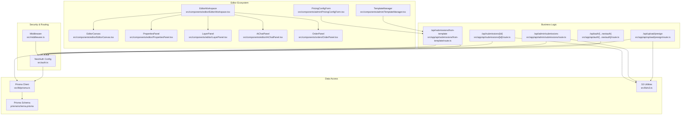

**Diagram sources**
- [src/components/editor/EditorWorkspace.tsx:265-325](file://src/components/editor/EditorWorkspace.tsx#L265-L325)
- [src/components/editor/EditorCanvas.tsx:33-44](file://src/components/editor/EditorCanvas.tsx#L33-L44)
- [src/components/editor/PropertiesPanel.tsx:41-53](file://src/components/editor/PropertiesPanel.tsx#L41-L53)
- [src/components/editor/LayerPanel.tsx:30-40](file://src/components/editor/LayerPanel.tsx#L30-L40)
- [src/components/editor/AiChatPanel.tsx:31-36](file://src/components/editor/AiChatPanel.tsx#L31-L36)
- [src/components/orders/OrderPanel.tsx:43-49](file://src/components/orders/OrderPanel.tsx#L43-L49)
- [src/components/admin/TemplateManager.tsx:17-23](file://src/components/admin/TemplateManager.tsx#L17-L23)
- [src/components/admin/PricingConfigForm.tsx:105-110](file://src/components/admin/PricingConfigForm.tsx#L105-L110)
- [src/app/api/submissions/from-template/route.ts:12-100](file://src/app/api/submissions/from-template/route.ts#L12-L100)

**Section sources**
- [src/app/layout.tsx:1-42](file://src/app/layout.tsx#L1-L42)
- [src/components/Providers.tsx:1-8](file://src/components/Providers.tsx#L1-L8)
- [src/middleware.ts:1-6](file://src/middleware.ts#L1-L6)
- [src/auth.ts:1-80](file://src/auth.ts#L1-L80)
- [src/app/api/auth/[...nextauth]/route.ts](file://src/app/api/auth/[...nextauth]/route.ts#L1-L4)
- [src/lib/prisma.ts:1-10](file://src/lib/prisma.ts#L1-L10)
- [prisma/schema.prisma:1-48](file://prisma/schema.prisma#L1-L48)
- [src/lib/s3.ts:1-81](file://src/lib/s3.ts#L1-L81)
- [src/lib/constants.ts:1-49](file://src/lib/constants.ts#L1-L49)
- [src/app/(auth)/login/page.tsx](file://src/app/(auth)/login/page.tsx#L1-L13)
- [src/app/(protected)/dashboard/page.tsx](file://src/app/(protected)/dashboard/page.tsx#L1-L20)
- [src/app/(protected)/create/page.tsx:1-25](file://src/app/(protected)/create/page.tsx#L1-L25)
- [src/app/api/admin/submissions/route.ts:1-38](file://src/app/api/admin/submissions/route.ts#L1-L38)
- [src/app/api/upload/presign/route.ts:1-38](file://src/app/api/upload/presign/route.ts#L1-L38)
- [src/app/api/submissions/[id]/route.ts](file://src/app/api/submissions/[id]/route.ts#L1-L37)
- [src/components/create/ImageUploader.tsx:1-148](file://src/components/create/ImageUploader.tsx#L1-L148)

## Core Components
The architecture centers around several key components that work together to provide the editor experience:

- **EditorWorkspace**: The main orchestrator component that manages the entire editor lifecycle, including draft creation, template loading, asset management, and state synchronization
- **EditorCanvas**: Interactive canvas built with Konva for rendering and manipulating editor elements with drag-and-drop, transformation, and cropping capabilities
- **PropertiesPanel**: Dynamic property editor for selected elements with specialized handling for template text overrides
- **LayerPanel**: Layer management system that distinguishes between template elements (locked) and user elements (editable)
- **AiChatPanel**: AI-powered assistant that provides creative writing help with streaming responses and actionable suggestions
- **OrderPanel**: Real-time pricing calculator with quantity optimization and shipping cost estimation
- **TemplateManager**: Admin interface for creating, publishing, and managing templates
- **PricingConfigForm**: Configuration interface for pricing tiers, shipping zones, and currency rates

**Section sources**
- [src/components/editor/EditorWorkspace.tsx:265-325](file://src/components/editor/EditorWorkspace.tsx#L265-L325)
- [src/components/editor/EditorCanvas.tsx:33-44](file://src/components/editor/EditorCanvas.tsx#L33-L44)
- [src/components/editor/PropertiesPanel.tsx:41-53](file://src/components/editor/PropertiesPanel.tsx#L41-L53)
- [src/components/editor/LayerPanel.tsx:30-40](file://src/components/editor/LayerPanel.tsx#L30-L40)
- [src/components/editor/AiChatPanel.tsx:31-36](file://src/components/editor/AiChatPanel.tsx#L31-L36)
- [src/components/orders/OrderPanel.tsx:43-49](file://src/components/orders/OrderPanel.tsx#L43-L49)
- [src/components/admin/TemplateManager.tsx:17-23](file://src/components/admin/TemplateManager.tsx#L17-L23)
- [src/components/admin/PricingConfigForm.tsx:105-110](file://src/components/admin/PricingConfigForm.tsx#L105-L110)

## Architecture Overview
The system employs a comprehensive layered architecture centered around the EditorWorkspace ecosystem:

- **Presentation layer**: Advanced React components with sophisticated state management and real-time collaboration features
- **Business logic layer**: API routes handling complex operations like template instantiation, pricing calculations, and AI interactions
- **Data access layer**: Prisma ORM managing relational data with specialized schemas for editor scenes and template elements
- **Integration layer**: S3 utilities for asset management and external service integrations

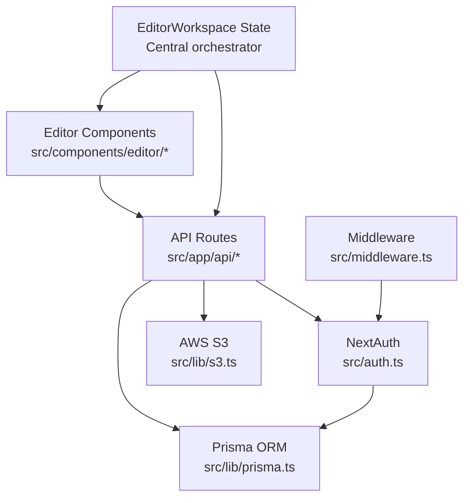

**Diagram sources**
- [src/components/editor/EditorWorkspace.tsx:265-325](file://src/components/editor/EditorWorkspace.tsx#L265-L325)
- [src/app/api/submissions/from-template/route.ts:12-100](file://src/app/api/submissions/from-template/route.ts#L12-L100)
- [src/app/api/upload/presign/route.ts:1-38](file://src/app/api/upload/presign/route.ts#L1-L38)
- [src/app/api/admin/submissions/route.ts:1-38](file://src/app/api/admin/submissions/route.ts#L1-L38)
- [src/app/api/submissions/[id]/route.ts](file://src/app/api/submissions/[id]/route.ts#L1-L37)
- [src/auth.ts:27-79](file://src/auth.ts#L27-L79)
- [src/lib/prisma.ts:1-10](file://src/lib/prisma.ts#L1-L10)
- [src/lib/s3.ts:1-81](file://src/lib/s3.ts#L1-L81)
- [src/middleware.ts:1-6](file://src/middleware.ts#L1-L6)

## Detailed Component Analysis

### Layered Architecture and Component Hierarchy
The EditorWorkspace serves as the central orchestrator, coordinating multiple specialized components:

- **Root layout** composes Providers to enable session management across the entire application
- **EditorWorkspace** manages the complete editor lifecycle including draft creation, template loading, and state synchronization
- **Component hierarchy** flows from EditorWorkspace through canvas, panels, and specialized editors
- **State management** includes page scenes, asset records, template elements, and AI context

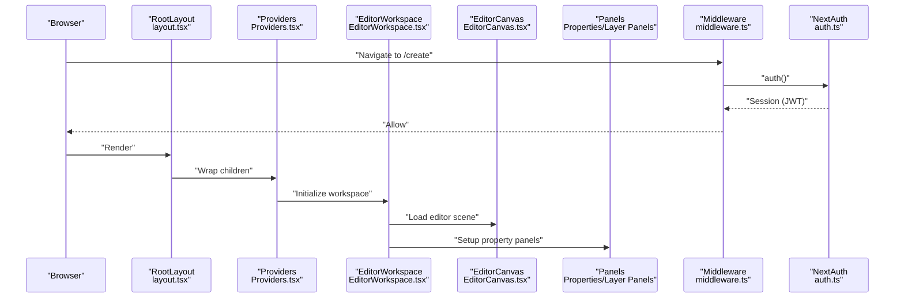

**Diagram sources**
- [src/app/layout.tsx:23-41](file://src/app/layout.tsx#L23-L41)
- [src/components/Providers.tsx:5-7](file://src/components/Providers.tsx#L5-L7)
- [src/app/(protected)/create/page.tsx:1-25](file://src/app/(protected)/create/page.tsx#L1-L25)
- [src/middleware.ts:1-6](file://src/middleware.ts#L1-L6)
- [src/auth.ts:27-79](file://src/auth.ts#L27-L79)

**Section sources**
- [src/app/layout.tsx:23-41](file://src/app/layout.tsx#L23-L41)
- [src/components/Providers.tsx:5-7](file://src/components/Providers.tsx#L5-L7)
- [src/app/(protected)/create/page.tsx:1-25](file://src/app/(protected)/create/page.tsx#L1-L25)
- [src/middleware.ts:1-6](file://src/middleware.ts#L1-L6)
- [src/auth.ts:27-79](file://src/auth.ts#L27-L79)

### Next.js App Router Pattern and Route Groups
Route groups segment functionality with enhanced focus on the editor workflow:
- **(auth)**: Login and registration flows
- **(protected)**: Dashboard, creation flow with EditorWorkspace, and order management
- **(admin)**: Administrative template management and pricing configuration

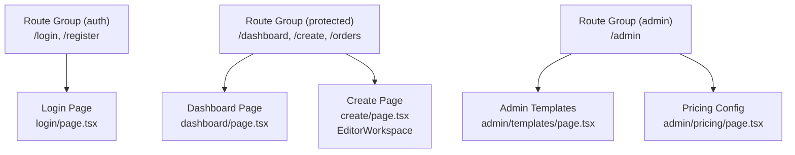

**Diagram sources**
- [src/app/(auth)/login/page.tsx](file://src/app/(auth)/login/page.tsx#L1-L13)
- [src/app/(protected)/dashboard/page.tsx](file://src/app/(protected)/dashboard/page.tsx#L1-L20)
- [src/app/(protected)/create/page.tsx:1-25](file://src/app/(protected)/create/page.tsx#L1-L25)
- [src/app/(admin)/admin/page.tsx](file://src/app/(admin)/admin/page.tsx)

**Section sources**
- [src/app/(auth)/login/page.tsx](file://src/app/(auth)/login/page.tsx#L1-L13)
- [src/app/(protected)/dashboard/page.tsx](file://src/app/(protected)/dashboard/page.tsx#L1-L20)
- [src/app/(protected)/create/page.tsx:1-25](file://src/app/(protected)/create/page.tsx#L1-L25)

### Middleware Implementation for Route Protection
Middleware enforces authentication for protected routes including the editor workspace:
- Exports NextAuth's auth function and matches protected routes
- Blocks unauthorized access before rendering protected pages
- Supports the EditorWorkspace's draft creation and template loading workflows

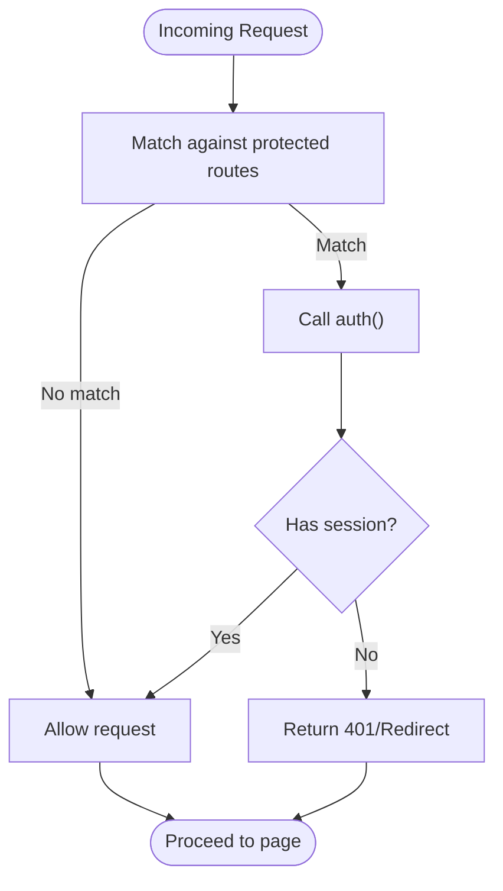

**Diagram sources**
- [src/middleware.ts:1-6](file://src/middleware.ts#L1-L6)
- [src/auth.ts:27-79](file://src/auth.ts#L27-L79)

**Section sources**
- [src/middleware.ts:1-6](file://src/middleware.ts#L1-L6)
- [src/auth.ts:27-79](file://src/auth.ts#L27-L79)

## Editor Workspace Ecosystem
The EditorWorkspace component serves as the central orchestrator for the entire editing experience, managing complex state synchronization and coordination between multiple specialized components.

### Core Responsibilities
- **Draft Management**: Creates and loads editor drafts with automatic recovery from browser storage
- **Template Integration**: Loads and merges template elements with user modifications
- **Asset Coordination**: Manages asset loading, caching, and availability across the workspace
- **State Synchronization**: Coordinates real-time updates between canvas, panels, and backend APIs
- **History Management**: Implements undo/redo functionality with snapshot-based state tracking

### State Management Architecture
The workspace maintains several critical state objects:
- **Submission State**: Tracks current submission metadata, pages, and template associations
- **Asset Records**: Manages loaded assets with download and preview URL resolution
- **Template Elements**: Handles template element loading and merging with user modifications
- **History Tracking**: Maintains undo/redo stacks with page scene snapshots
- **AI Context**: Builds contextual information for AI assistant integration

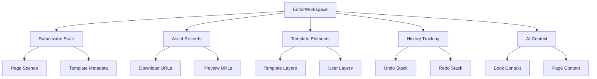

**Diagram sources**
- [src/components/editor/EditorWorkspace.tsx:73-82](file://src/components/editor/EditorWorkspace.tsx#L73-L82)
- [src/components/editor/EditorWorkspace.tsx:44-52](file://src/components/editor/EditorWorkspace.tsx#L44-L52)
- [src/components/editor/EditorWorkspace.tsx:317-324](file://src/components/editor/EditorWorkspace.tsx#L317-L324)
- [src/components/editor/EditorWorkspace.tsx:296-302](file://src/components/editor/EditorWorkspace.tsx#L296-L302)

**Section sources**
- [src/components/editor/EditorWorkspace.tsx:265-325](file://src/components/editor/EditorWorkspace.tsx#L265-L325)
- [src/components/editor/EditorWorkspace.tsx:73-82](file://src/components/editor/EditorWorkspace.tsx#L73-L82)
- [src/components/editor/EditorWorkspace.tsx:44-52](file://src/components/editor/EditorWorkspace.tsx#L44-L52)
- [src/components/editor/EditorWorkspace.tsx:317-324](file://src/components/editor/EditorWorkspace.tsx#L317-L324)
- [src/components/editor/EditorWorkspace.tsx:296-302](file://src/components/editor/EditorWorkspace.tsx#L296-L302)

## Canvas System and Interactive Editing
The EditorCanvas component provides a sophisticated interactive editing environment built on Konva, supporting advanced manipulation of text, images, and shapes with precise control over positioning, styling, and transformations.

### Canvas Architecture
The canvas system implements a layered rendering approach:
- **Template Layer**: Non-interactive elements that serve as the base design framework
- **User Layer**: Fully interactive elements that users can manipulate and customize
- **Selection Overlay**: Visual indicators for selected elements with transformation handles
- **Crop Interface**: Specialized overlay for precise image cropping and positioning

### Interactive Features
Advanced editing capabilities include:
- **Drag-and-Drop**: Precise element positioning with snap-to-grid functionality
- **Transformation Handles**: Resize, rotate, and skew controls with real-time preview
- **Crop Controls**: Image-specific cropping with focal point adjustment and zoom
- **Layer Management**: Z-index manipulation and visibility toggles
- **Keyboard Shortcuts**: Undo/redo operations and element duplication

### Rendering Pipeline
The canvas processes elements through a multi-stage pipeline:
1. **Template Element Processing**: Loads and renders locked template elements
2. **User Element Processing**: Renders editable user elements with interaction capabilities
3. **Selection Processing**: Applies selection styling and transformation handles
4. **Crop Processing**: Adds specialized overlays for image cropping operations

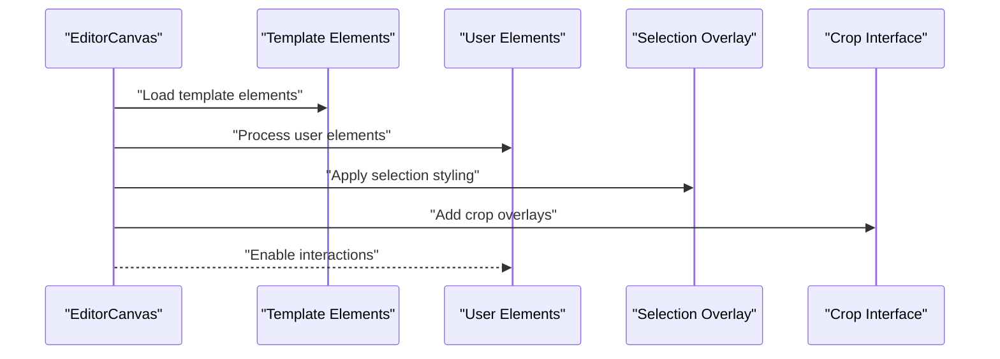

**Diagram sources**
- [src/components/editor/EditorCanvas.tsx:33-44](file://src/components/editor/EditorCanvas.tsx#L33-L44)
- [src/components/editor/EditorCanvas.tsx:709-723](file://src/components/editor/EditorCanvas.tsx#L709-L723)
- [src/components/editor/EditorCanvas.tsx:503-501](file://src/components/editor/EditorCanvas.tsx#L503-L501)

**Section sources**
- [src/components/editor/EditorCanvas.tsx:33-44](file://src/components/editor/EditorCanvas.tsx#L33-L44)
- [src/components/editor/EditorCanvas.tsx:709-723](file://src/components/editor/EditorCanvas.tsx#L709-L723)
- [src/components/editor/EditorCanvas.tsx:503-501](file://src/components/editor/EditorCanvas.tsx#L503-L501)
- [src/components/editor/EditorCanvas.tsx:33-44](file://src/components/editor/EditorCanvas.tsx#L33-L44)

## Template Engine and Instance Management
The template system provides a sophisticated framework for creating reusable design frameworks that can be instantiated into user-specific projects while maintaining design integrity.

### Template Architecture
Templates are structured as specialized Submission records with distinct characteristics:
- **Template Status**: DRAFT or APPROVED states for controlled publication
- **Template Elements**: JSON-encoded editor elements that form the base design
- **Page Structure**: Mirrors the standard page layout with template-specific constraints
- **Instance Tracking**: Counts of active instances derived from the template

### Instance Creation Process
When users create instances from templates, the system performs sophisticated transformations:
1. **Template Validation**: Ensures the template exists, is approved, and has valid page structure
2. **Page Metadata Transfer**: Copies page dimensions and styling from template to instance
3. **Element Initialization**: Creates empty user layers for each page while preserving template metadata
4. **Submission Creation**: Establishes the new instance with proper template associations

### Template Merging Strategy
The system implements a sophisticated merging strategy that preserves design integrity while allowing customization:
- **Template Layer**: Locked elements that cannot be modified by users
- **User Layer**: Editable elements that users can manipulate freely
- **Layer Priority**: Template elements rendered beneath user elements
- **Interaction Rules**: Different interaction behaviors based on layer membership

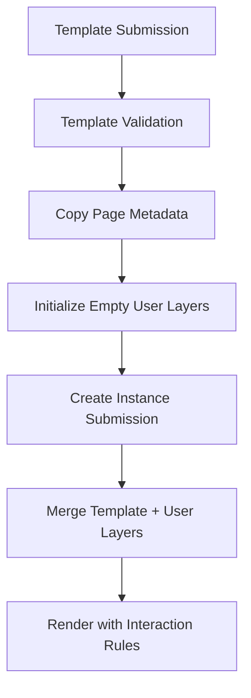

**Diagram sources**
- [src/app/api/submissions/from-template/route.ts:32-43](file://src/app/api/submissions/from-template/route.ts#L32-L43)
- [src/app/api/submissions/from-template/route.ts:45-66](file://src/app/api/submissions/from-template/route.ts#L45-L66)
- [src/lib/editor/template-merge.ts:17-33](file://src/lib/editor/template-merge.ts#L17-L33)

**Section sources**
- [src/app/api/submissions/from-template/route.ts:12-100](file://src/app/api/submissions/from-template/route.ts#L12-L100)
- [src/lib/editor/template-merge.ts:17-33](file://src/lib/editor/template-merge.ts#L17-L33)
- [src/lib/editor/template-types.ts:95-102](file://src/lib/editor/template-types.ts#L95-L102)
- [src/lib/editor/constants.ts:1-21](file://src/lib/editor/constants.ts#L1-L21)

## Pricing Calculation System
The pricing system provides sophisticated real-time cost estimation with volume discounts, shipping calculations, and optimization recommendations.

### Pricing Engine Architecture
The pricing engine operates on a pure-functional design with comprehensive mathematical calculations:
- **Volume Discounts**: Tiered pricing based on quantity purchased
- **Shipping Costs**: Zone-based shipping with weight band calculations
- **Handling Fees**: Percentage and fixed-rate handling charges
- **Currency Conversion**: Real-time exchange rate application

### Calculation Workflow
The system processes pricing through multiple stages:
1. **Weight Calculation**: Determines total shipment weight based on quantity and book weight
2. **Tier Lookup**: Identifies applicable volume discount tier
3. **Shipping Cost**: Calculates shipping based on destination zone and weight band
4. **Total Calculation**: Combines costs with handling fees and applies discounts
5. **Optimization**: Suggests quantity adjustments for cost savings

### Real-Time Estimation
The OrderPanel provides immediate feedback on pricing changes:
- **Live Updates**: Instant recalculation when quantity or configuration changes
- **Breakpoint Detection**: Highlights optimal quantity points for cost savings
- **Savings Recommendations**: Identifies opportunities to reduce per-unit costs
- **Currency Support**: Multi-currency display with real-time conversion rates

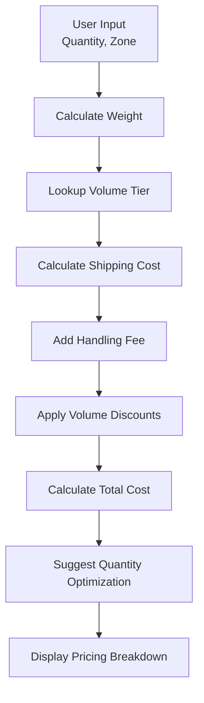

**Diagram sources**
- [src/lib/pricing/engine.ts:137-176](file://src/lib/pricing/engine.ts#L137-L176)
- [src/lib/pricing/engine.ts:203-257](file://src/lib/pricing/engine.ts#L203-L257)
- [src/components/orders/OrderPanel.tsx:51-56](file://src/components/orders/OrderPanel.tsx#L51-L56)

**Section sources**
- [src/lib/pricing/engine.ts:137-176](file://src/lib/pricing/engine.ts#L137-L176)
- [src/lib/pricing/engine.ts:203-257](file://src/lib/pricing/engine.ts#L203-L257)
- [src/lib/pricing/constants.ts:106-131](file://src/lib/pricing/constants.ts#L106-L131)
- [src/components/orders/OrderPanel.tsx:51-56](file://src/components/orders/OrderPanel.tsx#L51-L56)

## AI Assistant Integration
The AI Assistant provides intelligent creative writing support with streaming responses and actionable text suggestions for editor content.

### AI Architecture
The AI system integrates with the editor through a sophisticated chat interface:
- **Context Building**: Extracts relevant information from current editor state
- **Streaming Responses**: Provides real-time text generation with SSE
- **Structured Suggestions**: Returns formatted suggestions with target page assignments
- **Text Sanitization**: Cleans and validates AI-generated content for editor use

### Conversation Flow
The AI assistant processes user requests through multiple stages:
1. **Message Collection**: Gathers conversation history and current editor context
2. **API Request**: Sends structured request to AI service with book context
3. **Stream Processing**: Handles real-time streaming responses with error handling
4. **Response Parsing**: Extracts structured suggestions from AI output
5. **Suggestion Application**: Enables direct application of suggestions to editor

### Integration Points
The AI system integrates seamlessly with the editor workspace:
- **Book Context**: Provides current title, active page, and page content snippets
- **Suggestion Cards**: Visual interface for reviewing and applying AI suggestions
- **Direct Application**: One-click insertion of AI-generated text into target pages
- **Floating Panel**: Non-intrusive interface that can be minimized or expanded

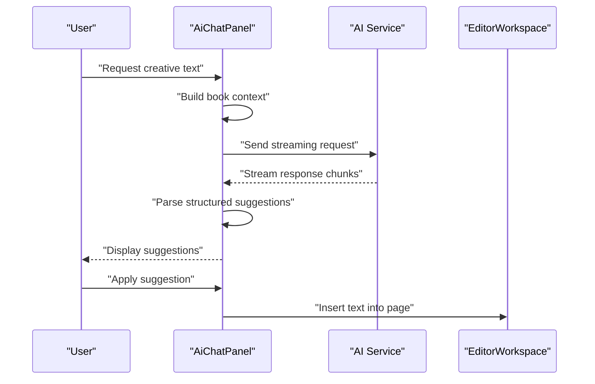

**Diagram sources**
- [src/components/editor/AiChatPanel.tsx:65-186](file://src/components/editor/AiChatPanel.tsx#L65-L186)
- [src/components/editor/AiChatPanel.tsx:195-202](file://src/components/editor/AiChatPanel.tsx#L195-L202)

**Section sources**
- [src/components/editor/AiChatPanel.tsx:31-36](file://src/components/editor/AiChatPanel.tsx#L31-L36)
- [src/components/editor/AiChatPanel.tsx:65-186](file://src/components/editor/AiChatPanel.tsx#L65-L186)
- [src/components/editor/AiChatPanel.tsx:195-202](file://src/components/editor/AiChatPanel.tsx#L195-L202)

## Asset Management Infrastructure
The asset management system provides comprehensive handling of user-uploaded images with sophisticated URL generation and caching strategies.

### Asset Lifecycle
The system manages assets through multiple stages:
- **Upload Generation**: Creates pre-signed URLs for direct S3 uploads
- **Metadata Storage**: Records asset information in database with dimensions and MIME types
- **URL Resolution**: Provides both download and preview URLs for different use cases
- **Caching Strategy**: Optimizes asset loading with browser caching and CDN integration

### Pre-Signed URL System
The upload system implements a secure token-based approach:
- **Temporary Access**: Generates time-limited URLs for direct S3 uploads
- **Validation**: Ensures proper file type and size constraints before upload
- **Security**: Restricts access based on user permissions and intended use
- **Cleanup**: Automatic cleanup of unused temporary uploads

### Asset Integration
Assets integrate throughout the editor ecosystem:
- **Canvas Loading**: Direct URL loading for real-time preview and editing
- **Template Assets**: Template-specific assets loaded for template layer rendering
- **Thumbnail Generation**: Automatic thumbnail creation for asset browsing
- **Usage Tracking**: Monitors asset usage across templates and instances

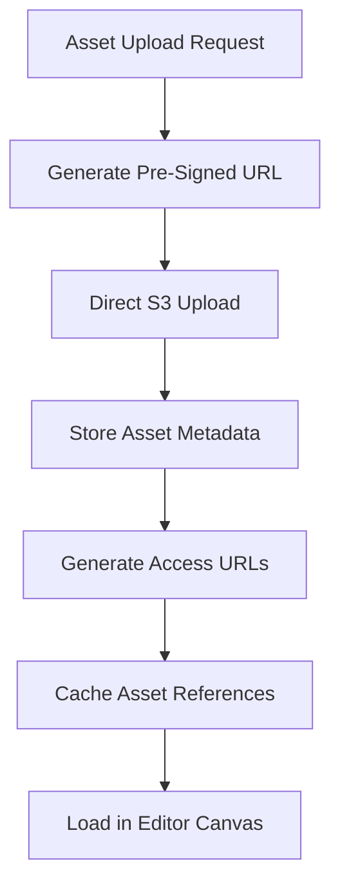

**Diagram sources**
- [src/app/api/upload/presign/route.ts:6-37](file://src/app/api/upload/presign/route.ts#L6-L37)
- [src/lib/s3.ts:18-28](file://src/lib/s3.ts#L18-L28)
- [src/components/editor/EditorWorkspace.tsx:401-417](file://src/components/editor/EditorWorkspace.tsx#L401-L417)

**Section sources**
- [src/app/api/upload/presign/route.ts:1-38](file://src/app/api/upload/presign/route.ts#L1-L38)
- [src/lib/s3.ts:1-81](file://src/lib/s3.ts#L1-L81)
- [src/components/editor/EditorWorkspace.tsx:401-417](file://src/components/editor/EditorWorkspace.tsx#L401-L417)

## Admin and Template Management
The administrative interface provides comprehensive tools for managing templates, pricing configurations, and system-wide settings.

### Template Management Features
Administrators can perform sophisticated template operations:
- **Template Creation**: Create new templates with predefined page structures
- **Template Publishing**: Approve templates for user instantiation
- **Template Deletion**: Remove templates with instance count validation
- **Template Browsing**: Filter and search templates by status and metadata

### Pricing Configuration
The pricing system provides granular control over commercial parameters:
- **Volume Tiers**: Configure discount thresholds and pricing per copy
- **Shipping Zones**: Define regional shipping costs and weight bands
- **Currency Rates**: Set real-time exchange rates for international customers
- **Handling Fees**: Configure percentage and fixed-rate handling charges

### Administrative Workflows
The admin system supports complex workflows:
- **Template Approval**: Review and approve template submissions
- **Pricing Updates**: Deploy pricing changes with validation and testing
- **System Monitoring**: Track template usage and pricing effectiveness
- **User Management**: Monitor template creators and instance owners

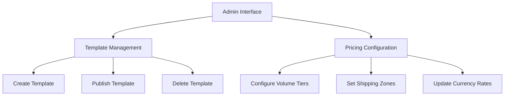

**Diagram sources**
- [src/components/admin/TemplateManager.tsx:41-67](file://src/components/admin/TemplateManager.tsx#L41-L67)
- [src/components/admin/PricingConfigForm.tsx:105-137](file://src/components/admin/PricingConfigForm.tsx#L105-L137)

**Section sources**
- [src/components/admin/TemplateManager.tsx:17-23](file://src/components/admin/TemplateManager.tsx#L17-L23)
- [src/components/admin/PricingConfigForm.tsx:105-137](file://src/components/admin/PricingConfigForm.tsx#L105-L137)
- [src/app/api/admin/submissions/route.ts:1-38](file://src/app/api/admin/submissions/route.ts#L1-L38)

## Dependency Analysis
The editor ecosystem creates a complex web of dependencies that require careful management:

- **EditorWorkspace** depends on:
  - EditorCanvas for rendering and interaction
  - PropertiesPanel and LayerPanel for element manipulation
  - AiChatPanel for creative assistance
  - OrderPanel for pricing calculations
  - TemplateManager and PricingConfigForm for administrative features
- **API routes** depend on:
  - NextAuth for session validation
  - Prisma for data access
  - S3 utilities for asset operations
  - Template processing libraries for template operations
- **Middleware** depends on NextAuth for access control

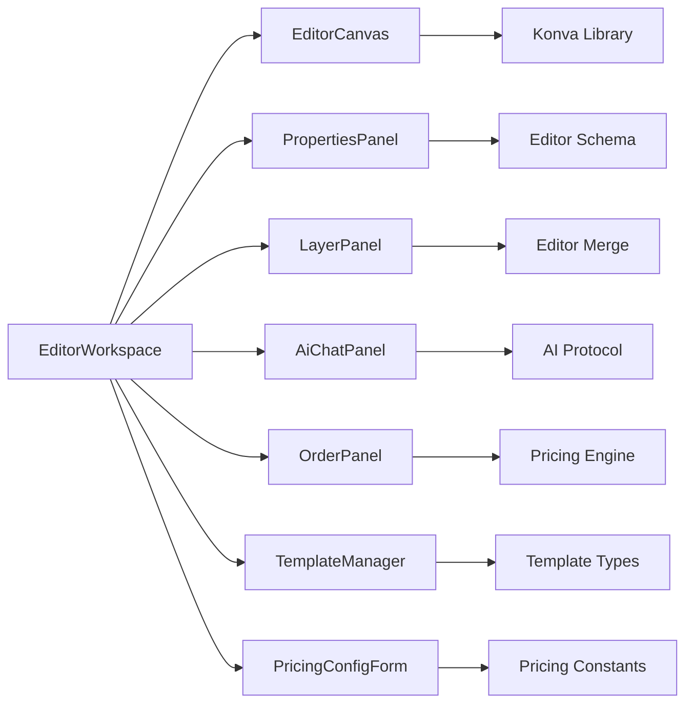

**Diagram sources**
- [src/components/editor/EditorWorkspace.tsx:265-325](file://src/components/editor/EditorWorkspace.tsx#L265-L325)
- [src/components/editor/EditorCanvas.tsx:14-17](file://src/components/editor/EditorCanvas.tsx#L14-L17)
- [src/components/editor/PropertiesPanel.tsx:7-8](file://src/components/editor/PropertiesPanel.tsx#L7-L8)
- [src/components/editor/LayerPanel.tsx:3-4](file://src/components/editor/LayerPanel.tsx#L3-L4)
- [src/components/editor/AiChatPanel.tsx:11-12](file://src/components/editor/AiChatPanel.tsx#L11-L12)
- [src/components/orders/OrderPanel.tsx:21-29](file://src/components/orders/OrderPanel.tsx#L21-L29)
- [src/components/admin/TemplateManager.tsx:3-5](file://src/components/admin/TemplateManager.tsx#L3-L5)
- [src/components/admin/PricingConfigForm.tsx:105-110](file://src/components/admin/PricingConfigForm.tsx#L105-L110)

**Section sources**
- [src/components/editor/EditorWorkspace.tsx:265-325](file://src/components/editor/EditorWorkspace.tsx#L265-L325)
- [src/components/editor/EditorCanvas.tsx:14-17](file://src/components/editor/EditorCanvas.tsx#L14-L17)
- [src/components/editor/PropertiesPanel.tsx:7-8](file://src/components/editor/PropertiesPanel.tsx#L7-L8)
- [src/components/editor/LayerPanel.tsx:3-4](file://src/components/editor/LayerPanel.tsx#L3-L4)
- [src/components/editor/AiChatPanel.tsx:11-12](file://src/components/editor/AiChatPanel.tsx#L11-L12)
- [src/components/orders/OrderPanel.tsx:21-29](file://src/components/orders/OrderPanel.tsx#L21-L29)
- [src/components/admin/TemplateManager.tsx:3-5](file://src/components/admin/TemplateManager.tsx#L3-L5)
- [src/components/admin/PricingConfigForm.tsx:105-110](file://src/components/admin/PricingConfigForm.tsx#L105-L110)

## Performance Considerations
The editor ecosystem implements several performance optimizations:

- **Canvas Optimization**: Konva-based rendering with efficient element caching and selective redraws
- **State Management**: Memoized computations and selective re-renders to minimize DOM updates
- **Asset Loading**: Pre-signed URLs eliminate server bandwidth for large media files
- **Template Merging**: Efficient layer merging with minimal object allocation
- **Pricing Caching**: Client-side caching of pricing calculations with debounced updates
- **AI Streaming**: Server-sent events for real-time response delivery without blocking UI
- **History Management**: Snapshot-based undo/redo with configurable history depth

## Troubleshooting Guide
Common issues and resolutions for the editor ecosystem:

### Editor Workspace Issues
- **Draft Creation Failures**: Verify NextAuth session and Prisma database connectivity
- **Template Loading Errors**: Check template approval status and page structure validity
- **Asset Loading Problems**: Validate S3 bucket permissions and pre-signed URL generation
- **Canvas Rendering Issues**: Ensure Konva library loads correctly and element schemas are valid

### AI Assistant Problems
- **Streaming Connection Issues**: Check network connectivity and SSE endpoint accessibility
- **Response Parsing Errors**: Validate AI service response format and content sanitization
- **Context Building Failures**: Ensure editor state is properly serialized for AI consumption

### Pricing Calculation Errors
- **Invalid Quantity Values**: Verify quantity falls within configured pricing tiers
- **Zone Configuration Issues**: Check shipping table setup and weight band definitions
- **Currency Rate Problems**: Validate exchange rate updates and conversion calculations

### Template Management Issues
- **Template Creation Failures**: Verify template schema validation and page metadata
- **Instance Creation Errors**: Check template approval status and page structure compatibility
- **Template Publishing Problems**: Ensure template has valid elements and proper metadata

**Section sources**
- [src/components/editor/EditorWorkspace.tsx:684-692](file://src/components/editor/EditorWorkspace.tsx#L684-L692)
- [src/components/editor/AiChatPanel.tsx:173-185](file://src/components/editor/AiChatPanel.tsx#L173-L185)
- [src/lib/pricing/engine.ts:137-176](file://src/lib/pricing/engine.ts#L137-L176)
- [src/app/api/submissions/from-template/route.ts:38-43](file://src/app/api/submissions/from-template/route.ts#L38-L43)

## Conclusion
Titchybook Creator's architecture represents a sophisticated evolution from a simple image upload application to a comprehensive editor platform. The EditorWorkspace ecosystem provides a robust foundation for advanced collaborative editing, while the integrated template system, AI assistance, and pricing engine deliver professional-grade functionality. The architecture successfully balances performance, scalability, and user experience through careful component orchestration, efficient state management, and strategic use of modern web technologies. This foundation enables continued innovation in digital publishing workflows while maintaining reliability and maintainability.