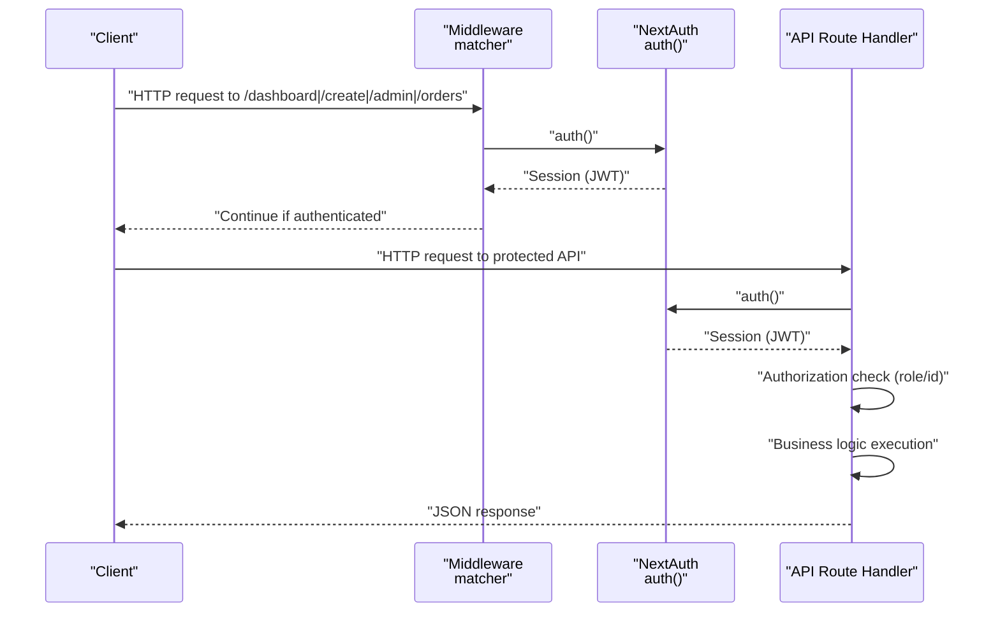
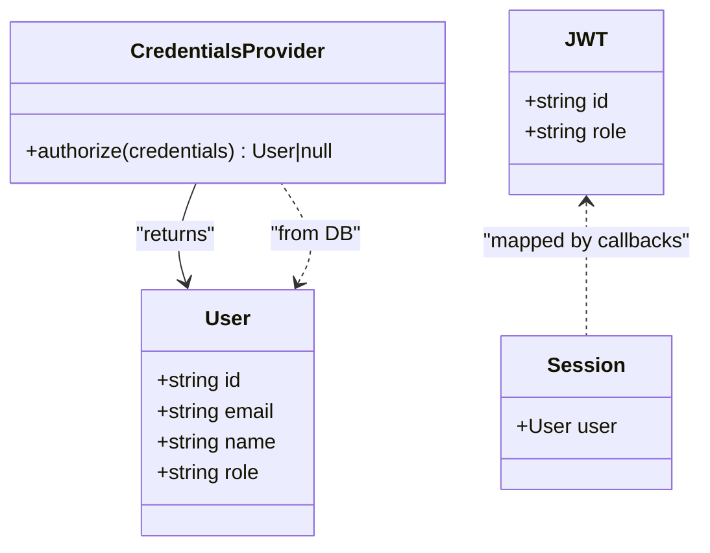
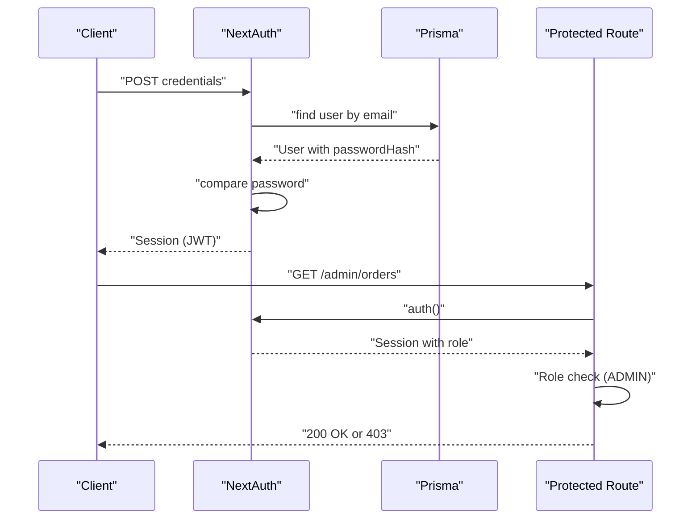
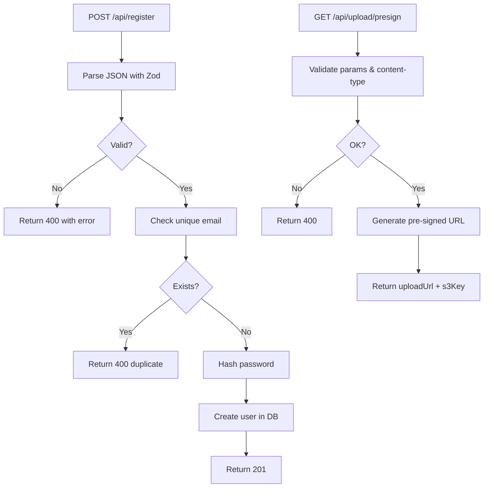
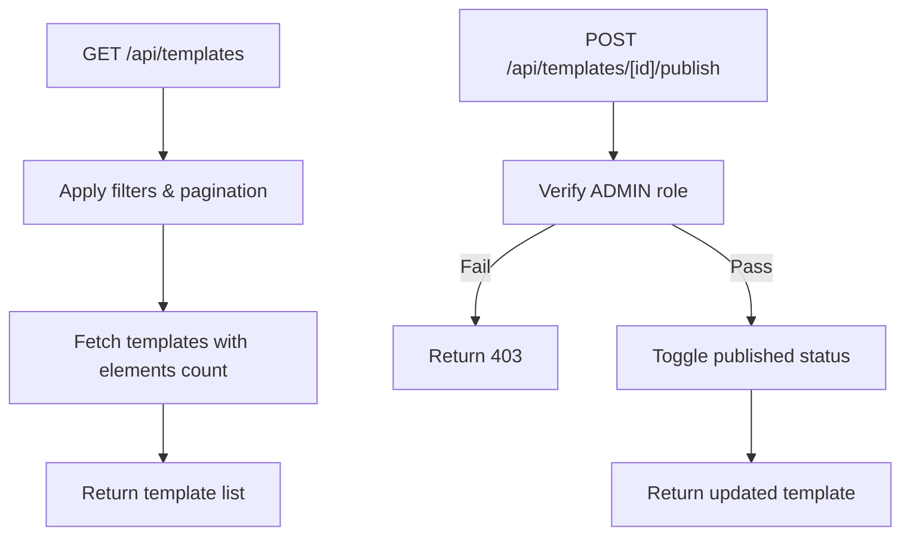
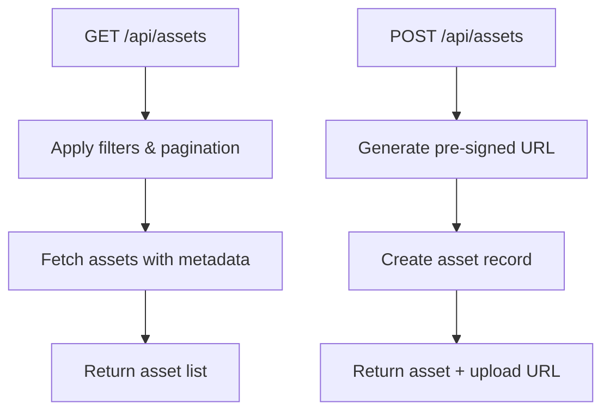
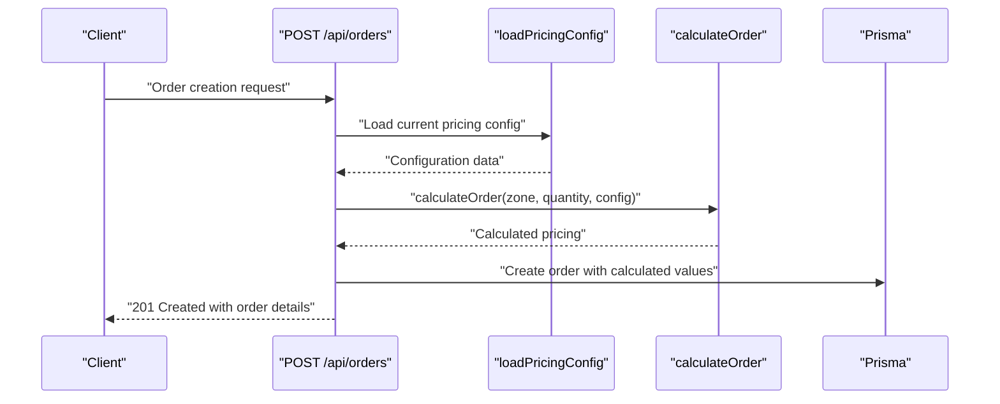
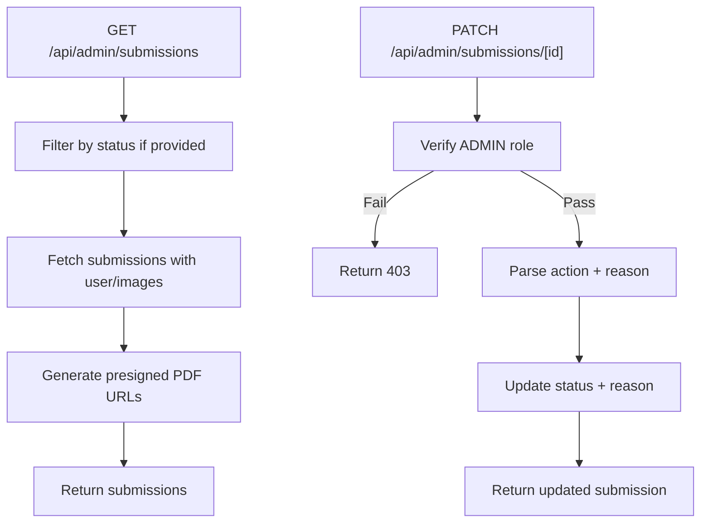
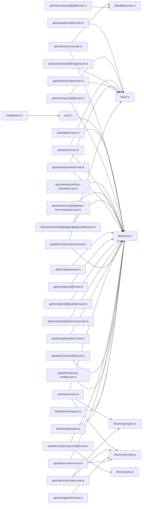

# Backend Architecture

<cite>
**Referenced Files in This Document**
- [middleware.ts](file://src/middleware.ts)
- [auth.ts](file://src/auth.ts)
- [prisma.ts](file://src/lib/prisma.ts)
- [s3.ts](file://src/lib/s3.ts)
- [generate.ts](file://src/lib/pdf/generate.ts)
- [constants.ts](file://src/lib/constants.ts)
- [package.json](file://package.json)
- [next.config.ts](file://next.config.ts)
- [api/admin/submissions/route.ts](file://src/app/api/admin/submissions/route.ts)
- [api/admin/submissions/[id]/route.ts](file://src/app/api/admin/submissions/[id]/route.ts)
- [api/submissions/route.ts](file://src/app/api/submissions/route.ts)
- [api/submissions/[id]/route.ts](file://src/app/api/submissions/[id]/route.ts)
- [api/submissions/[id]/pdf/route.ts](file://src/app/api/submissions/[id]/pdf/route.ts)
- [api/register/route.ts](file://src/app/api/register/route.ts)
- [api/upload/presign/route.ts](file://src/app/api/upload/presign/route.ts)
- [api/orders/route.ts](file://src/app/api/orders/route.ts)
- [api/orders/calculate/route.ts](file://src/app/api/orders/calculate/route.ts)
- [api/submissions/from-template/route.ts](file://src/app/api/submissions/from-template/route.ts)
- [api/submissions/[id]/detach-from-template/route.ts](file://src/app/api/submissions/[id]/detach-from-template/route.ts)
- [api/submissions/[id]/pages/[pageLabel]/route.ts](file://src/app/api/submissions/[id]/pages/[pageLabel]/route.ts)
- [api/assets/route.ts](file://src/app/api/assets/route.ts)
- [api/assets/[assetId]/route.ts](file://src/app/api/assets/[assetId]/route.ts)
- [api/assets/[assetId]/image/route.ts](file://src/app/api/assets/[assetId]/image/route.ts)
- [api/assets/presign/route.ts](file://src/app/api/assets/presign/route.ts)
- [api/templates/route.ts](file://src/app/api/templates/route.ts)
- [api/templates/[id]/route.ts](file://src/app/api/templates/[id]/route.ts)
- [api/templates/[id]/publish/route.ts](file://src/app/api/templates/[id]/publish/route.ts)
- [api/templates/[id]/elements/route.ts](file://src/app/api/templates/[id]/elements/route.ts)
- [api/templates/public/route.ts](file://src/app/api/templates/public/route.ts)
- [api/pricing/public/route.ts](file://src/app/api/pricing/public/route.ts)
- [api/admin/pricing-config/route.ts](file://src/app/api/admin/pricing-config/route.ts)
- [api/admin/orders/route.ts](file://src/app/api/admin/orders/route.ts)
- [api/admin/orders/[id]/route.ts](file://src/app/api/admin/orders/[id]/route.ts)
- [lib/pricing/config.ts](file://src/lib/pricing/config.ts)
- [lib/pricing/engine.ts](file://src/lib/pricing/engine.ts)
- [lib/pricing/schema.ts](file://src/lib/pricing/schema.ts)
- [lib/pricing/currency.ts](file://src/lib/pricing/currency.ts)
- [lib/editor/workspace.ts](file://src/lib/editor/workspace.ts)
- [lib/editor/elements.ts](file://src/lib/editor/elements.ts)
- [types/index.ts](file://src/types/index.ts)
</cite>

## Update Summary
**Changes Made**
- Added comprehensive documentation for new order processing system with pricing calculation
- Documented template management system with CRUD operations and publishing workflow
- Added asset management system for media handling with S3 integration
- Expanded editor workspace functionality documentation
- Enhanced admin panel APIs for orders and pricing configuration
- Updated API route structure to reflect new feature areas

## Table of Contents
1. [Introduction](#introduction)
2. [Project Structure](#project-structure)
3. [Core Components](#core-components)
4. [Architecture Overview](#architecture-overview)
5. [Detailed Component Analysis](#detailed-component-analysis)
6. [Dependency Analysis](#dependency-analysis)
7. [Performance Considerations](#performance-considerations)
8. [Security and Compliance](#security-and-compliance)
9. [Troubleshooting Guide](#troubleshooting-guide)
10. [Conclusion](#conclusion)

## Introduction
This document describes the backend architecture of Titchybook Creator, focusing on the serverless API pattern used by Next.js, the middleware-driven route protection, and the NextAuth integration for authentication and session management. The system has evolved to support comprehensive editor workspace functionality, asset management, template system, order processing with dynamic pricing calculation, and administrative controls. It documents the API route structure organized by feature areas, the authentication flow from login to protected route access, and error handling, validation, and response formatting strategies.

## Project Structure
The backend is implemented as Next.js Serverless Functions under the app directory. Routes are grouped by feature areas including authentication, submissions, orders, templates, assets, and administration. The system now includes sophisticated pricing calculation engine, template management with publishing workflows, and comprehensive asset handling capabilities.

```mermaid
graph TB
subgraph "Middleware"
MW["middleware.ts<br/>matcher: /dashboard /create /admin"]
end
subgraph "NextAuth"
NA["auth.ts<br/>JWT session, callbacks, credentials provider"]
end
subgraph "Core Systems"
PRISMA["lib/prisma.ts<br/>PrismaClient"]
S3["lib/s3.ts<br/>AWS S3 client & presigned URLs"]
PDF["lib/pdf/generate.ts<br/>PDF composition"]
CONST["lib/constants.ts<br/>Enums, page labels, types"]
END
subgraph "Editor Workspace"
WORKSPACE["lib/editor/workspace.ts<br/>Canvas state management"]
ELEMENTS["lib/editor/elements.ts<br/>Element operations"]
END
subgraph "Pricing Engine"
PRICE_CFG["lib/pricing/config.ts<br/>Pricing configuration"]
PRICE_ENGINE["lib/pricing/engine.ts<br/>Calculation logic"]
PRICE_SCHEMA["lib/pricing/schema.ts<br/>Validation schemas"]
PRICE_CUR["lib/pricing/currency.ts<br/>Currency rates"]
END
subgraph "API Routes"
AUTH_API["/api/auth/...nextauth<br/>NextAuth handler"]
REG_API["/api/register<br/>POST registration"]
PRESIGN_API["/api/upload/presign<br/>GET pre-signed upload URL"]
SUBS_API["/api/submissions<br/>GET list, POST create"]
SUBS_ID_API["/api/submissions/[id]<br/>GET single, PUT update"]
SUBS_PDF_API["/api/submissions/[id]/pdf<br/>POST regenerate PDF"]
FROM_TEMPLATE["/api/submissions/from-template<br/>POST create from template"]
DETACH_TEMPLATE["/api/submissions/[id]/detach-from-template<br/>POST detach from template"]
PAGE_LABEL["/api/submissions/[id]/pages/[pageLabel]<br/>Page operations"]
ASSETS_API["/api/assets<br/>Asset CRUD operations"]
ASSET_ID_API["/api/assets/[assetId]<br/>Asset management"]
ASSET_IMAGE["/api/assets/[assetId]/image<br/>Image operations"]
ASSET_PRESIGN["/api/assets/presign<br/>Asset upload URLs"]
TEMPLATES_API["/api/templates<br/>Template CRUD"]
TEMPLATE_ID_API["/api/templates/[id]<br/>Template operations"]
TEMPLATE_PUBLISH["/api/templates/[id]/publish<br/>Publish/unpublish"]
TEMPLATE_ELEMENTS["/api/templates/[id]/elements<br/>Element management"]
TEMPLATE_PUBLIC["/api/templates/public<br/>Public templates"]
ORDERS_API["/api/orders<br/>GET list, POST create"]
ORDERS_CALC["/api/orders/calculate<br/>Pricing calculation"]
ADMIN_SUBS_API["/api/admin/submissions<br/>Admin submission management"]
ADMIN_SUBS_ID_API["/api/admin/submissions/[id]<br/>Admin approval/rejection"]
ADMIN_ORDERS_API["/api/admin/orders<br/>Admin order management"]
ADMIN_ORDERS_ID_API["/api/admin/orders/[id]<br/>Admin order updates"]
ADMIN_PRICE_CFG["/api/admin/pricing-config<br/>Admin pricing config"]
PUBLIC_PRICE["/api/pricing/public<br/>Public pricing info"]
end
MW --> AUTH_API
MW --> REG_API
MW --> PRESIGN_API
MW --> SUBS_API
MW --> SUBS_ID_API
MW --> ASSETS_API
MW --> TEMPLATES_API
MW --> ORDERS_API
MW --> ADMIN_SUBS_API
MW --> ADMIN_ORDERS_API
AUTH_API --> NA
REG_API --> PRISMA
PRESIGN_API --> S3
SUBS_API --> PRISMA
SUBS_API --> PDF
SUBS_ID_API --> PRISMA
SUBS_ID_API --> S3
SUBS_PDF_API --> PDF
FROM_TEMPLATE --> PRISMA
DETACH_TEMPLATE --> PRISMA
PAGE_LABEL --> PRISMA
ASSETS_API --> PRISMA
ASSETS_API --> S3
ASSET_ID_API --> PRISMA
ASSET_ID_API --> S3
ASSET_IMAGE --> S3
ASSET_PRESIGN --> S3
TEMPLATES_API --> PRISMA
TEMPLATE_ID_API --> PRISMA
TEMPLATE_PUBLISH --> PRISMA
TEMPLATE_ELEMENTS --> PRISMA
TEMPLATE_PUBLIC --> PRISMA
ORDERS_API --> PRISMA
ORDERS_API --> PRICE_ENGINE
ORDERS_API --> PRICE_CFG
ORDERS_CALC --> PRICE_ENGINE
ORDERS_CALC --> PRICE_CFG
ADMIN_SUBS_API --> PRISMA
ADMIN_SUBS_API --> S3
ADMIN_SUBS_ID_API --> PRISMA
ADMIN_SUBS_ID_API --> CONST
ADMIN_ORDERS_API --> PRISMA
ADMIN_ORDERS_API --> PRICE_CFG
ADMIN_ORDERS_ID_API --> PRISMA
ADMIN_PRICE_CFG --> PRISMA
PUBLIC_PRICE --> PRICE_CFG
```

**Diagram sources**
- [middleware.ts](file://src/middleware.ts)
- [auth.ts](file://src/auth.ts)
- [prisma.ts](file://src/lib/prisma.ts)
- [s3.ts](file://src/lib/s3.ts)
- [generate.ts](file://src/lib/pdf/generate.ts)
- [constants.ts](file://src/lib/constants.ts)
- [editor/workspace.ts](file://src/lib/editor/workspace.ts)
- [editor/elements.ts](file://src/lib/editor/elements.ts)
- [pricing/config.ts](file://src/lib/pricing/config.ts)
- [pricing/engine.ts](file://src/lib/pricing/engine.ts)
- [pricing/schema.ts](file://src/lib/pricing/schema.ts)
- [pricing/currency.ts](file://src/lib/pricing/currency.ts)
- [api/orders/route.ts](file://src/app/api/orders/route.ts)
- [api/orders/calculate/route.ts](file://src/app/api/orders/calculate/route.ts)
- [api/submissions/from-template/route.ts](file://src/app/api/submissions/from-template/route.ts)
- [api/submissions/[id]/detach-from-template/route.ts](file://src/app/api/submissions/[id]/detach-from-template/route.ts)
- [api/submissions/[id]/pages/[pageLabel]/route.ts](file://src/app/api/submissions/[id]/pages/[pageLabel]/route.ts)
- [api/assets/route.ts](file://src/app/api/assets/route.ts)
- [api/assets/[assetId]/route.ts](file://src/app/api/assets/[assetId]/route.ts)
- [api/assets/[assetId]/image/route.ts](file://src/app/api/assets/[assetId]/image/route.ts)
- [api/assets/presign/route.ts](file://src/app/api/assets/presign/route.ts)
- [api/templates/route.ts](file://src/app/api/templates/route.ts)
- [api/templates/[id]/route.ts](file://src/app/api/templates/[id]/route.ts)
- [api/templates/[id]/publish/route.ts](file://src/app/api/templates/[id]/publish/route.ts)
- [api/templates/[id]/elements/route.ts](file://src/app/api/templates/[id]/elements/route.ts)
- [api/templates/public/route.ts](file://src/app/api/templates/public/route.ts)
- [api/admin/submissions/route.ts](file://src/app/api/admin/submissions/route.ts)
- [api/admin/submissions/[id]/route.ts](file://src/app/api/admin/submissions/[id]/route.ts)
- [api/admin/orders/route.ts](file://src/app/api/admin/orders/route.ts)
- [api/admin/orders/[id]/route.ts](file://src/app/api/admin/orders/[id]/route.ts)
- [api/admin/pricing-config/route.ts](file://src/app/api/admin/pricing-config/route.ts)
- [api/pricing/public/route.ts](file://src/app/api/pricing/public/route.ts)

## Core Components
- Middleware: Exposes NextAuth's auth function and defines URL matchers for protected routes.
- NextAuth: Configures credentials provider, JWT session strategy, pages, and callbacks to attach user role to tokens and sessions.
- Prisma: Singleton client for database operations with comprehensive schema support for all new systems.
- S3: Presigned URL generation for uploads and downloads, plus direct upload/download helpers for assets.
- PDF Generation: Orchestrates fetching images, processing, composing PDF, uploading to S3, and updating submission records.
- Pricing Engine: Dynamic pricing calculation with configurable zones, quantities, weights, and currency conversion.
- Editor Workspace: Canvas state management and element manipulation for the visual editor.
- Asset Management: Comprehensive CRUD operations for media assets with S3 integration.
- Template System: Full template lifecycle management including creation, editing, publishing, and element management.

**Section sources**
- [middleware.ts](file://src/middleware.ts)
- [auth.ts](file://src/auth.ts)
- [prisma.ts](file://src/lib/prisma.ts)
- [s3.ts](file://src/lib/s3.ts)
- [generate.ts](file://src/lib/pdf/generate.ts)
- [constants.ts](file://src/lib/constants.ts)
- [pricing/config.ts](file://src/lib/pricing/config.ts)
- [pricing/engine.ts](file://src/lib/pricing/engine.ts)
- [editor/workspace.ts](file://src/lib/editor/workspace.ts)
- [editor/elements.ts](file://src/lib/editor/elements.ts)

## Architecture Overview
The system follows a serverless API pattern with Next.js App Router. Requests are routed to route.ts handlers under src/app/api. Middleware enforces authentication for specific paths, while per-route handlers enforce authorization (roles) and perform domain logic. The architecture now supports complex business logic through specialized engines and services, with clear separation between presentation, business logic, and data access layers.



**Diagram sources**
- [middleware.ts](file://src/middleware.ts)
- [auth.ts](file://src/auth.ts)
- [orders/route.ts](file://src/app/api/orders/route.ts)
- [admin/submissions/route.ts](file://src/app/api/admin/submissions/route.ts)

## Detailed Component Analysis

### Middleware System and Route Protection
- Purpose: Apply authentication guard to route groups (/dashboard, /create, /admin).
- Behavior: Uses NextAuth's exported auth function; matcher array controls which paths are intercepted.
- Integration: Ensures unauthenticated clients are redirected or blocked by downstream handlers.


**Diagram sources**
- [middleware.ts](file://src/middleware.ts)
- [auth.ts](file://src/auth.ts)

**Section sources**
- [middleware.ts](file://src/middleware.ts)

### NextAuth Integration and Session Management
- Provider: Credentials provider validates email/password against hashed passwords stored in the database.
- Session Strategy: JWT; token carries user id and role; session mirrors token payload.
- Callbacks: jwt callback attaches id and role to the token; session callback injects id and role into session.user.
- Pages: Sign-in page mapped to /login.



**Diagram sources**
- [auth.ts](file://src/auth.ts)
- [prisma.ts](file://src/lib/prisma.ts)

**Section sources**
- [auth.ts](file://src/auth.ts)

### Authentication Flow: Login to Protected Routes
- Login: Client submits credentials to NextAuth endpoint; provider authorizes and returns user.
- Session: NextAuth stores JWT; subsequent requests include session cookie/token.
- Protected Access: Middleware and route handlers call auth(); handlers enforce role checks (e.g., ADMIN).



**Diagram sources**
- [auth.ts](file://src/auth.ts)
- [admin/orders/route.ts](file://src/app/api/admin/orders/route.ts)

**Section sources**
- [auth.ts](file://src/auth.ts)
- [admin/orders/route.ts](file://src/app/api/admin/orders/route.ts)

### API Route Structure by Feature Areas

#### Authentication and Registration
- POST /api/register: Validates input with Zod, checks uniqueness, hashes password, creates user.
- GET /api/upload/presign: Generates pre-signed upload URL for S3; validates required parameters and content type.



**Diagram sources**
- [register/route.ts](file://src/app/api/register/route.ts)
- [upload/presign/route.ts](file://src/app/api/upload/presign/route.ts)

**Section sources**
- [register/route.ts](file://src/app/api/register/route.ts)
- [upload/presign/route.ts](file://src/app/api/upload/presign/route.ts)

#### Submissions (Authenticated Users)
- GET /api/submissions: Lists current user's submissions.
- POST /api/submissions: Creates a new submission with validated image entries; triggers asynchronous PDF generation.
- GET /api/submissions/[id]: Retrieves a single submission; enforces ownership or ADMIN role.
- POST /api/submissions/[id]/pdf: Regenerates PDF for a submission.
- POST /api/submissions/from-template: Creates a new submission from a template.
- POST /api/submissions/[id]/detach-from-template: Detaches a submission from its template.
- POST /api/submissions/[id]/pages/[pageLabel]: Manages individual page operations.


**Diagram sources**
- [submissions/route.ts](file://src/app/api/submissions/route.ts)
- [generate.ts](file://src/lib/pdf/generate.ts)

**Section sources**
- [submissions/route.ts](file://src/app/api/submissions/route.ts)
- [submissions/[id]/route.ts](file://src/app/api/submissions/[id]/route.ts)
- [submissions/[id]/pdf/route.ts](file://src/app/api/submissions/[id]/pdf/route.ts)
- [submissions/from-template/route.ts](file://src/app/api/submissions/from-template/route.ts)
- [submissions/[id]/detach-from-template/route.ts](file://src/app/api/submissions/[id]/detach-from-template/route.ts)
- [submissions/[id]/pages/[pageLabel]/route.ts](file://src/app/api/submissions/[id]/pages/[pageLabel]/route.ts)

#### Templates (Template Management System)
- GET /api/templates: Lists user's templates with filtering options.
- POST /api/templates: Creates a new template from submission or blank canvas.
- GET /api/templates/[id]: Retrieves template details with elements.
- PUT /api/templates/[id]: Updates template metadata and settings.
- DELETE /api/templates/[id]: Deletes template with cascade protection.
- POST /api/templates/[id]/publish: Publishes or unpublishes template.
- GET /api/templates/[id]/elements: Lists template elements.
- POST /api/templates/[id]/elements: Adds element to template.
- GET /api/templates/public: Lists public templates for browsing.



**Diagram sources**
- [templates/route.ts](file://src/app/api/templates/route.ts)
- [templates/[id]/publish/route.ts](file://src/app/api/templates/[id]/publish/route.ts)

**Section sources**
- [templates/route.ts](file://src/app/api/templates/route.ts)
- [templates/[id]/route.ts](file://src/app/api/templates/[id]/route.ts)
- [templates/[id]/publish/route.ts](file://src/app/api/templates/[id]/publish/route.ts)
- [templates/[id]/elements/route.ts](file://src/app/api/templates/[id]/elements/route.ts)
- [templates/public/route.ts](file://src/app/api/templates/public/route.ts)

#### Assets (Media Management)
- GET /api/assets: Lists user's assets with filtering and pagination.
- POST /api/assets: Creates asset record and returns pre-signed upload URL.
- GET /api/assets/[assetId]: Retrieves asset metadata and status.
- PUT /api/assets/[assetId]: Updates asset metadata.
- DELETE /api/assets/[assetId]: Deletes asset and S3 object.
- GET /api/assets/[assetId]/image: Returns S3 object URL for download.
- GET /api/assets/presign: Generates pre-signed URL for asset upload.



**Diagram sources**
- [assets/route.ts](file://src/app/api/assets/route.ts)
- [assets/[assetId]/route.ts](file://src/app/api/assets/[assetId]/route.ts)
- [assets/presign/route.ts](file://src/app/api/assets/presign/route.ts)

**Section sources**
- [assets/route.ts](file://src/app/api/assets/route.ts)
- [assets/[assetId]/route.ts](file://src/app/api/assets/[assetId]/route.ts)
- [assets/[assetId]/image/route.ts](file://src/app/api/assets/[assetId]/image/route.ts)
- [assets/presign/route.ts](file://src/app/api/assets/presign/route.ts)

#### Orders and Pricing (Order Processing System)
- GET /api/orders: Lists user's orders with submission details.
- POST /api/orders: Creates order from approved submission with pricing calculation.
- POST /api/orders/calculate: Calculates pricing for potential order without creating it.
- GET /api/pricing/public: Returns current pricing configuration for client-side calculations.
- Admin APIs: Comprehensive order management and pricing configuration for administrators.



**Diagram sources**
- [orders/route.ts](file://src/app/api/orders/route.ts)
- [orders/calculate/route.ts](file://src/app/api/orders/calculate/route.ts)
- [pricing/config.ts](file://src/lib/pricing/config.ts)
- [pricing/engine.ts](file://src/lib/pricing/engine.ts)

**Section sources**
- [orders/route.ts](file://src/app/api/orders/route.ts)
- [orders/calculate/route.ts](file://src/app/api/orders/calculate/route.ts)
- [pricing/public/route.ts](file://src/app/api/pricing/public/route.ts)
- [admin/pricing-config/route.ts](file://src/app/api/admin/pricing-config/route.ts)
- [admin/orders/route.ts](file://src/app/api/admin/orders/route.ts)
- [admin/orders/[id]/route.ts](file://src/app/api/admin/orders/[id]/route.ts)

#### Admin (Administrators Only)
- GET /api/admin/submissions: Lists submissions with optional status filter; enriches with presigned PDF URLs.
- PATCH /api/admin/submissions/[id]: Approves or rejects a submission; sets rejection reason when rejected.
- GET /api/admin/orders: Lists all orders with filtering and pagination.
- PATCH /api/admin/orders/[id]: Updates order status and admin notes.
- GET /api/admin/pricing-config: Returns current pricing configuration.
- PUT /api/admin/pricing-config: Updates pricing configuration with validation.



**Diagram sources**
- [admin/submissions/route.ts](file://src/app/api/admin/submissions/route.ts)
- [admin/submissions/[id]/route.ts](file://src/app/api/admin/submissions/[id]/route.ts)
- [admin/orders/route.ts](file://src/app/api/admin/orders/route.ts)
- [admin/orders/[id]/route.ts](file://src/app/api/admin/orders/[id]/route.ts)
- [admin/pricing-config/route.ts](file://src/app/api/admin/pricing-config/route.ts)

**Section sources**
- [admin/submissions/route.ts](file://src/app/api/admin/submissions/route.ts)
- [admin/submissions/[id]/route.ts](file://src/app/api/admin/submissions/[id]/route.ts)
- [admin/orders/route.ts](file://src/app/api/admin/orders/route.ts)
- [admin/orders/[id]/route.ts](file://src/app/api/admin/orders/[id]/route.ts)
- [admin/pricing-config/route.ts](file://src/app/api/admin/pricing-config/route.ts)

### Request Validation and Response Formatting
- Validation: Zod schemas define strict shapes for all endpoints; safeParse returns structured errors.
- Responses: Consistent JSON bodies with either data objects or error messages; appropriate HTTP status codes (200/201/400/401/403/404/500).
- Error Handling: Try/catch blocks wrap async operations; specific branches return 400/404/500 depending on failure mode.
- Pricing Validation: Specialized schemas for order calculation with detailed error reporting.

**Section sources**
- [register/route.ts](file://src/app/api/register/route.ts)
- [submissions/route.ts](file://src/app/api/submissions/route.ts)
- [orders/route.ts](file://src/app/api/orders/route.ts)
- [orders/calculate/route.ts](file://src/app/api/orders/calculate/route.ts)
- [assets/route.ts](file://src/app/api/assets/route.ts)
- [templates/route.ts](file://src/app/api/templates/route.ts)

### Serverless API Pattern in Next.js
- Route Handlers: Each route.ts exports async functions (GET/POST/PATCH) that accept NextRequest/Request and return NextResponse.
- Dynamic Routes: Parameters resolved via params promise; handlers await params to access route segments.
- Environment: Uses Next.js runtime; no traditional server required.
- Business Logic Separation: Complex operations delegated to specialized libraries (pricing, editor, PDF generation).

**Section sources**
- [submissions/[id]/route.ts](file://src/app/api/submissions/[id]/route.ts)
- [admin/submissions/[id]/route.ts](file://src/app/api/admin/submissions/[id]/route.ts)
- [orders/[id]/route.ts](file://src/app/api/orders/[id]/route.ts)
- [templates/[id]/route.ts](file://src/app/api/templates/[id]/route.ts)

## Dependency Analysis
- Middleware depends on NextAuth for session retrieval.
- API routes depend on NextAuth for auth checks, Prisma for persistence, and S3 for media.
- Pricing engine depends on configuration loader and calculation engine.
- Editor workspace depends on element management and canvas state.
- PDF generation depends on Prisma for data and S3 for storage.
- All new systems integrate through shared Prisma models and S3 storage.



**Diagram sources**
- [middleware.ts](file://src/middleware.ts)
- [auth.ts](file://src/auth.ts)
- [prisma.ts](file://src/lib/prisma.ts)
- [s3.ts](file://src/lib/s3.ts)
- [generate.ts](file://src/lib/pdf/generate.ts)
- [constants.ts](file://src/lib/constants.ts)
- [pricing/config.ts](file://src/lib/pricing/config.ts)
- [pricing/engine.ts](file://src/lib/pricing/engine.ts)
- [pricing/schema.ts](file://src/lib/pricing/schema.ts)
- [pricing/currency.ts](file://src/lib/pricing/currency.ts)
- [editor/workspace.ts](file://src/lib/editor/workspace.ts)
- [editor/elements.ts](file://src/lib/editor/elements.ts)
- [orders/route.ts](file://src/app/api/orders/route.ts)
- [orders/calculate/route.ts](file://src/app/api/orders/calculate/route.ts)
- [assets/route.ts](file://src/app/api/assets/route.ts)
- [assets/[assetId]/route.ts](file://src/app/api/assets/[assetId]/route.ts)
- [assets/[assetId]/image/route.ts](file://src/app/api/assets/[assetId]/image/route.ts)
- [assets/presign/route.ts](file://src/app/api/assets/presign/route.ts)
- [templates/route.ts](file://src/app/api/templates/route.ts)
- [templates/[id]/route.ts](file://src/app/api/templates/[id]/route.ts)
- [templates/[id]/publish/route.ts](file://src/app/api/templates/[id]/publish/route.ts)
- [templates/[id]/elements/route.ts](file://src/app/api/templates/[id]/elements/route.ts)
- [templates/public/route.ts](file://src/app/api/templates/public/route.ts)
- [admin/submissions/route.ts](file://src/app/api/admin/submissions/route.ts)
- [admin/submissions/[id]/route.ts](file://src/app/api/admin/submissions/[id]/route.ts)
- [admin/orders/route.ts](file://src/app/api/admin/orders/route.ts)
- [admin/orders/[id]/route.ts](file://src/app/api/admin/orders/[id]/route.ts)
- [admin/pricing-config/route.ts](file://src/app/api/admin/pricing-config/route.ts)
- [pricing/public/route.ts](file://src/app/api/pricing/public/route.ts)

**Section sources**
- [package.json](file://package.json)

## Performance Considerations
- Asynchronous PDF Generation: Background generation avoids blocking API responses; failures logged but do not fail the submission creation.
- Parallel Operations: PDF generation downloads and processes images in parallel to reduce latency.
- Presigned URLs: Offloads uploads/downloads to S3; reduces server bandwidth and CPU usage.
- Transactional Writes: Submission creation uses a single transaction to maintain consistency.
- Pricing Calculation Caching: Configuration loading optimized to minimize repeated database queries.
- Template Element Management: Efficient element querying with proper indexing for large template structures.
- Asset Management: Batch operations for asset CRUD to reduce database round trips.

## Security and Compliance
- Authentication: JWT-based session strategy with NextAuth; credentials provider validates against hashed passwords.
- Authorization: Per-route checks enforce user ownership or ADMIN role.
- Input Validation: Zod schemas validate and sanitize request payloads across all endpoints.
- Content Type Enforcement: Upload endpoints restrict accepted image types and validate file extensions.
- Secrets Management: AWS credentials and bucket configured via environment variables; keep secrets out of client bundles.
- CORS: Not explicitly configured in the provided files; configure at the framework level if cross-origin access is required.
- Rate Limiting: Not implemented in the provided files; consider adding rate limiting at the edge or middleware layer.
- Input Sanitization: Strict schema parsing; reject invalid payloads early with 400 responses.
- Template Security: Template publishing requires ADMIN role; private templates not accessible publicly.
- Pricing Security: Pricing calculations performed server-side to prevent manipulation; currency conversion validated.

**Section sources**
- [auth.ts](file://src/auth.ts)
- [upload/presign/route.ts](file://src/app/api/upload/presign/route.ts)
- [register/route.ts](file://src/app/api/register/route.ts)
- [submissions/route.ts](file://src/app/api/submissions/route.ts)
- [templates/[id]/publish/route.ts](file://src/app/api/templates/[id]/publish/route.ts)
- [orders/route.ts](file://src/app/api/orders/route.ts)

## Troubleshooting Guide
- Unauthorized Access: Ensure auth() is called and session contains user id; verify middleware matcher includes the route.
- Forbidden Access: Confirm ADMIN role for admin endpoints; otherwise, verify ownership for user endpoints.
- Validation Errors: Review Zod error messages returned in the error field; ensure payloads match schemas.
- PDF Generation Failures: Check logs for PDF generation errors; regenerate via POST /api/submissions/[id]/pdf.
- S3 Issues: Verify AWS credentials and bucket name; confirm presigned URL generation succeeds.
- Pricing Calculation Failures: Check pricing configuration validity; verify zone availability and quantity constraints.
- Template Publishing Issues: Ensure template has required elements and meets publishing criteria.
- Asset Upload Problems: Verify asset type restrictions and S3 permissions; check pre-signed URL expiration.
- Order Creation Errors: Confirm submission status is APPROVED and PDF is available before ordering.

**Section sources**
- [submissions/route.ts](file://src/app/api/submissions/route.ts)
- [admin/submissions/route.ts](file://src/app/api/admin/submissions/route.ts)
- [submissions/[id]/route.ts](file://src/app/api/submissions/[id]/route.ts)
- [submissions/[id]/pdf/route.ts](file://src/app/api/submissions/[id]/pdf/route.ts)
- [upload/presign/route.ts](file://src/app/api/upload/presign/route.ts)
- [orders/route.ts](file://src/app/api/orders/route.ts)
- [orders/calculate/route.ts](file://src/app/api/orders/calculate/route.ts)
- [templates/[id]/publish/route.ts](file://src/app/api/templates/[id]/publish/route.ts)
- [assets/presign/route.ts](file://src/app/api/assets/presign/route.ts)

## Conclusion
The backend leverages Next.js serverless functions with a robust middleware and NextAuth integration to protect routes and manage sessions. The architecture has evolved to support comprehensive business logic through specialized engines and services, including dynamic pricing calculation, template management, asset handling, and order processing. API routes are organized by feature areas with strong validation, consistent error handling, and clear authorization checks. Integrations with Prisma and AWS S3 enable scalable persistence and media handling, while asynchronous operations improve responsiveness. Security is enforced through JWT sessions, role-based access control, strict input validation, and server-side pricing calculations.