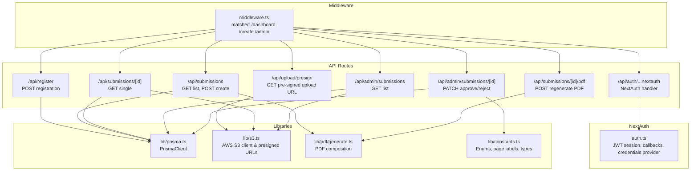
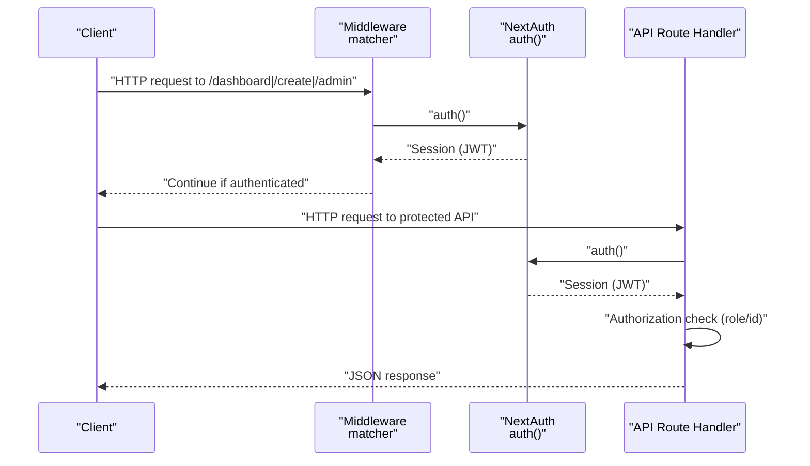
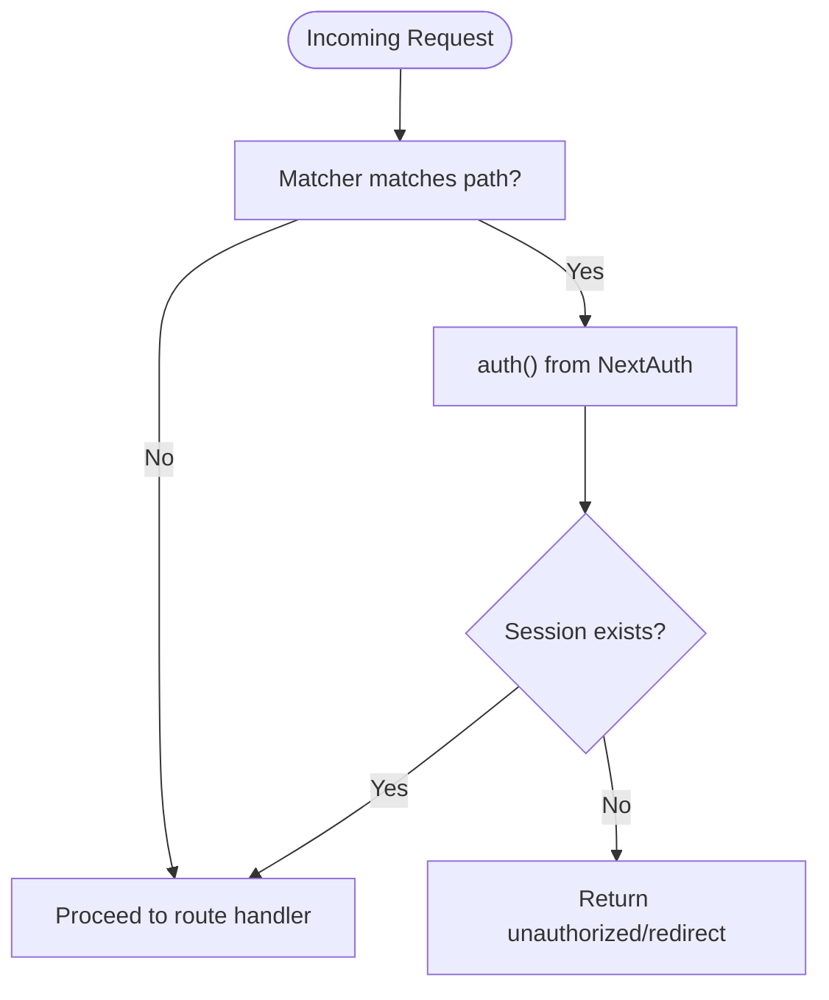
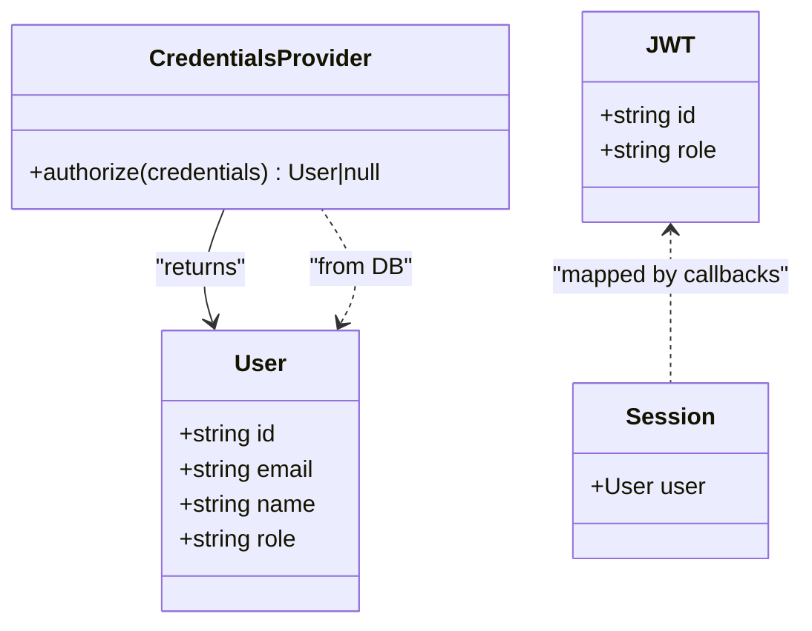
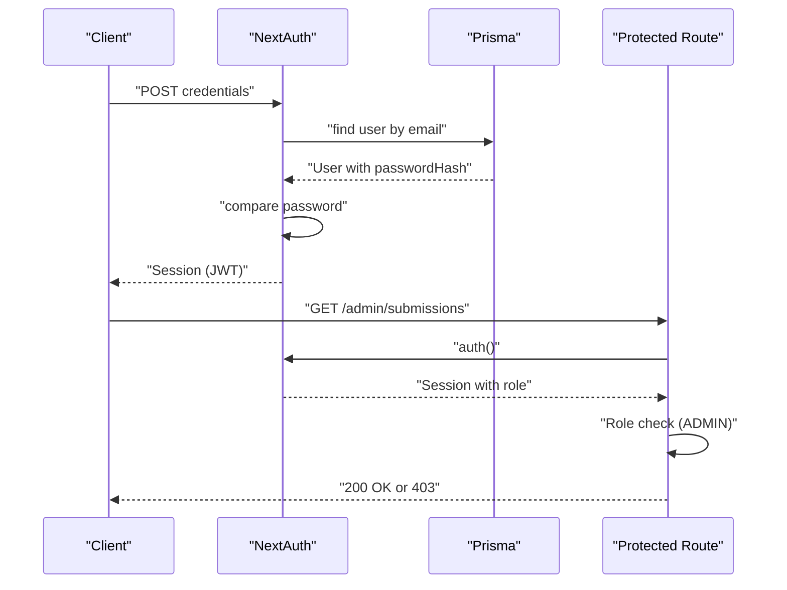
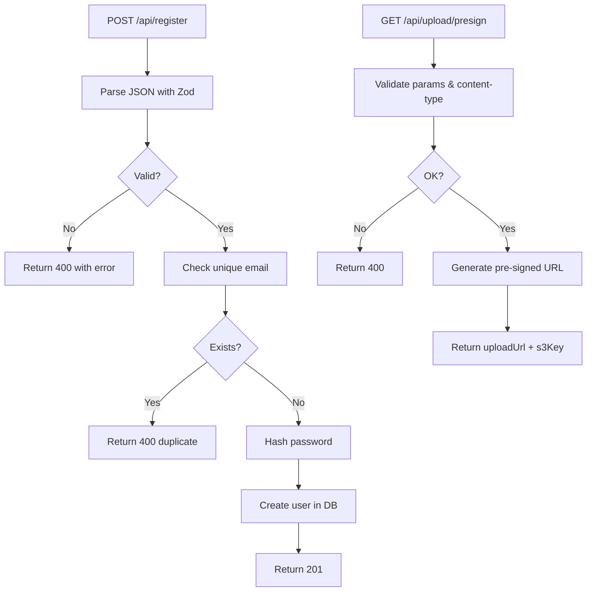
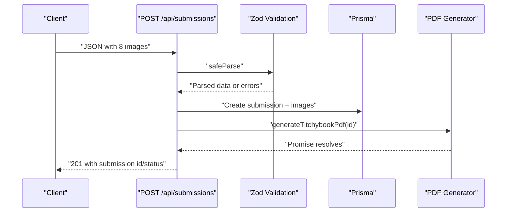
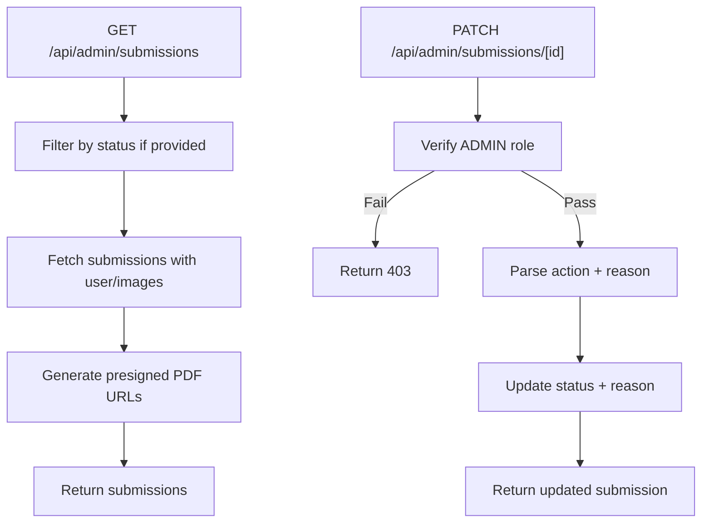
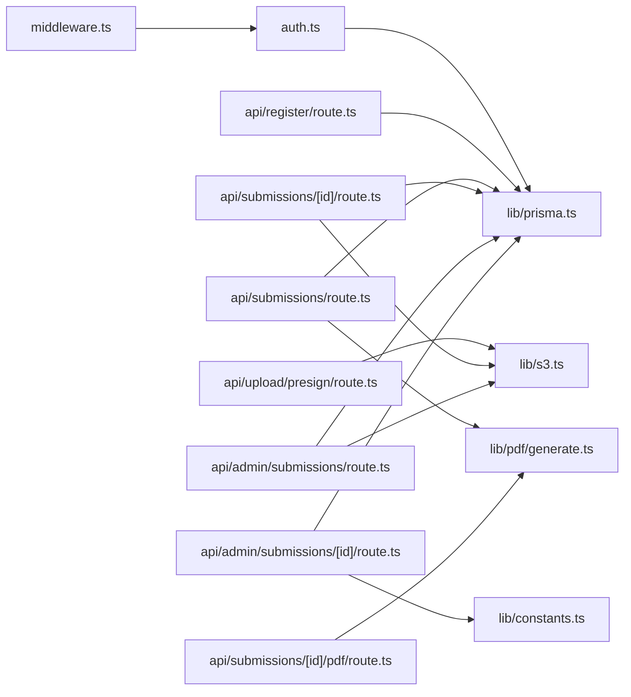

# Backend Architecture

<cite>
**Referenced Files in This Document**
- [middleware.ts](file://src/middleware.ts)
- [auth.ts](file://src/auth.ts)
- [prisma.ts](file://src/lib/prisma.ts)
- [s3.ts](file://src/lib/s3.ts)
- [generate.ts](file://src/lib/pdf/generate.ts)
- [constants.ts](file://src/lib/constants.ts)
- [package.json](file://package.json)
- [next.config.ts](file://next.config.ts)
- [api/admin/submissions/route.ts](file://src/app/api/admin/submissions/route.ts)
- [api/admin/submissions/[id]/route.ts](file://src/app/api/admin/submissions/[id]/route.ts)
- [api/submissions/route.ts](file://src/app/api/submissions/route.ts)
- [api/submissions/[id]/route.ts](file://src/app/api/submissions/[id]/route.ts)
- [api/submissions/[id]/pdf/route.ts](file://src/app/api/submissions/[id]/pdf/route.ts)
- [api/register/route.ts](file://src/app/api/register/route.ts)
- [api/upload/presign/route.ts](file://src/app/api/upload/presign/route.ts)
</cite>

## Table of Contents
1. [Introduction](#introduction)
2. [Project Structure](#project-structure)
3. [Core Components](#core-components)
4. [Architecture Overview](#architecture-overview)
5. [Detailed Component Analysis](#detailed-component-analysis)
6. [Dependency Analysis](#dependency-analysis)
7. [Performance Considerations](#performance-considerations)
8. [Security and Compliance](#security-and-compliance)
9. [Troubleshooting Guide](#troubleshooting-guide)
10. [Conclusion](#conclusion)

## Introduction
This document describes the backend architecture of Titchybook Creator, focusing on the serverless API pattern used by Next.js, the middleware-driven route protection, and the NextAuth integration for authentication and session management. It documents the API route structure organized by feature areas (authentication, submissions, admin), the authentication flow from login to protected route access, and error handling, validation, and response formatting strategies. Security considerations such as CORS, rate limiting, and input sanitization are addressed conceptually, along with integration points among middleware, authentication, and API routes.

## Project Structure
The backend is implemented as Next.js Serverless Functions under the app directory. Routes are grouped by feature and protected via middleware and per-route authentication checks. Shared infrastructure includes a Prisma client for database access, AWS S3 integration for uploads/downloads, and PDF generation utilities.

**Diagram sources**
- [middleware.ts:1-6](file://src/middleware.ts#L1-L6)
- [auth.ts:27-79](file://src/auth.ts#L27-L79)
- [prisma.ts:1-10](file://src/lib/prisma.ts#L1-L10)
- [s3.ts:1-81](file://src/lib/s3.ts#L1-L81)
- [generate.ts:23-111](file://src/lib/pdf/generate.ts#L23-L111)
- [constants.ts:6-49](file://src/lib/constants.ts#L6-L49)
- [api/admin/submissions/route.ts:1-38](file://src/app/api/admin/submissions/route.ts#L1-L38)
- [api/admin/submissions/[id]/route.ts:1-63](file://src/app/api/admin/submissions/[id]/route.ts#L1-L63)
- [api/submissions/route.ts:1-96](file://src/app/api/submissions/route.ts#L1-L96)
- [api/submissions/[id]/route.ts:1-37](file://src/app/api/submissions/[id]/route.ts#L1-L37)
- [api/submissions/[id]/pdf/route.ts:1-27](file://src/app/api/submissions/[id]/pdf/route.ts#L1-L27)
- [api/register/route.ts:1-47](file://src/app/api/register/route.ts#L1-L47)
- [api/upload/presign/route.ts:1-38](file://src/app/api/upload/presign/route.ts#L1-L38)

**Section sources**
- [middleware.ts:1-6](file://src/middleware.ts#L1-L6)
- [auth.ts:27-79](file://src/auth.ts#L27-L79)
- [prisma.ts:1-10](file://src/lib/prisma.ts#L1-L10)
- [s3.ts:1-81](file://src/lib/s3.ts#L1-L81)
- [generate.ts:23-111](file://src/lib/pdf/generate.ts#L23-L111)
- [constants.ts:6-49](file://src/lib/constants.ts#L6-L49)

## Core Components
- Middleware: Exposes NextAuth’s auth function and defines URL matchers for protected routes.
- NextAuth: Configures credentials provider, JWT session strategy, pages, and callbacks to attach user role to tokens and sessions.
- Prisma: Singleton client for database operations.
- S3: Presigned URL generation for uploads and downloads, plus direct upload/download helpers.
- PDF Generation: Orchestrates fetching images, processing, composing PDF, uploading to S3, and updating submission records.
- Constants: Strongly typed enums and constants for statuses, page labels, accepted image types, and limits.

**Section sources**
- [middleware.ts:1-6](file://src/middleware.ts#L1-L6)
- [auth.ts:27-79](file://src/auth.ts#L27-L79)
- [prisma.ts:1-10](file://src/lib/prisma.ts#L1-L10)
- [s3.ts:1-81](file://src/lib/s3.ts#L1-L81)
- [generate.ts:23-111](file://src/lib/pdf/generate.ts#L23-L111)
- [constants.ts:6-49](file://src/lib/constants.ts#L6-L49)

## Architecture Overview
The system follows a serverless API pattern with Next.js App Router. Requests are routed to route.ts handlers under src/app/api. Middleware enforces authentication for specific paths, while per-route handlers enforce authorization (roles) and perform domain logic. Authentication relies on NextAuth with JWT strategy and custom callbacks. Data persistence uses Prisma, and media assets are handled via AWS S3 with presigned URLs.

**Diagram sources**
- [middleware.ts:1-6](file://src/middleware.ts#L1-L6)
- [auth.ts:27-79](file://src/auth.ts#L27-L79)
- [api/submissions/route.ts:20-33](file://src/app/api/submissions/route.ts#L20-L33)
- [api/admin/submissions/route.ts:6-10](file://src/app/api/admin/submissions/route.ts#L6-L10)

## Detailed Component Analysis

### Middleware System and Route Protection
- Purpose: Apply authentication guard to route groups (/dashboard, /create, /admin).
- Behavior: Uses NextAuth’s exported auth function; matcher array controls which paths are intercepted.
- Integration: Ensures unauthenticated clients are redirected or blocked by downstream handlers.

**Diagram sources**
- [middleware.ts:3-5](file://src/middleware.ts#L3-L5)
- [auth.ts:27-79](file://src/auth.ts#L27-L79)

**Section sources**
- [middleware.ts:1-6](file://src/middleware.ts#L1-L6)

### NextAuth Integration and Session Management
- Provider: Credentials provider validates email/password against hashed passwords stored in the database.
- Session Strategy: JWT; token carries user id and role; session mirrors token payload.
- Callbacks: jwt callback attaches id and role to the token; session callback injects id and role into session.user.
- Pages: Sign-in page mapped to /login.

**Diagram sources**
- [auth.ts:27-79](file://src/auth.ts#L27-L79)
- [prisma.ts:1-10](file://src/lib/prisma.ts#L1-L10)

**Section sources**
- [auth.ts:27-79](file://src/auth.ts#L27-L79)

### Authentication Flow: Login to Protected Routes
- Login: Client submits credentials to NextAuth endpoint; provider authorizes and returns user.
- Session: NextAuth stores JWT; subsequent requests include session cookie/token.
- Protected Access: Middleware and route handlers call auth(); handlers enforce role checks (e.g., ADMIN).

**Diagram sources**
- [auth.ts:35-58](file://src/auth.ts#L35-L58)
- [api/admin/submissions/route.ts:7-10](file://src/app/api/admin/submissions/route.ts#L7-L10)

**Section sources**
- [auth.ts:35-58](file://src/auth.ts#L35-L58)
- [api/admin/submissions/route.ts:7-10](file://src/app/api/admin/submissions/route.ts#L7-L10)

### API Route Structure by Feature Areas

#### Authentication and Registration
- POST /api/register: Validates input with Zod, checks uniqueness, hashes password, creates user.
- GET /api/upload/presign: Generates pre-signed upload URL for S3; validates required parameters and content type.

**Diagram sources**
- [api/register/route.ts:12-46](file://src/app/api/register/route.ts#L12-L46)
- [api/upload/presign/route.ts:6-37](file://src/app/api/upload/presign/route.ts#L6-L37)

**Section sources**
- [api/register/route.ts:12-46](file://src/app/api/register/route.ts#L12-L46)
- [api/upload/presign/route.ts:6-37](file://src/app/api/upload/presign/route.ts#L6-L37)

#### Submissions (Authenticated Users)
- GET /api/submissions: Lists current user’s submissions.
- POST /api/submissions: Creates a new submission with 8 validated image entries; triggers asynchronous PDF generation.
- GET /api/submissions/[id]: Retrieves a single submission; enforces ownership or ADMIN role; optionally generates presigned PDF URL.
- POST /api/submissions/[id]/pdf: Regenerates PDF for a submission.

**Diagram sources**
- [api/submissions/route.ts:35-95](file://src/app/api/submissions/route.ts#L35-L95)
- [generate.ts:23-111](file://src/lib/pdf/generate.ts#L23-L111)

**Section sources**
- [api/submissions/route.ts:20-95](file://src/app/api/submissions/route.ts#L20-L95)
- [api/submissions/[id]/route.ts:6-36](file://src/app/api/submissions/[id]/route.ts#L6-L36)
- [api/submissions/[id]/pdf/route.ts:5-26](file://src/app/api/submissions/[id]/pdf/route.ts#L5-L26)

#### Admin (Administrators Only)
- GET /api/admin/submissions: Lists submissions with optional status filter; enriches with presigned PDF URLs.
- PATCH /api/admin/submissions/[id]: Approves or rejects a submission; sets rejection reason when rejected.

**Diagram sources**
- [api/admin/submissions/route.ts:6-37](file://src/app/api/admin/submissions/route.ts#L6-L37)
- [api/admin/submissions/[id]/route.ts:12-61](file://src/app/api/admin/submissions/[id]/route.ts#L12-L61)

**Section sources**
- [api/admin/submissions/route.ts:6-37](file://src/app/api/admin/submissions/route.ts#L6-L37)
- [api/admin/submissions/[id]/route.ts:12-61](file://src/app/api/admin/submissions/[id]/route.ts#L12-L61)

### Request Validation and Response Formatting
- Validation: Zod schemas define strict shapes for registration and submissions; safeParse returns structured errors.
- Responses: Consistent JSON bodies with either data objects or error messages; appropriate HTTP status codes (200/201/400/401/403/404/500).
- Error Handling: Try/catch blocks wrap async operations; specific branches return 400/404/500 depending on failure mode.

**Section sources**
- [api/register/route.ts:6-10](file://src/app/api/register/route.ts#L6-L10)
- [api/submissions/route.ts:8-18](file://src/app/api/submissions/route.ts#L8-L18)
- [api/upload/presign/route.ts:18-30](file://src/app/api/upload/presign/route.ts#L18-L30)

### Serverless API Pattern in Next.js
- Route Handlers: Each route.ts exports async functions (GET/POST/PATCH) that accept NextRequest/Request and return NextResponse.
- Dynamic Routes: Parameters resolved via params promise; handlers await params to access route segments.
- Environment: Uses Next.js runtime; no traditional server required.

**Section sources**
- [api/submissions/[id]/route.ts:7-20](file://src/app/api/submissions/[id]/route.ts#L7-L20)
- [api/admin/submissions/[id]/route.ts:12-22](file://src/app/api/admin/submissions/[id]/route.ts#L12-L22)

## Dependency Analysis
- Middleware depends on NextAuth for session retrieval.
- API routes depend on NextAuth for auth checks, Prisma for persistence, and S3 for media.
- PDF generation depends on Prisma for data and S3 for storage.
- Constants provide shared types and enums across modules.

**Diagram sources**
- [middleware.ts:1-1](file://src/middleware.ts#L1-L1)
- [auth.ts:27-79](file://src/auth.ts#L27-L79)
- [prisma.ts:1-10](file://src/lib/prisma.ts#L1-L10)
- [s3.ts:1-81](file://src/lib/s3.ts#L1-L81)
- [generate.ts:23-111](file://src/lib/pdf/generate.ts#L23-L111)
- [constants.ts:6-49](file://src/lib/constants.ts#L6-L49)
- [api/register/route.ts:1-47](file://src/app/api/register/route.ts#L1-L47)
- [api/upload/presign/route.ts:1-38](file://src/app/api/upload/presign/route.ts#L1-L38)
- [api/submissions/route.ts:1-96](file://src/app/api/submissions/route.ts#L1-L96)
- [api/submissions/[id]/route.ts:1-37](file://src/app/api/submissions/[id]/route.ts#L1-L37)
- [api/submissions/[id]/pdf/route.ts:1-27](file://src/app/api/submissions/[id]/pdf/route.ts#L1-L27)
- [api/admin/submissions/route.ts:1-38](file://src/app/api/admin/submissions/route.ts#L1-L38)
- [api/admin/submissions/[id]/route.ts:1-63](file://src/app/api/admin/submissions/[id]/route.ts#L1-L63)

**Section sources**
- [package.json:11-24](file://package.json#L11-L24)

## Performance Considerations
- Asynchronous PDF Generation: Background generation avoids blocking API responses; failures logged but do not fail the submission creation.
- Parallel Operations: PDF generation downloads and processes images in parallel to reduce latency.
- Presigned URLs: Offloads uploads/downloads to S3; reduces server bandwidth and CPU usage.
- Transactional Writes: Submission creation uses a single transaction to maintain consistency.

[No sources needed since this section provides general guidance]

## Security and Compliance
- Authentication: JWT-based session strategy with NextAuth; credentials provider validates against hashed passwords.
- Authorization: Per-route checks enforce user ownership or ADMIN role.
- Input Validation: Zod schemas validate and sanitize request payloads.
- Content Type Enforcement: Upload endpoint restricts accepted image types.
- Secrets Management: AWS credentials and bucket configured via environment variables; keep secrets out of client bundles.
- CORS: Not explicitly configured in the provided files; configure at the framework level if cross-origin access is required.
- Rate Limiting: Not implemented in the provided files; consider adding rate limiting at the edge or middleware layer.
- Input Sanitization: Strict schema parsing; reject invalid payloads early with 400 responses.

**Section sources**
- [auth.ts:27-79](file://src/auth.ts#L27-L79)
- [api/upload/presign/route.ts:25-30](file://src/app/api/upload/presign/route.ts#L25-L30)
- [api/register/route.ts:17-22](file://src/app/api/register/route.ts#L17-L22)
- [api/submissions/route.ts:45-50](file://src/app/api/submissions/route.ts#L45-L50)

## Troubleshooting Guide
- Unauthorized Access: Ensure auth() is called and session contains user id; verify middleware matcher includes the route.
- Forbidden Access: Confirm ADMIN role for admin endpoints; otherwise, verify ownership for user endpoints.
- Validation Errors: Review Zod error messages returned in the error field; ensure payloads match schemas.
- PDF Generation Failures: Check logs for PDF generation errors; regenerate via POST /api/submissions/[id]/pdf.
- S3 Issues: Verify AWS credentials and bucket name; confirm presigned URL generation succeeds.

**Section sources**
- [api/submissions/route.ts:21-24](file://src/app/api/submissions/route.ts#L21-L24)
- [api/admin/submissions/route.ts:8-10](file://src/app/api/admin/submissions/route.ts#L8-L10)
- [api/submissions/[id]/route.ts:26-28](file://src/app/api/submissions/[id]/route.ts#L26-L28)
- [api/submissions/[id]/pdf/route.ts:19-25](file://src/app/api/submissions/[id]/pdf/route.ts#L19-L25)
- [api/upload/presign/route.ts:34-36](file://src/app/api/upload/presign/route.ts#L34-L36)

## Conclusion
The backend leverages Next.js serverless functions with a robust middleware and NextAuth integration to protect routes and manage sessions. API routes are organized by feature, with strong validation, consistent error handling, and clear authorization checks. Integrations with Prisma and AWS S3 enable scalable persistence and media handling, while asynchronous PDF generation improves responsiveness. Security is enforced through JWT sessions, role-based access control, and strict input validation.