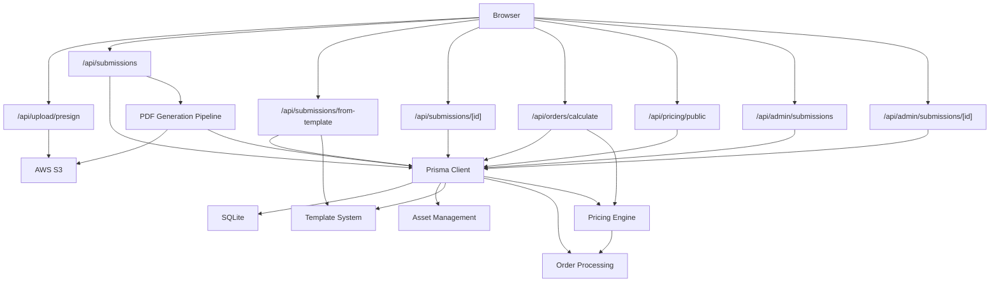
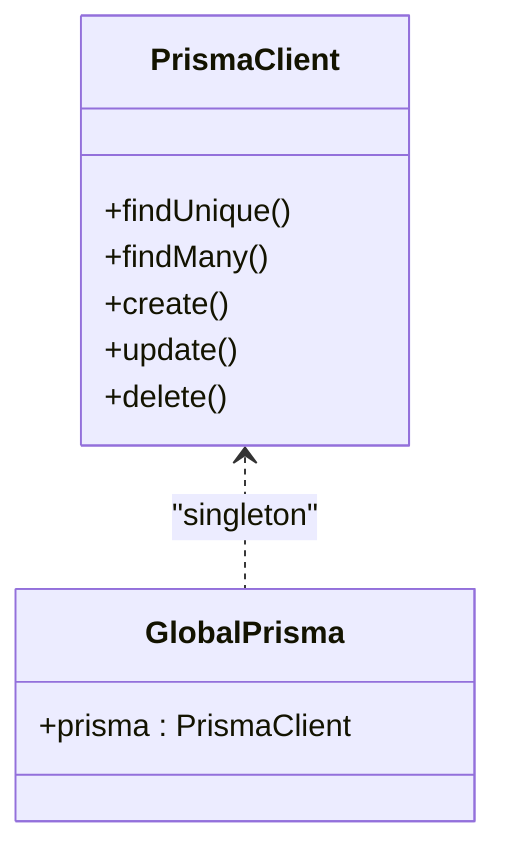
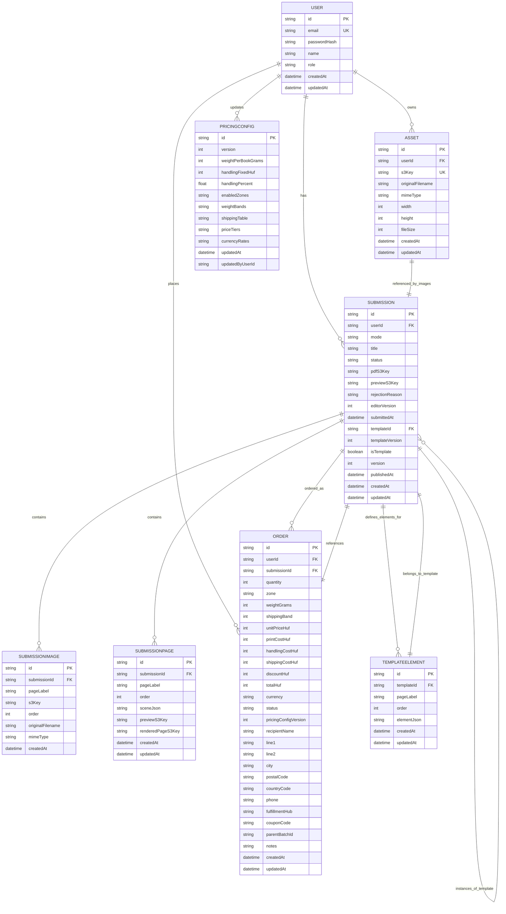
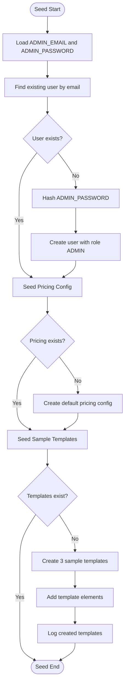
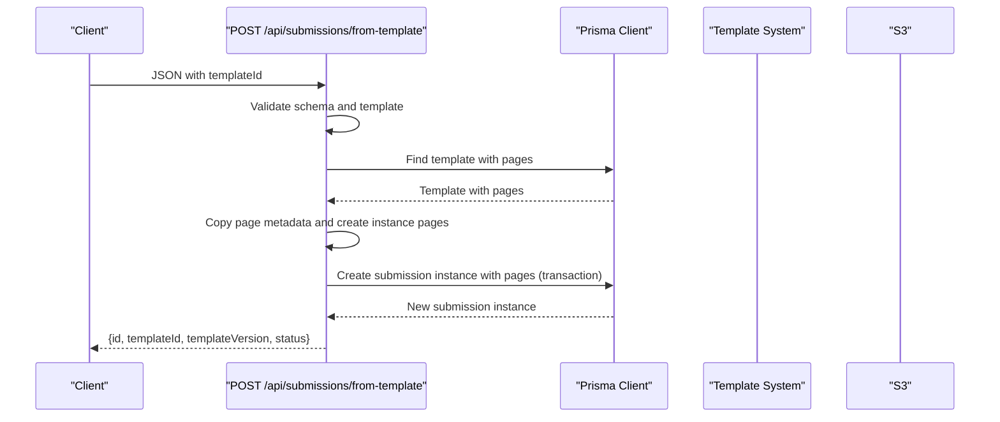
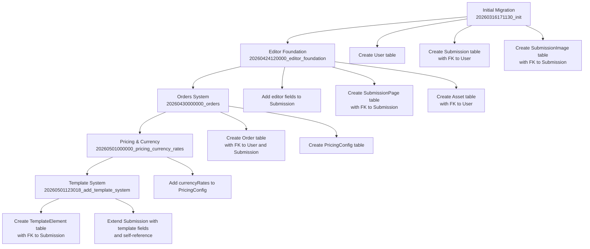
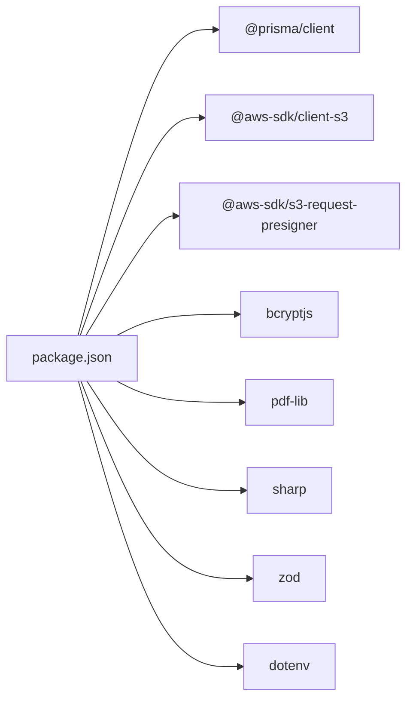

# Data Architecture

<cite>
**Referenced Files in This Document**
- [schema.prisma](file://prisma/schema.prisma)
- [prisma.ts](file://src/lib/prisma.ts)
- [seed.ts](file://prisma/seed.ts)
- [migration.sql](file://prisma/migrations/20260316171130_init/migration.sql)
- [migration.sql](file://prisma/migrations/20260424120000_editor_foundation/migration.sql)
- [migration.sql](file://prisma/migrations/20260430000000_orders/migration.sql)
- [migration.sql](file://prisma/migrations/20260501000000_pricing_currency_rates/migration.sql)
- [migration.sql](file://prisma/migrations/20260501123018_add_template_system/migration.sql)
- [route.ts](file://src/app/api/submissions/from-template/route.ts)
- [route.ts](file://src/app/api/orders/calculate/route.ts)
- [route.ts](file://src/app/api/pricing/public/route.ts)
- [route.ts](file://src/app/api/submissions/route.ts)
- [route.ts](file://src/app/api/admin/submissions/route.ts)
- [route.ts](file://src/app/api/admin/submissions/[id]/route.ts)
- [route.ts](file://src/app/api/submissions/[id]/route.ts)
- [route.ts](file://src/app/api/upload/presign/route.ts)
- [generate.ts](file://src/lib/pdf/generate.ts)
- [s3.ts](file://src/lib/s3.ts)
- [auth.ts](file://src/auth.ts)
- [constants.ts](file://src/lib/constants.ts)
- [ImageUploader.tsx](file://src/components/create/ImageUploader.tsx)
- [package.json](file://package.json)
</cite>

## Update Summary
**Changes Made**
- Added comprehensive documentation for the new template system with template instances and template elements
- Documented the complete asset management system with user-owned assets and S3 integration
- Added detailed coverage of the order management system with pricing configuration and currency support
- Updated database schema documentation to reflect all five core entities: User, Submission, Asset, Order, and PricingConfig
- Enhanced migration strategy documentation covering the five migration phases
- Expanded API endpoints section to include template creation, order calculation, and pricing configuration endpoints
- Updated data modeling approach to include template-based submission creation and relationship management

## Table of Contents
1. [Introduction](#introduction)
2. [Project Structure](#project-structure)
3. [Core Components](#core-components)
4. [Architecture Overview](#architecture-overview)
5. [Detailed Component Analysis](#detailed-component-analysis)
6. [Dependency Analysis](#dependency-analysis)
7. [Performance Considerations](#performance-considerations)
8. [Troubleshooting Guide](#troubleshooting-guide)
9. [Conclusion](#conclusion)
10. [Appendices](#appendices)

## Introduction
This document describes the data architecture of Titchybook Creator, focusing on the Prisma ORM implementation, database schema design, and the integration between the Prisma client and API routes. The system now supports a comprehensive data model including assets, submissions, templates, orders, and pricing configurations. It explains the entities Users, Submissions, Assets, Orders, and PricingConfig, their relationships, constraints, and how data flows through the system. The architecture includes a sophisticated template system that allows users to create instances from published templates, an asset management system for user-owned media, and a complete order processing pipeline with dynamic pricing calculations.

## Project Structure
The data layer is organized around five core entities with their associated relationships and indexes:
- Prisma schema defining models, relations, and indexes for all entities
- A singleton Prisma client initialized once per process
- API routes orchestrating data operations across submissions, assets, templates, orders, and pricing
- PDF generation pipeline for traditional submission processing
- Seeding script to bootstrap admin credentials, pricing configuration, and sample templates

```mermaid
graph TB
subgraph "Prisma Layer"
PRISMA_SCHEMA["Prisma Schema<br/>schema.prisma"]
PRISMA_CLIENT["Prisma Client<br/>src/lib/prisma.ts"]
MIGRATION_INIT["Initial Migration<br/>20260316171130_init"]
MIGRATION_EDITOR["Editor Foundation<br/>20260424120000_editor_foundation"]
MIGRATION_ORDERS["Orders System<br/>20260430000000_orders"]
MIGRATION_PRICING["Pricing & Currency<br/>20260501000000_pricing_currency_rates"]
MIGRATION_TEMPLATES["Template System<br/>20260501123018_add_template_system"]
SEED["Seed Script<br/>prisma/seed.ts"]
end
subgraph "API Routes"
SUB_API["Submissions API<br/>src/app/api/submissions/route.ts"]
FROM_TEMPLATE_API["From Template API<br/>src/app/api/submissions/from-template/route.ts"]
ADMIN_SUB_API["Admin Submissions API<br/>src/app/api/admin/submissions/route.ts"]
ADMIN_SUB_ITEM_API["Admin Submission Item API<br/>src/app/api/admin/submissions/[id]/route.ts"]
SUB_ITEM_API["Submission Item API<br/>src/app/api/submissions/[id]/route.ts"]
PRESIGN_API["Presigned Upload API<br/>src/app/api/upload/presign/route.ts"]
ORDERS_CALC_API["Orders Calculate API<br/>src/app/api/orders/calculate/route.ts"]
PRICING_PUBLIC_API["Pricing Public API<br/>src/app/api/pricing/public/route.ts"]
end
subgraph "Data Processing"
PDF_GEN["PDF Generation<br/>src/lib/pdf/generate.ts"]
S3_LIB["S3 Utilities<br/>src/lib/s3.ts"]
END_USER["End User Experience"]
ADMIN_USER["Admin Experience"]
EDITOR["Template Editing"]
end
AUTH["Auth Integration<br/>src/auth.ts"]
PRISMA_SCHEMA --> PRISMA_CLIENT
PRISMA_CLIENT --> SUB_API
PRISMA_CLIENT --> FROM_TEMPLATE_API
PRISMA_CLIENT --> ADMIN_SUB_API
PRISMA_CLIENT --> ADMIN_SUB_ITEM_API
PRISMA_CLIENT --> SUB_ITEM_API
PRISMA_CLIENT --> PRESIGN_API
PRISMA_CLIENT --> ORDERS_CALC_API
PRISMA_CLIENT --> PRICING_PUBLIC_API
PRISMA_CLIENT --> PDF_GEN
SUB_API --> PDF_GEN
FROM_TEMPLATE_API --> PRISMA_CLIENT
ORDERS_CALC_API --> PRISMA_CLIENT
PRICING_PUBLIC_API --> PRISMA_CLIENT
ADMIN_SUB_API --> S3_LIB
SUB_ITEM_API --> S3_LIB
PRESIGN_API --> S3_LIB
AUTH --> SUB_API
AUTH --> FROM_TEMPLATE_API
AUTH --> ADMIN_SUB_API
AUTH --> ADMIN_SUB_ITEM_API
AUTH --> SUB_ITEM_API
AUTH --> PRESIGN_API
AUTH --> ORDERS_CALC_API
AUTH --> PRICING_PUBLIC_API
SEED --> PRISMA_CLIENT
MIGRATION_INIT --> PRISMA_SCHEMA
MIGRATION_EDITOR --> PRISMA_SCHEMA
MIGRATION_ORDERS --> PRISMA_SCHEMA
MIGRATION_PRICING --> PRISMA_SCHEMA
MIGRATION_TEMPLATES --> PRISMA_SCHEMA
```

**Diagram sources**
- [schema.prisma:1-178](file://prisma/schema.prisma#L1-L178)
- [prisma.ts:1-10](file://src/lib/prisma.ts#L1-L10)
- [migration.sql:1-45](file://prisma/migrations/20260316171130_init/migration.sql#L1-L45)
- [migration.sql:1-51](file://prisma/migrations/20260424120000_editor_foundation/migration.sql#L1-L51)
- [migration.sql:1-59](file://prisma/migrations/20260430000000_orders/migration.sql#L1-L59)
- [migration.sql:1-7](file://prisma/migrations/20260501000000_pricing_currency_rates/migration.sql#L1-L7)
- [migration.sql:1-51](file://prisma/migrations/20260501123018_add_template_system/migration.sql#L1-L51)
- [seed.ts:1-350](file://prisma/seed.ts#L1-L350)
- [route.ts:1-100](file://src/app/api/submissions/from-template/route.ts#L1-L100)
- [route.ts:1-90](file://src/app/api/orders/calculate/route.ts#L1-L90)
- [route.ts:1-31](file://src/app/api/pricing/public/route.ts#L1-L31)
- [route.ts:1-96](file://src/app/api/submissions/route.ts#L1-L96)
- [route.ts:1-38](file://src/app/api/admin/submissions/route.ts#L1-L38)
- [route.ts:1-63](file://src/app/api/admin/submissions/[id]/route.ts#L1-L63)
- [route.ts:1-37](file://src/app/api/submissions/[id]/route.ts#L1-L37)
- [route.ts:1-38](file://src/app/api/upload/presign/route.ts#L1-L38)
- [generate.ts:1-112](file://src/lib/pdf/generate.ts#L1-L112)
- [s3.ts:1-81](file://src/lib/s3.ts#L1-L81)
- [auth.ts:1-80](file://src/auth.ts#L1-L80)

**Section sources**
- [schema.prisma:1-178](file://prisma/schema.prisma#L1-L178)
- [prisma.ts:1-10](file://src/lib/prisma.ts#L1-L10)
- [migration.sql:1-45](file://prisma/migrations/20260316171130_init/migration.sql#L1-L45)
- [migration.sql:1-51](file://prisma/migrations/20260424120000_editor_foundation/migration.sql#L1-L51)
- [migration.sql:1-59](file://prisma/migrations/20260430000000_orders/migration.sql#L1-L59)
- [migration.sql:1-7](file://prisma/migrations/20260501000000_pricing_currency_rates/migration.sql#L1-L7)
- [migration.sql:1-51](file://prisma/migrations/20260501123018_add_template_system/migration.sql#L1-L51)
- [seed.ts:1-350](file://prisma/seed.ts#L1-L350)
- [route.ts:1-100](file://src/app/api/submissions/from-template/route.ts#L1-L100)
- [route.ts:1-90](file://src/app/api/orders/calculate/route.ts#L1-L90)
- [route.ts:1-31](file://src/app/api/pricing/public/route.ts#L1-L31)
- [route.ts:1-96](file://src/app/api/submissions/route.ts#L1-L96)
- [route.ts:1-38](file://src/app/api/admin/submissions/route.ts#L1-L38)
- [route.ts:1-63](file://src/app/api/admin/submissions/[id]/route.ts#L1-L63)
- [route.ts:1-37](file://src/app/api/submissions/[id]/route.ts#L1-L37)
- [route.ts:1-38](file://src/app/api/upload/presign/route.ts#L1-L38)
- [generate.ts:1-112](file://src/lib/pdf/generate.ts#L1-L112)
- [s3.ts:1-81](file://src/lib/s3.ts#L1-L81)
- [auth.ts:1-80](file://src/auth.ts#L1-L80)

## Core Components
- Prisma Client: Singleton client initialized once and reused across the app to ensure efficient connection management and avoid hot-reload leaks.
- Prisma Schema: Defines five entities with explicit relations and indexes for performance and integrity, including Users, Submissions, Assets, Orders, and PricingConfig.
- API Routes: Implement CRUD and orchestration for submissions, template creation, order calculation, pricing configuration, admin review, and presigned S3 uploads.
- PDF Generation: Orchestrates fetching images from S3, processing them, composing a PDF, uploading to S3, and updating the submission record.
- S3 Utilities: Provide presigned URLs for uploads/downloads and direct S3 operations.
- Authentication: Integrates NextAuth with Prisma to manage user sessions and roles.
- Template System: Supports template creation, publishing, and instantiation with page-level element inheritance.
- Asset Management: Provides user-owned asset storage with metadata and S3 integration.
- Order Processing: Handles complex pricing calculations with zone-based shipping, quantity discounts, and currency conversion.

**Section sources**
- [prisma.ts:1-10](file://src/lib/prisma.ts#L1-L10)
- [schema.prisma:10-178](file://prisma/schema.prisma#L10-L178)
- [route.ts:1-100](file://src/app/api/submissions/from-template/route.ts#L1-L100)
- [route.ts:1-90](file://src/app/api/orders/calculate/route.ts#L1-L90)
- [route.ts:1-31](file://src/app/api/pricing/public/route.ts#L1-L31)
- [generate.ts:13-112](file://src/lib/pdf/generate.ts#L13-L112)
- [s3.ts:1-81](file://src/lib/s3.ts#L1-L81)
- [auth.ts:27-80](file://src/auth.ts#L27-L80)

## Architecture Overview
The data architecture follows a layered pattern with five core entities:
- Presentation: Next.js App Router API routes for all data operations
- Application: Validation via Zod, business logic, and orchestration for templates, orders, and pricing
- Persistence: Prisma ORM with SQLite for all entities
- Storage: AWS S3 for images, PDFs, and asset files
- Security: NextAuth JWT session with role-based access control
- Template Engine: Template-based submission creation with element inheritance
- Pricing Engine: Dynamic pricing calculation with currency conversion and zone-based shipping

**Diagram sources**
- [route.ts:1-100](file://src/app/api/submissions/from-template/route.ts#L1-L100)
- [route.ts:1-90](file://src/app/api/orders/calculate/route.ts#L1-L90)
- [route.ts:1-31](file://src/app/api/pricing/public/route.ts#L1-L31)
- [route.ts:1-96](file://src/app/api/submissions/route.ts#L1-L96)
- [route.ts:1-37](file://src/app/api/submissions/[id]/route.ts#L1-L37)
- [route.ts:1-38](file://src/app/api/admin/submissions/route.ts#L1-L38)
- [route.ts:1-63](file://src/app/api/admin/submissions/[id]/route.ts#L1-L63)
- [route.ts:1-38](file://src/app/api/upload/presign/route.ts#L1-L38)
- [generate.ts:13-112](file://src/lib/pdf/generate.ts#L13-L112)
- [s3.ts:1-81](file://src/lib/s3.ts#L1-L81)
- [prisma.ts:1-10](file://src/lib/prisma.ts#L1-L10)
- [migration.sql:1-45](file://prisma/migrations/20260316171130_init/migration.sql#L1-L45)
- [migration.sql:1-51](file://prisma/migrations/20260424120000_editor_foundation/migration.sql#L1-L51)
- [migration.sql:1-59](file://prisma/migrations/20260430000000_orders/migration.sql#L1-L59)
- [migration.sql:1-7](file://prisma/migrations/20260501000000_pricing_currency_rates/migration.sql#L1-L7)
- [migration.sql:1-51](file://prisma/migrations/20260501123018_add_template_system/migration.sql#L1-L51)

## Detailed Component Analysis

### Prisma ORM and Client Initialization
- Provider and datasource: SQLite provider configured via DATABASE_URL environment variable.
- Client lifecycle: Singleton pattern ensures one client instance per process, avoiding multiple connections and leaks during development.
- Global client assignment prevents hot reload duplication in non-production environments.

**Diagram sources**
- [prisma.ts:1-10](file://src/lib/prisma.ts#L1-L10)

**Section sources**
- [schema.prisma:5-8](file://prisma/schema.prisma#L5-L8)
- [prisma.ts:1-10](file://src/lib/prisma.ts#L1-L10)

### Database Schema Design
Five core entities with comprehensive relationships:

**User Entity**
- Fields: id, email (unique), passwordHash, name, role (default USER), timestamps.
- Relations: one-to-many to Submission via userId, one-to-many to Asset via userId, one-to-many to Order via userId.

**Submission Entity** (Enhanced)
- Fields: id, userId (foreign key), mode (default LEGACY_UPLOAD), title, status (default PENDING), pdfS3Key, previewS3Key, rejectionReason, editorVersion (default 1), submittedAt, templateId (self-reference), templateVersion, isTemplate (default false), version (default 1), publishedAt, timestamps.
- Indexes: composite index on userId, isTemplate, templateId for fast lookup by user, template status, and template relationships.
- Relations: belongs to User; one-to-many to SubmissionImage via submissionId; one-to-many to SubmissionPage via submissionId; one-to-many to Order via submissionId; one-to-many to TemplateElement via templateId; self-referencing relationship for template instances.

**SubmissionImage Entity**
- Fields: id, submissionId (foreign key), pageLabel, s3Key, order, originalFilename, mimeType, timestamps.
- Indexes: composite index on submissionId for fast image retrieval ordered by page.

**SubmissionPage Entity** (New)
- Fields: id, submissionId (foreign key), pageLabel, order, sceneJson (default "{}"), previewS3Key, renderedPageS3Key, timestamps.
- Indexes: composite index on submissionId, unique composite index on (submissionId, pageLabel), unique composite index on (submissionId, order).
- Relations: belongs to Submission with cascade delete on parent deletion.

**Asset Entity** (New)
- Fields: id, userId (foreign key), s3Key (unique), originalFilename, mimeType, width, height, fileSize, timestamps.
- Indexes: composite index on userId for fast asset lookup by user.
- Relations: belongs to User with cascade delete on parent deletion.

**Order Entity** (New)
- Fields: id, userId (foreign key), submissionId (foreign key), quantity, zone, weightGrams, shippingBand, unitPriceHuf, printCostHuf, handlingCostHuf (default 0), shippingCostHuf, discountHuf (default 0), totalHuf, currency (default HUF), status (default PENDING_PAYMENT), pricingConfigVersion, recipientName, line1, line2, city, postalCode, countryCode, phone, fulfillmentHub, couponCode, parentBatchId, notes, timestamps.
- Indexes: composite index on userId, submissionId, status for fast order lookup.
- Relations: belongs to User and Submission with cascade delete on parent deletion.

**TemplateElement Entity** (New)
- Fields: id, templateId (foreign key), pageLabel, order, elementJson, timestamps.
- Indexes: composite index on templateId, unique composite index on (templateId, pageLabel).
- Relations: belongs to Submission (template) with cascade delete on parent deletion.

**PricingConfig Entity** (New)
- Fields: id (default "default"), version (default 1), weightPerBookGrams (default 6), handlingFixedHuf (default 0), handlingPercent (default 0), enabledZones (JSON string), weightBands (JSON string), shippingTable (JSON string), priceTiers (JSON string), currencyRates (JSON string default), updatedAt, updatedByUserId.
- Relations: belongs to User via updatedByUserId.

Constraints and defaults:
- Unique constraint on User.email enforced at schema and migration level.
- Unique constraint on Asset.s3Key for S3 key uniqueness.
- Foreign key constraints:
  - Submission.userId → User.id (RESTRICT on delete, CASCADE on update).
  - SubmissionImage.submissionId → Submission.id (CASCADE on delete, CASCADE on update).
  - SubmissionPage.submissionId → Submission.id (CASCADE on delete, CASCADE on update).
  - Asset.userId → User.id (RESTRICT on delete, CASCADE on update).
  - Order.userId → User.id (RESTRICT on delete, CASCADE on update).
  - Order.submissionId → Submission.id (RESTRICT on delete, CASCADE on update).
  - TemplateElement.templateId → Submission.id (CASCADE on delete, CASCADE on update).

**Diagram sources**
- [schema.prisma:10-178](file://prisma/schema.prisma#L10-L178)
- [migration.sql:1-45](file://prisma/migrations/20260316171130_init/migration.sql#L1-L45)
- [migration.sql:1-51](file://prisma/migrations/20260424120000_editor_foundation/migration.sql#L1-L51)
- [migration.sql:1-59](file://prisma/migrations/20260430000000_orders/migration.sql#L1-L59)
- [migration.sql:1-7](file://prisma/migrations/20260501000000_pricing_currency_rates/migration.sql#L1-L7)
- [migration.sql:1-51](file://prisma/migrations/20260501123018_add_template_system/migration.sql#L1-L51)

**Section sources**
- [schema.prisma:10-178](file://prisma/schema.prisma#L10-L178)
- [migration.sql:1-45](file://prisma/migrations/20260316171130_init/migration.sql#L1-L45)
- [migration.sql:1-51](file://prisma/migrations/20260424120000_editor_foundation/migration.sql#L1-L51)
- [migration.sql:1-59](file://prisma/migrations/20260430000000_orders/migration.sql#L1-L59)
- [migration.sql:1-7](file://prisma/migrations/20260501000000_pricing_currency_rates/migration.sql#L1-L7)
- [migration.sql:1-51](file://prisma/migrations/20260501123018_add_template_system/migration.sql#L1-L51)

### Data Modeling Approach
- Authentication: Users are stored with hashed passwords; NextAuth integrates with Prisma to authenticate and manage sessions with role-based access control.
- Submission Tracking: Each submission is owned by a user and progresses through statuses (PENDING, APPROVED, REJECTED, PROCESSING, DRAFT). Administrators can approve or reject submissions and optionally provide rejection reasons. The system now supports both legacy upload mode and editor mode with template-based creation.
- Template System: Templates are special submissions with isTemplate flag set to true. They contain page-level scene data and template elements that define reusable page layouts. Instances can be created from templates with automatic page metadata copying.
- Asset Management: Users can upload and manage their own assets with metadata including dimensions, MIME type, and file size. Assets are linked to users and referenced by submissions.
- Order Processing: Orders track customer purchases with detailed pricing breakdowns, shipping zones, and currency conversion. The system supports complex pricing calculations with quantity discounts and zone-based shipping costs.
- Pricing Configuration: Centralized pricing configuration with weight-based calculations, shipping tables, price tiers, and currency exchange rates. Configuration is versioned and audited.
- Image Metadata: Each SubmissionImage stores S3 key, page label, ordering, original filename, and MIME type. Images are ordered by the order field and grouped by submissionId.
- Page-Level Editor Data: SubmissionPage entities store complete page scene data including dimensions, background colors, and serialized element arrays for the editor workspace.

Validation and constraints:
- Submission creation enforces exactly 8 unique page labels and validates numeric order range.
- Template creation requires approved status and proper page structure.
- Asset uploads validate MIME types and store metadata.
- Order calculations validate zones, quantities, and pricing configuration versions.
- PDF generation sets status to PROCESSING while composing, then resets to PENDING after upload.
- Access control ensures only the owner or admins can access a submission; admins can generate presigned download URLs for PDFs.

**Section sources**
- [auth.ts:27-80](file://src/auth.ts#L27-L80)
- [constants.ts:6-49](file://src/lib/constants.ts#L6-L49)
- [route.ts:35-95](file://src/app/api/submissions/route.ts#L35-L95)
- [route.ts:12-62](file://src/app/api/admin/submissions/[id]/route.ts#L12-L62)
- [route.ts:1-100](file://src/app/api/submissions/from-template/route.ts#L1-L100)
- [route.ts:1-90](file://src/app/api/orders/calculate/route.ts#L1-L90)
- [route.ts:1-31](file://src/app/api/pricing/public/route.ts#L1-L31)
- [generate.ts:23-112](file://src/lib/pdf/generate.ts#L23-L112)

### Seeding Strategy
- Seeds an admin user if not present using environment variables for email and password.
- Hashes the password with bcrypt before storing.
- Role is set to ADMIN for the seeded user.
- Creates default pricing configuration with shipping zones, weight bands, and currency rates.
- Generates three sample templates (Birthday Card, Photo Journal, Minimalist Zine) with predefined page layouts and template elements.
- Each template includes proper page metadata and element structures for the editor.

**Diagram sources**
- [seed.ts:22-43](file://prisma/seed.ts#L22-L43)
- [seed.ts:45-73](file://prisma/seed.ts#L45-L73)
- [seed.ts:75-336](file://prisma/seed.ts#L75-L336)

**Section sources**
- [seed.ts:1-350](file://prisma/seed.ts#L1-L350)

### Data Access Patterns and Transactions
- Read-heavy queries:
  - List submissions for a user ordered by creation date.
  - Retrieve a single submission with images ordered by page order.
  - Admin list submissions optionally filtered by status, including user info and presigned PDF URLs.
  - Template-based submission creation with page metadata copying.
  - Order calculation with pricing configuration loading.
  - Public pricing configuration access for authenticated users.
- Write operations:
  - Create submission with nested images in a single transaction to maintain atomicity.
  - Create template with pages and template elements in a single transaction.
  - Create order with pricing calculation and validation.
  - Update submission status and rejection reason with validation.
  - Update pricing configuration with version tracking.
- Asynchronous PDF generation:
  - Submission creation triggers background PDF generation without blocking the request.
  - PDF generation updates status to PROCESSING, uploads the PDF to S3, and resets status to PENDING.
- Template system operations:
  - Template creation with page seeds and element definitions.
  - Instance creation from template with automatic page metadata copying.
  - Template element management for reusable page components.

**Diagram sources**
- [route.ts:1-100](file://src/app/api/submissions/from-template/route.ts#L1-L100)

**Section sources**
- [route.ts:20-33](file://src/app/api/submissions/route.ts#L20-L33)
- [route.ts:35-95](file://src/app/api/submissions/route.ts#L35-L95)
- [route.ts:6-37](file://src/app/api/submissions/[id]/route.ts#L6-L37)
- [route.ts:6-37](file://src/app/api/admin/submissions/route.ts#L6-L37)
- [route.ts:12-62](file://src/app/api/admin/submissions/[id]/route.ts#L12-L62)
- [route.ts:1-100](file://src/app/api/submissions/from-template/route.ts#L1-L100)
- [route.ts:1-90](file://src/app/api/orders/calculate/route.ts#L1-L90)
- [route.ts:1-31](file://src/app/api/pricing/public/route.ts#L1-L31)
- [generate.ts:23-112](file://src/lib/pdf/generate.ts#L23-L112)

### Transaction Handling
- Submission creation uses nested create under a single Prisma transaction to ensure either all images are saved or none are, maintaining referential integrity.
- Template creation uses nested create for pages and template elements in a single transaction.
- Order creation validates pricing configuration and calculates totals atomically.
- PDF generation updates status atomically before and after processing to prevent concurrent runs.
- Pricing configuration updates use upsert operations to maintain versioning.

**Section sources**
- [route.ts:64-78](file://src/app/api/submissions/route.ts#L64-L78)
- [route.ts:68-80](file://src/app/api/submissions/from-template/route.ts#L68-L80)
- [route.ts:45-59](file://src/app/api/orders/calculate/route.ts#L45-L59)
- [generate.ts:27-30](file://src/lib/pdf/generate.ts#L27-L30)
- [generate.ts:102-108](file://src/lib/pdf/generate.ts#L102-L108)

### Integration Between Prisma Client and API Routes
- All API routes import the shared Prisma client and apply authentication guards.
- Admin-only routes check role before performing operations.
- Template system routes handle complex nested data creation and validation.
- Order calculation routes integrate with pricing engine for real-time calculations.
- Presigned URL generation uses S3 utilities to securely upload images directly to S3.
- Pricing configuration routes provide both admin and public access to pricing data.

**Section sources**
- [route.ts:1-100](file://src/app/api/submissions/from-template/route.ts#L1-L100)
- [route.ts:1-90](file://src/app/api/orders/calculate/route.ts#L1-L90)
- [route.ts:1-31](file://src/app/api/pricing/public/route.ts#L1-L31)
- [route.ts:1-96](file://src/app/api/submissions/route.ts#L1-L96)
- [route.ts:1-38](file://src/app/api/admin/submissions/route.ts#L1-L38)
- [route.ts:1-63](file://src/app/api/admin/submissions/[id]/route.ts#L1-L63)
- [route.ts:1-37](file://src/app/api/submissions/[id]/route.ts#L1-L37)
- [route.ts:1-38](file://src/app/api/upload/presign/route.ts#L1-L38)
- [s3.ts:18-36](file://src/lib/s3.ts#L18-L36)

### Migration Strategy
The schema has evolved through five distinct migration phases:

**Phase 1: Initial Foundation (20260316171130_init)**
- Establishes basic User, Submission, and SubmissionImage entities
- Creates unique index on User.email
- Creates indexes on Submission.userId and SubmissionImage.submissionId

**Phase 2: Editor Foundation (20260424120000_editor_foundation)**
- Adds editor-related fields to Submission (mode, title, previewS3Key, editorVersion, submittedAt)
- Creates SubmissionPage table for page-level editor data
- Creates Asset table for user-owned assets
- Adds indexes for page-level queries and asset management

**Phase 3: Orders System (20260430000000_orders)**
- Creates Order table for purchase tracking
- Creates PricingConfig table for centralized pricing management
- Adds indexes for order status and user/submission relationships

**Phase 4: Pricing & Currency (20260501000000_pricing_currency_rates)**
- Adds currencyRates field to PricingConfig for multi-currency support
- Uses JSON string storage for exchange rates with default values

**Phase 5: Template System (20260501123018_add_template_system)**
- Creates TemplateElement table for template page elements
- Extends Submission table with template-related fields (templateId, templateVersion, isTemplate, version, publishedAt)
- Adds indexes for template querying and relationships

**Diagram sources**
- [migration.sql:1-45](file://prisma/migrations/20260316171130_init/migration.sql#L1-L45)
- [migration.sql:1-51](file://prisma/migrations/20260424120000_editor_foundation/migration.sql#L1-L51)
- [migration.sql:1-59](file://prisma/migrations/20260430000000_orders/migration.sql#L1-L59)
- [migration.sql:1-7](file://prisma/migrations/20260501000000_pricing_currency_rates/migration.sql#L1-L7)
- [migration.sql:1-51](file://prisma/migrations/20260501123018_add_template_system/migration.sql#L1-L51)

**Section sources**
- [migration.sql:1-45](file://prisma/migrations/20260316171130_init/migration.sql#L1-L45)
- [migration.sql:1-51](file://prisma/migrations/20260424120000_editor_foundation/migration.sql#L1-L51)
- [migration.sql:1-59](file://prisma/migrations/20260430000000_orders/migration.sql#L1-L59)
- [migration.sql:1-7](file://prisma/migrations/20260501000000_pricing_currency_rates/migration.sql#L1-L7)
- [migration.sql:1-51](file://prisma/migrations/20260501123018_add_template_system/migration.sql#L1-L51)

## Dependency Analysis
External dependencies relevant to data:
- @prisma/client: ORM client
- @aws-sdk/client-s3 and @aws-sdk/s3-request-presigner: S3 integration
- bcryptjs: Password hashing
- pdf-lib and sharp: PDF composition and image processing
- zod: Request validation
- dotenv: Environment configuration

**Diagram sources**
- [package.json:11-28](file://package.json#L11-L28)

**Section sources**
- [package.json:11-28](file://package.json#L11-L28)

## Performance Considerations
- Indexes: Ensure efficient lookups on foreign keys and unique identifiers across all entities.
- Batch operations: Parallelize S3 downloads and image processing during PDF generation.
- Asynchronous workflows: Offload long-running tasks (PDF generation, order calculations) to avoid blocking API responses.
- Connection reuse: Singleton Prisma client prevents connection overhead.
- Pagination: Use orderBy and where clauses judiciously; leverage indexes for sorting and filtering.
- Template caching: Cache frequently accessed templates and pricing configurations.
- Asset management: Use S3 direct uploads to reduce server bandwidth and improve scalability.
- Query optimization: Use selective field projections and appropriate includes for complex relationships.

## Troubleshooting Guide
Common issues and mitigations:
- Unauthorized access: Ensure auth guard checks are in place for all protected routes.
- Missing required parameters: Validate presence of filename, contentType, submissionId, pageLabel, templateId, and order in relevant endpoints.
- Invalid file types: Enforce accepted MIME types before generating presigned URLs.
- Template creation failures: Validate template status, page count, and element structure.
- Order calculation errors: Verify pricing configuration version, zone availability, and quantity constraints.
- PDF generation failures: Catch errors and log them; status transitions prevent concurrent runs.
- S3 connectivity: Verify AWS credentials and bucket name; ensure presigned URLs are generated with correct content types.
- Pricing configuration issues: Validate JSON structure for zones, weight bands, shipping tables, and price tiers.

**Section sources**
- [route.ts:6-37](file://src/app/api/upload/presign/route.ts#L6-L37)
- [route.ts:1-100](file://src/app/api/submissions/from-template/route.ts#L1-L100)
- [route.ts:1-90](file://src/app/api/orders/calculate/route.ts#L1-L90)
- [generate.ts:81-83](file://src/lib/pdf/generate.ts#L81-L83)
- [s3.ts:8-14](file://src/lib/s3.ts#L8-L14)

## Conclusion
The data architecture leverages Prisma ORM for type-safe, relational data management with SQLite, complemented by AWS S3 for scalable media storage. The system now supports a comprehensive five-entity model including Users, Submissions, Assets, Orders, and PricingConfig, with sophisticated relationships enabling template-based creation, asset management, and order processing. Strong entity relationships, comprehensive indexes, and transactions ensure data integrity. NextAuth integrates seamlessly with Prisma for secure, role-aware access control. The API routes encapsulate validation and orchestration for submissions, templates, orders, and pricing, while asynchronous workflows improve responsiveness. The migration strategy provides a clear evolution path from basic submission management to a full-featured template and commerce system. The seeding script establishes a robust foundation with admin credentials, pricing configuration, and sample templates.

## Appendices

### API Endpoints and Responsibilities
- GET /api/submissions: List current user's submissions with images ordered by page.
- POST /api/submissions: Create a submission with 8 images; trigger background PDF generation.
- GET /api/submissions/[id]: Retrieve a submission by ID with presigned PDF download URL if available.
- POST /api/submissions/from-template: Create a new submission instance from a published template.
- GET /api/admin/submissions: Admin-only listing with optional status filter and user info.
- PATCH /api/admin/submissions/[id]: Approve or reject a submission; set rejection reason when applicable.
- GET /api/upload/presign: Generate presigned upload URL for direct S3 upload with validation.
- POST /api/orders/calculate: Calculate order pricing with zone, quantity, and currency options.
- GET /api/pricing/public: Return public pricing configuration for authenticated users.
- GET /api/admin/pricing-config: Admin-only access to full pricing configuration management.

**Section sources**
- [route.ts:1-100](file://src/app/api/submissions/from-template/route.ts#L1-L100)
- [route.ts:1-90](file://src/app/api/orders/calculate/route.ts#L1-L90)
- [route.ts:1-31](file://src/app/api/pricing/public/route.ts#L1-L31)
- [route.ts:1-96](file://src/app/api/submissions/route.ts#L1-L96)
- [route.ts:1-37](file://src/app/api/submissions/[id]/route.ts#L1-L37)
- [route.ts:1-38](file://src/app/api/admin/submissions/route.ts#L1-L38)
- [route.ts:1-63](file://src/app/api/admin/submissions/[id]/route.ts#L1-L63)
- [route.ts:1-38](file://src/app/api/upload/presign/route.ts#L1-L38)

### Entity Relationship Summary
- User: Central identity entity with role-based access control
- Submission: Core content entity with dual mode support (legacy upload vs editor)
- Asset: User-owned media with metadata and S3 integration
- Order: Purchase tracking with comprehensive pricing details
- PricingConfig: Centralized pricing configuration with currency support
- TemplateElement: Reusable page components for template system
- SubmissionPage: Page-level editor data with scene serialization

### Migration Timeline
- Phase 1 (20260316): Basic submission and user management
- Phase 2 (20260424): Editor foundation with page-level data
- Phase 3 (20260430): Commerce system with orders and pricing
- Phase 4 (20260501): Multi-currency support and template enhancements
- Phase 5 (20260501): Full template system with element inheritance