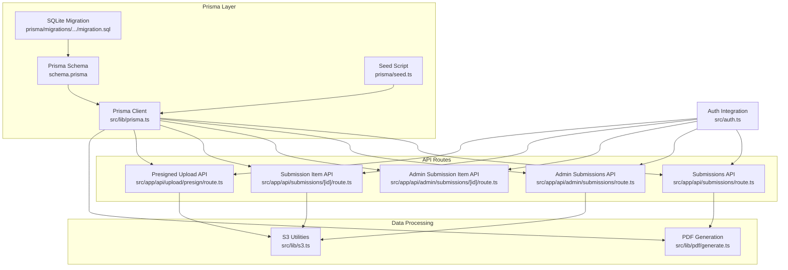
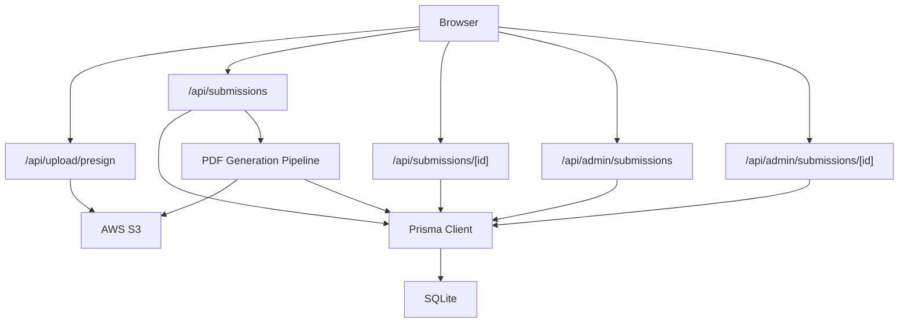
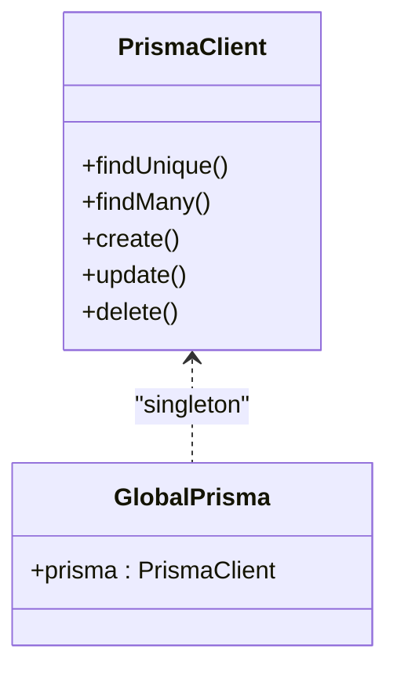
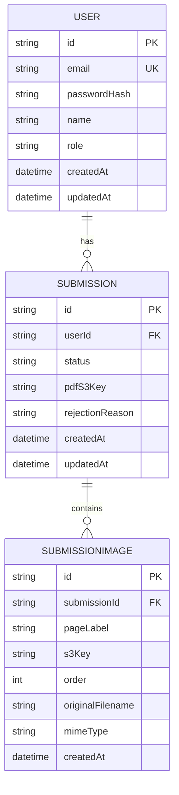
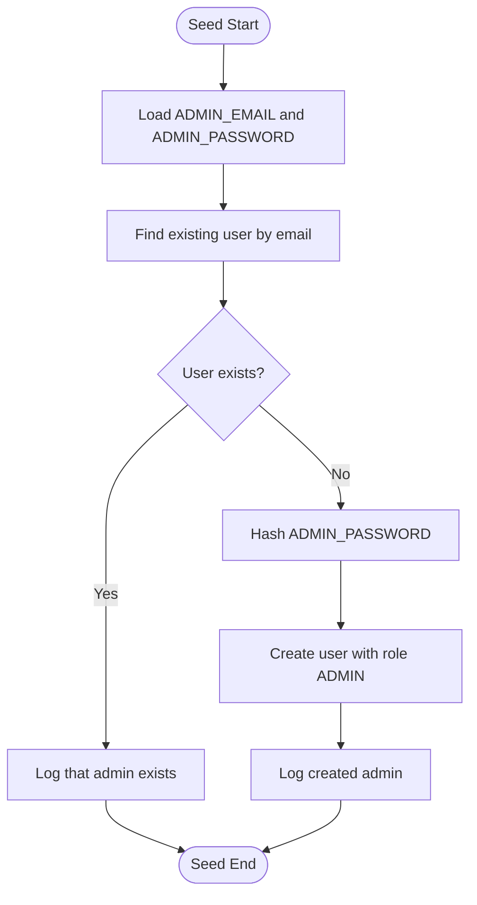
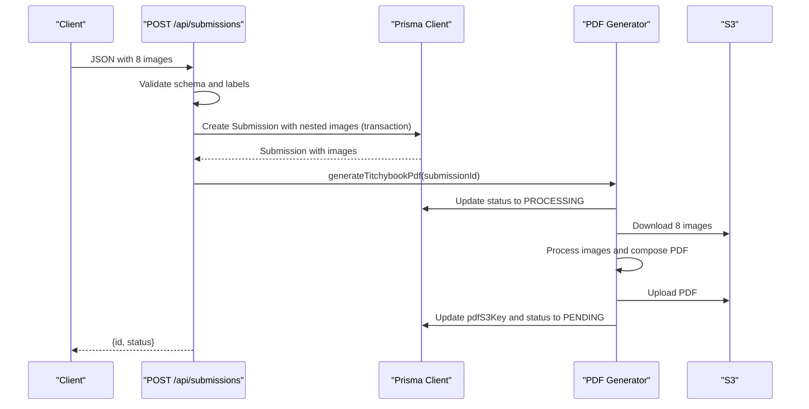
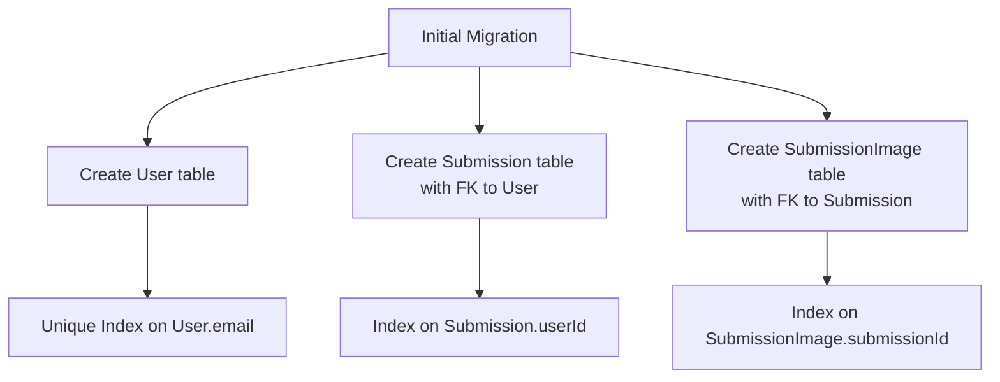
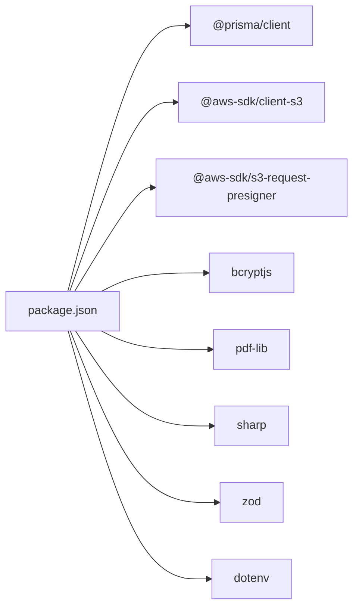

# Data Architecture

<cite>
**Referenced Files in This Document**
- [schema.prisma](file://prisma/schema.prisma)
- [prisma.ts](file://src/lib/prisma.ts)
- [seed.ts](file://prisma/seed.ts)
- [migration.sql](file://prisma/migrations/20260316171130_init/migration.sql)
- [route.ts](file://src/app/api/submissions/route.ts)
- [route.ts](file://src/app/api/admin/submissions/route.ts)
- [route.ts](file://src/app/api/admin/submissions/[id]/route.ts)
- [route.ts](file://src/app/api/submissions/[id]/route.ts)
- [route.ts](file://src/app/api/upload/presign/route.ts)
- [generate.ts](file://src/lib/pdf/generate.ts)
- [s3.ts](file://src/lib/s3.ts)
- [auth.ts](file://src/auth.ts)
- [constants.ts](file://src/lib/constants.ts)
- [ImageUploader.tsx](file://src/components/create/ImageUploader.tsx)
- [package.json](file://package.json)
</cite>

## Table of Contents
1. [Introduction](#introduction)
2. [Project Structure](#project-structure)
3. [Core Components](#core-components)
4. [Architecture Overview](#architecture-overview)
5. [Detailed Component Analysis](#detailed-component-analysis)
6. [Dependency Analysis](#dependency-analysis)
7. [Performance Considerations](#performance-considerations)
8. [Troubleshooting Guide](#troubleshooting-guide)
9. [Conclusion](#conclusion)
10. [Appendices](#appendices)

## Introduction
This document describes the data architecture of Titchybook Creator, focusing on the Prisma ORM implementation, database schema design, and the integration between the Prisma client and API routes. It explains the entities Users, Submissions, and SubmissionImages, their relationships, constraints, and how data flows through the system. It also covers authentication, submission tracking, image metadata storage, seeding strategy, query patterns, validation rules, transactions, migrations, and S3 integration for uploads and downloads.

## Project Structure
The data layer is organized around:
- Prisma schema defining models, relations, and indexes
- A singleton Prisma client initialized once per process
- API routes orchestrating data operations and integrating with S3
- PDF generation pipeline that composes images into a final PDF
- Seeding script to bootstrap admin credentials

**Diagram sources**
- [schema.prisma:1-48](file://prisma/schema.prisma#L1-L48)
- [prisma.ts:1-10](file://src/lib/prisma.ts#L1-L10)
- [migration.sql:1-45](file://prisma/migrations/20260316171130_init/migration.sql#L1-L45)
- [seed.ts:1-36](file://prisma/seed.ts#L1-L36)
- [route.ts:1-96](file://src/app/api/submissions/route.ts#L1-L96)
- [route.ts:1-38](file://src/app/api/admin/submissions/route.ts#L1-L38)
- [route.ts:1-63](file://src/app/api/admin/submissions/[id]/route.ts#L1-L63)
- [route.ts:1-37](file://src/app/api/submissions/[id]/route.ts#L1-L37)
- [route.ts:1-38](file://src/app/api/upload/presign/route.ts#L1-L38)
- [generate.ts:1-112](file://src/lib/pdf/generate.ts#L1-L112)
- [s3.ts:1-81](file://src/lib/s3.ts#L1-L81)
- [auth.ts:1-80](file://src/auth.ts#L1-L80)

**Section sources**
- [schema.prisma:1-48](file://prisma/schema.prisma#L1-L48)
- [prisma.ts:1-10](file://src/lib/prisma.ts#L1-L10)
- [migration.sql:1-45](file://prisma/migrations/20260316171130_init/migration.sql#L1-L45)
- [seed.ts:1-36](file://prisma/seed.ts#L1-L36)
- [route.ts:1-96](file://src/app/api/submissions/route.ts#L1-L96)
- [route.ts:1-38](file://src/app/api/admin/submissions/route.ts#L1-L38)
- [route.ts:1-63](file://src/app/api/admin/submissions/[id]/route.ts#L1-L63)
- [route.ts:1-37](file://src/app/api/submissions/[id]/route.ts#L1-L37)
- [route.ts:1-38](file://src/app/api/upload/presign/route.ts#L1-L38)
- [generate.ts:1-112](file://src/lib/pdf/generate.ts#L1-L112)
- [s3.ts:1-81](file://src/lib/s3.ts#L1-L81)
- [auth.ts:1-80](file://src/auth.ts#L1-L80)

## Core Components
- Prisma Client: Singleton client initialized once and reused across the app to ensure efficient connection management and avoid hot-reload leaks.
- Prisma Schema: Defines three entities with explicit relations and indexes for performance and integrity.
- API Routes: Implement CRUD and orchestration for submissions, admin review, and presigned S3 uploads.
- PDF Generation: Orchestrates fetching images from S3, processing them, composing a PDF, uploading to S3, and updating the submission record.
- S3 Utilities: Provide presigned URLs for uploads/downloads and direct S3 operations.
- Authentication: Integrates NextAuth with Prisma to manage user sessions and roles.

**Section sources**
- [prisma.ts:1-10](file://src/lib/prisma.ts#L1-L10)
- [schema.prisma:10-47](file://prisma/schema.prisma#L10-L47)
- [route.ts:1-96](file://src/app/api/submissions/route.ts#L1-L96)
- [generate.ts:13-112](file://src/lib/pdf/generate.ts#L13-L112)
- [s3.ts:1-81](file://src/lib/s3.ts#L1-L81)
- [auth.ts:27-80](file://src/auth.ts#L27-L80)

## Architecture Overview
The data architecture follows a layered pattern:
- Presentation: Next.js App Router API routes
- Application: Validation via Zod, business logic, and orchestration
- Persistence: Prisma ORM with SQLite
- Storage: AWS S3 for images and generated PDFs
- Security: NextAuth JWT session with role-based access control

**Diagram sources**
- [route.ts:1-96](file://src/app/api/submissions/route.ts#L1-L96)
- [route.ts:1-37](file://src/app/api/submissions/[id]/route.ts#L1-L37)
- [route.ts:1-38](file://src/app/api/admin/submissions/route.ts#L1-L38)
- [route.ts:1-63](file://src/app/api/admin/submissions/[id]/route.ts#L1-L63)
- [route.ts:1-38](file://src/app/api/upload/presign/route.ts#L1-L38)
- [generate.ts:13-112](file://src/lib/pdf/generate.ts#L13-L112)
- [s3.ts:1-81](file://src/lib/s3.ts#L1-L81)
- [prisma.ts:1-10](file://src/lib/prisma.ts#L1-L10)
- [migration.sql:1-45](file://prisma/migrations/20260316171130_init/migration.sql#L1-L45)

## Detailed Component Analysis

### Prisma ORM and Client Initialization
- Provider and datasource: SQLite provider configured via DATABASE_URL environment variable.
- Client lifecycle: Singleton pattern ensures one client instance per process, avoiding multiple connections and leaks during development.
- Global client assignment prevents hot reload duplication in non-production environments.

**Diagram sources**
- [prisma.ts:1-10](file://src/lib/prisma.ts#L1-L10)

**Section sources**
- [schema.prisma:5-8](file://prisma/schema.prisma#L5-L8)
- [prisma.ts:1-10](file://src/lib/prisma.ts#L1-L10)

### Database Schema Design
Entities and relationships:
- User
  - Fields: id, email (unique), passwordHash, name, role (default USER), timestamps.
  - Relations: one-to-many to Submission via userId.
- Submission
  - Fields: id, userId (foreign key), status (default PENDING), optional pdfS3Key, optional rejectionReason, timestamps.
  - Indexes: composite index on userId for fast lookup by user.
  - Relations: belongs to User; one-to-many to SubmissionImage via submissionId.
- SubmissionImage
  - Fields: id, submissionId (foreign key), pageLabel, s3Key, order, originalFilename, mimeType, timestamps.
  - Indexes: composite index on submissionId for fast image retrieval ordered by page.
  - Relations: belongs to Submission with cascade delete on parent deletion.

Constraints and defaults:
- Unique constraint on User.email enforced at schema and migration level.
- Foreign key constraints:
  - Submission.userId → User.id (RESTRICT on delete, CASCADE on update).
  - SubmissionImage.submissionId → Submission.id (CASCADE on delete, CASCADE on update).

**Diagram sources**
- [schema.prisma:10-47](file://prisma/schema.prisma#L10-L47)
- [migration.sql:1-45](file://prisma/migrations/20260316171130_init/migration.sql#L1-L45)

**Section sources**
- [schema.prisma:10-47](file://prisma/schema.prisma#L10-L47)
- [migration.sql:1-45](file://prisma/migrations/20260316171130_init/migration.sql#L1-L45)

### Data Modeling Approach
- Authentication: Users are stored with hashed passwords; NextAuth integrates with Prisma to authenticate and manage sessions with role-based access control.
- Submission Tracking: Each submission is owned by a user and progresses through statuses (PENDING, APPROVED, REJECTED, PROCESSING). Administrators can approve or reject submissions and optionally provide rejection reasons.
- Image Metadata: Each SubmissionImage stores S3 key, page label, ordering, original filename, and MIME type. Images are ordered by the order field and grouped by submissionId.

Validation and constraints:
- Submission creation enforces exactly 8 unique page labels and validates numeric order range.
- PDF generation sets status to PROCESSING while composing, then resets to PENDING after upload.
- Access control ensures only the owner or admins can access a submission; admins can generate presigned download URLs for PDFs.

**Section sources**
- [auth.ts:27-80](file://src/auth.ts#L27-L80)
- [constants.ts:6-49](file://src/lib/constants.ts#L6-L49)
- [route.ts:35-95](file://src/app/api/submissions/route.ts#L35-L95)
- [route.ts:12-62](file://src/app/api/admin/submissions/[id]/route.ts#L12-L62)
- [generate.ts:23-112](file://src/lib/pdf/generate.ts#L23-L112)

### Seeding Strategy
- Seeds an admin user if not present using environment variables for email and password.
- Hashes the password with bcrypt before storing.
- Role is set to ADMIN for the seeded user.

**Diagram sources**
- [seed.ts:7-35](file://prisma/seed.ts#L7-L35)

**Section sources**
- [seed.ts:1-36](file://prisma/seed.ts#L1-L36)

### Data Access Patterns and Transactions
- Read-heavy queries:
  - List submissions for a user ordered by creation date.
  - Retrieve a single submission with images ordered by page order.
  - Admin list submissions optionally filtered by status, including user info and presigned PDF URLs.
- Write operations:
  - Create submission with nested images in a single transaction to maintain atomicity.
  - Update submission status and rejection reason with validation.
- Asynchronous PDF generation:
  - Submission creation triggers background PDF generation without blocking the request.
  - PDF generation updates status to PROCESSING, uploads the PDF to S3, and resets status to PENDING.

**Diagram sources**
- [route.ts:35-95](file://src/app/api/submissions/route.ts#L35-L95)
- [generate.ts:23-112](file://src/lib/pdf/generate.ts#L23-L112)

**Section sources**
- [route.ts:20-33](file://src/app/api/submissions/route.ts#L20-L33)
- [route.ts:35-95](file://src/app/api/submissions/route.ts#L35-L95)
- [route.ts:6-37](file://src/app/api/submissions/[id]/route.ts#L6-L37)
- [route.ts:6-37](file://src/app/api/admin/submissions/route.ts#L6-L37)
- [route.ts:12-62](file://src/app/api/admin/submissions/[id]/route.ts#L12-L62)
- [generate.ts:23-112](file://src/lib/pdf/generate.ts#L23-L112)

### Transaction Handling
- Submission creation uses nested create under a single Prisma transaction to ensure either all images are saved or none are, maintaining referential integrity.
- PDF generation updates status atomically before and after processing to prevent concurrent runs.

**Section sources**
- [route.ts:64-78](file://src/app/api/submissions/route.ts#L64-L78)
- [generate.ts:27-30](file://src/lib/pdf/generate.ts#L27-L30)
- [generate.ts:102-108](file://src/lib/pdf/generate.ts#L102-L108)

### Integration Between Prisma Client and API Routes
- All API routes import the shared Prisma client and apply authentication guards.
- Admin-only routes check role before performing operations.
- Presigned URL generation uses S3 utilities to securely upload images directly to S3.

**Section sources**
- [route.ts:1-96](file://src/app/api/submissions/route.ts#L1-L96)
- [route.ts:1-38](file://src/app/api/admin/submissions/route.ts#L1-L38)
- [route.ts:1-63](file://src/app/api/admin/submissions/[id]/route.ts#L1-L63)
- [route.ts:1-37](file://src/app/api/submissions/[id]/route.ts#L1-L37)
- [route.ts:1-38](file://src/app/api/upload/presign/route.ts#L1-L38)
- [s3.ts:18-36](file://src/lib/s3.ts#L18-L36)

### Migration Strategy
- Initial migration defines tables, primary keys, foreign keys, and indexes.
- Unique index on User.email ensures uniqueness.
- Indexes on Submission.userId and SubmissionImage.submissionId optimize joins and filtering.

**Diagram sources**
- [migration.sql:1-45](file://prisma/migrations/20260316171130_init/migration.sql#L1-L45)

**Section sources**
- [migration.sql:1-45](file://prisma/migrations/20260316171130_init/migration.sql#L1-L45)

## Dependency Analysis
External dependencies relevant to data:
- @prisma/client: ORM client
- @aws-sdk/client-s3 and @aws-sdk/s3-request-presigner: S3 integration
- bcryptjs: Password hashing
- pdf-lib and sharp: PDF composition and image processing
- zod: Request validation
- dotenv: Environment configuration

**Diagram sources**
- [package.json:11-28](file://package.json#L11-L28)

**Section sources**
- [package.json:11-28](file://package.json#L11-L28)

## Performance Considerations
- Indexes: Ensure efficient lookups on foreign keys and unique identifiers.
- Batch operations: Parallelize S3 downloads and image processing during PDF generation.
- Asynchronous workflows: Offload long-running tasks (PDF generation) to avoid blocking API responses.
- Connection reuse: Singleton Prisma client prevents connection overhead.
- Pagination: Use orderBy and where clauses judiciously; leverage indexes for sorting and filtering.

## Troubleshooting Guide
Common issues and mitigations:
- Unauthorized access: Ensure auth guard checks are in place for all protected routes.
- Missing required parameters: Validate presence of filename, contentType, submissionId, and pageLabel in presigned upload endpoint.
- Invalid file types: Enforce accepted MIME types before generating presigned URLs.
- PDF generation failures: Catch errors and log them; status transitions prevent concurrent runs.
- S3 connectivity: Verify AWS credentials and bucket name; ensure presigned URLs are generated with correct content types.

**Section sources**
- [route.ts:6-37](file://src/app/api/upload/presign/route.ts#L6-L37)
- [generate.ts:81-83](file://src/lib/pdf/generate.ts#L81-L83)
- [s3.ts:8-14](file://src/lib/s3.ts#L8-L14)

## Conclusion
The data architecture leverages Prisma ORM for type-safe, relational data management with SQLite, complemented by AWS S3 for scalable media storage. Strong entity relationships, indexes, and transactions ensure data integrity. NextAuth integrates seamlessly with Prisma for secure, role-aware access control. The API routes encapsulate validation and orchestration, while asynchronous PDF generation improves responsiveness. The migration strategy and seeding script provide a reproducible baseline for development and production.

## Appendices

### API Endpoints and Responsibilities
- GET /api/submissions: List current user’s submissions with images ordered by page.
- POST /api/submissions: Create a submission with 8 images; trigger background PDF generation.
- GET /api/submissions/[id]: Retrieve a submission by ID with presigned PDF download URL if available.
- GET /api/admin/submissions: Admin-only listing with optional status filter and user info.
- PATCH /api/admin/submissions/[id]: Approve or reject a submission; set rejection reason when applicable.
- GET /api/upload/presign: Generate presigned upload URL for direct S3 upload with validation.

**Section sources**
- [route.ts:1-96](file://src/app/api/submissions/route.ts#L1-L96)
- [route.ts:1-37](file://src/app/api/submissions/[id]/route.ts#L1-L37)
- [route.ts:1-38](file://src/app/api/admin/submissions/route.ts#L1-L38)
- [route.ts:1-63](file://src/app/api/admin/submissions/[id]/route.ts#L1-L63)
- [route.ts:1-38](file://src/app/api/upload/presign/route.ts#L1-L38)