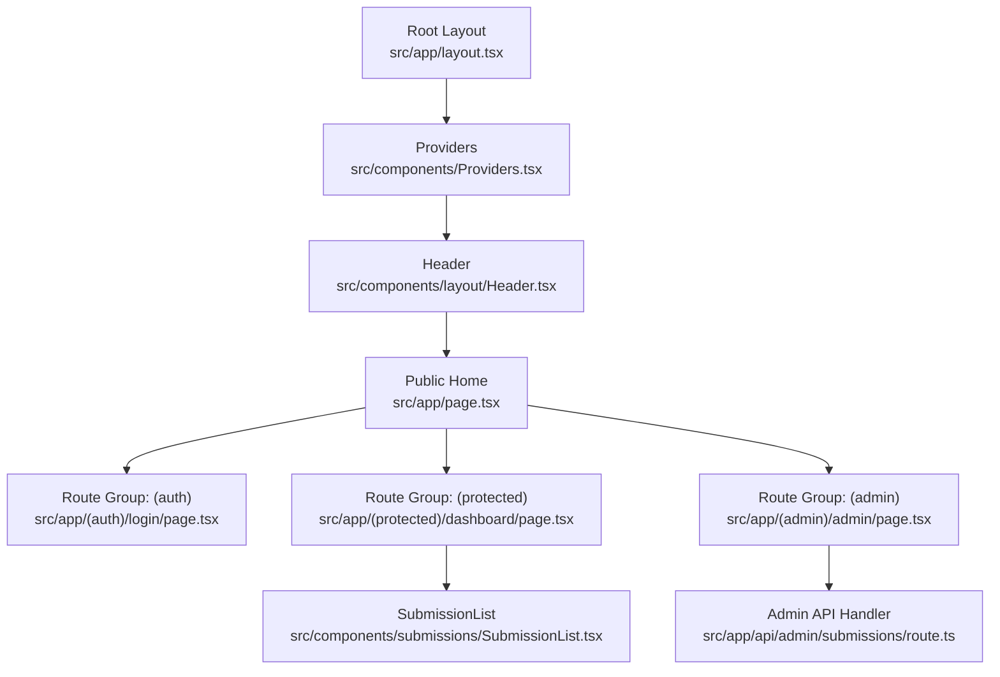
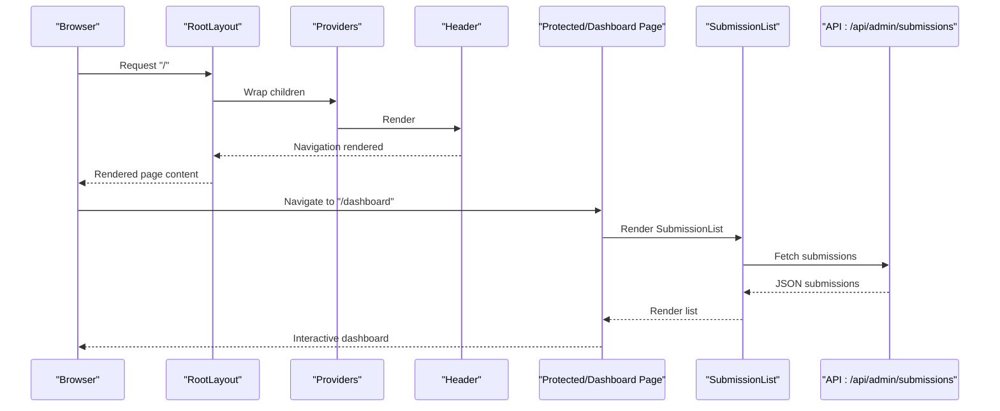
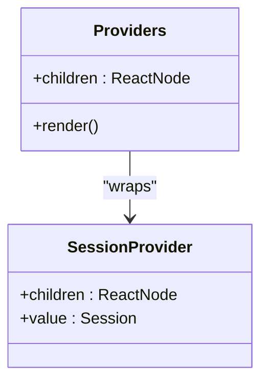
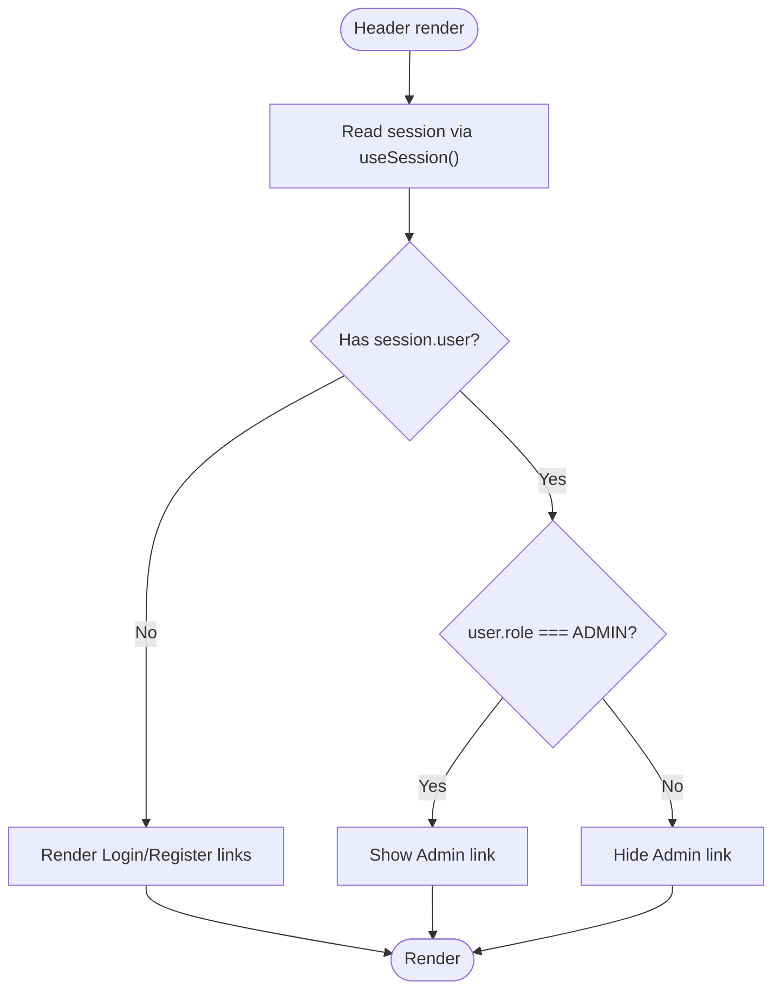
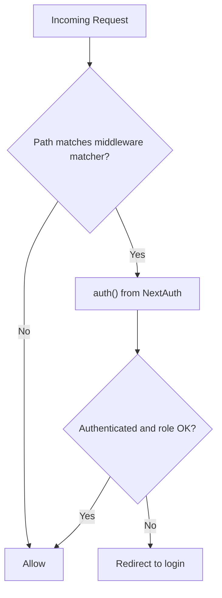
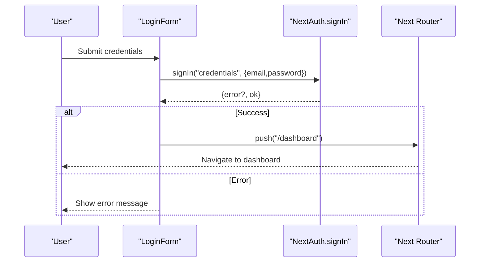
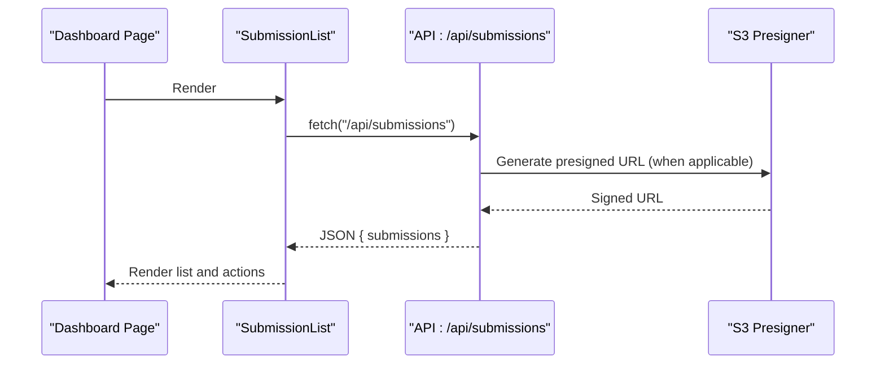
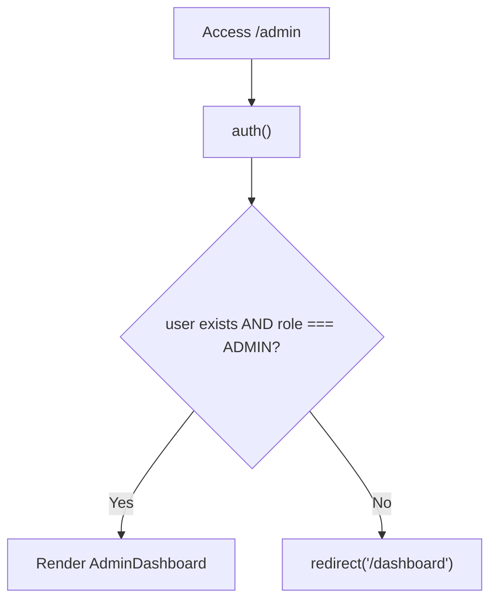
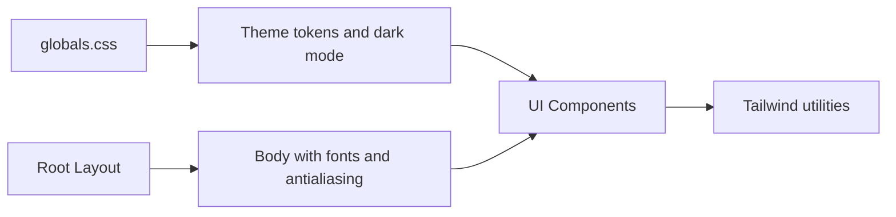
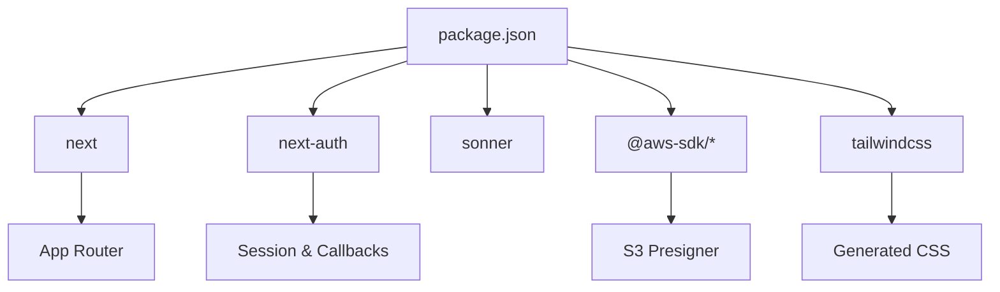

# Frontend Architecture

<cite>
**Referenced Files in This Document**
- [src/app/layout.tsx](file://src/app/layout.tsx)
- [src/components/Providers.tsx](file://src/components/Providers.tsx)
- [src/components/layout/Header.tsx](file://src/components/layout/Header.tsx)
- [src/middleware.ts](file://src/middleware.ts)
- [src/auth.ts](file://src/auth.ts)
- [src/app/page.tsx](file://src/app/page.tsx)
- [src/app/(auth)/login/page.tsx](file://src/app/(auth)/login/page.tsx)
- [src/components/auth/LoginForm.tsx](file://src/components/auth/LoginForm.tsx)
- [src/app/(protected)/dashboard/page.tsx](file://src/app/(protected)/dashboard/page.tsx)
- [src/app/(admin)/admin/page.tsx](file://src/app/(admin)/admin/page.tsx)
- [src/components/submissions/SubmissionList.tsx](file://src/components/submissions/SubmissionList.tsx)
- [src/app/api/admin/submissions/route.ts](file://src/app/api/admin/submissions/route.ts)
- [src/app/globals.css](file://src/app/globals.css)
- [package.json](file://package.json)
- [next.config.ts](file://next.config.ts)
</cite>

## Table of Contents
1. [Introduction](#introduction)
2. [Project Structure](#project-structure)
3. [Core Components](#core-components)
4. [Architecture Overview](#architecture-overview)
5. [Detailed Component Analysis](#detailed-component-analysis)
6. [Dependency Analysis](#dependency-analysis)
7. [Performance Considerations](#performance-considerations)
8. [Troubleshooting Guide](#troubleshooting-guide)
9. [Conclusion](#conclusion)

## Introduction
This document describes the frontend architecture of Titchybook Creator’s Next.js application. It focuses on the App Router implementation with route groups for authentication, protected routes, and admin functionality; the component hierarchy from the root layout through Providers to individual pages; the Providers pattern for session management and state sharing; routing strategy and access control; the header component and navigation; client–server boundary concepts; data fetching patterns; styling architecture with Tailwind CSS; and component composition patterns across auth, protected, and admin page types.

## Project Structure
The application follows Next.js App Router conventions with route groups to organize pages by responsibility and access control:
- Public home page and marketing content
- Authentication route group for login/register
- Protected route group for authenticated user dashboards and creation flows
- Admin route group for administrative views and moderation

Key files:
- Root layout initializes fonts, global styles, Providers, and shared header
- Middleware enforces authentication and role checks for protected paths
- Route group pages render page-specific content and delegate to domain components
- Shared UI components encapsulate presentation and interactions

**Diagram sources**
- [src/app/layout.tsx:23-41](file://src/app/layout.tsx#L23-L41)
- [src/components/Providers.tsx:5-7](file://src/components/Providers.tsx#L5-L7)
- [src/components/layout/Header.tsx:6-68](file://src/components/layout/Header.tsx#L6-L68)
- [src/app/page.tsx:3-60](file://src/app/page.tsx#L3-L60)
- [src/app/(auth)/login/page.tsx:3-12](file://src/app/(auth)/login/page.tsx#L3-L12)
- [src/app/(protected)/dashboard/page.tsx:4-19](file://src/app/(protected)/dashboard/page.tsx#L4-L19)
- [src/app/(admin)/admin/page.tsx:5-12](file://src/app/(admin)/admin/page.tsx#L5-L12)
- [src/components/submissions/SubmissionList.tsx:15-118](file://src/components/submissions/SubmissionList.tsx#L15-L118)
- [src/app/api/admin/submissions/route.ts:6-37](file://src/app/api/admin/submissions/route.ts#L6-L37)

**Section sources**
- [src/app/layout.tsx:18-41](file://src/app/layout.tsx#L18-L41)
- [src/middleware.ts:1-6](file://src/middleware.ts#L1-L6)

## Core Components
- Root layout: Sets metadata, fonts, global CSS, wraps children in Providers, renders Header, and passes page content into a main container.
- Providers: A client component that wraps the app subtree with NextAuth’s SessionProvider to share session state across components.
- Header: A client component that reads session state via next-auth/react hooks and renders navigation links conditionally based on authentication and role.
- Middleware: Uses NextAuth’s auth export to enforce authentication and restricts access to protected paths.

**Section sources**
- [src/app/layout.tsx:18-41](file://src/app/layout.tsx#L18-L41)
- [src/components/Providers.tsx:1-8](file://src/components/Providers.tsx#L1-L8)
- [src/components/layout/Header.tsx:1-69](file://src/components/layout/Header.tsx#L1-L69)
- [src/middleware.ts:1-6](file://src/middleware.ts#L1-L6)

## Architecture Overview
The frontend architecture centers on:
- App Router with route groups to segment auth, protected, and admin areas
- Strict client–server boundary: client components use hooks and state; server components and API handlers manage authentication and data access
- Providers pattern for session propagation and shared state
- Tailwind CSS for styling with theme tokens and responsive design
- Component composition: page components orchestrate domain components (e.g., SubmissionList)

**Diagram sources**
- [src/app/layout.tsx:23-41](file://src/app/layout.tsx#L23-L41)
- [src/components/Providers.tsx:5-7](file://src/components/Providers.tsx#L5-L7)
- [src/components/layout/Header.tsx:6-68](file://src/components/layout/Header.tsx#L6-L68)
- [src/app/(protected)/dashboard/page.tsx:4-19](file://src/app/(protected)/dashboard/page.tsx#L4-L19)
- [src/components/submissions/SubmissionList.tsx:15-118](file://src/components/submissions/SubmissionList.tsx#L15-L118)
- [src/app/api/admin/submissions/route.ts:6-37](file://src/app/api/admin/submissions/route.ts#L6-L37)

## Detailed Component Analysis

### Providers Pattern and Session Management
- Providers is a client component that wraps the app subtree with NextAuth’s SessionProvider. This makes session data available to any downstream client component via next-auth/react hooks.
- The session carries user identity and role, enabling conditional rendering in the Header and enforcing access in middleware and server-side code.

**Diagram sources**
- [src/components/Providers.tsx:5-7](file://src/components/Providers.tsx#L5-L7)

**Section sources**
- [src/components/Providers.tsx:1-8](file://src/components/Providers.tsx#L1-L8)

### Header Component and Navigation
- Header is a client component that reads session state and conditionally renders:
  - Unauthenticated: links to login and register
  - Authenticated: links to dashboard and create; admin-only link appears when role equals ADMIN
- It also provides a sign-out action that redirects to the home page.

**Diagram sources**
- [src/components/layout/Header.tsx:6-68](file://src/components/layout/Header.tsx#L6-L68)

**Section sources**
- [src/components/layout/Header.tsx:1-69](file://src/components/layout/Header.tsx#L1-L69)

### Routing Strategy with Route Groups and Access Control
- Route groups:
  - (auth): login and register pages
  - (protected): dashboard and creation flows
  - (admin): admin-only pages
- Middleware enforces authentication and role checks for protected paths:
  - Matcher targets dashboard, create, and admin routes
  - Redirects unauthenticated users to login
- Admin page performs an async role check and redirects non-admin users to dashboard.

**Diagram sources**
- [src/middleware.ts:3-5](file://src/middleware.ts#L3-L5)
- [src/app/(admin)/admin/page.tsx:5-12](file://src/app/(admin)/admin/page.tsx#L5-L12)

**Section sources**
- [src/middleware.ts:1-6](file://src/middleware.ts#L1-L6)
- [src/app/(admin)/admin/page.tsx:5-12](file://src/app/(admin)/admin/page.tsx#L5-L12)

### Authentication Implementation
- NextAuth configuration defines:
  - Credentials provider with email/password
  - JWT-based session strategy
  - Custom JWT and session callbacks to attach user role
  - Redirects to login page on sign-in
- LoginForm is a client component that:
  - Collects credentials
  - Calls signIn with credentials provider
  - Handles errors and navigates to dashboard on success

**Diagram sources**
- [src/components/auth/LoginForm.tsx:14-33](file://src/components/auth/LoginForm.tsx#L14-L33)
- [src/auth.ts:27-79](file://src/auth.ts#L27-L79)

**Section sources**
- [src/auth.ts:1-80](file://src/auth.ts#L1-L80)
- [src/app/(auth)/login/page.tsx:1-13](file://src/app/(auth)/login/page.tsx#L1-L13)
- [src/components/auth/LoginForm.tsx:1-86](file://src/components/auth/LoginForm.tsx#L1-L86)

### Protected Routes and Data Fetching
- Protected pages (e.g., dashboard) render domain components that fetch data from API routes.
- SubmissionList is a client component that:
  - Fetches submissions from a server endpoint
  - Renders loading skeletons, empty state, and interactive cards
  - Initiates PDF downloads via signed URLs returned from the server

**Diagram sources**
- [src/app/(protected)/dashboard/page.tsx:4-19](file://src/app/(protected)/dashboard/page.tsx#L4-L19)
- [src/components/submissions/SubmissionList.tsx:15-118](file://src/components/submissions/SubmissionList.tsx#L15-L118)
- [src/app/api/admin/submissions/route.ts:6-37](file://src/app/api/admin/submissions/route.ts#L6-L37)

**Section sources**
- [src/app/(protected)/dashboard/page.tsx:1-20](file://src/app/(protected)/dashboard/page.tsx#L1-L20)
- [src/components/submissions/SubmissionList.tsx:1-119](file://src/components/submissions/SubmissionList.tsx#L1-L119)
- [src/app/api/admin/submissions/route.ts:1-38](file://src/app/api/admin/submissions/route.ts#L1-L38)

### Admin Functionality and Role-Based Access
- Admin page performs an async role check using NextAuth’s auth function and redirects non-admin users to the dashboard.
- Admin API handler validates admin role and returns submissions with presigned download URLs for PDFs.

**Diagram sources**
- [src/app/(admin)/admin/page.tsx:5-12](file://src/app/(admin)/admin/page.tsx#L5-L12)
- [src/app/api/admin/submissions/route.ts:6-10](file://src/app/api/admin/submissions/route.ts#L6-L10)

**Section sources**
- [src/app/(admin)/admin/page.tsx:1-13](file://src/app/(admin)/admin/page.tsx#L1-L13)
- [src/app/api/admin/submissions/route.ts:1-38](file://src/app/api/admin/submissions/route.ts#L1-L38)

### Client–Server Boundary and Data Fetching Patterns
- Client components:
  - Use next-auth/react hooks for session state
  - Use fetch to call API routes
  - Manage local state for forms and UI interactions
- Server components and API handlers:
  - Perform authentication and authorization checks
  - Access Prisma and AWS S3 to compute presigned URLs
  - Return sanitized JSON responses

**Section sources**
- [src/components/layout/Header.tsx:3-7](file://src/components/layout/Header.tsx#L3-L7)
- [src/components/auth/LoginForm.tsx:8-33](file://src/components/auth/LoginForm.tsx#L8-L33)
- [src/components/submissions/SubmissionList.tsx:19-24](file://src/components/submissions/SubmissionList.tsx#L19-L24)
- [src/app/api/admin/submissions/route.ts:6-37](file://src/app/api/admin/submissions/route.ts#L6-L37)

### Styling Architecture with Tailwind CSS
- Global CSS imports Tailwind and defines theme tokens for background and foreground, with dark mode support.
- Root layout applies font variables and base antialiasing class to the body.
- Components use Tailwind utilities for responsive layouts, spacing, and interactive states.

**Diagram sources**
- [src/app/globals.css:1-27](file://src/app/globals.css#L1-L27)
- [src/app/layout.tsx:30-32](file://src/app/layout.tsx#L30-L32)

**Section sources**
- [src/app/globals.css:1-27](file://src/app/globals.css#L1-L27)
- [src/app/layout.tsx:8-16](file://src/app/layout.tsx#L8-L16)

## Dependency Analysis
External dependencies relevant to frontend architecture:
- next: App Router, metadata, font loading
- next-auth: Authentication, session management, JWT callbacks
- sonner: Toast notifications
- @aws-sdk: S3 integration for presigned URLs
- tailwindcss v4: Utility-first styling

**Diagram sources**
- [package.json:11-24](file://package.json#L11-L24)

**Section sources**
- [package.json:1-43](file://package.json#L1-L43)

## Performance Considerations
- Prefer client components only where interactivity is required (e.g., forms, lists with client-side actions).
- Keep server components for data fetching and authorization to minimize client payload.
- Use skeleton loaders in client components while data loads.
- Cache and reuse presigned URLs when appropriate to reduce repeated S3 calls.
- Leverage Next.js static generation and ISR where feasible for public content.

## Troubleshooting Guide
Common issues and resolutions:
- Authentication loops or redirects:
  - Verify middleware matcher and auth configuration
  - Ensure credentials provider returns user with role
- Session not available in client components:
  - Confirm Providers wraps the app subtree
  - Check that components using session are client components
- Admin page inaccessible:
  - Confirm user role is ADMIN in JWT/session
  - Verify redirect logic in admin page
- API requests failing:
  - Check server-side auth guards and role checks
  - Validate S3 presigned URL generation

**Section sources**
- [src/middleware.ts:3-5](file://src/middleware.ts#L3-L5)
- [src/auth.ts:65-79](file://src/auth.ts#L65-L79)
- [src/app/(admin)/admin/page.ts:7-9](file://src/app/(admin)/admin/page.tsx#L7-L9)
- [src/app/api/admin/submissions/route.ts:7-10](file://src/app/api/admin/submissions/route.ts#L7-L10)

## Conclusion
The frontend architecture leverages Next.js App Router with route groups to cleanly separate auth, protected, and admin concerns. The Providers pattern centralizes session management, while middleware and server-side guards enforce access control. Client–server boundaries are respected: client components handle interactivity and UI, while server components and API handlers manage authentication, authorization, and data access. Tailwind CSS provides a consistent, theme-aware styling system, and component composition promotes reusability across page types.