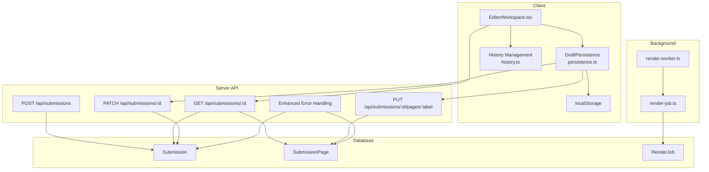
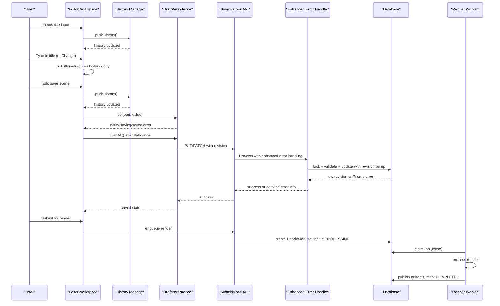
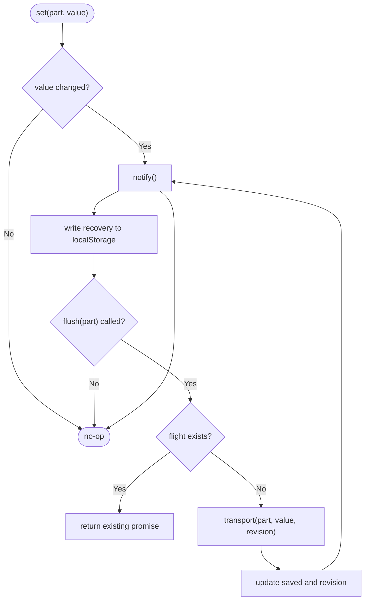
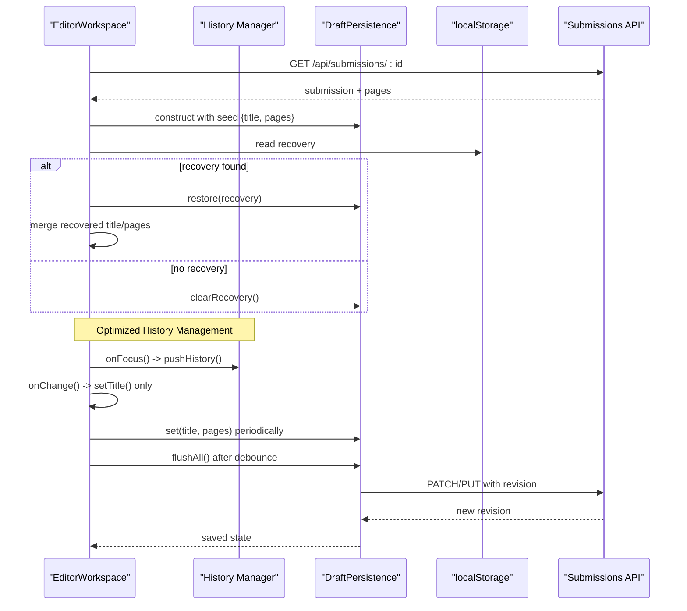
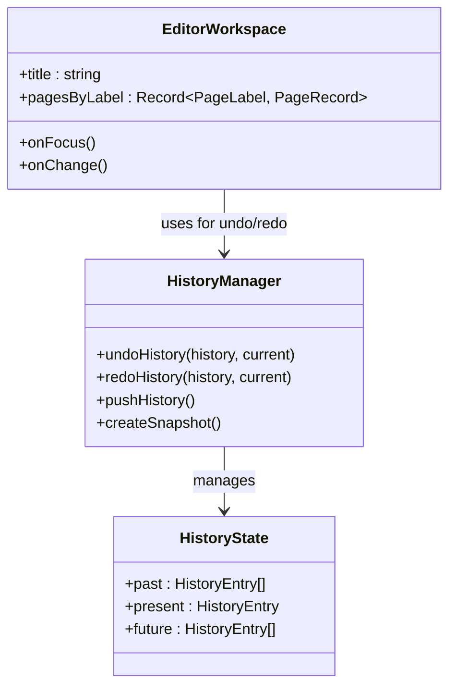
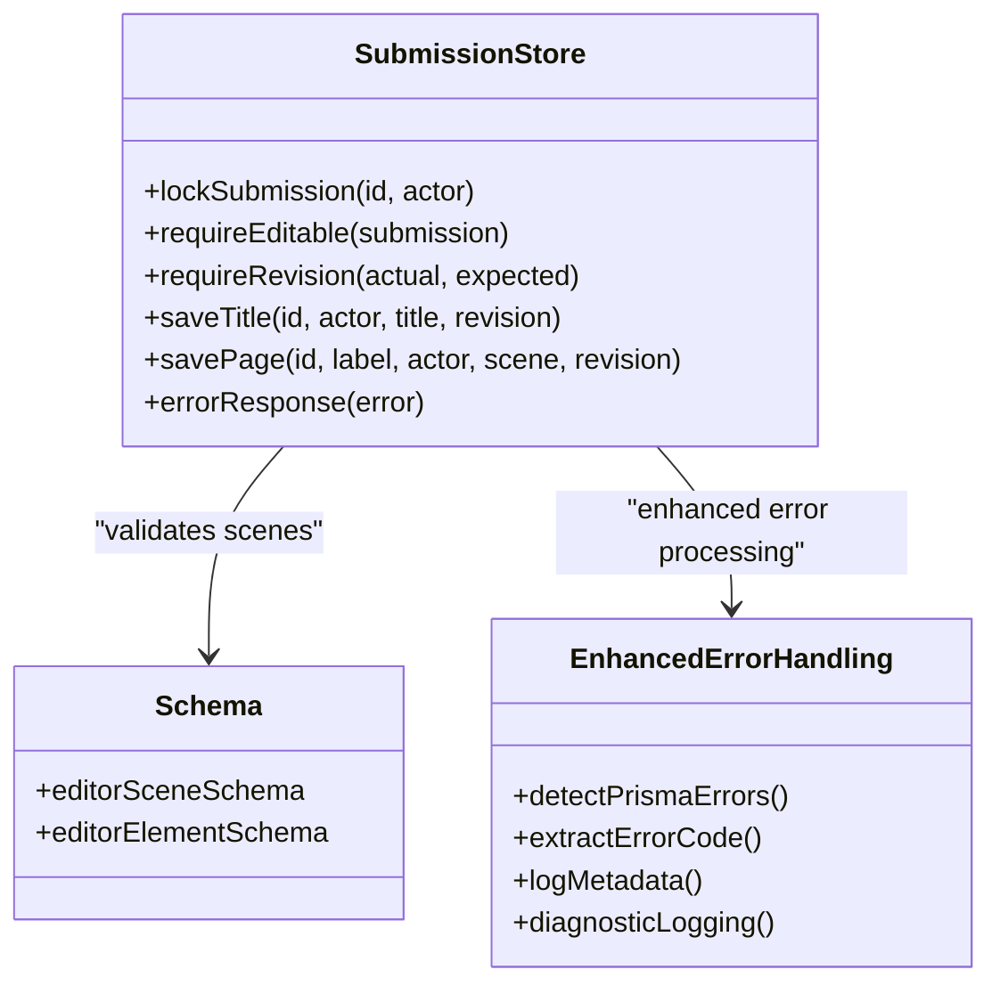
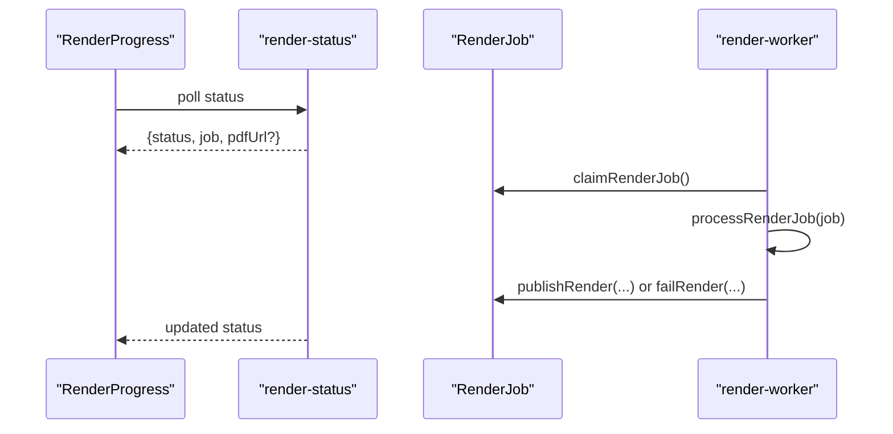
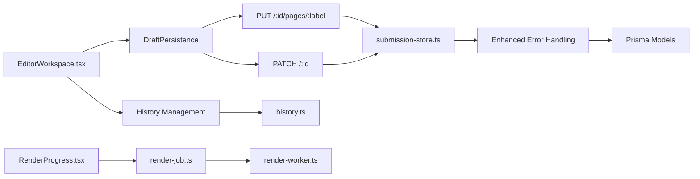

# Editor Persistence & Draft Recovery

<cite>
**Referenced Files in This Document**
- [persistence.ts](file://src/lib/editor/persistence.ts)
- [EditorWorkspace.tsx](file://src/components/editor/EditorWorkspace.tsx)
- [submission-store.ts](file://src/lib/editor/submission-store.ts)
- [route.ts (submissions)](file://src/app/api/submissions/route.ts)
- [route.ts (submission by id)](file://src/app/api/submissions/[id]/route.ts)
- [route.ts (page save/load)](file://src/app/api/submissions/[id]/pages/[pageLabel]/route.ts)
- [schema.ts](file://src/lib/editor/schema.ts)
- [validation.ts](file://src/lib/editor/validation.ts)
- [render-job.ts](file://src/lib/pdf/render-job.ts)
- [render-worker.ts](file://src/workers/render-worker.ts)
- [RenderProgress.tsx](file://src/components/submissions/RenderProgress.tsx)
- [ContinueEditingButton.tsx](file://src/components/dashboard/ContinueEditingButton.tsx)
- [history.ts](file://src/lib/editor/history.ts)
- [persistence.test.ts](file://tests/unit/persistence.test.ts)
- [editor.spec.ts](file://tests/browser/editor.spec.ts)
</cite>

## Update Summary
**Changes Made**
- Enhanced error handling section with improved Prisma error logging and diagnostic capabilities
- Updated submission store error response functionality with intelligent error detection
- Added detailed troubleshooting guidance for database-related issues
- Enhanced error reporting with code extraction and metadata logging
- **Updated**: Improved editor history management in title input handling with separated focus-based history entry creation

## Table of Contents
1. [Introduction](#introduction)
2. [Project Structure](#project-structure)
3. [Core Components](#core-components)
4. [Architecture Overview](#architecture-overview)
5. [Detailed Component Analysis](#detailed-component-analysis)
6. [Dependency Analysis](#dependency-analysis)
7. [Performance Considerations](#performance-considerations)
8. [Troubleshooting Guide](#troubleshooting-guide)
9. [Conclusion](#conclusion)

## Introduction
This document explains how the editor persists drafts and recovers unsaved changes across reloads, tabs, and network failures. It covers the client-side persistence layer, server-side revision control, background rendering jobs, and UI recovery flows that keep user work safe and consistent. The system now includes enhanced error handling with improved Prisma error logging and diagnostic capabilities for better database issue diagnosis, along with optimized history management for improved user experience.

## Project Structure
The editor persistence system spans three layers:
- Client persistence and recovery: local storage-backed draft state with optimistic updates and coalesced saves.
- Server-side submission store: validated, versioned writes to Submission and SubmissionPage records with enhanced error handling.
- Background rendering pipeline: durable job queue for export and status polling.

**Diagram sources**
- [EditorWorkspace.tsx:432-771](file://src/components/editor/EditorWorkspace.tsx#L432-L771)
- [persistence.ts:11-122](file://src/lib/editor/persistence.ts#L11-L122)
- [history.ts:1-10](file://src/lib/editor/history.ts#L1-L10)
- [route.ts (submissions):52-148](file://src/app/api/submissions/route.ts#L52-L148)
- [route.ts (submission by id):18-160](file://src/app/api/submissions/[id]/route.ts#L18-L160)
- [route.ts (page save/load):11-42](file://src/app/api/submissions/[id]/pages/[pageLabel]/route.ts#L11-L42)
- [submission-store.ts:14-30](file://src/lib/editor/submission-store.ts#L14-L30)
- [render-job.ts:21-86](file://src/lib/pdf/render-job.ts#L21-L86)
- [render-worker.ts:1-32](file://src/workers/render-worker.ts#L1-L32)

**Section sources**
- [EditorWorkspace.tsx:432-771](file://src/components/editor/EditorWorkspace.tsx#L432-L771)
- [persistence.ts:11-122](file://src/lib/editor/persistence.ts#L11-L122)
- [history.ts:1-10](file://src/lib/editor/history.ts#L1-L10)
- [route.ts (submissions):52-148](file://src/app/api/submissions/route.ts#L52-L148)
- [route.ts (submission by id):18-160](file://src/app/api/submissions/[id]/route.ts#L18-L160)
- [route.ts (page save/load):11-42](file://src/app/api/submissions/[id]/pages/[pageLabel]/route.ts#L11-L42)
- [submission-store.ts:14-30](file://src/lib/editor/submission-store.ts#L14-L30)
- [render-job.ts:21-86](file://src/lib/pdf/render-job.ts#L21-L86)
- [render-worker.ts:1-32](file://src/workers/render-worker.ts#L1-L32)

## Core Components
- DraftPersistence: Tracks per-part edits (title and each page), persists unsaved parts to localStorage, and coalesces concurrent saves with revision tracking.
- EditorWorkspace: Orchestrates loading a submission, merging template elements, wiring autosave, handling beforeunload, and offering recovery prompts with optimized history management.
- History Management: Provides undo/redo functionality with efficient snapshot management and focused history entry creation to reduce unnecessary entries.
- Submission Store: Validates scenes, enforces editability and revisions, safely updates Submission and SubmissionPage rows with enhanced error handling and Prisma error diagnostics.
- Render Pipeline: Enqueues render jobs, claims them in workers, publishes results, and exposes status endpoints for UI polling.

**Section sources**
- [persistence.ts:11-122](file://src/lib/editor/persistence.ts#L11-L122)
- [EditorWorkspace.tsx:432-771](file://src/components/editor/EditorWorkspace.tsx#L432-L771)
- [history.ts:1-10](file://src/lib/editor/history.ts#L1-L10)
- [submission-store.ts:25-147](file://src/lib/editor/submission-store.ts#L25-L147)
- [render-job.ts:21-86](file://src/lib/pdf/render-job.ts#L21-L86)

## Architecture Overview
The editor uses optimistic client state with robust recovery:
- Edits update local state immediately and are debounced into flush calls.
- Each part carries a revision; the server rejects stale writes and returns the current revision so the client can reconcile.
- Unsaved edits survive tab crashes via localStorage recovery entries scoped by user and submission.
- On reload, the editor offers to restore local recovery data if present.
- Rendering is decoupled into durable jobs with retry and lease fencing.
- **Enhanced**: Optimized history management separates focus events from typing events to reduce unnecessary history entries while maintaining proper undo/redo functionality.
- **Enhanced**: Error handling provides detailed Prisma error diagnostics for better database issue resolution.

**Diagram sources**
- [EditorWorkspace.tsx:773-836](file://src/components/editor/EditorWorkspace.tsx#L773-L836)
- [EditorWorkspace.tsx:1715-1724](file://src/components/editor/EditorWorkspace.tsx#L1715-L1724)
- [history.ts:1-10](file://src/lib/editor/history.ts#L1-L10)
- [persistence.ts:80-109](file://src/lib/editor/persistence.ts#L80-L109)
- [route.ts (page save/load):31-42](file://src/app/api/submissions/[id]/pages/[pageLabel]/route.ts#L31-L42)
- [submission-store.ts:14-30](file://src/lib/editor/submission-store.ts#L14-L30)
- [submission-store.ts:101-147](file://src/lib/editor/submission-store.ts#L101-L147)
- [render-job.ts:21-86](file://src/lib/pdf/render-job.ts#L21-L86)
- [render-worker.ts:17-32](file://src/workers/render-worker.ts#L17-L32)

## Detailed Component Analysis

### DraftPersistence: Local Recovery and Save Coalescing
- Maintains per-part state (title and each page label) with value, saved checkpoint, and revision.
- Persists dirty parts to localStorage under a scoped key; validates recovery payloads on load.
- Coalesces concurrent flushes per part; only the latest value is sent when multiple edits occur during one request flight.
- Emits save states (idle, saving, saved, error) and warns once if localStorage is unavailable.

**Diagram sources**
- [persistence.ts:26-109](file://src/lib/editor/persistence.ts#L26-L109)

**Section sources**
- [persistence.ts:11-122](file://src/lib/editor/persistence.ts#L11-L122)
- [persistence.test.ts:108-136](file://tests/unit/persistence.test.ts#L108-L136)

### EditorWorkspace: Autosave, Recovery, Lifecycle, and Optimized History Management
- Creates or loads a submission, seeds DraftPersistence with server-provided revisions, and wires transport functions to PATCH/PUT endpoints.
- Detects and offers to restore local recovery data on load; clears it if discarded.
- Debounces autosave for title and pages; prevents navigation when dirty; reconnects on online events.
- Manages history, template merging, asset loading, and active draft pointer for "Continue editing".
- **Enhanced**: Title input now uses separate focus and change handlers - `onFocus` triggers history entry creation while `onChange` only updates the title state without creating history entries, reducing unnecessary history entries during active typing sessions.

**Diagram sources**
- [EditorWorkspace.tsx:493-661](file://src/components/editor/EditorWorkspace.tsx#L493-L661)
- [EditorWorkspace.tsx:773-836](file://src/components/editor/EditorWorkspace.tsx#L773-L836)
- [EditorWorkspace.tsx:1715-1724](file://src/components/editor/EditorWorkspace.tsx#L1715-L1724)
- [history.ts:1-10](file://src/lib/editor/history.ts#L1-L10)
- [persistence.ts:35-79](file://src/lib/editor/persistence.ts#L35-L79)

**Section sources**
- [EditorWorkspace.tsx:432-771](file://src/components/editor/EditorWorkspace.tsx#L432-L771)
- [EditorWorkspace.tsx:773-836](file://src/components/editor/EditorWorkspace.tsx#L773-L836)
- [EditorWorkspace.tsx:1715-1724](file://src/components/editor/EditorWorkspace.tsx#L1715-L1724)
- [ContinueEditingButton.tsx:1-68](file://src/components/dashboard/ContinueEditingButton.tsx#L1-L68)

### History Management: Efficient Undo/Redo System
- Provides undo/redo functionality using past/present/future stack pattern.
- **Enhanced**: Optimized history entry creation separates focus events from typing events to reduce unnecessary history entries during active user interaction.
- Supports keyboard shortcuts (Ctrl+Z/Ctrl+Shift+Z) for undo/redo operations.
- Maintains maximum history depth to prevent memory bloat.

**Diagram sources**
- [history.ts:1-10](file://src/lib/editor/history.ts#L1-L10)
- [EditorWorkspace.tsx:856-878](file://src/components/editor/EditorWorkspace.tsx#L856-L878)
- [EditorWorkspace.tsx:1715-1724](file://src/components/editor/EditorWorkspace.tsx#L1715-L1724)

**Section sources**
- [history.ts:1-10](file://src/lib/editor/history.ts#L1-L10)
- [EditorWorkspace.tsx:856-878](file://src/components/editor/EditorWorkspace.tsx#L856-L878)
- [EditorWorkspace.tsx:1715-1724](file://src/components/editor/EditorWorkspace.tsx#L1715-L1724)

### Server Submission Store: Validation, Locking, Revisions, and Enhanced Error Handling
- Enforces editability (draft or template mode) and revision checks to prevent lost updates.
- Validates scenes against schema, ensures unique element IDs, and verifies asset access.
- Saves title or page with atomic transactions and increments revisions accordingly.
- **Enhanced**: Provides intelligent Prisma error detection with code extraction and metadata logging for better database issue diagnosis.

**Updated** Enhanced error handling now includes sophisticated Prisma error detection that extracts error codes and metadata for improved debugging capabilities.

**Diagram sources**
- [submission-store.ts:25-147](file://src/lib/editor/submission-store.ts#L25-L147)
- [submission-store.ts:14-30](file://src/lib/editor/submission-store.ts#L14-L30)
- [schema.ts:73-94](file://src/lib/editor/schema.ts#L73-L94)

**Section sources**
- [submission-store.ts:25-147](file://src/lib/editor/submission-store.ts#L25-L147)
- [submission-store.ts:14-30](file://src/lib/editor/submission-store.ts#L14-L30)
- [schema.ts:73-94](file://src/lib/editor/schema.ts#L73-L94)

### Page Save/Load API: Per-Part Versioned Writes
- GET returns a page with parsed scene and associated template elements.
- PUT validates input, locks the submission, checks revision, validates assets, and updates the page row with an incremented revision.
- **Enhanced**: All operations now benefit from improved error handling with detailed Prisma error diagnostics.

**Section sources**
- [route.ts (page save/load):11-42](file://src/app/api/submissions/[id]/pages/[pageLabel]/route.ts#L11-L42)
- [submission-store.ts:110-147](file://src/lib/editor/submission-store.ts#L110-L147)

### Submission Creation and Loading APIs
- POST creates an EDITOR or TEMPLATE submission with eight empty pages seeded from validation helpers.
- GET returns full submission with pages and optional PDF download URL for approved/admin contexts.
- **Enhanced**: All API endpoints now use the enhanced errorResponse function for consistent error handling.

**Section sources**
- [route.ts (submissions):52-148](file://src/app/api/submissions/route.ts#L52-L148)
- [route.ts (submission by id):18-160](file://src/app/api/submissions/[id]/route.ts#L18-L160)
- [validation.ts:19-29](file://src/lib/editor/validation.ts#L19-L29)

### Render Job Queue and Worker
- Enqueue captures a snapshot and transitions submission to PROCESSING.
- Workers claim jobs with leases, process rendering, and publish artifacts or fail with retries.
- UI polls render-status to show progress and errors.

**Diagram sources**
- [render-job.ts:21-86](file://src/lib/pdf/render-job.ts#L21-L86)
- [render-worker.ts:17-32](file://src/workers/render-worker.ts#L17-L32)
- [RenderProgress.tsx:1-30](file://src/components/submissions/RenderProgress.tsx#L1-L30)

**Section sources**
- [render-job.ts:21-86](file://src/lib/pdf/render-job.ts#L21-L86)
- [render-worker.ts:1-32](file://src/workers/render-worker.ts#L1-L32)
- [RenderProgress.tsx:1-30](file://src/components/submissions/RenderProgress.tsx#L1-L30)

## Dependency Analysis
- EditorWorkspace depends on DraftPersistence for autosave and recovery, History Management for undo/redo functionality, and on submissions APIs for lifecycle and content.
- DraftPersistence depends on browser Storage and the transport function that calls PATCH/PUT endpoints.
- History Management provides efficient snapshot management with optimized entry creation patterns.
- Submission APIs depend on Prisma models and the submission store for locking, validation, and enhanced error handling.
- Render pipeline depends on database queues and worker processes for reliable export.

**Diagram sources**
- [EditorWorkspace.tsx:432-771](file://src/components/editor/EditorWorkspace.tsx#L432-L771)
- [EditorWorkspace.tsx:1715-1724](file://src/components/editor/EditorWorkspace.tsx#L1715-L1724)
- [persistence.ts:11-122](file://src/lib/editor/persistence.ts#L11-L122)
- [history.ts:1-10](file://src/lib/editor/history.ts#L1-L10)
- [submission-store.ts:25-147](file://src/lib/editor/submission-store.ts#L25-L147)
- [submission-store.ts:14-30](file://src/lib/editor/submission-store.ts#L14-L30)
- [render-job.ts:21-86](file://src/lib/pdf/render-job.ts#L21-L86)
- [render-worker.ts:1-32](file://src/workers/render-worker.ts#L1-L32)
- [RenderProgress.tsx:1-30](file://src/components/submissions/RenderProgress.tsx#L1-L30)

**Section sources**
- [EditorWorkspace.tsx:432-771](file://src/components/editor/EditorWorkspace.tsx#L432-L771)
- [EditorWorkspace.tsx:1715-1724](file://src/components/editor/EditorWorkspace.tsx#L1715-L1724)
- [persistence.ts:11-122](file://src/lib/editor/persistence.ts#L11-L122)
- [history.ts:1-10](file://src/lib/editor/history.ts#L1-L10)
- [submission-store.ts:25-147](file://src/lib/editor/submission-store.ts#L25-L147)
- [submission-store.ts:14-30](file://src/lib/editor/submission-store.ts#L14-L30)
- [render-job.ts:21-86](file://src/lib/pdf/render-job.ts#L21-L86)
- [render-worker.ts:1-32](file://src/workers/render-worker.ts#L1-L32)
- [RenderProgress.tsx:1-30](file://src/components/submissions/RenderProgress.tsx#L1-L30)

## Performance Considerations
- Coalescing saves per part avoids redundant network requests and reduces contention on the server.
- Debounced autosave balances responsiveness with bandwidth usage.
- Revision-based concurrency control prevents lost updates without heavy locking at the client.
- Durable render jobs with leases ensure long-running exports are resilient to worker restarts.
- **Enhanced**: Optimized history management reduces unnecessary history entries during active typing sessions, improving performance and user experience.
- **Enhanced**: Error handling minimizes performance impact while providing comprehensive diagnostic information.

[No sources needed since this section provides general guidance]

## Troubleshooting Guide
- Local storage unavailable: The persistence layer warns once and continues server saves; users should keep the tab open until changes are saved.
- Stale revision conflicts: If another tab saved a newer version, the server returns a conflict; the client preserves local edits and prompts reload to reconcile.
- Network offline: Autosave will not complete; reconnection triggers flushAll to push pending changes.
- Render failures: Polling shows job attempts and next attempt time; users can retry safely after failure.
- **Enhanced**: Database errors now provide detailed Prisma error codes and metadata in server logs for faster diagnosis of connection issues, constraint violations, and other database problems.
- **Enhanced**: History management improvements reduce unnecessary undo/redo entries during active typing, making the undo/redo experience more intuitive and performant.

**Updated** Enhanced troubleshooting capabilities now include detailed Prisma error diagnostics with error code extraction and metadata logging for improved database issue resolution, along with optimized history management for better user experience.

**Section sources**
- [persistence.ts:32-34](file://src/lib/editor/persistence.ts#L32-L34)
- [persistence.ts:67-79](file://src/lib/editor/persistence.ts#L67-L79)
- [EditorWorkspace.tsx:817-828](file://src/components/editor/EditorWorkspace.tsx#L817-L828)
- [EditorWorkspace.tsx:1715-1724](file://src/components/editor/EditorWorkspace.tsx#L1715-L1724)
- [submission-store.ts:40-44](file://src/lib/editor/submission-store.ts#L40-L44)
- [submission-store.ts:14-30](file://src/lib/editor/submission-store.ts#L14-L30)
- [RenderProgress.tsx:1-30](file://src/components/submissions/RenderProgress.tsx#L1-L30)

## Conclusion
The editor's persistence and recovery system combines optimistic local state, robust localStorage recovery, strict server-side revision control, and a durable render pipeline with enhanced error handling and optimized history management. Together, these mechanisms protect user work across reloads, network issues, and concurrent edits while enabling reliable export workflows, providing comprehensive database error diagnostics for improved operational visibility, and delivering a smoother user experience through efficient history management that reduces unnecessary undo/redo entries during active typing sessions.