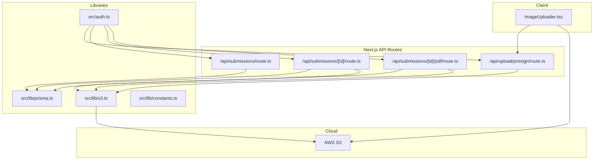
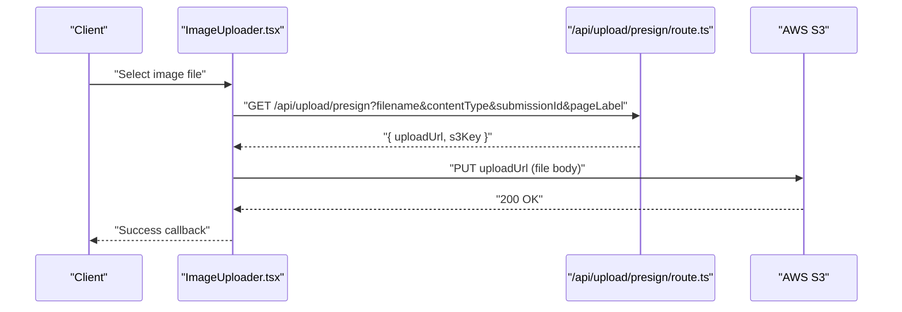
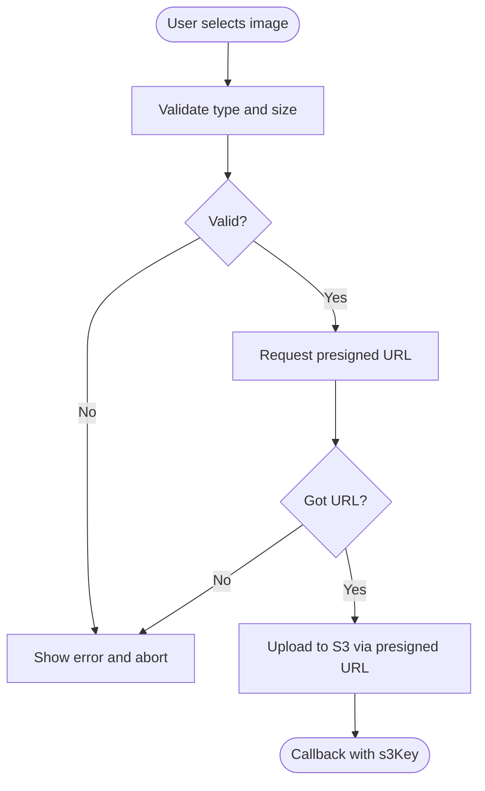
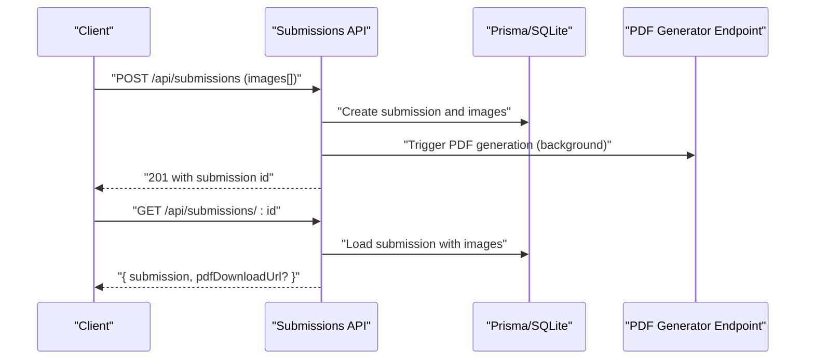
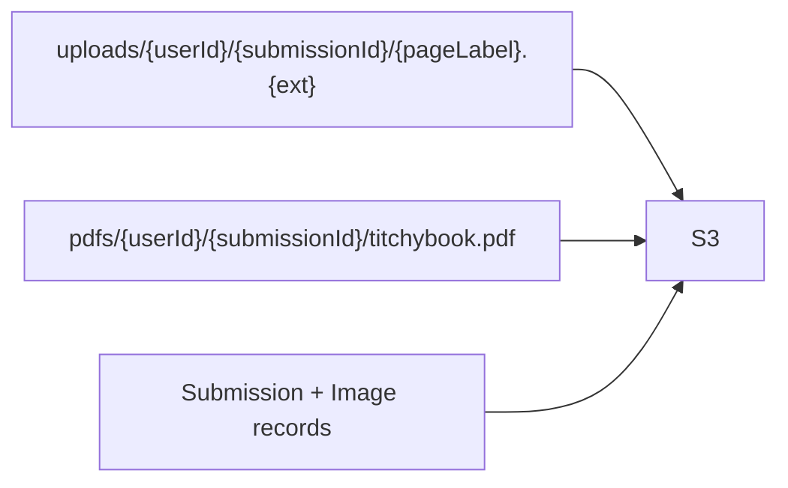
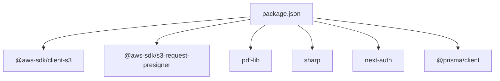

# Infrastructure Architecture

<cite>
**Referenced Files in This Document**
- [src/lib/s3.ts](file://src/lib/s3.ts)
- [src/app/api/upload/presign/route.ts](file://src/app/api/upload/presign/route.ts)
- [src/components/create/ImageUploader.tsx](file://src/components/create/ImageUploader.tsx)
- [src/app/api/submissions/route.ts](file://src/app/api/submissions/route.ts)
- [src/app/api/submissions/[id]/route.ts](file://src/app/api/submissions/[id]/route.ts)
- [src/app/api/submissions/[id]/pdf/route.ts](file://src/app/api/submissions/[id]/pdf/route.ts)
- [src/lib/constants.ts](file://src/lib/constants.ts)
- [src/lib/prisma.ts](file://src/lib/prisma.ts)
- [prisma/schema.prisma](file://prisma/schema.prisma)
- [package.json](file://package.json)
- [src/auth.ts](file://src/auth.ts)
</cite>

## Table of Contents
1. [Introduction](#introduction)
2. [Project Structure](#project-structure)
3. [Core Components](#core-components)
4. [Architecture Overview](#architecture-overview)
5. [Detailed Component Analysis](#detailed-component-analysis)
6. [Dependency Analysis](#dependency-analysis)
7. [Performance Considerations](#performance-considerations)
8. [Troubleshooting Guide](#troubleshooting-guide)
9. [Conclusion](#conclusion)
10. [Appendices](#appendices)

## Introduction
This document describes the cloud infrastructure architecture for Titchybook Creator, focusing on AWS S3 integration, presigned URL-based uploads, PDF generation using pdf-lib, and the associated security and operational model. It explains how images are uploaded via presigned URLs, how submissions are persisted locally, and how generated PDFs are stored in S3 for secure delivery. It also outlines scalability, cost optimization, and error handling strategies grounded in the repository’s implementation.

## Project Structure
The application is a Next.js app with a clear separation of concerns:
- Cloud storage utilities live under src/lib/s3.ts
- API routes handle authentication, presigned URL generation, submission persistence, and PDF generation triggers
- Client-side components manage image uploads and previews
- Local persistence uses Prisma with a SQLite database
- Authentication is handled via NextAuth with JWT sessions

**Diagram sources**
- [src/components/create/ImageUploader.tsx:1-148](file://src/components/create/ImageUploader.tsx#L1-L148)
- [src/app/api/upload/presign/route.ts:1-38](file://src/app/api/upload/presign/route.ts#L1-L38)
- [src/app/api/submissions/route.ts:1-96](file://src/app/api/submissions/route.ts#L1-L96)
- [src/app/api/submissions/[id]/route.ts](file://src/app/api/submissions/[id]/route.ts#L1-L37)
- [src/app/api/submissions/[id]/pdf/route.ts](file://src/app/api/submissions/[id]/pdf/route.ts#L1-L26)
- [src/lib/s3.ts:1-81](file://src/lib/s3.ts#L1-L81)
- [src/lib/prisma.ts:1-10](file://src/lib/prisma.ts#L1-L10)
- [src/auth.ts:1-80](file://src/auth.ts#L1-L80)
- [src/lib/constants.ts:1-49](file://src/lib/constants.ts#L1-L49)

**Section sources**
- [src/lib/s3.ts:1-81](file://src/lib/s3.ts#L1-L81)
- [src/app/api/upload/presign/route.ts:1-38](file://src/app/api/upload/presign/route.ts#L1-L38)
- [src/components/create/ImageUploader.tsx:1-148](file://src/components/create/ImageUploader.tsx#L1-L148)
- [src/app/api/submissions/route.ts:1-96](file://src/app/api/submissions/route.ts#L1-L96)
- [src/app/api/submissions/[id]/route.ts](file://src/app/api/submissions/[id]/route.ts#L1-L37)
- [src/app/api/submissions/[id]/pdf/route.ts](file://src/app/api/submissions/[id]/pdf/route.ts#L1-L26)
- [src/lib/prisma.ts:1-10](file://src/lib/prisma.ts#L1-L10)
- [src/auth.ts:1-80](file://src/auth.ts#L1-L80)
- [src/lib/constants.ts:1-49](file://src/lib/constants.ts#L1-L49)

## Core Components
- AWS S3 client and helpers: Provides presigned upload/download URLs, direct upload/download utilities, and key builders for images and PDFs.
- Presigned URL endpoint: Generates short-lived upload URLs scoped to a user’s submission and page label.
- Client uploader: Validates file types and sizes, requests a presigned URL, and uploads directly to S3.
- Submission API: Creates and lists submissions, persists image metadata, and triggers asynchronous PDF generation.
- PDF generation endpoint: Explicitly triggers PDF generation for a given submission ID.
- Local persistence: Uses Prisma with SQLite to track users, submissions, and image entries.
- Authentication: NextAuth with JWT session strategy, exposing user ID and role in session tokens.

**Section sources**
- [src/lib/s3.ts:1-81](file://src/lib/s3.ts#L1-L81)
- [src/app/api/upload/presign/route.ts:1-38](file://src/app/api/upload/presign/route.ts#L1-L38)
- [src/components/create/ImageUploader.tsx:1-148](file://src/components/create/ImageUploader.tsx#L1-L148)
- [src/app/api/submissions/route.ts:1-96](file://src/app/api/submissions/route.ts#L1-L96)
- [src/app/api/submissions/[id]/pdf/route.ts](file://src/app/api/submissions/[id]/pdf/route.ts#L1-L26)
- [src/lib/prisma.ts:1-10](file://src/lib/prisma.ts#L1-L10)
- [prisma/schema.prisma:1-48](file://prisma/schema.prisma#L1-L48)
- [src/auth.ts:1-80](file://src/auth.ts#L1-L80)

## Architecture Overview
The system follows a thin server model for uploads and a local-first persistence approach:
- Uploads: Clients request a presigned PUT URL from the backend, then upload directly to S3. This reduces server bandwidth and improves scalability.
- PDF generation: Triggered either automatically after submission creation or on-demand. Generation reads images from S3, composes a PDF using pdf-lib, and stores the result back to S3.
- Access control: All API endpoints require authentication; resource access is enforced by user ownership checks and optional admin privileges.

**Diagram sources**
- [src/components/create/ImageUploader.tsx:40-70](file://src/components/create/ImageUploader.tsx#L40-L70)
- [src/app/api/upload/presign/route.ts:6-36](file://src/app/api/upload/presign/route.ts#L6-L36)
- [src/lib/s3.ts:18-28](file://src/lib/s3.ts#L18-L28)

**Section sources**
- [src/components/create/ImageUploader.tsx:1-148](file://src/components/create/ImageUploader.tsx#L1-L148)
- [src/app/api/upload/presign/route.ts:1-38](file://src/app/api/upload/presign/route.ts#L1-L38)
- [src/lib/s3.ts:1-81](file://src/lib/s3.ts#L1-L81)

## Detailed Component Analysis

### AWS S3 Integration
- Client configuration: Initializes an S3 client with region and static credentials from environment variables.
- Bucket management: Uses a single bucket configured via environment variable; keys are organized under uploads/ and pdfs/.
- Presigned URL generation:
  - Upload URLs: Short-lived PUT URLs scoped to a specific S3 key derived from user, submission, and page label.
  - Download URLs: Short-lived GET URLs for PDFs.
- Direct operations:
  - Upload to S3: PUT object with explicit content type.
  - Download from S3: Streams object body into a buffer.
- Key builders:
  - Images: uploads/{userId}/{submissionId}/{pageLabel}.{ext}
  - PDFs: pdfs/{userId}/{submissionId}/titchybook.pdf

Security model
- Least privilege: Presigned URLs grant temporary access to specific keys; server-side logic validates parameters and types.
- Ownership: API endpoints verify user ownership of submissions and restrict access to PDF downloads when a PDF key exists.
- Expiration: Upload URLs expire after 10 minutes; download URLs expire after 1 hour.

Operational notes
- Environment variables: AWS_REGION, AWS_ACCESS_KEY_ID, AWS_SECRET_ACCESS_KEY, S3_BUCKET_NAME.
- Content-type enforcement: Frontend and backend validate accepted image MIME types.

**Section sources**
- [src/lib/s3.ts:1-81](file://src/lib/s3.ts#L1-L81)
- [src/app/api/upload/presign/route.ts:1-38](file://src/app/api/upload/presign/route.ts#L1-L38)
- [src/lib/constants.ts:42-49](file://src/lib/constants.ts#L42-L49)

### Image Upload Workflow
- Client-side validation: Accepts JPG, PNG, WebP up to 10 MB; shows preview and handles errors.
- Backend presign request: Requires filename, contentType, submissionId, pageLabel; validates content type against a whitelist.
- Direct upload: Client performs a PUT to the returned presigned URL; on success, invokes an upload callback with the S3 key.

**Diagram sources**
- [src/components/create/ImageUploader.tsx:22-73](file://src/components/create/ImageUploader.tsx#L22-L73)
- [src/app/api/upload/presign/route.ts:18-36](file://src/app/api/upload/presign/route.ts#L18-L36)

**Section sources**
- [src/components/create/ImageUploader.tsx:1-148](file://src/components/create/ImageUploader.tsx#L1-L148)
- [src/app/api/upload/presign/route.ts:1-38](file://src/app/api/upload/presign/route.ts#L1-L38)
- [src/lib/constants.ts:42-49](file://src/lib/constants.ts#L42-L49)

### Submission Persistence and PDF Generation Trigger
- Submission creation:
  - Validates payload shape and ensures all 8 page labels are present.
  - Persists images with order, original filename, and MIME type.
  - Triggers asynchronous PDF generation without blocking the request.
- Submission retrieval:
  - Enforces ownership or admin privileges.
  - Returns presigned download URL for the PDF if available.

**Diagram sources**
- [src/app/api/submissions/route.ts:35-95](file://src/app/api/submissions/route.ts#L35-L95)
- [src/app/api/submissions/[id]/route.ts](file://src/app/api/submissions/[id]/route.ts#L6-L36)
- [src/app/api/submissions/[id]/pdf/route.ts](file://src/app/api/submissions/[id]/pdf/route.ts#L5-L26)
- [prisma/schema.prisma:21-47](file://prisma/schema.prisma#L21-L47)

**Section sources**
- [src/app/api/submissions/route.ts:1-96](file://src/app/api/submissions/route.ts#L1-L96)
- [src/app/api/submissions/[id]/route.ts](file://src/app/api/submissions/[id]/route.ts#L1-L37)
- [prisma/schema.prisma:1-48](file://prisma/schema.prisma#L1-L48)

### PDF Generation Pipeline
- Trigger: Either automatic (after submission creation) or manual (explicit POST to PDF endpoint).
- Storage: Generated PDF is stored in S3 under the pdfs/ key hierarchy.
- Delivery: Client requests submission details; if a PDF exists, a presigned download URL is returned for immediate browser download.

Note: The pdf-lib integration and generation logic are referenced by the API routes and S3 utilities. The exact implementation file path is referenced in the API routes.

**Section sources**
- [src/app/api/submissions/route.ts:5-5](file://src/app/api/submissions/route.ts#L5-L5)
- [src/app/api/submissions/[id]/pdf/route.ts](file://src/app/api/submissions/[id]/pdf/route.ts#L3-L3)
- [src/lib/s3.ts:75-80](file://src/lib/s3.ts#L75-L80)

### Security Model
- Authentication: All protected endpoints rely on NextAuth JWT sessions.
- Authorization:
  - Ownership checks: Users can only access their own submissions.
  - Admin override: Admin users can access other users’ submissions.
- Resource scoping:
  - Presigned URLs limit access to specific S3 keys and short TTLs.
  - Content-type validation prevents unexpected payloads.
- Secrets: AWS credentials are loaded from environment variables.

**Section sources**
- [src/auth.ts:27-79](file://src/auth.ts#L27-L79)
- [src/app/api/submissions/[id]/route.ts](file://src/app/api/submissions/[id]/route.ts#L26-L28)
- [src/app/api/upload/presign/route.ts:8-10](file://src/app/api/upload/presign/route.ts#L8-L10)
- [src/lib/s3.ts:8-14](file://src/lib/s3.ts#L8-L14)

### Cloud Storage Architecture
- Images: Stored under uploads/{userId}/{submissionId}/{pageLabel}.{ext}. Keys are built server-side from validated parameters.
- PDFs: Stored under pdfs/{userId}/{submissionId}/titchybook.pdf.
- Access patterns:
  - Uploads: Direct client-to-S3 PUT via presigned URL.
  - Downloads: Signed GET URLs for PDFs; images are referenced by S3 keys in the database.

**Diagram sources**
- [src/lib/s3.ts:66-80](file://src/lib/s3.ts#L66-L80)
- [prisma/schema.prisma:21-47](file://prisma/schema.prisma#L21-L47)

**Section sources**
- [src/lib/s3.ts:66-80](file://src/lib/s3.ts#L66-L80)
- [prisma/schema.prisma:21-47](file://prisma/schema.prisma#L21-L47)

## Dependency Analysis
External libraries and their roles:
- @aws-sdk/client-s3 and @aws-sdk/s3-request-presigner: S3 client and presigner for signed URLs.
- pdf-lib: PDF composition library used by the generation pipeline.
- sharp: Image processing library referenced in package.json.
- next-auth: Authentication provider and session management.
- prisma: ORM for SQLite-backed persistence.

**Diagram sources**
- [package.json:11-25](file://package.json#L11-L25)

**Section sources**
- [package.json:1-43](file://package.json#L1-L43)

## Performance Considerations
- Upload scaling: Direct client-to-S3 uploads reduce server bandwidth and latency, enabling higher concurrency.
- Background PDF generation: Submissions trigger PDF generation asynchronously to avoid blocking the request.
- Caching: Consider caching presigned URLs per upload session to minimize repeated backend calls.
- Compression and optimization: Use sharp to resize and optimize images before upload to reduce storage and transfer costs.
- Batch operations: For future enhancements, batch image processing and PDF generation could improve throughput.

[No sources needed since this section provides general guidance]

## Troubleshooting Guide
Common failure modes and mitigations:
- Unauthorized access: Ensure the session is present and user ID is available in the request context.
- Missing parameters: The presign endpoint requires filename, contentType, submissionId, and pageLabel; verify frontend query parameters.
- Invalid content type: Only accepted image MIME types are allowed; confirm client and server type lists match.
- Upload failures: Check presigned URL validity and network conditions; re-request a new URL if expired.
- PDF generation errors: The PDF endpoint logs errors and returns a 500; inspect server logs for stack traces.
- Ownership violations: Submission retrieval enforces ownership or admin privileges; verify user role and submission ownership.

**Section sources**
- [src/app/api/upload/presign/route.ts:8-10](file://src/app/api/upload/presign/route.ts#L8-L10)
- [src/app/api/upload/presign/route.ts:18-30](file://src/app/api/upload/presign/route.ts#L18-L30)
- [src/app/api/submissions/[id]/pdf/route.ts](file://src/app/api/submissions/[id]/pdf/route.ts#L19-L25)
- [src/app/api/submissions/[id]/route.ts](file://src/app/api/submissions/[id]/route.ts#L26-L28)

## Conclusion
Titchybook Creator employs a scalable, low-latency architecture for image uploads and PDF generation:
- Presigned URLs enable secure, direct uploads to S3 while keeping the server thin.
- Local persistence with Prisma simplifies development and deployment.
- Clear ownership and admin checks protect resources.
- The design supports asynchronous PDF generation and can accommodate further optimizations like CDN integration, lifecycle policies, and advanced image processing.

[No sources needed since this section summarizes without analyzing specific files]

## Appendices

### API Surface Summary
- GET /api/upload/presign: Returns a presigned upload URL and S3 key for a given filename, content type, submissionId, and pageLabel.
- POST /api/submissions: Creates a submission with 8 image entries and triggers background PDF generation.
- GET /api/submissions: Lists current user’s submissions.
- GET /api/submissions/:id: Retrieves a submission and, if available, a presigned PDF download URL.
- POST /api/submissions/:id/pdf: Explicitly triggers PDF generation for a submission.

**Section sources**
- [src/app/api/upload/presign/route.ts:1-38](file://src/app/api/upload/presign/route.ts#L1-L38)
- [src/app/api/submissions/route.ts:20-95](file://src/app/api/submissions/route.ts#L20-L95)
- [src/app/api/submissions/[id]/route.ts](file://src/app/api/submissions/[id]/route.ts#L6-L36)
- [src/app/api/submissions/[id]/pdf/route.ts](file://src/app/api/submissions/[id]/pdf/route.ts#L5-L26)