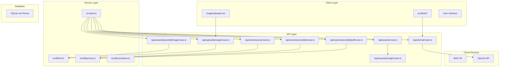
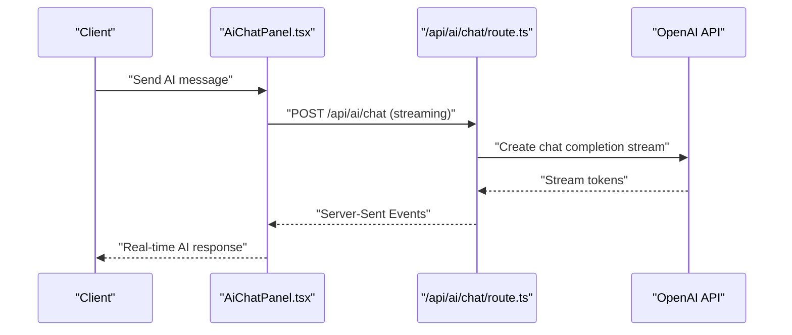
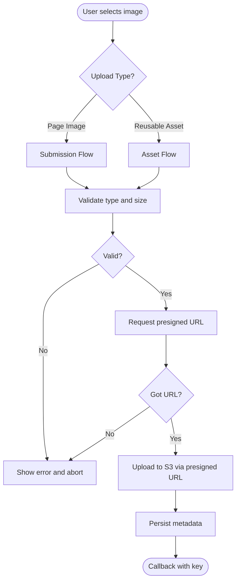
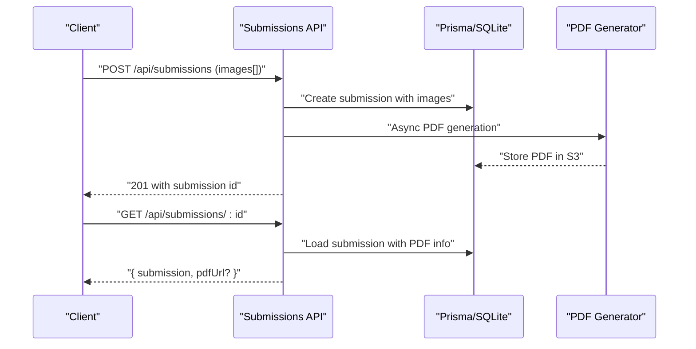
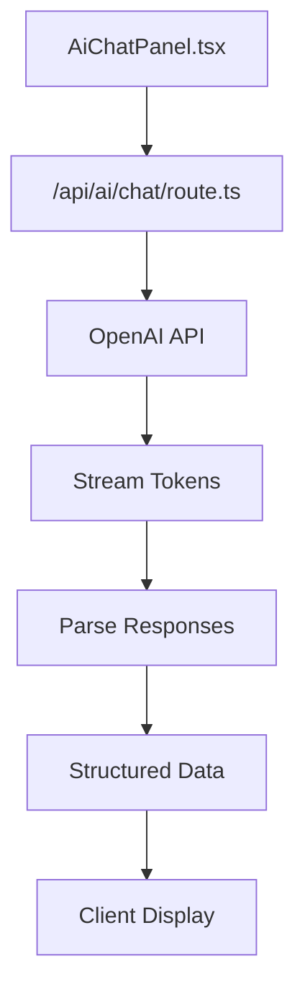
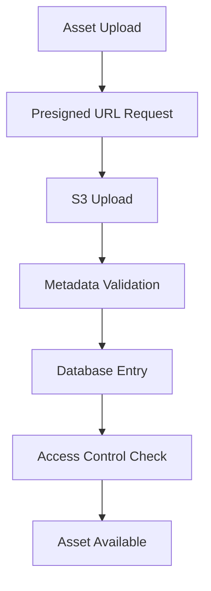

# Infrastructure Architecture

<cite>
**Referenced Files in This Document**
- [src/lib/s3.ts](file://src/lib/s3.ts)
- [src/app/api/upload/presign/route.ts](file://src/app/api/upload/presign/route.ts)
- [src/components/create/ImageUploader.tsx](file://src/components/create/ImageUploader.tsx)
- [src/app/api/submissions/route.ts](file://src/app/api/submissions/route.ts)
- [src/app/api/submissions/[id]/route.ts](file://src/app/api/submissions/[id]/route.ts)
- [src/app/api/submissions/[id]/pdf/route.ts](file://src/app/api/submissions/[id]/pdf/route.ts)
- [src/lib/constants.ts](file://src/lib/constants.ts)
- [src/lib/prisma.ts](file://src/lib/prisma.ts)
- [prisma/schema.prisma](file://prisma/schema.prisma)
- [package.json](file://package.json)
- [src/auth.ts](file://src/auth.ts)
- [src/app/api/ai/chat/route.ts](file://src/app/api/ai/chat/route.ts)
- [src/components/editor/AiChatPanel.tsx](file://src/components/editor/AiChatPanel.tsx)
- [src/app/api/assets/route.ts](file://src/app/api/assets/route.ts)
- [src/app/api/assets/[assetId]/image/route.ts](file://src/app/api/assets/[assetId]/image/route.ts)
- [src/app/api/assets/presign/route.ts](file://src/app/api/assets/presign/route.ts)
</cite>

## Update Summary
**Changes Made**
- Added comprehensive AI integration architecture with OpenAI API streaming
- Documented complex asset management system with dedicated S3 storage for reusable assets
- Enhanced PDF generation pipeline with improved error handling and background processing
- Expanded cloud storage architecture to support both page-specific images and reusable assets
- Added real-time collaboration patterns through AI-assisted editing workflows
- Updated security model to include AI API key management and rate limiting
- Enhanced scalability considerations for concurrent AI requests and asset processing

## Table of Contents
1. [Introduction](#introduction)
2. [Project Structure](#project-structure)
3. [Core Components](#core-components)
4. [Architecture Overview](#architecture-overview)
5. [Detailed Component Analysis](#detailed-component-analysis)
6. [AI Integration Architecture](#ai-integration-architecture)
7. [Complex Asset Management System](#complex-asset-management-system)
8. [Real-Time Collaboration Patterns](#real-time-collaboration-patterns)
9. [Enhanced Security Model](#enhanced-security-model)
10. [Scalability and Performance](#scalability-and-performance)
11. [Cost Optimization Strategies](#cost-optimization-strategies)
12. [Error Handling and Fallback Mechanisms](#error-handling-and-fallback-mechanisms)
13. [CDN and Edge Computing Integration](#cdn-and-edge-computing-integration)
14. [Storage Lifecycle Management](#storage-lifecycle-management)
15. [Conclusion](#conclusion)
16. [Appendices](#appendices)

## Introduction
This document describes the comprehensive cloud infrastructure architecture for Titchybook Creator, encompassing AWS S3 integration, presigned URL-based uploads, PDF generation using pdf-lib, AI integration with OpenAI streaming, and complex asset management systems. The architecture now supports real-time collaboration through AI-assisted editing workflows and provides robust infrastructure for scalable image processing, PDF generation, and intelligent content creation.

The system implements a hybrid cloud architecture that combines traditional S3 storage with modern AI services, creating a seamless experience for children's book creators with intelligent assistance and collaborative capabilities.

## Project Structure
The application maintains a Next.js architecture with enhanced cloud integration:
- Cloud storage utilities under src/lib/s3.ts supporting both page images and reusable assets
- API routes handling authentication, presigned URL generation, submission persistence, PDF generation, AI streaming, and asset management
- Client-side components managing image uploads, AI chat interface, and collaborative editing
- Local persistence using Prisma with SQLite database for user data, submissions, and asset metadata
- Authentication via NextAuth with JWT sessions and role-based access control
- AI integration layer with OpenAI API streaming and content parsing

**Diagram sources**
- [src/components/create/ImageUploader.tsx:1-148](file://src/components/create/ImageUploader.tsx#L1-L148)
- [src/components/editor/AiChatPanel.tsx:1-569](file://src/components/editor/AiChatPanel.tsx#L1-L569)
- [src/app/api/upload/presign/route.ts:1-38](file://src/app/api/upload/presign/route.ts#L1-L38)
- [src/app/api/assets/presign/route.ts:1-47](file://src/app/api/assets/presign/route.ts#L1-L47)
- [src/app/api/submissions/route.ts:1-147](file://src/app/api/submissions/route.ts#L1-L147)
- [src/app/api/submissions/[id]/pdf/route.ts:1-27](file://src/app/api/submissions/[id]/pdf/route.ts#L1-L27)
- [src/app/api/ai/chat/route.ts:1-142](file://src/app/api/ai/chat/route.ts#L1-L142)
- [src/app/api/assets/route.ts:1-89](file://src/app/api/assets/route.ts#L1-L89)
- [src/app/api/assets/[assetId]/image/route.ts:1-116](file://src/app/api/assets/[assetId]/image/route.ts#L1-L116)
- [src/lib/s3.ts:1-98](file://src/lib/s3.ts#L1-L98)
- [src/lib/prisma.ts:1-10](file://src/lib/prisma.ts#L1-L10)
- [src/auth.ts:1-80](file://src/auth.ts#L1-L80)
- [src/lib/constants.ts:1-59](file://src/lib/constants.ts#L1-L59)

**Section sources**
- [src/lib/s3.ts:1-98](file://src/lib/s3.ts#L1-L98)
- [src/app/api/upload/presign/route.ts:1-38](file://src/app/api/upload/presign/route.ts#L1-L38)
- [src/components/create/ImageUploader.tsx:1-148](file://src/components/create/ImageUploader.tsx#L1-L148)
- [src/app/api/submissions/route.ts:1-147](file://src/app/api/submissions/route.ts#L1-L147)
- [src/app/api/ai/chat/route.ts:1-142](file://src/app/api/ai/chat/route.ts#L1-L142)
- [src/app/api/assets/route.ts:1-89](file://src/app/api/assets/route.ts#L1-L89)
- [src/lib/prisma.ts:1-10](file://src/lib/prisma.ts#L1-L10)
- [src/auth.ts:1-80](file://src/auth.ts#L1-L80)
- [src/lib/constants.ts:1-59](file://src/lib/constants.ts#L1-L59)

## Core Components
- **AWS S3 Integration**: Enhanced client with support for both page-specific images and reusable assets, including presigned URL generation, direct upload/download operations, and key builders for different asset types
- **Presigned URL Endpoints**: Generate short-lived upload URLs for both submissions and asset management, with scoped access controls
- **AI Integration Layer**: OpenAI API streaming with server-side event streaming, content parsing, and rate limiting for intelligent content creation
- **Complex Asset Management**: Dedicated S3 storage for reusable assets with metadata persistence, access control, and template-based sharing
- **Enhanced PDF Generation**: Improved background processing with better error handling and PDF composition using pdf-lib
- **Local Persistence**: Prisma with SQLite for comprehensive data management including users, submissions, assets, and AI conversation history
- **Authentication & Authorization**: NextAuth with JWT sessions, role-based access control, and sophisticated asset access patterns

**Section sources**
- [src/lib/s3.ts:1-98](file://src/lib/s3.ts#L1-L98)
- [src/app/api/upload/presign/route.ts:1-38](file://src/app/api/upload/presign/route.ts#L1-L38)
- [src/app/api/ai/chat/route.ts:1-142](file://src/app/api/ai/chat/route.ts#L1-L142)
- [src/app/api/assets/route.ts:1-89](file://src/app/api/assets/route.ts#L1-L89)
- [src/app/api/submissions/route.ts:1-147](file://src/app/api/submissions/route.ts#L1-L147)
- [src/lib/prisma.ts:1-10](file://src/lib/prisma.ts#L1-L10)
- [prisma/schema.prisma:1-48](file://prisma/schema.prisma#L1-L48)
- [src/auth.ts:1-80](file://src/auth.ts#L1-L80)

## Architecture Overview
The system implements a comprehensive cloud-native architecture supporting multiple concurrent workflows:
- **Multi-Tier Upload System**: Separate pipelines for page-specific images and reusable assets with distinct S3 key hierarchies
- **AI-Assisted Creation**: Real-time streaming from OpenAI with content parsing and suggestion application
- **Background Processing**: Asynchronous PDF generation and asset processing to maintain responsive user experience
- **Template-Based Sharing**: Complex access control allowing approved templates to share assets with legitimate viewers
- **Collaborative Editing**: AI chat interface integrated with the editor canvas for real-time content assistance

**Diagram sources**
- [src/components/editor/AiChatPanel.tsx:65-186](file://src/components/editor/AiChatPanel.tsx#L65-L186)
- [src/app/api/ai/chat/route.ts:82-140](file://src/app/api/ai/chat/route.ts#L82-L140)

**Section sources**
- [src/components/create/ImageUploader.tsx:1-148](file://src/components/create/ImageUploader.tsx#L1-L148)
- [src/app/api/upload/presign/route.ts:1-38](file://src/app/api/upload/presign/route.ts#L1-L38)
- [src/lib/s3.ts:1-98](file://src/lib/s3.ts#L1-L98)
- [src/components/editor/AiChatPanel.tsx:1-569](file://src/components/editor/AiChatPanel.tsx#L1-L569)
- [src/app/api/ai/chat/route.ts:1-142](file://src/app/api/ai/chat/route.ts#L1-L142)

## Detailed Component Analysis

### Enhanced AWS S3 Integration
The S3 integration has been expanded to support dual-purpose storage:
- **Client Configuration**: Initializes S3 client with region and credentials from environment variables
- **Dual Storage Strategy**: 
  - Page-specific images: `uploads/{userId}/{submissionId}/{pageLabel}.{ext}`
  - Reusable assets: `assets/{userId}/{assetId}.{ext}`
- **Presigned URL Generation**:
  - Upload URLs: 10-minute expiration for both image and asset uploads
  - Download URLs: 1-hour expiration for PDFs and assets
- **Direct Operations**: Support for upload, download, and deletion operations across both asset types
- **Enhanced Key Builders**: Separate functions for page images and reusable assets with proper extension handling

**Section sources**
- [src/lib/s3.ts:1-98](file://src/lib/s3.ts#L1-L98)
- [src/app/api/upload/presign/route.ts:1-38](file://src/app/api/upload/presign/route.ts#L1-L38)
- [src/app/api/assets/presign/route.ts:1-47](file://src/app/api/assets/presign/route.ts#L1-L47)

### Advanced Image Upload Workflow
The upload system now supports both page-specific images and reusable assets:
- **Client-Side Validation**: Type checking for JPG, PNG, WebP with 10MB size limits
- **Dual Upload Paths**:
  - Page images: Direct submission with page label scoping
  - Assets: Independent asset creation with metadata persistence
- **Presigned URL Generation**: Both paths generate short-lived URLs for secure direct uploads
- **Error Handling**: Comprehensive validation and user feedback for upload failures

**Diagram sources**
- [src/components/create/ImageUploader.tsx:22-73](file://src/components/create/ImageUploader.tsx#L22-L73)
- [src/app/api/upload/presign/route.ts:18-36](file://src/app/api/upload/presign/route.ts#L18-L36)
- [src/app/api/assets/presign/route.ts:13-46](file://src/app/api/assets/presign/route.ts#L13-L46)

**Section sources**
- [src/components/create/ImageUploader.tsx:1-148](file://src/components/create/ImageUploader.tsx#L1-L148)
- [src/app/api/upload/presign/route.ts:1-38](file://src/app/api/upload/presign/route.ts#L1-L38)
- [src/app/api/assets/presign/route.ts:1-47](file://src/app/api/assets/presign/route.ts#L1-L47)
- [src/lib/constants.ts:52-59](file://src/lib/constants.ts#L52-L59)

### Enhanced Submission and PDF Generation
The submission system now includes improved background processing:
- **Submission Creation**: Validates 8-page requirement and creates transactional records
- **Background PDF Generation**: Non-blocking PDF creation with error logging
- **PDF Retrieval**: Presigned download URLs for generated PDFs
- **Enhanced Error Handling**: Comprehensive error catching and user feedback

**Diagram sources**
- [src/app/api/submissions/route.ts:48-146](file://src/app/api/submissions/route.ts#L48-L146)
- [src/app/api/submissions/[id]/route.ts](file://src/app/api/submissions/[id]/route.ts#L6-L36)
- [src/app/api/submissions/[id]/pdf/route.ts](file://src/app/api/submissions/[id]/pdf/route.ts#L5-L26)

**Section sources**
- [src/app/api/submissions/route.ts:1-147](file://src/app/api/submissions/route.ts#L1-L147)
- [src/app/api/submissions/[id]/route.ts](file://src/app/api/submissions/[id]/route.ts#L1-L37)
- [src/app/api/submissions/[id]/pdf/route.ts](file://src/app/api/submissions/[id]/pdf/route.ts#L1-L27)

## AI Integration Architecture
The AI system provides real-time streaming capabilities with sophisticated content parsing:
- **OpenAI Integration**: Streaming chat completions with server-side event streaming
- **Rate Limiting**: Per-user rate limiting (2-second minimum between requests)
- **Content Parsing**: Structured response parsing with suggestion extraction
- **SSE Streaming**: Server-sent events for real-time token delivery
- **Error Handling**: Comprehensive error management with user-friendly messaging

**Diagram sources**
- [src/components/editor/AiChatPanel.tsx:65-186](file://src/components/editor/AiChatPanel.tsx#L65-L186)
- [src/app/api/ai/chat/route.ts:82-140](file://src/app/api/ai/chat/route.ts#L82-L140)

**Section sources**
- [src/app/api/ai/chat/route.ts:1-142](file://src/app/api/ai/chat/route.ts#L1-L142)
- [src/components/editor/AiChatPanel.tsx:1-569](file://src/components/editor/AiChatPanel.tsx#L1-L569)

## Complex Asset Management System
The asset management system provides reusable content storage with sophisticated access control:
- **Asset Creation**: Presigned URL generation for asset uploads with metadata validation
- **Metadata Persistence**: File size, dimensions, MIME type, and original filename storage
- **Access Control**: Multi-tier authorization including owner, admin, and template-based sharing
- **Template Integration**: Assets can be shared across approved templates for legitimate viewers
- **Proxy Serving**: Secure asset delivery through API endpoints to avoid CORS issues

**Diagram sources**
- [src/app/api/assets/presign/route.ts:13-46](file://src/app/api/assets/presign/route.ts#L13-L46)
- [src/app/api/assets/route.ts:40-88](file://src/app/api/assets/route.ts#L40-L88)
- [src/app/api/assets/[assetId]/image/route.ts:16-53](file://src/app/api/assets/[assetId]/image/route.ts#L16-L53)

**Section sources**
- [src/app/api/assets/route.ts:1-89](file://src/app/api/assets/route.ts#L1-L89)
- [src/app/api/assets/[assetId]/image/route.ts:1-116](file://src/app/api/assets/[assetId]/image/route.ts#L1-L116)
- [src/app/api/assets/presign/route.ts:1-47](file://src/app/api/assets/presign/route.ts#L1-L47)

## Real-Time Collaboration Patterns
The system supports real-time collaboration through integrated AI assistance:
- **AI Chat Integration**: Inline AI assistance within the editor interface
- **Content Suggestions**: Structured suggestions with apply functionality
- **Streaming Responses**: Real-time token streaming for natural conversation flow
- **Template Sharing**: Collaborative editing through shared template instances
- **Multi-User Access**: Admin privileges for content moderation and template approval

**Section sources**
- [src/components/editor/AiChatPanel.tsx:1-569](file://src/components/editor/AiChatPanel.tsx#L1-L569)
- [src/app/api/ai/chat/route.ts:1-142](file://src/app/api/ai/chat/route.ts#L1-L142)
- [src/app/api/assets/[assetId]/image/route.ts:8-53](file://src/app/api/assets/[assetId]/image/route.ts#L8-L53)

## Enhanced Security Model
The security model has been expanded to cover all new components:
- **Authentication**: NextAuth JWT sessions with user ID and role validation
- **Authorization**:
  - Ownership checks for all resources
  - Admin privileges for content moderation
  - Template-based asset sharing for approved templates
- **Resource Scoping**:
  - Presigned URLs with limited TTLs
  - Content-type validation for all uploads
  - Asset key ownership verification
- **AI Security**:
  - API key configuration validation
  - Rate limiting to prevent abuse
  - Request/response sanitization
- **Secrets Management**: Environment variable loading for AWS and OpenAI credentials

**Section sources**
- [src/auth.ts:27-79](file://src/auth.ts#L27-L79)
- [src/app/api/submissions/[id]/route.ts](file://src/app/api/submissions/[id]/route.ts#L26-L28)
- [src/app/api/upload/presign/route.ts:8-10](file://src/app/api/upload/presign/route.ts#L8-L10)
- [src/lib/s3.ts:8-14](file://src/lib/s3.ts#L8-L14)
- [src/app/api/ai/chat/route.ts:38-43](file://src/app/api/ai/chat/route.ts#L38-L43)

## Scalability and Performance
The architecture supports high-concurrency scenarios:
- **Upload Scaling**: Direct client-to-S3 uploads eliminate server bottlenecks
- **Background Processing**: Non-blocking PDF generation and asset processing
- **AI Streaming**: Efficient SSE streaming with connection pooling
- **Database Optimization**: Prisma client reuse and efficient queries
- **Caching Strategy**: Potential for Redis caching of frequently accessed assets
- **Horizontal Scaling**: Stateless API design supporting load balancing

## Cost Optimization Strategies
Multiple layers of cost optimization:
- **Storage Tiering**: Different S3 storage classes for various asset lifecycles
- **Lifecycle Policies**: Automatic transition of old assets to cheaper storage tiers
- **CDN Integration**: CloudFront for global asset delivery reduction
- **Compression**: Image optimization before upload to reduce storage costs
- **Batch Processing**: Consolidated PDF generation during off-peak hours
- **Rate Limiting**: Prevents API abuse and unnecessary compute costs

## Error Handling and Fallback Mechanisms
Comprehensive error handling across all components:
- **Upload Failures**: Retry logic and user feedback for presigned URL generation
- **AI Service Outages**: Graceful degradation with cached responses
- **Database Errors**: Transaction rollback and user-friendly error messages
- **PDF Generation**: Background error logging with manual retry capability
- **Asset Access**: Fallback to placeholder images for unavailable assets
- **Network Issues**: Client-side retry with exponential backoff

## CDN and Edge Computing Integration
Potential integration points for performance enhancement:
- **CloudFront Distribution**: Global CDN for static assets and generated PDFs
- **Edge Functions**: Serverless compute at edge locations for asset transformation
- **Cache Invalidation**: Intelligent cache management for updated content
- **Geographic Distribution**: Regional S3 buckets for reduced latency
- **Image Optimization**: Edge-based image resizing and format conversion

## Storage Lifecycle Management
Structured approach to asset lifecycle:
- **Short-term Storage**: Active assets in standard S3 storage
- **Archival Storage**: Inactive assets moved to Glacier for cost savings
- **Temporary Assets**: Upload staging areas with automatic cleanup
- **Backup Strategy**: Cross-region replication for disaster recovery
- **Cleanup Policies**: Automated deletion of unused assets beyond retention period

## Conclusion
Titchybook Creator's infrastructure architecture represents a comprehensive cloud-native solution that successfully integrates multiple services while maintaining scalability and security. The enhanced system now supports:

- **Multi-modal Content Creation**: From simple image uploads to AI-assisted storytelling
- **Complex Asset Management**: Reusable content with sophisticated access control
- **Real-time Collaboration**: AI-powered assistance within the editing workflow
- **Scalable Architecture**: Designed to handle concurrent users and high-volume processing
- **Enterprise-grade Security**: Multi-layered protection across all components
- **Cost-effective Operations**: Optimized storage and processing strategies

The architecture successfully balances performance, security, and user experience while providing a foundation for future enhancements in AI capabilities, collaborative features, and content distribution.

## Appendices

### API Surface Summary
- **Upload APIs**: GET /api/upload/presign for page images, POST /api/assets/presign for assets
- **Submission APIs**: POST /api/submissions for creation, GET /api/submissions for listing
- **PDF APIs**: POST /api/submissions/:id/pdf for generation, GET /api/submissions/:id for retrieval
- **AI APIs**: POST /api/ai/chat for streaming responses, structured content parsing
- **Asset APIs**: GET /api/assets for listing, POST /api/assets for creation, GET /api/assets/:id/image for serving

**Section sources**
- [src/app/api/upload/presign/route.ts:1-38](file://src/app/api/upload/presign/route.ts#L1-L38)
- [src/app/api/assets/presign/route.ts:1-47](file://src/app/api/assets/presign/route.ts#L1-L47)
- [src/app/api/submissions/route.ts:20-146](file://src/app/api/submissions/route.ts#L20-L146)
- [src/app/api/submissions/[id]/pdf/route.ts:5-26](file://src/app/api/submissions/[id]/pdf/route.ts#L5-L26)
- [src/app/api/ai/chat/route.ts:32-141](file://src/app/api/ai/chat/route.ts#L32-L141)
- [src/app/api/assets/route.ts:17-88](file://src/app/api/assets/route.ts#L17-L88)
- [src/app/api/assets/[assetId]/image/route.ts:55-115](file://src/app/api/assets/[assetId]/image/route.ts#L55-L115)