# Authentication & Authorization

<cite>
**Referenced Files in This Document**
- [src/auth.ts](file://src/auth.ts)
- [src/middleware.ts](file://src/middleware.ts)
- [prisma/schema.prisma](file://prisma/schema.prisma)
- [src/lib/prisma.ts](file://src/lib/prisma.ts)
- [src/app/(auth)/login/page.tsx](file://src/app/(auth)/login/page.tsx)
- [src/components/auth/LoginForm.tsx](file://src/components/auth/LoginForm.tsx)
- [src/app/(auth)/register/page.tsx](file://src/app/(auth)/register/page.tsx)
- [src/components/auth/RegisterForm.tsx](file://src/components/auth/RegisterForm.tsx)
- [src/app/api/register/route.ts](file://src/app/api/register/route.ts)
- [src/app/api/admin/submissions/route.ts](file://src/app/api/admin/submissions/route.ts)
- [src/app/api/admin/orders/route.ts](file://src/app/api/admin/orders/route.ts)
- [src/app/api/admin/templates/route.ts](file://src/app/api/admin/templates/route.ts)
- [src/app/api/admin/pricing-config/route.ts](file://src/app/api/admin/pricing-config/route.ts)
- [src/app/(admin)/admin/page.tsx](file://src/app/(admin)/admin/page.tsx)
- [src/app/(admin)/admin/orders/page.tsx](file://src/app/(admin)/admin/orders/page.tsx)
- [src/app/(admin)/admin/templates/page.tsx](file://src/app/(admin)/admin/templates/page.tsx)
- [src/app/(admin)/admin/pricing/page.tsx](file://src/app/(admin)/admin/pricing/page.tsx)
- [src/components/layout/Header.tsx](file://src/components/layout/Header.tsx)
- [src/components/admin/AdminDashboard.tsx](file://src/components/admin/AdminDashboard.tsx)
- [src/components/admin/OrderModeration.tsx](file://src/components/admin/OrderModeration.tsx)
- [src/components/admin/TemplateManager.tsx](file://src/components/admin/TemplateManager.tsx)
- [src/components/admin/PricingConfigForm.tsx](file://src/components/admin/PricingConfigForm.tsx)
- [src/app/(protected)/dashboard/page.tsx](file://src/app/(protected)/dashboard/page.tsx)
- [src/app/(protected)/create/page.tsx](file://src/app/(protected)/create/page.tsx)
</cite>

## Update Summary
**Changes Made**
- Enhanced NextAuth configuration documentation with comprehensive role-based access control implementation
- Added detailed coverage of admin-only features: order moderation, template management, and pricing configuration
- Expanded middleware documentation to include admin route protection patterns
- Updated user roles section to reflect ADMIN role enforcement across multiple admin interfaces
- Added comprehensive API endpoint documentation for admin functionality
- Enhanced security considerations with role-based access control best practices

## Table of Contents
1. [Introduction](#introduction)
2. [Project Structure](#project-structure)
3. [Core Components](#core-components)
4. [Architecture Overview](#architecture-overview)
5. [Detailed Component Analysis](#detailed-component-analysis)
6. [Enhanced Role-Based Access Control](#enhanced-role-based-access-control)
7. [Admin Features Implementation](#admin-features-implementation)
8. [Dependency Analysis](#dependency-analysis)
9. [Performance Considerations](#performance-considerations)
10. [Security Best Practices](#security-best-practices)
11. [Troubleshooting Guide](#troubleshooting-guide)
12. [Conclusion](#conclusion)

## Introduction
This document explains the authentication and authorization system for Titchybook Creator with enhanced role-based access control. The system now supports multiple user roles (USER, ADMIN) with comprehensive administrative capabilities including order moderation, template management, and pricing configuration. It covers NextAuth configuration with JWT strategy, custom callbacks, and session management; detailed user roles and permissions; the end-to-end authentication flow from login to protected route access; the registration process and password hashing; session persistence; middleware-based route protection and role-based access control; and security best practices, token management, and session timeout handling.

## Project Structure
Authentication and authorization span several areas with enhanced admin functionality:
- NextAuth configuration and runtime exports with role-based callbacks
- Middleware for route protection including admin-specific patterns
- Public authentication pages and client components
- API endpoints for registration and comprehensive admin access
- Protected pages and admin-only pages with role enforcement
- Shared Prisma schema with user roles and relations
- Admin-specific components for order moderation, template management, and pricing configuration

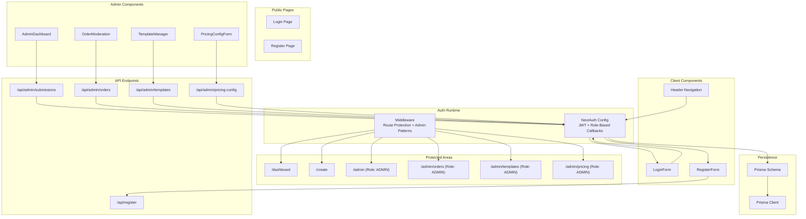

**Diagram sources**
- [src/auth.ts:27-86](file://src/auth.ts#L27-L86)
- [src/middleware.ts:3-14](file://src/middleware.ts#L3-L14)
- [src/app/(auth)/login/page.tsx:1-13](file://src/app/(auth)/login/page.tsx#L1-L13)
- [src/components/auth/LoginForm.tsx:1-86](file://src/components/auth/LoginForm.tsx#L1-L86)
- [src/app/(auth)/register/page.tsx:1-13](file://src/app/(auth)/register/page.tsx#L1-L13)
- [src/components/auth/RegisterForm.tsx:1-107](file://src/components/auth/RegisterForm.tsx#L1-L107)
- [src/app/api/register/route.ts:1-47](file://src/app/api/register/route.ts#L1-L47)
- [src/app/api/admin/submissions/route.ts:1-38](file://src/app/api/admin/submissions/route.ts#L1-L38)
- [src/app/api/admin/orders/route.ts:1-40](file://src/app/api/admin/orders/route.ts#L1-L40)
- [src/app/api/admin/templates/route.ts:1-100](file://src/app/api/admin/templates/route.ts#L1-L100)
- [src/app/api/admin/pricing-config/route.ts:1-47](file://src/app/api/admin/pricing-config/route.ts#L1-L47)
- [src/app/(admin)/admin/page.tsx:1-13](file://src/app/(admin)/admin/page.tsx#L1-L13)
- [src/app/(admin)/admin/orders/page.tsx:1-30](file://src/app/(admin)/admin/orders/page.tsx#L1-L30)
- [src/app/(admin)/admin/templates/page.tsx:1-17](file://src/app/(admin)/admin/templates/page.tsx#L1-L17)
- [src/app/(admin)/admin/pricing/page.tsx:1-30](file://src/app/(admin)/admin/pricing/page.tsx#L1-L30)
- [src/components/layout/Header.tsx:30-52](file://src/components/layout/Header.tsx#L30-L52)
- [src/components/admin/AdminDashboard.tsx:1-168](file://src/components/admin/AdminDashboard.tsx#L1-L168)
- [src/components/admin/OrderModeration.tsx:1-300](file://src/components/admin/OrderModeration.tsx#L1-L300)
- [src/components/admin/TemplateManager.tsx:1-269](file://src/components/admin/TemplateManager.tsx#L1-L269)
- [src/components/admin/PricingConfigForm.tsx:1-710](file://src/components/admin/PricingConfigForm.tsx#L1-L710)
- [prisma/schema.prisma:10-21](file://prisma/schema.prisma#L10-L21)
- [src/lib/prisma.ts:1-10](file://src/lib/prisma.ts#L1-L10)

**Section sources**
- [src/auth.ts:27-86](file://src/auth.ts#L27-L86)
- [src/middleware.ts:3-14](file://src/middleware.ts#L3-L14)
- [prisma/schema.prisma:10-21](file://prisma/schema.prisma#L10-L21)
- [src/lib/prisma.ts:1-10](file://src/lib/prisma.ts#L1-L10)

## Core Components
- NextAuth configuration with JWT strategy and custom callbacks for token/session propagation with role support
- Middleware exporting the NextAuth auth function for route protection including admin-specific patterns
- Prisma schema defining user roles with default USER role and ADMIN enforcement
- Login and registration UI flows with client-side form handling
- Registration API endpoint with validation and bcrypt hashing
- Comprehensive admin API endpoints for submissions, orders, templates, and pricing configuration
- Admin-only pages enforcing role-based redirection with conditional navigation
- Protected pages under designated route groups with enhanced middleware patterns

**Section sources**
- [src/auth.ts:27-86](file://src/auth.ts#L27-L86)
- [src/middleware.ts:3-14](file://src/middleware.ts#L3-L14)
- [prisma/schema.prisma:15](file://prisma/schema.prisma#L15)
- [src/app/api/register/route.ts:1-47](file://src/app/api/register/route.ts#L1-L47)
- [src/app/api/admin/submissions/route.ts:1-38](file://src/app/api/admin/submissions/route.ts#L1-L38)
- [src/app/api/admin/orders/route.ts:1-40](file://src/app/api/admin/orders/route.ts#L1-L40)
- [src/app/api/admin/templates/route.ts:1-100](file://src/app/api/admin/templates/route.ts#L1-L100)
- [src/app/api/admin/pricing-config/route.ts:1-47](file://src/app/api/admin/pricing-config/route.ts#L1-L47)
- [src/app/(admin)/admin/page.tsx:5-12](file://src/app/(admin)/admin/page.tsx#L5-L12)

## Architecture Overview
The system uses NextAuth with JWT strategy and enhanced role-based access control. Users authenticate via credentials, NextAuth stores a JWT containing user ID and role, and callbacks populate the token and session with user information. Middleware protects routes by invoking the NextAuth auth function with role enforcement patterns. Protected pages and admin-only pages enforce role checks. Registration uses a dedicated API endpoint with bcrypt hashing. Admin features include order moderation, template management, and pricing configuration with comprehensive role-based access control.

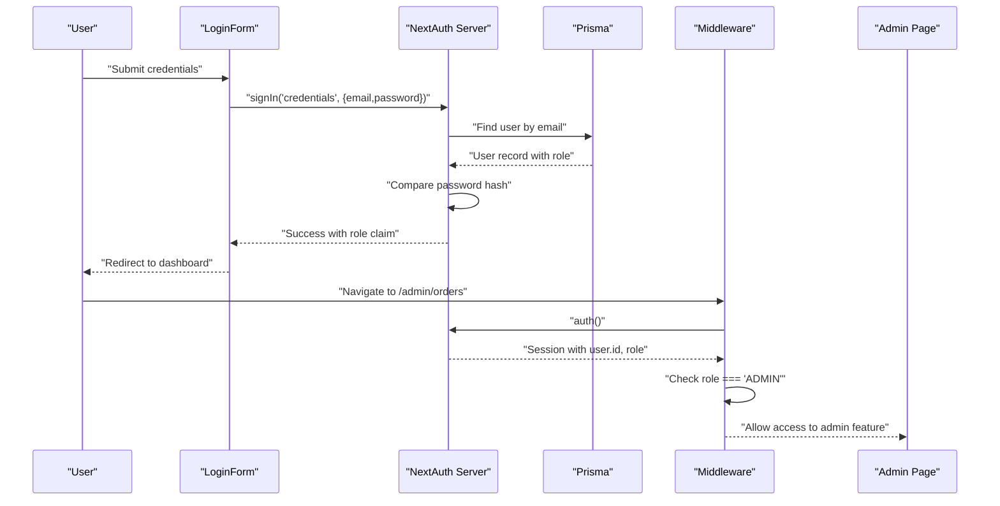

**Diagram sources**
- [src/components/auth/LoginForm.tsx:14-33](file://src/components/auth/LoginForm.tsx#L14-L33)
- [src/auth.ts:35-58](file://src/auth.ts#L35-L58)
- [src/lib/prisma.ts:1-10](file://src/lib/prisma.ts#L1-L10)
- [src/middleware.ts:1-14](file://src/middleware.ts#L1-L14)
- [src/app/(admin)/admin/orders/page.tsx:6-10](file://src/app/(admin)/admin/orders/page.tsx#L6-L10)

## Detailed Component Analysis

### NextAuth Configuration (JWT, Callbacks, Session)
- Provider: Credentials provider with email/password fields
- Authorization: Validates presence of credentials, queries user by email, compares password hash, returns user with role
- Session strategy: JWT with role claims
- Pages: Custom login page mapped to "/login"
- Callbacks:
  - authorized: Middleware authorization check returning boolean for protected paths
  - jwt: Attach user.id and role to the token
  - session: Populate session.user with id, email, name, and role from token

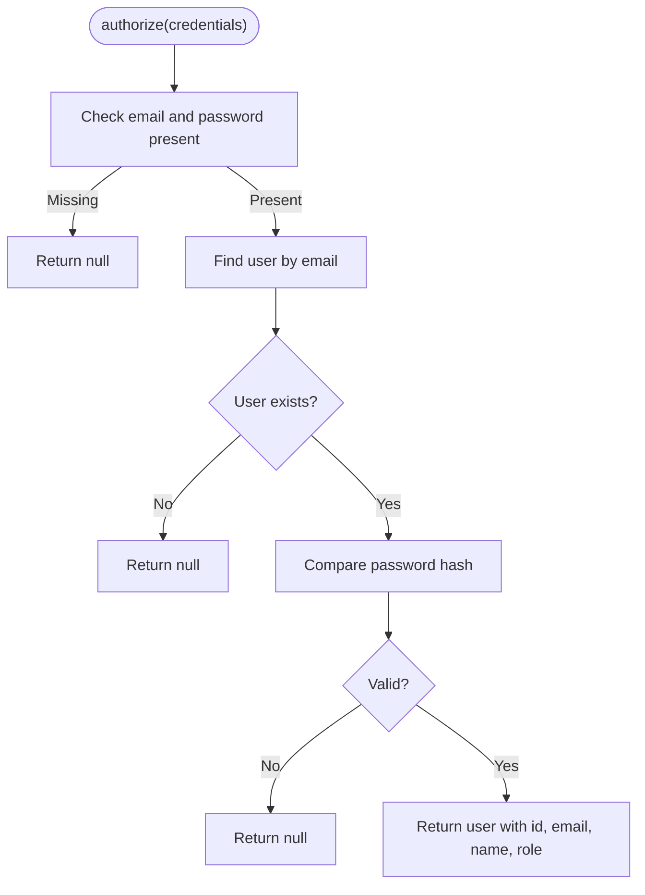

**Diagram sources**
- [src/auth.ts:35-58](file://src/auth.ts#L35-L58)

**Section sources**
- [src/auth.ts:27-86](file://src/auth.ts#L27-L86)

### Middleware and Route Protection
- Exports NextAuth's auth function as middleware
- Protects routes matching patterns for dashboard, create, and admin with nested paths
- Middleware runs per-request to enforce authentication and authorization
- Authorized callback ensures any matched path requires authenticated session

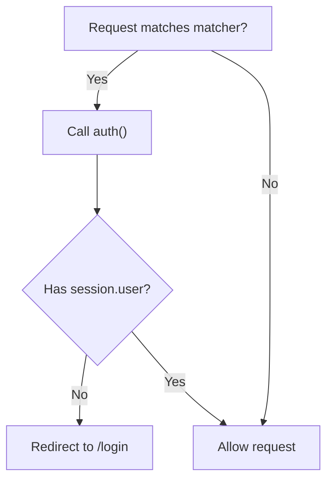

**Diagram sources**
- [src/middleware.ts:1-14](file://src/middleware.ts#L1-L14)

**Section sources**
- [src/middleware.ts:1-14](file://src/middleware.ts#L1-L14)

### User Roles and Permissions
- Role field defaults to "USER" in Prisma schema
- Enhanced role-based access control with ADMIN enforcement across multiple admin interfaces:
  - Admin page component (redirects non-admins)
  - Admin API endpoints for submissions, orders, templates, and pricing configuration
  - Header renders Admin navigation links conditionally based on role
  - Order moderation, template management, and pricing configuration restricted to ADMIN users

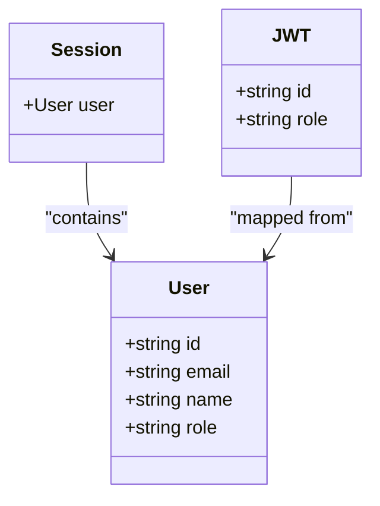

**Diagram sources**
- [prisma/schema.prisma:10-21](file://prisma/schema.prisma#L10-L21)
- [src/auth.ts:10-25](file://src/auth.ts#L10-L25)

**Section sources**
- [prisma/schema.prisma:15](file://prisma/schema.prisma#L15)
- [src/app/(admin)/admin/page.tsx:5-12](file://src/app/(admin)/admin/page.tsx#L5-L12)
- [src/app/api/admin/submissions/route.ts:7-10](file://src/app/api/admin/submissions/route.ts#L7-L10)
- [src/app/api/admin/orders/route.ts:7-10](file://src/app/api/admin/orders/route.ts#L7-L10)
- [src/app/api/admin/templates/route.ts:14-17](file://src/app/api/admin/templates/route.ts#L14-L17)
- [src/app/api/admin/pricing-config/route.ts:7-10](file://src/app/api/admin/pricing-config/route.ts#L7-L10)
- [src/components/layout/Header.tsx:30-52](file://src/components/layout/Header.tsx#L30-L52)

### Authentication Flow: Login to Protected Routes
- Login page renders LoginForm
- LoginForm submits credentials to NextAuth
- On success, redirects to dashboard
- Middleware enforces auth on protected routes
- Protected pages render content after successful auth
- Admin routes additionally enforce role-based access control

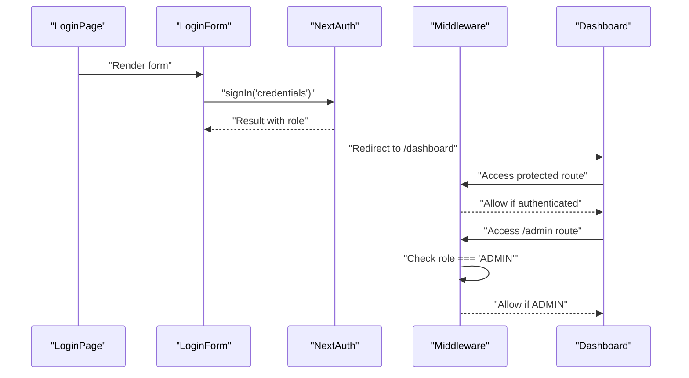

**Diagram sources**
- [src/app/(auth)/login/page.tsx:1-13](file://src/app/(auth)/login/page.tsx#L1-L13)
- [src/components/auth/LoginForm.tsx:14-33](file://src/components/auth/LoginForm.tsx#L14-L33)
- [src/middleware.ts:1-14](file://src/middleware.ts#L1-L14)
- [src/app/(protected)/dashboard/page.tsx:1-20](file://src/app/(protected)/dashboard/page.tsx#L1-L20)
- [src/app/(admin)/admin/page.tsx:5-12](file://src/app/(admin)/admin/page.tsx#L5-L12)

**Section sources**
- [src/app/(auth)/login/page.tsx:1-13](file://src/app/(auth)/login/page.tsx#L1-L13)
- [src/components/auth/LoginForm.tsx:14-33](file://src/components/auth/LoginForm.tsx#L14-L33)
- [src/middleware.ts:1-14](file://src/middleware.ts#L1-L14)
- [src/app/(protected)/dashboard/page.tsx:1-20](file://src/app/(protected)/dashboard/page.tsx#L1-L20)
- [src/app/(admin)/admin/page.tsx:5-12](file://src/app/(admin)/admin/page.tsx#L5-L12)

### Registration Process and Password Hashing
- Register page renders RegisterForm
- RegisterForm posts to /api/register with name, email, password
- API endpoint validates input, checks uniqueness, hashes password with bcrypt, creates user with default USER role
- On success, redirects to login with a success indicator

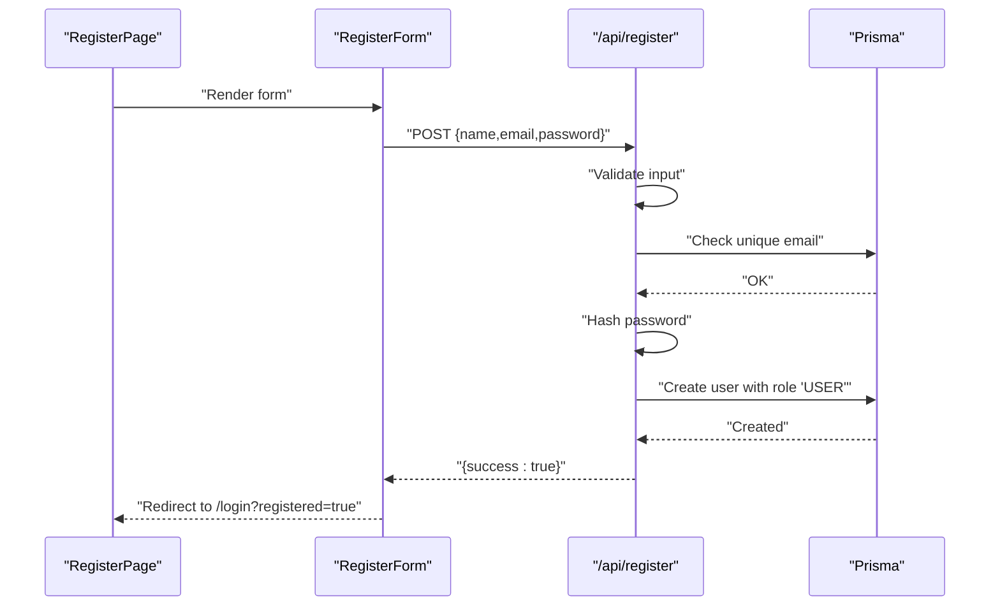

**Diagram sources**
- [src/app/(auth)/register/page.tsx:1-13](file://src/app/(auth)/register/page.tsx#L1-L13)
- [src/components/auth/RegisterForm.tsx:14-39](file://src/components/auth/RegisterForm.tsx#L14-L39)
- [src/app/api/register/route.ts:12-46](file://src/app/api/register/route.ts#L12-L46)

**Section sources**
- [src/app/(auth)/register/page.tsx:1-13](file://src/app/(auth)/register/page.tsx#L1-L13)
- [src/components/auth/RegisterForm.tsx:14-39](file://src/components/auth/RegisterForm.tsx#L14-L39)
- [src/app/api/register/route.ts:12-46](file://src/app/api/register/route.ts#L12-L46)

### Protected Route Groups and Authorization Hooks
- Protected group: dashboard and create routes are protected by middleware
- Admin-only group: admin routes (/admin, /admin/orders, /admin/templates, /admin/pricing) require ADMIN role
- Authorization hooks:
  - Admin pages: server-side check of session.user.role
  - Admin API endpoints: server-side check of session.user.id and role
  - Header navigation: conditional rendering based on role

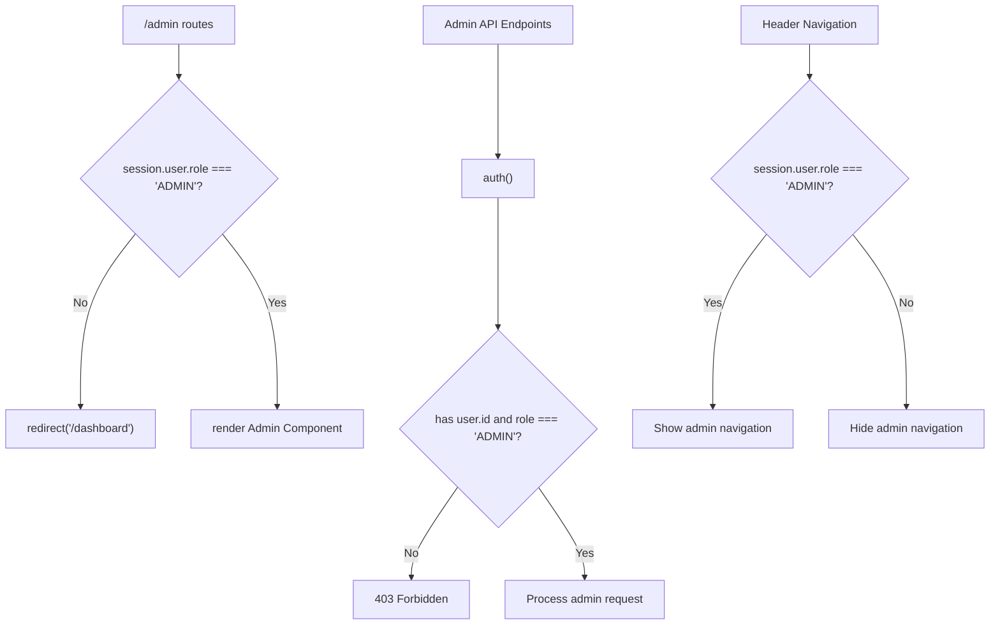

**Diagram sources**
- [src/app/(admin)/admin/page.tsx:5-12](file://src/app/(admin)/admin/page.tsx#L5-L12)
- [src/app/api/admin/submissions/route.ts:7-10](file://src/app/api/admin/submissions/route.ts#L7-L10)
- [src/app/api/admin/orders/route.ts:7-10](file://src/app/api/admin/orders/route.ts#L7-L10)
- [src/app/api/admin/templates/route.ts:14-17](file://src/app/api/admin/templates/route.ts#L14-L17)
- [src/app/api/admin/pricing-config/route.ts:7-10](file://src/app/api/admin/pricing-config/route.ts#L7-L10)
- [src/components/layout/Header.tsx:30-52](file://src/components/layout/Header.tsx#L30-L52)

**Section sources**
- [src/middleware.ts:3-14](file://src/middleware.ts#L3-L14)
- [src/app/(admin)/admin/page.tsx:5-12](file://src/app/(admin)/admin/page.tsx#L5-L12)
- [src/app/api/admin/submissions/route.ts:7-10](file://src/app/api/admin/submissions/route.ts#L7-L10)
- [src/app/api/admin/orders/route.ts:7-10](file://src/app/api/admin/orders/route.ts#L7-L10)
- [src/app/api/admin/templates/route.ts:14-17](file://src/app/api/admin/templates/route.ts#L14-L17)
- [src/app/api/admin/pricing-config/route.ts:7-10](file://src/app/api/admin/pricing-config/route.ts#L7-L10)
- [src/components/layout/Header.tsx:30-52](file://src/components/layout/Header.tsx#L30-L52)

### Session Management and Token Lifecycle
- Session strategy: JWT with role claims
- Token storage: Browser cookies managed by NextAuth
- Token population: jwt callback attaches id and role
- Session exposure: session callback exposes id, email, name, and role to client/server
- Pages and APIs access session via NextAuth auth function with role-based enforcement

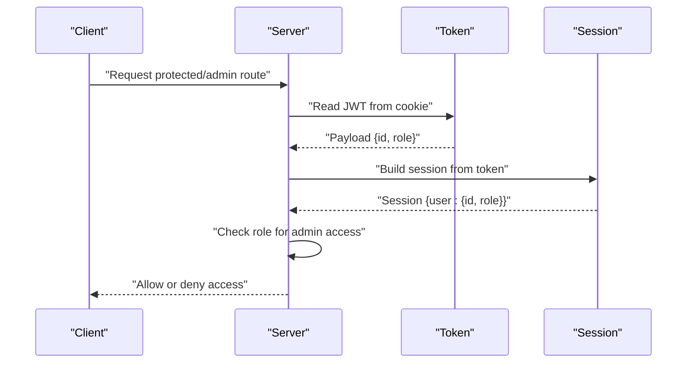

**Diagram sources**
- [src/auth.ts:72-83](file://src/auth.ts#L72-L83)

**Section sources**
- [src/auth.ts:61-83](file://src/auth.ts#L61-L83)

## Enhanced Role-Based Access Control

### Role-Based Architecture
The system implements a hierarchical role-based access control system with two primary roles:

**USER Role (Default)**
- Full access to dashboard and creation features
- Limited to basic user functionality
- Cannot access admin interfaces or administrative features

**ADMIN Role**
- Full access to all USER features plus administrative capabilities
- Access to order moderation interface
- Access to template management system
- Access to pricing configuration interface
- Ability to approve/reject submissions
- Full administrative control over system configuration

### Role Enforcement Mechanisms

#### Server-Side Role Checks
All admin endpoints implement comprehensive role-based access control:

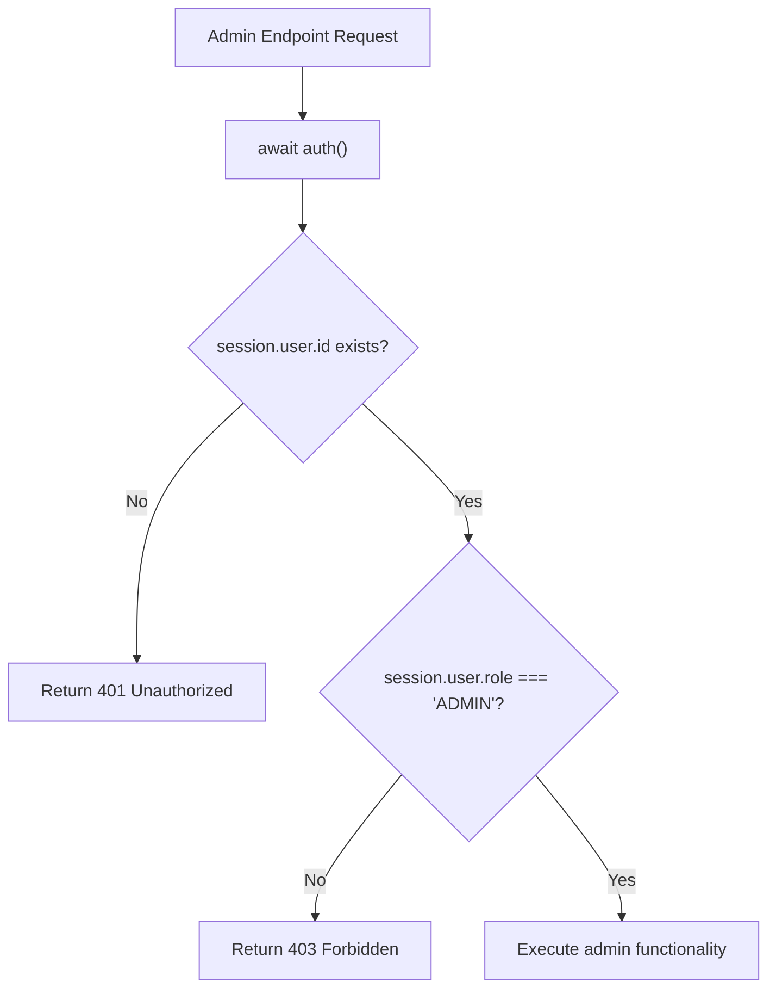

**Diagram sources**
- [src/app/api/admin/submissions/route.ts:7-10](file://src/app/api/admin/submissions/route.ts#L7-L10)
- [src/app/api/admin/orders/route.ts:7-10](file://src/app/api/admin/orders/route.ts#L7-L10)
- [src/app/api/admin/templates/route.ts:14-17](file://src/app/api/admin/templates/route.ts#L14-L17)
- [src/app/api/admin/pricing-config/route.ts:7-10](file://src/app/api/admin/pricing-config/route.ts#L7-L10)

#### Client-Side Navigation Control
The header component dynamically renders admin navigation links based on user role:

- ADMIN users see "Admin", "Templates", and "Pricing" navigation links
- Non-ADMIN users only see standard navigation links
- Admin pages enforce role checks server-side for security

**Section sources**
- [src/app/(admin)/admin/page.tsx:5-12](file://src/app/(admin)/admin/page.tsx#L5-L12)
- [src/components/layout/Header.tsx:30-52](file://src/components/layout/Header.tsx#L30-L52)
- [src/app/api/admin/submissions/route.ts:7-10](file://src/app/api/admin/submissions/route.ts#L7-L10)
- [src/app/api/admin/orders/route.ts:7-10](file://src/app/api/admin/orders/route.ts#L7-L10)
- [src/app/api/admin/templates/route.ts:14-17](file://src/app/api/admin/templates/route.ts#L14-L17)
- [src/app/api/admin/pricing-config/route.ts:7-10](file://src/app/api/admin/pricing-config/route.ts#L7-L10)

## Admin Features Implementation

### Order Moderation System
The order moderation interface provides comprehensive administrative control over customer orders:

**Key Features:**
- Real-time order listing with filtering by status
- Direct status modification with validation
- Internal notes management
- Bulk status updates
- Geographic zone filtering
- Quantity-based order analysis

**Implementation Details:**
- Server-side validation using Zod schemas
- Controlled status transitions based on current order state
- Preserved order history and audit trails
- Responsive design with real-time updates

**Section sources**
- [src/app/(admin)/admin/orders/page.tsx:1-30](file://src/app/(admin)/admin/orders/page.tsx#L1-L30)
- [src/components/admin/OrderModeration.tsx:1-300](file://src/components/admin/OrderModeration.tsx#L1-L300)
- [src/app/api/admin/orders/route.ts:1-40](file://src/app/api/admin/orders/route.ts#L1-L40)

### Template Management System
The template management interface enables administrators to control reusable content templates:

**Core Functionality:**
- Template creation with predefined page structures
- Template publishing workflow
- Template deletion with instance count validation
- Template versioning and approval system
- Instance tracking for published templates

**Security Measures:**
- Template deletion prevents removal of templates with active instances
- Publishing requires template approval status
- All template operations require ADMIN role

**Section sources**
- [src/app/(admin)/admin/templates/page.tsx:1-17](file://src/app/(admin)/admin/templates/page.tsx#L1-L17)
- [src/components/admin/TemplateManager.tsx:1-269](file://src/components/admin/TemplateManager.tsx#L1-L269)
- [src/app/api/admin/templates/route.ts:1-100](file://src/app/api/admin/templates/route.ts#L1-L100)

### Pricing Configuration Interface
The comprehensive pricing configuration system allows administrators to manage complex pricing models:

**Configuration Areas:**
- Global pricing parameters (weight, handling costs)
- Multi-zone shipping tables with weight bands
- Volume-based price tiers with validation
- Currency exchange rate management
- Real-time pricing calculation preview

**Advanced Features:**
- Live pricing preview for immediate validation
- Default configuration reset capabilities
- Comprehensive input validation and error handling
- Version tracking for configuration changes

**Section sources**
- [src/app/(admin)/admin/pricing/page.tsx:1-30](file://src/app/(admin)/admin/pricing/page.tsx#L1-L30)
- [src/components/admin/PricingConfigForm.tsx:1-710](file://src/components/admin/PricingConfigForm.tsx#L1-L710)
- [src/app/api/admin/pricing-config/route.ts:1-47](file://src/app/api/admin/pricing-config/route.ts#L1-L47)

### Administrative Dashboard
The main admin dashboard provides centralized access to all administrative functions:

**Dashboard Features:**
- Submission monitoring with approval controls
- Real-time order statistics
- Template management overview
- Pricing configuration status
- User activity monitoring

**Section sources**
- [src/components/admin/AdminDashboard.tsx:1-168](file://src/components/admin/AdminDashboard.tsx#L1-L168)
- [src/app/api/admin/submissions/route.ts:1-38](file://src/app/api/admin/submissions/route.ts#L1-L38)

## Dependency Analysis
- NextAuth depends on Prisma for user lookup and bcrypt for password comparison
- Middleware depends on NextAuth auth function for enforcement
- Protected pages depend on middleware for access control
- Admin-only resources depend on role checks in both page and API layers
- Header component reads session state from NextAuth client hooks
- Admin components depend on specialized API endpoints for administrative functions

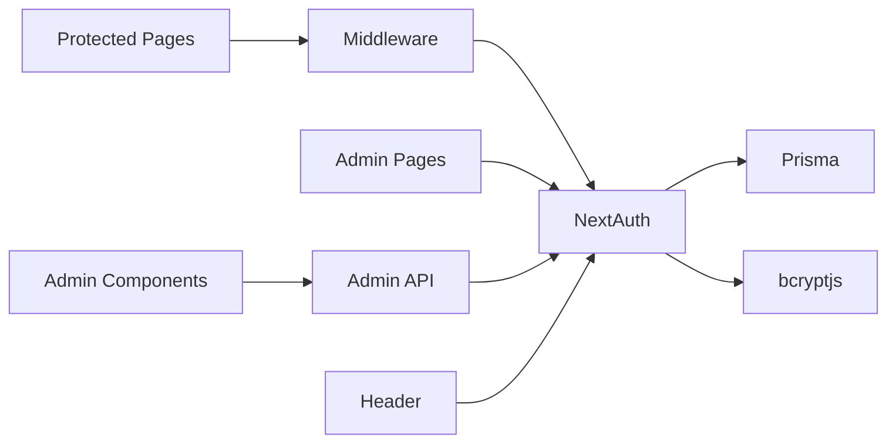

**Diagram sources**
- [src/auth.ts:3-4](file://src/auth.ts#L3-L4)
- [src/middleware.ts:1-1](file://src/middleware.ts#L1-L1)
- [src/app/(admin)/admin/page.tsx:2-6](file://src/app/(admin)/admin/page.tsx#L2-L6)
- [src/app/api/admin/submissions/route.ts:2-7](file://src/app/api/admin/submissions/route.ts#L2-L7)
- [src/components/layout/Header.tsx:3-7](file://src/components/layout/Header.tsx#L3-L7)
- [src/components/admin/AdminDashboard.tsx:1-168](file://src/components/admin/AdminDashboard.tsx#L1-L168)

**Section sources**
- [src/auth.ts:3-4](file://src/auth.ts#L3-L4)
- [src/middleware.ts:1-1](file://src/middleware.ts#L1-L1)
- [src/app/(admin)/admin/page.tsx:2-6](file://src/app/(admin)/admin/page.tsx#L2-L6)
- [src/app/api/admin/submissions/route.ts:2-7](file://src/app/api/admin/submissions/route.ts#L2-L7)
- [src/components/layout/Header.tsx:3-7](file://src/components/layout/Header.tsx#L3-L7)
- [src/components/admin/AdminDashboard.tsx:1-168](file://src/components/admin/AdminDashboard.tsx#L1-L168)

## Performance Considerations
- Prefer JWT strategy for reduced database load on protected routes
- Keep token payload minimal; only include necessary fields (id, role)
- Use middleware matchers to limit auth checks to protected paths
- Cache infrequent admin queries and avoid heavy computations in callbacks
- Implement efficient database indexing for admin queries (user, status, timestamps)
- Use pagination for admin interfaces to handle large datasets efficiently

## Security Best Practices

### Role-Based Access Control
- Always verify user role on both client and server sides
- Never trust client-side role checks alone for sensitive operations
- Implement defense-in-depth with multiple verification layers
- Log all admin actions for audit trail purposes

### Token Management
- Use HTTPS in production to protect cookies
- Set secure, same-site cookie attributes via NextAuth configuration
- Implement appropriate session idle timeouts and sliding expiration
- Rotate secrets regularly and manage environment variables securely

### Input Validation and Sanitization
- Validate all inputs using Zod schemas for admin endpoints
- Sanitize and validate all user inputs, especially for administrative functions
- Implement rate limiting for admin API endpoints
- Use prepared statements to prevent SQL injection attacks

### Session Security
- Enforce role checks at both client and server boundaries
- Implement proper session invalidation on logout
- Monitor for suspicious authentication patterns
- Regular security audits of authentication flows

## Troubleshooting Guide
- Login fails: Verify credentials are provided and password hash matches stored hash
- Redirect loop to login: Ensure matcher patterns align with intended protected routes
- Admin access denied: Confirm user role is ADMIN and session carries role claim
- Registration errors: Check validation messages and uniqueness constraints
- Session not persisting: Verify cookie settings and HTTPS configuration
- Admin feature inaccessible: Check that user has ADMIN role assigned in database
- API endpoint failures: Verify role-based access control is properly configured
- Navigation issues: Ensure header component correctly handles role-based visibility

**Section sources**
- [src/components/auth/LoginForm.tsx:27-32](file://src/components/auth/LoginForm.tsx#L27-L32)
- [src/middleware.ts:3-14](file://src/middleware.ts#L3-L14)
- [src/app/(admin)/admin/page.tsx:6-12](file://src/app/(admin)/admin/page.tsx#L6-L12)
- [src/app/api/register/route.ts:17-32](file://src/app/api/register/route.ts#L17-L32)
- [src/app/api/admin/submissions/route.ts:7-10](file://src/app/api/admin/submissions/route.ts#L7-L10)

## Conclusion
Titchybook Creator implements a robust, role-based authentication and authorization system using NextAuth with JWT. The enhanced system includes comprehensive administrative capabilities with multiple user roles (USER, ADMIN), sophisticated middleware-based route protection, and extensive role-based access control across admin features including order moderation, template management, and pricing configuration. The architecture balances security and performance while providing clear extension points for future enhancements. The system demonstrates enterprise-grade security practices with proper role enforcement, input validation, and comprehensive audit capabilities.