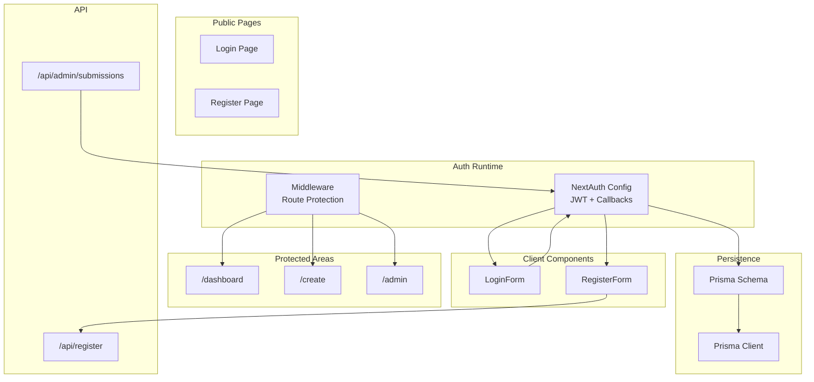
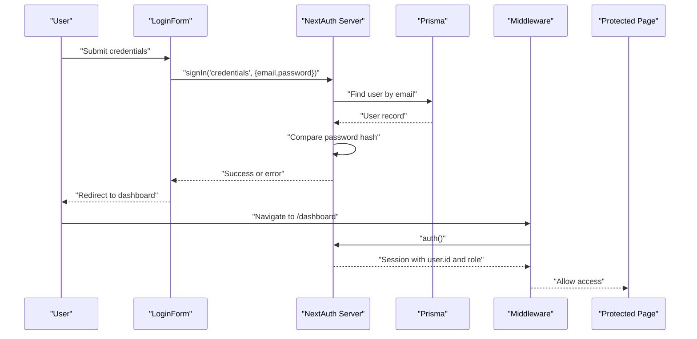
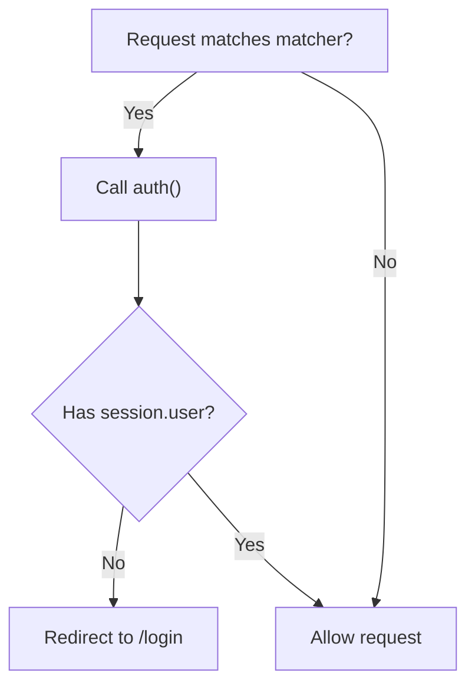
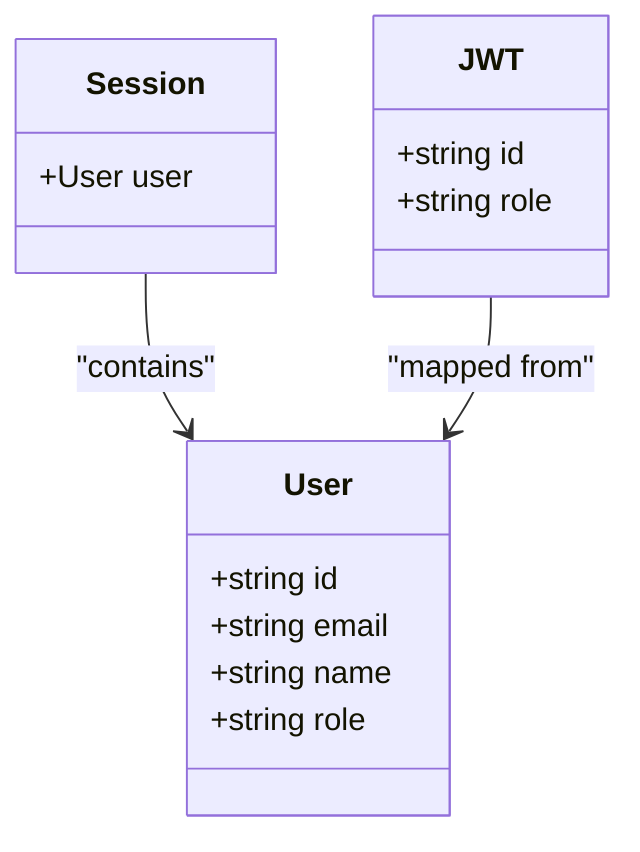
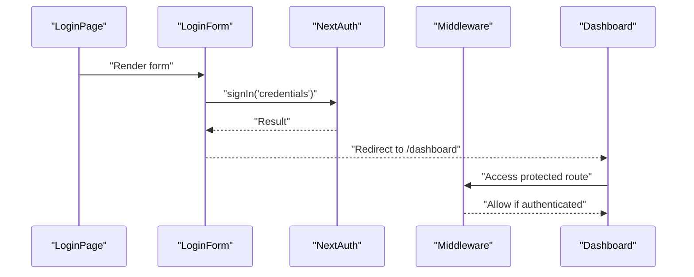
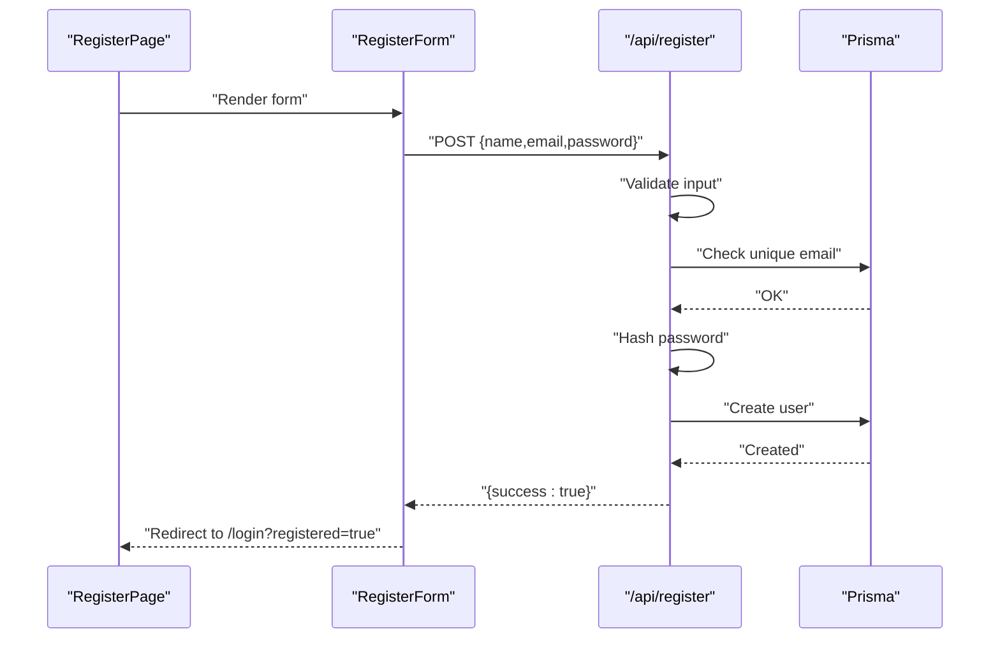
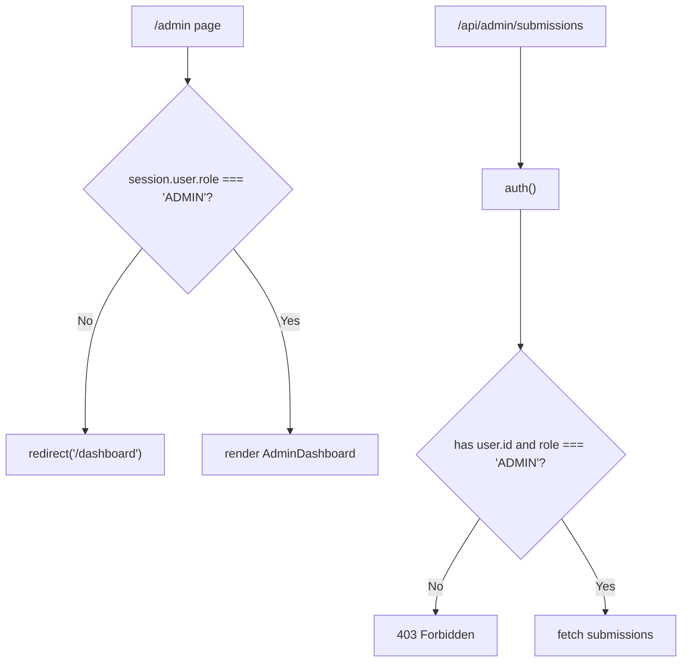
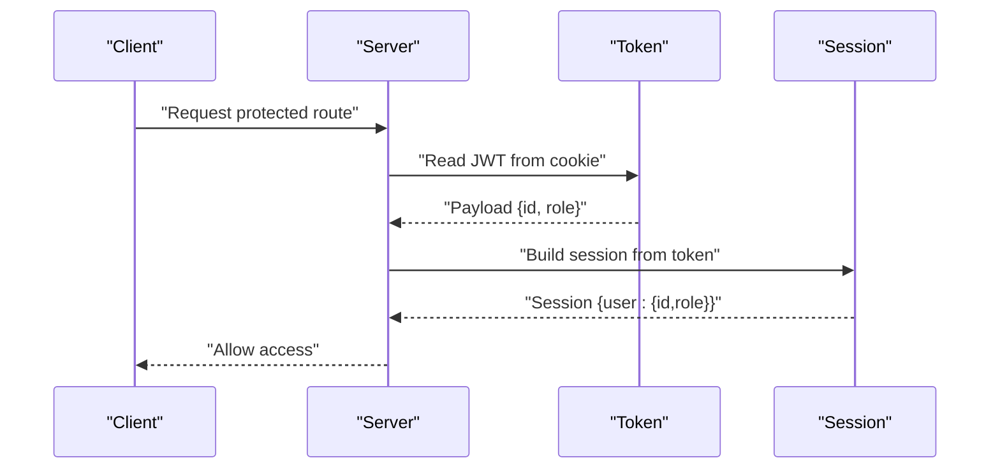
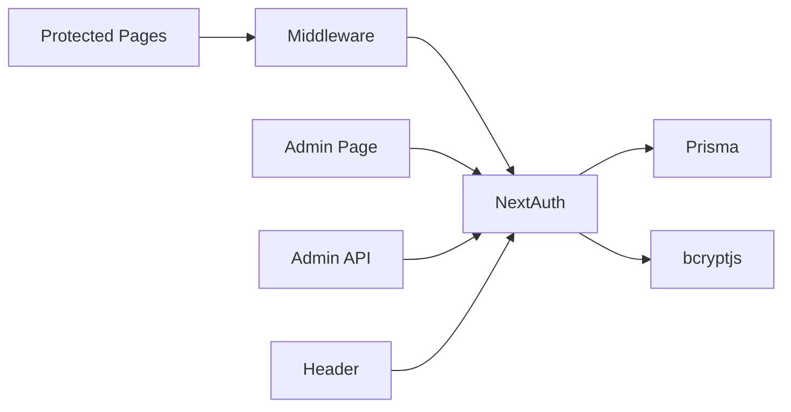

# Authentication & Authorization

<cite>
**Referenced Files in This Document**
- [src/auth.ts](file://src/auth.ts)
- [src/middleware.ts](file://src/middleware.ts)
- [prisma/schema.prisma](file://prisma/schema.prisma)
- [src/lib/prisma.ts](file://src/lib/prisma.ts)
- [src/app/(auth)/login/page.tsx](file://src/app/(auth)/login/page.tsx)
- [src/components/auth/LoginForm.tsx](file://src/components/auth/LoginForm.tsx)
- [src/app/(auth)/register/page.tsx](file://src/app/(auth)/register/page.tsx)
- [src/components/auth/RegisterForm.tsx](file://src/components/auth/RegisterForm.tsx)
- [src/app/api/register/route.ts](file://src/app/api/register/route.ts)
- [src/app/api/admin/submissions/route.ts](file://src/app/api/admin/submissions/route.ts)
- [src/app/(admin)/admin/page.tsx](file://src/app/(admin)/admin/page.tsx)
- [src/components/layout/Header.tsx](file://src/components/layout/Header.tsx)
- [src/app/(protected)/dashboard/page.tsx](file://src/app/(protected)/dashboard/page.tsx)
- [src/app/(protected)/create/page.tsx](file://src/app/(protected)/create/page.tsx)
</cite>

## Table of Contents
1. [Introduction](#introduction)
2. [Project Structure](#project-structure)
3. [Core Components](#core-components)
4. [Architecture Overview](#architecture-overview)
5. [Detailed Component Analysis](#detailed-component-analysis)
6. [Dependency Analysis](#dependency-analysis)
7. [Performance Considerations](#performance-considerations)
8. [Troubleshooting Guide](#troubleshooting-guide)
9. [Conclusion](#conclusion)

## Introduction
This document explains the authentication and authorization system for Titchybook Creator. It covers NextAuth configuration with JWT strategy, custom callbacks, and session management; user roles and permissions; the end-to-end authentication flow from login to protected route access; the registration process and password hashing; session persistence; middleware-based route protection and role-based access control; and security best practices, token management, and session timeout handling. It also documents protected route groups, custom authorization hooks, and integration points for future social login providers.

## Project Structure
Authentication and authorization span several areas:
- NextAuth configuration and runtime exports
- Middleware for route protection
- Public authentication pages and client components
- API endpoints for registration and admin access
- Protected pages and admin-only pages
- Shared Prisma schema and client

**Diagram sources**
- [src/auth.ts:27-79](file://src/auth.ts#L27-L79)
- [src/middleware.ts:1-6](file://src/middleware.ts#L1-L6)
- [src/app/(auth)/login/page.tsx:1-13](file://src/app/(auth)/login/page.tsx#L1-L13)
- [src/components/auth/LoginForm.tsx:1-86](file://src/components/auth/LoginForm.tsx#L1-L86)
- [src/app/(auth)/register/page.tsx:1-13](file://src/app/(auth)/register/page.tsx#L1-L13)
- [src/components/auth/RegisterForm.tsx:1-107](file://src/components/auth/RegisterForm.tsx#L1-L107)
- [src/app/api/register/route.ts:1-47](file://src/app/api/register/route.ts#L1-L47)
- [src/app/api/admin/submissions/route.ts:1-38](file://src/app/api/admin/submissions/route.ts#L1-L38)
- [prisma/schema.prisma:10-19](file://prisma/schema.prisma#L10-L19)
- [src/lib/prisma.ts:1-10](file://src/lib/prisma.ts#L1-L10)

**Section sources**
- [src/auth.ts:27-79](file://src/auth.ts#L27-L79)
- [src/middleware.ts:1-6](file://src/middleware.ts#L1-L6)
- [prisma/schema.prisma:10-19](file://prisma/schema.prisma#L10-L19)
- [src/lib/prisma.ts:1-10](file://src/lib/prisma.ts#L1-L10)

## Core Components
- NextAuth configuration with JWT strategy and custom callbacks for token/session propagation
- Middleware exporting the NextAuth auth function for route protection
- Prisma schema defining user roles and relations
- Login and registration UI flows with client-side form handling
- Registration API endpoint with validation and bcrypt hashing
- Admin-only API endpoint gated by role checks
- Admin page enforcing role-based redirection
- Protected pages under designated route groups

**Section sources**
- [src/auth.ts:27-79](file://src/auth.ts#L27-L79)
- [src/middleware.ts:1-6](file://src/middleware.ts#L1-L6)
- [prisma/schema.prisma:10-19](file://prisma/schema.prisma#L10-L19)
- [src/app/api/register/route.ts:1-47](file://src/app/api/register/route.ts#L1-L47)
- [src/app/api/admin/submissions/route.ts:1-38](file://src/app/api/admin/submissions/route.ts#L1-L38)
- [src/app/(admin)/admin/page.tsx:1-13](file://src/app/(admin)/admin/page.tsx#L1-L13)

## Architecture Overview
The system uses NextAuth with JWT strategy. Users authenticate via credentials, NextAuth stores a JWT, and callbacks populate the token and session with user ID and role. Middleware protects routes by invoking the NextAuth auth function. Protected pages and admin-only pages enforce role checks. Registration uses a dedicated API endpoint with bcrypt hashing.

**Diagram sources**
- [src/components/auth/LoginForm.tsx:14-33](file://src/components/auth/LoginForm.tsx#L14-L33)
- [src/auth.ts:35-58](file://src/auth.ts#L35-L58)
- [src/lib/prisma.ts:1-10](file://src/lib/prisma.ts#L1-L10)
- [src/middleware.ts:1-6](file://src/middleware.ts#L1-L6)
- [src/app/(protected)/dashboard/page.tsx:1-20](file://src/app/(protected)/dashboard/page.tsx#L1-L20)

## Detailed Component Analysis

### NextAuth Configuration (JWT, Callbacks, Session)
- Provider: Credentials provider with email/password fields
- Authorization: Validates presence of credentials, queries user by email, compares password hash, returns user with role
- Session strategy: JWT
- Pages: Custom login page mapped to "/login"
- Callbacks:
  - jwt: Attach user.id and role to the token
  - session: Populate session.user with id and role from token

**Diagram sources**
- [src/auth.ts:35-58](file://src/auth.ts#L35-L58)

**Section sources**
- [src/auth.ts:27-79](file://src/auth.ts#L27-L79)

### Middleware and Route Protection
- Exports NextAuth’s auth function as middleware
- Protects routes matching patterns for dashboard, create, and admin
- Middleware runs per-request to enforce authentication and authorization

**Diagram sources**
- [src/middleware.ts:1-6](file://src/middleware.ts#L1-L6)

**Section sources**
- [src/middleware.ts:1-6](file://src/middleware.ts#L1-L6)

### User Roles and Permissions
- Role field defaults to "USER" in Prisma schema
- Admin-only access enforced in:
  - Admin page component (redirects non-admins)
  - Admin API endpoint (requires ADMIN role)
- Header renders Admin link conditionally based on role

**Diagram sources**
- [prisma/schema.prisma:10-19](file://prisma/schema.prisma#L10-L19)
- [src/auth.ts:10-25](file://src/auth.ts#L10-L25)

**Section sources**
- [prisma/schema.prisma:10-19](file://prisma/schema.prisma#L10-L19)
- [src/app/(admin)/admin/page.tsx:5-12](file://src/app/(admin)/admin/page.tsx#L5-L12)
- [src/app/api/admin/submissions/route.ts:6-10](file://src/app/api/admin/submissions/route.ts#L6-L10)
- [src/components/layout/Header.tsx:30-37](file://src/components/layout/Header.tsx#L30-L37)

### Authentication Flow: Login to Protected Routes
- Login page renders LoginForm
- LoginForm submits credentials to NextAuth
- On success, redirects to dashboard
- Middleware enforces auth on protected routes
- Protected pages render content after successful auth

**Diagram sources**
- [src/app/(auth)/login/page.tsx:1-13](file://src/app/(auth)/login/page.tsx#L1-L13)
- [src/components/auth/LoginForm.tsx:14-33](file://src/components/auth/LoginForm.tsx#L14-L33)
- [src/middleware.ts:1-6](file://src/middleware.ts#L1-L6)
- [src/app/(protected)/dashboard/page.tsx:1-20](file://src/app/(protected)/dashboard/page.tsx#L1-L20)

**Section sources**
- [src/app/(auth)/login/page.tsx:1-13](file://src/app/(auth)/login/page.tsx#L1-L13)
- [src/components/auth/LoginForm.tsx:14-33](file://src/components/auth/LoginForm.tsx#L14-L33)
- [src/middleware.ts:1-6](file://src/middleware.ts#L1-L6)
- [src/app/(protected)/dashboard/page.tsx:1-20](file://src/app/(protected)/dashboard/page.tsx#L1-L20)

### Registration Process and Password Hashing
- Register page renders RegisterForm
- RegisterForm posts to /api/register with name, email, password
- API endpoint validates input, checks uniqueness, hashes password with bcrypt, creates user
- On success, redirects to login with a success indicator

**Diagram sources**
- [src/app/(auth)/register/page.tsx:1-13](file://src/app/(auth)/register/page.tsx#L1-L13)
- [src/components/auth/RegisterForm.tsx:14-39](file://src/components/auth/RegisterForm.tsx#L14-L39)
- [src/app/api/register/route.ts:12-46](file://src/app/api/register/route.ts#L12-L46)

**Section sources**
- [src/app/(auth)/register/page.tsx:1-13](file://src/app/(auth)/register/page.tsx#L1-L13)
- [src/components/auth/RegisterForm.tsx:14-39](file://src/components/auth/RegisterForm.tsx#L14-L39)
- [src/app/api/register/route.ts:12-46](file://src/app/api/register/route.ts#L12-L46)

### Protected Route Groups and Authorization Hooks
- Protected group: dashboard and create routes are protected by middleware
- Admin-only group: admin page and admin API require ADMIN role
- Authorization hooks:
  - Admin page: server-side check of session.user.role
  - Admin API: server-side check of session.user.id and role

**Diagram sources**
- [src/app/(admin)/admin/page.tsx:5-12](file://src/app/(admin)/admin/page.tsx#L5-L12)
- [src/app/api/admin/submissions/route.ts:6-10](file://src/app/api/admin/submissions/route.ts#L6-L10)

**Section sources**
- [src/middleware.ts:3-5](file://src/middleware.ts#L3-L5)
- [src/app/(admin)/admin/page.tsx:5-12](file://src/app/(admin)/admin/page.tsx#L5-L12)
- [src/app/api/admin/submissions/route.ts:6-10](file://src/app/api/admin/submissions/route.ts#L6-L10)

### Session Management and Token Lifecycle
- Session strategy: JWT
- Token storage: Browser cookies managed by NextAuth
- Token population: jwt callback attaches id and role
- Session exposure: session callback exposes id and role to client/server
- Pages and APIs access session via NextAuth auth function

**Diagram sources**
- [src/auth.ts:65-78](file://src/auth.ts#L65-L78)

**Section sources**
- [src/auth.ts:61-78](file://src/auth.ts#L61-L78)

### Social Login Integration Points
- NextAuth supports pluggable providers; the current configuration uses Credentials
- To integrate social providers, add providers to the providers array and configure their OAuth settings
- Ensure callbacks handle additional claims consistently (e.g., attaching role or id to token/session)

[No sources needed since this section provides general guidance]

### Security Best Practices, Token Management, and Session Timeout
- Use HTTPS in production to protect cookies
- Set secure, same-site cookie attributes via NextAuth configuration
- Implement appropriate session idle timeouts and sliding expiration
- Rotate secrets regularly and manage environment variables securely
- Sanitize and validate all inputs, as shown in the registration endpoint
- Enforce role checks at both client and server boundaries

[No sources needed since this section provides general guidance]

## Dependency Analysis
- NextAuth depends on Prisma for user lookup and bcrypt for password comparison
- Middleware depends on NextAuth auth function for enforcement
- Protected pages depend on middleware for access control
- Admin-only resources depend on role checks in both page and API layers
- Header component reads session state from NextAuth client hooks

**Diagram sources**
- [src/auth.ts:3-4](file://src/auth.ts#L3-L4)
- [src/middleware.ts:1-1](file://src/middleware.ts#L1-L1)
- [src/app/(admin)/admin/page.tsx:2-6](file://src/app/(admin)/admin/page.tsx#L2-L6)
- [src/app/api/admin/submissions/route.ts:2-7](file://src/app/api/admin/submissions/route.ts#L2-L7)
- [src/components/layout/Header.tsx:3-7](file://src/components/layout/Header.tsx#L3-L7)

**Section sources**
- [src/auth.ts:3-4](file://src/auth.ts#L3-L4)
- [src/middleware.ts:1-1](file://src/middleware.ts#L1-L1)
- [src/app/(admin)/admin/page.tsx:2-6](file://src/app/(admin)/admin/page.tsx#L2-L6)
- [src/app/api/admin/submissions/route.ts:2-7](file://src/app/api/admin/submissions/route.ts#L2-L7)
- [src/components/layout/Header.tsx:3-7](file://src/components/layout/Header.tsx#L3-L7)

## Performance Considerations
- Prefer JWT strategy for reduced database load on protected routes
- Keep token payload minimal; only include necessary fields (id, role)
- Use middleware matchers to limit auth checks to protected paths
- Cache infrequent admin queries and avoid heavy computations in callbacks

[No sources needed since this section provides general guidance]

## Troubleshooting Guide
- Login fails: Verify credentials are provided and password hash matches stored hash
- Redirect loop to login: Ensure matcher patterns align with intended protected routes
- Admin access denied: Confirm user role is ADMIN and session carries role claim
- Registration errors: Check validation messages and uniqueness constraints
- Session not persisting: Verify cookie settings and HTTPS configuration

**Section sources**
- [src/components/auth/LoginForm.tsx:27-32](file://src/components/auth/LoginForm.tsx#L27-L32)
- [src/middleware.ts:3-5](file://src/middleware.ts#L3-L5)
- [src/app/(admin)/admin/page.tsx:6-9](file://src/app/(admin)/admin/page.tsx#L6-L9)
- [src/app/api/register/route.ts:17-32](file://src/app/api/register/route.ts#L17-L32)

## Conclusion
Titchybook Creator implements a robust authentication and authorization system using NextAuth with JWT. The setup includes a credentials provider, custom callbacks for token/session propagation, middleware-based route protection, and role-based access control for admin features. Registration leverages bcrypt hashing and input validation. The architecture balances security and performance while providing clear extension points for future enhancements such as social login providers.