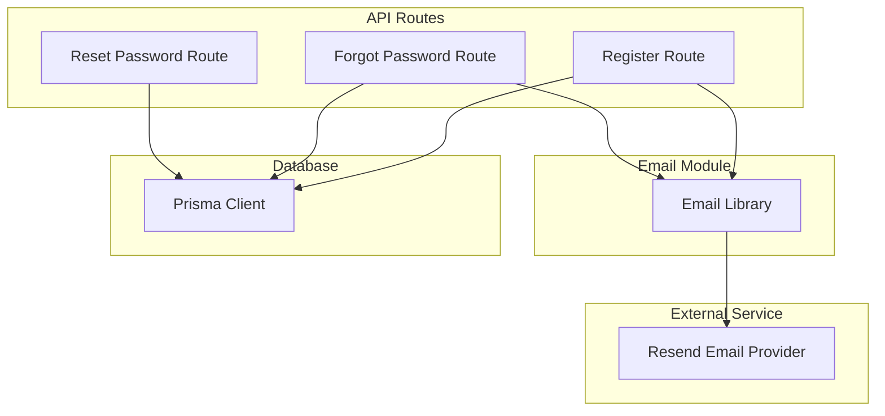
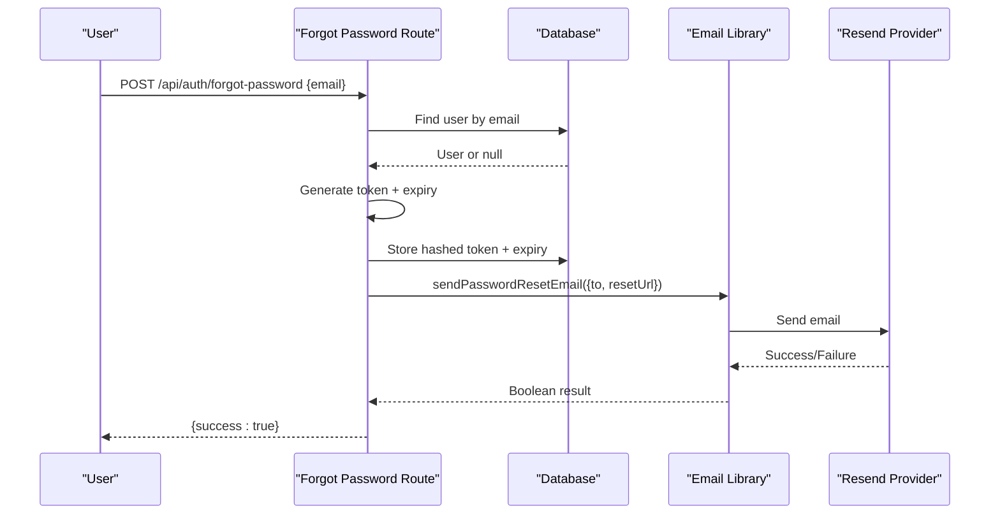
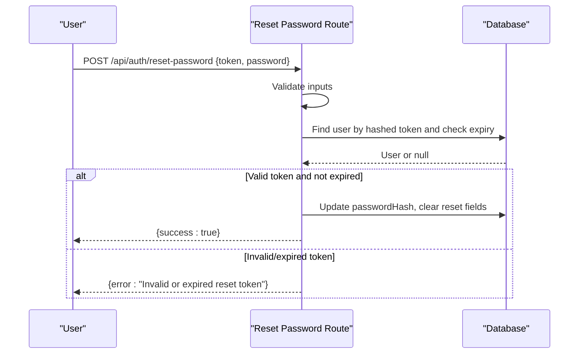
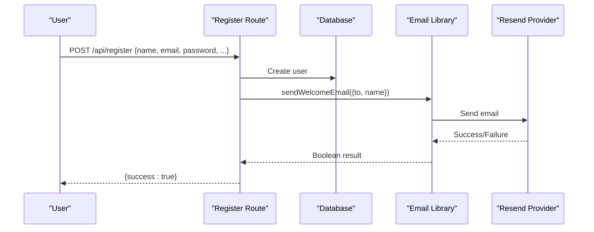
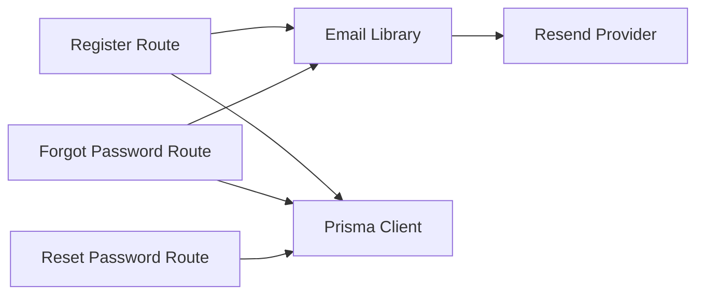

# Email System Integration

<cite>
**Referenced Files in This Document**
- [email.ts](file://src/lib/email.ts)
- [route.ts (forgot-password)](file://src/app/api/auth/forgot-password/route.ts)
- [route.ts (reset-password)](file://src/app/api/auth/reset-password/route.ts)
- [route.ts (register)](file://src/app/api/register/route.ts)
- [schema.prisma](file://prisma/schema.prisma)
- [package.json](file://package.json)
- [test-email.ts](file://test-email.ts)
</cite>

## Table of Contents
1. [Introduction](#introduction)
2. [Project Structure](#project-structure)
3. [Core Components](#core-components)
4. [Architecture Overview](#architecture-overview)
5. [Detailed Component Analysis](#detailed-component-analysis)
6. [Dependency Analysis](#dependency-analysis)
7. [Performance Considerations](#performance-considerations)
8. [Troubleshooting Guide](#troubleshooting-guide)
9. [Conclusion](#conclusion)

## Introduction
This document explains the email system integration for user onboarding and password recovery. It covers how emails are sent, where configuration lives, how authentication flows use email, and how to test and troubleshoot the system. The implementation uses a modern email provider client and integrates with Next.js API routes and Prisma-managed user data.

## Project Structure
The email functionality is implemented as a small, focused module that is consumed by authentication-related API routes:
- Email sending logic is centralized in a dedicated library file.
- Authentication endpoints trigger email sending for password reset and welcome messages.
- User data includes fields required for secure password reset token handling.
- A standalone script enables quick testing of email delivery without running the full app.

**Diagram sources**
- [email.ts:1-160](file://src/lib/email.ts#L1-L160)
- [route.ts (forgot-password):1-73](file://src/app/api/auth/forgot-password/route.ts#L1-L73)
- [route.ts (reset-password):1-65](file://src/app/api/auth/reset-password/route.ts#L1-L65)
- [route.ts (register):1-94](file://src/app/api/register/route.ts#L1-L94)
- [schema.prisma:10-30](file://prisma/schema.prisma#L10-L30)

**Section sources**
- [email.ts:1-160](file://src/lib/email.ts#L1-L160)
- [route.ts (forgot-password):1-73](file://src/app/api/auth/forgot-password/route.ts#L1-L73)
- [route.ts (reset-password):1-65](file://src/app/api/auth/reset-password/route.ts#L1-L65)
- [route.ts (register):1-94](file://src/app/api/register/route.ts#L1-L94)
- [schema.prisma:10-30](file://prisma/schema.prisma#L10-L30)

## Core Components
- Email library: Provides functions to send password reset and welcome emails using an email provider client. It initializes the client from environment variables and returns boolean success indicators.
- Forgot password route: Validates input, generates and stores a hashed reset token, builds a reset URL, and sends a password reset email.
- Reset password route: Validates incoming token and new password, verifies token validity against stored hash and expiry, updates the password, and clears reset fields.
- Register route: Creates a new user and sends a welcome email asynchronously so registration does not fail if email delivery fails.
- Database schema: Stores user credentials and password reset tokens with expiration timestamps.

Key responsibilities:
- Centralized email sending with clear error logging and graceful degradation when configuration is missing.
- Secure token handling via hashing and time-bound expiration.
- Non-blocking welcome email during registration to avoid impacting user experience.

**Section sources**
- [email.ts:17-159](file://src/lib/email.ts#L17-L159)
- [route.ts (forgot-password):6-72](file://src/app/api/auth/forgot-password/route.ts#L6-L72)
- [route.ts (reset-password):7-64](file://src/app/api/auth/reset-password/route.ts#L7-L64)
- [route.ts (register):7-93](file://src/app/api/register/route.ts#L7-L93)
- [schema.prisma:10-30](file://prisma/schema.prisma#L10-L30)

## Architecture Overview
The email flow spans three layers: API routes, email library, and external email provider. Data persistence is handled via Prisma for user state and reset tokens.

**Diagram sources**
- [route.ts (forgot-password):6-72](file://src/app/api/auth/forgot-password/route.ts#L6-L72)
- [email.ts:31-90](file://src/lib/email.ts#L31-L90)
- [schema.prisma:10-30](file://prisma/schema.prisma#L10-L30)

**Diagram sources**
- [route.ts (reset-password):7-64](file://src/app/api/auth/reset-password/route.ts#L7-L64)
- [schema.prisma:10-30](file://prisma/schema.prisma#L10-L30)

**Diagram sources**
- [route.ts (register):29-93](file://src/app/api/register/route.ts#L29-L93)
- [email.ts:97-159](file://src/lib/email.ts#L97-L159)
- [schema.prisma:10-30](file://prisma/schema.prisma#L10-L30)

## Detailed Component Analysis

### Email Library
Responsibilities:
- Initialize email provider client from environment variables.
- Provide typed functions to send password reset and welcome emails.
- Return boolean results to indicate success or failure.
- Log detailed information for debugging and observability.

Design notes:
- Graceful fallback when the email provider client cannot be initialized due to missing configuration.
- HTML templates embedded inline for simplicity; they include branding elements and call-to-action links.
- Uses environment variables for sender address and application base URL.

Complexity:
- Each send operation performs a single network call to the email provider; complexity is O(1) per send.

Error handling:
- Catches provider errors and logs them while returning false to signal failure to callers.

Optimization opportunities:
- Extract HTML templates into separate files or a templating engine for maintainability.
- Add retry logic for transient failures at the caller level if needed.

**Section sources**
- [email.ts:1-160](file://src/lib/email.ts#L1-L160)

### Forgot Password Flow
Responsibilities:
- Validate request body.
- Look up user by email.
- Generate a cryptographically random token and set a one-hour expiry.
- Hash the token before storing it in the database.
- Build a reset URL using the application base URL.
- Send a password reset email via the email library.
- Always return success to prevent email enumeration.

Security considerations:
- Token is hashed before storage.
- Expiration enforced server-side.
- No sensitive details returned to the client.

Edge cases:
- Missing email input returns a validation error.
- Non-existent users still return success to avoid leaking user existence.

**Section sources**
- [route.ts (forgot-password):6-72](file://src/app/api/auth/forgot-password/route.ts#L6-L72)
- [schema.prisma:10-30](file://prisma/schema.prisma#L10-L30)

### Reset Password Flow
Responsibilities:
- Validate token and password using a schema validator.
- Hash the provided token to compare with stored hashed token.
- Find a user with a matching non-expired token.
- Update the user’s password and clear reset fields.
- Return appropriate success or error responses.

Security considerations:
- Enforces minimum password length.
- Clears reset token and expiry after successful reset.

Edge cases:
- Invalid or expired token returns a specific error.
- Unexpected errors return a generic internal server error.

**Section sources**
- [route.ts (reset-password):7-64](file://src/app/api/auth/reset-password/route.ts#L7-L64)
- [schema.prisma:10-30](file://prisma/schema.prisma#L10-L30)

### Registration Flow
Responsibilities:
- Validate registration payload including audience-specific fields.
- Check for existing email to prevent duplicates.
- Hash password and create user record.
- Send a welcome email asynchronously so registration remains resilient to email service issues.

Operational notes:
- Welcome email sending is wrapped in try/catch to ensure registration succeeds even if email delivery fails.

**Section sources**
- [route.ts (register):7-93](file://src/app/api/register/route.ts#L7-L93)
- [email.ts:97-159](file://src/lib/email.ts#L97-L159)

## Dependency Analysis
Direct dependencies:
- Email library depends on the email provider client and environment variables.
- API routes depend on the email library and Prisma client.
- Database schema defines user model fields used by authentication flows.

Coupling and cohesion:
- Email sending is cohesive within a single module, reducing duplication across routes.
- API routes remain focused on request handling and business logic, delegating email concerns to the library.

Potential circular dependencies:
- None observed; routes import the email library but not vice versa.

External integrations:
- Email provider client requires an API key and optionally a custom sender domain.
- Application base URL is used to build reset and login links.

**Diagram sources**
- [email.ts:1-160](file://src/lib/email.ts#L1-L160)
- [route.ts (forgot-password):1-73](file://src/app/api/auth/forgot-password/route.ts#L1-L73)
- [route.ts (register):1-94](file://src/app/api/register/route.ts#L1-L94)
- [route.ts (reset-password):1-65](file://src/app/api/auth/reset-password/route.ts#L1-L65)

**Section sources**
- [package.json:13-32](file://package.json#L13-L32)
- [email.ts:1-160](file://src/lib/email.ts#L1-L160)
- [route.ts (forgot-password):1-73](file://src/app/api/auth/forgot-password/route.ts#L1-L73)
- [route.ts (register):1-94](file://src/app/api/register/route.ts#L1-L94)
- [route.ts (reset-password):1-65](file://src/app/api/auth/reset-password/route.ts#L1-L65)

## Performance Considerations
- Email sending is awaited inside the routes that call it (register and forgot-password), but provider failures are handled independently of the route response: the register route wraps `sendWelcomeEmail` in try/catch and still returns 201 on failure, and the forgot-password route logs a failed `sendPasswordResetEmail` call and still returns success. The reset-password route sends no email. Consider offloading to a background job queue for high-throughput scenarios to reduce handler latency.
- Avoid heavy template rendering inside hot paths; pre-rendering or caching can help if templates grow complex.
- Use connection pooling and efficient queries in database interactions already managed by Prisma.

[No sources needed since this section provides general guidance]

## Troubleshooting Guide
Common issues and resolutions:
- Missing email provider configuration:
  - Symptom: Logs warn that the email client was not initialized; emails are not sent.
  - Resolution: Set the required environment variable for the email provider API key and configure the sender address.
- Incorrect application base URL:
  - Symptom: Reset or login links in emails point to localhost or wrong domain.
  - Resolution: Ensure the application base URL environment variable is set correctly for the target environment.
- Email delivery failures:
  - Symptom: Error logs indicate provider failures; boolean result indicates failure.
  - Resolution: Verify provider credentials, domain reputation, and rate limits; add retries at the caller level if necessary.
- Registration resilience:
  - Symptom: Registration completes even if welcome email fails.
  - Behavior: This is intentional to avoid blocking user creation; monitor logs to detect email issues.

Testing:
- Use the provided test script to validate configuration and basic email delivery without starting the full application.
- Adjust the test recipient in the environment to verify real-world delivery.

**Section sources**
- [email.ts:10-15](file://src/lib/email.ts#L10-L15)
- [email.ts:31-90](file://src/lib/email.ts#L31-L90)
- [email.ts:97-159](file://src/lib/email.ts#L97-L159)
- [test-email.ts:1-51](file://test-email.ts#L1-L51)

## Conclusion
The email system is cleanly separated into a reusable library and integrated with authentication routes to support secure password recovery and user onboarding. It emphasizes security through token hashing and expiration, maintains operational resilience by decoupling email delivery from core user flows, and provides straightforward testing and troubleshooting pathways. Future enhancements may include templating improvements, background job processing for scalability, and richer analytics around email delivery outcomes.