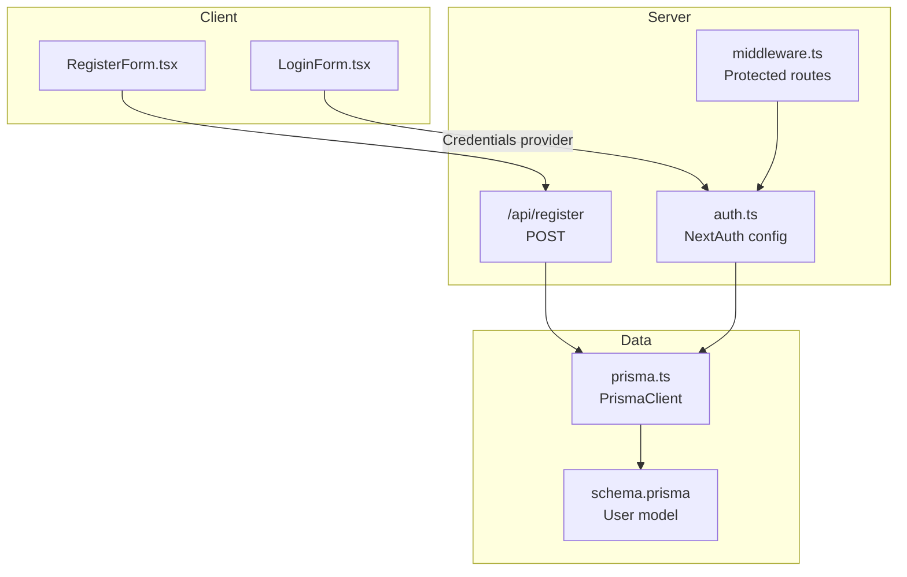
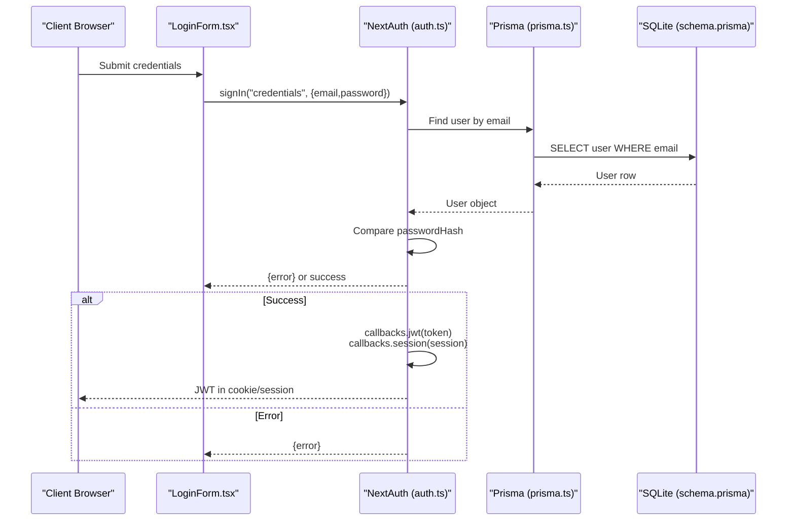
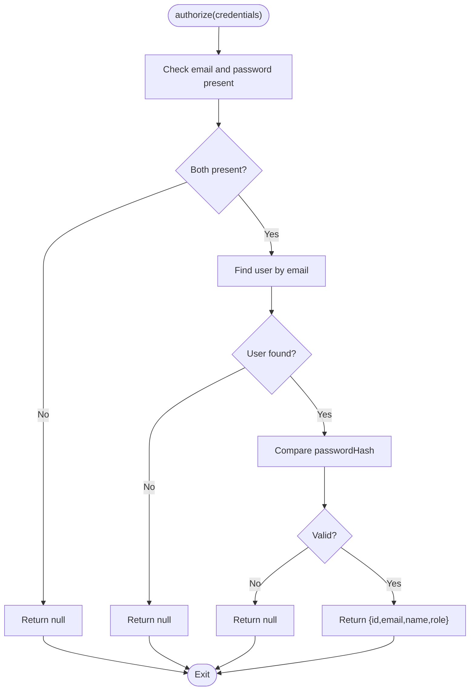
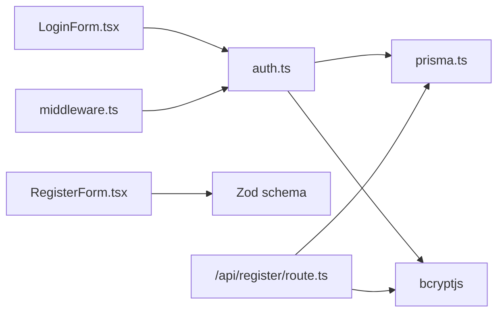

# NextAuth Configuration & Setup

<cite>
**Referenced Files in This Document**
- [auth.ts](file://src/auth.ts)
- [middleware.ts](file://src/middleware.ts)
- [LoginForm.tsx](file://src/components/auth/LoginForm.tsx)
- [RegisterForm.tsx](file://src/components/auth/RegisterForm.tsx)
- [LoginPage.tsx](file://src/app/(auth)/login/page.tsx)
- [RegisterPage.tsx](file://src/app/(auth)/register/page.tsx)
- [prisma.ts](file://src/lib/prisma.ts)
- [schema.prisma](file://prisma/schema.prisma)
- [package.json](file://package.json)
</cite>

## Table of Contents
1. [Introduction](#introduction)
2. [Project Structure](#project-structure)
3. [Core Components](#core-components)
4. [Architecture Overview](#architecture-overview)
5. [Detailed Component Analysis](#detailed-component-analysis)
6. [Dependency Analysis](#dependency-analysis)
7. [Performance Considerations](#performance-considerations)
8. [Troubleshooting Guide](#troubleshooting-guide)
9. [Conclusion](#conclusion)

## Introduction
This document explains the NextAuth configuration in Titchybook Creator, focusing on the JWT strategy, custom credentials provider, TypeScript module augmentation, and callback functions for token-to-session mapping and user role propagation. It also covers the NextAuth configuration object structure, provider credentials definition, authentication pages setup, and security considerations for JWT implementation.

## Project Structure
The authentication system spans several layers:
- NextAuth configuration and callbacks
- Middleware for protected routes
- Client-side login form using next-auth/react
- Registration API endpoint
- Prisma integration for user lookup and persistence
- Database schema defining user roles and fields

**Diagram sources**
- [auth.ts:27-79](file://src/auth.ts#L27-L79)
- [middleware.ts:1-5](file://src/middleware.ts#L1-L5)
- [RegisterForm.tsx:14-39](file://src/components/auth/RegisterForm.tsx#L14-L39)
- [prisma.ts:1-10](file://src/lib/prisma.ts#L1-L10)
- [schema.prisma:10-19](file://prisma/schema.prisma#L10-L19)

**Section sources**
- [auth.ts:27-79](file://src/auth.ts#L27-L79)
- [middleware.ts:1-5](file://src/middleware.ts#L1-L5)
- [RegisterForm.tsx:14-39](file://src/components/auth/RegisterForm.tsx#L14-L39)
- [prisma.ts:1-10](file://src/lib/prisma.ts#L1-L10)
- [schema.prisma:10-19](file://prisma/schema.prisma#L10-L19)

## Core Components
- NextAuth configuration with JWT strategy and credentials provider
- Module augmentation for TypeScript to include user role in Session and JWT
- Callbacks for JWT and session mapping
- Middleware enforcing protected routes
- Client login form invoking the credentials provider
- Registration API endpoint with Zod validation and bcrypt hashing

**Section sources**
- [auth.ts:6-25](file://src/auth.ts#L6-L25)
- [auth.ts:27-79](file://src/auth.ts#L27-L79)
- [middleware.ts:1-5](file://src/middleware.ts#L1-L5)
- [LoginForm.tsx:14-33](file://src/components/auth/LoginForm.tsx#L14-L33)
- [RegisterForm.tsx:14-39](file://src/components/auth/RegisterForm.tsx#L14-L39)

## Architecture Overview
The authentication flow integrates client-side login, NextAuth’s credentials provider, and server-side user validation via Prisma. Roles are propagated from the database through the JWT to the session.

**Diagram sources**
- [LoginForm.tsx:19-32](file://src/components/auth/LoginForm.tsx#L19-L32)
- [auth.ts:35-58](file://src/auth.ts#L35-L58)
- [auth.ts:65-78](file://src/auth.ts#L65-L78)
- [prisma.ts:1-10](file://src/lib/prisma.ts#L1-L10)
- [schema.prisma:10-19](file://prisma/schema.prisma#L10-L19)

## Detailed Component Analysis

### NextAuth Configuration and JWT Strategy
- Provider: Credentials provider with explicit credential fields for email and password.
- Strategy: JWT-based session strategy.
- Pages: Sign-in page mapped to the login route.
- Callbacks:
  - jwt: Attach user id and role to the token when a user logs in.
  - session: Map token fields to session.user for client-side consumption.

Security considerations:
- JWT strategy avoids server-side session storage.
- Token size is minimized by storing only essential fields (id, role).
- Password verification uses bcrypt comparison against stored passwordHash.

**Section sources**
- [auth.ts:27-79](file://src/auth.ts#L27-L79)
- [schema.prisma:10-19](file://prisma/schema.prisma#L10-L19)

### Module Augmentation for TypeScript Types
TypeScript types are augmented to include:
- Session.user: adds role field alongside id, email, and optional name.
- JWT: adds id and role fields for JWT payloads.

This ensures type safety for accessing user role in both JWT and session contexts.

**Section sources**
- [auth.ts:6-25](file://src/auth.ts#L6-L25)

### Provider Credentials Definition
- Credential fields: email and password.
- authorize function:
  - Validates presence of email and password.
  - Loads user by email via Prisma.
  - Compares password using bcrypt against passwordHash.
  - Returns user object with id, email, name, and role on success.

**Section sources**
- [auth.ts:28-60](file://src/auth.ts#L28-L60)
- [auth.ts:35-58](file://src/auth.ts#L35-L58)
- [prisma.ts:1-10](file://src/lib/prisma.ts#L1-L10)
- [schema.prisma:10-19](file://prisma/schema.prisma#L10-L19)

### Callback Functions: JWT and Session Management
- jwt callback:
  - On initial login, attaches id and role to the token.
  - Subsequent requests reuse the token without re-querying the database.
- session callback:
  - Maps token fields to session.user for client-side access.

Token-to-session mapping and role propagation:
- Role flows from database through authorize → jwt → session → client.

**Section sources**
- [auth.ts:65-78](file://src/auth.ts#L65-L78)

### Authentication Pages Setup
- Sign-in page: mapped to the login route.
- Login UI: LoginForm component posts credentials to the credentials provider.

**Section sources**
- [auth.ts:62-64](file://src/auth.ts#L62-L64)
- [LoginPage.tsx:1-13](file://src/app/(auth)/login/page.tsx#L1-L13)
- [LoginForm.tsx:19-32](file://src/components/auth/LoginForm.tsx#L19-L32)

### Custom Authorize Function Implementation
- Input validation: Ensures both email and password are present.
- User lookup: Finds user by email using Prisma.
- Password validation: Uses bcrypt compare against stored passwordHash.
- User object construction: Returns id, email, name, and role for successful authentication.

**Diagram sources**
- [auth.ts:35-58](file://src/auth.ts#L35-L58)

**Section sources**
- [auth.ts:35-58](file://src/auth.ts#L35-L58)

### Password Validation with bcryptjs
- Registration endpoint hashes passwords with bcrypt before storing.
- Login flow compares provided password with stored hash using bcrypt compare.

**Section sources**
- [RegisterForm.tsx:14-39](file://src/components/auth/RegisterForm.tsx#L14-L39)
- [auth.ts:49](file://src/auth.ts#L49)

### Session Strategy Selection and Token Expiration
- Strategy: JWT.
- Expiration: Not configured, so defaults apply. Review NextAuth documentation for default behavior and configure maxAge/rotate if needed.

**Section sources**
- [auth.ts:61](file://src/auth.ts#L61)

### Security Considerations for JWT Implementation
- Keep payload minimal (id, role) to reduce token size.
- Avoid storing sensitive data in JWT claims.
- Ensure HTTPS in production to protect cookies/tokens.
- Consider setting maxAge and rotating tokens for stronger security.

[No sources needed since this section provides general guidance]

## Dependency Analysis
- NextAuth depends on:
  - Prisma for user lookup
  - bcryptjs for password hashing/verification
  - Zod for registration validation
- Middleware enforces protected routes using NextAuth’s auth export.
- Client components depend on next-auth/react for sign-in actions.

**Diagram sources**
- [auth.ts:1-4](file://src/auth.ts#L1-L4)
- [prisma.ts:1-10](file://src/lib/prisma.ts#L1-L10)
- [RegisterForm.tsx:14-39](file://src/components/auth/RegisterForm.tsx#L14-L39)
- [LoginForm.tsx:3,19-32](file://src/components/auth/LoginForm.tsx#L3,L19-L32)
- [middleware.ts:1](file://src/middleware.ts#L1)

**Section sources**
- [auth.ts:1-4](file://src/auth.ts#L1-L4)
- [prisma.ts:1-10](file://src/lib/prisma.ts#L1-L10)
- [RegisterForm.tsx:14-39](file://src/components/auth/RegisterForm.tsx#L14-L39)
- [LoginForm.tsx:3,19-32](file://src/components/auth/LoginForm.tsx#L3,L19-L32)
- [middleware.ts:1](file://src/middleware.ts#L1)

## Performance Considerations
- JWT strategy reduces server-side session storage overhead.
- Keep token payload small to minimize network overhead.
- Consider adding rate limiting for authentication endpoints.
- Use database indexes on email for efficient user lookup.

[No sources needed since this section provides general guidance]

## Troubleshooting Guide
Common issues and resolutions:
- Invalid credentials error:
  - Occurs when email/password are missing or incorrect.
  - Client displays a user-friendly message.
- User not found:
  - authorize returns null when email does not exist.
- Password mismatch:
  - bcrypt compare fails, authorize returns null.
- Registration conflicts:
  - Duplicate email triggers a 400 response with an error message.

**Section sources**
- [LoginForm.tsx:27-32](file://src/components/auth/LoginForm.tsx#L27-L32)
- [auth.ts:35-58](file://src/auth.ts#L35-L58)
- [RegisterForm.tsx:28-32](file://src/components/auth/RegisterForm.tsx#L28-L32)
- [RegisterForm.tsx:34-38](file://src/components/auth/RegisterForm.tsx#L34-L38)

## Conclusion
Titchybook Creator implements a secure, JWT-backed authentication system using NextAuth. The credentials provider validates users against the database, and module augmentation ensures type-safe access to user roles. Middleware protects routes, while client components integrate seamlessly with the provider. For production, review token expiration and consider additional security measures such as maxAge and rotation.