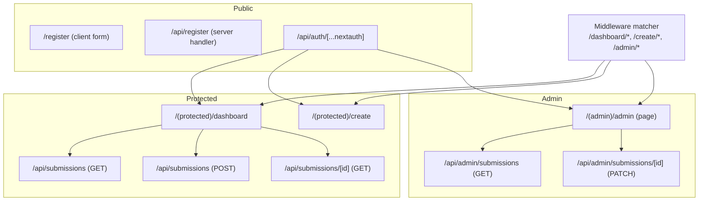
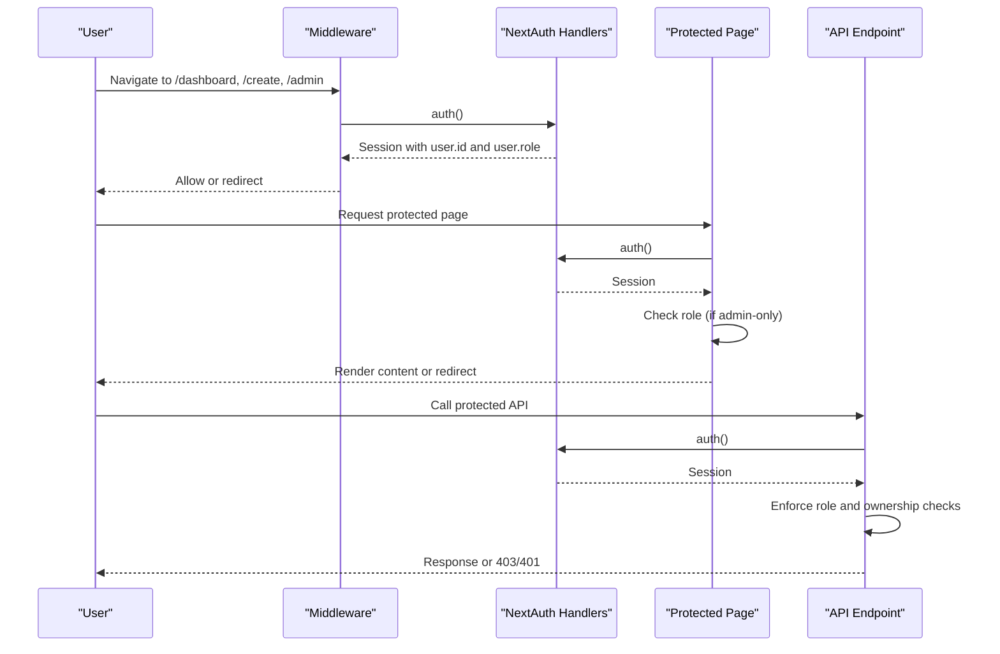
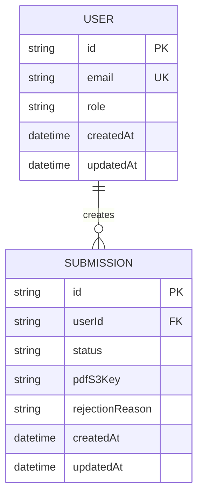
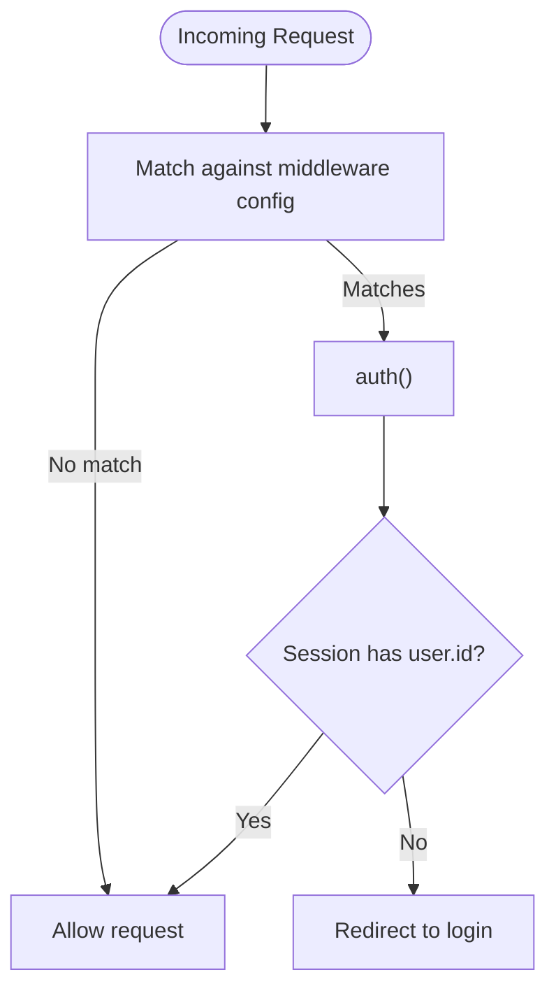
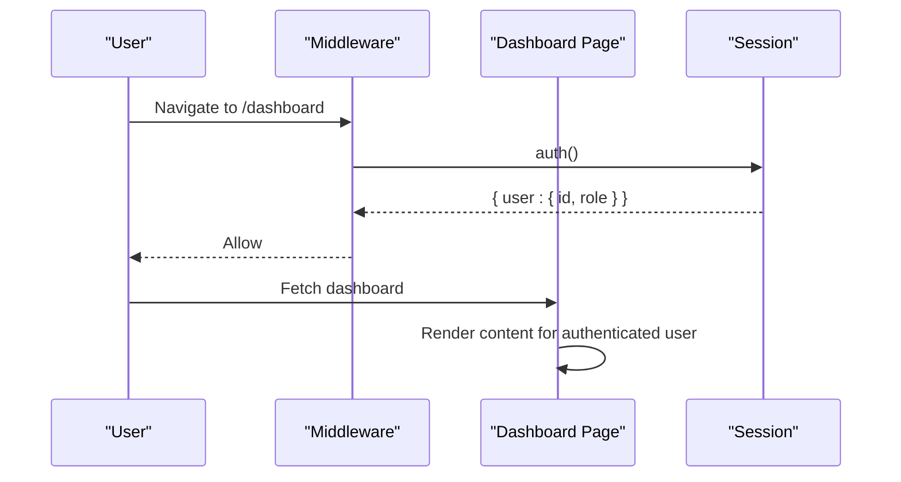
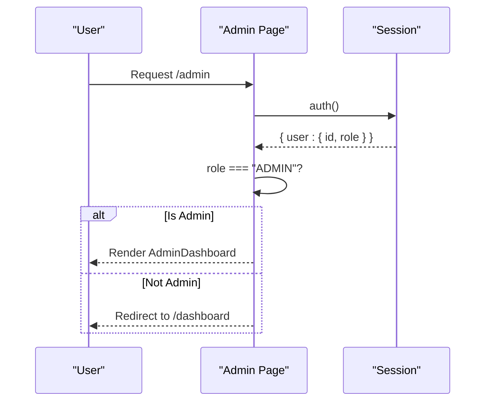
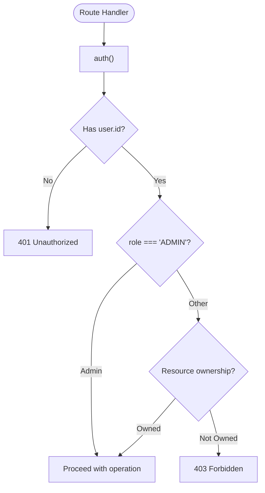
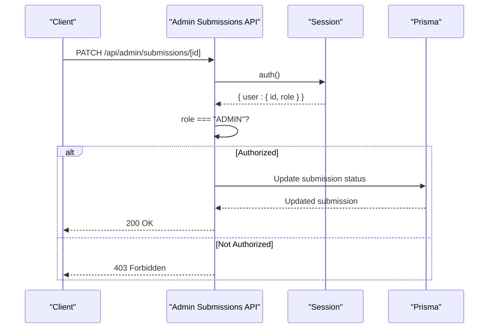
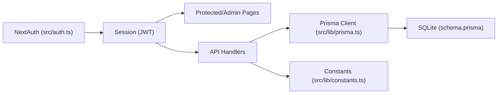

# Role-Based Access Control & Permissions

<cite>
**Referenced Files in This Document**
- [src/middleware.ts](file://src/middleware.ts)
- [src/auth.ts](file://src/auth.ts)
- [prisma/schema.prisma](file://prisma/schema.prisma)
- [src/app/(admin)/admin/page.tsx](file://src/app/(admin)/admin/page.tsx)
- [src/components/admin/AdminDashboard.tsx](file://src/components/admin/AdminDashboard.tsx)
- [src/app/api/admin/submissions/route.ts](file://src/app/api/admin/submissions/route.ts)
- [src/app/api/admin/submissions/[id]/route.ts](file://src/app/api/admin/submissions/[id]/route.ts)
- [src/app/api/submissions/route.ts](file://src/app/api/submissions/route.ts)
- [src/app/api/submissions/[id]/route.ts](file://src/app/api/submissions/[id]/route.ts)
- [src/app/(protected)/dashboard/page.tsx](file://src/app/(protected)/dashboard/page.tsx)
- [src/app/(protected)/create/page.tsx](file://src/app/(protected)/create/page.tsx)
- [src/components/auth/LoginForm.tsx](file://src/components/auth/LoginForm.tsx)
- [src/components/auth/RegisterForm.tsx](file://src/components/auth/RegisterForm.tsx)
- [src/app/api/register/route.ts](file://src/app/api/register/route.ts)
- [src/app/api/auth/[...nextauth]/route.ts](file://src/app/api/auth/[...nextauth]/route.ts)
- [src/lib/prisma.ts](file://src/lib/prisma.ts)
- [src/lib/constants.ts](file://src/lib/constants.ts)
- [src/app/layout.tsx](file://src/app/layout.tsx)
</cite>

## Table of Contents
1. [Introduction](#introduction)
2. [Project Structure](#project-structure)
3. [Core Components](#core-components)
4. [Architecture Overview](#architecture-overview)
5. [Detailed Component Analysis](#detailed-component-analysis)
6. [Dependency Analysis](#dependency-analysis)
7. [Performance Considerations](#performance-considerations)
8. [Security Considerations](#security-considerations)
9. [Troubleshooting Guide](#troubleshooting-guide)
10. [Conclusion](#conclusion)

## Introduction
This document explains the role-based access control (RBAC) implementation in Titchybook Creator. It covers user roles, permission hierarchies, middleware-driven route protection, session-based role checks, and authorization enforcement across protected routes and APIs. It also provides guidance for role-based UI rendering, admin-only features, and secure authorization flows.

## Project Structure
The application organizes routes by protection level:
- Public: Registration and login flows
- Protected: User dashboards and creation flows
- Admin: Administrative features for privileged users

Protected route groups are defined via middleware matchers and enforced by per-route authorization checks.

**Diagram sources**
- [src/middleware.ts:1-6](file://src/middleware.ts#L1-L6)
- [src/app/(protected)/dashboard/page.tsx:1-20](file://src/app/(protected)/dashboard/page.tsx#L1-L20)
- [src/app/(protected)/create/page.tsx:1-11](file://src/app/(protected)/create/page.tsx#L1-L11)
- [src/app/(admin)/admin/page.tsx:1-13](file://src/app/(admin)/admin/page.tsx#L1-L13)
- [src/app/api/submissions/route.ts:1-96](file://src/app/api/submissions/route.ts#L1-L96)
- [src/app/api/submissions/[id]/route.ts:1-37](file://src/app/api/submissions/[id]/route.ts#L1-L37)
- [src/app/api/admin/submissions/route.ts:1-38](file://src/app/api/admin/submissions/route.ts#L1-L38)
- [src/app/api/admin/submissions/[id]/route.ts:1-63](file://src/app/api/admin/submissions/[id]/route.ts#L1-L63)
- [src/app/api/auth/[...nextauth]/route.ts:1-4](file://src/app/api/auth/[...nextauth]/route.ts#L1-L4)

**Section sources**
- [src/middleware.ts:1-6](file://src/middleware.ts#L1-L6)
- [src/app/layout.tsx:1-42](file://src/app/layout.tsx#L1-L42)

## Core Components
- Roles and permissions model
  - Users have a role field persisted in the database with a default value for basic users.
  - Administrators are identified by a specific role value and granted elevated privileges.
- Authentication and session
  - NextAuth.js handles credential-based login, JWT session storage, and callback injection of user role into the session token and session object.
- Middleware protection
  - Middleware applies to protected route groups and ensures sessions are present before allowing navigation.
- Route-level authorization
  - Protected pages and API endpoints check session presence and role requirements before serving content or performing actions.
- Admin-only features
  - Dedicated admin page and admin APIs restrict access to administrators only.

**Section sources**
- [prisma/schema.prisma:10-19](file://prisma/schema.prisma#L10-L19)
- [src/auth.ts:27-79](file://src/auth.ts#L27-L79)
- [src/middleware.ts:1-6](file://src/middleware.ts#L1-L6)
- [src/app/(admin)/admin/page.tsx:5-12](file://src/app/(admin)/admin/page.tsx#L5-L12)
- [src/app/api/admin/submissions/route.ts:6-10](file://src/app/api/admin/submissions/route.ts#L6-L10)
- [src/app/api/admin/submissions/[id]/route.ts:12-19](file://src/app/api/admin/submissions/[id]/route.ts#L12-L19)

## Architecture Overview
The RBAC architecture combines middleware-based route protection with per-request authorization checks. Sessions carry the user’s role, enabling runtime decisions across pages and APIs.

**Diagram sources**
- [src/middleware.ts:1-6](file://src/middleware.ts#L1-L6)
- [src/app/api/auth/[...nextauth]/route.ts:1-4](file://src/app/api/auth/[...nextauth]/route.ts#L1-L4)
- [src/app/(admin)/admin/page.tsx:5-12](file://src/app/(admin)/admin/page.tsx#L5-L12)
- [src/app/api/admin/submissions/route.ts:6-10](file://src/app/api/admin/submissions/route.ts#L6-L10)
- [src/app/api/submissions/[id]/route.ts:10-28](file://src/app/api/submissions/[id]/route.ts#L10-L28)

## Detailed Component Analysis

### Roles and Permission Model
- Role definition
  - The user model defines a role field with a default value indicating regular users.
  - Administrators are identified by a specific role value and are authorized for admin-only features.
- Role propagation
  - During authentication, the user’s role is injected into the JWT token and session object by NextAuth callbacks.

**Diagram sources**
- [prisma/schema.prisma:10-19](file://prisma/schema.prisma#L10-L19)
- [prisma/schema.prisma:21-33](file://prisma/schema.prisma#L21-L33)

**Section sources**
- [prisma/schema.prisma:10-19](file://prisma/schema.prisma#L10-L19)
- [src/auth.ts:65-78](file://src/auth.ts#L65-L78)

### Middleware Implementation
- Purpose
  - Applies to protected route groups to ensure incoming requests have a valid session before rendering pages.
- Matcher
  - Protects routes under specific base paths, aligning with protected and admin areas.
- Behavior
  - Delegates to the NextAuth auth helper; pages can then enforce role checks.

**Diagram sources**
- [src/middleware.ts:1-6](file://src/middleware.ts#L1-L6)

**Section sources**
- [src/middleware.ts:1-6](file://src/middleware.ts#L1-L6)

### Protected Pages and Route Groups
- Dashboard page
  - Renders submission lists and creation links; intended for authenticated users.
- Creation page
  - Allows authenticated users to submit content; protected by middleware and session checks.
- Ownership and visibility
  - Submission retrieval validates that the requested submission belongs to the current user or the requester is an administrator.

**Diagram sources**
- [src/middleware.ts:1-6](file://src/middleware.ts#L1-L6)
- [src/app/(protected)/dashboard/page.tsx:1-20](file://src/app/(protected)/dashboard/page.tsx#L1-L20)

**Section sources**
- [src/app/(protected)/dashboard/page.tsx:1-20](file://src/app/(protected)/dashboard/page.tsx#L1-L20)
- [src/app/(protected)/create/page.tsx:1-11](file://src/app/(protected)/create/page.tsx#L1-L11)
- [src/app/api/submissions/[id]/route.ts:26-28](file://src/app/api/submissions/[id]/route.ts#L26-L28)

### Admin-Only Features
- Admin page
  - Requires an administrator role; otherwise redirects to the user dashboard.
- Admin API endpoints
  - List all submissions and approve/reject them; require administrator role and validate request payloads.
- UI rendering
  - Admin dashboard renders controls conditionally based on submission status.

**Diagram sources**
- [src/app/(admin)/admin/page.tsx:5-12](file://src/app/(admin)/admin/page.tsx#L5-L12)

**Section sources**
- [src/app/(admin)/admin/page.tsx:5-12](file://src/app/(admin)/admin/page.tsx#L5-L12)
- [src/components/admin/AdminDashboard.tsx:21-168](file://src/components/admin/AdminDashboard.tsx#L21-L168)
- [src/app/api/admin/submissions/route.ts:6-10](file://src/app/api/admin/submissions/route.ts#L6-L10)
- [src/app/api/admin/submissions/[id]/route.ts:12-19](file://src/app/api/admin/submissions/[id]/route.ts#L12-L19)

### Session-Based Role Checking and Authorization
- Session retrieval
  - Pages and API handlers call the NextAuth auth helper to obtain the current session.
- Role enforcement
  - Pages enforce role checks before rendering.
  - APIs enforce role checks and, for resource endpoints, ownership checks.
- Ownership validation
  - Submission detail endpoint verifies that either the requesting user owns the submission or the user is an administrator.

**Diagram sources**
- [src/app/api/submissions/[id]/route.ts:10-28](file://src/app/api/submissions/[id]/route.ts#L10-L28)
- [src/app/api/admin/submissions/route.ts:6-10](file://src/app/api/admin/submissions/route.ts#L6-L10)
- [src/app/(admin)/admin/page.tsx:7-9](file://src/app/(admin)/admin/page.tsx#L7-L9)

**Section sources**
- [src/app/api/submissions/[id]/route.ts:10-28](file://src/app/api/submissions/[id]/route.ts#L10-L28)
- [src/app/api/admin/submissions/route.ts:6-10](file://src/app/api/admin/submissions/route.ts#L6-L10)
- [src/app/(admin)/admin/page.tsx:7-9](file://src/app/(admin)/admin/page.tsx#L7-L9)

### Permission Enforcement Patterns
- Protected route group pattern
  - Middleware protects route groups; pages and APIs perform additional role checks.
- Admin-only pattern
  - Dedicated admin pages and APIs enforce administrator role.
- Ownership pattern
  - Resource endpoints verify the current user is the owner or has administrative privileges.
- Validation pattern
  - API endpoints validate request payloads and respond with appropriate HTTP status codes.

**Diagram sources**
- [src/app/api/admin/submissions/[id]/route.ts:12-55](file://src/app/api/admin/submissions/[id]/route.ts#L12-L55)

**Section sources**
- [src/app/api/admin/submissions/[id]/route.ts:12-55](file://src/app/api/admin/submissions/[id]/route.ts#L12-L55)

### Role-Based UI Rendering Examples
- Admin-only UI
  - Admin dashboard renders administrative controls only when the current user is an administrator.
- Conditional actions
  - Admin dashboard enables approve/reject actions only for pending submissions.
- Protected UI
  - Dashboard page displays creation links for authenticated users.

**Section sources**
- [src/components/admin/AdminDashboard.tsx:138-158](file://src/components/admin/AdminDashboard.tsx#L138-L158)
- [src/app/(admin)/admin/page.tsx:5-12](file://src/app/(admin)/admin/page.tsx#L5-L12)
- [src/app/(protected)/dashboard/page.tsx:1-20](file://src/app/(protected)/dashboard/page.tsx#L1-L20)

### Protected Route Access Examples
- Protected pages
  - Dashboard and creation pages are protected by middleware and session checks.
- Admin-only page
  - Admin page enforces administrator role and redirects unauthorized users.
- API endpoints
  - Submission APIs enforce authentication and, where applicable, role and ownership checks.

**Section sources**
- [src/middleware.ts:1-6](file://src/middleware.ts#L1-L6)
- [src/app/(protected)/dashboard/page.tsx:1-20](file://src/app/(protected)/dashboard/page.tsx#L1-L20)
- [src/app/(protected)/create/page.tsx:1-11](file://src/app/(protected)/create/page.tsx#L1-L11)
- [src/app/(admin)/admin/page.tsx:5-12](file://src/app/(admin)/admin/page.tsx#L5-L12)

## Dependency Analysis
- Authentication and session
  - NextAuth.js manages authentication, JWT strategy, and session callbacks.
- Database
  - Prisma client persists and queries user and submission data.
- Constants and enums
  - Shared constants define submission statuses and validation rules used across APIs.

**Diagram sources**
- [src/auth.ts:27-79](file://src/auth.ts#L27-L79)
- [src/lib/prisma.ts:1-10](file://src/lib/prisma.ts#L1-L10)
- [prisma/schema.prisma:1-48](file://prisma/schema.prisma#L1-L48)
- [src/lib/constants.ts:1-49](file://src/lib/constants.ts#L1-L49)

**Section sources**
- [src/auth.ts:27-79](file://src/auth.ts#L27-L79)
- [src/lib/prisma.ts:1-10](file://src/lib/prisma.ts#L1-L10)
- [prisma/schema.prisma:1-48](file://prisma/schema.prisma#L1-L48)
- [src/lib/constants.ts:1-49](file://src/lib/constants.ts#L1-L49)

## Performance Considerations
- Keep authorization checks lightweight by relying on session data and minimal database reads.
- Use pagination and filtering in admin APIs to limit payload sizes.
- Offload long-running tasks (e.g., PDF generation) to background processes after creating submissions.

## Security Considerations
- Role validation
  - Always check role in both pages and APIs; do not rely solely on UI rendering.
- Session integrity
  - Use HTTPS in production to prevent session theft.
  - Configure secure cookie settings in NextAuth for production environments.
- Ownership verification
  - For resource endpoints, verify the requesting user owns the resource or is an administrator.
- Input validation
  - Validate and sanitize all request bodies and parameters; return explicit errors for malformed data.
- Least privilege
  - Restrict admin features to administrators only; avoid granting admin capabilities to regular users.

## Troubleshooting Guide
- Unauthorized access attempts
  - Symptom: 401 responses from protected APIs.
  - Cause: Missing or invalid session.
  - Resolution: Ensure the user is authenticated and the session is valid.
- Forbidden access attempts
  - Symptom: 403 responses from admin APIs or protected resources.
  - Cause: Insufficient role or missing ownership.
  - Resolution: Verify the user has the required role or owns the resource.
- Incorrect redirection after login
  - Symptom: Redirect loops or incorrect destinations.
  - Cause: Middleware or page logic not aligning with session state.
  - Resolution: Confirm middleware matcher and page role checks are consistent.
- Payload validation errors
  - Symptom: 400 responses with validation messages.
  - Cause: Malformed request body or missing fields.
  - Resolution: Validate inputs according to defined schemas before processing.

**Section sources**
- [src/app/api/submissions/[id]/route.ts:10-28](file://src/app/api/submissions/[id]/route.ts#L10-L28)
- [src/app/api/admin/submissions/route.ts:6-10](file://src/app/api/admin/submissions/route.ts#L6-L10)
- [src/app/api/admin/submissions/[id]/route.ts:12-32](file://src/app/api/admin/submissions/[id]/route.ts#L12-L32)

## Conclusion
Titchybook Creator implements RBAC using NextAuth.js for authentication and JWT sessions, middleware for route protection, and per-route authorization checks. Users are identified by a role field, with administrators receiving elevated privileges across admin pages and APIs. The system enforces session-based role checks, ownership validations, and robust input validation to maintain secure access control across protected features.