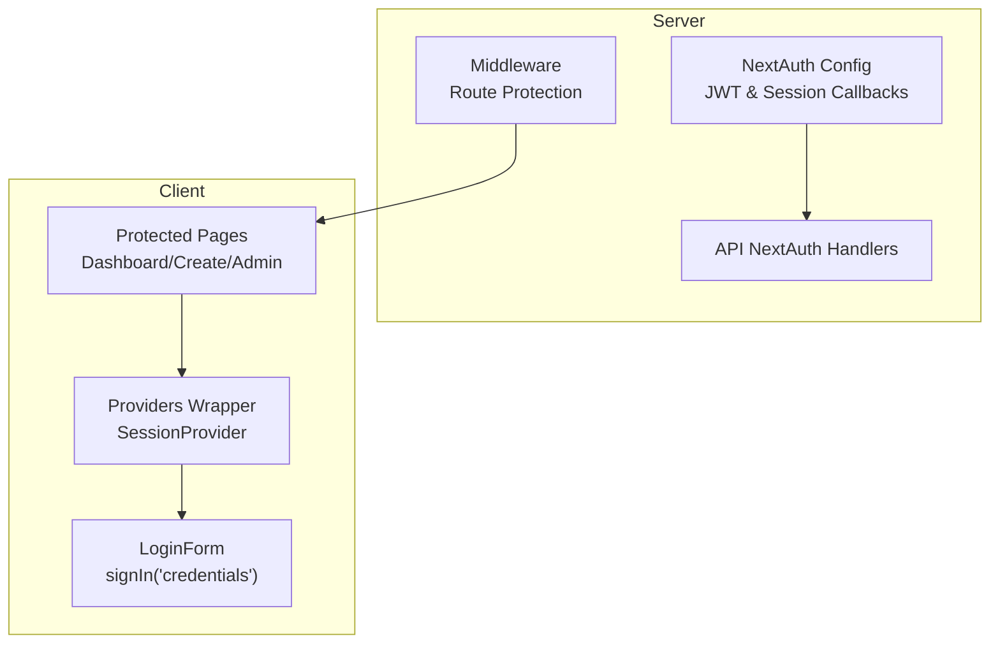
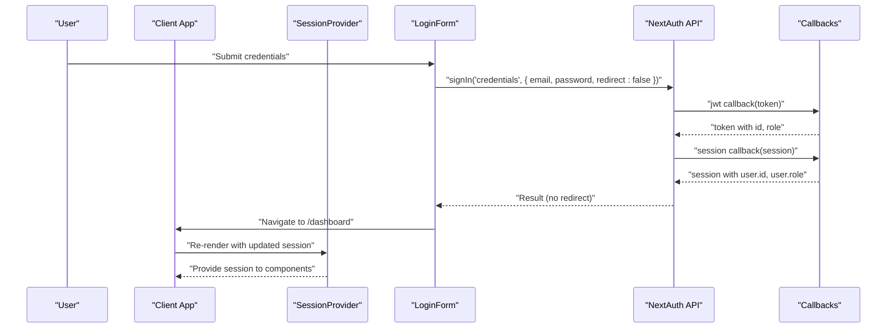
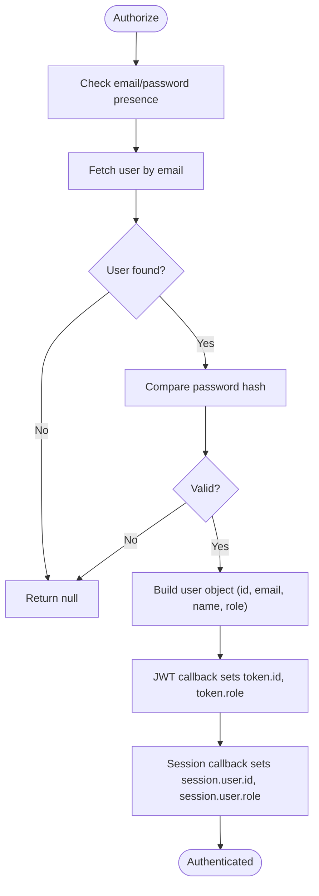
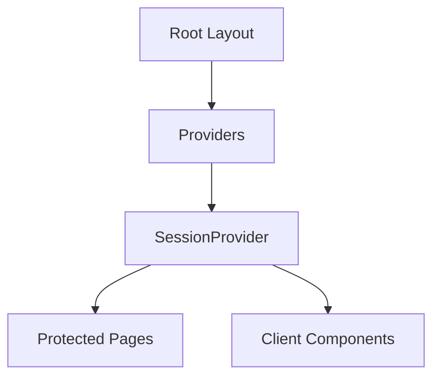
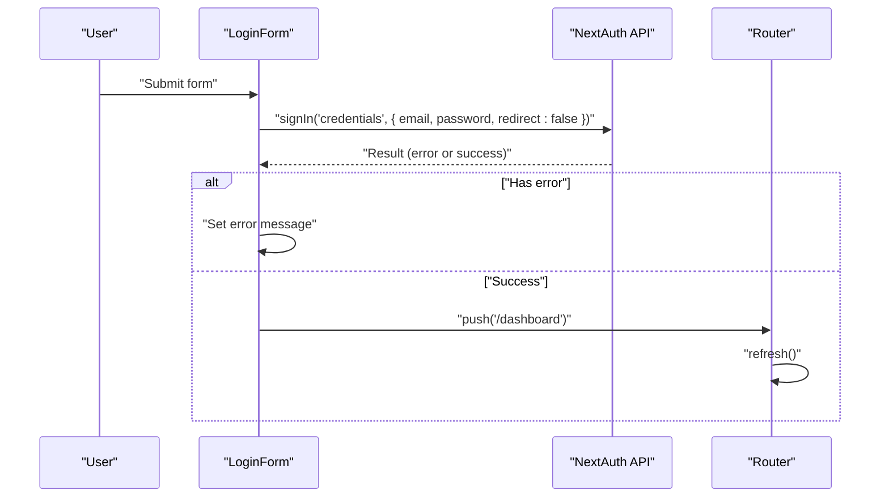
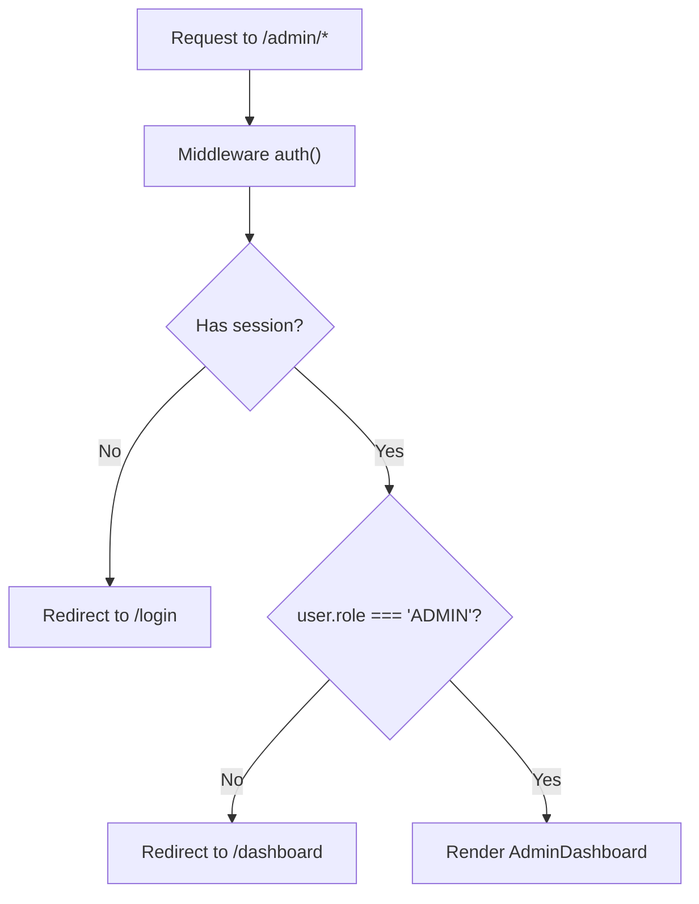
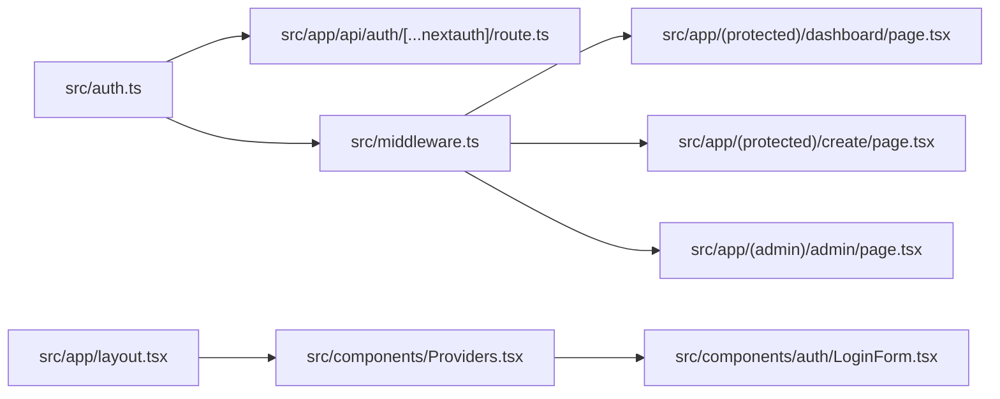

# Session Management & State

<cite>
**Referenced Files in This Document**
- [src/auth.ts](file://src/auth.ts)
- [src/middleware.ts](file://src/middleware.ts)
- [src/app/layout.tsx](file://src/app/layout.tsx)
- [src/components/Providers.tsx](file://src/components/Providers.tsx)
- [src/components/auth/LoginForm.tsx](file://src/components/auth/LoginForm.tsx)
- [src/app/api/auth/[...nextauth]/route.ts](file://src/app/api/auth/[...nextauth]/route.ts)
- [src/app/(admin)/admin/page.tsx](file://src/app/(admin)/admin/page.tsx)
- [src/app/(protected)/dashboard/page.tsx](file://src/app/(protected)/dashboard/page.tsx)
- [src/app/(protected)/create/page.tsx](file://src/app/(protected)/create/page.tsx)
</cite>

## Table of Contents
1. [Introduction](#introduction)
2. [Project Structure](#project-structure)
3. [Core Components](#core-components)
4. [Architecture Overview](#architecture-overview)
5. [Detailed Component Analysis](#detailed-component-analysis)
6. [Dependency Analysis](#dependency-analysis)
7. [Performance Considerations](#performance-considerations)
8. [Troubleshooting Guide](#troubleshooting-guide)
9. [Conclusion](#conclusion)

## Introduction
This document explains session management and state handling in Titchybook Creator. It focuses on how client-side session access is provided via NextAuth.js, how sessions persist across page reloads, and how session state synchronizes with the UI. It also documents JWT token management, session refresh mechanisms, logout functionality, the session data model, token payload contents, and the session lifecycle. Practical guidance is included for accessing session data in components, handling session updates, and managing session expiration, along with security considerations for session storage, token validation, and preventing session fixation.

## Project Structure
The session and authentication system spans several layers:
- Authentication configuration and JWT/session callbacks
- Middleware enforcing protected routes
- Provider wrapper enabling client-side session access
- API routes for NextAuth integration
- Protected pages gated by session checks
- Client components performing sign-in and sign-out actions

**Diagram sources**
- [src/auth.ts:27-79](file://src/auth.ts#L27-L79)
- [src/middleware.ts:1-6](file://src/middleware.ts#L1-L6)
- [src/app/api/auth/[...nextauth]/route.ts:1-4](file://src/app/api/auth/[...nextauth]/route.ts#L1-L4)
- [src/components/Providers.tsx:1-8](file://src/components/Providers.tsx#L1-L8)
- [src/components/auth/LoginForm.tsx:1-86](file://src/components/auth/LoginForm.tsx#L1-L86)
- [src/app/(protected)/dashboard/page.tsx:1-20](file://src/app/(protected)/dashboard/page.tsx#L1-L20)
- [src/app/(protected)/create/page.tsx:1-11](file://src/app/(protected)/create/page.tsx#L1-L11)
- [src/app/(admin)/admin/page.tsx:1-13](file://src/app/(admin)/admin/page.tsx#L1-L13)

**Section sources**
- [src/auth.ts:27-79](file://src/auth.ts#L27-L79)
- [src/middleware.ts:1-6](file://src/middleware.ts#L1-L6)
- [src/app/layout.tsx:1-42](file://src/app/layout.tsx#L1-L42)
- [src/components/Providers.tsx:1-8](file://src/components/Providers.tsx#L1-L8)
- [src/app/api/auth/[...nextauth]/route.ts:1-4](file://src/app/api/auth/[...nextauth]/route.ts#L1-L4)

## Core Components
- NextAuth configuration defines the authentication provider, session strategy, pages, and JWT/session callbacks. It extends session and JWT typings to include user role and ID.
- Middleware exports the NextAuth auth function and applies route protection to protected areas.
- Providers wraps the app tree with SessionProvider to enable client-side session access.
- LoginForm triggers credential-based sign-in and navigates on success.
- API NextAuth handlers expose NextAuth’s GET/POST endpoints.
- Protected pages enforce role-based access and redirect unauthorized users.

Key responsibilities:
- SessionProvider: Provides session state to client components.
- NextAuth callbacks: Populate JWT with user ID and role; populate session with JWT claims.
- Middleware: Enforce protected routes.
- LoginForm: Authenticate and update client session state.

**Section sources**
- [src/auth.ts:6-25](file://src/auth.ts#L6-L25)
- [src/auth.ts:27-79](file://src/auth.ts#L27-L79)
- [src/middleware.ts:1-6](file://src/middleware.ts#L1-L6)
- [src/components/Providers.tsx:1-8](file://src/components/Providers.tsx#L1-L8)
- [src/components/auth/LoginForm.tsx:14-33](file://src/components/auth/LoginForm.tsx#L14-L33)
- [src/app/api/auth/[...nextauth]/route.ts:1-4](file://src/app/api/auth/[...nextauth]/route.ts#L1-L4)

## Architecture Overview
The session lifecycle integrates server-side authentication with client-side state management:

**Diagram sources**
- [src/components/auth/LoginForm.tsx:19-32](file://src/components/auth/LoginForm.tsx#L19-L32)
- [src/app/api/auth/[...nextauth]/route.ts:1-4](file://src/app/api/auth/[...nextauth]/route.ts#L1-L4)
- [src/auth.ts:65-77](file://src/auth.ts#L65-L77)

## Detailed Component Analysis

### NextAuth Configuration and JWT/Session Model
- Session strategy is JWT-based. The JWT callback attaches user ID and role to the token. The session callback injects token-derived fields into the session object exposed to the client.
- Session typing is extended to include user ID and role, ensuring type-safe access in client components.
- Pages.signIn redirects unauthenticated users to the login page.

**Diagram sources**
- [src/auth.ts:35-58](file://src/auth.ts#L35-L58)
- [src/auth.ts:65-77](file://src/auth.ts#L65-L77)

**Section sources**
- [src/auth.ts:6-25](file://src/auth.ts#L6-L25)
- [src/auth.ts:27-79](file://src/auth.ts#L27-L79)

### Client-Side Session Access via SessionProvider
- Providers wraps the application with SessionProvider, enabling client components to access session state via NextAuth hooks.
- SessionProvider ensures session state is available across page navigations and re-renders.

**Diagram sources**
- [src/app/layout.tsx:33-37](file://src/app/layout.tsx#L33-L37)
- [src/components/Providers.tsx:5-6](file://src/components/Providers.tsx#L5-L6)

**Section sources**
- [src/app/layout.tsx:33-37](file://src/app/layout.tsx#L33-L37)
- [src/components/Providers.tsx:1-8](file://src/components/Providers.tsx#L1-L8)

### Credential-Based Sign-In Flow
- LoginForm collects email and password, calls signIn with credentials provider, and handles errors. On success, it navigates to the dashboard and refreshes the route to synchronize session state.

**Diagram sources**
- [src/components/auth/LoginForm.tsx:14-33](file://src/components/auth/LoginForm.tsx#L14-L33)

**Section sources**
- [src/components/auth/LoginForm.tsx:14-33](file://src/components/auth/LoginForm.tsx#L14-L33)

### Protected Routes and Role-Based Access
- Middleware exports the NextAuth auth function and matches protected paths. Protected pages check the session and redirect unauthorized users.
- Admin page enforces ADMIN role and redirects others to the dashboard.

**Diagram sources**
- [src/middleware.ts:3-5](file://src/middleware.ts#L3-L5)
- [src/app/(admin)/admin/page.tsx:5-12](file://src/app/(admin)/admin/page.tsx#L5-L12)

**Section sources**
- [src/middleware.ts:1-6](file://src/middleware.ts#L1-L6)
- [src/app/(admin)/admin/page.tsx:5-12](file://src/app/(admin)/admin/page.tsx#L5-L12)

### Session Persistence Across Page Reloads
- Because the session strategy is JWT, the serialized session is stored in a cookie by NextAuth. On subsequent requests, the cookie carries the JWT, allowing the server to reconstruct the session without server-side session storage.
- Client-side session updates occur automatically when the route refreshes after sign-in, ensuring components receive the latest session state.

**Section sources**
- [src/auth.ts:61](file://src/auth.ts#L61)
- [src/components/auth/LoginForm.tsx:31](file://src/components/auth/LoginForm.tsx#L31)

### State Synchronization in Components
- Components can access session data via NextAuth hooks (e.g., useSession) to read user ID, email, name, and role. Updates propagate automatically after sign-in/sign-out and route refreshes.
- Protected pages render conditionally based on session presence and role.

**Section sources**
- [src/auth.ts:10-17](file://src/auth.ts#L10-L17)
- [src/app/(protected)/dashboard/page.tsx:1-20](file://src/app/(protected)/dashboard/page.tsx#L1-L20)
- [src/app/(protected)/create/page.tsx:1-11](file://src/app/(protected)/create/page.tsx#L1-L11)

### JWT Token Management and Payload
- Token payload includes user ID and role. These fields are populated during the JWT callback and later injected into the session object.
- Token validity and renewal are managed by NextAuth; the client does not manually refresh tokens.

**Section sources**
- [src/auth.ts:20-25](file://src/auth.ts#L20-L25)
- [src/auth.ts:65-77](file://src/auth.ts#L65-L77)

### Logout Functionality
- Logout is performed via the NextAuth signOut action. While not explicitly shown in the provided files, the standard pattern is to call signOut in a client component and redirect to the home page or login page. The session cookie is cleared server-side by NextAuth.

[No sources needed since this section provides general guidance]

### Session Lifecycle Management
- Lifecycle stages:
  - Authorization: Credentials provider validates user against database.
  - Token creation: JWT callback attaches ID and role.
  - Session creation: Session callback populates session with token-derived fields.
  - Client consumption: SessionProvider exposes session to components.
  - Route refresh: After sign-in, route refresh synchronizes session state.
  - Logout: Clear session cookie and redirect to login.

**Section sources**
- [src/auth.ts:35-58](file://src/auth.ts#L35-L58)
- [src/auth.ts:65-77](file://src/auth.ts#L65-L77)
- [src/components/auth/LoginForm.tsx:31](file://src/components/auth/LoginForm.tsx#L31)

### Security Considerations
- Cookie-based JWT storage: NextAuth stores the session in a secure, HTTP-only cookie by default, reducing XSS risks.
- CSRF protection: NextAuth provides built-in CSRF protection for sign-in/sign-out flows.
- Session fixation: NextAuth regenerates the session identifier upon successful sign-in, mitigating session fixation.
- Token validation: Server validates JWT signature and expiry; client receives validated claims.
- Role enforcement: Admin access is enforced on both server and client boundaries.

[No sources needed since this section provides general guidance]

## Dependency Analysis

**Diagram sources**
- [src/auth.ts:27-79](file://src/auth.ts#L27-L79)
- [src/app/api/auth/[...nextauth]/route.ts:1-4](file://src/app/api/auth/[...nextauth]/route.ts#L1-L4)
- [src/middleware.ts:1-6](file://src/middleware.ts#L1-L6)
- [src/app/layout.tsx:33-37](file://src/app/layout.tsx#L33-L37)
- [src/components/Providers.tsx:5-6](file://src/components/Providers.tsx#L5-L6)
- [src/components/auth/LoginForm.tsx:19-32](file://src/components/auth/LoginForm.tsx#L19-L32)
- [src/app/(protected)/dashboard/page.tsx:1-20](file://src/app/(protected)/dashboard/page.tsx#L1-L20)
- [src/app/(protected)/create/page.tsx:1-11](file://src/app/(protected)/create/page.tsx#L1-L11)
- [src/app/(admin)/admin/page.tsx:5-12](file://src/app/(admin)/admin/page.tsx#L5-L12)

**Section sources**
- [src/auth.ts:27-79](file://src/auth.ts#L27-L79)
- [src/middleware.ts:1-6](file://src/middleware.ts#L1-L6)
- [src/app/api/auth/[...nextauth]/route.ts:1-4](file://src/app/api/auth/[...nextauth]/route.ts#L1-L4)
- [src/app/layout.tsx:33-37](file://src/app/layout.tsx#L33-L37)
- [src/components/Providers.tsx:5-6](file://src/components/Providers.tsx#L5-L6)
- [src/components/auth/LoginForm.tsx:19-32](file://src/components/auth/LoginForm.tsx#L19-L32)
- [src/app/(protected)/dashboard/page.tsx:1-20](file://src/app/(protected)/dashboard/page.tsx#L1-L20)
- [src/app/(protected)/create/page.tsx:1-11](file://src/app/(protected)/create/page.tsx#L1-L11)
- [src/app/(admin)/admin/page.tsx:5-12](file://src/app/(admin)/admin/page.tsx#L5-L12)

## Performance Considerations
- JWT-based sessions avoid server-side session storage overhead and scale horizontally.
- Route refresh after sign-in ensures immediate UI updates without additional polling.
- Keep token payload minimal; only include necessary claims to reduce cookie size.

[No sources needed since this section provides general guidance]

## Troubleshooting Guide
Common issues and resolutions:
- Login fails silently: Ensure error handling displays the returned error from signIn and verify backend credentials provider logic.
- Session not updating after login: Confirm route refresh occurs after successful sign-in to synchronize client session state.
- Protected route access denied: Verify middleware matcher and that the user role is correctly set in the JWT callback.
- Admin page redirect loop: Check that the user role is ADMIN and that the session includes the role claim.

**Section sources**
- [src/components/auth/LoginForm.tsx:27-32](file://src/components/auth/LoginForm.tsx#L27-L32)
- [src/middleware.ts:3-5](file://src/middleware.ts#L3-L5)
- [src/app/(admin)/admin/page.tsx:6-9](file://src/app/(admin)/admin/page.tsx#L6-L9)

## Conclusion
Titchybook Creator uses NextAuth.js with JWT-based sessions to provide secure, scalable client-side session access. The SessionProvider enables seamless state synchronization across components, while middleware and protected pages enforce access control. The session lifecycle is streamlined through NextAuth callbacks, automatic cookie management, and route refresh patterns. Security best practices such as CSRF protection, session regeneration, and role-based access control are integrated into the system.