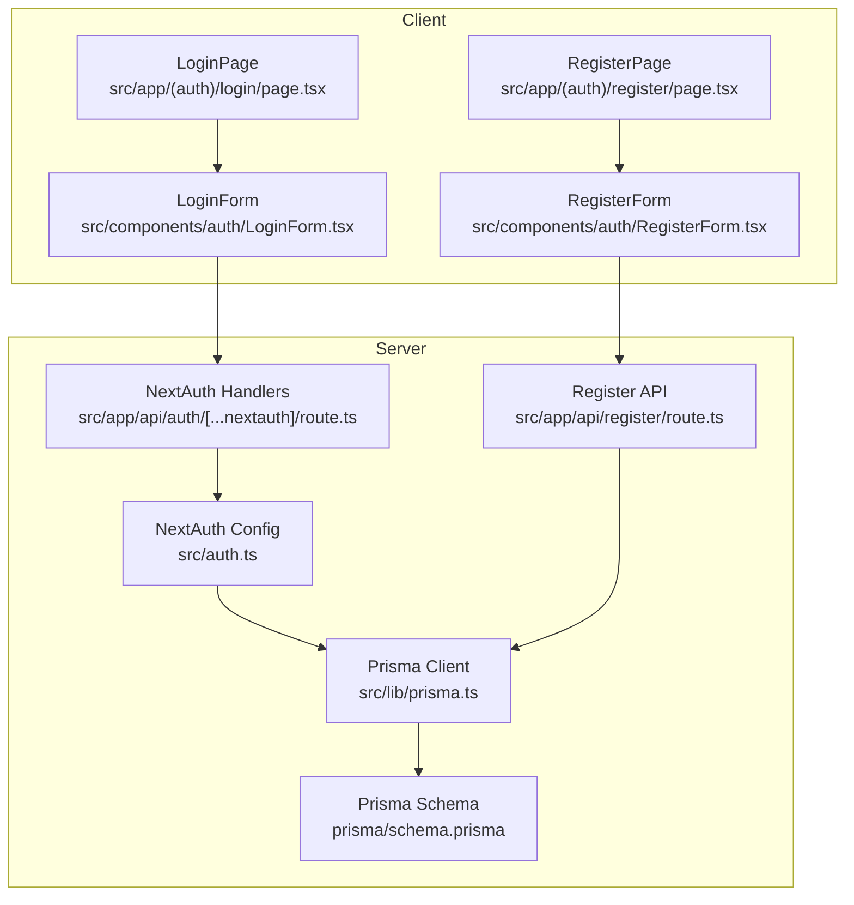
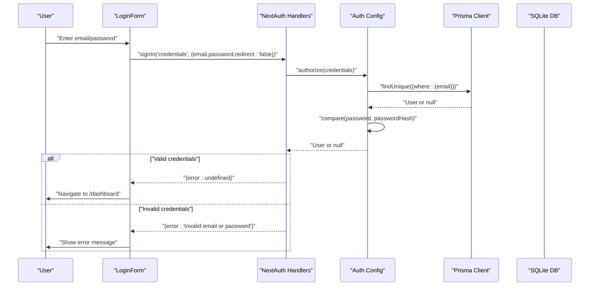
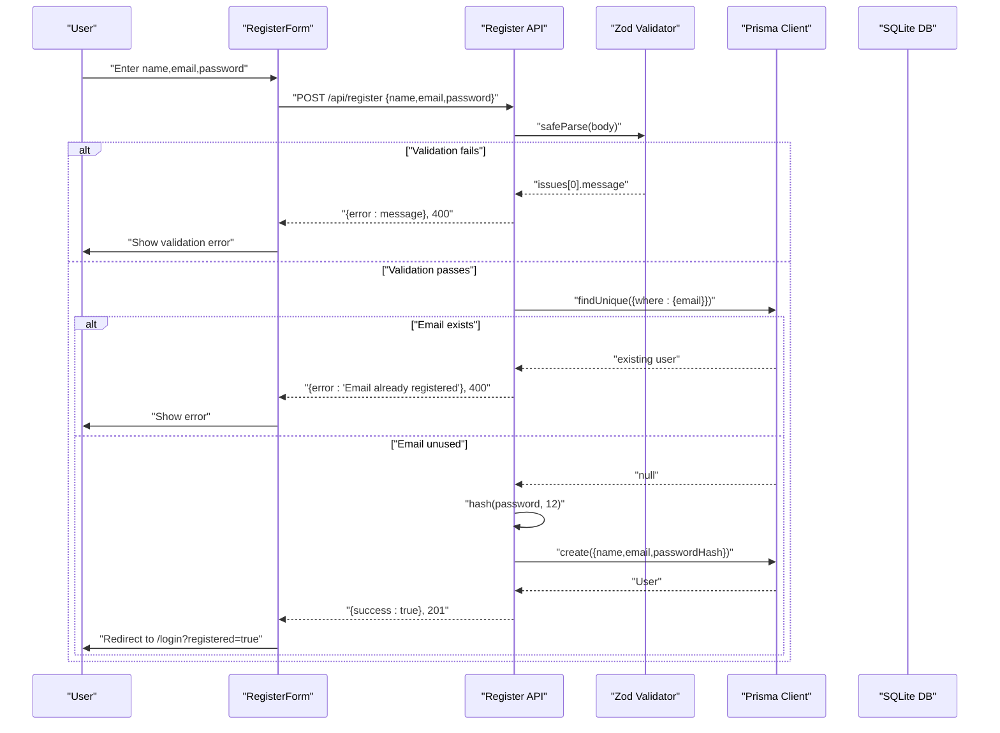
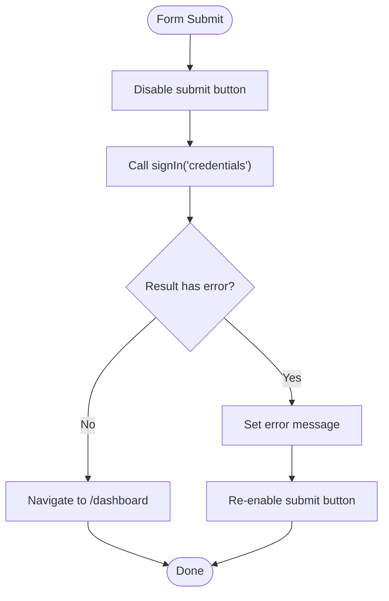
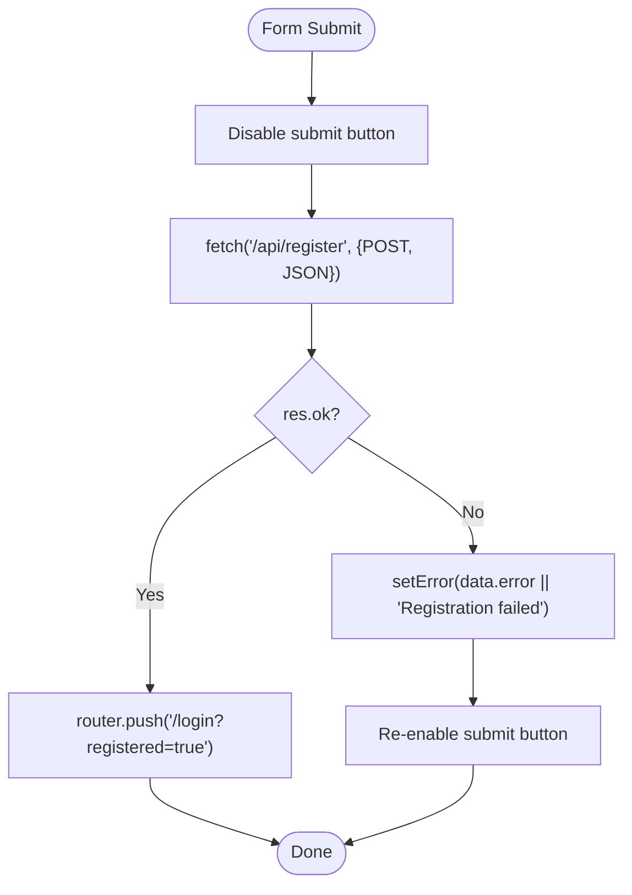
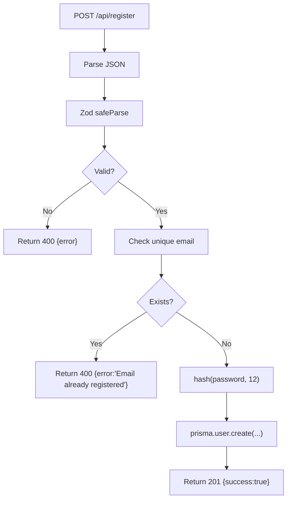
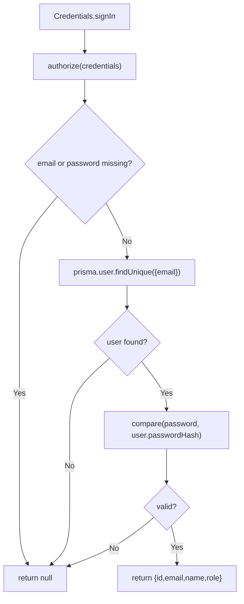
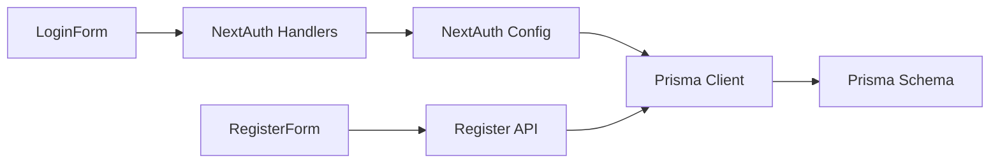

# User Registration & Login Flows

<cite>
**Referenced Files in This Document**
- [LoginPage](file://src/app/(auth)/login/page.tsx)
- [RegisterPage](file://src/app/(auth)/register/page.tsx)
- [LoginForm](file://src/components/auth/LoginForm.tsx)
- [RegisterForm](file://src/components/auth/RegisterForm.tsx)
- [Register API Route](file://src/app/api/register/route.ts)
- [NextAuth Handlers](file://src/app/api/auth/[...nextauth]/route.ts)
- [NextAuth Config](file://src/auth.ts)
- [Prisma Client](file://src/lib/prisma.ts)
- [Prisma Schema](file://prisma/schema.prisma)
- [Prisma Migration](file://prisma/migrations/20260316171130_init/migration.sql)
- [Middleware](file://src/middleware.ts)
- [Dashboard Page](file://src/app/(protected)/dashboard/page.tsx)
- [Package Dependencies](file://package.json)
</cite>

## Table of Contents
1. [Introduction](#introduction)
2. [Project Structure](#project-structure)
3. [Core Components](#core-components)
4. [Architecture Overview](#architecture-overview)
5. [Detailed Component Analysis](#detailed-component-analysis)
6. [Dependency Analysis](#dependency-analysis)
7. [Performance Considerations](#performance-considerations)
8. [Troubleshooting Guide](#troubleshooting-guide)
9. [Conclusion](#conclusion)

## Introduction
This document explains the user registration and login flows in the application. It covers:
- Client-side forms for login and registration
- Validation patterns (client-side and server-side)
- Authentication flow using NextAuth with credentials provider
- Password hashing with bcryptjs
- API endpoints, request/response schemas, and error responses
- Security measures and protections against common authentication vulnerabilities
- Successful flows, error scenarios, and user feedback mechanisms

## Project Structure
The authentication system spans client components, API routes, and NextAuth configuration:
- Pages render client components for login and registration
- Client components submit requests to API endpoints
- NextAuth handles credential-based authentication and session management
- Prisma manages user persistence with unique email indexing

**Diagram sources**
- [LoginPage](file://src/app/(auth)/login/page.tsx#L1-L13)
- [RegisterPage](file://src/app/(auth)/register/page.tsx#L1-L13)
- [LoginForm:1-86](file://src/components/auth/LoginForm.tsx#L1-L86)
- [RegisterForm:1-107](file://src/components/auth/RegisterForm.tsx#L1-L107)
- [NextAuth Handlers:1-4](file://src/app/api/auth/[...nextauth]/route.ts#L1-L4)
- [Register API Route:1-47](file://src/app/api/register/route.ts#L1-L47)
- [NextAuth Config:1-80](file://src/auth.ts#L1-L80)
- [Prisma Client:1-10](file://src/lib/prisma.ts#L1-L10)
- [Prisma Schema:1-48](file://prisma/schema.prisma#L1-L48)

**Section sources**
- [LoginPage](file://src/app/(auth)/login/page.tsx#L1-L13)
- [RegisterPage](file://src/app/(auth)/register/page.tsx#L1-L13)
- [LoginForm:1-86](file://src/components/auth/LoginForm.tsx#L1-L86)
- [RegisterForm:1-107](file://src/components/auth/RegisterForm.tsx#L1-L107)
- [NextAuth Handlers:1-4](file://src/app/api/auth/[...nextauth]/route.ts#L1-L4)
- [Register API Route:1-47](file://src/app/api/register/route.ts#L1-L47)
- [NextAuth Config:1-80](file://src/auth.ts#L1-L80)
- [Prisma Client:1-10](file://src/lib/prisma.ts#L1-L10)
- [Prisma Schema:1-48](file://prisma/schema.prisma#L1-L48)

## Core Components
- LoginForm: Collects email and password, submits to NextAuth credentials provider, displays errors, and navigates on success.
- RegisterForm: Collects name, email, and password, posts to /api/register, handles errors, and redirects to login after success.
- NextAuth Config: Defines credentials provider, user/session types, JWT callbacks, and session strategy.
- Register API Route: Validates input with Zod, checks for existing email, hashes password with bcryptjs, and creates user via Prisma.
- Middleware: Protects routes by requiring an authenticated session.

**Section sources**
- [LoginForm:1-86](file://src/components/auth/LoginForm.tsx#L1-L86)
- [RegisterForm:1-107](file://src/components/auth/RegisterForm.tsx#L1-L107)
- [NextAuth Config:1-80](file://src/auth.ts#L1-L80)
- [Register API Route:1-47](file://src/app/api/register/route.ts#L1-L47)
- [Middleware:1-6](file://src/middleware.ts#L1-L6)

## Architecture Overview
The authentication architecture integrates client-side forms, NextAuth, and a registration API endpoint backed by Prisma.

**Diagram sources**
- [LoginForm:14-33](file://src/components/auth/LoginForm.tsx#L14-L33)
- [NextAuth Handlers:1-4](file://src/app/api/auth/[...nextauth]/route.ts#L1-L4)
- [NextAuth Config:35-58](file://src/auth.ts#L35-L58)
- [Prisma Client:1-10](file://src/lib/prisma.ts#L1-L10)
- [Prisma Schema:10-19](file://prisma/schema.prisma#L10-L19)

**Diagram sources**
- [RegisterForm:14-39](file://src/components/auth/RegisterForm.tsx#L14-L39)
- [Register API Route:12-46](file://src/app/api/register/route.ts#L12-L46)
- [Prisma Client:1-10](file://src/lib/prisma.ts#L1-L10)
- [Prisma Schema:10-19](file://prisma/schema.prisma#L10-L19)

## Detailed Component Analysis

### Login Form Implementation
- Client-side behavior:
  - Captures email and password via controlled inputs
  - Prevents default form submission, disables button during loading
  - Submits to NextAuth credentials provider with redirect disabled
  - On error, shows a user-facing message; on success, navigates to /dashboard
- Validation:
  - HTML5 required attributes and input types
  - Client-side feedback via state and disabled button
- Authentication flow:
  - Uses NextAuth signIn with credentials provider
  - NextAuth authorize compares hashed password against stored hash
- Error handling:
  - Displays a generic invalid credentials message
  - No additional client-side sanitization is performed; relies on server-side validation

**Diagram sources**
- [LoginForm:14-33](file://src/components/auth/LoginForm.tsx#L14-L33)

**Section sources**
- [LoginForm:1-86](file://src/components/auth/LoginForm.tsx#L1-L86)
- [NextAuth Config:35-58](file://src/auth.ts#L35-L58)

### Registration Form Implementation
- Client-side behavior:
  - Captures name, email, password
  - Prevents default form submission, disables button during loading
  - Posts JSON payload to /api/register
  - Handles non-OK responses by setting error messages
  - Redirects to /login?registered=true on success
- Validation:
  - HTML5 required and minlength=8
  - Client-side feedback via state and disabled button
- Error handling:
  - Displays server-provided error or generic failure message
  - Catches network exceptions and sets a fallback error

**Diagram sources**
- [RegisterForm:14-39](file://src/components/auth/RegisterForm.tsx#L14-L39)

**Section sources**
- [RegisterForm:1-107](file://src/components/auth/RegisterForm.tsx#L1-L107)
- [Register API Route:12-46](file://src/app/api/register/route.ts#L12-L46)

### API Endpoints

#### POST /api/register
- Purpose: Create a new user account
- Request body schema (validated with Zod):
  - name: string, required
  - email: string, valid email
  - password: string, minimum 8 characters
- Response:
  - 201 Created: { success: true }
  - 400 Bad Request: { error: string } (validation or duplicate email)
  - 500 Internal Server Error: { error: string }
- Processing:
  - Parse and validate JSON
  - Check uniqueness of email
  - Hash password with bcryptjs using salt rounds 12
  - Persist user with passwordHash

**Diagram sources**
- [Register API Route:12-46](file://src/app/api/register/route.ts#L12-L46)
- [Prisma Schema:10-19](file://prisma/schema.prisma#L10-L19)

**Section sources**
- [Register API Route:1-47](file://src/app/api/register/route.ts#L1-L47)
- [Prisma Schema:10-19](file://prisma/schema.prisma#L10-L19)

#### NextAuth Credentials Provider
- Provider: credentials with email and password fields
- Authorization logic:
  - Rejects if either field is missing
  - Finds user by email
  - Compares provided password with stored passwordHash
  - Returns user object on success
- Session strategy: JWT
- Callbacks:
  - jwt callback attaches id and role to the token
  - session callback attaches id and role to the session

**Diagram sources**
- [NextAuth Config:35-58](file://src/auth.ts#L35-L58)
- [Prisma Schema:10-19](file://prisma/schema.prisma#L10-L19)

**Section sources**
- [NextAuth Config:1-80](file://src/auth.ts#L1-L80)
- [Prisma Schema:10-19](file://prisma/schema.prisma#L10-L19)

### Protected Routes and Middleware
- Middleware enforces authentication for:
  - /dashboard/*
  - /create/*
  - /admin/*
- Accessible via JWT session strategy configured in NextAuth

**Section sources**
- [Middleware:1-6](file://src/middleware.ts#L1-L6)
- [NextAuth Config:61-64](file://src/auth.ts#L61-L64)

## Dependency Analysis
- Client components depend on NextUI-like styling classes and Next.js routing
- NextAuth depends on:
  - Prisma for user lookup
  - bcryptjs for password comparison
  - Zod for request validation in registration
- Prisma schema defines:
  - Unique index on email
  - Role defaults to USER
  - PasswordHash stored as string

**Diagram sources**
- [RegisterForm:1-107](file://src/components/auth/RegisterForm.tsx#L1-L107)
- [LoginForm:1-86](file://src/components/auth/LoginForm.tsx#L1-L86)
- [NextAuth Handlers:1-4](file://src/app/api/auth/[...nextauth]/route.ts#L1-L4)
- [NextAuth Config:1-80](file://src/auth.ts#L1-L80)
- [Register API Route:1-47](file://src/app/api/register/route.ts#L1-L47)
- [Prisma Client:1-10](file://src/lib/prisma.ts#L1-L10)
- [Prisma Schema:1-48](file://prisma/schema.prisma#L1-L48)

**Section sources**
- [Package Dependencies:11-24](file://package.json#L11-L24)
- [Prisma Schema:10-19](file://prisma/schema.prisma#L10-L19)

## Performance Considerations
- Password hashing cost: bcryptjs uses 12 rounds; acceptable for development; consider benchmarking and adjusting for production workloads.
- Database queries:
  - Unique email index supports efficient duplicate detection
  - Single lookup per login; consider connection pooling and Prisma client reuse
- Client-side:
  - Minimal re-renders via controlled components
  - Disabled button prevents duplicate submissions

## Troubleshooting Guide
Common issues and resolutions:
- Login fails with “Invalid email or password”
  - Cause: Missing or incorrect credentials, or password mismatch
  - Resolution: Verify email and password; ensure bcryptjs comparison succeeds
- Registration returns “Email already registered”
  - Cause: Duplicate email detected
  - Resolution: Use another email address
- Registration returns “Password must be at least 8 characters” or “Name is required”
  - Cause: Zod validation failure
  - Resolution: Fix input according to schema
- Network errors during registration
  - Cause: Fetch exception
  - Resolution: Check server logs and network connectivity
- Protected route access denied
  - Cause: Unauthenticated or expired session
  - Resolution: Re-authenticate; ensure JWT session strategy is active

**Section sources**
- [LoginForm:27-32](file://src/components/auth/LoginForm.tsx#L27-L32)
- [Register API Route:17-31](file://src/app/api/register/route.ts#L17-L31)
- [Register API Route:17-22](file://src/app/api/register/route.ts#L17-L22)
- [Register API Route:40-45](file://src/app/api/register/route.ts#L40-L45)
- [Middleware:3-5](file://src/middleware.ts#L3-L5)

## Conclusion
The application implements a secure and straightforward authentication system:
- Client-side forms provide immediate feedback and prevent duplicate submissions
- NextAuth handles credentials-based authentication with robust session management
- Registration validates inputs, prevents duplicate emails, and securely stores hashed passwords
- Protected routes ensure only authenticated users can access sensitive areas
- The architecture balances simplicity with security, leveraging bcryptjs, unique indices, and JWT sessions