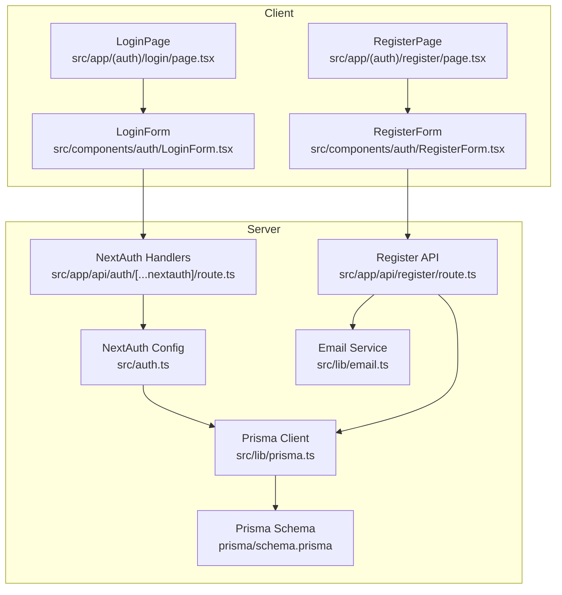
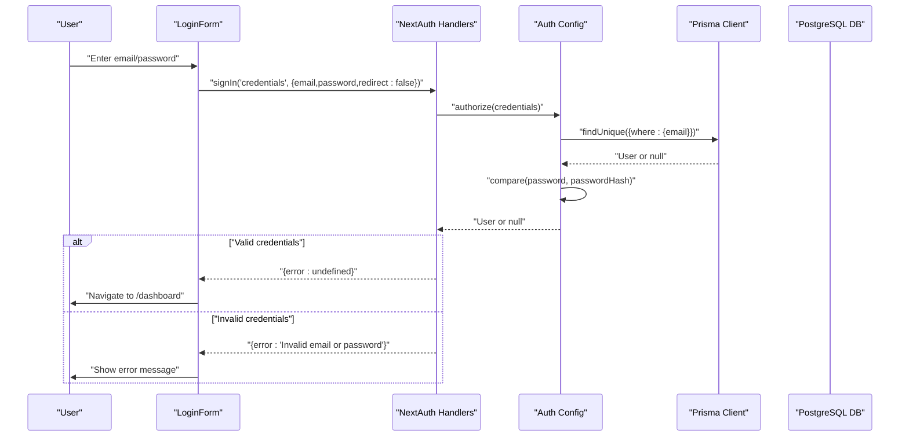
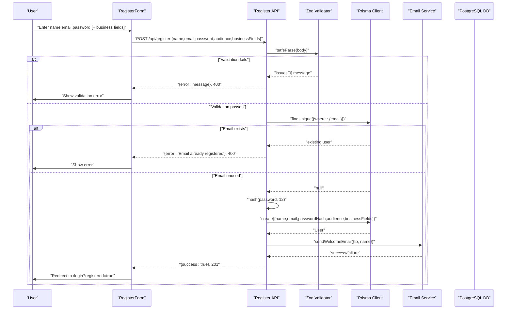
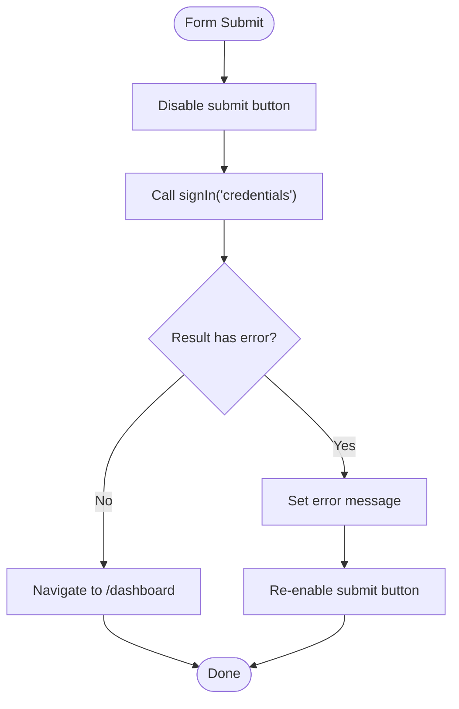
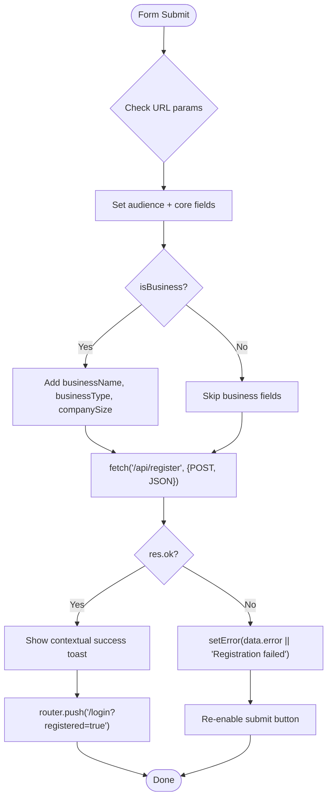
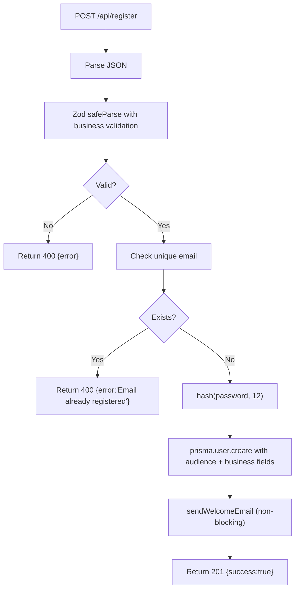
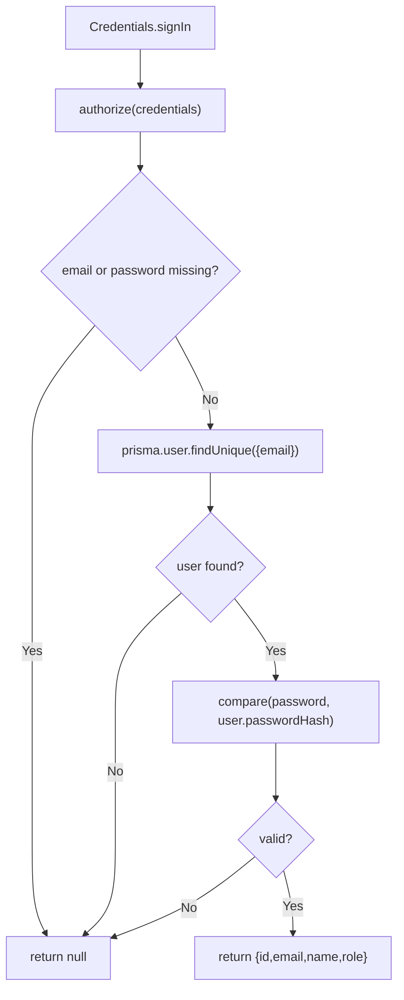
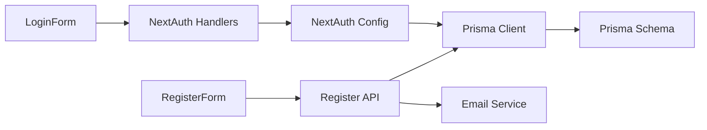

# User Registration & Login Flows

<cite>
**Referenced Files in This Document**
- [LoginPage](file://src/app/(auth)/login/page.tsx)
- [RegisterPage](file://src/app/(auth)/register/page.tsx)
- [LoginForm](file://src/components/auth/LoginForm.tsx)
- [RegisterForm](file://src/components/auth/RegisterForm.tsx)
- [Register API Route](file://src/app/api/register/route.ts)
- [NextAuth Handlers](file://src/app/api/auth/[...nextauth]/route.ts)
- [NextAuth Config](file://src/auth.ts)
- [Prisma Client](file://src/lib/prisma.ts)
- [Prisma Schema](file://prisma/schema.prisma)
- [Email Service](file://src/lib/email.ts)
- [Middleware](file://src/middleware.ts)
- [Dashboard Page](file://src/app/(protected)/dashboard/page.tsx)
- [Package Dependencies](file://package.json)
</cite>

## Update Summary
**Changes Made**
- Enhanced registration form with business-specific fields (audience, businessName, businessType, companySize)
- Added conditional form display based on URL parameters for business vs creator registrations
- Updated validation logic to handle both business and creator account types
- Enhanced API endpoint with Zod schema validation for business registration fields
- Added welcome email functionality for new user accounts
- Updated database schema to support business registration data

## Table of Contents
1. [Introduction](#introduction)
2. [Project Structure](#project-structure)
3. [Core Components](#core-components)
4. [Architecture Overview](#architecture-overview)
5. [Detailed Component Analysis](#detailed-component-analysis)
6. [Enhanced Registration Flow](#enhanced-registration-flow)
7. [Dependency Analysis](#dependency-analysis)
8. [Performance Considerations](#performance-considerations)
9. [Troubleshooting Guide](#troubleshooting-guide)
10. [Conclusion](#conclusion)

## Introduction
This document explains the user registration and login flows in the application, including the enhanced business registration system. It covers:
- Client-side forms for login and dual-purpose registration (creator/business)
- Validation patterns (client-side and server-side) with business-specific field handling
- Authentication flow using NextAuth with credentials provider
- Password hashing with bcryptjs
- API endpoints, request/response schemas, and error responses
- Business registration workflow with conditional form fields
- Security measures and protections against common authentication vulnerabilities
- Successful flows, error scenarios, and user feedback mechanisms

## Project Structure
The authentication system spans client components, API routes, and NextAuth configuration with enhanced business registration capabilities:
- Pages render client components for login and registration with audience-based form rendering
- Client components submit requests to API endpoints with conditional business fields
- NextAuth handles credential-based authentication and session management
- Prisma manages user persistence with unique email indexing and business registration fields
- Email service provides welcome notifications for new accounts

```mermaid
graph TB
subgraph "Client"
LP["LoginPage<br/>src/app/(auth)/login/page.tsx"]
RP["RegisterPage<br/>src/app/(auth)/register/page.tsx"]
LF["LoginForm<br/>src/components/auth/LoginForm.tsx"]
RF["RegisterForm<br/>src/components/auth/RegisterForm.tsx"]
end
subgraph "Server"
NAH["NextAuth Handlers<br/>src/app/api/auth/[...nextauth]/route.ts"]
REG_API["Register API<br/>src/app/api/register/route.ts"]
AUTH_CFG["NextAuth Config<br/>src/auth.ts"]
PRISMA["Prisma Client<br/>src/lib/prisma.ts"]
EMAIL["Email Service<br/>src/lib/email.ts"]
SCHEMA["Prisma Schema<br/>prisma/schema.prisma"]
end
LP --> LF
RP --> RF
LF --> NAH
RF --> REG_API
NAH --> AUTH_CFG
AUTH_CFG --> PRISMA
REG_API --> PRISMA
REG_API --> EMAIL
PRISMA --> SCHEMA
```

**Diagram sources**
- [LoginPage](file://src/app/(auth)/login/page.tsx#L1-L72)
- [RegisterPage](file://src/app/(auth)/register/page.tsx#L1-L86)
- [LoginForm:1-119](file://src/components/auth/LoginForm.tsx#L1-L119)
- [RegisterForm:1-263](file://src/components/auth/RegisterForm.tsx#L1-L263)
- [NextAuth Handlers:1-4](file://src/app/api/auth/[...nextauth]/route.ts#L1-L4)
- [Register API Route:1-94](file://src/app/api/register/route.ts#L1-L94)
- [NextAuth Config:1-89](file://src/auth.ts#L1-L89)
- [Prisma Client:1-10](file://src/lib/prisma.ts#L1-L10)
- [Email Service:1-160](file://src/lib/email.ts#L1-L160)
- [Prisma Schema:1-232](file://prisma/schema.prisma#L1-L232)

**Section sources**
- [LoginPage](file://src/app/(auth)/login/page.tsx#L1-L72)
- [RegisterPage](file://src/app/(auth)/register/page.tsx#L1-L86)
- [LoginForm:1-119](file://src/components/auth/LoginForm.tsx#L1-L119)
- [RegisterForm:1-263](file://src/components/auth/RegisterForm.tsx#L1-L263)
- [NextAuth Handlers:1-4](file://src/app/api/auth/[...nextauth]/route.ts#L1-L4)
- [Register API Route:1-94](file://src/app/api/register/route.ts#L1-L94)
- [NextAuth Config:1-89](file://src/auth.ts#L1-L89)
- [Prisma Client:1-10](file://src/lib/prisma.ts#L1-L10)
- [Email Service:1-160](file://src/lib/email.ts#L1-L160)
- [Prisma Schema:1-232](file://prisma/schema.prisma#L1-L232)

## Core Components
- LoginForm: Collects email and password, submits to NextAuth credentials provider, displays errors, and navigates on success.
- RegisterForm: Enhanced dual-purpose form that collects name, email, and password with conditional business fields (businessName, businessType, companySize) based on URL parameters, posts to /api/register, handles errors, and redirects to login after success.
- NextAuth Config: Defines credentials provider, user/session types, JWT callbacks, and session strategy.
- Register API Route: Enhanced validation with Zod schema supporting both creator and business registrations, checks for existing email, hashes password with bcryptjs, creates user via Prisma with business fields, and sends welcome email.
- Middleware: Protects routes by requiring an authenticated session.

**Section sources**
- [LoginForm:1-119](file://src/components/auth/LoginForm.tsx#L1-L119)
- [RegisterForm:1-263](file://src/components/auth/RegisterForm.tsx#L1-L263)
- [NextAuth Config:1-89](file://src/auth.ts#L1-L89)
- [Register API Route:1-94](file://src/app/api/register/route.ts#L1-L94)
- [Middleware:1-6](file://src/middleware.ts#L1-L6)

## Architecture Overview
The authentication architecture integrates client-side forms, NextAuth, and an enhanced registration API endpoint backed by Prisma with business registration capabilities.

```mermaid
sequenceDiagram
participant U as "User"
participant LF as "LoginForm"
participant NAH as "NextAuth Handlers"
participant AC as "Auth Config"
participant PC as "Prisma Client"
participant DB as "PostgreSQL DB"
U->>LF : "Enter email/password"
LF->>NAH : "signIn('credentials', {email,password,redirect : false})"
NAH->>AC : "authorize(credentials)"
AC->>PC : "findUnique({where : {email}})"
PC-->>AC : "User or null"
AC->>AC : "compare(password, passwordHash)"
AC-->>NAH : "User or null"
alt "Valid credentials"
NAH-->>LF : "{error : undefined}"
LF->>U : "Navigate to /dashboard"
else "Invalid credentials"
NAH-->>LF : "{error : 'Invalid email or password'}"
LF->>U : "Show error message"
end
```

**Diagram sources**
- [LoginForm:26-45](file://src/components/auth/LoginForm.tsx#L26-L45)
- [NextAuth Handlers:1-4](file://src/app/api/auth/[...nextauth]/route.ts#L1-L4)
- [NextAuth Config:35-58](file://src/auth.ts#L35-L58)
- [Prisma Client:1-10](file://src/lib/prisma.ts#L1-L10)
- [Prisma Schema:10-30](file://prisma/schema.prisma#L10-L30)

```mermaid
sequenceDiagram
participant U as "User"
participant RF as "RegisterForm"
participant API as "Register API"
participant V as "Zod Validator"
participant PC as "Prisma Client"
participant EM as "Email Service"
participant DB as "PostgreSQL DB"
U->>RF : "Enter name,email,password [+ business fields]"
RF->>API : "POST /api/register {name,email,password,audience,businessFields}"
API->>V : "safeParse(body)"
alt "Validation fails"
V-->>API : "issues[0].message"
API-->>RF : "{error : message}, 400"
RF->>U : "Show validation error"
else "Validation passes"
API->>PC : "findUnique({where : {email}})"
alt "Email exists"
PC-->>API : "existing user"
API-->>RF : "{error : 'Email already registered'}, 400"
RF->>U : "Show error"
else "Email unused"
PC-->>API : "null"
API->>API : "hash(password, 12)"
API->>PC : "create({name,email,passwordHash,audience,businessFields})"
PC-->>API : "User"
API->>EM : "sendWelcomeEmail({to, name})"
EM-->>API : "success/failure"
API-->>RF : "{success : true}, 201"
RF->>U : "Redirect to /login?registered=true"
end
end
```

**Diagram sources**
- [RegisterForm:41-83](file://src/components/auth/RegisterForm.tsx#L41-L83)
- [Register API Route:29-93](file://src/app/api/register/route.ts#L29-L93)
- [Email Service:97-159](file://src/lib/email.ts#L97-L159)
- [Prisma Client:1-10](file://src/lib/prisma.ts#L1-L10)
- [Prisma Schema:10-30](file://prisma/schema.prisma#L10-L30)

## Detailed Component Analysis

### Login Form Implementation
- Client-side behavior:
  - Captures email and password via controlled inputs
  - Prevents default form submission, disables button during loading
  - Submits to NextAuth credentials provider with redirect disabled
  - On error, shows a user-facing message; on success, navigates to /dashboard
  - Displays success toast when redirected from registration or password reset
- Validation:
  - HTML5 required attributes and input types
  - Client-side feedback via state and disabled button
- Authentication flow:
  - Uses NextAuth signIn with credentials provider
  - NextAuth authorize compares hashed password against stored hash
- Error handling:
  - Displays a generic invalid credentials message
  - No additional client-side sanitization is performed; relies on server-side validation

```mermaid
flowchart TD
Start(["Form Submit"]) --> Disable["Disable submit button"]
Disable --> CallSignIn["Call signIn('credentials')"]
CallSignIn --> Result{"Result has error?"}
Result --> |Yes| ShowErr["Set error message"]
Result --> |No| Navigate["Navigate to /dashboard"]
ShowErr --> Enable["Re-enable submit button"]
Navigate --> End(["Done"])
Enable --> End
```

**Diagram sources**
- [LoginForm:26-45](file://src/components/auth/LoginForm.tsx#L26-L45)

**Section sources**
- [LoginForm:1-119](file://src/components/auth/LoginForm.tsx#L1-L119)
- [NextAuth Config:35-58](file://src/auth.ts#L35-L58)

### Enhanced Registration Form Implementation
- Client-side behavior:
  - Detects registration type (business/creator) from URL parameters
  - Conditionally renders business-specific fields (businessName, businessType, companySize)
  - Captures core fields (name, email, password) plus conditional business fields
  - Prevents default form submission, disables button during loading
  - Posts JSON payload to /api/register with appropriate audience type
  - Handles non-OK responses by setting error messages via toast notifications
  - Redirects to /login?registered=true on success with contextual success message
- Validation:
  - HTML5 required and minlength=8 for password
  - Conditional business field validation (businessName required for business accounts)
  - Client-side feedback via state and disabled button
- Error handling:
  - Displays server-provided error or generic failure message via toast
  - Catches network exceptions and sets a fallback error
  - Provides contextual success messages for business vs creator registrations

```mermaid
flowchart TD
Start(["Form Submit"]) --> CheckAudience{"Check URL params"}
CheckAudience --> SetPayload["Set audience + core fields"]
SetPayload --> IsBusiness{"isBusiness?"}
IsBusiness --> |Yes| AddBizFields["Add businessName, businessType, companySize"]
IsBusiness --> |No| SkipBizFields["Skip business fields"]
AddBizFields --> Fetch["fetch('/api/register', {POST, JSON})"]
SkipBizFields --> Fetch
Fetch --> RespOk{"res.ok?"}
RespOk --> |No| SetErr["setError(data.error || 'Registration failed')"]
RespOk --> |Yes| SuccessMsg["Show contextual success toast"]
SuccessMsg --> Redirect["router.push('/login?registered=true')"]
SetErr --> Enable["Re-enable submit button"]
Redirect --> End(["Done"])
Enable --> End
```

**Diagram sources**
- [RegisterForm:28-83](file://src/components/auth/RegisterForm.tsx#L28-L83)

**Section sources**
- [RegisterForm:1-263](file://src/components/auth/RegisterForm.tsx#L1-L263)
- [Register API Route:29-93](file://src/app/api/register/route.ts#L29-L93)

### API Endpoints

#### POST /api/register
- Purpose: Create a new user account with support for both creator and business registrations
- Request body schema (validated with Zod):
  - name: string, required
  - email: string, valid email
  - password: string, minimum 8 characters
  - audience: enum ["creator", "business"], optional, defaults to "creator"
  - businessName: string, optional but required when audience is "business"
  - businessType: string, optional (e.g., "cafe", "restaurant", "retail", etc.)
  - companySize: string, optional (e.g., "1-10", "11-50", "51-200", "200+")
- Response:
  - 201 Created: { success: true }
  - 400 Bad Request: { error: string } (validation or duplicate email)
  - 500 Internal Server Error: { error: string }
- Processing:
  - Parse and validate JSON with enhanced Zod schema
  - Check uniqueness of email
  - Hash password with bcryptjs using salt rounds 12
  - Persist user with passwordHash and conditional business fields
  - Send welcome email (non-blocking, doesn't fail registration if email fails)

```mermaid
flowchart TD
A["POST /api/register"] --> B["Parse JSON"]
B --> C["Zod safeParse with business validation"]
C --> D{"Valid?"}
D --> |No| E["Return 400 {error}"]
D --> |Yes| F["Check unique email"]
F --> G{"Exists?"}
G --> |Yes| H["Return 400 {error:'Email already registered'}"]
G --> |No| I["hash(password, 12)"]
I --> J["prisma.user.create with audience + business fields"]
J --> K["sendWelcomeEmail (non-blocking)"]
K --> L["Return 201 {success:true}"]
```

**Diagram sources**
- [Register API Route:29-93](file://src/app/api/register/route.ts#L29-L93)
- [Prisma Schema:10-30](file://prisma/schema.prisma#L10-L30)

**Section sources**
- [Register API Route:1-94](file://src/app/api/register/route.ts#L1-L94)
- [Prisma Schema:10-30](file://prisma/schema.prisma#L10-L30)

#### NextAuth Credentials Provider
- Provider: credentials with email and password fields
- Authorization logic:
  - Rejects if either field is missing
  - Finds user by email
  - Compares provided password with stored passwordHash
  - Returns user object on success
- Session strategy: JWT
- Callbacks:
  - jwt callback attaches id and role to the token
  - session callback attaches id and role to the session

```mermaid
flowchart TD
A["Credentials.signIn"] --> B["authorize(credentials)"]
B --> C{"email or password missing?"}
C --> |Yes| D["return null"]
C --> |No| E["prisma.user.findUnique({email})"]
E --> F{"user found?"}
F --> |No| D
F --> |Yes| G["compare(password, user.passwordHash)"]
G --> H{"valid?"}
H --> |No| D
H --> |Yes| I["return {id,email,name,role}"]
```

**Diagram sources**
- [NextAuth Config:35-58](file://src/auth.ts#L35-L58)
- [Prisma Schema:10-30](file://prisma/schema.prisma#L10-L30)

**Section sources**
- [NextAuth Config:1-89](file://src/auth.ts#L1-L89)
- [Prisma Schema:10-30](file://prisma/schema.prisma#L10-L30)

### Protected Routes and Middleware
- Middleware enforces authentication for:
  - /dashboard/*
  - /create/*
  - /admin/*
- Accessible via JWT session strategy configured in NextAuth

**Section sources**
- [Middleware:1-6](file://src/middleware.ts#L1-L6)
- [NextAuth Config:61-64](file://src/auth.ts#L61-L64)

## Enhanced Registration Flow

### Business Registration Workflow
The enhanced registration system supports two distinct user types:

#### Creator Registration
- Standard registration flow for individual users
- Fields: name, email, password
- Audience: "creator" (default)
- No business-specific fields required

#### Business Registration  
- Specialized registration flow for business accounts
- Triggered by URL parameter: `/register?audience=business`
- Required fields: name, email, password, businessName
- Optional fields: businessType, companySize
- Audience: "business"

### Form Field Logic
- **Conditional Rendering**: Business fields only appear when `audience=business` in URL
- **Dynamic Labels**: Name field label changes between "Name" and "Contact Name" based on audience
- **Validation Rules**: 
  - Business accounts require businessName
  - All accounts require valid email and password (min 8 chars)
  - Business type and company size are optional dropdown selections

### Database Schema Updates
The User model now includes business registration fields:
- `audience`: String with default "creator" (supports "creator" or "business")
- `businessName`: String? (required for business accounts)
- `businessType`: String? (e.g., "cafe", "retail", "restaurant", etc.)
- `companySize`: String? (e.g., "1-10", "11-50", "51-200", "200+")

### Welcome Email Integration
- Automatic welcome email sent upon successful registration
- Non-blocking implementation ensures registration succeeds even if email fails
- Personalized greeting with user's name
- Includes call-to-action link to login page

**Section sources**
- [RegisterForm:28-83](file://src/components/auth/RegisterForm.tsx#L28-L83)
- [Register API Route:7-27](file://src/app/api/register/route.ts#L7-L27)
- [Prisma Schema:19-24](file://prisma/schema.prisma#L19-L24)
- [Email Service:97-159](file://src/lib/email.ts#L97-L159)

## Dependency Analysis
- Client components depend on NextUI-like styling classes and Next.js routing
- NextAuth depends on:
  - Prisma for user lookup
  - bcryptjs for password comparison
  - Zod for request validation in registration
- Registration API depends on:
  - Zod for enhanced validation with business field rules
  - bcryptjs for password hashing
  - Email service for welcome notifications
- Prisma schema defines:
  - Unique index on email
  - Role defaults to USER
  - PasswordHash stored as string
  - Business registration fields with proper nullability

```mermaid
graph LR
RF["RegisterForm"] --> REG_API["Register API"]
LF["LoginForm"] --> NAH["NextAuth Handlers"]
NAH --> AUTH_CFG["NextAuth Config"]
AUTH_CFG --> PRISMA["Prisma Client"]
REG_API --> PRISMA
REG_API --> EMAIL["Email Service"]
PRISMA --> SCHEMA["Prisma Schema"]
```

**Diagram sources**
- [RegisterForm:1-263](file://src/components/auth/RegisterForm.tsx#L1-L263)
- [LoginForm:1-119](file://src/components/auth/LoginForm.tsx#L1-L119)
- [NextAuth Handlers:1-4](file://src/app/api/auth/[...nextauth]/route.ts#L1-L4)
- [NextAuth Config:1-89](file://src/auth.ts#L1-L89)
- [Register API Route:1-94](file://src/app/api/register/route.ts#L1-L94)
- [Prisma Client:1-10](file://src/lib/prisma.ts#L1-L10)
- [Email Service:1-160](file://src/lib/email.ts#L1-L160)
- [Prisma Schema:1-232](file://prisma/schema.prisma#L1-L232)

**Section sources**
- [Package Dependencies:11-24](file://package.json#L11-L24)
- [Prisma Schema:10-30](file://prisma/schema.prisma#L10-L30)

## Performance Considerations
- Password hashing cost: bcryptjs uses 12 rounds; acceptable for development; consider benchmarking and adjusting for production workloads.
- Database queries:
  - Unique email index supports efficient duplicate detection
  - Single lookup per login; consider connection pooling and Prisma client reuse
  - Business registration fields add minimal overhead to user creation
- Client-side:
  - Minimal re-renders via controlled components
  - Disabled button prevents duplicate submissions
  - Conditional field rendering reduces unnecessary DOM updates
- Email service:
  - Non-blocking email sending ensures registration performance isn't affected by email delivery
  - Graceful degradation when email service is unavailable

## Troubleshooting Guide
Common issues and resolutions:
- Login fails with "Invalid email or password"
  - Cause: Missing or incorrect credentials, or password mismatch
  - Resolution: Verify email and password; ensure bcryptjs comparison succeeds
- Registration returns "Email already registered"
  - Cause: Duplicate email detected
  - Resolution: Use another email address
- Registration returns "Business name is required for business accounts"
  - Cause: Business registration without required businessName field
  - Resolution: Fill in the business name field when registering as a business
- Registration returns "Password must be at least 8 characters" or "Name is required"
  - Cause: Zod validation failure
  - Resolution: Fix input according to schema
- Network errors during registration
  - Cause: Fetch exception
  - Resolution: Check server logs and network connectivity
- Protected route access denied
  - Cause: Unauthenticated or expired session
  - Resolution: Re-authenticate; ensure JWT session strategy is active
- Welcome email not received
  - Cause: Email service configuration issue or spam filtering
  - Resolution: Check email service configuration; verify email wasn't filtered as spam

**Section sources**
- [LoginForm:38-44](file://src/components/auth/LoginForm.tsx#L38-L44)
- [Register API Route:37-43](file://src/app/api/register/route.ts#L37-L43)
- [Register API Route:48-55](file://src/app/api/register/route.ts#L48-L55)
- [Register API Route:86-92](file://src/app/api/register/route.ts#L86-L92)
- [Middleware:3-5](file://src/middleware.ts#L3-L5)

## Conclusion
The application implements a secure and sophisticated authentication system with enhanced business registration capabilities:
- Client-side forms provide immediate feedback and prevent duplicate submissions
- Dual-purpose registration system supports both creator and business accounts with conditional field rendering
- NextAuth handles credentials-based authentication with robust session management
- Enhanced registration validates inputs, prevents duplicate emails, securely stores hashed passwords, and captures business-specific data
- Business registration includes optional categorization fields for better user segmentation
- Protected routes ensure only authenticated users can access sensitive areas
- Welcome email integration provides user onboarding experience
- The architecture balances simplicity with advanced features, leveraging bcryptjs, unique indices, JWT sessions, and conditional business logic