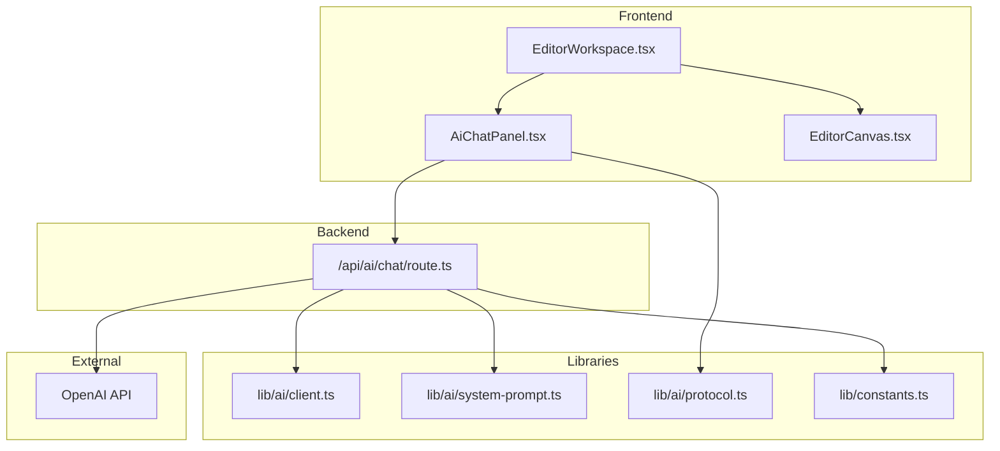
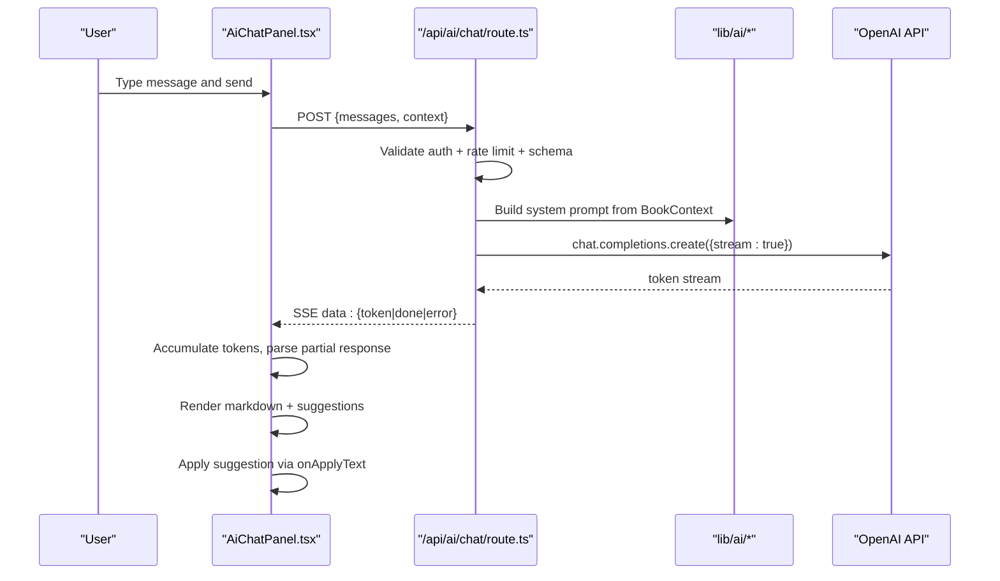
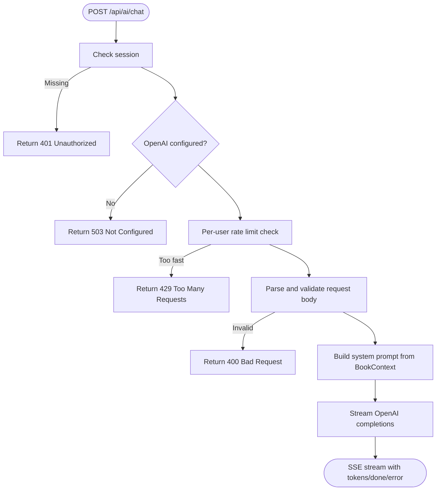
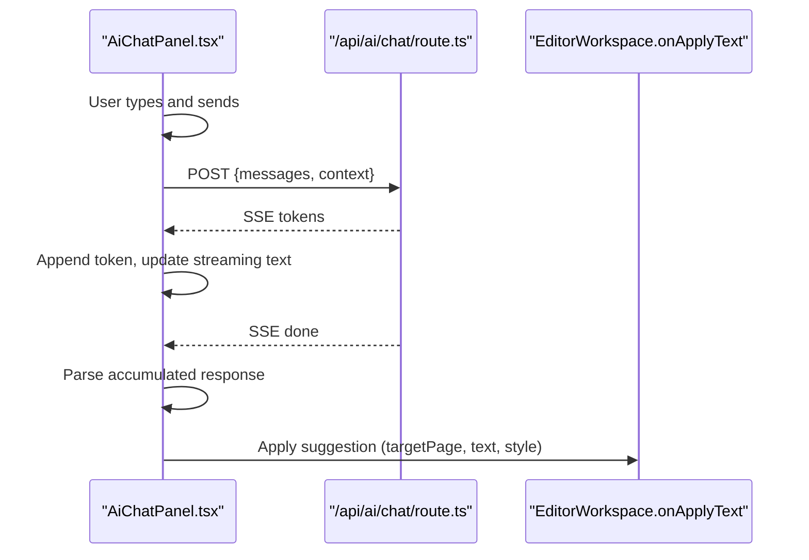
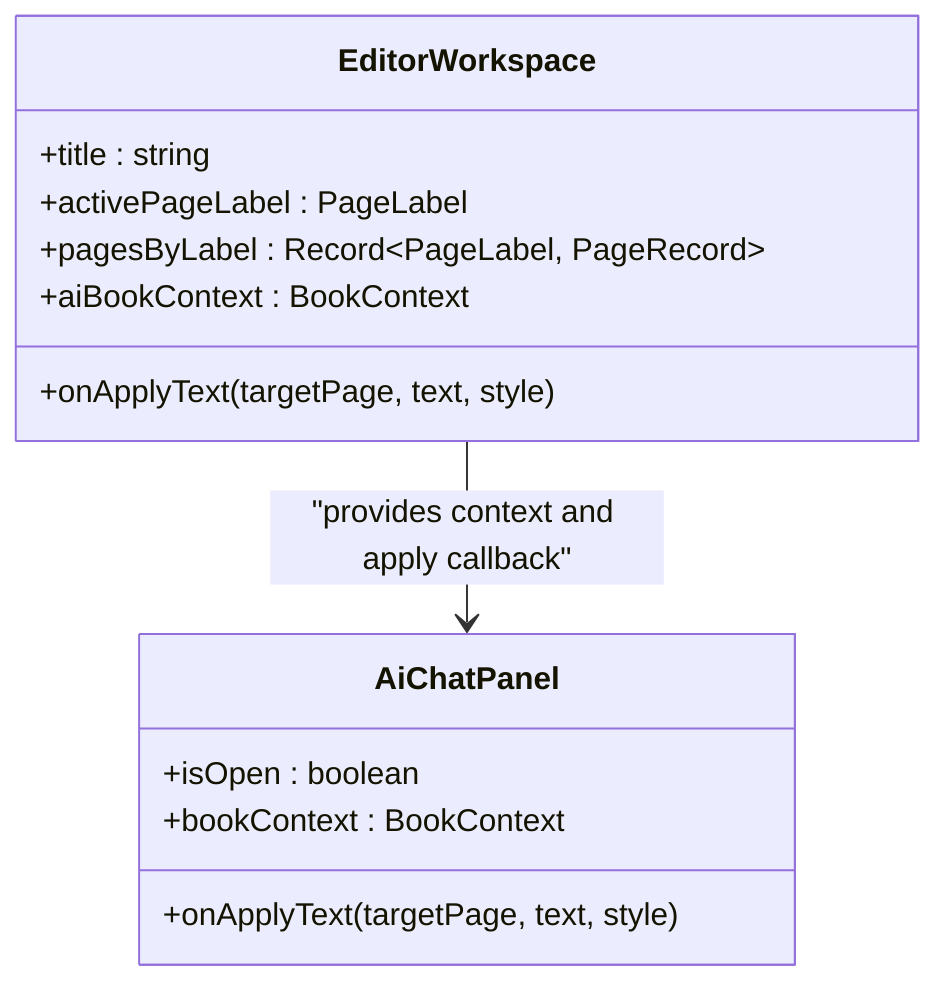
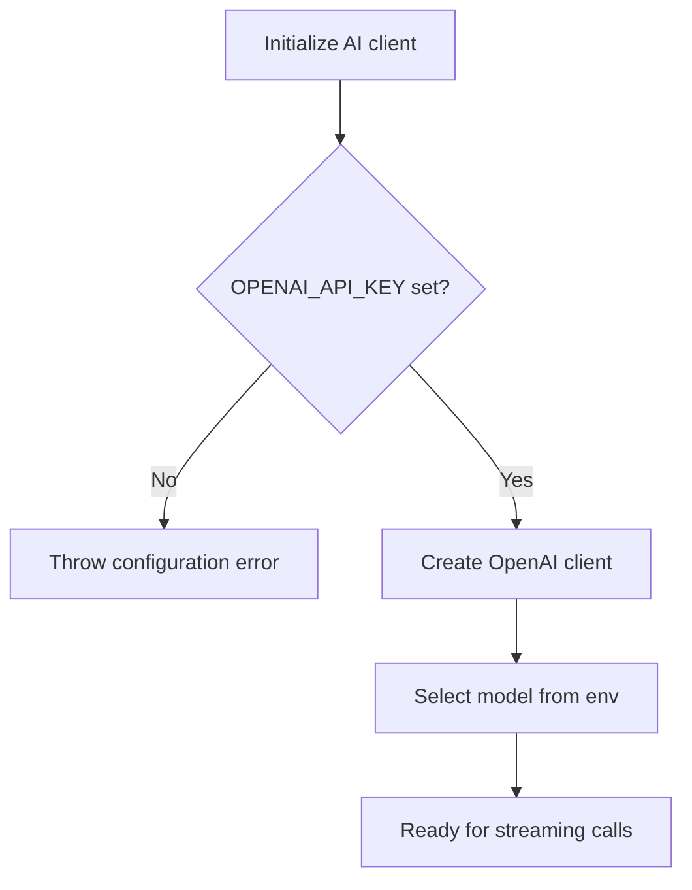
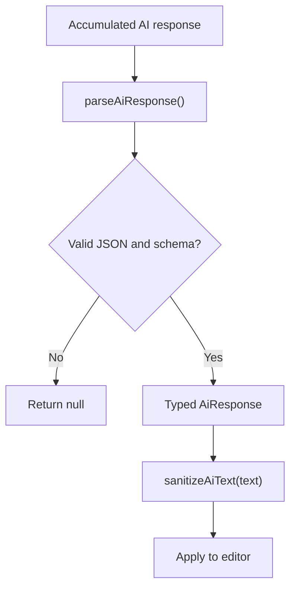
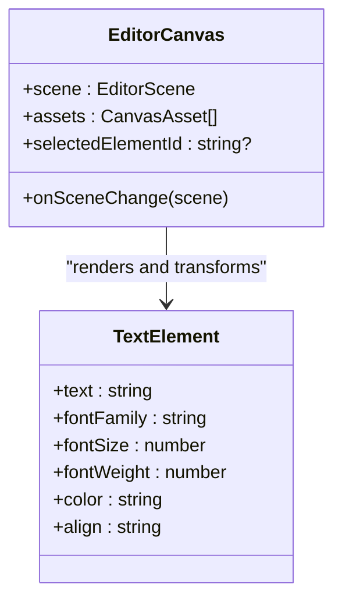
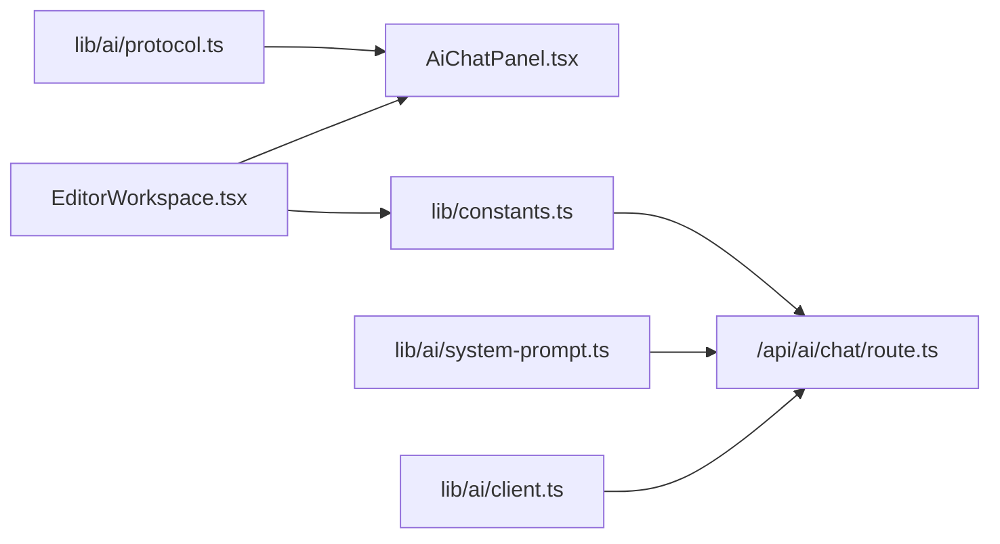

# AI Editor Assistant

<cite>
**Referenced Files in This Document**
- [README.md](file://README.md)
- [package.json](file://package.json)
- [titchybook-editor-implementation-spec.md](file://docs/titchybook-editor-implementation-spec.md)
- [route.ts (AI chat)](file://src/app/api/ai/chat/route.ts)
- [AiChatPanel.tsx](file://src/components/editor/AiChatPanel.tsx)
- [EditorWorkspace.tsx](file://src/components/editor/EditorWorkspace.tsx)
- [EditorCanvas.tsx](file://src/components/editor/EditorCanvas.tsx)
- [client.ts (AI client)](file://src/lib/ai/client.ts)
- [system-prompt.ts](file://src/lib/ai/system-prompt.ts)
- [protocol.ts](file://src/lib/ai/protocol.ts)
- [constants.ts](file://src/lib/constants.ts)
- [page.tsx (Create page)](file://src/app/(protected)/create/page.tsx)
- [schema.prisma](file://prisma/schema.prisma)
</cite>

## Table of Contents
1. Introduction
2. Project Structure
3. Core Components
4. Architecture Overview
5. Detailed Component Analysis
6. Dependency Analysis
7. Performance Considerations
8. Troubleshooting Guide
9. Conclusion

## Introduction
This document explains the AI Editor Assistant embedded in the Titchybooks editor. It integrates a streaming OpenAI-powered writing assistant into the page editor, allowing users to generate and apply text suggestions directly onto their booklet pages. The assistant is context-aware: it knows the book title, active page, and snippets of existing text across all eight logical pages.

The system combines:
- A Next.js API route that streams OpenAI responses with server-side validation and rate limiting
- A React panel that renders messages, handles streaming, parses structured suggestions, and applies them to the editor
- An editor workspace that builds a book context from current scene state and exposes an apply-text callback
- A typed protocol for AI responses and sanitization rules to keep content safe and consistent

[No sources needed since this section summarizes without analyzing specific files]

## Project Structure
The AI Assistant spans three layers:
- Frontend UI: AiChatPanel and EditorWorkspace integrate the assistant into the editor
- Backend API: /api/ai/chat routes requests, validates inputs, and streams OpenAI completions
- Shared libraries: AI client configuration, system prompt builder, and response protocol validation

**Diagram sources**
- [route.ts (AI chat):1-145](file://src/app/api/ai/chat/route.ts#L1-L145)
- [AiChatPanel.tsx:1-714](file://src/components/editor/AiChatPanel.tsx#L1-L714)
- [EditorWorkspace.tsx:1-800](file://src/components/editor/EditorWorkspace.tsx#L1-L800)
- [client.ts (AI client):1-26](file://src/lib/ai/client.ts#L1-L26)
- [system-prompt.ts:1-92](file://src/lib/ai/system-prompt.ts#L1-L92)
- [protocol.ts:1-56](file://src/lib/ai/protocol.ts#L1-L56)
- [constants.ts:1-59](file://src/lib/constants.ts#L1-L59)

**Section sources**
- [README.md:1-37](file://README.md#L1-L37)
- [package.json:1-50](file://package.json#L1-L50)
- [titchybook-editor-implementation-spec.md:1-639](file://docs/titchybook-editor-implementation-spec.md#L1-L639)

## Core Components
- AI Chat API Route: Authenticates users, enforces request schema, applies per-user rate limiting, builds a system prompt from book context, streams tokens via Server-Sent Events, and returns errors safely.
- AI Chat Panel: Manages conversation state, streams tokens, parses structured responses, displays markdown, shows actionable suggestions, and applies sanitized text to the editor.
- Editor Workspace: Builds a BookContext from current scenes and templates, passes it to the chat panel, and provides onApplyText to insert generated text into the active page or other pages.
- AI Client: Provides a singleton OpenAI client and model selection based on environment variables; guards against missing configuration.
- System Prompt: Encodes product knowledge, page roles, and strict JSON response format with suggestion structure and style hints.
- Protocol: Validates AI responses and sanitizes text before applying to the editor.

**Section sources**
- [route.ts (AI chat):11-145](file://src/app/api/ai/chat/route.ts#L11-L145)
- [AiChatPanel.tsx:65-207](file://src/components/editor/AiChatPanel.tsx#L65-L207)
- [EditorWorkspace.tsx:395-420](file://src/components/editor/EditorWorkspace.tsx#L395-L420)
- [client.ts (AI client):1-26](file://src/lib/ai/client.ts#L1-L26)
- [system-prompt.ts:24-92](file://src/lib/ai/system-prompt.ts#L24-L92)
- [protocol.ts:1-56](file://src/lib/ai/protocol.ts#L1-L56)

## Architecture Overview
The assistant follows a clear request/response flow with streaming:

**Diagram sources**
- [route.ts (AI chat):35-145](file://src/app/api/ai/chat/route.ts#L35-L145)
- [AiChatPanel.tsx:65-207](file://src/components/editor/AiChatPanel.tsx#L65-L207)
- [system-prompt.ts:24-92](file://src/lib/ai/system-prompt.ts#L24-L92)
- [client.ts (AI client):1-26](file://src/lib/ai/client.ts#L1-L26)

## Detailed Component Analysis

### AI Chat API Route
Responsibilities:
- Authentication check using session
- Configuration guard for OpenAI key presence
- Per-user in-memory rate limiting to prevent abuse
- Request body validation with Zod schemas for messages and context
- Building a system prompt from BookContext
- Streaming OpenAI chat completions as SSE
- Error handling and safe error propagation

Key behaviors:
- Enforces max message count and length limits
- Limits context pages to 8 and validates page labels
- Returns appropriate HTTP status codes for unauthorized, misconfiguration, validation, and upstream errors
- Streams tokens incrementally and signals completion

**Diagram sources**
- [route.ts (AI chat):35-145](file://src/app/api/ai/chat/route.ts#L35-L145)

**Section sources**
- [route.ts (AI chat):11-145](file://src/app/api/ai/chat/route.ts#L11-L145)

### AI Chat Panel (Frontend)
Responsibilities:
- Maintain conversation history and streaming state
- Send messages to the API with current book context
- Read SSE stream, accumulate tokens, and render live markdown
- Parse final accumulated response into structured suggestions
- Sanitize text and apply suggestions to the editor via onApplyText
- Provide quick prompts and clear chat functionality

Key behaviors:
- Auto-scrolls to latest messages during streaming
- Focuses input when panel opens
- Aborts in-flight requests on unmount
- Displays loading indicators and error banners
- Renders suggestion cards with “Apply” actions

**Diagram sources**
- [AiChatPanel.tsx:65-207](file://src/components/editor/AiChatPanel.tsx#L65-L207)
- [route.ts (AI chat):84-145](file://src/app/api/ai/chat/route.ts#L84-L145)

**Section sources**
- [AiChatPanel.tsx:1-714](file://src/components/editor/AiChatPanel.tsx#L1-L714)

### Editor Workspace Integration
Responsibilities:
- Build BookContext from current submission title, active page, and page scenes
- Pass context to AiChatPanel
- Provide onApplyText to insert generated text into the correct page element
- Manage assets, templates, thumbnails, and undo/redo alongside AI features

Key behaviors:
- Extracts text snippets from user elements and template overrides
- Respects page labels and display names
- Integrates with Konva-based canvas through EditorCanvas for rendering changes

**Diagram sources**
- [EditorWorkspace.tsx:395-420](file://src/components/editor/EditorWorkspace.tsx#L395-L420)
- [AiChatPanel.tsx:20-36](file://src/components/editor/AiChatPanel.tsx#L20-L36)

**Section sources**
- [EditorWorkspace.tsx:1-800](file://src/components/editor/EditorWorkspace.tsx#L1-L800)
- [AiChatPanel.tsx:1-714](file://src/components/editor/AiChatPanel.tsx#L1-L714)

### AI Client and System Prompt
- Client: Ensures OpenAI API key is present, caches client instance, and selects model from environment.
- System Prompt: Defines role, product constraints, page descriptions, and strict JSON response format including suggestions and optional styling.

**Diagram sources**
- [client.ts (AI client):1-26](file://src/lib/ai/client.ts#L1-L26)
- [system-prompt.ts:24-92](file://src/lib/ai/system-prompt.ts#L24-L92)

**Section sources**
- [client.ts (AI client):1-26](file://src/lib/ai/client.ts#L1-L26)
- [system-prompt.ts:1-92](file://src/lib/ai/system-prompt.ts#L1-L92)

### Protocol and Validation
- Response Schema: Enforces message and suggestions structure, including target page, text length, and optional style fields.
- Parsing: Safely parses streamed accumulation into typed objects; returns null on invalid JSON.
- Sanitization: Removes control characters and enforces maximum length before insertion into the editor.

**Diagram sources**
- [protocol.ts:1-56](file://src/lib/ai/protocol.ts#L1-L56)

**Section sources**
- [protocol.ts:1-56](file://src/lib/ai/protocol.ts#L1-L56)

### Canvas Rendering Context
While not part of the AI logic itself, the canvas component demonstrates how elements are rendered and transformed, which informs how applied text should be positioned and styled.

**Diagram sources**
- [EditorCanvas.tsx:189-296](file://src/components/editor/EditorCanvas.tsx#L189-L296)

**Section sources**
- [EditorCanvas.tsx:1-800](file://src/components/editor/EditorCanvas.tsx#L1-L800)

## Dependency Analysis
- The AI chat route depends on authentication, environment configuration, constants for page labels, and Zod for validation.
- The frontend panel depends on the protocol for parsing and sanitization, and on the workspace’s onApplyText callback to mutate editor state.
- The workspace constructs BookContext from editor scenes and templates, ensuring the assistant has accurate, up-to-date information.

**Diagram sources**
- [constants.ts:28-50](file://src/lib/constants.ts#L28-L50)
- [route.ts (AI chat):1-145](file://src/app/api/ai/chat/route.ts#L1-L145)
- [AiChatPanel.tsx:1-714](file://src/components/editor/AiChatPanel.tsx#L1-L714)
- [system-prompt.ts:1-92](file://src/lib/ai/system-prompt.ts#L1-L92)
- [client.ts (AI client):1-26](file://src/lib/ai/client.ts#L1-L26)
- [EditorWorkspace.tsx:395-420](file://src/components/editor/EditorWorkspace.tsx#L395-L420)

**Section sources**
- [constants.ts:1-59](file://src/lib/constants.ts#L1-L59)
- [route.ts (AI chat):1-145](file://src/app/api/ai/chat/route.ts#L1-L145)
- [AiChatPanel.tsx:1-714](file://src/components/editor/AiChatPanel.tsx#L1-L714)
- [EditorWorkspace.tsx:1-800](file://src/components/editor/EditorWorkspace.tsx#L1-L800)

## Performance Considerations
- Streaming reduces perceived latency by rendering tokens as they arrive.
- In-memory per-user rate limiting prevents excessive API usage within short windows.
- Debounced autosave in the editor minimizes network churn while preserving responsiveness.
- Scene normalization and z-index sorting ensure stable rendering performance.
- Asset dimension caching supports efficient DPI checks and avoids repeated image reads.

[No sources needed since this section provides general guidance]

## Troubleshooting Guide
Common issues and resolutions:
- Missing OpenAI configuration: The API returns a 503 with a descriptive error if OPENAI_API_KEY is absent or placeholder. Ensure environment variables are set correctly.
- Unauthorized access: If no valid session exists, the API returns 401. Verify authentication middleware and session setup.
- Validation failures: Invalid request bodies return 400. Confirm messages array and context shape match the schema.
- Rate limiting: Frequent requests return 429. Wait before retrying or adjust usage patterns.
- Stream errors: Errors are propagated via SSE payloads; the panel displays error banners and stops streaming.
- Applied text issues: Use sanitizeAiText to remove control characters and enforce length limits before insertion.

**Section sources**
- [route.ts (AI chat):35-145](file://src/app/api/ai/chat/route.ts#L35-L145)
- [AiChatPanel.tsx:107-185](file://src/components/editor/AiChatPanel.tsx#L107-L185)
- [protocol.ts:37-56](file://src/lib/ai/protocol.ts#L37-L56)

## Conclusion
The AI Editor Assistant enhances the Titchybooks editor with a context-aware, streaming writing partner. It balances usability and safety through strict schemas, sanitization, and robust error handling. By integrating tightly with the editor’s scene model and providing actionable suggestions, it enables creators to generate and apply high-quality text efficiently while maintaining print-ready output standards.

[No sources needed since this section summarizes without analyzing specific files]