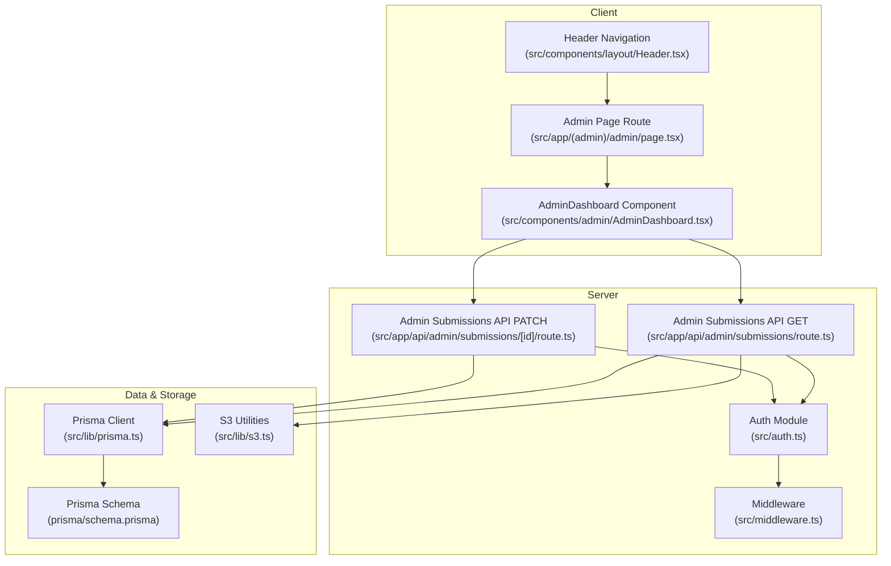
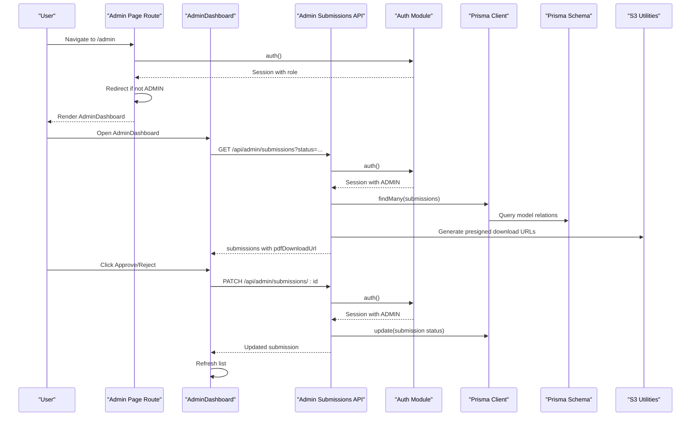
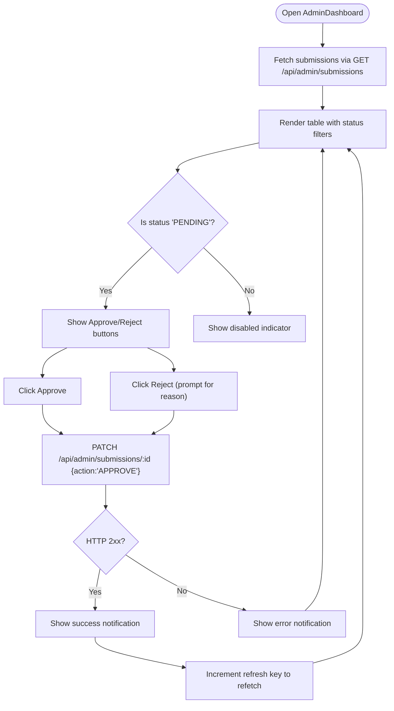
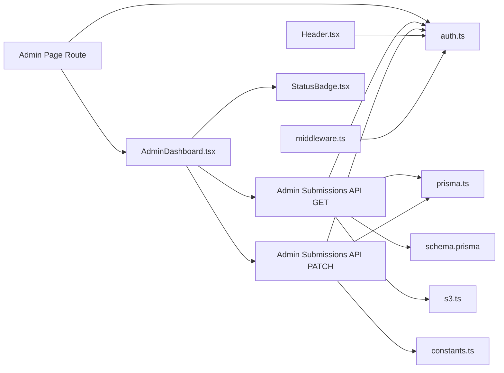

# Admin Components

<cite>
**Referenced Files in This Document**
- [AdminDashboard.tsx](file://src/components/admin/AdminDashboard.tsx)
- [Admin Page Route](file://src/app/(admin)/admin/page.tsx)
- [Admin Submissions API GET](file://src/app/api/admin/submissions/route.ts)
- [Admin Submissions API PATCH](file://src/app/api/admin/submissions/[id]/route.ts)
- [Header.tsx](file://src/components/layout/Header.tsx)
- [middleware.ts](file://src/middleware.ts)
- [auth.ts](file://src/auth.ts)
- [constants.ts](file://src/lib/constants.ts)
- [prisma.ts](file://src/lib/prisma.ts)
- [schema.prisma](file://prisma/schema.prisma)
- [s3.ts](file://src/lib/s3.ts)
- [seed.ts](file://prisma/seed.ts)
</cite>

## Table of Contents
1. [Introduction](#introduction)
2. [Project Structure](#project-structure)
3. [Core Components](#core-components)
4. [Architecture Overview](#architecture-overview)
5. [Detailed Component Analysis](#detailed-component-analysis)
6. [Dependency Analysis](#dependency-analysis)
7. [Performance Considerations](#performance-considerations)
8. [Troubleshooting Guide](#troubleshooting-guide)
9. [Conclusion](#conclusion)

## Introduction
This document describes the administrative components in Titchybook Creator with a focus on the AdminDashboard. It explains submission moderation controls, user management interfaces, system statistics display, and administrative workflows. It also documents admin-specific functionality such as content approval and rejection workflows, user administration, and system monitoring. The guide includes usage examples, bulk operations, permission-based access control, component props, event handlers, styling options, and security considerations. Administrative user experience patterns, moderation workflows, and system administration best practices are addressed, along with integration details for admin API endpoints and role-based access control.

## Project Structure
Administrative capabilities are organized around a dedicated admin route, a client-side dashboard component, and backend API endpoints secured by role-based access control. The admin route enforces ADMIN privileges and renders the AdminDashboard. The dashboard fetches submissions, displays moderation controls, and triggers approval/rejection actions via the admin API. The API endpoints validate roles, apply filters, and manage submission state transitions.

**Diagram sources**
- [Admin Page Route](file://src/app/(admin)/admin/page.tsx#L1-L13)
- [AdminDashboard.tsx:1-168](file://src/components/admin/AdminDashboard.tsx#L1-L168)
- [Header.tsx:1-69](file://src/components/layout/Header.tsx#L1-L69)
- [Admin Submissions API GET:1-38](file://src/app/api/admin/submissions/route.ts#L1-L38)
- [Admin Submissions API PATCH:1-63](file://src/app/api/admin/submissions/[id]/route.ts#L1-L63)
- [auth.ts:1-80](file://src/auth.ts#L1-L80)
- [middleware.ts:1-6](file://src/middleware.ts#L1-L6)
- [prisma.ts:1-10](file://src/lib/prisma.ts#L1-L10)
- [schema.prisma:1-48](file://prisma/schema.prisma#L1-L48)
- [s3.ts:1-81](file://src/lib/s3.ts#L1-L81)

**Section sources**
- [Admin Page Route](file://src/app/(admin)/admin/page.tsx#L1-L13)
- [AdminDashboard.tsx:1-168](file://src/components/admin/AdminDashboard.tsx#L1-L168)
- [Admin Submissions API GET:1-38](file://src/app/api/admin/submissions/route.ts#L1-L38)
- [Admin Submissions API PATCH:1-63](file://src/app/api/admin/submissions/[id]/route.ts#L1-L63)
- [Header.tsx:1-69](file://src/components/layout/Header.tsx#L1-L69)
- [auth.ts:1-80](file://src/auth.ts#L1-L80)
- [middleware.ts:1-6](file://src/middleware.ts#L1-L6)
- [prisma.ts:1-10](file://src/lib/prisma.ts#L1-L10)
- [schema.prisma:1-48](file://prisma/schema.prisma#L1-L48)
- [s3.ts:1-81](file://src/lib/s3.ts#L1-L81)

## Core Components
- AdminDashboard: A client component that lists submissions, applies status filters, previews PDFs, and performs moderation actions (approve/reject). It manages loading states, filtering, and re-fetches after actions.
- Admin Page Route: An authenticated route that enforces ADMIN role and renders the AdminDashboard.
- Admin Submissions API (GET/PATCH): Backend endpoints that validate ADMIN role, fetch submissions with optional status filtering, and update submission status with optional rejection reason.

Key responsibilities:
- Role enforcement: Only ADMIN users can access admin routes and APIs.
- Moderation: Approve or reject pending submissions; optionally record rejection reasons.
- Visibility: Display submission metadata, user info, status badges, and PDF preview links.
- Security: Validate inputs, sanitize payloads, and return appropriate HTTP statuses.

**Section sources**
- [AdminDashboard.tsx:1-168](file://src/components/admin/AdminDashboard.tsx#L1-L168)
- [Admin Page Route](file://src/app/(admin)/admin/page.tsx#L1-L13)
- [Admin Submissions API GET:1-38](file://src/app/api/admin/submissions/route.ts#L1-L38)
- [Admin Submissions API PATCH:1-63](file://src/app/api/admin/submissions/[id]/route.ts#L1-L63)

## Architecture Overview
The admin architecture follows a layered pattern:
- Presentation Layer: AdminDashboard renders the UI and handles user interactions.
- Routing Layer: Admin route enforces role-based access.
- API Layer: Admin endpoints validate sessions, enforce ADMIN role, and operate on the database.
- Persistence Layer: Prisma ORM interacts with the SQLite database defined in the schema.
- Storage Layer: S3 utilities generate presigned URLs for PDF downloads.

**Diagram sources**
- [Admin Page Route](file://src/app/(admin)/admin/page.tsx#L1-L13)
- [AdminDashboard.tsx:1-168](file://src/components/admin/AdminDashboard.tsx#L1-L168)
- [Admin Submissions API GET:1-38](file://src/app/api/admin/submissions/route.ts#L1-L38)
- [Admin Submissions API PATCH:1-63](file://src/app/api/admin/submissions/[id]/route.ts#L1-L63)
- [auth.ts:1-80](file://src/auth.ts#L1-L80)
- [prisma.ts:1-10](file://src/lib/prisma.ts#L1-L10)
- [schema.prisma:1-48](file://prisma/schema.prisma#L1-L48)
- [s3.ts:1-81](file://src/lib/s3.ts#L1-L81)

## Detailed Component Analysis

### AdminDashboard Component
Purpose:
- Display a paginated-like table of submissions filtered by status.
- Allow admins to approve or reject pending submissions.
- Provide quick access to PDF previews via presigned URLs.
- Reflect real-time updates after moderation actions.

Props:
- None (client component with internal state)

State and Effects:
- Submissions list with user metadata and status.
- Loading state during fetch.
- Filter state for status.
- Refresh key to force re-fetch after actions.

Event Handlers:
- handleAction(id, action): Sends PATCH to update submission status; collects optional rejection reason for rejections; shows notifications; increments refresh key.

Rendering Logic:
- Status filter buttons to switch between all and specific statuses.
- Skeleton loaders while loading.
- Empty state when no submissions match filters.
- Table rows with user info, creation date, status badge, PDF preview link, and moderation buttons for pending items.

Styling Options:
- Tailwind classes for responsive layout, spacing, borders, and color-coded status badges.
- Hover and active states for interactive elements.

Security Considerations:
- Relies on server-side role checks in API endpoints.
- Client-side prompts for rejection reasons; server validates payload.

Usage Examples:
- Approve a pending submission: Click Approve on the row; the list refreshes automatically.
- Reject a submission with a reason: Click Reject; enter a reason; the list refreshes and stores the reason.
- Filter by status: Click “All”, “Pending”, “Approved”, or “Rejected” to narrow the view.

**Diagram sources**
- [AdminDashboard.tsx:1-168](file://src/components/admin/AdminDashboard.tsx#L1-L168)
- [Admin Submissions API PATCH:1-63](file://src/app/api/admin/submissions/[id]/route.ts#L1-L63)

**Section sources**
- [AdminDashboard.tsx:1-168](file://src/components/admin/AdminDashboard.tsx#L1-L168)

### Admin Page Route
Responsibilities:
- Enforce ADMIN role using the auth module.
- Redirect non-admin users to the dashboard.
- Render the AdminDashboard component.

Behavior:
- Uses server-side auth to obtain session.
- Checks session.user.role.
- Guards access to admin area.

**Section sources**
- [Admin Page Route](file://src/app/(admin)/admin/page.tsx#L1-L13)
- [auth.ts:1-80](file://src/auth.ts#L1-L80)

### Admin Submissions API (GET)
Responsibilities:
- Validate ADMIN role.
- Apply optional status filter.
- Fetch submissions with user and image relations.
- Generate presigned download URLs for PDFs.
- Return submissions with enriched metadata.

Inputs:
- Query param: status (optional).

Outputs:
- JSON array of submissions with pdfDownloadUrl.

Security:
- 403 Forbidden if not ADMIN.
- Sort by newest first.

**Section sources**
- [Admin Submissions API GET:1-38](file://src/app/api/admin/submissions/route.ts#L1-L38)
- [s3.ts:1-81](file://src/lib/s3.ts#L1-L81)

### Admin Submissions API (PATCH)
Responsibilities:
- Validate ADMIN role.
- Parse and validate action payload (APPROVE or REJECT).
- Reject if submission not found.
- Update status and optional rejection reason.
- Return updated submission.

Validation:
- Zod schema ensures action is APPROVE or REJECT and rejectionReason is optional string.

Error Handling:
- 400 Bad Request for invalid payload.
- 404 Not Found for missing submission.
- 500 Internal Server Error for unexpected failures.
- 403 Forbidden if not ADMIN.

**Section sources**
- [Admin Submissions API PATCH:1-63](file://src/app/api/admin/submissions/[id]/route.ts#L1-L63)

### Header Navigation (Admin Link)
Responsibilities:
- Conditionally render Admin link for ADMIN users.
- Provide logout and navigation to dashboard/create.

Integration:
- Uses session.user.role to show admin link.

**Section sources**
- [Header.tsx:1-69](file://src/components/layout/Header.tsx#L1-L69)
- [auth.ts:1-80](file://src/auth.ts#L1-L80)

### Middleware and Access Control
Responsibilities:
- Export NextAuth middleware for protected routes.
- Apply matcher to protect /dashboard, /create, and /admin.

Behavior:
- Ensures session availability for protected paths.

**Section sources**
- [middleware.ts:1-6](file://src/middleware.ts#L1-L6)
- [auth.ts:1-80](file://src/auth.ts#L1-L80)

### Authentication and Roles
Responsibilities:
- Define session shape with user.id, email, name, and role.
- Populate role in JWT and session callbacks.
- Enforce ADMIN checks in admin route and API endpoints.

Data Model:
- User model includes role field with default USER.

**Section sources**
- [auth.ts:1-80](file://src/auth.ts#L1-L80)
- [schema.prisma:10-19](file://prisma/schema.prisma#L10-L19)

### Data Model and Constants
Responsibilities:
- SubmissionStatus enum defines PENDING, APPROVED, REJECTED, PROCESSING.
- Prisma schema defines User, Submission, and SubmissionImage models with relations.
- S3 utilities provide presigned URLs for uploads/downloads.

**Section sources**
- [constants.ts:1-49](file://src/lib/constants.ts#L1-L49)
- [schema.prisma:1-48](file://prisma/schema.prisma#L1-L48)
- [s3.ts:1-81](file://src/lib/s3.ts#L1-L81)

### Seed Script (Admin Account)
Responsibilities:
- Create an ADMIN user with hashed password if not present.
- Environment variables for admin credentials.

**Section sources**
- [seed.ts:1-35](file://prisma/seed.ts#L1-L35)

## Dependency Analysis
High-level dependencies:
- AdminDashboard depends on StatusBadge and local state; it communicates with admin API endpoints.
- Admin route depends on auth module for session and redirects.
- Admin API endpoints depend on auth, Prisma, constants, and S3 utilities.
- Prisma client depends on schema definitions.
- Middleware depends on auth.

**Diagram sources**
- [AdminDashboard.tsx:1-168](file://src/components/admin/AdminDashboard.tsx#L1-L168)
- [Admin Page Route](file://src/app/(admin)/admin/page.tsx#L1-L13)
- [Admin Submissions API GET:1-38](file://src/app/api/admin/submissions/route.ts#L1-L38)
- [Admin Submissions API PATCH:1-63](file://src/app/api/admin/submissions/[id]/route.ts#L1-L63)
- [Header.tsx:1-69](file://src/components/layout/Header.tsx#L1-L69)
- [middleware.ts:1-6](file://src/middleware.ts#L1-L6)
- [auth.ts:1-80](file://src/auth.ts#L1-L80)
- [prisma.ts:1-10](file://src/lib/prisma.ts#L1-L10)
- [schema.prisma:1-48](file://prisma/schema.prisma#L1-L48)
- [constants.ts:1-49](file://src/lib/constants.ts#L1-L49)
- [s3.ts:1-81](file://src/lib/s3.ts#L1-L81)

**Section sources**
- [AdminDashboard.tsx:1-168](file://src/components/admin/AdminDashboard.tsx#L1-L168)
- [Admin Page Route](file://src/app/(admin)/admin/page.tsx#L1-L13)
- [Admin Submissions API GET:1-38](file://src/app/api/admin/submissions/route.ts#L1-L38)
- [Admin Submissions API PATCH:1-63](file://src/app/api/admin/submissions/[id]/route.ts#L1-L63)
- [Header.tsx:1-69](file://src/components/layout/Header.tsx#L1-L69)
- [middleware.ts:1-6](file://src/middleware.ts#L1-L6)
- [auth.ts:1-80](file://src/auth.ts#L1-L80)
- [prisma.ts:1-10](file://src/lib/prisma.ts#L1-L10)
- [schema.prisma:1-48](file://prisma/schema.prisma#L1-L48)
- [constants.ts:1-49](file://src/lib/constants.ts#L1-L49)
- [s3.ts:1-81](file://src/lib/s3.ts#L1-L81)

## Performance Considerations
- Client-side filtering reduces server load; however, large datasets may benefit from pagination or server-side filtering.
- Presigned URLs avoid proxying PDFs through the app server, reducing bandwidth and latency.
- Debounce or throttle moderation actions to prevent rapid repeated requests.
- Cache frequently accessed submission metadata on the client to reduce redundant fetches.
- Batch operations are not currently implemented; consider adding bulk actions if moderation volume increases.

## Troubleshooting Guide
Common issues and resolutions:
- Access Denied (403):
  - Ensure the user has ADMIN role and is logged in.
  - Verify middleware and route guards are active.
- No Submissions Found:
  - Confirm submissions exist and status matches selected filter.
  - Check database connectivity and Prisma client initialization.
- PDF Preview Not Available:
  - Verify S3 bucket configuration and presigned URL generation.
  - Ensure submission has a valid pdfS3Key.
- Action Failed:
  - Review server logs for PATCH endpoint errors.
  - Validate payload format and presence of required fields.
- Rejection Reason Not Saved:
  - Ensure prompt is confirmed and payload includes rejectionReason.
  - Check API PATCH validation and update logic.

**Section sources**
- [Admin Submissions API GET:1-38](file://src/app/api/admin/submissions/route.ts#L1-L38)
- [Admin Submissions API PATCH:1-63](file://src/app/api/admin/submissions/[id]/route.ts#L1-L63)
- [s3.ts:1-81](file://src/lib/s3.ts#L1-L81)

## Conclusion
The AdminDashboard provides a focused, role-secured interface for managing submissions, with clear moderation controls and PDF previews. The backend APIs enforce ADMIN-only access, validate inputs, and maintain submission state transitions. Together with middleware and authentication, the system ensures secure and efficient administrative workflows. Future enhancements could include bulk operations, advanced filtering, and system statistics dashboards.