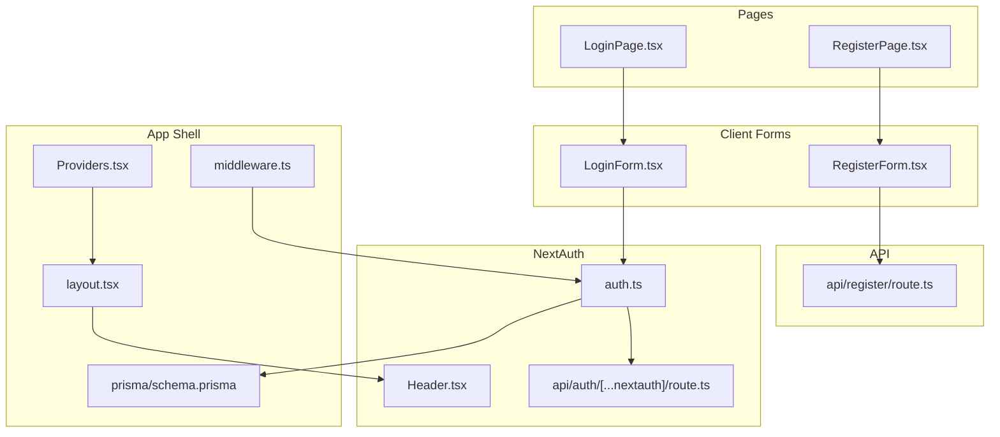
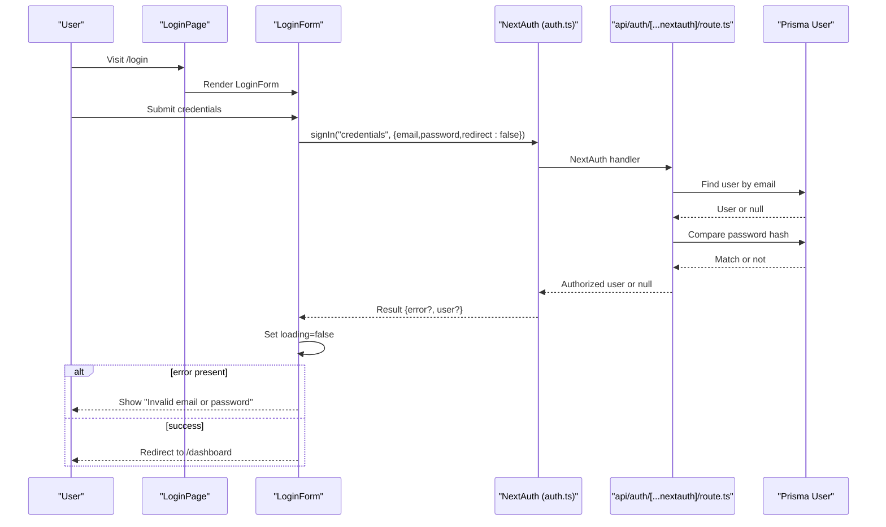
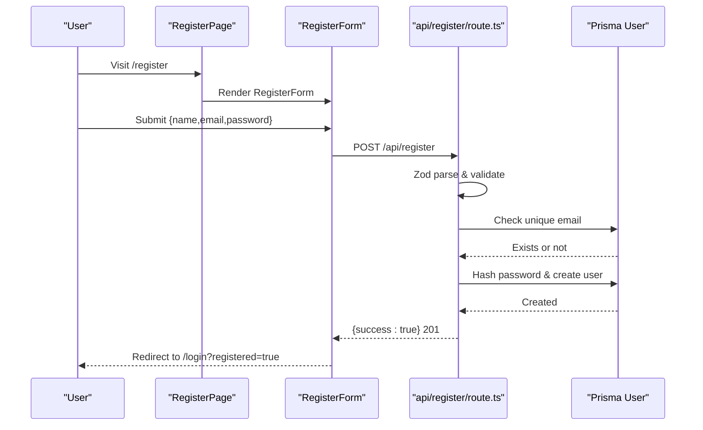
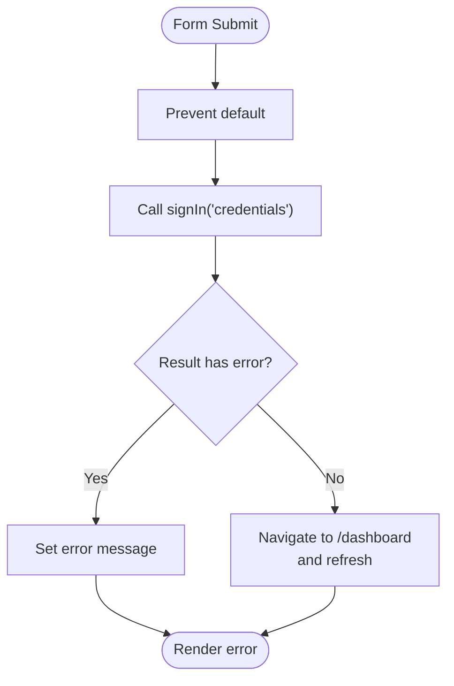
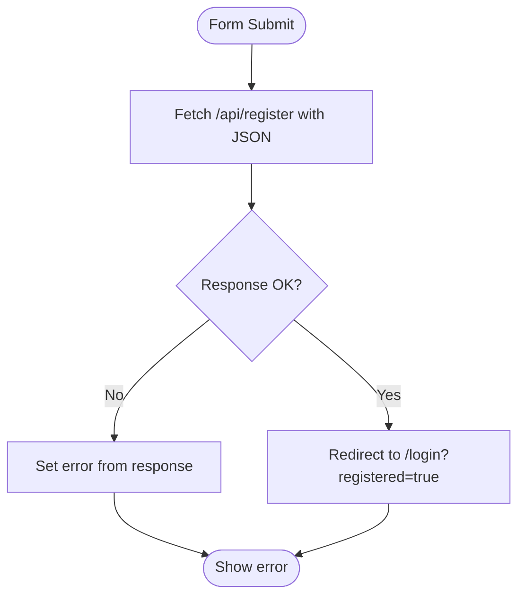
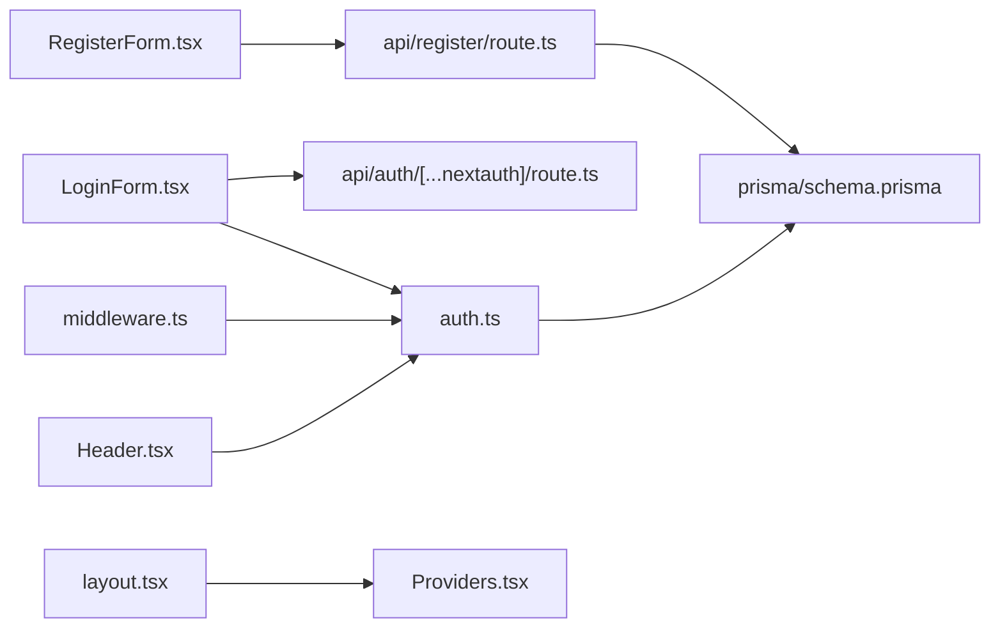

# Authentication Components

<cite>
**Referenced Files in This Document**
- [LoginForm.tsx](file://src/components/auth/LoginForm.tsx)
- [RegisterForm.tsx](file://src/components/auth/RegisterForm.tsx)
- [LoginPage.tsx](file://src/app/(auth)/login/page.tsx)
- [RegisterPage.tsx](file://src/app/(auth)/register/page.tsx)
- [auth.ts](file://src/auth.ts)
- [Providers.tsx](file://src/components/Providers.tsx)
- [layout.tsx](file://src/app/layout.tsx)
- [Header.tsx](file://src/components/layout/Header.tsx)
- [middleware.ts](file://src/middleware.ts)
- [api.auth.nextauth.route.ts](file://src/app/api/auth/[...nextauth]/route.ts)
- [api.register.route.ts](file://src/app/api/register/route.ts)
- [prisma.schema](file://prisma/schema.prisma)
</cite>

## Table of Contents
1. [Introduction](#introduction)
2. [Project Structure](#project-structure)
3. [Core Components](#core-components)
4. [Architecture Overview](#architecture-overview)
5. [Detailed Component Analysis](#detailed-component-analysis)
6. [Dependency Analysis](#dependency-analysis)
7. [Performance Considerations](#performance-considerations)
8. [Security and Accessibility](#security-and-accessibility)
9. [Troubleshooting Guide](#troubleshooting-guide)
10. [Conclusion](#conclusion)

## Introduction
This document explains the authentication components in Titchybook Creator, focusing on the LoginForm and RegisterForm components, their validation and error handling, integration with NextAuth, and the surrounding infrastructure. It covers form submission patterns, state management, styling, accessibility, security considerations, and user experience patterns.

## Project Structure
Authentication spans client components, NextAuth configuration, API routes, and middleware protection. The key files are organized as follows:
- Client forms: LoginForm and RegisterForm
- Pages: Login and Register pages that render the forms
- NextAuth: Provider configuration, JWT/session callbacks, and pages
- API routes: NextAuth handler and registration endpoint
- Middleware: Route protection for protected areas
- Providers: SessionProvider wrapping the app

**Diagram sources**
- [LoginPage.tsx](file://src/app/(auth)/login/page.tsx#L1-L13)
- [RegisterPage.tsx](file://src/app/(auth)/register/page.tsx#L1-L13)
- [LoginForm.tsx:1-86](file://src/components/auth/LoginForm.tsx#L1-L86)
- [RegisterForm.tsx:1-107](file://src/components/auth/RegisterForm.tsx#L1-L107)
- [auth.ts:1-80](file://src/auth.ts#L1-L80)
- [api.auth.nextauth.route.ts:1-4](file://src/app/api/auth/[...nextauth]/route.ts#L1-L4)
- [api.register.route.ts:1-47](file://src/app/api/register/route.ts#L1-L47)
- [Providers.tsx:1-8](file://src/components/Providers.tsx#L1-L8)
- [layout.tsx:1-42](file://src/app/layout.tsx#L1-L42)
- [Header.tsx:1-69](file://src/components/layout/Header.tsx#L1-L69)
- [middleware.ts:1-6](file://src/middleware.ts#L1-L6)
- [prisma.schema:1-48](file://prisma/schema.prisma#L1-L48)

**Section sources**
- [LoginPage.tsx](file://src/app/(auth)/login/page.tsx#L1-L13)
- [RegisterPage.tsx](file://src/app/(auth)/register/page.tsx#L1-L13)
- [layout.tsx:1-42](file://src/app/layout.tsx#L1-L42)

## Core Components
- LoginForm: Handles email/password login via NextAuth credentials provider. Manages local loading/error states and redirects on success.
- RegisterForm: Submits new user registration to a server endpoint, validates inputs, and navigates to login after successful registration.

Key behaviors:
- Form state: email, password, optional name, loading, and error messages.
- Validation: client-side required fields; server-side Zod validation for registration.
- Error handling: displays user-friendly messages and disables submit during requests.
- Navigation: redirects to dashboard on login success; to login with a flag on registration success.

**Section sources**
- [LoginForm.tsx:1-86](file://src/components/auth/LoginForm.tsx#L1-L86)
- [RegisterForm.tsx:1-107](file://src/components/auth/RegisterForm.tsx#L1-L107)

## Architecture Overview
The authentication flow integrates client-side forms with NextAuth and server endpoints:

**Diagram sources**
- [LoginPage.tsx](file://src/app/(auth)/login/page.tsx#L1-L13)
- [LoginForm.tsx:14-33](file://src/components/auth/LoginForm.tsx#L14-L33)
- [auth.ts:27-79](file://src/auth.ts#L27-L79)
- [api.auth.nextauth.route.ts:1-4](file://src/app/api/auth/[...nextauth]/route.ts#L1-L4)
- [prisma.schema:10-19](file://prisma/schema.prisma#L10-L19)

**Diagram sources**
- [RegisterPage.tsx](file://src/app/(auth)/register/page.tsx#L1-L13)
- [RegisterForm.tsx:14-39](file://src/components/auth/RegisterForm.tsx#L14-L39)
- [api.register.route.ts:12-46](file://src/app/api/register/route.ts#L12-L46)
- [prisma.schema:10-19](file://prisma/schema.prisma#L10-L19)

## Detailed Component Analysis

### LoginForm Component
Purpose:
- Authenticate users with email and password using NextAuth credentials provider.
- Provide immediate feedback on invalid credentials and manage loading states.

Implementation highlights:
- State management: email, password, error message, and loading flag.
- Submission handler:
  - Prevents default form submission.
  - Calls NextAuth signIn with credentials provider and redirect disabled.
  - On error, sets a generic invalid credential message.
  - On success, navigates to the dashboard and refreshes the route.
- UI:
  - Required email and password inputs.
  - Disabled submit button while loading.
  - Inline error banner.
  - Link to registration page.

Props and events:
- No incoming props.
- Uses form onSubmit handler internally.

Styling and accessibility:
- Tailwind classes for responsive layout and focus rings.
- Proper labels and placeholders.
- Accessible button states (disabled during loading).

Validation and error handling:
- Client-side: required fields enforced by HTML attributes.
- Server-side: NextAuth authorize function validates credentials against hashed passwords.

Integration with NextAuth:
- Uses signIn with credentials provider configured in auth.ts.
- Redirects handled client-side after NextAuth resolves.

Usage example:
- Place LoginForm inside a centered layout container.
- Ensure SessionProvider is mounted at the app root.

**Section sources**
- [LoginForm.tsx:1-86](file://src/components/auth/LoginForm.tsx#L1-L86)
- [auth.ts:27-79](file://src/auth.ts#L27-L79)
- [api.auth.nextauth.route.ts:1-4](file://src/app/api/auth/[...nextauth]/route.ts#L1-L4)

**Diagram sources**
- [LoginForm.tsx:14-33](file://src/components/auth/LoginForm.tsx#L14-L33)

### RegisterForm Component
Purpose:
- Allow new users to register by submitting name, email, and password.
- Validate inputs on the client and delegate robust validation to the server.

Implementation highlights:
- State management: name, email, password, error message, and loading flag.
- Submission handler:
  - Prevents default form submission.
  - Sends JSON payload to /api/register.
  - Parses response and sets error on non-OK status.
  - Redirects to login with a success indicator on success.
- UI:
  - Required name, email, and password inputs.
  - Enforces minimum length for password.
  - Disabled submit button while loading.
  - Inline error banner.
  - Link to login page.

Server-side validation:
- Zod schema enforces:
  - Non-empty name.
  - Valid email format.
  - Minimum 8-character password.
- Duplicate email detection and bcrypt hashing before persistence.

Usage example:
- Place RegisterForm inside a centered layout container.
- After successful registration, the login page can read the registered query parameter to inform the user.

**Section sources**
- [RegisterForm.tsx:1-107](file://src/components/auth/RegisterForm.tsx#L1-L107)
- [api.register.route.ts:6-46](file://src/app/api/register/route.ts#L6-L46)

**Diagram sources**
- [RegisterForm.tsx:14-39](file://src/components/auth/RegisterForm.tsx#L14-L39)
- [api.register.route.ts:12-46](file://src/app/api/register/route.ts#L12-L46)

### NextAuth Integration
Configuration:
- Credentials provider with authorize function:
  - Validates presence of email and password.
  - Loads user by email from Prisma.
  - Compares password hash using bcrypt.
  - Returns user object with id, email, name, and role on success.
- Session strategy: JWT with custom id and role stored in token and session callbacks.
- Pages: SignIn page mapped to /login.
- Handlers: Exposed via api/auth/[...nextauth]/route.ts.

Protected routes:
- Middleware protects dashboard, create, and admin routes.
- Uses NextAuth auth wrapper to enforce session checks.

**Section sources**
- [auth.ts:27-79](file://src/auth.ts#L27-L79)
- [api.auth.nextauth.route.ts:1-4](file://src/app/api/auth/[...nextauth]/route.ts#L1-L4)
- [middleware.ts:1-6](file://src/middleware.ts#L1-L6)
- [prisma.schema:10-19](file://prisma/schema.prisma#L10-L19)

### Authentication State Management and UI
- Providers: SessionProvider wraps the app to enable useSession in client components.
- Header: Displays navigation links and user info when authenticated; shows sign-in/register otherwise.
- Logout: Uses signOut with a callbackUrl to return to home.

**Section sources**
- [Providers.tsx:1-8](file://src/components/Providers.tsx#L1-L8)
- [layout.tsx:33-37](file://src/app/layout.tsx#L33-L37)
- [Header.tsx:1-69](file://src/components/layout/Header.tsx#L1-L69)

## Dependency Analysis
- LoginForm depends on:
  - next-auth/react for signIn.
  - next/navigation for client-side routing.
  - NextAuth credentials provider and handlers.
- RegisterForm depends on:
  - Next.js fetch API to call /api/register.
  - Zod schema for validation.
  - Prisma user model for uniqueness and persistence.
- NextAuth depends on:
  - Prisma user model for authorization.
  - bcrypt for password comparison.
- Middleware depends on NextAuth auth wrapper to protect routes.

**Diagram sources**
- [LoginForm.tsx:1-86](file://src/components/auth/LoginForm.tsx#L1-L86)
- [RegisterForm.tsx:1-107](file://src/components/auth/RegisterForm.tsx#L1-L107)
- [auth.ts:1-80](file://src/auth.ts#L1-L80)
- [api.auth.nextauth.route.ts:1-4](file://src/app/api/auth/[...nextauth]/route.ts#L1-L4)
- [api.register.route.ts:1-47](file://src/app/api/register/route.ts#L1-L47)
- [prisma.schema:1-48](file://prisma/schema.prisma#L1-L48)
- [middleware.ts:1-6](file://src/middleware.ts#L1-L6)
- [Header.tsx:1-69](file://src/components/layout/Header.tsx#L1-L69)
- [layout.tsx:1-42](file://src/app/layout.tsx#L1-L42)
- [Providers.tsx:1-8](file://src/components/Providers.tsx#L1-L8)

**Section sources**
- [LoginForm.tsx:1-86](file://src/components/auth/LoginForm.tsx#L1-L86)
- [RegisterForm.tsx:1-107](file://src/components/auth/RegisterForm.tsx#L1-L107)
- [auth.ts:1-80](file://src/auth.ts#L1-L80)
- [api.register.route.ts:1-47](file://src/app/api/register/route.ts#L1-L47)
- [prisma.schema:1-48](file://prisma/schema.prisma#L1-L48)

## Performance Considerations
- Client-side validation reduces unnecessary network requests.
- Loading states prevent duplicate submissions and improve perceived responsiveness.
- NextAuth JWT strategy avoids frequent database lookups for session data.
- Middleware protects protected routes efficiently without per-request overhead.

## Security and Accessibility
Security:
- Password hashing with bcrypt on registration.
- Zod validation on the server prevents malformed payloads.
- Unique email constraint prevents duplicate accounts.
- NextAuth handles secure session tokens and CSRF protection.

Accessibility:
- Proper labels and placeholders for inputs.
- Focus-visible rings for keyboard navigation.
- Disabled button states communicate loading states clearly.
- Semantic markup and readable error messages.

## Troubleshooting Guide
Common issues and resolutions:
- Login fails with invalid credentials:
  - Verify email and password match a registered user.
  - Check that the user’s password hash matches the provided password.
- Registration errors:
  - Ensure name is provided, email is valid, and password is at least 8 characters.
  - Confirm the email is not already registered.
- Protected route access denied:
  - Ensure the user is signed in and the session is active.
  - Verify middleware matcher configuration and route paths.

**Section sources**
- [LoginForm.tsx:27-32](file://src/components/auth/LoginForm.tsx#L27-L32)
- [RegisterForm.tsx:28-38](file://src/components/auth/RegisterForm.tsx#L28-L38)
- [api.register.route.ts:17-32](file://src/app/api/register/route.ts#L17-L32)
- [middleware.ts:3-5](file://src/middleware.ts#L3-L5)

## Conclusion
The authentication system combines client-side forms with NextAuth and server endpoints to deliver a secure and user-friendly login and registration experience. LoginForm and RegisterForm encapsulate validation, error handling, and navigation, while NextAuth manages sessions and protected routes. Together, they provide a robust foundation for user authentication in Titchybook Creator.