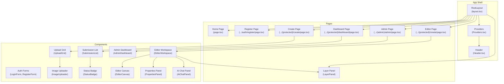
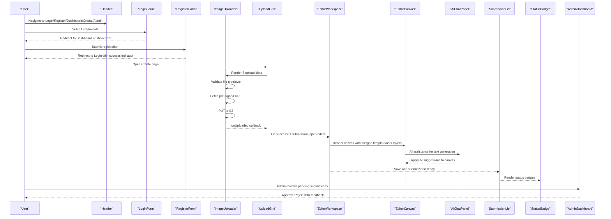
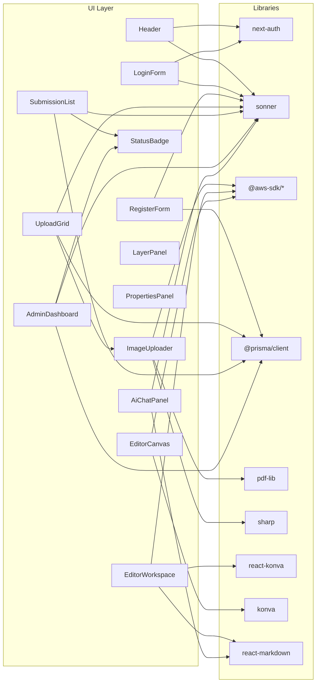

# Component Library

<cite>
**Referenced Files in This Document**
- [Header.tsx](file://src/components/layout/Header.tsx)
- [Providers.tsx](file://src/components/Providers.tsx)
- [layout.tsx](file://src/app/layout.tsx)
- [page.tsx](file://src/app/page.tsx)
- [LoginForm.tsx](file://src/components/auth/LoginForm.tsx)
- [RegisterForm.tsx](file://src/components/auth/RegisterForm.tsx)
- [ImageUploader.tsx](file://src/components/create/ImageUploader.tsx)
- [UploadGrid.tsx](file://src/components/create/UploadGrid.tsx)
- [SubmissionList.tsx](file://src/components/submissions/SubmissionList.tsx)
- [StatusBadge.tsx](file://src/components/submissions/StatusBadge.tsx)
- [AdminDashboard.tsx](file://src/components/admin/AdminDashboard.tsx)
- [EditorWorkspace.tsx](file://src/components/editor/EditorWorkspace.tsx)
- [EditorCanvas.tsx](file://src/components/editor/EditorCanvas.tsx)
- [LayerPanel.tsx](file://src/components/editor/LayerPanel.tsx)
- [PropertiesPanel.tsx](file://src/components/editor/PropertiesPanel.tsx)
- [AiChatPanel.tsx](file://src/components/editor/AiChatPanel.tsx)
- [constants.ts](file://src/lib/constants.ts)
- [package.json](file://package.json)
</cite>

## Update Summary
**Changes Made**
- Added comprehensive documentation for the new sophisticated editor component ecosystem
- Documented EditorWorkspace, EditorCanvas, LayerPanel, PropertiesPanel, and AiChatPanel components
- Added detailed coverage of the AI chat integration system
- Expanded component architecture to include advanced editor capabilities
- Updated dependency analysis to include editor-specific libraries
- Enhanced UI component documentation with editor-specific props and behaviors

## Table of Contents
1. [Introduction](#introduction)
2. [Project Structure](#project-structure)
3. [Core Components](#core-components)
4. [Architecture Overview](#architecture-overview)
5. [Detailed Component Analysis](#detailed-component-analysis)
6. [Editor Component Ecosystem](#editor-component-ecosystem)
7. [AI Integration System](#ai-integration-system)
8. [Dependency Analysis](#dependency-analysis)
9. [Performance Considerations](#performance-considerations)
10. [Troubleshooting Guide](#troubleshooting-guide)
11. [Conclusion](#conclusion)
12. [Appendices](#appendices)

## Introduction
This document describes the React component library used in Titchybook Creator. It focuses on layout components (header navigation, provider wrappers, and page structure), authentication components (login and registration forms, plus authentication state management), upload components (image uploader, upload grid, and validation displays), submission management components (listing, status display, and administrative controls), **editor components** (workspace, canvas, panels, and AI integration), and UI component documentation with props, events, styling options, and customization guidelines. It also provides usage examples, integration patterns, accessibility considerations, component composition, reusability, performance optimization, testing strategies, and development guidelines.

## Project Structure
The application is a Next.js app with a clear separation of concerns:
- App shell and providers are wired in the root layout.
- Layout components provide global navigation and session-aware UI.
- Feature-specific components live under dedicated folders (auth, create, submissions, admin, editor).
- Shared constants and types are centralized for reuse across components.

**Diagram sources**
- [layout.tsx:23-41](file://src/app/layout.tsx#L23-L41)
- [Providers.tsx:5-7](file://src/components/Providers.tsx#L5-L7)
- [Header.tsx:6-68](file://src/components/layout/Header.tsx#L6-L68)
- [UploadGrid.tsx:16-114](file://src/components/create/UploadGrid.tsx#L16-L114)
- [ImageUploader.tsx:12-147](file://src/components/create/ImageUploader.tsx#L12-L147)
- [SubmissionList.tsx:15-118](file://src/components/submissions/SubmissionList.tsx#L15-L118)
- [StatusBadge.tsx:1-17](file://src/components/submissions/StatusBadge.tsx#L1-L17)
- [AdminDashboard.tsx:21-167](file://src/components/admin/AdminDashboard.tsx#L21-L167)
- [EditorWorkspace.tsx:265-325](file://src/components/editor/EditorWorkspace.tsx#L265-L325)
- [EditorCanvas.tsx:33-44](file://src/components/editor/EditorCanvas.tsx#L33-L44)
- [LayerPanel.tsx:30-40](file://src/components/editor/LayerPanel.tsx#L30-L40)
- [PropertiesPanel.tsx:41-53](file://src/components/editor/PropertiesPanel.tsx#L41-L53)
- [AiChatPanel.tsx:31-36](file://src/components/editor/AiChatPanel.tsx#L31-L36)

**Section sources**
- [layout.tsx:23-41](file://src/app/layout.tsx#L23-L41)
- [page.tsx:3-60](file://src/app/page.tsx#L3-L60)

## Core Components
This section documents the foundational building blocks of the UI.

- Providers
  - Purpose: Wraps the app with NextAuth's session provider to enable session-aware components.
  - Props: children (ReactNode).
  - Behavior: Passes down session context to descendant components.
  - Accessibility: None by itself; ensures downstream components can read/use session state.
  - Customization: Wrap the app with this provider at the root.

- Header
  - Purpose: Renders the global navigation bar with branding, links, and session-dependent actions.
  - Behavior: Shows "Dashboard", "New Book", "Admin" (when role is ADMIN), user email, and "Sign out" when logged in; otherwise shows "Sign in" and "Register".
  - Accessibility: Uses semantic links and buttons; ensure keyboard navigation and screen reader compatibility via standard anchor/button semantics.
  - Customization: Adjust routes, roles, and styling classes to match brand guidelines.

- Root Layout
  - Purpose: Sets up fonts, providers, header, main content area, and toast notifications.
  - Behavior: Renders the Providers wrapper, Header, and children within a main container; integrates Sonner for toast notifications.
  - Accessibility: Ensures consistent typography and focus management; keep header landmarks and skip links if needed.

**Section sources**
- [Providers.tsx:5-7](file://src/components/Providers.tsx#L5-L7)
- [Header.tsx:6-68](file://src/components/layout/Header.tsx#L6-L68)
- [layout.tsx:23-41](file://src/app/layout.tsx#L23-L41)

## Architecture Overview
The component architecture follows a layered pattern:
- App shell (layout.tsx) composes Providers and Header.
- Feature pages render feature components.
- Authentication state is managed by NextAuth and exposed via hooks.
- Upload components coordinate with serverless APIs to obtain pre-signed URLs and upload images directly to S3.
- Submission components fetch and display user submissions; admin components manage submissions.
- **Editor components provide a sophisticated canvas-based editing experience with real-time collaboration, AI assistance, and template system integration.**

**Diagram sources**
- [Header.tsx:6-68](file://src/components/layout/Header.tsx#L6-L68)
- [LoginForm.tsx:7-85](file://src/components/auth/LoginForm.tsx#L7-L85)
- [RegisterForm.tsx:6-106](file://src/components/auth/RegisterForm.tsx#L6-L106)
- [ImageUploader.tsx:12-147](file://src/components/create/ImageUploader.tsx#L12-L147)
- [UploadGrid.tsx:16-114](file://src/components/create/UploadGrid.tsx#L16-L114)
- [EditorWorkspace.tsx:265-325](file://src/components/editor/EditorWorkspace.tsx#L265-L325)
- [EditorCanvas.tsx:33-44](file://src/components/editor/EditorCanvas.tsx#L33-L44)
- [AiChatPanel.tsx:31-36](file://src/components/editor/AiChatPanel.tsx#L31-L36)
- [SubmissionList.tsx:15-118](file://src/components/submissions/SubmissionList.tsx#L15-L118)
- [StatusBadge.tsx:1-17](file://src/components/submissions/StatusBadge.tsx#L1-L17)
- [AdminDashboard.tsx:21-167](file://src/components/admin/AdminDashboard.tsx#L21-L167)

## Detailed Component Analysis

### Authentication Components

#### LoginForm
- Purpose: Handles user login with credential-based authentication.
- Props: None.
- Events: Form submit triggers authentication.
- State:
  - Local form state: email, password.
  - Error and loading flags.
- Behavior:
  - Prevents default form submission.
  - Calls NextAuth signIn with credentials provider.
  - On success, redirects to dashboard; on failure, sets error message.
- Accessibility:
  - Proper labels and inputs.
  - Disabled button during loading.
- Styling and customization:
  - Tailwind utility classes applied; customize via className prop overrides.
- Integration patterns:
  - Place inside a page or modal; ensure Providers wrap the app.
- Testing strategies:
  - Unit test form rendering and state updates.
  - Mock NextAuth signIn and assert navigation/error behavior.

**Section sources**
- [LoginForm.tsx:7-85](file://src/components/auth/LoginForm.tsx#L7-L85)

#### RegisterForm
- Purpose: Registers new users by posting to the registration API.
- Props: None.
- Events: Form submit triggers registration.
- State:
  - Local form state: name, email, password.
  - Error and loading flags.
- Behavior:
  - Submits JSON payload to /api/register.
  - On success, navigates to login with a success indicator.
  - On error, displays user-friendly messages.
- Accessibility:
  - Required fields and minimum length enforced.
- Styling and customization:
  - Tailwind utility classes; adjust spacing and colors via className.
- Integration patterns:
  - Use within a registration page; ensure Providers present.
- Testing strategies:
  - Unit test form rendering and state updates.
  - Mock fetch response and assert navigation and error handling.

**Section sources**
- [RegisterForm.tsx:6-106](file://src/components/auth/RegisterForm.tsx#L6-L106)

### Upload Components

#### ImageUploader
- Purpose: Provides a single upload slot for a labeled page with drag-and-drop and preview.
- Props:
  - pageLabel: Page label type (from constants).
  - submissionId: Unique identifier for the submission.
  - onUploaded: Callback receiving pageLabel, S3 key, and original file.
- Events:
  - Drag-and-drop handlers.
  - Input change handler.
- State:
  - Preview URL, uploading flag, error message, drag-over state.
- Validation:
  - Accepts JPEG, PNG, WebP.
  - Enforces 10 MB limit.
- Behavior:
  - Generates preview via FileReader.
  - Requests a pre-signed URL from /api/upload/presign.
  - Uploads file directly to S3 via PUT.
  - Invokes onUploaded on success; sets error on failure.
- Accessibility:
  - Hidden input paired with visible drop zone; ensure focus styles and ARIA if extending.
- Styling and customization:
  - Tailwind classes define appearance; override via className.
- Integration patterns:
  - Render multiple instances per page label in UploadGrid.
- Performance considerations:
  - Avoid unnecessary renders by memoizing callbacks.
  - Debounce drag-over state if needed.
- Testing strategies:
  - Unit test validation, preview generation, and upload flow.
  - Mock fetch for pre-signed URL and S3 upload.

**Section sources**
- [ImageUploader.tsx:6-147](file://src/components/create/ImageUploader.tsx#L6-L147)
- [constants.ts:18-48](file://src/lib/constants.ts#L18-L48)

#### UploadGrid
- Purpose: Orchestrates 8 ImageUploader instances, tracks uploads, and submits the batch.
- Props: None.
- State:
  - Map of uploaded images keyed by page label.
  - Submitting flag.
- Behavior:
  - Generates a unique submissionId.
  - Collects uploaded images and posts to /api/submissions.
  - Navigates to dashboard on success; shows toasts for success/failure.
- Accessibility:
  - Clear status indicators and button states.
- Styling and customization:
  - Grid layout and button styles; adjust spacing and colors.
- Integration patterns:
  - Render on the create page; wire with ImageUploader instances.
- Performance considerations:
  - Memoize handleUploaded to prevent re-renders.
  - Debounce submission until all 8 uploads are present.
- Testing strategies:
  - Unit test upload collection and submission flow.
  - Mock fetch for submission endpoint.

**Section sources**
- [UploadGrid.tsx:16-114](file://src/components/create/UploadGrid.tsx#L16-L114)

### Submission Management Components

#### SubmissionList
- Purpose: Lists user submissions with status, creation date, and actions.
- Props: None.
- State:
  - Submissions array and loading flag.
- Behavior:
  - Fetches submissions from /api/submissions.
  - Renders cards with StatusBadge and action buttons (download, re-upload).
  - Shows empty state and loading skeletons.
- Accessibility:
  - Semantic list and buttons; ensure keyboard navigation.
- Styling and customization:
  - Card layout and badge styles; adjust colors and spacing.
- Integration patterns:
  - Render on the dashboard page.
- Performance considerations:
  - Skeleton loaders reduce perceived latency.
- Testing strategies:
  - Unit test rendering and action handlers.
  - Mock fetch for submissions endpoint.

**Section sources**
- [SubmissionList.tsx:15-118](file://src/components/submissions/SubmissionList.tsx#L15-L118)

#### StatusBadge
- Purpose: Visual indicator for submission status.
- Props:
  - status: Submission status string.
- Behavior:
  - Applies color classes based on status (PENDING, APPROVED, REJECTED).
- Accessibility:
  - Minimal; ensure sufficient color contrast.
- Styling and customization:
  - Override classes via className prop.
- Integration patterns:
  - Used within SubmissionList and AdminDashboard.

**Section sources**
- [StatusBadge.tsx:1-17](file://src/components/submissions/StatusBadge.tsx#L1-L17)

#### AdminDashboard
- Purpose: Allows administrators to review and approve/reject submissions.
- Props: None.
- State:
  - Submissions array, loading flag, filter, refresh key.
- Behavior:
  - Filters submissions by status.
  - Approves or rejects with optional rejection reason.
  - Refreshes list after actions.
- Accessibility:
  - Buttons and table structure; ensure keyboard navigation.
- Styling and customization:
  - Table and button styles; adjust colors and spacing.
- Integration patterns:
  - Render on the admin page.
- Performance considerations:
  - Cancelable fetch in effect to avoid state updates after unmount.
- Testing strategies:
  - Unit test filtering, approval/rejection actions, and toast feedback.

**Section sources**
- [AdminDashboard.tsx:21-167](file://src/components/admin/AdminDashboard.tsx#L21-L167)

### UI Component Documentation

#### Header
- Props: None.
- Accessibility: Links and buttons are keyboard accessible; ensure focus outlines.
- Styling: Tailwind classes; customize via className.
- Composition: Intended to be rendered at the top of the app shell.

**Section sources**
- [Header.tsx:6-68](file://src/components/layout/Header.tsx#L6-L68)

#### Providers
- Props: children.
- Accessibility: None; ensures session availability.
- Styling: None.

**Section sources**
- [Providers.tsx:5-7](file://src/components/Providers.tsx#L5-L7)

#### Root Layout
- Props: children.
- Accessibility: Consistent typography and landmark structure.
- Styling: Font variables and base styles.

**Section sources**
- [layout.tsx:23-41](file://src/app/layout.tsx#L23-L41)

### Usage Examples and Integration Patterns
- Authentication:
  - Wrap the app with Providers at the root.
  - Use LoginForm and RegisterForm on their respective pages.
  - Use Header for navigation and session-aware actions.
- Upload:
  - Render UploadGrid on the create page.
  - Compose multiple ImageUploader instances per page label.
- Submissions:
  - Render SubmissionList on the dashboard.
  - Use StatusBadge for status indicators.
- Admin:
  - Render AdminDashboard for reviewing submissions.
- **Editor:**
  - **Render EditorWorkspace as the main editor interface.**
  - **Use EditorCanvas for the interactive drawing surface.**
  - **Integrate LayerPanel and PropertiesPanel for element manipulation.**
  - **Embed AiChatPanel for AI-powered content generation.**

### Accessibility Considerations
- Ensure labels are associated with inputs.
- Provide keyboard navigation for interactive elements.
- Maintain sufficient color contrast for status badges.
- Use semantic HTML (buttons, links, tables).
- Add ARIA attributes if extending components (e.g., aria-describedby for validation messages).
- **For editor components, ensure canvas elements are keyboard accessible and screen reader friendly.**

### Component Composition and Reusability
- Centralize shared constants (page labels, statuses) for type-safe composition.
- Keep components small and focused; pass data and callbacks via props.
- Encapsulate side effects (fetch, uploads) in components to improve testability.
- **Use composition patterns for complex editor workflows combining multiple specialized panels.**

### Performance Optimization
- Prefer server-side rendering for static content; keep interactive components client-side.
- Use memoization for expensive callbacks and derived data.
- Lazy-load heavy assets or components when appropriate.
- Optimize network requests: batch submissions, cache pre-signed URLs, and abort on unmount.
- Minimize layout thrashing by avoiding synchronous reads of computed styles.
- **For editor components, implement debounced saving and efficient canvas rendering.**

## Editor Component Ecosystem

### EditorWorkspace
**Updated** Major addition of sophisticated editor workspace component

The EditorWorkspace serves as the main orchestrator for the Titchybook editor, managing state, templates, assets, and AI integration.

- Purpose: Main editor container that manages the complete editing workflow.
- Props:
  - submissionId?: string (optional submission identifier)
  - forceNew?: boolean (force creation of new draft)
- State Management:
  - Loading states and messages
  - Submission data with pages and assets
  - Active page selection and element selection
  - Save states (idle, saving, saved, error)
  - Template system integration
  - AI chat panel visibility
  - Undo/redo history
- Features:
  - Real-time draft creation and persistence
  - Template merging with user modifications
  - Asset library management
  - Keyboard shortcuts (Ctrl/Cmd+Z for undo/redo)
  - Thumbnail generation for page previews
  - AI-powered text suggestions
  - Template detachment for full customization
- Integration:
  - Dynamic imports EditorCanvas for performance
  - Manages EditorCanvas, LayerPanel, PropertiesPanel, and AiChatPanel
  - Coordinates with backend APIs for saving and submitting

**Section sources**
- [EditorWorkspace.tsx:265-325](file://src/components/editor/EditorWorkspace.tsx#L265-L325)
- [EditorWorkspace.tsx:398-712](file://src/components/editor/EditorWorkspace.tsx#L398-L712)
- [EditorWorkspace.tsx:869-974](file://src/components/editor/EditorWorkspace.tsx#L869-L974)

### EditorCanvas
**Updated** Added comprehensive canvas component documentation

The EditorCanvas provides the interactive drawing surface with advanced editing capabilities.

- Purpose: Interactive canvas for creating and editing book pages.
- Props:
  - scene: EditorScene (current page scene data)
  - assets: CanvasAsset[] (available assets)
  - selectedElementId: string | null (currently selected element)
  - onSelectElement: (id) => void (element selection handler)
  - onSceneChange: (scene) => void (scene modification handler)
  - pageLabel?: PageLabel (current page identifier)
  - templateElementIds?: Set<string> (template element identifiers)
  - templateTextElementIds?: Set<string> (editable template text elements)
  - isInstanceMode?: boolean (template instance vs template editing)
- Rendering:
  - Supports text, image, and shape elements
  - Real-time transformation with Konva.js
  - Template layer rendering with proper interaction restrictions
  - Image cropping overlay with pan/zoom controls
- Interactions:
  - Drag-and-drop element positioning
  - Transform handles for resizing and rotating
  - Double-click to enter crop mode for images
  - Keyboard shortcuts for element operations
- Performance:
  - Efficient element rendering with proper z-index ordering
  - Canvas-based thumbnail generation
  - Optimized image loading with cross-origin support

**Section sources**
- [EditorCanvas.tsx:33-44](file://src/components/editor/EditorCanvas.tsx#L33-L44)
- [EditorCanvas.tsx:69-296](file://src/components/editor/EditorCanvas.tsx#L69-L296)
- [EditorCanvas.tsx:298-501](file://src/components/editor/EditorCanvas.tsx#L298-L501)
- [EditorCanvas.tsx:503-694](file://src/components/editor/EditorCanvas.tsx#L503-L694)

### LayerPanel
**Updated** Added layer management component

The LayerPanel provides hierarchical control over page elements with template awareness.

- Purpose: Manage and organize page elements in z-order hierarchy.
- Props:
  - elements: EditorElement[] (user-created elements)
  - templateElements: EditorElement[] (template-provided elements)
  - selectedElementId: string | null (currently selected element)
  - onSelectElement: (id) => void (element selection handler)
  - onToggleVisibility: (id) => void (visibility toggle handler)
  - onToggleLock: (id) => void (lock toggle handler)
  - onDuplicateElement: (id) => void (duplicate handler)
  - onDeleteElement: (id) => void (delete handler)
  - isInstanceMode?: boolean (template instance mode)
- Features:
  - Separate sections for template elements and user elements
  - Visual distinction between element types (text, image, shape)
  - Template text elements with special handling
  - Z-index display and sorting
  - Action buttons for each element (show/hide, lock/unlock, copy, delete)
- Template Integration:
  - Shows template elements in locked state
  - Allows text editing for template text elements
  - Provides visual feedback for template vs user elements

**Section sources**
- [LayerPanel.tsx:30-40](file://src/components/editor/LayerPanel.tsx#L30-L40)
- [LayerPanel.tsx:41-53](file://src/components/editor/LayerPanel.tsx#L41-L53)
- [LayerPanel.tsx:71-141](file://src/components/editor/LayerPanel.tsx#L71-L141)
- [LayerPanel.tsx:143-207](file://src/components/editor/LayerPanel.tsx#L143-L207)

### PropertiesPanel
**Updated** Added comprehensive properties editing component

The PropertiesPanel provides detailed editing controls for selected elements with template-aware behavior.

- Purpose: Edit properties of selected elements with context-aware controls.
- Props:
  - selectedElement: RenderableEditorElement | null (currently selected element)
  - onChangeElement: (id, updater) => void (element property update handler)
  - onDeleteElement: (id) => void (delete handler)
  - onDuplicateElement: (id) => void (duplicate handler)
  - onToggleVisibility: (id) => void (visibility toggle handler)
  - onToggleLock: (id) => void (lock toggle handler)
  - onBringForward: (id) => void (bring forward handler)
  - onSendBackward: (id) => void (send backward handler)
  - isInstanceMode?: boolean (template instance mode)
  - templateTextOriginal?: string (original template text)
  - onResetTemplateText?: (id) => void (reset template text handler)
- Special Cases:
  - Template text elements: Only text content is editable, position/size/style locked
  - Template non-text elements: Fully locked, read-only display
  - No selection: General guidance for element selection
- Controls:
  - Position and dimension inputs (X, Y, Width, Height)
  - Rotation and opacity sliders
  - Visibility and lock toggles
  - Text-specific controls (font size, color, content)
  - Shape-specific controls (fill, stroke, stroke width)
  - Image-specific controls (crop zoom, focal point)
  - Element manipulation (duplicate, reorder, delete)

**Section sources**
- [PropertiesPanel.tsx:41-53](file://src/components/editor/PropertiesPanel.tsx#L41-L53)
- [PropertiesPanel.tsx:57-119](file://src/components/editor/PropertiesPanel.tsx#L57-L119)
- [PropertiesPanel.tsx:123-152](file://src/components/editor/PropertiesPanel.tsx#L123-L152)
- [PropertiesPanel.tsx:154-164](file://src/components/editor/PropertiesPanel.tsx#L154-L164)

### Usage Examples and Integration Patterns
- **Editor Integration:**
  - Import EditorWorkspace as the main editor component.
  - Pass submissionId for existing drafts or forceNew for fresh creation.
  - Use EditorCanvas as the core drawing surface within EditorWorkspace.
  - Integrate LayerPanel and PropertiesPanel for element management.
  - Embed AiChatPanel for AI-powered content assistance.
- **State Management:**
  - Handle scene changes through onSceneChange callbacks.
  - Manage element selections across panels.
  - Implement proper error handling for save operations.
- **Template Integration:**
  - Use isInstanceMode to distinguish between template editing and instance customization.
  - Handle template text overrides for per-instance customization.
  - Implement template detachment when needed.

## AI Integration System

### AiChatPanel
**Updated** Added comprehensive AI chat integration component

The AiChatPanel provides an integrated AI assistant for creative writing and content generation.

- Purpose: AI-powered content generation and editing assistance.
- Props:
  - isOpen: boolean (panel visibility state)
  - onToggle: () => void (panel toggle handler)
  - bookContext: BookContext (current editor state context)
  - onApplyText: (targetPage, text, style?) => void (apply suggestion handler)
- Features:
  - Real-time streaming responses from AI backend
  - Markdown rendering for AI responses
  - Interactive suggestion cards with apply functionality
  - Context-aware suggestions based on book content
  - Floating trigger button when collapsed
  - Auto-focus input when panel opens
- AI Integration:
  - Sends book context (title, active page, page content) to AI backend
  - Parses structured AI responses with suggestions
  - Supports multi-turn conversations with streaming
  - Handles AI errors and connection issues gracefully
- User Experience:
  - Smooth auto-scrolling to latest messages
  - Visual indicators for AI thinking and streaming
  - Clear chat history management
  - Responsive design with fixed positioning

**Section sources**
- [AiChatPanel.tsx:31-36](file://src/components/editor/AiChatPanel.tsx#L31-L36)
- [AiChatPanel.tsx:65-186](file://src/components/editor/AiChatPanel.tsx#L65-L186)
- [AiChatPanel.tsx:195-202](file://src/components/editor/AiChatPanel.tsx#L195-L202)
- [AiChatPanel.tsx:209-233](file://src/components/editor/AiChatPanel.tsx#L209-L233)

### AI Context System
**Updated** Added AI context building and management

The AI system builds contextual information from the current editor state to provide relevant suggestions.

- Context Building:
  - Title of the book
  - Currently active page label
  - Content snippets from all pages (up to 200 characters each)
  - Template text overrides for per-instance customizations
- Response Processing:
  - Parses structured AI responses with message and suggestions
  - Sanitizes AI-generated text for safe insertion
  - Supports styled suggestions with font and formatting preferences
- Integration Points:
  - Passes context to AI backend via /api/ai/chat endpoint
  - Handles SSE streaming responses for real-time interaction
  - Manages conversation state and error recovery

**Section sources**
- [AiChatPanel.tsx:372-396](file://src/components/editor/AiChatPanel.tsx#L372-L396)
- [AiChatPanel.tsx:108-121](file://src/components/editor/AiChatPanel.tsx#L108-L121)
- [AiChatPanel.tsx:164-170](file://src/components/editor/AiChatPanel.tsx#L164-L170)

### Usage Examples and Integration Patterns
- **AI Integration:**
  - Initialize AiChatPanel with EditorWorkspace context.
  - Handle onApplyText callbacks to insert AI suggestions into editor.
  - Manage AI panel visibility state alongside editor panels.
  - Implement proper error handling for AI service connectivity.
- **Context Management:**
  - Update bookContext when editor state changes.
  - Handle template text overrides in context building.
  - Manage conversation history for meaningful AI interactions.
- **User Experience:**
  - Provide clear visual feedback for AI processing states.
  - Implement suggestion cards with apply functionality.
  - Handle streaming responses smoothly without blocking UI.

## Dependency Analysis
External libraries and their roles:
- next-auth: Authentication state and session management.
- sonner: Toast notifications for user feedback.
- @aws-sdk: S3 operations (client and presigner) for uploads.
- @prisma/client: Database client.
- pdf-lib: PDF generation pipeline (referenced in package.json).
- sharp: Image processing pipeline (referenced in package.json).
- **react-konva: Canvas rendering and interactive graphics for editor.**
- **konva: 2D canvas library for element manipulation and transformations.**
- **react-markdown: Markdown rendering for AI responses and content display.**
- **@aws-sdk/client-s3: S3 operations for asset management and storage.**

**Diagram sources**
- [package.json:11-25](file://package.json#L11-L25)
- [Header.tsx:3](file://src/components/layout/Header.tsx#L3)
- [LoginForm.tsx:3](file://src/components/auth/LoginForm.tsx#L3)
- [ImageUploader.tsx:3](file://src/components/create/ImageUploader.tsx#L3)
- [UploadGrid.tsx:4](file://src/components/create/UploadGrid.tsx#L4)
- [SubmissionList.tsx:3](file://src/components/submissions/SubmissionList.tsx#L3)
- [AdminDashboard.tsx:3](file://src/components/admin/AdminDashboard.tsx#L3)
- [EditorWorkspace.tsx:3](file://src/components/editor/EditorWorkspace.tsx#L3)
- [EditorCanvas.tsx:3](file://src/components/editor/EditorCanvas.tsx#L3)
- [LayerPanel.tsx:3](file://src/components/editor/LayerPanel.tsx#L3)
- [PropertiesPanel.tsx:3](file://src/components/editor/PropertiesPanel.tsx#L3)
- [AiChatPanel.tsx:3](file://src/components/editor/AiChatPanel.tsx#L3)

**Section sources**
- [package.json:11-25](file://package.json#L11-L25)

## Performance Considerations
- Prefer server-side rendering for static content; keep interactive components client-side.
- Use memoization for expensive callbacks and derived data.
- Lazy-load heavy assets or components when appropriate.
- Optimize network requests: batch submissions, cache pre-signed URLs, and abort on unmount.
- Minimize layout thrashing by avoiding synchronous reads of computed styles.
- **For editor components, implement debounced saving (700ms for titles, 800ms for scenes) to reduce API calls.**
- **Use dynamic imports for EditorCanvas to improve initial page load performance.**
- **Implement efficient canvas rendering with proper element sorting and z-index management.**
- **Cache generated thumbnails and asset previews to avoid recomputation.**
- **Optimize AI response streaming with proper abort controllers to prevent memory leaks.**

## Troubleshooting Guide
- Authentication failures:
  - LoginForm displays a generic invalid credentials message; ensure credentials provider is configured and backend validates inputs.
- Registration errors:
  - RegisterForm shows user-friendly messages; verify /api/register endpoint and database constraints.
- Upload issues:
  - ImageUploader validates file type and size; confirm pre-signed URL endpoint and S3 permissions.
  - If uploads fail, check network tab and console logs for fetch errors.
- Submission list not updating:
  - AdminDashboard uses a refresh key to refetch; ensure PATCH actions update state and that the API responds correctly.
- Toast feedback:
  - Sonner is globally configured; verify toasts appear on success/failure paths.
- **Editor workspace issues:**
  - **EditorWorkspace shows loading states; check /api/submissions endpoints and template loading.**
  - **Canvas rendering problems: ensure react-konva and konva are properly imported and initialized.**
  - **LayerPanel shows empty state; verify element data is properly passed from EditorWorkspace.**
  - **PropertiesPanel shows locked state; check template mode and element permissions.**
- **AI integration problems:**
  - **AiChatPanel shows connection errors; verify /api/ai/chat endpoint and AI service availability.**
  - **Streaming responses fail; check SSE implementation and response parsing.**
  - **Suggestions not applying; ensure onApplyText callback is properly connected.**

**Section sources**
- [LoginForm.tsx:14-33](file://src/components/auth/LoginForm.tsx#L14-L33)
- [RegisterForm.tsx:14-39](file://src/components/auth/RegisterForm.tsx#L14-L39)
- [ImageUploader.tsx:22-73](file://src/components/create/ImageUploader.tsx#L22-L73)
- [UploadGrid.tsx:42-76](file://src/components/create/UploadGrid.tsx#L42-L76)
- [AdminDashboard.tsx:43-62](file://src/components/admin/AdminDashboard.tsx#L43-L62)
- [EditorWorkspace.tsx:398-457](file://src/components/editor/EditorWorkspace.tsx#L398-L457)
- [EditorCanvas.tsx:48-67](file://src/components/editor/EditorCanvas.tsx#L48-L67)
- [AiChatPanel.tsx:108-121](file://src/components/editor/AiChatPanel.tsx#L108-L121)

## Conclusion
The component library is structured around a clean separation of concerns: layout and providers at the root, feature components for authentication, uploads, submissions, administration, and **a sophisticated editor ecosystem**. The new editor components provide a comprehensive canvas-based editing experience with real-time collaboration, AI assistance, template integration, and advanced element manipulation. Components are designed to be reusable, accessible, and testable, with clear integration patterns and performance-conscious behavior. Extending the library involves adding new components that follow these patterns and leveraging existing providers, utilities, and the new editor infrastructure.

## Appendices

### Props Reference Summary
- Header: none.
- Providers: children.
- LoginForm: none.
- RegisterForm: none.
- ImageUploader:
  - pageLabel: PageLabel
  - submissionId: string
  - onUploaded: (pageLabel, s3Key, file) => void
- UploadGrid: none.
- SubmissionList: none.
- StatusBadge: status: string.
- AdminDashboard: none.
- **EditorWorkspace:**
  - - submissionId?: string
  - - forceNew?: boolean
- **EditorCanvas:**
  - - scene: EditorScene
  - - assets: CanvasAsset[]
  - - selectedElementId: string | null
  - - onSelectElement: (id) => void
  - - onSceneChange: (scene) => void
  - - pageLabel?: PageLabel
  - - templateElementIds?: Set<string>
  - - templateTextElementIds?: Set<string>
  - - isInstanceMode?: boolean
- **LayerPanel:**
  - - elements: EditorElement[]
  - - templateElements: EditorElement[]
  - - selectedElementId: string | null
  - - onSelectElement: (id) => void
  - - onToggleVisibility: (id) => void
  - - onToggleLock: (id) => void
  - - onDuplicateElement: (id) => void
  - - onDeleteElement: (id) => void
  - - isInstanceMode?: boolean
- **PropertiesPanel:**
  - - selectedElement: RenderableEditorElement | null
  - - onChangeElement: (id, updater) => void
  - - onDeleteElement: (id) => void
  - - onDuplicateElement: (id) => void
  - - onToggleVisibility: (id) => void
  - - onToggleLock: (id) => void
  - - onBringForward: (id) => void
  - - onSendBackward: (id) => void
  - - isInstanceMode?: boolean
  - - templateTextOriginal?: string
  - - onResetTemplateText?: (id) => void
- **AiChatPanel:**
  - - isOpen: boolean
  - - onToggle: () => void
  - - bookContext: BookContext
  - - onApplyText: (targetPage, text, style?) => void

### Constants Reference
- SubmissionStatus enum and VALID_STATUSES.
- PAGE_LABELS and PAGE_LABEL_DISPLAY.
- ACCEPTED_IMAGE_TYPES and MAX_FILE_SIZE.

**Section sources**
- [constants.ts:6-48](file://src/lib/constants.ts#L6-L48)