# Design System & UI Components

<cite>
**Referenced Files in This Document**
- [globals.css](file://src/app/globals.css)
- [ErrorDisplay.tsx](file://src/components/ui/ErrorDisplay.tsx)
- [LoadingSkeleton.tsx](file://src/components/ui/LoadingSkeleton.tsx)
- [Header.tsx](file://src/components/layout/Header.tsx)
- [Providers.tsx](file://src/components/Providers.tsx)
- [EditorCanvas.tsx](file://src/components/editor/EditorCanvas.tsx)
- [PropertiesPanel.tsx](file://src/components/editor/PropertiesPanel.tsx)
- [LayerPanel.tsx](file://src/components/editor/LayerPanel.tsx)
- [ColorPicker.tsx](file://src/components/editor/ColorPicker.tsx)
- [StatusBadge.tsx](file://src/components/submissions/StatusBadge.tsx)
- [Hero.tsx](file://src/components/home/Hero.tsx)
- [LoginForm.tsx](file://src/components/auth/LoginForm.tsx)
- [ImageUploader.tsx](file://src/components/create/ImageUploader.tsx)
</cite>

## Table of Contents
1. [Introduction](#introduction)
2. [Project Structure](#project-structure)
3. [Core Components](#core-components)
4. [Architecture Overview](#architecture-overview)
5. [Detailed Component Analysis](#detailed-component-analysis)
6. [Dependency Analysis](#dependency-analysis)
7. [Performance Considerations](#performance-considerations)
8. [Troubleshooting Guide](#troubleshooting-guide)
9. [Conclusion](#conclusion)

## Introduction
This document describes the design system and UI components used across the application. It explains how tokens, shared styles, and reusable components form a consistent visual language and interaction model for pages, forms, editor surfaces, and feedback elements. The goal is to help developers and designers extend or adapt the UI while preserving consistency, accessibility, and performance.

## Project Structure
The design system is centered around:
- Global CSS tokens and base styles that define colors, typography, spacing, shadows, radii, transitions, and component primitives (buttons, cards, inputs, badges).
- Reusable UI primitives under src/components/ui for error states and loading skeletons.
- Layout and navigation via Header.
- Feature-specific panels and controls in src/components/editor, src/components/auth, src/components/home, and src/components/create.
- A minimal Providers wrapper to supply session context globally.

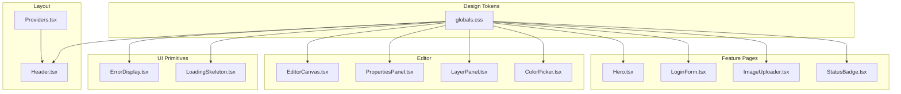

**Diagram sources**
- [globals.css:1-92](file://src/app/globals.css#L1-L92)
- [ErrorDisplay.tsx:1-56](file://src/components/ui/ErrorDisplay.tsx#L1-L56)
- [LoadingSkeleton.tsx:1-112](file://src/components/ui/LoadingSkeleton.tsx#L1-L112)
- [Header.tsx:1-296](file://src/components/layout/Header.tsx#L1-L296)
- [Providers.tsx:1-8](file://src/components/Providers.tsx#L1-L8)
- [EditorCanvas.tsx:1-800](file://src/components/editor/EditorCanvas.tsx#L1-L800)
- [PropertiesPanel.tsx:1-736](file://src/components/editor/PropertiesPanel.tsx#L1-L736)
- [LayerPanel.tsx:1-270](file://src/components/editor/LayerPanel.tsx#L1-L270)
- [ColorPicker.tsx:1-263](file://src/components/editor/ColorPicker.tsx#L1-L263)
- [Hero.tsx:1-84](file://src/components/home/Hero.tsx#L1-L84)
- [LoginForm.tsx:1-119](file://src/components/auth/LoginForm.tsx#L1-L119)
- [ImageUploader.tsx:1-184](file://src/components/create/ImageUploader.tsx#L1-L184)
- [StatusBadge.tsx:1-17](file://src/components/submissions/StatusBadge.tsx#L1-L17)

**Section sources**
- [globals.css:1-92](file://src/app/globals.css#L1-L92)
- [Header.tsx:1-296](file://src/components/layout/Header.tsx#L1-L296)
- [Providers.tsx:1-8](file://src/components/Providers.tsx#L1-L8)

## Core Components
- Design tokens and theme bridge: Centralized CSS variables for palette, surfaces, text, borders, semantic colors, shadows, typography, radius, and transitions. These are bridged into Tailwind’s theme so utilities can consume them consistently.
- Button system: Primary, secondary, outline, ghost, danger, success, with size variants and disabled states.
- Card system: Elevated surface with border, radius, shadow, and hover elevation.
- Input system: Consistent input styling with focus ring and label conventions.
- Badge system: Semantic status badges for draft, pending, approved, rejected, processing.
- Layout helpers: Page container, section labels, dividers.
- Toast overrides: Styled to match the warm editorial theme.

These primitives are consumed by feature components such as forms, editor panels, and page sections to ensure visual and behavioral consistency.

**Section sources**
- [globals.css:94-393](file://src/app/globals.css#L94-L393)

## Architecture Overview
The UI architecture layers are:
- Token layer: CSS variables define the brand and semantics.
- Primitive layer: Base classes for buttons, cards, inputs, badges, and layout helpers.
- Composition layer: Feature components compose primitives to build pages and complex interfaces.
- Context layer: Providers wrap the app to supply global state (e.g., NextAuth session).

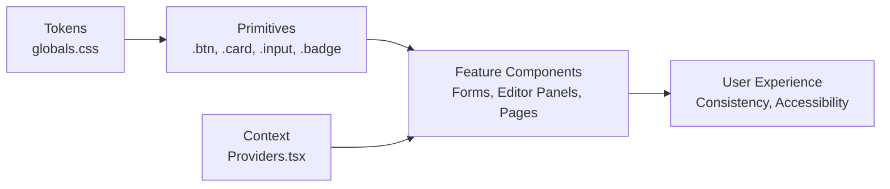

**Diagram sources**
- [globals.css:1-92](file://src/app/globals.css#L1-L92)
- [globals.css:136-393](file://src/app/globals.css#L136-L393)
- [Providers.tsx:1-8](file://src/components/Providers.tsx#L1-L8)

## Detailed Component Analysis

### Error Display
A client-side error view that uses design tokens for icon background, text color, and button styling. It provides a clear message and a “Try again” action wired to a reset callback.

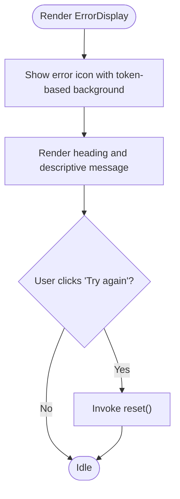

**Diagram sources**
- [ErrorDisplay.tsx:1-56](file://src/components/ui/ErrorDisplay.tsx#L1-L56)

**Section sources**
- [ErrorDisplay.tsx:1-56](file://src/components/ui/ErrorDisplay.tsx#L1-L56)

### Loading Skeletons
Reusable skeleton primitives for placeholder content during data loading. They use the pulse animation and token-driven backgrounds/borders. Variants include block, page header, card, list, grid, and detail card.

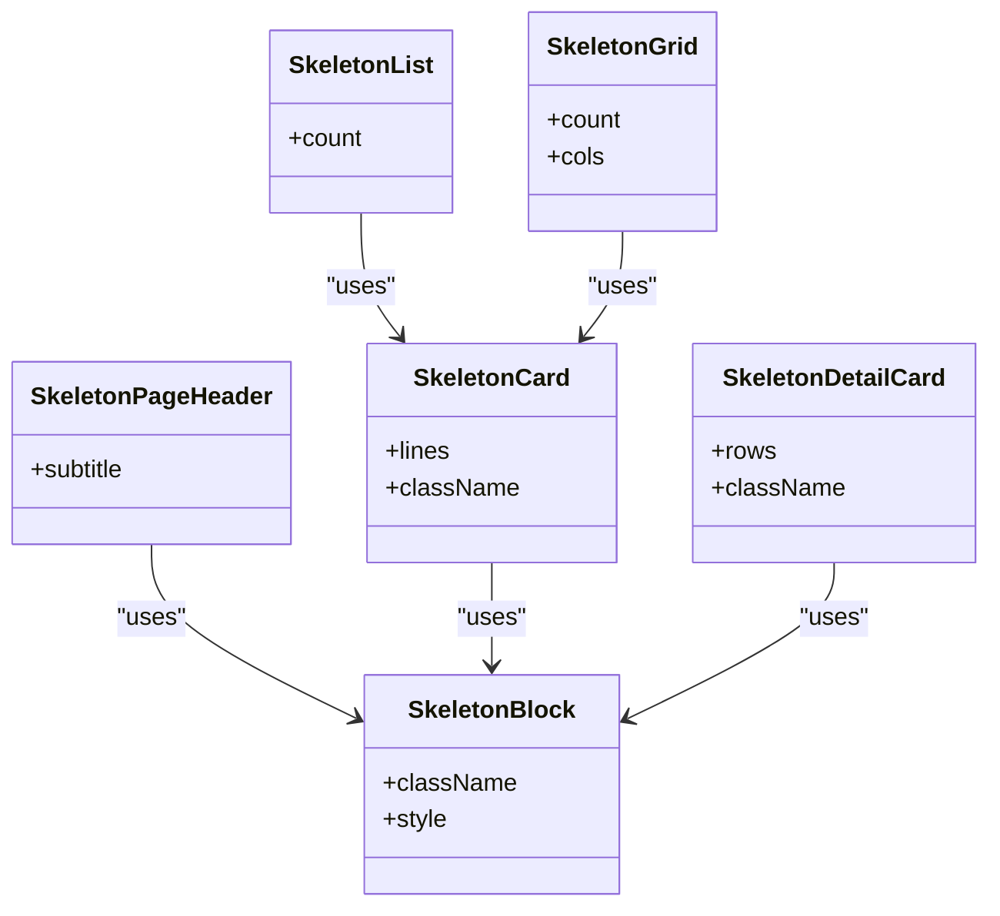

**Diagram sources**
- [LoadingSkeleton.tsx:1-112](file://src/components/ui/LoadingSkeleton.tsx#L1-L112)

**Section sources**
- [LoadingSkeleton.tsx:1-112](file://src/components/ui/LoadingSkeleton.tsx#L1-L112)

### Header and Navigation
Sticky header with responsive navigation, role-aware menu items, and sign-in/sign-out flows. Uses tokens for backdrop blur, borders, and interactive states. Includes mobile drawer toggling.

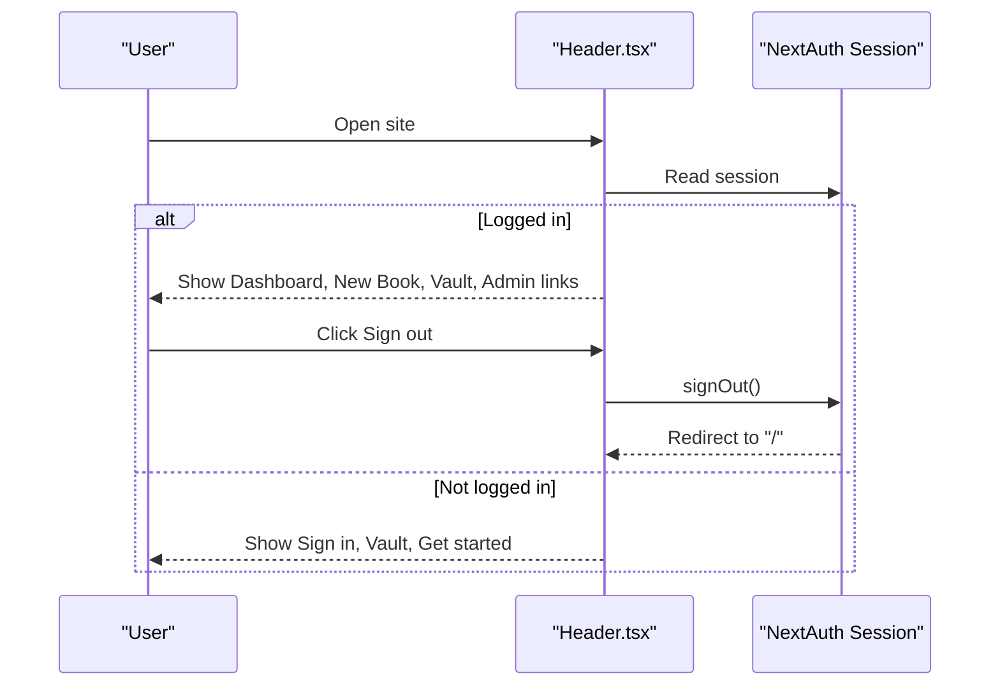

**Diagram sources**
- [Header.tsx:1-296](file://src/components/layout/Header.tsx#L1-L296)
- [Providers.tsx:1-8](file://src/components/Providers.tsx#L1-L8)

**Section sources**
- [Header.tsx:1-296](file://src/components/layout/Header.tsx#L1-L296)
- [Providers.tsx:1-8](file://src/components/Providers.tsx#L1-L8)

### Editor Canvas
A Konva-based canvas rendering images, text, and shapes with selection, dragging, resizing, rotation, cropping overlays, and template mode constraints. It coordinates element interactions and updates scene state.

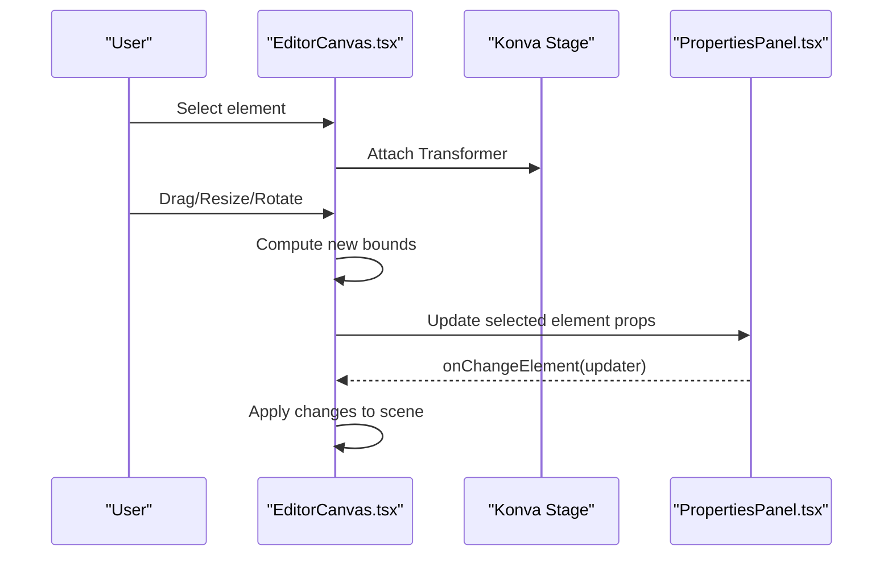

**Diagram sources**
- [EditorCanvas.tsx:1-800](file://src/components/editor/EditorCanvas.tsx#L1-L800)
- [PropertiesPanel.tsx:1-736](file://src/components/editor/PropertiesPanel.tsx#L1-L736)

**Section sources**
- [EditorCanvas.tsx:1-800](file://src/components/editor/EditorCanvas.tsx#L1-L800)

### Properties Panel
Controls for editing element properties including position, size, rotation, opacity, visibility, lock state, layer order, and type-specific options (text content, font size/color; shape fill/stroke; image crop/DPI indicator). Supports instance mode where template elements are locked except editable text.

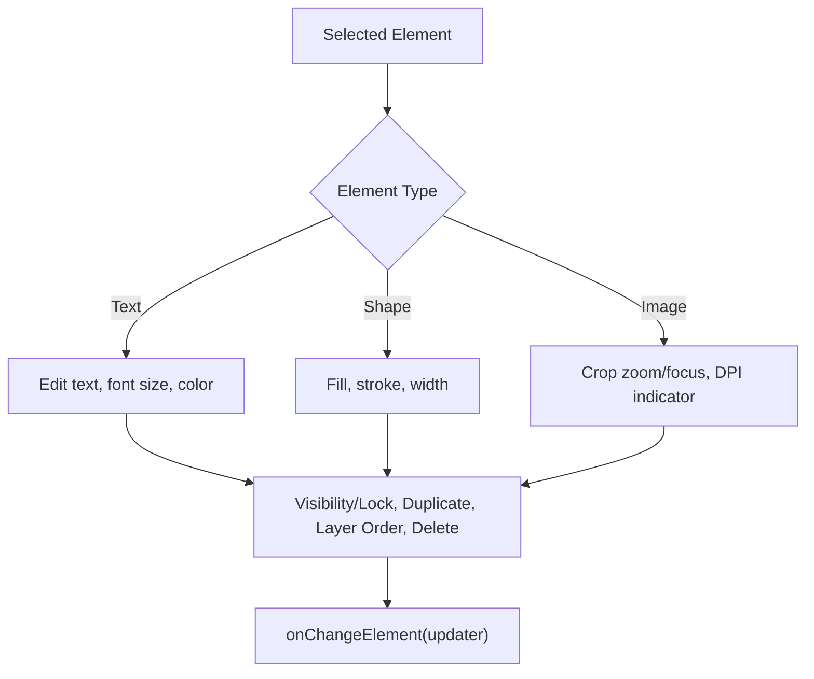

**Diagram sources**
- [PropertiesPanel.tsx:1-736](file://src/components/editor/PropertiesPanel.tsx#L1-L736)

**Section sources**
- [PropertiesPanel.tsx:1-736](file://src/components/editor/PropertiesPanel.tsx#L1-L736)

### Layer Panel
Displays ordered user and template elements with selection highlighting, visibility/lock toggles, duplication, and deletion. In instance mode, separates template vs user layers and indicates editable text capability.

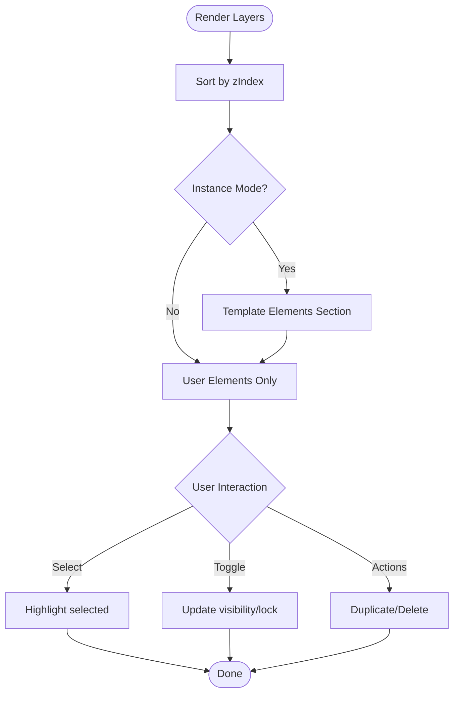

**Diagram sources**
- [LayerPanel.tsx:1-270](file://src/components/editor/LayerPanel.tsx#L1-L270)

**Section sources**
- [LayerPanel.tsx:1-270](file://src/components/editor/LayerPanel.tsx#L1-L270)

### Color Picker
Inline color picker with preset swatches, hex input validation, native color input, and optional transparent option. Normalizes color values and closes on outside click.

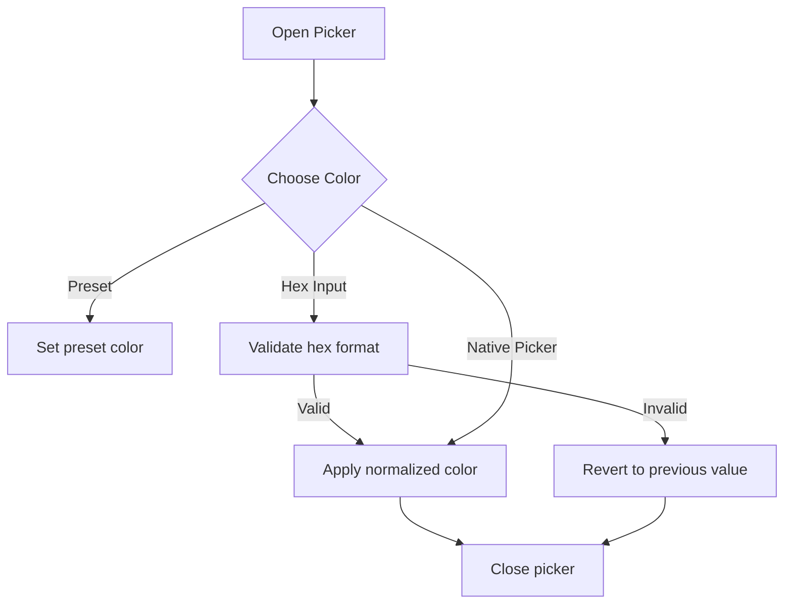

**Diagram sources**
- [ColorPicker.tsx:1-263](file://src/components/editor/ColorPicker.tsx#L1-L263)

**Section sources**
- [ColorPicker.tsx:1-263](file://src/components/editor/ColorPicker.tsx#L1-L263)

### Status Badge
Renders a semantic badge based on submission status using predefined style classes from the design system.

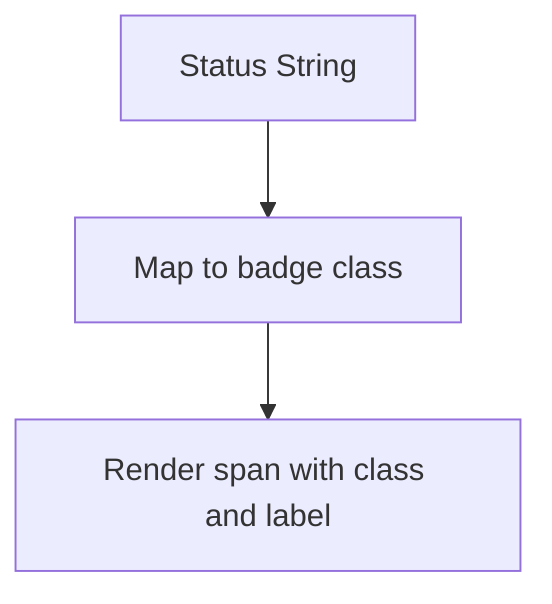

**Diagram sources**
- [StatusBadge.tsx:1-17](file://src/components/submissions/StatusBadge.tsx#L1-L17)

**Section sources**
- [StatusBadge.tsx:1-17](file://src/components/submissions/StatusBadge.tsx#L1-L17)

### Hero Section
Marketing hero using tokens for typography, colors, and spacing. Demonstrates composition of buttons and imagery within the design system.

**Section sources**
- [Hero.tsx:1-84](file://src/components/home/Hero.tsx#L1-L84)

### Login Form
Uses the input and button primitives, integrates toast notifications, and handles authentication flow with NextAuth.

**Section sources**
- [LoginForm.tsx:1-119](file://src/components/auth/LoginForm.tsx#L1-L119)

### Image Uploader
Drag-and-drop image upload with preview, file validation, presigned URL workflow, and toast feedback. Uses tokens for visual states (drag over, success, errors).

**Section sources**
- [ImageUploader.tsx:1-184](file://src/components/create/ImageUploader.tsx#L1-L184)

## Dependency Analysis
- All components rely on global tokens defined in globals.css for consistent appearance.
- Editor components depend on Konva primitives and internal editor utilities for geometry and validation.
- Header depends on NextAuth session context provided by Providers.
- Forms and uploads integrate with toast notifications and routing.

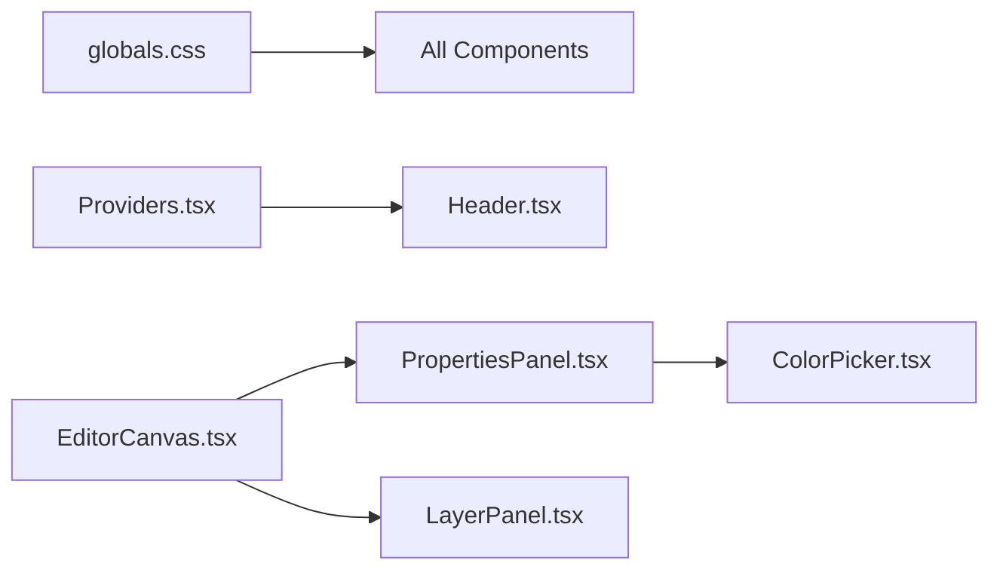

**Diagram sources**
- [globals.css:1-92](file://src/app/globals.css#L1-L92)
- [Providers.tsx:1-8](file://src/components/Providers.tsx#L1-L8)
- [EditorCanvas.tsx:1-800](file://src/components/editor/EditorCanvas.tsx#L1-L800)
- [PropertiesPanel.tsx:1-736](file://src/components/editor/PropertiesPanel.tsx#L1-L736)
- [LayerPanel.tsx:1-270](file://src/components/editor/LayerPanel.tsx#L1-L270)
- [ColorPicker.tsx:1-263](file://src/components/editor/ColorPicker.tsx#L1-L263)

**Section sources**
- [globals.css:1-92](file://src/app/globals.css#L1-L92)
- [Providers.tsx:1-8](file://src/components/Providers.tsx#L1-L8)
- [EditorCanvas.tsx:1-800](file://src/components/editor/EditorCanvas.tsx#L1-L800)
- [PropertiesPanel.tsx:1-736](file://src/components/editor/PropertiesPanel.tsx#L1-L736)
- [LayerPanel.tsx:1-270](file://src/components/editor/LayerPanel.tsx#L1-L270)
- [ColorPicker.tsx:1-263](file://src/components/editor/ColorPicker.tsx#L1-L263)

## Performance Considerations
- Use skeleton placeholders to reduce perceived load time during data fetching.
- Keep canvas interactions efficient by updating only necessary nodes and leveraging batch drawing.
- Prefer token-driven styles to minimize inline style churn and improve caching.
- Debounce heavy operations in editor panels if needed (e.g., real-time previews).
- Optimize image assets and use appropriate formats/sizes to maintain responsiveness.

[No sources needed since this section provides general guidance]

## Troubleshooting Guide
- Error display: Ensure the reset function is correctly bound to recover from error boundaries.
- Upload failures: Validate file types and sizes before upload; check presign endpoint responses and network errors.
- Editor state mismatches: Verify that property changes propagate back to the scene and that transformer bounds are enforced.
- Theme inconsistencies: Confirm that CSS variables are loaded and not overridden by conflicting styles.

**Section sources**
- [ErrorDisplay.tsx:1-56](file://src/components/ui/ErrorDisplay.tsx#L1-L56)
- [ImageUploader.tsx:1-184](file://src/components/create/ImageUploader.tsx#L1-L184)
- [EditorCanvas.tsx:1-800](file://src/components/editor/EditorCanvas.tsx#L1-L800)
- [globals.css:1-92](file://src/app/globals.css#L1-L92)

## Conclusion
The design system establishes a cohesive visual language through centralized tokens and reusable primitives, enabling consistent, accessible, and performant UI across pages and complex editor experiences. By composing these building blocks, teams can rapidly iterate while maintaining brand integrity and user experience quality.