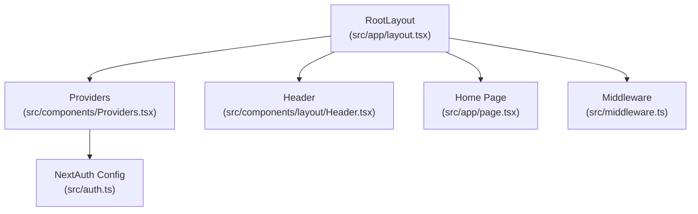
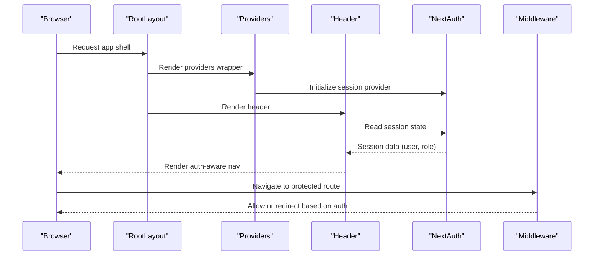
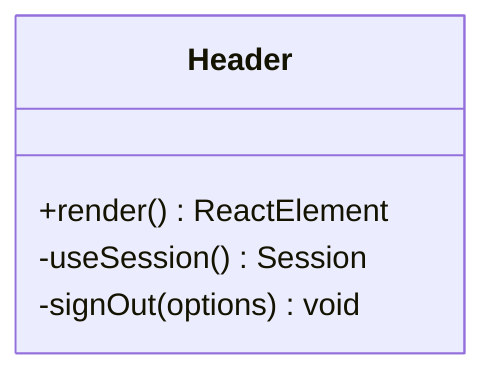
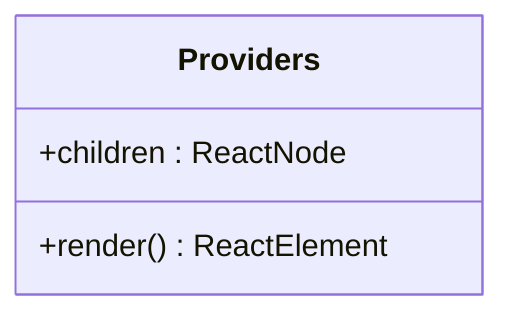
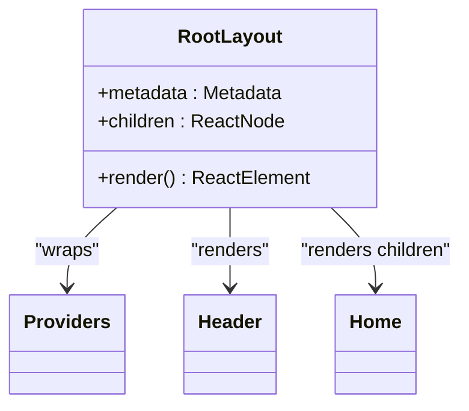
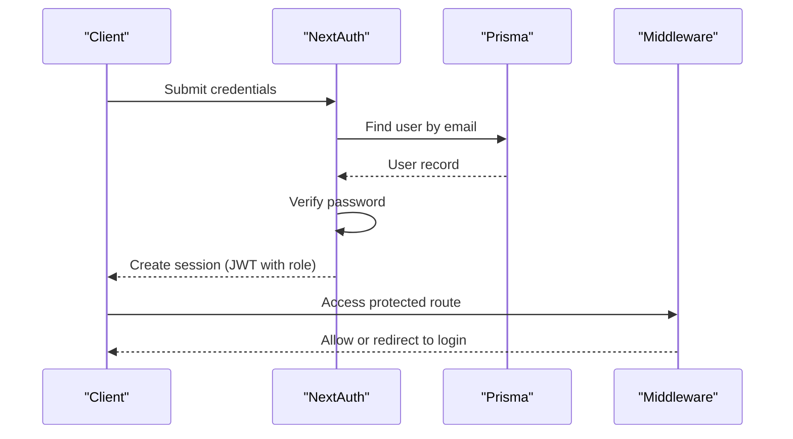
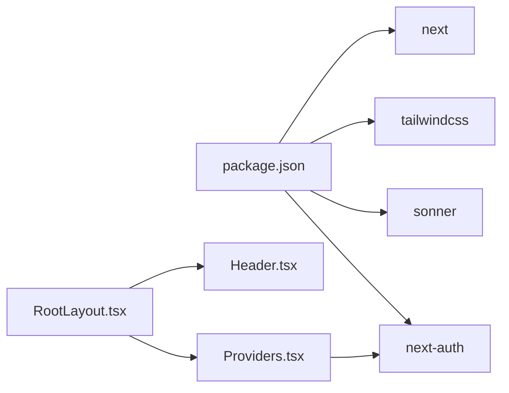

# Layout Components

<cite>
**Referenced Files in This Document**
- [Header.tsx](file://src/components/layout/Header.tsx)
- [Providers.tsx](file://src/components/Providers.tsx)
- [layout.tsx](file://src/app/layout.tsx)
- [page.tsx](file://src/app/page.tsx)
- [middleware.ts](file://src/middleware.ts)
- [auth.ts](file://src/auth.ts)
- [globals.css](file://src/app/globals.css)
- [package.json](file://package.json)
</cite>

## Table of Contents
1. [Introduction](#introduction)
2. [Project Structure](#project-structure)
3. [Core Components](#core-components)
4. [Architecture Overview](#architecture-overview)
5. [Detailed Component Analysis](#detailed-component-analysis)
6. [Dependency Analysis](#dependency-analysis)
7. [Performance Considerations](#performance-considerations)
8. [Troubleshooting Guide](#troubleshooting-guide)
9. [Conclusion](#conclusion)

## Introduction
This document explains the layout components in Titchybook Creator, focusing on the Header navigation, session management via Providers, and the root layout structure. It covers authentication state handling, role-based menu items, responsive design patterns, styling with Tailwind CSS, accessibility considerations, and integration patterns across the application.

## Project Structure
The layout system centers around three key files:
- Root layout orchestrates the HTML shell, fonts, providers, header, and toast notifications.
- Providers wraps the app subtree to enable NextAuth session management.
- Header renders navigation links and handles authentication-aware menus.

**Diagram sources**
- [layout.tsx:23-41](file://src/app/layout.tsx#L23-L41)
- [Providers.tsx:5-7](file://src/components/Providers.tsx#L5-L7)
- [Header.tsx:6-68](file://src/components/layout/Header.tsx#L6-L68)
- [middleware.ts:1-5](file://src/middleware.ts#L1-L5)
- [auth.ts:27-79](file://src/auth.ts#L27-L79)

**Section sources**
- [layout.tsx:1-42](file://src/app/layout.tsx#L1-L42)
- [Providers.tsx:1-8](file://src/components/Providers.tsx#L1-L8)
- [Header.tsx:1-69](file://src/components/layout/Header.tsx#L1-L69)
- [middleware.ts:1-6](file://src/middleware.ts#L1-L6)
- [auth.ts:1-80](file://src/auth.ts#L1-L80)

## Core Components
- Header: Renders branding, navigation links, and authentication-aware controls. Uses NextAuth’s client-side session hook to conditionally render dashboard, admin, and sign-out actions. Role-based visibility is handled via the session user’s role field.
- Providers: Wraps the application subtree to provide session context to all client components using NextAuth’s SessionProvider.
- RootLayout: Sets up fonts, theme variables, and composes the Providers, Header, page content, and toast notifications.

Key styling patterns:
- Container widths constrained to a max width with horizontal padding.
- Flexbox alignment for header items.
- Tailwind utilities for spacing, typography, and interactive states.

**Section sources**
- [Header.tsx:6-68](file://src/components/layout/Header.tsx#L6-L68)
- [Providers.tsx:5-7](file://src/components/Providers.tsx#L5-L7)
- [layout.tsx:23-41](file://src/app/layout.tsx#L23-L41)

## Architecture Overview
The layout architecture integrates Next.js app directory routing, NextAuth for session management, and middleware for protected routes. Providers ensures session availability to client components, while Header consumes the session to drive navigation and roles.

**Diagram sources**
- [layout.tsx:23-41](file://src/app/layout.tsx#L23-L41)
- [Providers.tsx:5-7](file://src/components/Providers.tsx#L5-L7)
- [Header.tsx:6-68](file://src/components/layout/Header.tsx#L6-L68)
- [middleware.ts:1-5](file://src/middleware.ts#L1-L5)
- [auth.ts:27-79](file://src/auth.ts#L27-L79)

## Detailed Component Analysis

### Header Component
Responsibilities:
- Display branding and site identity.
- Provide navigation links for unauthenticated and authenticated users.
- Conditionally show admin-specific links based on user role.
- Offer sign-out action with a redirect to the home page.

Props and behavior:
- No props required. Consumes session state via a client-side hook.
- Renders different sets of links depending on whether a session exists.
- Role-based rendering uses the session user’s role field.

Accessibility and UX:
- Uses semantic links for navigation.
- Hover states improve affordance for interactive elements.
- Clear separation between primary and secondary actions.

Responsive design:
- Header container uses a max-width constraint and horizontal padding.
- Flexbox aligns items and spaces them evenly.
- Typography scales appropriately with Tailwind utilities.

Customization guidelines:
- Adjust spacing and typography via Tailwind utilities applied to the header container and inner elements.
- Modify colors and hover effects by updating the utility classes used for links and buttons.
- Extend role-based menu items by adding conditions against the session user’s role.

Usage examples:
- Place the Header inside the RootLayout to ensure consistent navigation across pages.
- Use the same link classes for new internal navigation items to maintain visual consistency.

**Section sources**
- [Header.tsx:6-68](file://src/components/layout/Header.tsx#L6-L68)

#### Header Class Model

**Diagram sources**
- [Header.tsx:6-68](file://src/components/layout/Header.tsx#L6-L68)

### Providers Component
Responsibilities:
- Wrap the application subtree to provide session context to client components.
- Enable useSession and other NextAuth hooks to function throughout the app.

Props:
- children: ReactNode representing the app tree.

Integration:
- Mounted in RootLayout to ensure session context is available globally.

**Section sources**
- [Providers.tsx:5-7](file://src/components/Providers.tsx#L5-L7)

#### Providers Class Model

**Diagram sources**
- [Providers.tsx:5-7](file://src/components/Providers.tsx#L5-L7)

### Root Layout Structure and Page Composition
Responsibilities:
- Define metadata and fonts.
- Apply global styles and theme variables.
- Compose Providers, Header, page content, and toast notifications.
- Control the main content area height to account for the fixed header.

Composition pattern:
- The main content area uses a min-height calculation to fill the viewport minus the header height.
- The Header is rendered above the page content, ensuring consistent navigation across routes.

Styling and responsiveness:
- Global CSS defines theme tokens and font families.
- Tailwind utilities are applied to the body and page containers for consistent spacing and typography.

**Section sources**
- [layout.tsx:18-41](file://src/app/layout.tsx#L18-L41)
- [globals.css:1-27](file://src/app/globals.css#L1-L27)

#### Root Layout Class Model

**Diagram sources**
- [layout.tsx:23-41](file://src/app/layout.tsx#L23-L41)
- [Providers.tsx:5-7](file://src/components/Providers.tsx#L5-L7)
- [Header.tsx:6-68](file://src/components/layout/Header.tsx#L6-L68)
- [page.tsx:3-60](file://src/app/page.tsx#L3-L60)

### Authentication State Handling and Middleware
Authentication configuration:
- NextAuth configured with a credentials provider, JWT session strategy, and custom callbacks to attach user role to the session and JWT.
- Pages configuration redirects unauthenticated users to the login page.

Protected routes:
- Middleware enforces authentication for specific paths using the NextAuth auth adapter.
- Matchers target protected areas such as dashboard, create, and admin routes.

Integration with Header:
- Header reads the session to decide which navigation items to show and whether to display admin links.

**Section sources**
- [auth.ts:27-79](file://src/auth.ts#L27-L79)
- [middleware.ts:1-5](file://src/middleware.ts#L1-L5)
- [Header.tsx:6-68](file://src/components/layout/Header.tsx#L6-L68)

#### Authentication Flow

**Diagram sources**
- [auth.ts:35-58](file://src/auth.ts#L35-L58)
- [auth.ts:65-77](file://src/auth.ts#L65-L77)
- [middleware.ts:1-5](file://src/middleware.ts#L1-L5)

## Dependency Analysis
External libraries and integrations:
- NextAuth for authentication and session management.
- Sonner for toast notifications.
- Tailwind CSS for styling and responsive utilities.
- Next.js fonts for typography.

Internal dependencies:
- RootLayout depends on Providers, Header, and global styles.
- Header depends on NextAuth client hooks and Next.js Link.

**Diagram sources**
- [package.json:11-25](file://package.json#L11-L25)
- [layout.tsx:4-6](file://src/app/layout.tsx#L4-L6)
- [Providers.tsx:3](file://src/components/Providers.tsx#L3)
- [Header.tsx:3](file://src/components/layout/Header.tsx#L3)

**Section sources**
- [package.json:11-25](file://package.json#L11-L25)
- [layout.tsx:4-6](file://src/app/layout.tsx#L4-L6)
- [Providers.tsx:3](file://src/components/Providers.tsx#L3)
- [Header.tsx:3](file://src/components/layout/Header.tsx#L3)

## Performance Considerations
- Keep the header lightweight with minimal re-renders by relying on session state updates only when authentication changes.
- Use Tailwind utilities efficiently to avoid unnecessary CSS bloat.
- Ensure protected routes are handled by middleware to prevent unnecessary client-side navigation attempts.

## Troubleshooting Guide
Common issues and resolutions:
- Session not available in client components: Ensure Providers wraps the application subtree and that client components use the correct NextAuth hooks.
- Role-based links not appearing: Verify that the session includes the role field and that the Header checks match the expected role value.
- Protected route access errors: Confirm middleware matchers align with protected paths and that NextAuth pages configuration is set.

**Section sources**
- [Providers.tsx:5-7](file://src/components/Providers.tsx#L5-L7)
- [Header.tsx:30-37](file://src/components/layout/Header.tsx#L30-L37)
- [middleware.ts:3-5](file://src/middleware.ts#L3-L5)
- [auth.ts:65-77](file://src/auth.ts#L65-L77)

## Conclusion
The layout components in Titchybook Creator provide a clean, accessible, and responsive foundation. The Header adapts to authentication state and role, Providers centralizes session management, and RootLayout composes these elements with global styles and protected routing. Following the customization and accessibility guidelines ensures consistent user experiences across the application.