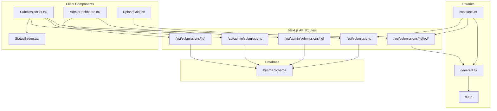
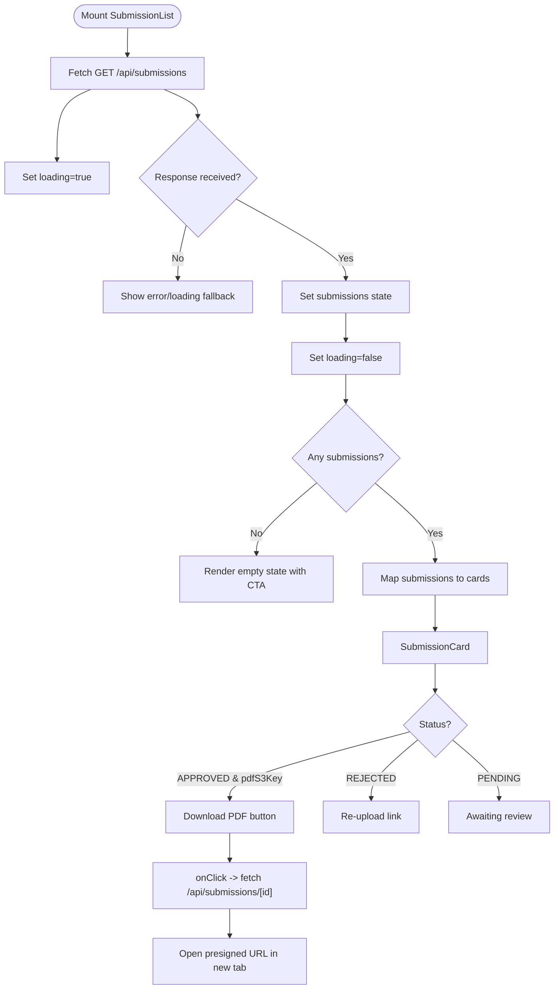
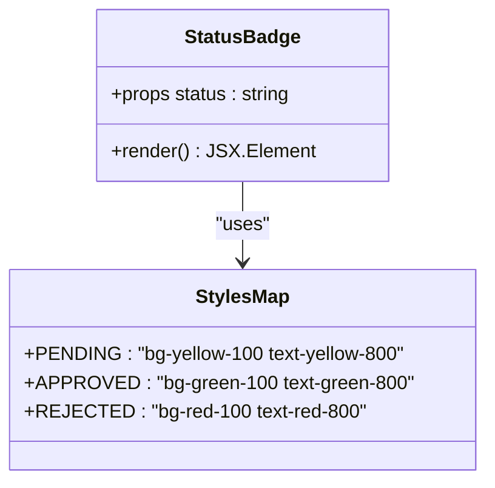
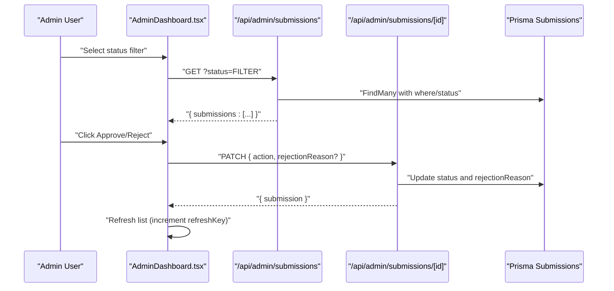
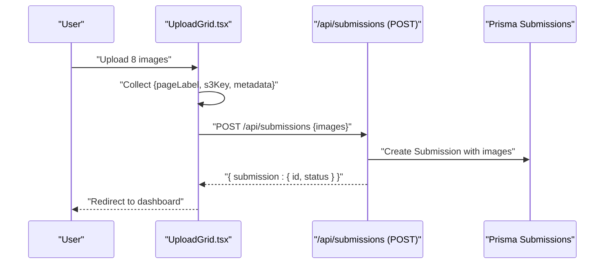
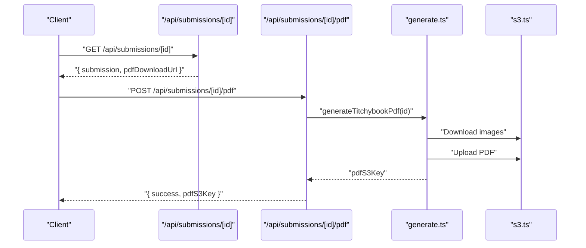
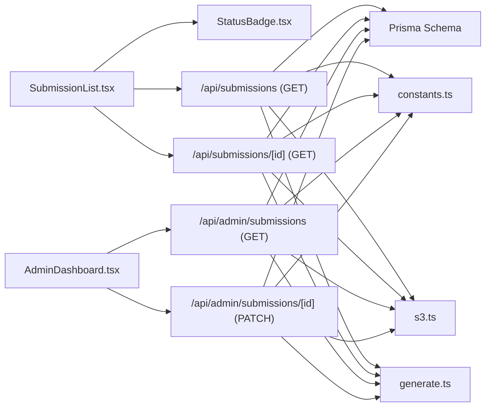
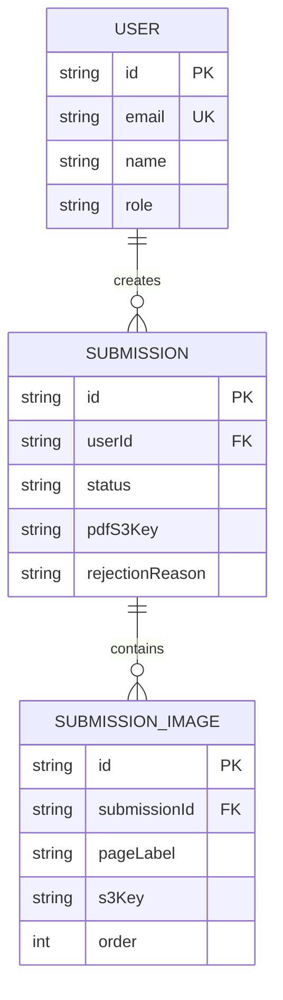

# Submission Components

<cite>
**Referenced Files in This Document**
- [SubmissionList.tsx](file://src/components/submissions/SubmissionList.tsx)
- [StatusBadge.tsx](file://src/components/submissions/StatusBadge.tsx)
- [route.ts](file://src/app/api/submissions/route.ts)
- [route.ts](file://src/app/api/submissions/[id]/route.ts)
- [route.ts](file://src/app/api/submissions/[id]/pdf/route.ts)
- [AdminDashboard.tsx](file://src/components/admin/AdminDashboard.tsx)
- [route.ts](file://src/app/api/admin/submissions/route.ts)
- [route.ts](file://src/app/api/admin/submissions/[id]/route.ts)
- [UploadGrid.tsx](file://src/components/create/UploadGrid.tsx)
- [page.tsx](file://src/app/(protected)/create/page.tsx)
- [generate.ts](file://src/lib/pdf/generate.ts)
- [s3.ts](file://src/lib/s3.ts)
- [constants.ts](file://src/lib/constants.ts)
- [schema.prisma](file://prisma/schema.prisma)
</cite>

## Table of Contents
1. [Introduction](#introduction)
2. [Project Structure](#project-structure)
3. [Core Components](#core-components)
4. [Architecture Overview](#architecture-overview)
5. [Detailed Component Analysis](#detailed-component-analysis)
6. [Dependency Analysis](#dependency-analysis)
7. [Performance Considerations](#performance-considerations)
8. [Troubleshooting Guide](#troubleshooting-guide)
9. [Conclusion](#conclusion)
10. [Appendices](#appendices)

## Introduction
This document provides comprehensive documentation for submission management components in Titchybook Creator. It focuses on the SubmissionList component and the StatusBadge component, detailing how submissions are fetched, displayed, filtered, and interacted with. It also explains submission workflows, status transitions, and user interaction patterns. The guide covers component props, event handlers, styling options, responsive design patterns, performance considerations for large datasets, loading states, and integration with API endpoints and PDF generation.

## Project Structure
Submission-related functionality spans React components, Next.js App Router API routes, Prisma database models, and AWS S3 integration utilities. The primary components are:
- SubmissionList: renders a user’s submission history with status badges and actions.
- StatusBadge: displays status with color-coded visual feedback.
- API routes: manage submission retrieval, creation, and PDF generation.
- Admin dashboard: filters submissions by status and approves/rejects them.
- PDF generation: orchestrates image processing and PDF composition.



**Diagram sources**
- [SubmissionList.tsx:1-119](file://src/components/submissions/SubmissionList.tsx#L1-L119)
- [StatusBadge.tsx:1-18](file://src/components/submissions/StatusBadge.tsx#L1-L18)
- [route.ts:1-96](file://src/app/api/submissions/route.ts#L1-L96)
- [route.ts:1-37](file://src/app/api/submissions/[id]/route.ts#L1-L37)
- [route.ts:1-27](file://src/app/api/submissions/[id]/pdf/route.ts#L1-L27)
- [AdminDashboard.tsx:1-168](file://src/components/admin/AdminDashboard.tsx#L1-L168)
- [route.ts:1-38](file://src/app/api/admin/submissions/route.ts#L1-L38)
- [route.ts:1-63](file://src/app/api/admin/submissions/[id]/route.ts#L1-L63)
- [UploadGrid.tsx:1-115](file://src/components/create/UploadGrid.tsx#L1-L115)
- [generate.ts:1-112](file://src/lib/pdf/generate.ts#L1-L112)
- [s3.ts:1-81](file://src/lib/s3.ts#L1-L81)
- [constants.ts:1-49](file://src/lib/constants.ts#L1-L49)
- [schema.prisma:1-48](file://prisma/schema.prisma#L1-L48)

**Section sources**
- [SubmissionList.tsx:1-119](file://src/components/submissions/SubmissionList.tsx#L1-L119)
- [StatusBadge.tsx:1-18](file://src/components/submissions/StatusBadge.tsx#L1-L18)
- [route.ts:1-96](file://src/app/api/submissions/route.ts#L1-L96)
- [route.ts:1-37](file://src/app/api/submissions/[id]/route.ts#L1-L37)
- [route.ts:1-27](file://src/app/api/submissions/[id]/pdf/route.ts#L1-L27)
- [AdminDashboard.tsx:1-168](file://src/components/admin/AdminDashboard.tsx#L1-L168)
- [route.ts:1-38](file://src/app/api/admin/submissions/route.ts#L1-L38)
- [route.ts:1-63](file://src/app/api/admin/submissions/[id]/route.ts#L1-L63)
- [UploadGrid.tsx:1-115](file://src/components/create/UploadGrid.tsx#L1-L115)
- [generate.ts:1-112](file://src/lib/pdf/generate.ts#L1-L112)
- [s3.ts:1-81](file://src/lib/s3.ts#L1-L81)
- [constants.ts:1-49](file://src/lib/constants.ts#L1-L49)
- [schema.prisma:1-48](file://prisma/schema.prisma#L1-L48)

## Core Components
- SubmissionList
  - Purpose: Fetches current user’s submissions, renders loading skeletons, empty state, and a card per submission with status badge and actions.
  - Data fetching: GET /api/submissions returns submissions array for the authenticated user.
  - Actions: Download PDF via /api/submissions/[id] (returns presigned URL), re-upload button for rejected items.
  - Props: none (client-side component).
  - Events: None (renders interactive buttons).
  - Styling: Tailwind classes for spacing, borders, and responsive layouts.
  - Responsive patterns: Flexbox for card layout; small screens adapt via gap and padding classes.
  - Pagination: Not implemented; loads all submissions ordered by creation date.
  - Filtering: Not implemented in this component; admin dashboard supports status filtering.

- StatusBadge
  - Purpose: Renders a status label with color-coded background/text classes based on submission status.
  - Props: status (string).
  - Styling: Uses a style map keyed by status to apply Tailwind utility classes.
  - Visual feedback: Consistent sizing and typography for badges.

**Section sources**
- [SubmissionList.tsx:15-119](file://src/components/submissions/SubmissionList.tsx#L15-L119)
- [StatusBadge.tsx:1-18](file://src/components/submissions/StatusBadge.tsx#L1-L18)
- [route.ts:20-33](file://src/app/api/submissions/route.ts#L20-L33)

## Architecture Overview
Submission workflows involve client components, API routes, database persistence, and S3-backed PDF generation. The diagram below maps the end-to-end flow from submission creation to PDF availability.

```mermaid
sequenceDiagram
participant User as "User"
participant Create as "UploadGrid.tsx"
participant API as "/api/submissions (POST)"
participant DB as "Prisma Submissions"
participant Gen as "generate.ts"
participant S3 as "s3.ts"
User->>Create : "Click Submit after uploading 8 images"
Create->>API : "POST /api/submissions {images}"
API->>DB : "Create submission with images"
API-->>Create : "{ submission : { id, status } }"
Create-->>User : "Success toast and redirect"
Note over Gen,S3 : "Background PDF generation"
API->>Gen : "Trigger PDF generation (non-blocking)"
Gen->>DB : "Set status to PROCESSING"
Gen->>S3 : "Download images by S3 keys"
Gen->>S3 : "Upload composed PDF to S3"
Gen->>DB : "Update status to PENDING with pdfS3Key"
```

**Diagram sources**
- [UploadGrid.tsx:42-76](file://src/components/create/UploadGrid.tsx#L42-L76)
- [route.ts:35-95](file://src/app/api/submissions/route.ts#L35-L95)
- [generate.ts:23-111](file://src/lib/pdf/generate.ts#L23-L111)
- [s3.ts:38-80](file://src/lib/s3.ts#L38-L80)
- [schema.prisma:21-33](file://prisma/schema.prisma#L21-L33)

## Detailed Component Analysis

### SubmissionList Component
SubmissionList fetches submissions for the authenticated user and renders cards with status badges and contextual actions. It handles loading states and empty states, and delegates PDF download to a dedicated API endpoint.



**Diagram sources**
- [SubmissionList.tsx:19-76](file://src/components/submissions/SubmissionList.tsx#L19-L76)
- [route.ts:6-35](file://src/app/api/submissions/[id]/route.ts#L6-L35)

**Section sources**
- [SubmissionList.tsx:15-119](file://src/components/submissions/SubmissionList.tsx#L15-L119)
- [route.ts:1-37](file://src/app/api/submissions/[id]/route.ts#L1-L37)

### StatusBadge Component
StatusBadge provides a compact, color-coded indicator for submission status. It maps status strings to Tailwind utility classes for consistent visual feedback.



**Diagram sources**
- [StatusBadge.tsx:1-18](file://src/components/submissions/StatusBadge.tsx#L1-L18)

**Section sources**
- [StatusBadge.tsx:1-18](file://src/components/submissions/StatusBadge.tsx#L1-L18)

### Admin Submission Management
AdminDashboard supports filtering submissions by status and approving/rejecting pending submissions. It triggers PATCH requests to update statuses and refreshes the list via a key-based mechanism.



**Diagram sources**
- [AdminDashboard.tsx:27-62](file://src/components/admin/AdminDashboard.tsx#L27-L62)
- [route.ts:6-37](file://src/app/api/admin/submissions/route.ts#L6-L37)
- [route.ts:12-55](file://src/app/api/admin/submissions/[id]/route.ts#L12-L55)

**Section sources**
- [AdminDashboard.tsx:21-168](file://src/components/admin/AdminDashboard.tsx#L21-L168)
- [route.ts:1-38](file://src/app/api/admin/submissions/route.ts#L1-L38)
- [route.ts:1-63](file://src/app/api/admin/submissions/[id]/route.ts#L1-L63)

### Submission Creation Workflow
UploadGrid coordinates image uploads and submission creation. It validates that exactly 8 images are uploaded, constructs the payload, and posts to the submissions API.



**Diagram sources**
- [UploadGrid.tsx:24-76](file://src/components/create/UploadGrid.tsx#L24-L76)
- [route.ts:35-95](file://src/app/api/submissions/route.ts#L35-L95)

**Section sources**
- [UploadGrid.tsx:16-115](file://src/components/create/UploadGrid.tsx#L16-L115)
- [page.tsx](file://src/app/(protected)/create/page.tsx#L1-L11)
- [route.ts:1-96](file://src/app/api/submissions/route.ts#L1-L96)

### PDF Generation and Download
PDF generation runs asynchronously after submission creation. The client can trigger regeneration via a dedicated endpoint or download via a presigned URL returned by the submission detail endpoint.



**Diagram sources**
- [route.ts:6-35](file://src/app/api/submissions/[id]/route.ts#L6-L35)
- [route.ts:5-26](file://src/app/api/submissions/[id]/pdf/route.ts#L5-L26)
- [generate.ts:23-111](file://src/lib/pdf/generate.ts#L23-L111)
- [s3.ts:38-80](file://src/lib/s3.ts#L38-L80)

**Section sources**
- [route.ts:1-37](file://src/app/api/submissions/[id]/route.ts#L1-L37)
- [route.ts:1-27](file://src/app/api/submissions/[id]/pdf/route.ts#L1-L27)
- [generate.ts:1-112](file://src/lib/pdf/generate.ts#L1-L112)
- [s3.ts:1-81](file://src/lib/s3.ts#L1-L81)

## Dependency Analysis
SubmissionList depends on StatusBadge and consumes two API endpoints: one for listing submissions and another for retrieving a single submission with a presigned PDF URL. AdminDashboard depends on admin endpoints for listing and updating submissions. PDF generation is orchestrated by generate.ts and uses s3.ts for S3 operations. The Prisma schema defines the Submission and SubmissionImage models.



**Diagram sources**
- [SubmissionList.tsx:1-119](file://src/components/submissions/SubmissionList.tsx#L1-L119)
- [StatusBadge.tsx:1-18](file://src/components/submissions/StatusBadge.tsx#L1-L18)
- [route.ts:1-96](file://src/app/api/submissions/route.ts#L1-L96)
- [route.ts:1-37](file://src/app/api/submissions/[id]/route.ts#L1-L37)
- [AdminDashboard.tsx:1-168](file://src/components/admin/AdminDashboard.tsx#L1-L168)
- [route.ts:1-38](file://src/app/api/admin/submissions/route.ts#L1-L38)
- [route.ts:1-63](file://src/app/api/admin/submissions/[id]/route.ts#L1-L63)
- [generate.ts:1-112](file://src/lib/pdf/generate.ts#L1-L112)
- [s3.ts:1-81](file://src/lib/s3.ts#L1-L81)
- [constants.ts:1-49](file://src/lib/constants.ts#L1-L49)
- [schema.prisma:1-48](file://prisma/schema.prisma#L1-L48)

**Section sources**
- [SubmissionList.tsx:1-119](file://src/components/submissions/SubmissionList.tsx#L1-L119)
- [StatusBadge.tsx:1-18](file://src/components/submissions/StatusBadge.tsx#L1-L18)
- [route.ts:1-96](file://src/app/api/submissions/route.ts#L1-L96)
- [route.ts:1-37](file://src/app/api/submissions/[id]/route.ts#L1-L37)
- [AdminDashboard.tsx:1-168](file://src/components/admin/AdminDashboard.tsx#L1-L168)
- [route.ts:1-38](file://src/app/api/admin/submissions/route.ts#L1-L38)
- [route.ts:1-63](file://src/app/api/admin/submissions/[id]/route.ts#L1-L63)
- [generate.ts:1-112](file://src/lib/pdf/generate.ts#L1-L112)
- [s3.ts:1-81](file://src/lib/s3.ts#L1-L81)
- [constants.ts:1-49](file://src/lib/constants.ts#L1-L49)
- [schema.prisma:1-48](file://prisma/schema.prisma#L1-L48)

## Performance Considerations
- Loading states: SubmissionList uses skeleton loaders during initial fetch to improve perceived performance.
- Minimal re-renders: SubmissionList maps submissions to lightweight cards; avoid unnecessary memoization unless lists become very large.
- Pagination: Not implemented; for large datasets, consider adding cursor-based pagination or server-side filtering.
- Background tasks: PDF generation is initiated asynchronously; avoid blocking the main thread.
- Network efficiency: AdminDashboard filters submissions server-side by status to reduce payload size.
- Image sizes: Enforce acceptable image types and maximum file size to keep uploads fast and reliable.
- Caching: Consider caching presigned URLs for short periods to reduce repeated S3 calls.

[No sources needed since this section provides general guidance]

## Troubleshooting Guide
- Unauthorized access
  - Symptom: 401 Unauthorized when fetching submissions.
  - Cause: Missing or invalid session.
  - Resolution: Ensure authentication middleware is active and the user is logged in.

- Forbidden access (Admin)
  - Symptom: 403 Forbidden when accessing admin endpoints.
  - Cause: Non-admin user or missing role.
  - Resolution: Verify user role is ADMIN.

- Submission not found
  - Symptom: 404 Not Found when fetching a specific submission.
  - Cause: Invalid submission ID or mismatched ownership.
  - Resolution: Confirm ID validity and user/admin permissions.

- PDF generation failures
  - Symptom: PDF generation errors or missing download URL.
  - Cause: Missing images, S3 errors, or generation exceptions.
  - Resolution: Check image presence, S3 credentials, and logs; retry generation via the PDF endpoint.

- Status transitions
  - Symptom: Status does not update after admin action.
  - Cause: Incorrect action payload or validation failure.
  - Resolution: Ensure action is APPROVE or REJECT and rejectionReason is optional.

**Section sources**
- [route.ts:20-33](file://src/app/api/submissions/route.ts#L20-L33)
- [route.ts:10-28](file://src/app/api/submissions/[id]/route.ts#L10-L28)
- [route.ts:6-10](file://src/app/api/admin/submissions/route.ts#L6-L10)
- [route.ts:12-55](file://src/app/api/admin/submissions/[id]/route.ts#L12-L55)
- [generate.ts:23-111](file://src/lib/pdf/generate.ts#L23-L111)

## Conclusion
SubmissionList and StatusBadge form the core of the user-facing submission interface, integrating seamlessly with API endpoints for fetching, creating, and downloading submissions. AdminDashboard extends this with filtering and status management. PDF generation is handled asynchronously with robust S3 integration. The system emphasizes clear status indicators, responsive UI patterns, and efficient data flows, with room for future enhancements like pagination and real-time updates.

[No sources needed since this section summarizes without analyzing specific files]

## Appendices

### Component Prop Definitions
- SubmissionList
  - Props: None
  - Events: None
  - Styling: Tailwind utility classes for layout and responsiveness
  - Notes: Uses internal SubmissionCard component for rendering each item

- StatusBadge
  - Props: status (string)
  - Events: None
  - Styling: Color-coded classes mapped by status

**Section sources**
- [SubmissionList.tsx:15-119](file://src/components/submissions/SubmissionList.tsx#L15-L119)
- [StatusBadge.tsx:1-18](file://src/components/submissions/StatusBadge.tsx#L1-L18)

### API Endpoint Reference
- GET /api/submissions
  - Description: Returns all submissions for the authenticated user, ordered by creation date.
  - Auth: Required
  - Response: { submissions: Submission[] }

- POST /api/submissions
  - Description: Creates a new submission with 8 images; returns submission id and status.
  - Auth: Required
  - Request body: { images: ImageEntry[] } where each ImageEntry includes pageLabel, s3Key, order, originalFilename, mimeType.
  - Response: { submission: { id, status } }

- GET /api/submissions/[id]
  - Description: Returns a single submission and a presigned PDF download URL if available.
  - Auth: Required (owner or admin)
  - Response: { submission, pdfDownloadUrl }

- POST /api/submissions/[id]/pdf
  - Description: Triggers PDF regeneration for a submission.
  - Auth: Required
  - Response: { success: true, pdfS3Key }

- GET /api/admin/submissions
  - Description: Returns all submissions optionally filtered by status; includes user and images.
  - Auth: Admin required
  - Query: status (optional)
  - Response: { submissions: AdminSubmission[] }

- PATCH /api/admin/submissions/[id]
  - Description: Updates submission status to APPROVED or REJECTED; optional rejectionReason.
  - Auth: Admin required
  - Request body: { action: "APPROVE"|"REJECT", rejectionReason?: string }
  - Response: { submission }

**Section sources**
- [route.ts:20-95](file://src/app/api/submissions/route.ts#L20-L95)
- [route.ts:6-35](file://src/app/api/submissions/[id]/route.ts#L6-L35)
- [route.ts:5-26](file://src/app/api/submissions/[id]/pdf/route.ts#L5-L26)
- [route.ts:6-37](file://src/app/api/admin/submissions/route.ts#L6-L37)
- [route.ts:12-55](file://src/app/api/admin/submissions/[id]/route.ts#L12-L55)

### Data Model Overview
Submission and SubmissionImage models define the relational structure persisted in the database.



**Diagram sources**
- [schema.prisma:10-47](file://prisma/schema.prisma#L10-L47)

**Section sources**
- [schema.prisma:1-48](file://prisma/schema.prisma#L1-L48)