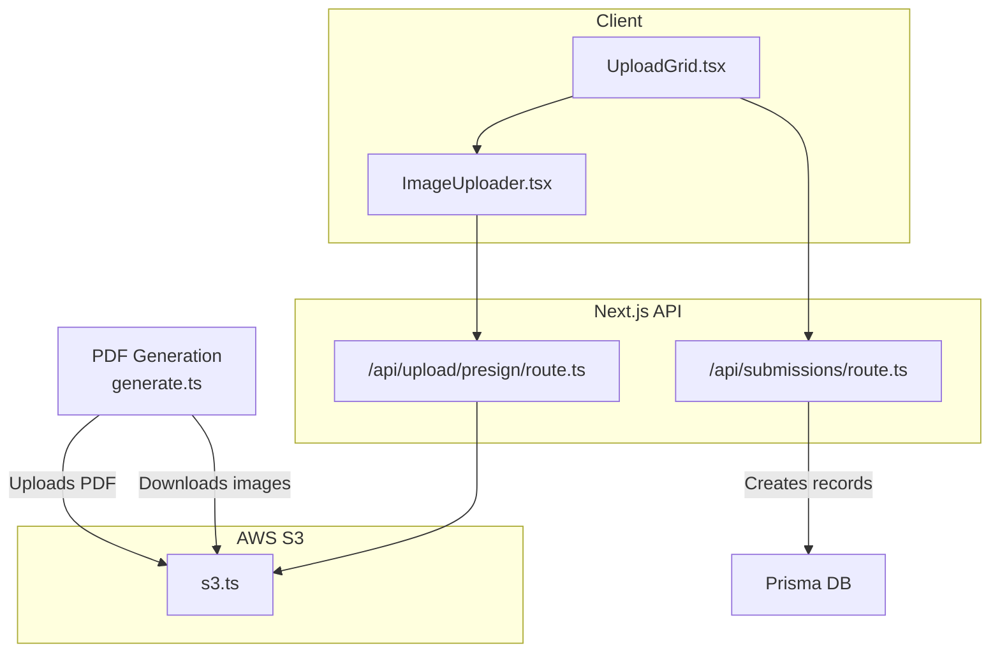
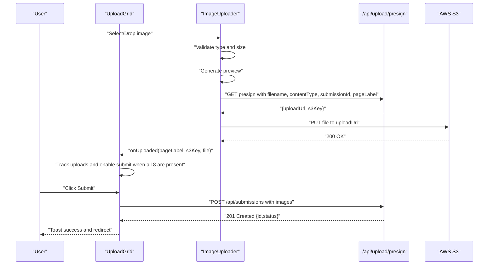
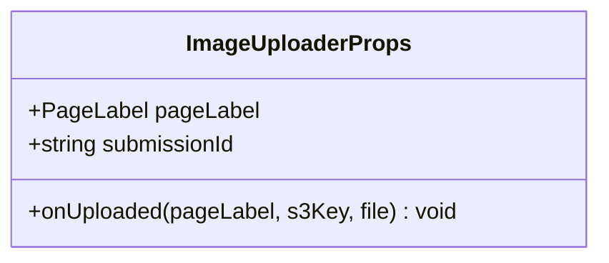
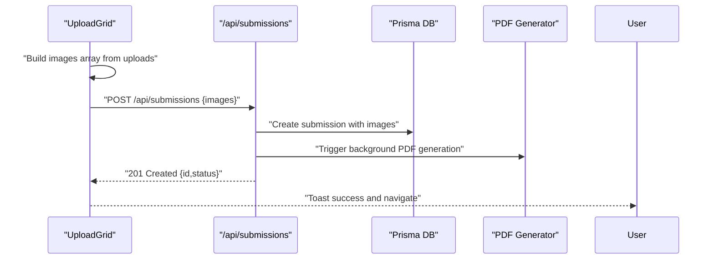
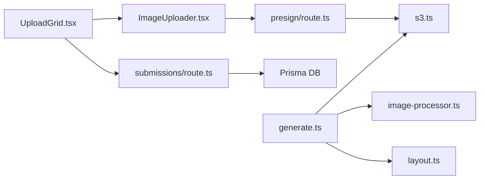

# Upload Components

<cite>
**Referenced Files in This Document**
- [ImageUploader.tsx](file://src/components/create/ImageUploader.tsx)
- [UploadGrid.tsx](file://src/components/create/UploadGrid.tsx)
- [presign/route.ts](file://src/app/api/upload/presign/route.ts)
- [s3.ts](file://src/lib/s3.ts)
- [constants.ts](file://src/lib/constants.ts)
- [create/page.tsx](file://src/app/(protected)/create/page.tsx)
- [submissions/route.ts](file://src/app/api/submissions/route.ts)
- [generate.ts](file://src/lib/pdf/generate.ts)
- [image-processor.ts](file://src/lib/pdf/image-processor.ts)
- [layout.ts](file://src/lib/pdf/layout.ts)
</cite>

## Table of Contents
1. [Introduction](#introduction)
2. [Project Structure](#project-structure)
3. [Core Components](#core-components)
4. [Architecture Overview](#architecture-overview)
5. [Detailed Component Analysis](#detailed-component-analysis)
6. [Dependency Analysis](#dependency-analysis)
7. [Performance Considerations](#performance-considerations)
8. [Troubleshooting Guide](#troubleshooting-guide)
9. [Conclusion](#conclusion)
10. [Appendices](#appendices)

## Introduction
This document explains the upload components in Titchybook Creator, focusing on:
- ImageUploader: drag-and-drop upload, file validation, preview generation, and upload progress handling
- UploadGrid: arranging eight pages, page labeling, thumbnail display, and interactive submission
- End-to-end workflow: from file selection to successful submission, including validation rules, size limits, supported formats, and AWS S3 presigned URL integration
- Props, events, styling, responsive design, performance, error handling, and user feedback

## Project Structure
The upload workflow spans client components, Next.js API routes, and backend S3 integration:
- Client-side upload components render the UI and orchestrate uploads
- API routes validate requests, generate presigned URLs, and persist submissions
- S3 utilities manage signed URLs and direct uploads
- PDF generation composes the final product from uploaded images

**Diagram sources**
- [UploadGrid.tsx:16-114](file://src/components/create/UploadGrid.tsx#L16-L114)
- [ImageUploader.tsx:12-147](file://src/components/create/ImageUploader.tsx#L12-L147)
- [presign/route.ts:6-37](file://src/app/api/upload/presign/route.ts#L6-L37)
- [submissions/route.ts:35-95](file://src/app/api/submissions/route.ts#L35-L95)
- [s3.ts:18-80](file://src/lib/s3.ts#L18-L80)
- [generate.ts:23-111](file://src/lib/pdf/generate.ts#L23-L111)

**Section sources**
- [create/page.tsx:1-11](file://src/app/(protected)/create/page.tsx#L1-L11)
- [UploadGrid.tsx:16-114](file://src/components/create/UploadGrid.tsx#L16-L114)
- [ImageUploader.tsx:12-147](file://src/components/create/ImageUploader.tsx#L12-L147)
- [presign/route.ts:6-37](file://src/app/api/upload/presign/route.ts#L6-L37)
- [submissions/route.ts:35-95](file://src/app/api/submissions/route.ts#L35-L95)
- [s3.ts:18-80](file://src/lib/s3.ts#L18-L80)
- [generate.ts:23-111](file://src/lib/pdf/generate.ts#L23-L111)

## Core Components
- ImageUploader: renders a single page slot, handles drag-and-drop, validates file type and size, previews the selected image, obtains a presigned URL, uploads directly to S3, and notifies parent on success.
- UploadGrid: orchestrates eight ImageUploader instances, tracks uploads, enforces completeness, and submits the batch to the backend.

Key behaviors:
- Validation: only JPG, PNG, WebP; max 10 MB
- Preview: base64 preview while uploading
- Progress: spinner overlay during upload
- Error feedback: inline error messages and toast notifications
- Responsive: grid layout adapts to small screens

**Section sources**
- [ImageUploader.tsx:6-147](file://src/components/create/ImageUploader.tsx#L6-L147)
- [UploadGrid.tsx:16-114](file://src/components/create/UploadGrid.tsx#L16-L114)
- [constants.ts:42-49](file://src/lib/constants.ts#L42-L49)

## Architecture Overview
The upload workflow integrates client-side validation and preview with server-side presigned URL generation and direct S3 uploads.

**Diagram sources**
- [ImageUploader.tsx:22-73](file://src/components/create/ImageUploader.tsx#L22-L73)
- [presign/route.ts:6-37](file://src/app/api/upload/presign/route.ts#L6-L37)
- [UploadGrid.tsx:24-76](file://src/components/create/UploadGrid.tsx#L24-L76)
- [submissions/route.ts:35-95](file://src/app/api/submissions/route.ts#L35-L95)

## Detailed Component Analysis

### ImageUploader Component
Responsibilities:
- Accepts a single image file via click or drag-and-drop
- Validates MIME type and file size
- Generates a preview URL
- Requests a presigned upload URL from the backend
- Uploads the file directly to S3
- Notifies parent with page label, S3 key, and original file

Props:
- pageLabel: PageLabel (one of the eight labels)
- submissionId: string identifier for the current submission
- onUploaded: callback receiving pageLabel, s3Key, and File

State and UX:
- preview: base64 image URL for thumbnail display
- uploading: spinner overlay during upload
- error: validation or upload error message
- dragOver: visual feedback for drag-and-drop

Validation rules:
- MIME types: image/jpeg, image/png, image/webp
- Size limit: 10 MB

Direct S3 upload:
- Presigned URL lifetime: 10 minutes
- Content-Type preserved from the file

Styling and responsiveness:
- Fixed-size slot with aspect ratio suitable for A7 portrait final page
- Hover and drag-over states
- Preview image fills the slot
- Error message below the slot

Accessibility:
- Hidden input allows programmatic selection
- Alt text uses display label

**Section sources**
- [ImageUploader.tsx:6-147](file://src/components/create/ImageUploader.tsx#L6-L147)
- [constants.ts:42-49](file://src/lib/constants.ts#L42-L49)
- [s3.ts:18-28](file://src/lib/s3.ts#L18-L28)

#### Class Diagram: ImageUploader Internal Types

**Diagram sources**
- [ImageUploader.tsx:6-16](file://src/components/create/ImageUploader.tsx#L6-L16)

### UploadGrid Component
Responsibilities:
- Renders eight ImageUploader slots arranged in a responsive grid
- Generates a unique submissionId per session
- Tracks uploaded images in a Map keyed by PageLabel
- Enables submission only when all 8 images are uploaded
- Submits the batch to the backend and navigates on success

Props:
- None (uses internal state and router)

Behavior:
- On each successful upload, updates the uploads Map
- Computes completeness: 8 out of 8
- Builds an ordered array of images for submission
- Calls POST /api/submissions with images metadata
- Uses toast notifications for success/error feedback

Styling and responsiveness:
- Grid layout: 2 columns on small screens, 4 columns on larger screens
- Informative banner explaining final page size and automatic resizing
- Disabled submit button until all images are uploaded

**Section sources**
- [UploadGrid.tsx:16-114](file://src/components/create/UploadGrid.tsx#L16-L114)
- [constants.ts:18-40](file://src/lib/constants.ts#L18-L40)

#### Sequence Diagram: UploadGrid to Submission

**Diagram sources**
- [UploadGrid.tsx:42-76](file://src/components/create/UploadGrid.tsx#L42-L76)
- [submissions/route.ts:35-95](file://src/app/api/submissions/route.ts#L35-L95)
- [generate.ts:23-111](file://src/lib/pdf/generate.ts#L23-L111)

### Upload Workflow: From Selection to Submission
End-to-end flow:
1. User selects or drags an image into a slot
2. Client validates type and size, generates preview
3. Client requests a presigned URL from /api/upload/presign
4. Backend verifies parameters and accepted types, builds S3 key, returns presigned PUT URL
5. Client uploads file directly to S3 using the presigned URL
6. On success, ImageUploader invokes onUploaded, updating UploadGrid’s state
7. Once all 8 slots are filled, UploadGrid submits the batch to /api/submissions
8. Backend persists images and triggers asynchronous PDF generation

Validation and constraints:
- Frontend: type and size checks
- Backend: strict schema validation and uniqueness of page labels
- PDF generation expects exactly 8 images with specific labels

**Section sources**
- [ImageUploader.tsx:22-73](file://src/components/create/ImageUploader.tsx#L22-L73)
- [presign/route.ts:6-37](file://src/app/api/upload/presign/route.ts#L6-L37)
- [submissions/route.ts:8-18](file://src/app/api/submissions/route.ts#L8-L18)
- [UploadGrid.tsx:42-76](file://src/components/create/UploadGrid.tsx#L42-L76)

### Presigned URL Endpoint
- Requires authenticated session
- Validates presence of filename, contentType, submissionId, pageLabel
- Ensures contentType is among accepted image types
- Constructs S3 key using userId, submissionId, pageLabel, and file extension
- Returns a presigned PUT URL with 10-minute expiry

Security and correctness:
- Enforces accepted types server-side
- Builds deterministic S3 keys to prevent collisions
- Uses signed URLs to avoid exposing bucket credentials

**Section sources**
- [presign/route.ts:6-37](file://src/app/api/upload/presign/route.ts#L6-L37)
- [s3.ts:66-73](file://src/lib/s3.ts#L66-L73)
- [constants.ts:42-46](file://src/lib/constants.ts#L42-L46)

### S3 Utilities
- getPresignedUploadUrl: creates a signed PUT URL for S3 upload
- getPresignedDownloadUrl: creates a signed GET URL for S3 download
- downloadFromS3: streams and concatenates S3 object bytes
- uploadToS3: uploads a buffer to S3
- buildUploadKey/buildPdfKey: constructs S3 keys for uploads and PDFs

Integration:
- Used by ImageUploader for direct S3 uploads
- Used by PDF generator for downloading images and uploading the final PDF

**Section sources**
- [s3.ts:18-80](file://src/lib/s3.ts#L18-L80)

### PDF Generation Pipeline
- Sets submission status to PROCESSING
- Downloads all 8 images in parallel from S3
- Processes each image (resize, crop, optional rotation) to PNG at 300 DPI
- Composes a single A4 landscape PDF using pdf-lib
- Uploads the PDF to S3 and updates the submission record
- Leaves status as PENDING for admin review

Layout and DPI:
- Panels defined in millimeters with precise coordinates
- Converts mm to points for pdf-lib
- Targets 300 DPI for print quality

**Section sources**
- [generate.ts:23-111](file://src/lib/pdf/generate.ts#L23-L111)
- [image-processor.ts:9-29](file://src/lib/pdf/image-processor.ts#L9-L29)
- [layout.ts:29-104](file://src/lib/pdf/layout.ts#L29-L104)

## Dependency Analysis
- UploadGrid depends on ImageUploader and constants for page labels
- ImageUploader depends on constants for validation and labels, and on s3.ts for presigned URLs
- presign/route.ts depends on s3.ts for URL generation and constants for accepted types
- submissions/route.ts depends on Prisma for persistence and on constants for validation
- PDF generation depends on s3.ts for downloads/uploads, image-processor.ts for resizing/cropping, and layout.ts for positioning

**Diagram sources**
- [UploadGrid.tsx:16-114](file://src/components/create/UploadGrid.tsx#L16-L114)
- [ImageUploader.tsx:12-147](file://src/components/create/ImageUploader.tsx#L12-L147)
- [presign/route.ts:6-37](file://src/app/api/upload/presign/route.ts#L6-L37)
- [s3.ts:18-80](file://src/lib/s3.ts#L18-L80)
- [submissions/route.ts:35-95](file://src/app/api/submissions/route.ts#L35-L95)
- [generate.ts:23-111](file://src/lib/pdf/generate.ts#L23-L111)
- [image-processor.ts:9-29](file://src/lib/pdf/image-processor.ts#L9-L29)
- [layout.ts:29-104](file://src/lib/pdf/layout.ts#L29-L104)

**Section sources**
- [UploadGrid.tsx:16-114](file://src/components/create/UploadGrid.tsx#L16-L114)
- [ImageUploader.tsx:12-147](file://src/components/create/ImageUploader.tsx#L12-L147)
- [presign/route.ts:6-37](file://src/app/api/upload/presign/route.ts#L6-L37)
- [s3.ts:18-80](file://src/lib/s3.ts#L18-L80)
- [submissions/route.ts:35-95](file://src/app/api/submissions/route.ts#L35-L95)
- [generate.ts:23-111](file://src/lib/pdf/generate.ts#L23-L111)
- [image-processor.ts:9-29](file://src/lib/pdf/image-processor.ts#L9-L29)
- [layout.ts:29-104](file://src/lib/pdf/layout.ts#L29-L104)

## Performance Considerations
- Direct S3 uploads: reduces server bandwidth and latency by bypassing the Next.js server
- Parallelization: PDF generation downloads and processes images concurrently
- Efficient previews: base64 preview avoids extra round trips
- Minimized server payload: only metadata is sent to /api/submissions
- Presigned URL expiry: short-lived URLs reduce risk and avoid long-running server sessions

Optimization opportunities:
- Debounce drag-over events to reduce re-renders
- Lazy-load PDF generation triggers to avoid unnecessary background tasks
- Consider caching frequently accessed image assets if reuse patterns emerge

[No sources needed since this section provides general guidance]

## Troubleshooting Guide
Common issues and resolutions:
- Unauthorized access to presigned URL endpoint: ensure user is authenticated
- Missing required parameters: verify filename, contentType, submissionId, pageLabel are provided
- Invalid file type: confirm MIME type is one of JPG, PNG, WebP
- File too large: ensure file size does not exceed 10 MB
- Upload failure: check network connectivity and presigned URL validity
- Submission fails: verify all 8 unique page labels are present and ordered correctly
- PDF generation errors: inspect logs for missing images or processing failures

User feedback:
- Inline error messages in ImageUploader
- Toast notifications for submission success/failure
- Disabled submit button until all images are uploaded

**Section sources**
- [presign/route.ts:8-30](file://src/app/api/upload/presign/route.ts#L8-L30)
- [ImageUploader.tsx:24-31](file://src/components/create/ImageUploader.tsx#L24-L31)
- [UploadGrid.tsx:42-76](file://src/components/create/UploadGrid.tsx#L42-L76)
- [submissions/route.ts:45-61](file://src/app/api/submissions/route.ts#L45-L61)

## Conclusion
The upload components provide a robust, user-friendly workflow for assembling a Titchybook:
- Strict validation and clear feedback ensure reliable uploads
- Direct S3 uploads improve performance and scalability
- A responsive grid and preview enhance usability
- Background PDF generation produces a high-quality final product

[No sources needed since this section summarizes without analyzing specific files]

## Appendices

### Props and Events Reference
- ImageUploader
  - Props: pageLabel, submissionId, onUploaded
  - Event: onUploaded(pageLabel, s3Key, file)
- UploadGrid
  - Props: none
  - Behavior: manages uploads state, enables submit when all 8 are present

**Section sources**
- [ImageUploader.tsx:6-16](file://src/components/create/ImageUploader.tsx#L6-L16)
- [UploadGrid.tsx:16-38](file://src/components/create/UploadGrid.tsx#L16-L38)

### Validation Rules and Limits
- Supported formats: JPG, PNG, WebP
- Max file size: 10 MB
- Number of pages: exactly 8
- Page labels: FRONT_COVER, BACK_COVER, PAGE_2–PAGE_7

**Section sources**
- [constants.ts:42-49](file://src/lib/constants.ts#L42-L49)
- [constants.ts:18-27](file://src/lib/constants.ts#L18-L27)

### Styling and Responsive Design Notes
- Grid layout: 2 columns on small screens, 4 columns on larger screens
- Slot aspect ratio optimized for A7 portrait final page
- Hover and drag-over visual states
- Disabled submit button until completion

**Section sources**
- [UploadGrid.tsx:88-111](file://src/components/create/UploadGrid.tsx#L88-L111)
- [ImageUploader.tsx:88-146](file://src/components/create/ImageUploader.tsx#L88-L146)