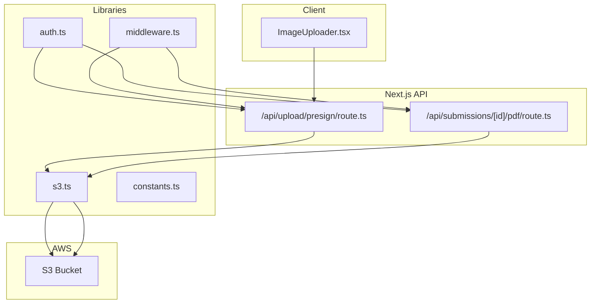
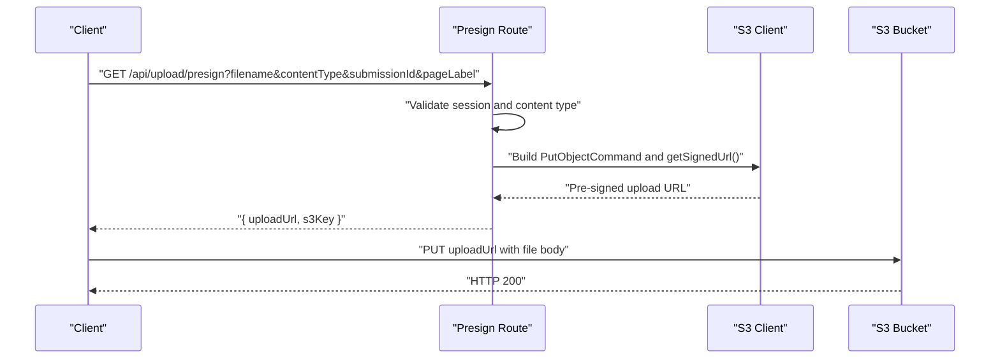
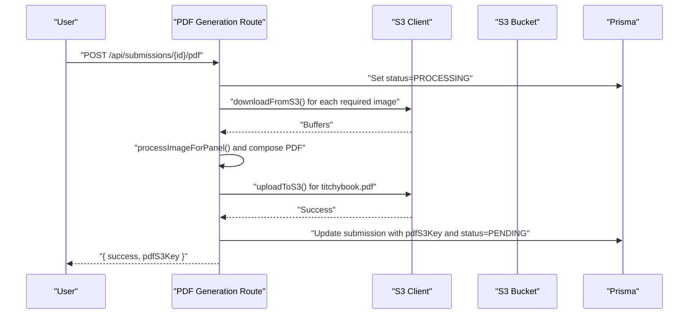
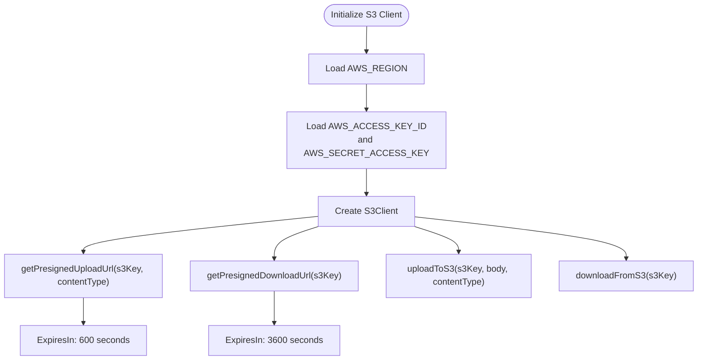
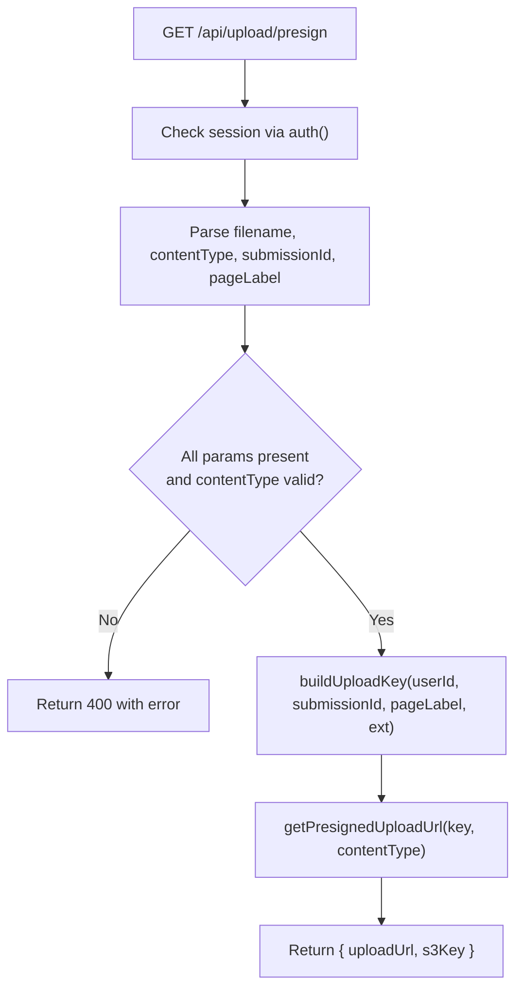
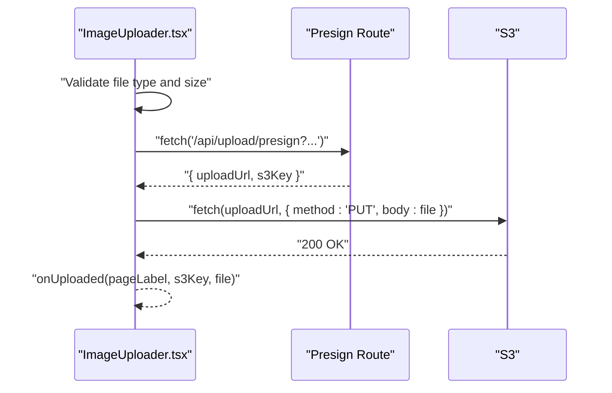
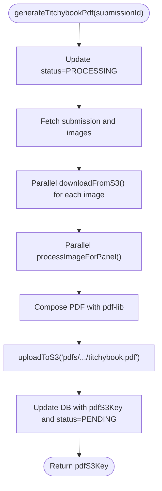
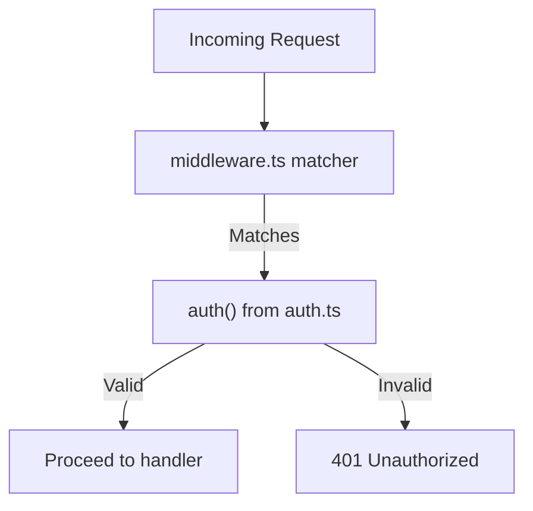
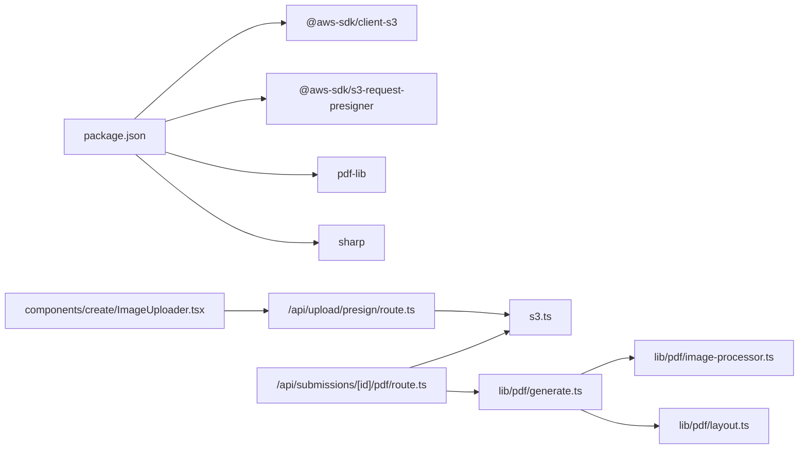

# AWS & Cloud Configuration

<cite>
**Referenced Files in This Document**
- [s3.ts](file://src/lib/s3.ts)
- [route.ts](file://src/app/api/upload/presign/route.ts)
- [constants.ts](file://src/lib/constants.ts)
- [ImageUploader.tsx](file://src/components/create/ImageUploader.tsx)
- [generate.ts](file://src/lib/pdf/generate.ts)
- [image-processor.ts](file://src/lib/pdf/image-processor.ts)
- [layout.ts](file://src/lib/pdf/layout.ts)
- [route.ts](file://src/app/api/submissions/[id]/pdf/route.ts)
- [auth.ts](file://src/auth.ts)
- [middleware.ts](file://src/middleware.ts)
- [package.json](file://package.json)
- [next.config.ts](file://next.config.ts)
</cite>

## Table of Contents
1. [Introduction](#introduction)
2. [Project Structure](#project-structure)
3. [Core Components](#core-components)
4. [Architecture Overview](#architecture-overview)
5. [Detailed Component Analysis](#detailed-component-analysis)
6. [Dependency Analysis](#dependency-analysis)
7. [Performance Considerations](#performance-considerations)
8. [Troubleshooting Guide](#troubleshooting-guide)
9. [Conclusion](#conclusion)
10. [Appendices](#appendices)

## Introduction
This document explains how Titchybook Creator integrates with AWS for storage, authentication, and PDF generation. It focuses on the current implementation of S3 uploads via pre-signed URLs, server-side S3 operations for PDF assembly, and the surrounding Next.js API routes and client components. It also outlines recommended AWS configurations (bucket policies, CORS, IAM roles, encryption, monitoring) and CloudFront considerations for production deployments.

## Project Structure
The AWS-related logic is primarily encapsulated in a small set of modules:
- S3 client and helpers for uploads/downloads and key construction
- An API route that generates pre-signed upload URLs
- A client component that requests a pre-signed URL and uploads directly to S3
- A PDF generation service that downloads images from S3, processes them, composes a PDF, and re-uploads it to S3
- Authentication and middleware that gate protected routes

**Diagram sources**
- [ImageUploader.tsx:1-148](file://src/components/create/ImageUploader.tsx#L1-L148)
- [route.ts:1-38](file://src/app/api/upload/presign/route.ts#L1-L38)
- [route.ts:1-27](file://src/app/api/submissions/[id]/pdf/route.ts#L1-L27)
- [s3.ts:1-81](file://src/lib/s3.ts#L1-L81)
- [constants.ts:1-49](file://src/lib/constants.ts#L1-L49)
- [auth.ts:1-80](file://src/auth.ts#L1-L80)
- [middleware.ts:1-6](file://src/middleware.ts#L1-L6)

**Section sources**
- [package.json:1-43](file://package.json#L1-L43)
- [next.config.ts:1-8](file://next.config.ts#L1-L8)

## Core Components
- S3 client and helpers: Initialize the S3 client with region and credentials, construct pre-signed URLs for uploads and downloads, and provide convenience functions to upload/download buffers and build S3 keys for images and generated PDFs.
- Pre-signed upload endpoint: Validates session, checks content type against accepted image types, constructs an S3 key, and returns a pre-signed PUT URL with a short expiry.
- Client uploader: Requests a pre-signed URL from the backend, previews the image, and performs a direct PUT upload to S3.
- PDF generation service: Updates submission status to processing, downloads required images from S3, processes them, composes a PDF, uploads the PDF to S3, and updates the database.
- Authentication and middleware: Protects protected routes and ensures only authenticated users can access upload and PDF generation APIs.

**Section sources**
- [s3.ts:1-81](file://src/lib/s3.ts#L1-L81)
- [route.ts:1-38](file://src/app/api/upload/presign/route.ts#L1-L38)
- [ImageUploader.tsx:1-148](file://src/components/create/ImageUploader.tsx#L1-L148)
- [generate.ts:1-112](file://src/lib/pdf/generate.ts#L1-L112)
- [auth.ts:1-80](file://src/auth.ts#L1-L80)
- [middleware.ts:1-6](file://src/middleware.ts#L1-L6)

## Architecture Overview
The system uses two complementary S3 access patterns:
- Client-side uploads via pre-signed URLs for immediate, direct S3 uploads
- Server-side operations for PDF generation, where the server downloads images, processes them, and uploads the final PDF

**Diagram sources**
- [route.ts:1-38](file://src/app/api/upload/presign/route.ts#L1-L38)
- [s3.ts:18-28](file://src/lib/s3.ts#L18-L28)
- [ImageUploader.tsx:42-64](file://src/components/create/ImageUploader.tsx#L42-L64)

**Diagram sources**
- [route.ts:1-27](file://src/app/api/submissions/[id]/pdf/route.ts#L1-L27)
- [generate.ts:23-111](file://src/lib/pdf/generate.ts#L23-L111)
- [s3.ts:38-64](file://src/lib/s3.ts#L38-L64)
- [image-processor.ts:9-29](file://src/lib/pdf/image-processor.ts#L9-L29)
- [layout.ts:29-104](file://src/lib/pdf/layout.ts#L29-L104)

## Detailed Component Analysis

### S3 Client and Helpers
- Initializes the S3 client with region and credentials from environment variables.
- Provides:
  - Pre-signed upload URL builder for temporary write access
  - Pre-signed download URL builder for temporary read access
  - Direct upload and download helpers for server-side operations
  - Key builders for images and generated PDFs

**Diagram sources**
- [s3.ts:8-14](file://src/lib/s3.ts#L8-L14)
- [s3.ts:18-36](file://src/lib/s3.ts#L18-L36)
- [s3.ts:38-64](file://src/lib/s3.ts#L38-L64)

**Section sources**
- [s3.ts:1-81](file://src/lib/s3.ts#L1-L81)

### Pre-Signed Upload Endpoint
- Requires an authenticated session.
- Validates content type against accepted image MIME types.
- Constructs an S3 key using the current user ID, submission ID, page label, and file extension.
- Returns a pre-signed upload URL with a 10-minute expiry.

**Diagram sources**
- [route.ts:6-37](file://src/app/api/upload/presign/route.ts#L6-L37)
- [constants.ts:42-46](file://src/lib/constants.ts#L42-L46)
- [s3.ts:66-73](file://src/lib/s3.ts#L66-L73)

**Section sources**
- [route.ts:1-38](file://src/app/api/upload/presign/route.ts#L1-L38)
- [constants.ts:1-49](file://src/lib/constants.ts#L1-L49)
- [s3.ts:1-81](file://src/lib/s3.ts#L1-L81)

### Client-Side Uploader
- Validates file type and size locally.
- On success, requests a pre-signed URL from the backend.
- Performs a direct PUT upload to S3 using the returned URL.
- Invokes a callback upon successful upload.

**Diagram sources**
- [ImageUploader.tsx:22-73](file://src/components/create/ImageUploader.tsx#L22-L73)
- [route.ts:1-38](file://src/app/api/upload/presign/route.ts#L1-L38)

**Section sources**
- [ImageUploader.tsx:1-148](file://src/components/create/ImageUploader.tsx#L1-L148)
- [route.ts:1-38](file://src/app/api/upload/presign/route.ts#L1-L38)

### PDF Generation Service
- Sets submission status to processing to prevent concurrent runs.
- Downloads required images from S3 in parallel.
- Processes each image (resize, crop, optional rotation) and embeds into a PDF.
- Uploads the composed PDF to S3 and updates the database with the PDF key and resets status to pending.

**Diagram sources**
- [generate.ts:23-111](file://src/lib/pdf/generate.ts#L23-L111)
- [s3.ts:38-64](file://src/lib/s3.ts#L38-L64)
- [image-processor.ts:9-29](file://src/lib/pdf/image-processor.ts#L9-L29)
- [layout.ts:29-104](file://src/lib/pdf/layout.ts#L29-L104)

**Section sources**
- [generate.ts:1-112](file://src/lib/pdf/generate.ts#L1-L112)
- [s3.ts:1-81](file://src/lib/s3.ts#L1-L81)
- [image-processor.ts:1-30](file://src/lib/pdf/image-processor.ts#L1-L30)
- [layout.ts:1-105](file://src/lib/pdf/layout.ts#L1-L105)

### Authentication and Access Control
- NextAuth-based authentication with JWT sessions.
- Middleware protects protected routes (/dashboard, /create, /admin).
- API routes check session presence before allowing uploads or PDF generation.

**Diagram sources**
- [middleware.ts:3-5](file://src/middleware.ts#L3-L5)
- [auth.ts:27-79](file://src/auth.ts#L27-L79)

**Section sources**
- [auth.ts:1-80](file://src/auth.ts#L1-L80)
- [middleware.ts:1-6](file://src/middleware.ts#L1-L6)
- [route.ts:1-38](file://src/app/api/upload/presign/route.ts#L1-L38)
- [route.ts:1-27](file://src/app/api/submissions/[id]/pdf/route.ts#L1-L27)

## Dependency Analysis
- External SDKs:
  - @aws-sdk/client-s3 and @aws-sdk/s3-request-presigner for S3 operations
  - pdf-lib for PDF composition
  - sharp for image processing
- Internal dependencies:
  - API routes depend on S3 helpers and constants
  - PDF generation depends on S3 helpers, image processing, and layout definitions
  - Client uploader depends on the pre-sign endpoint

**Diagram sources**
- [package.json:11-24](file://package.json#L11-L24)
- [route.ts:1-38](file://src/app/api/upload/presign/route.ts#L1-L38)
- [route.ts:1-27](file://src/app/api/submissions/[id]/pdf/route.ts#L1-L27)
- [s3.ts:1-81](file://src/lib/s3.ts#L1-L81)
- [generate.ts:1-112](file://src/lib/pdf/generate.ts#L1-L112)
- [image-processor.ts:1-30](file://src/lib/pdf/image-processor.ts#L1-L30)
- [layout.ts:1-105](file://src/lib/pdf/layout.ts#L1-L105)
- [ImageUploader.tsx:1-148](file://src/components/create/ImageUploader.tsx#L1-L148)

**Section sources**
- [package.json:1-43](file://package.json#L1-L43)

## Performance Considerations
- Pre-signed uploads reduce server bandwidth and latency by streaming directly to S3.
- Parallel downloads and image processing during PDF generation improve throughput.
- Short-lived pre-signed URLs (10 minutes) minimize exposure windows.
- Consider:
  - Using multipart uploads for large files if needed
  - Optimizing image sizes before upload to reduce downstream processing costs
  - Caching frequently accessed PDFs behind a CDN for reduced origin load

[No sources needed since this section provides general guidance]

## Troubleshooting Guide
Common issues and resolutions:
- Missing environment variables:
  - Ensure AWS_REGION, AWS_ACCESS_KEY_ID, AWS_SECRET_ACCESS_KEY, and S3_BUCKET_NAME are configured.
- Unauthorized access:
  - Verify authentication middleware and session validation in API routes.
- Invalid content type:
  - Confirm contentType matches accepted image MIME types.
- Upload failures:
  - Check pre-signed URL expiry and network connectivity.
- PDF generation errors:
  - Inspect missing image records per panel and S3 download errors.

**Section sources**
- [s3.ts:8-14](file://src/lib/s3.ts#L8-L14)
- [route.ts:6-37](file://src/app/api/upload/presign/route.ts#L6-L37)
- [generate.ts:23-111](file://src/lib/pdf/generate.ts#L23-L111)

## Conclusion
Titchybook Creator uses a secure, scalable pattern: client-side uploads via short-lived pre-signed URLs and server-side PDF generation with targeted S3 operations. To harden the deployment, complement the existing code with robust AWS configurations for S3, IAM, and CloudFront, as outlined below.

## Appendices

### Recommended AWS Configuration (Conceptual)
- S3 bucket
  - Enforce block public access except for controlled, job-specific grants
  - Enable default encryption (SSE-S3 or SSE-KMS)
  - Configure bucket policies to limit actions to specific IAM principals or roles
  - Set CORS to allow only your domain(s) and necessary methods
- IAM
  - Create least-privilege roles for the Next.js runtime and CI/CD
  - Grant s3:PutObject and s3:GetObject for the specific bucket/prefixes used by uploads and PDFs
  - Avoid long-term credentials in production; prefer roles and temporary credentials
- Regions and cost optimization
  - Choose a region close to your users for lower latency
  - Use S3 Intelligent-Tiering or Lifecycle policies to move infrequent PDFs to cheaper storage tiers
- Monitoring and logging
  - Enable S3 server access logs and integrate with CloudWatch
  - Add metrics for upload/download volumes and latency
- CloudFront (CDN)
  - Distribute S3 content via CloudFront for global low-latency delivery
  - Use signed cookies or signed URLs for private distributions if needed
  - Manage SSL/TLS certificates via AWS Certificate Manager (ACM) and associate with CloudFront
  - Configure edge caching and compression for images and PDFs

[No sources needed since this section provides general guidance]