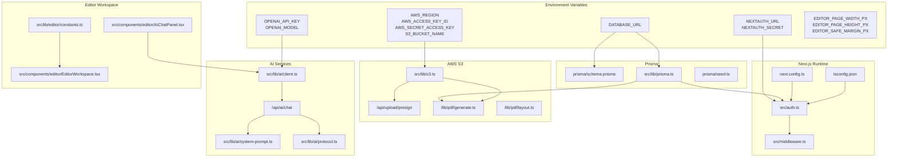
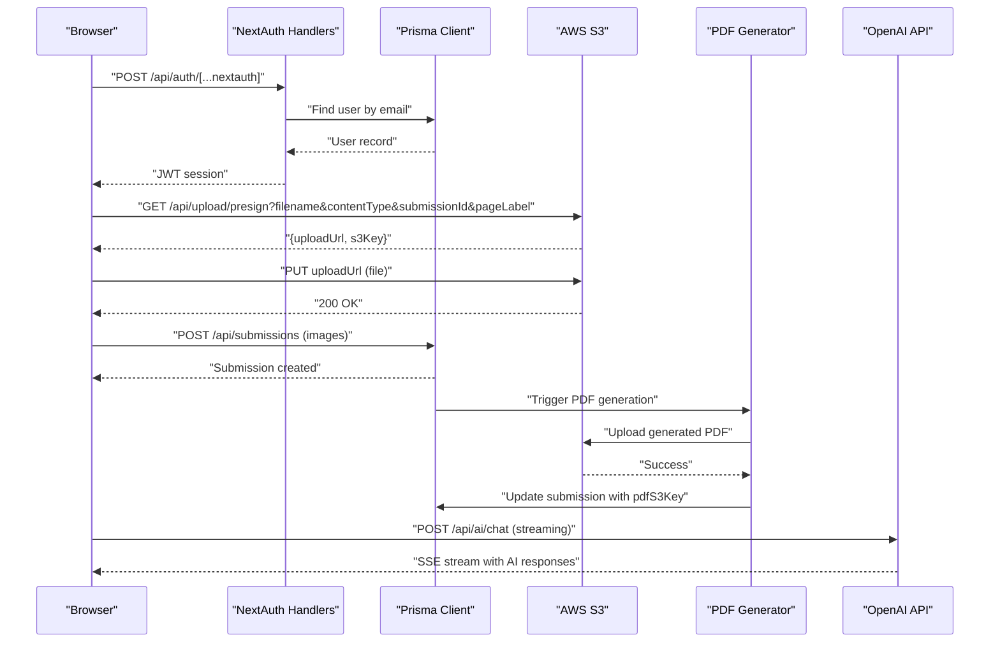

# Configuration & Environment

<cite>
**Referenced Files in This Document**
- [package.json](file://package.json)
- [next.config.ts](file://next.config.ts)
- [tsconfig.json](file://tsconfig.json)
- [prisma/schema.prisma](file://prisma/schema.prisma)
- [prisma/seed.ts](file://prisma/seed.ts)
- [src/lib/prisma.ts](file://src/lib/prisma.ts)
- [src/lib/s3.ts](file://src/lib/s3.ts)
- [src/auth.ts](file://src/auth.ts)
- [src/middleware.ts](file://src/middleware.ts)
- [src/app/api/auth/[...nextauth]/route.ts](file://src/app/api/auth/[...nextauth]/route.ts)
- [src/app/api/upload/presign/route.ts](file://src/app/api/upload/presign/route.ts)
- [src/app/api/submissions/route.ts](file://src/app/api/submissions/route.ts)
- [src/components/auth/LoginForm.tsx](file://src/components/auth/LoginForm.tsx)
- [src/components/create/ImageUploader.tsx](file://src/components/create/ImageUploader.tsx)
- [src/lib/constants.ts](file://src/lib/constants.ts)
- [src/lib/pdf/generate.ts](file://src/lib/pdf/generate.ts)
- [src/lib/pdf/layout.ts](file://src/lib/pdf/layout.ts)
- [src/lib/ai/client.ts](file://src/lib/ai/client.ts)
- [src/lib/ai/system-prompt.ts](file://src/lib/ai/system-prompt.ts)
- [src/lib/ai/protocol.ts](file://src/lib/ai/protocol.ts)
- [src/app/api/ai/chat/route.ts](file://src/app/api/ai/chat/route.ts)
- [src/components/editor/EditorWorkspace.tsx](file://src/components/editor/EditorWorkspace.tsx)
- [src/components/editor/AiChatPanel.tsx](file://src/components/editor/AiChatPanel.tsx)
- [src/lib/editor/constants.ts](file://src/lib/editor/constants.ts)
- [README.md](file://README.md)
</cite>

## Update Summary
**Changes Made**
- Added comprehensive AI service configuration documentation for OpenAI integration
- Documented new PDF generation settings and layout specifications
- Updated S3 credentials configuration with detailed security requirements
- Enhanced editor workspace parameters including page dimensions and safety margins
- Added AI chat panel configuration and rate limiting settings
- Expanded environment variable reference with new AI and editor-specific variables

## Table of Contents
1. [Introduction](#introduction)
2. [Project Structure](#project-structure)
3. [Core Components](#core-components)
4. [Architecture Overview](#architecture-overview)
5. [Detailed Component Analysis](#detailed-component-analysis)
6. [Dependency Analysis](#dependency-analysis)
7. [Performance Considerations](#performance-considerations)
8. [Troubleshooting Guide](#troubleshooting-guide)
9. [Conclusion](#conclusion)
10. [Appendices](#appendices)

## Introduction
This document provides comprehensive configuration and environment documentation for Titchybook Creator. It covers environment variables for database connections, AWS S3, NextAuth, AI services, and application settings; Next.js and TypeScript configuration; Prisma setup for schema and migrations; AWS S3 integration and security; authentication and authorization; AI service configuration for OpenAI integration; editor workspace parameters; PDF generation pipeline; and deployment considerations with operational best practices.

## Project Structure
The project is a Next.js 16 application using TypeScript, Prisma for database access, NextAuth v5 for authentication, AWS SDK for S3 integration, and OpenAI for AI-powered features. Configuration is primarily driven by environment variables loaded at runtime and validated through runtime checks and schema validation.

**Diagram sources**
- [next.config.ts:1-8](file://next.config.ts#L1-L8)
- [tsconfig.json:1-35](file://tsconfig.json#L1-L35)
- [prisma/schema.prisma:1-48](file://prisma/schema.prisma#L1-L48)
- [src/lib/prisma.ts:1-10](file://src/lib/prisma.ts#L1-L10)
- [prisma/seed.ts:1-36](file://prisma/seed.ts#L1-L36)
- [src/lib/s3.ts:1-81](file://src/lib/s3.ts#L1-L81)
- [src/auth.ts:1-80](file://src/auth.ts#L1-L80)
- [src/middleware.ts:1-6](file://src/middleware.ts#L1-L6)
- [src/app/api/upload/presign/route.ts:1-38](file://src/app/api/upload/presign/route.ts#L1-L38)
- [src/lib/pdf/generate.ts:1-112](file://src/lib/pdf/generate.ts#L1-L112)
- [src/lib/pdf/layout.ts:1-105](file://src/lib/pdf/layout.ts#L1-L105)
- [src/lib/ai/client.ts:1-26](file://src/lib/ai/client.ts#L1-L26)
- [src/app/api/ai/chat/route.ts:1-142](file://src/app/api/ai/chat/route.ts#L1-L142)
- [src/lib/ai/system-prompt.ts:1-92](file://src/lib/ai/system-prompt.ts#L1-L92)
- [src/lib/ai/protocol.ts:1-56](file://src/lib/ai/protocol.ts#L1-L56)
- [src/lib/editor/constants.ts:1-21](file://src/lib/editor/constants.ts#L1-L21)
- [src/components/editor/EditorWorkspace.tsx:1-800](file://src/components/editor/EditorWorkspace.tsx#L1-L800)
- [src/components/editor/AiChatPanel.tsx:1-569](file://src/components/editor/AiChatPanel.tsx#L1-L569)

**Section sources**
- [README.md:1-37](file://README.md#L1-L37)
- [package.json:1-48](file://package.json#L1-L48)
- [next.config.ts:1-8](file://next.config.ts#L1-L8)
- [tsconfig.json:1-35](file://tsconfig.json#L1-L35)

## Core Components
- Database connection via Prisma using an environment-driven datasource URL
- Authentication via NextAuth with JWT strategy and credentials provider
- AWS S3 integration for signed uploads and downloads, with presigned URLs for secure client-side uploads
- PDF generation pipeline that composes images into an A4 landscape PDF with precise layout specifications and stores it in S3
- AI service integration with OpenAI for creative writing assistance and content generation
- Editor workspace with configurable page dimensions, safety margins, and template system
- Middleware enforcing protected routes for dashboard, creation, and admin areas

**Section sources**
- [prisma/schema.prisma:1-48](file://prisma/schema.prisma#L1-L48)
- [src/lib/prisma.ts:1-10](file://src/lib/prisma.ts#L1-L10)
- [src/auth.ts:1-80](file://src/auth.ts#L1-L80)
- [src/lib/s3.ts:1-81](file://src/lib/s3.ts#L1-L81)
- [src/lib/pdf/generate.ts:1-112](file://src/lib/pdf/generate.ts#L1-L112)
- [src/lib/pdf/layout.ts:1-105](file://src/lib/pdf/layout.ts#L1-L105)
- [src/lib/ai/client.ts:1-26](file://src/lib/ai/client.ts#L1-L26)
- [src/lib/editor/constants.ts:1-21](file://src/lib/editor/constants.ts#L1-L21)
- [src/middleware.ts:1-6](file://src/middleware.ts#L1-L6)

## Architecture Overview
The application relies on environment variables for external configuration. Authentication is handled by NextAuth, which integrates with the Prisma user model. S3 operations are performed through the AWS SDK with presigned URLs to offload uploads to the cloud. PDF generation is triggered after submission creation and updates the database with the generated PDF key. AI services provide creative writing assistance through OpenAI integration with rate limiting and structured response parsing.

**Diagram sources**
- [src/app/api/auth/[...nextauth]/route.ts](file://src/app/api/auth/[...nextauth]/route.ts#L1-L4)
- [src/auth.ts:1-80](file://src/auth.ts#L1-L80)
- [src/lib/prisma.ts:1-10](file://src/lib/prisma.ts#L1-L10)
- [src/app/api/upload/presign/route.ts:1-38](file://src/app/api/upload/presign/route.ts#L1-L38)
- [src/lib/s3.ts:1-81](file://src/lib/s3.ts#L1-L81)
- [src/app/api/submissions/route.ts:1-96](file://src/app/api/submissions/route.ts#L1-L96)
- [src/lib/pdf/generate.ts:1-112](file://src/lib/pdf/generate.ts#L1-L112)
- [src/app/api/ai/chat/route.ts:1-142](file://src/app/api/ai/chat/route.ts#L1-L142)

## Detailed Component Analysis

### Environment Variables and Secrets
- Database
  - DATABASE_URL: Points to the database provider and connection string. The schema defines the provider and reads the URL from the environment.
- AWS S3
  - AWS_REGION: Region for S3 client initialization.
  - AWS_ACCESS_KEY_ID and AWS_SECRET_ACCESS_KEY: Credentials for S3 client.
  - S3_BUCKET_NAME: Target bucket for uploads and PDF storage.
- NextAuth
  - NEXTAUTH_URL: Base URL for NextAuth endpoints.
  - NEXTAUTH_SECRET: Secret used to encrypt JWT tokens.
- AI Services
  - OPENAI_API_KEY: OpenAI API key for AI assistant functionality.
  - OPENAI_MODEL: OpenAI model to use (defaults to gpt-4o if not specified).
- Editor Workspace
  - EDITOR_PAGE_WIDTH_PX: Width of editor pages in pixels (default: 700).
  - EDITOR_PAGE_HEIGHT_PX: Height of editor pages in pixels (default: 1000).
  - EDITOR_SAFE_MARGIN_PX: Safe margin around editor content in pixels (default: 12).
- Application
  - ADMIN_EMAIL and ADMIN_PASSWORD: Used by the seed script to provision an initial admin user.

Validation and usage occur at runtime:
- S3 client initialization requires all AWS_* variables.
- Prisma client initialization reads DATABASE_URL.
- NextAuth requires NEXTAUTH_URL and NEXTAUTH_SECRET.
- AI client initialization requires OPENAI_API_KEY and validates it's not the placeholder value.
- Seed script conditionally uses ADMIN_EMAIL and ADMIN_PASSWORD.

Security considerations:
- Never commit secrets to version control.
- Use platform-managed secrets for deployments (e.g., Vercel, Docker, CI/CD).
- Restrict AWS credentials to least privilege and dedicated IAM user/role.
- AI API keys should be stored securely and rotated periodically.

**Section sources**
- [prisma/schema.prisma:5-8](file://prisma/schema.prisma#L5-L8)
- [src/lib/prisma.ts:1-10](file://src/lib/prisma.ts#L1-L10)
- [src/lib/s3.ts:8-14](file://src/lib/s3.ts#L8-L14)
- [src/auth.ts:27-64](file://src/auth.ts#L27-L64)
- [prisma/seed.ts:7-25](file://prisma/seed.ts#L7-L25)
- [src/lib/ai/client.ts:5-25](file://src/lib/ai/client.ts#L5-L25)
- [src/lib/editor/constants.ts:3-21](file://src/lib/editor/constants.ts#L3-L21)

### Next.js Configuration
- next.config.ts: Empty default configuration indicates minimal overrides. Add optimization flags here if needed (e.g., experimental settings, output traces).
- Middleware: Uses NextAuth middleware to protect routes under specific paths.

Recommendations:
- Enable output traces for production builds to analyze bundle size.
- Consider enabling the React Server Components optimizer if not already enabled by the Next.js version.

**Section sources**
- [next.config.ts:1-8](file://next.config.ts#L1-L8)
- [src/middleware.ts:1-6](file://src/middleware.ts#L1-L6)

### TypeScript Configuration
- Strict mode enabled for robust type checking.
- Bundler module resolution for ESM compatibility.
- Path aliases (@/*) mapped to src/.
- Incremental compilation enabled for faster builds.

Recommendations:
- Keep strict mode enabled.
- Pin TypeScript and ESLint versions to match the project's lockfile.
- Add tsconfig paths to IDE settings for accurate imports.

**Section sources**
- [tsconfig.json:1-35](file://tsconfig.json#L1-L35)

### Prisma Configuration and Schema
- Provider: sqlite.
- Datasource URL sourced from DATABASE_URL.
- Models:
  - User: email, passwordHash, name, role, timestamps.
  - Submission: belongs to User, status, optional pdfS3Key, rejectionReason, timestamps.
  - SubmissionImage: belongs to Submission, pageLabel, s3Key, order, filenames, mime types, timestamps.
- Indexes: composite indexes on foreign keys for efficient joins.

Initialization:
- Global singleton pattern prevents multiple Prisma clients in development.
- Seed script creates an admin user if not present, using ADMIN_EMAIL and ADMIN_PASSWORD.

Migrations:
- Migrations are managed under prisma/migrations with a lock file ensuring safe concurrent runs.

**Section sources**
- [prisma/schema.prisma:1-48](file://prisma/schema.prisma#L1-L48)
- [src/lib/prisma.ts:1-10](file://src/lib/prisma.ts#L1-L10)
- [prisma/seed.ts:1-36](file://prisma/seed.ts#L1-L36)

### AWS S3 Integration
- Client initialization: region and credentials from environment variables.
- Bucket name from environment variable.
- Presigned URLs:
  - Upload: PUT URL with 10-minute expiry.
  - Download: GET URL with 1-hour expiry.
- Upload/download helpers:
  - uploadToS3 and downloadFromS3 for programmatic operations.
  - Key builders:
    - buildUploadKey: uploads/<userId>/<submissionId>/<pageLabel>.<ext>
    - buildPdfKey: pdfs/<userId>/<submissionId>/titchybook.pdf
- API endpoint:
  - GET /api/upload/presign validates content type against accepted image types and constructs S3 key before returning presigned URL.

Security:
- Presigned URLs limit exposure of long-lived credentials.
- Content-type validation reduces risk of malicious uploads.
- Bucket policies should restrict access to authorized users and roles.

**Section sources**
- [src/lib/s3.ts:1-81](file://src/lib/s3.ts#L1-L81)
- [src/app/api/upload/presign/route.ts:1-38](file://src/app/api/upload/presign/route.ts#L1-L38)
- [src/lib/constants.ts:52-59](file://src/lib/constants.ts#L52-L59)

### NextAuth Configuration
- Provider: Credentials with email and password fields.
- Authorization: Queries Prisma for user by email, compares hashed password.
- Session strategy: JWT with callbacks to attach user id and role to token/session.
- Pages: Login page mapped to /login.
- API: Exposed via /api/auth/[...nextauth].

Security:
- Password hashing is handled by bcryptjs.
- JWT encryption depends on NEXTAUTH_SECRET.
- Ensure NEXTAUTH_URL matches deployed domain.

**Section sources**
- [src/auth.ts:1-80](file://src/auth.ts#L1-L80)
- [src/app/api/auth/[...nextauth]/route.ts](file://src/app/api/auth/[...nextauth]/route.ts#L1-L4)
- [src/components/auth/LoginForm.tsx:1-86](file://src/components/auth/LoginForm.tsx#L1-L86)

### AI Service Configuration
- OpenAI Integration:
  - API Key validation prevents usage of placeholder keys.
  - Model selection with fallback to gpt-4o.
  - Client initialization with proper error handling.
- System Prompt Engineering:
  - Comprehensive context building including book title, active page, and page summaries.
  - Structured response format with JSON schema validation.
  - Page-specific content guidelines and constraints.
- Chat Endpoint:
  - Streaming response support with Server-Sent Events.
  - Per-user rate limiting (2-second minimum between requests).
  - Request validation with Zod schemas.
  - Context-aware conversation handling.

Configuration Requirements:
- OPENAI_API_KEY: Required for AI functionality.
- OPENAI_MODEL: Optional, defaults to gpt-4o if not specified.
- Rate limiting: Built-in 2-second minimum interval per user.

**Section sources**
- [src/lib/ai/client.ts:1-26](file://src/lib/ai/client.ts#L1-L26)
- [src/lib/ai/system-prompt.ts:1-92](file://src/lib/ai/system-prompt.ts#L1-L92)
- [src/lib/ai/protocol.ts:1-56](file://src/lib/ai/protocol.ts#L1-L56)
- [src/app/api/ai/chat/route.ts:1-142](file://src/app/api/ai/chat/route.ts#L1-L142)

### Editor Workspace Parameters
- Page Dimensions:
  - EDITOR_PAGE_WIDTH_PX: 700 pixels (A7 size approximation).
  - EDITOR_PAGE_HEIGHT_PX: 1000 pixels (A7 size approximation).
- Safety Margins:
  - EDITOR_SAFE_MARGIN_PX: 12 pixels on all sides for content safety.
- Scene Versioning:
  - EDITOR_SCENE_VERSION: 1 for schema compatibility.
- Branding Elements:
  - BACK_COVER_BRAND_TEXT: "www.titchybooks.com" for printed branding.
  - BACK_COVER_BRAND_BAND_PX: 60 pixels reserved for branding strip.
- Element Limits:
  - EDITOR_MAX_ELEMENTS_PER_PAGE: 100 elements per page for performance.
- Submission Mode:
  - EDITOR_SUBMISSION_MODE: Fixed to EDITOR mode for workspace.

Template System:
- Page-based element management with template merging.
- User-level text overrides for template elements.
- Locked template layers vs editable admin layers.

**Section sources**
- [src/lib/editor/constants.ts:1-21](file://src/lib/editor/constants.ts#L1-L21)
- [src/components/editor/EditorWorkspace.tsx:1-800](file://src/components/editor/EditorWorkspace.tsx#L1-L800)

### PDF Generation Pipeline
- Layout Specifications:
  - A4 landscape orientation with precise millimeter measurements.
  - TARGET_DPI: 300 for high-quality printing.
  - PANELS array defines 8-page layout with specific coordinates and rotations.
- Generation Process:
  - Triggers after submission creation.
  - Sets submission status to PROCESSING during generation.
  - Downloads required images from S3, processes them, composes PDF with layout specifications.
  - Uploads final PDF to S3 and updates submission with pdfS3Key.
  - Resets status to PENDING after completion.

Layout Details:
- Front cover (PAGE_2) and back cover (FRONT_COVER) in top row.
- Interior pages (PAGE_3 through PAGE_7) arranged with specific positioning.
- Bottom row contains rotated pages (180-degree) for proper printing alignment.
- Safe margins and precise measurements ensure professional print quality.

**Section sources**
- [src/app/api/submissions/route.ts:35-96](file://src/app/api/submissions/route.ts#L35-L96)
- [src/lib/pdf/generate.ts:1-112](file://src/lib/pdf/generate.ts#L1-L112)
- [src/lib/pdf/layout.ts:1-105](file://src/lib/pdf/layout.ts#L1-L105)

### Client-Side Upload Flow
- Validates file type and size against ACCEPTED_IMAGE_TYPES and MAX_FILE_SIZE.
- Requests a presigned upload URL from the backend.
- Uploads directly to S3 using the returned URL.
- On success, notifies parent component with s3Key.

**Section sources**
- [src/components/create/ImageUploader.tsx:1-148](file://src/components/create/ImageUploader.tsx#L1-L148)
- [src/app/api/upload/presign/route.ts:1-38](file://src/app/api/upload/presign/route.ts#L1-L38)
- [src/lib/constants.ts:52-59](file://src/lib/constants.ts#L52-L59)

## Dependency Analysis
External dependencies relevant to configuration:
- next: Application runtime and routing.
- next-auth: Authentication framework.
- @prisma/client: Database client.
- @aws-sdk/client-s3 and @aws-sdk/s3-request-presigner: S3 operations and presigned URLs.
- pdf-lib: PDF composition.
- sharp: Image processing.
- bcryptjs: Password hashing.
- dotenv: Seed script support.
- openai: AI service integration.
- react-markdown: Markdown rendering for AI responses.
- konva/react-konva: Canvas-based editor components.

Build and dev dependencies include TypeScript, ESLint, Tailwind, and Prisma CLI.

**Section sources**
- [package.json:11-48](file://package.json#L11-L48)

## Performance Considerations
- Use presigned uploads to reduce server bandwidth and latency.
- Parallelize S3 downloads and image processing for PDF generation.
- Keep TypeScript strict mode enabled to catch performance-related type issues early.
- Consider enabling Next.js output tracing for production builds to analyze bundle composition.
- Optimize image sizes and formats on the client before upload to minimize S3 costs and processing time.
- Implement rate limiting for AI services to prevent abuse and control costs.
- Cache frequently accessed template elements to improve editor responsiveness.
- Use streaming responses for AI chat to provide immediate feedback to users.

## Troubleshooting Guide
Common issues and resolutions:
- Authentication fails
  - Verify NEXTAUTH_URL and NEXTAUTH_SECRET are set and correct.
  - Ensure user exists in the database with a valid password hash.
- Unauthorized on protected routes
  - Confirm middleware matcher targets the intended paths and NextAuth is initialized.
- S3 upload failures
  - Check AWS_REGION, AWS_ACCESS_KEY_ID, AWS_SECRET_ACCESS_KEY, and S3_BUCKET_NAME.
  - Validate content type against accepted image types.
  - Ensure presigned URL is requested with required parameters.
- PDF generation errors
  - Confirm all 8 page labels are present and images are uploaded.
  - Verify S3 connectivity and permissions for the bucket.
  - Check PDF layout specifications and DPI settings.
- AI service configuration errors
  - Ensure OPENAI_API_KEY is properly set and not the placeholder value.
  - Verify OPENAI_MODEL is supported by the API.
  - Check rate limiting constraints and user permissions.
- Editor workspace issues
  - Verify editor constants are properly configured.
  - Check page dimensions and safety margins.
  - Ensure template system is functioning correctly.
- Prisma connection errors
  - Ensure DATABASE_URL points to a valid sqlite path or external database.
  - Run migrations if schema changes are detected.

**Section sources**
- [src/auth.ts:27-64](file://src/auth.ts#L27-L64)
- [src/middleware.ts:3-5](file://src/middleware.ts#L3-L5)
- [src/lib/s3.ts:8-14](file://src/lib/s3.ts#L8-L14)
- [src/app/api/upload/presign/route.ts:18-30](file://src/app/api/upload/presign/route.ts#L18-L30)
- [src/lib/pdf/generate.ts:23-30](file://src/lib/pdf/generate.ts#L23-L30)
- [src/lib/pdf/layout.ts:14-16](file://src/lib/pdf/layout.ts#L14-L16)
- [src/lib/ai/client.ts:7-12](file://src/lib/ai/client.ts#L7-L12)
- [src/lib/editor/constants.ts:3-21](file://src/lib/editor/constants.ts#L3-L21)
- [prisma/schema.prisma:5-8](file://prisma/schema.prisma#L5-L8)

## Conclusion
Titchybook Creator's configuration is driven by environment variables and modularized libraries with comprehensive AI and editor workspace capabilities. By securing secrets, validating inputs, leveraging presigned URLs, configuring AI services properly, and setting appropriate editor parameters, the system achieves a balance between developer productivity and operational safety. The addition of AI services, detailed PDF layout specifications, and enhanced editor workspace parameters provides a robust foundation for creative book creation with professional print quality output.

## Appendices

### Environment Variable Reference
- Database
  - DATABASE_URL: Database connection string/provider.
- AWS S3
  - AWS_REGION: AWS region for S3 client.
  - AWS_ACCESS_KEY_ID: Access key ID for S3.
  - AWS_SECRET_ACCESS_KEY: Secret access key for S3.
  - S3_BUCKET_NAME: Target S3 bucket.
- NextAuth
  - NEXTAUTH_URL: Base URL for NextAuth endpoints.
  - NEXTAUTH_SECRET: Secret for JWT encryption.
- AI Services
  - OPENAI_API_KEY: OpenAI API key for AI assistant.
  - OPENAI_MODEL: OpenAI model to use (defaults to gpt-4o).
- Editor Workspace
  - EDITOR_PAGE_WIDTH_PX: Editor page width in pixels (default: 700).
  - EDITOR_PAGE_HEIGHT_PX: Editor page height in pixels (default: 1000).
  - EDITOR_SAFE_MARGIN_PX: Safe margin in pixels (default: 12).
- Application
  - ADMIN_EMAIL: Seed script admin email override.
  - ADMIN_PASSWORD: Seed script admin password override.

**Section sources**
- [prisma/schema.prisma:5-8](file://prisma/schema.prisma#L5-L8)
- [src/lib/s3.ts:8-14](file://src/lib/s3.ts#L8-L14)
- [src/auth.ts:27-64](file://src/auth.ts#L27-L64)
- [prisma/seed.ts:7-25](file://prisma/seed.ts#L7-L25)
- [src/lib/ai/client.ts:18-20](file://src/lib/ai/client.ts#L18-L20)
- [src/lib/editor/constants.ts:3-21](file://src/lib/editor/constants.ts#L3-L21)

### AI Service Configuration Details
- Rate Limiting: 2-second minimum interval between AI requests per user.
- Response Format: JSON schema validation with structured suggestions.
- Content Limits: Maximum 5000 characters per suggestion, 500 characters per page suggestion.
- Model Selection: Defaults to gpt-4o with configurable override.
- Streaming Support: Real-time response delivery via Server-Sent Events.

**Section sources**
- [src/app/api/ai/chat/route.ts:28-55](file://src/app/api/ai/chat/route.ts#L28-L55)
- [src/lib/ai/protocol.ts:17-28](file://src/lib/ai/protocol.ts#L17-L28)
- [src/lib/ai/client.ts:18-20](file://src/lib/ai/client.ts#L18-L20)

### PDF Generation Settings
- Layout: A4 landscape orientation with 297mm × 210mm dimensions.
- DPI: 300 for high-quality printing.
- Page Count: 8 pages total (covers + 6 interior pages).
- Coordinates: Precise millimeter measurements with rotation support.
- Safety Margins: 12px safe margin for all pages.

**Section sources**
- [src/lib/pdf/layout.ts:14-20](file://src/lib/pdf/layout.ts#L14-L20)
- [src/lib/pdf/layout.ts:29-104](file://src/lib/pdf/layout.ts#L29-L104)

### Editor Workspace Parameters
- Page Dimensions: 700px × 1000px (A7 size approximation).
- Safe Margins: 12px on all sides.
- Element Limits: Maximum 100 elements per page.
- Branding: Reserved 60px band at bottom of back cover.
- Submission Mode: Fixed to EDITOR mode.
- Scene Version: Version 1 for schema compatibility.

**Section sources**
- [src/lib/editor/constants.ts:3-21](file://src/lib/editor/constants.ts#L3-L21)

### Deployment Checklist
- Set environment variables for database, AWS, NextAuth, AI services, and editor workspace.
- Configure IAM user/role with least privilege for S3 bucket access.
- Set up OpenAI API key with appropriate permissions and quotas.
- Configure editor workspace parameters for target device/browser compatibility.
- Run Prisma migrations prior to starting the server.
- Test authentication, upload flows, AI chat functionality, and PDF generation in staging.
- Monitor AI API usage, S3 storage costs, and PDF generation logs.
- Back up database regularly and review retention policies.
- Implement proper logging and monitoring for all external service integrations.