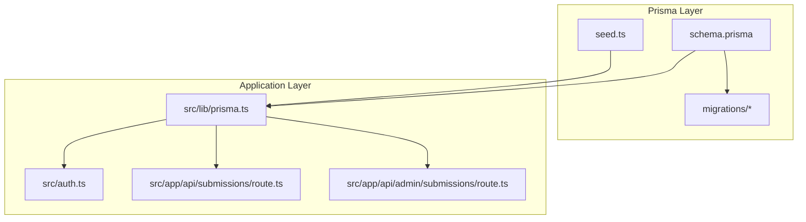
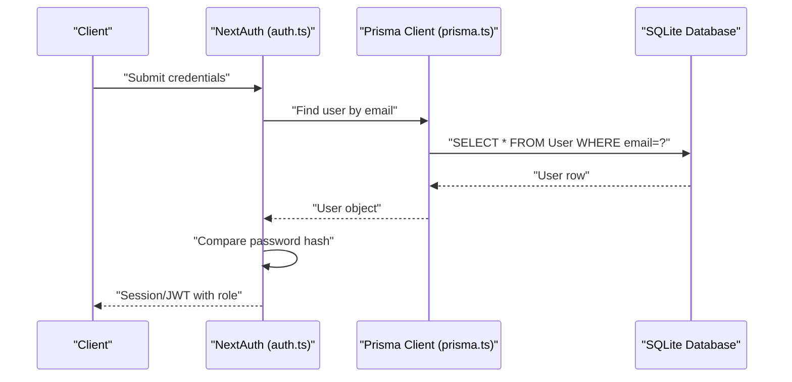
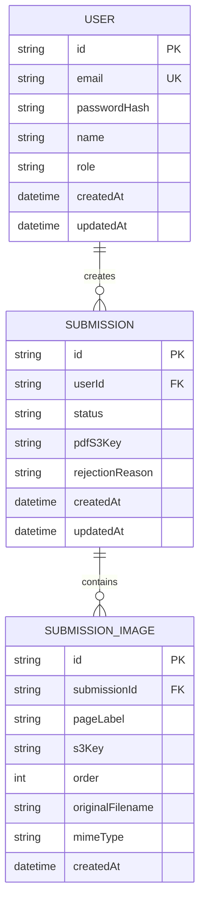
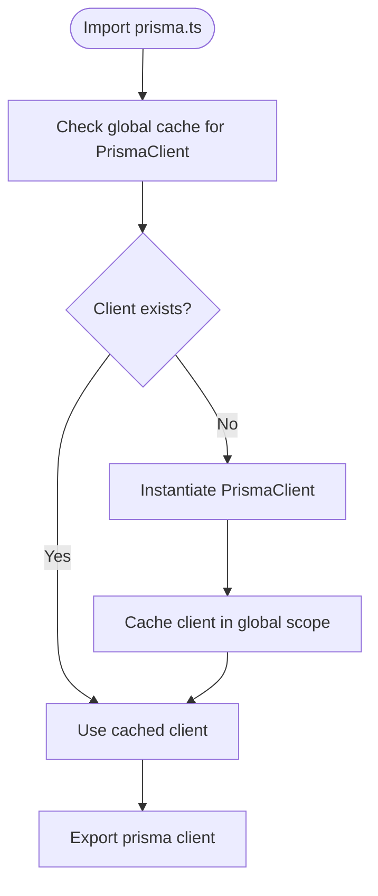
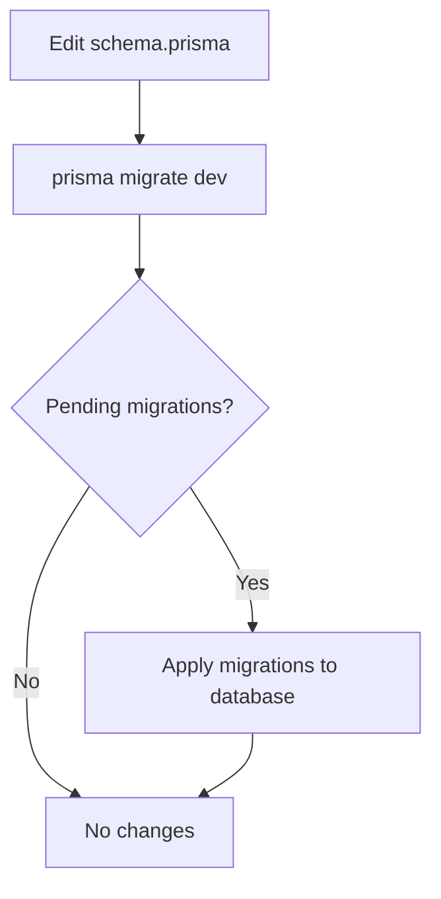
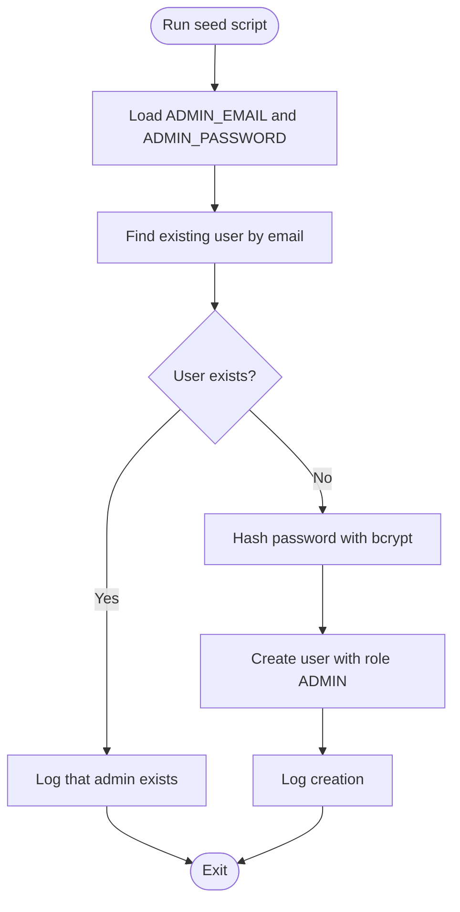
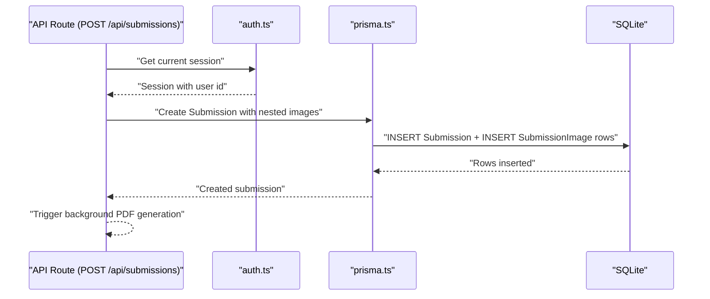
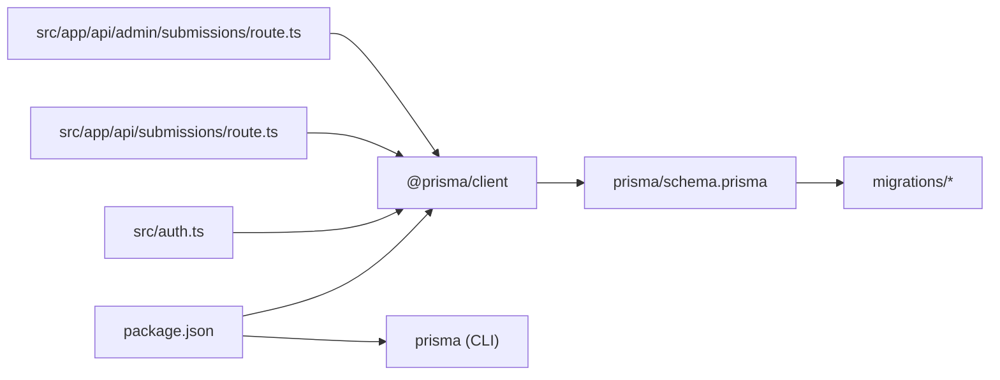

# Database & Prisma Setup

<cite>
**Referenced Files in This Document**
- [schema.prisma](file://prisma/schema.prisma)
- [prisma.ts](file://src/lib/prisma.ts)
- [seed.ts](file://prisma/seed.ts)
- [migration_lock.toml](file://prisma/migrations/migration_lock.toml)
- [20260316171130_init/migration.sql](file://prisma/migrations/20260316171130_init/migration.sql)
- [package.json](file://package.json)
- [auth.ts](file://src/auth.ts)
- [submissions route](file://src/app/api/submissions/route.ts)
- [admin submissions route](file://src/app/api/admin/submissions/route.ts)
</cite>

## Table of Contents
1. [Introduction](#introduction)
2. [Project Structure](#project-structure)
3. [Core Components](#core-components)
4. [Architecture Overview](#architecture-overview)
5. [Detailed Component Analysis](#detailed-component-analysis)
6. [Dependency Analysis](#dependency-analysis)
7. [Performance Considerations](#performance-considerations)
8. [Troubleshooting Guide](#troubleshooting-guide)
9. [Conclusion](#conclusion)
10. [Appendices](#appendices)

## Introduction
This document explains the database and Prisma configuration for Titchybook Creator. It covers the Prisma schema definition (models, relations, and data types), database connection setup, migration management, schema evolution, seed data setup, Prisma client initialization, transaction handling, and query optimization. It also provides guidance for development versus production environments, backup/recovery procedures, performance tuning, connection troubleshooting, and scaling considerations.

## Project Structure
The database and Prisma configuration is centered around:
- Prisma schema defining models and relations
- Migration files establishing the initial database structure
- Prisma client initialization for application usage
- Seed script to bootstrap admin users
- Application APIs that use the Prisma client

**Diagram sources**
- [schema.prisma:1-48](file://prisma/schema.prisma#L1-L48)
- [prisma.ts:1-10](file://src/lib/prisma.ts#L1-L10)
- [seed.ts:1-36](file://prisma/seed.ts#L1-L36)
- [20260316171130_init/migration.sql:1-45](file://prisma/migrations/20260316171130_init/migration.sql#L1-L45)
- [auth.ts:1-80](file://src/auth.ts#L1-L80)
- [submissions route:1-96](file://src/app/api/submissions/route.ts#L1-L96)
- [admin submissions route:1-38](file://src/app/api/admin/submissions/route.ts#L1-L38)

**Section sources**
- [schema.prisma:1-48](file://prisma/schema.prisma#L1-L48)
- [prisma.ts:1-10](file://src/lib/prisma.ts#L1-L10)
- [seed.ts:1-36](file://prisma/seed.ts#L1-L36)
- [20260316171130_init/migration.sql:1-45](file://prisma/migrations/20260316171130_init/migration.sql#L1-L45)
- [package.json:1-43](file://package.json#L1-L43)

## Core Components
- Prisma schema defines three models: User, Submission, and SubmissionImage, with explicit relations and indexes.
- The Prisma client is initialized once and reused across the app, with a singleton pattern to avoid multiple clients in development.
- Seed script creates a default admin user if one does not exist.
- Migrations lock the provider to SQLite and define the initial schema with indexes and foreign keys.

**Section sources**
- [schema.prisma:1-48](file://prisma/schema.prisma#L1-L48)
- [prisma.ts:1-10](file://src/lib/prisma.ts#L1-L10)
- [seed.ts:1-36](file://prisma/seed.ts#L1-L36)
- [migration_lock.toml:1-3](file://prisma/migrations/migration_lock.toml#L1-L3)
- [20260316171130_init/migration.sql:1-45](file://prisma/migrations/20260316171130_init/migration.sql#L1-L45)

## Architecture Overview
The application uses Prisma Client to interact with a SQLite database. Authentication integrates with the database via the Prisma client. API routes query and mutate data, and the seed script initializes administrative accounts.

**Diagram sources**
- [auth.ts:1-80](file://src/auth.ts#L1-L80)
- [prisma.ts:1-10](file://src/lib/prisma.ts#L1-L10)
- [schema.prisma:10-19](file://prisma/schema.prisma#L10-L19)

## Detailed Component Analysis

### Prisma Schema Definition
The schema defines:
- Provider: SQLite with DATABASE_URL from environment
- Generator: Prisma Client JS
- Models:
  - User: unique email, password hash, optional name, default role, timestamps
  - Submission: belongs to User, status, optional PDF S3 key and rejection reason, timestamps, indexed userId
  - SubmissionImage: belongs to Submission with cascade delete, metadata fields, timestamps, indexed submissionId

**Diagram sources**
- [schema.prisma:10-47](file://prisma/schema.prisma#L10-L47)

**Section sources**
- [schema.prisma:1-48](file://prisma/schema.prisma#L1-L48)

### Database Connection Setup
- Datasource provider is SQLite with url resolved from DATABASE_URL environment variable.
- The Prisma client is instantiated once and cached globally during development to prevent hot reload issues.

**Diagram sources**
- [prisma.ts:1-10](file://src/lib/prisma.ts#L1-L10)

**Section sources**
- [schema.prisma:5-8](file://prisma/schema.prisma#L5-L8)
- [prisma.ts:1-10](file://src/lib/prisma.ts#L1-L10)

### Migration Management and Schema Evolution
- Initial migration defines tables, primary keys, foreign keys, and indexes.
- Migration lock file confirms provider is SQLite.
- To evolve schema:
  - Modify schema.prisma
  - Run prisma migrate dev to create and apply a new migration
  - Use prisma migrate resolve to mark pending migrations as resolved if needed
  - Keep migrations under version control

**Diagram sources**
- [schema.prisma:1-48](file://prisma/schema.prisma#L1-L48)
- [20260316171130_init/migration.sql:1-45](file://prisma/migrations/20260316171130_init/migration.sql#L1-L45)
- [migration_lock.toml:1-3](file://prisma/migrations/migration_lock.toml#L1-L3)

**Section sources**
- [20260316171130_init/migration.sql:1-45](file://prisma/migrations/20260316171130_init/migration.sql#L1-L45)
- [migration_lock.toml:1-3](file://prisma/migrations/migration_lock.toml#L1-L3)
- [schema.prisma:1-48](file://prisma/schema.prisma#L1-L48)

### Seed Data Setup
- Seed script loads environment variables, checks for existing admin user, hashes password, and creates admin if missing.
- Seeding is configured via package.json prisma.seed script.

**Diagram sources**
- [seed.ts:1-36](file://prisma/seed.ts#L1-L36)
- [package.json:26-28](file://package.json#L26-L28)

**Section sources**
- [seed.ts:1-36](file://prisma/seed.ts#L1-L36)
- [package.json:26-28](file://package.json#L26-L28)

### Prisma Client Initialization and Usage
- Singleton client initialization prevents multiple clients in development.
- Authentication uses the client to fetch users and verify passwords.
- API routes use the client for queries and mutations, including transactions for creating submissions with associated images.

**Diagram sources**
- [submissions route:35-95](file://src/app/api/submissions/route.ts#L35-L95)
- [auth.ts:1-80](file://src/auth.ts#L1-L80)
- [prisma.ts:1-10](file://src/lib/prisma.ts#L1-L10)

**Section sources**
- [prisma.ts:1-10](file://src/lib/prisma.ts#L1-L10)
- [auth.ts:1-80](file://src/auth.ts#L1-L80)
- [submissions route:35-95](file://src/app/api/submissions/route.ts#L35-L95)

### Transaction Handling
- Submission creation uses Prisma’s atomic transaction to ensure images are created alongside the submission.
- Background PDF generation is initiated after successful submission creation without blocking the response.

**Section sources**
- [submissions route:63-88](file://src/app/api/submissions/route.ts#L63-L88)

### Query Optimization
- Indexes:
  - Unique index on User.email
  - Index on Submission.userId
  - Index on SubmissionImage.submissionId
- Queries leverage includes and ordering to minimize round trips and maintain predictable sorting.

**Section sources**
- [20260316171130_init/migration.sql:37-44](file://prisma/migrations/20260316171130_init/migration.sql#L37-L44)
- [schema.prisma:32-32](file://prisma/schema.prisma#L32-L32)
- [schema.prisma:46-46](file://prisma/schema.prisma#L46-L46)
- [submissions route:26-32](file://src/app/api/submissions/route.ts#L26-L32)
- [admin submissions route:17-24](file://src/app/api/admin/submissions/route.ts#L17-L24)

## Dependency Analysis
- Application dependencies include Prisma Client and Prisma CLI.
- The auth module depends on the Prisma client for user lookup and verification.
- API routes depend on the Prisma client for CRUD operations.

**Diagram sources**
- [package.json:11-42](file://package.json#L11-L42)
- [auth.ts:1-80](file://src/auth.ts#L1-L80)
- [submissions route:1-96](file://src/app/api/submissions/route.ts#L1-L96)
- [admin submissions route:1-38](file://src/app/api/admin/submissions/route.ts#L1-L38)
- [schema.prisma:1-48](file://prisma/schema.prisma#L1-L48)

**Section sources**
- [package.json:11-42](file://package.json#L11-L42)
- [auth.ts:1-80](file://src/auth.ts#L1-L80)
- [submissions route:1-96](file://src/app/api/submissions/route.ts#L1-L96)
- [admin submissions route:1-38](file://src/app/api/admin/submissions/route.ts#L1-L38)

## Performance Considerations
- SQLite is suitable for development and small-scale production but may require migration to a managed database for higher concurrency and scalability.
- Use indexes on frequently filtered or joined columns (already present on foreign keys).
- Batch operations and careful use of includes can reduce query count.
- Offload long-running tasks (like PDF generation) to background jobs or separate workers.

[No sources needed since this section provides general guidance]

## Troubleshooting Guide
- Database URL not set:
  - Ensure DATABASE_URL is defined in the environment.
- Multiple Prisma clients in development:
  - The singleton pattern in prisma.ts prevents multiple clients; verify NODE_ENV is correctly set.
- Authentication failures:
  - Confirm user exists and password hash comparison succeeds.
- Migration errors:
  - Review pending migrations and resolve with prisma migrate resolve if needed.
- Seed failures:
  - Check ADMIN_EMAIL and ADMIN_PASSWORD environment variables and ensure bcrypt hashing completes.

**Section sources**
- [prisma.ts:1-10](file://src/lib/prisma.ts#L1-L10)
- [auth.ts:35-58](file://src/auth.ts#L35-L58)
- [seed.ts:7-28](file://prisma/seed.ts#L7-L28)

## Conclusion
Titchybook Creator uses Prisma with a SQLite backend, a clean schema with explicit relations and indexes, and a singleton Prisma client. Authentication and API routes rely on the client for secure and efficient data access. For production, consider migrating to a managed database, implementing connection pooling, and adopting CI/CD for migrations and seeding.

[No sources needed since this section summarizes without analyzing specific files]

## Appendices

### Environment Variables
- DATABASE_URL: Points to the SQLite database file location.
- ADMIN_EMAIL and ADMIN_PASSWORD: Used by the seed script to create the initial admin user.

**Section sources**
- [schema.prisma:5-8](file://prisma/schema.prisma#L5-L8)
- [seed.ts:8-9](file://prisma/seed.ts#L8-L9)

### Backup and Recovery Procedures
- SQLite database file backup:
  - Copy the database file referenced by DATABASE_URL.
  - Schedule regular backups and store offsite.
- Recovery:
  - Restore the database file from the latest backup.
  - Re-run migrations if the schema changed since the backup.

[No sources needed since this section provides general guidance]

### Scaling Considerations
- Move from SQLite to a managed PostgreSQL or MySQL database for production.
- Enable Prisma connection pooling and configure pool sizes per environment.
- Monitor slow queries and add indexes as needed.
- Use read replicas for read-heavy workloads and implement caching for frequently accessed data.

[No sources needed since this section provides general guidance]