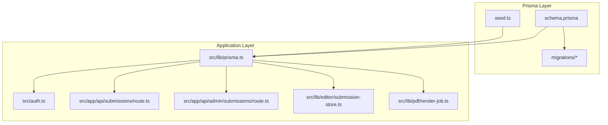
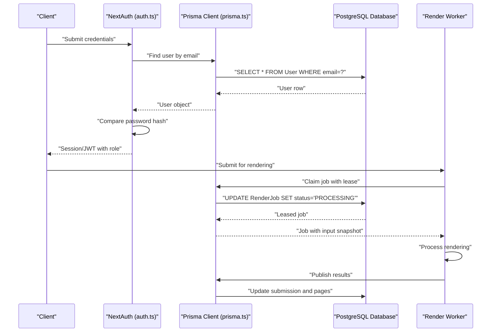
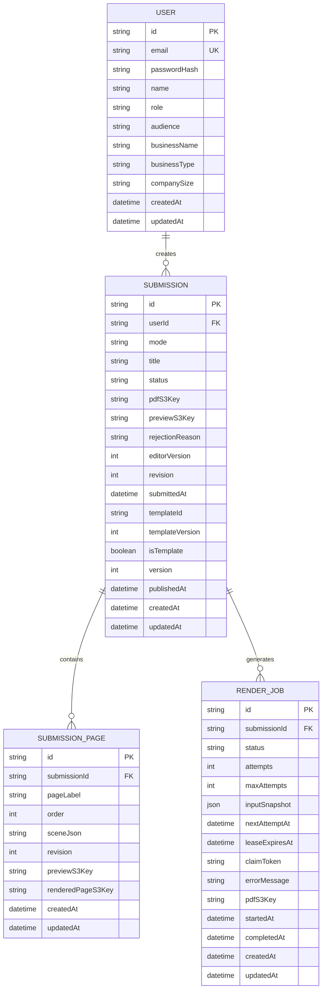
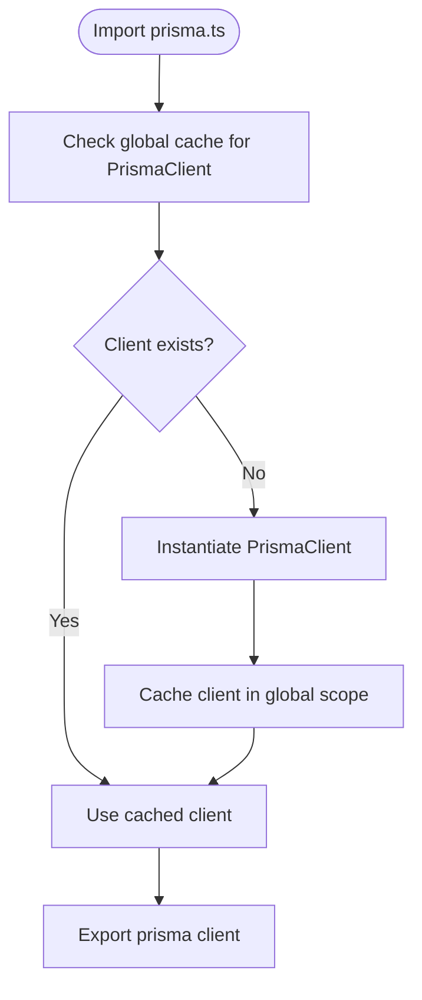
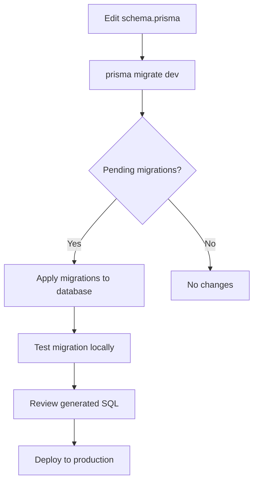
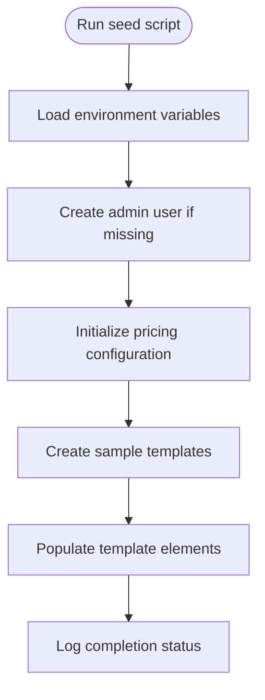
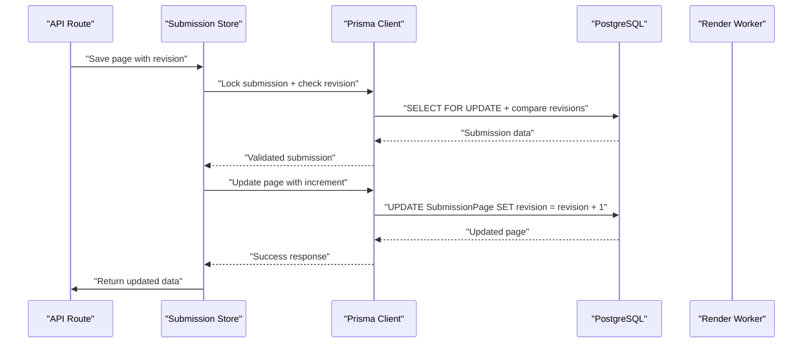
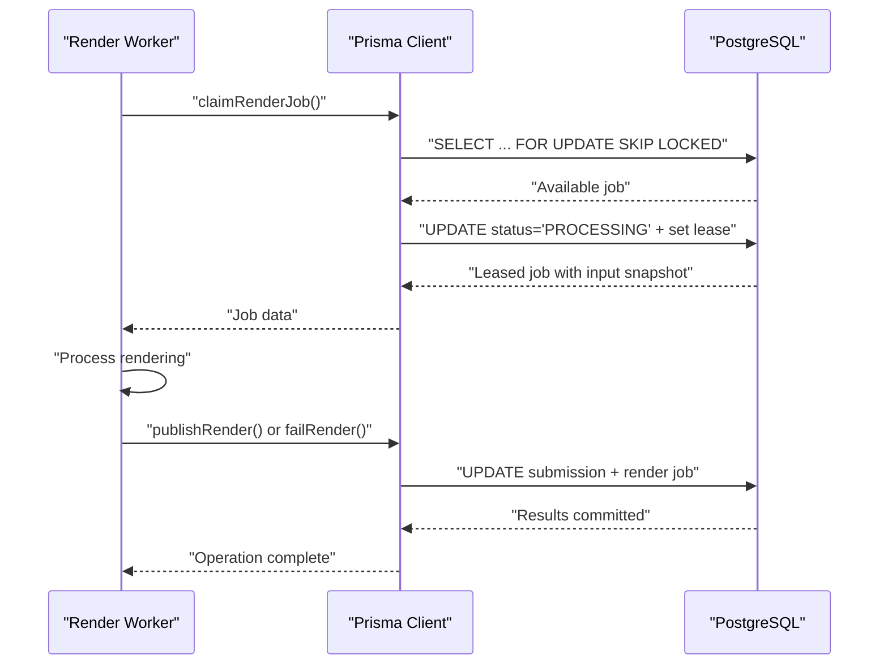
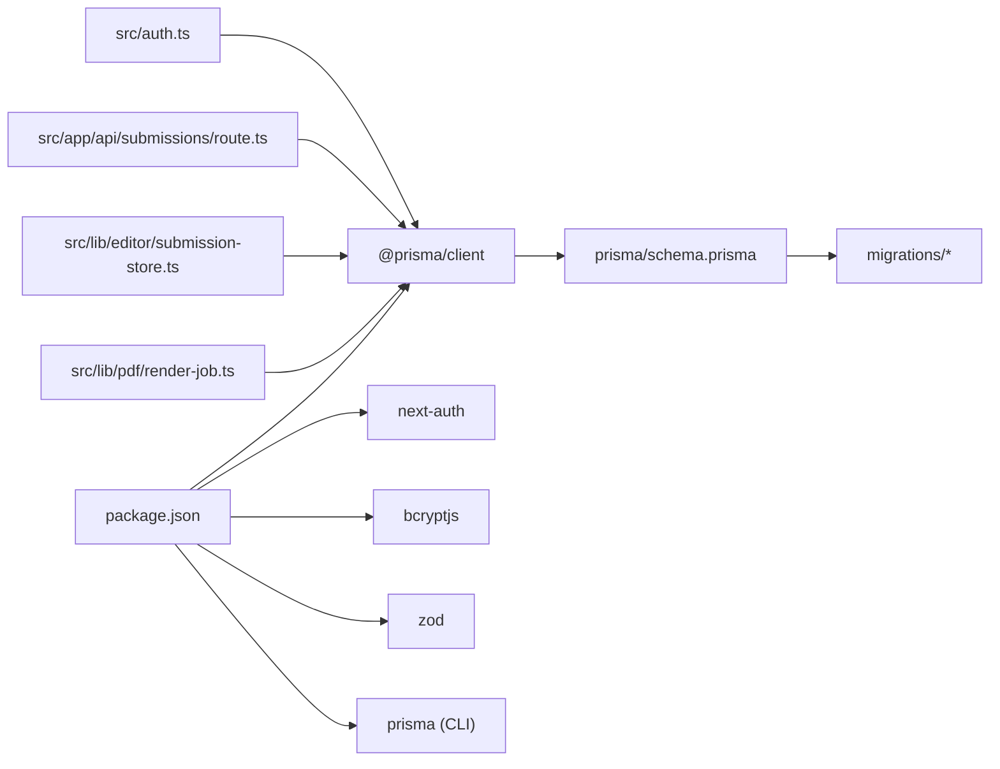

# Database & Prisma Setup

<cite>
**Referenced Files in This Document**
- [schema.prisma](file://prisma/schema.prisma)
- [prisma.ts](file://src/lib/prisma.ts)
- [seed.ts](file://prisma/seed.ts)
- [migration_lock.toml](file://prisma/migrations/migration_lock.toml)
- [20260601062824_init/migration.sql](file://prisma/migrations/20260601062824_init/migration.sql)
- [20260921091000_durable_queue_and_revisions/migration.sql](file://prisma/migrations/20260921091000_durable_queue_and_revisions/migration.sql)
- [20260921090000_repair_business_and_render_jobs/migration.sql](file://prisma/migrations/20260921090000_repair_business_and_render_jobs/migration.sql)
- [package.json](file://package.json)
- [auth.ts](file://src/auth.ts)
- [submissions route](file://src/app/api/submissions/route.ts)
- [admin submissions route](file://src/app/api/admin/submissions/route.ts)
- [submission-store.ts](file://src/lib/editor/submission-store.ts)
- [render-job.ts](file://src/lib/pdf/render-job.ts)
</cite>

## Update Summary
**Changes Made**
- Updated database schema section to reflect PostgreSQL provider and enhanced models
- Added new RenderJob model with durable queue fields (inputSnapshot, nextAttemptAt, leaseExpiresAt, claimToken)
- Added revision tracking for Submission and SubmissionPage models
- Updated migration management section with new durable queue migrations
- Enhanced performance considerations with new indexes for render job processing
- Added detailed documentation for the durable worker queue system

## Table of Contents
1. [Introduction](#introduction)
2. [Project Structure](#project-structure)
3. [Core Components](#core-components)
4. [Architecture Overview](#architecture-overview)
5. [Detailed Component Analysis](#detailed-component-analysis)
6. [Dependency Analysis](#dependency-analysis)
7. [Performance Considerations](#performance-considerations)
8. [Troubleshooting Guide](#troubleshooting-guide)
9. [Conclusion](#conclusion)
10. [Appendices](#appendices)

## Introduction
This document explains the database and Prisma configuration for Titchybook Creator. It covers the Prisma schema definition (models, relations, and data types), database connection setup, migration management, schema evolution, seed data setup, Prisma client initialization, transaction handling, and query optimization. The system now includes a robust durable queue system for background rendering jobs and comprehensive revision tracking for collaborative editing scenarios.

## Project Structure
The database and Prisma configuration is centered around:
- Prisma schema defining models and relations with PostgreSQL provider
- Migration files establishing the database structure with durable queue support
- Prisma client initialization for application usage
- Seed script to bootstrap admin users and templates
- Application APIs that use the Prisma client with optimistic locking

```mermaid
graph TB
subgraph "Prisma Layer"
Schema["schema.prisma"]
Migrations["migrations/*"]
Seed["seed.ts"]
end
subgraph "Application Layer"
PrismaClient["src/lib/prisma.ts"]
Auth["src/auth.ts"]
SubmissionsAPI["src/app/api/submissions/route.ts"]
AdminSubmissionsAPI["src/app/api/admin/submissions/route.ts"]
SubmissionStore["src/lib/editor/submission-store.ts"]
RenderJob["src/lib/pdf/render-job.ts"]
end
Schema --> Migrations
Schema --> PrismaClient
PrismaClient --> Auth
PrismaClient --> SubmissionsAPI
PrismaClient --> AdminSubmissionsAPI
PrismaClient --> SubmissionStore
PrismaClient --> RenderJob
Seed --> PrismaClient
```

**Diagram sources**
- [schema.prisma:1-240](file://prisma/schema.prisma#L1-L240)
- [prisma.ts:1-10](file://src/lib/prisma.ts#L1-L10)
- [seed.ts:1-350](file://prisma/seed.ts#L1-L350)
- [20260601062824_init/migration.sql:1-216](file://prisma/migrations/20260601062824_init/migration.sql#L1-L216)
- [20260921091000_durable_queue_and_revisions/migration.sql:1-10](file://prisma/migrations/20260921091000_durable_queue_and_revisions/migration.sql#L1-L10)
- [auth.ts:1-80](file://src/auth.ts#L1-L80)
- [submissions route:1-148](file://src/app/api/submissions/route.ts#L1-L148)
- [admin submissions route:1-38](file://src/app/api/admin/submissions/route.ts#L1-L38)
- [submission-store.ts:1-147](file://src/lib/editor/submission-store.ts#L1-L147)
- [render-job.ts:39-108](file://src/lib/pdf/render-job.ts#L39-L108)

**Section sources**
- [schema.prisma:1-240](file://prisma/schema.prisma#L1-L240)
- [prisma.ts:1-10](file://src/lib/prisma.ts#L1-L10)
- [seed.ts:1-350](file://prisma/seed.ts#L1-L350)
- [20260601062824_init/migration.sql:1-216](file://prisma/migrations/20260601062824_init/migration.sql#L1-L216)
- [package.json:1-62](file://package.json#L1-L62)

## Core Components
- **Enhanced Schema**: PostgreSQL-based schema with User, Submission, SubmissionImage, SubmissionPage, Asset, Order, TemplateElement, PricingConfig, VaultEntry, and RenderJob models
- **Durable Queue System**: RenderJob model with input snapshots, attempt tracking, lease management, and claim tokens for reliable background processing
- **Revision Tracking**: Optimistic locking with revision counters on both Submission and SubmissionPage models for concurrent editing safety
- **Performance Indexes**: Strategic indexing on frequently queried columns including composite indexes for render job scheduling
- **Singleton Client Pattern**: Prisma client initialized once and cached globally during development to prevent hot reload issues
- **Comprehensive Seeding**: Admin user creation, pricing configuration, and template seeding with realistic data

**Updated** Enhanced with durable queue capabilities and revision tracking for collaborative editing

**Section sources**
- [schema.prisma:10-240](file://prisma/schema.prisma#L10-L240)
- [prisma.ts:1-10](file://src/lib/prisma.ts#L1-L10)
- [seed.ts:1-350](file://prisma/seed.ts#L1-L350)
- [migration_lock.toml:1-3](file://prisma/migrations/migration_lock.toml#L1-L3)
- [20260601062824_init/migration.sql:1-216](file://prisma/migrations/20260601062824_init/migration.sql#L1-L216)
- [20260921091000_durable_queue_and_revisions/migration.sql:1-10](file://prisma/migrations/20260921091000_durable_queue_and_revisions/migration.sql#L1-L10)

## Architecture Overview
The application uses Prisma Client with PostgreSQL for robust data persistence. The architecture includes a sophisticated durable queue system for background PDF rendering with lease-based concurrency control and comprehensive revision tracking for collaborative editing scenarios.

```mermaid
sequenceDiagram
participant Client as "Client"
participant NextAuth as "NextAuth (auth.ts)"
participant Prisma as "Prisma Client (prisma.ts)"
participant DB as "PostgreSQL Database"
participant Worker as "Render Worker"
Client->>NextAuth : "Submit credentials"
NextAuth->>Prisma : "Find user by email"
Prisma->>DB : "SELECT * FROM User WHERE email=?"
DB-->>Prisma : "User row"
Prisma-->>NextAuth : "User object"
NextAuth->>NextAuth : "Compare password hash"
NextAuth-->>Client : "Session/JWT with role"
Client->>Worker : "Submit for rendering"
Worker->>Prisma : "Claim job with lease"
Prisma->>DB : "UPDATE RenderJob SET status='PROCESSING'"
DB-->>Prisma : "Leased job"
Prisma-->>Worker : "Job with input snapshot"
Worker->>Worker : "Process rendering"
Worker->>Prisma : "Publish results"
Prisma->>DB : "Update submission and pages"
```

**Diagram sources**
- [auth.ts:1-80](file://src/auth.ts#L1-L80)
- [prisma.ts:1-10](file://src/lib/prisma.ts#L1-L10)
- [schema.prisma:10-240](file://prisma/schema.prisma#L10-L240)
- [render-job.ts:39-108](file://src/lib/pdf/render-job.ts#L39-L108)

## Detailed Component Analysis

### Enhanced Prisma Schema Definition
The schema now defines ten core models with PostgreSQL provider:
- **User**: Enhanced with business registration fields (audience, businessName, businessType, companySize) and password reset functionality
- **Submission**: Includes revision tracking, template system fields, and relationships to multiple related entities
- **SubmissionImage**: Maintains image metadata with cascade delete relationships
- **SubmissionPage**: Features revision tracking, scene storage, and preview generation capabilities
- **Asset**: User-owned media assets with S3 integration
- **Order**: Comprehensive order management with vault storage add-ons and shipping details
- **TemplateElement**: Template-based element definitions with page-specific organization
- **PricingConfig**: Dynamic pricing configuration with currency rate management
- **VaultEntry**: Physical book storage management with withdrawal tracking
- **RenderJob**: Durable queue system with input snapshots, attempt tracking, and lease management

```mermaid
erDiagram
USER {
string id PK
string email UK
string passwordHash
string name
string role
string audience
string businessName
string businessType
string companySize
datetime createdAt
datetime updatedAt
}
SUBMISSION {
string id PK
string userId FK
string mode
string title
string status
string pdfS3Key
string previewS3Key
string rejectionReason
int editorVersion
int revision
datetime submittedAt
string templateId
int templateVersion
boolean isTemplate
int version
datetime publishedAt
datetime createdAt
datetime updatedAt
}
SUBMISSION_PAGE {
string id PK
string submissionId FK
string pageLabel
int order
string sceneJson
int revision
string previewS3Key
string renderedPageS3Key
datetime createdAt
datetime updatedAt
}
RENDER_JOB {
string id PK
string submissionId FK
string status
int attempts
int maxAttempts
json inputSnapshot
datetime nextAttemptAt
datetime leaseExpiresAt
string claimToken
string errorMessage
string pdfS3Key
datetime startedAt
datetime completedAt
datetime createdAt
datetime updatedAt
}
USER ||--o{ SUBMISSION : "creates"
SUBMISSION ||--o{ SUBMISSION_PAGE : "contains"
SUBMISSION ||--o{ RENDER_JOB : "generates"
```

**Diagram sources**
- [schema.prisma:10-240](file://prisma/schema.prisma#L10-L240)

**Updated** Enhanced with PostgreSQL provider, business registration fields, and comprehensive render job tracking

**Section sources**
- [schema.prisma:1-240](file://prisma/schema.prisma#L1-L240)

### Database Connection Setup
- **Provider**: PostgreSQL with url resolved from DATABASE_URL environment variable
- **Connection Management**: Singleton pattern prevents multiple clients in development environments
- **Environment Variables**: Supports standard PostgreSQL connection strings with SSL options

```mermaid
flowchart TD
Start(["Import prisma.ts"]) --> CheckGlobal["Check global cache for PrismaClient"]
CheckGlobal --> HasClient{"Client exists?"}
HasClient --> |Yes| UseClient["Use cached client"]
HasClient --> |No| NewClient["Instantiate PrismaClient"]
NewClient --> CacheClient["Cache client in global scope"]
CacheClient --> UseClient
UseClient --> Export["Export prisma client"]
```

**Diagram sources**
- [prisma.ts:1-10](file://src/lib/prisma.ts#L1-L10)

**Section sources**
- [schema.prisma:5-8](file://prisma/schema.prisma#L5-L8)
- [prisma.ts:1-10](file://src/lib/prisma.ts#L1-L10)

### Enhanced Migration Management and Schema Evolution
The migration history shows progressive enhancement from initial SQLite setup to production-ready PostgreSQL with advanced features:

1. **Initial Migration**: Base schema with User, Submission, SubmissionImage, SubmissionPage, Asset, Order, TemplateElement, and PricingConfig
2. **Password Reset Fields**: Added passwordResetToken and passwordResetExpires to User model
3. **Vault Storage**: Introduced VaultEntry table and related Order/PricingConfig enhancements
4. **Business Registration**: Added audience, businessName, businessType, and companySize fields to User
5. **Render Job Creation**: Created RenderJob table with basic job processing fields
6. **Durable Queue Enhancement**: Added inputSnapshot, nextAttemptAt, leaseExpiresAt, and claimToken fields with performance indexes

```mermaid
flowchart TD
EditSchema["Edit schema.prisma"] --> DevMigrate["prisma migrate dev"]
DevMigrate --> Pending{"Pending migrations?"}
Pending --> |Yes| ApplyMigrations["Apply migrations to database"]
Pending --> |No| Done["No changes"]
ApplyMigrations --> TestMigration["Test migration locally"]
TestMigration --> Review["Review generated SQL"]
Review --> Deploy["Deploy to production"]
```

**Diagram sources**
- [schema.prisma:1-240](file://prisma/schema.prisma#L1-L240)
- [20260601062824_init/migration.sql:1-216](file://prisma/migrations/20260601062824_init/migration.sql#L1-L216)
- [20260921091000_durable_queue_and_revisions/migration.sql:1-10](file://prisma/migrations/20260921091000_durable_queue_and_revisions/migration.sql#L1-L10)
- [migration_lock.toml:1-3](file://prisma/migrations/migration_lock.toml#L1-L3)

**Updated** Enhanced with PostgreSQL provider and comprehensive migration history supporting durable queue operations

**Section sources**
- [20260601062824_init/migration.sql:1-216](file://prisma/migrations/20260601062824_init/migration.sql#L1-L216)
- [20260921091000_durable_queue_and_revisions/migration.sql:1-10](file://prisma/migrations/20260921091000_durable_queue_and_revisions/migration.sql#L1-L10)
- [migration_lock.toml:1-3](file://prisma/migrations/migration_lock.toml#L1-L3)
- [schema.prisma:1-240](file://prisma/schema.prisma#L1-L240)

### Advanced Seed Data Setup
The seed script provides comprehensive initialization including:
- **Admin User Creation**: Secure admin account with hashed password
- **Pricing Configuration**: Default pricing tiers, weight bands, and currency rates
- **Template Templates**: Three sample templates (Birthday Card, Photo Journal, Minimalist Zine) with pre-populated elements
- **Template Elements**: Rich text and shape elements demonstrating template capabilities

```mermaid
flowchart TD
StartSeed(["Run seed script"]) --> LoadEnv["Load environment variables"]
LoadEnv --> SeedAdmin["Create admin user if missing"]
SeedAdmin --> SeedPricing["Initialize pricing configuration"]
SeedPricing --> SeedTemplates["Create sample templates"]
SeedTemplates --> CreateElements["Populate template elements"]
CreateElements --> LogComplete["Log completion status"]
```

**Diagram sources**
- [seed.ts:22-336](file://prisma/seed.ts#L22-L336)
- [package.json:41-43](file://package.json#L41-L43)

**Section sources**
- [seed.ts:1-350](file://prisma/seed.ts#L1-L350)
- [package.json:41-43](file://package.json#L41-L43)

### Enhanced Prisma Client Initialization and Usage
The application implements sophisticated transaction handling and optimistic locking:
- **Singleton Pattern**: Prevents multiple Prisma clients in development
- **Transaction Support**: Complex multi-step operations wrapped in transactions
- **Optimistic Locking**: Revision-based conflict detection for concurrent edits
- **Durable Queue Integration**: Background job processing with lease management

```mermaid
sequenceDiagram
participant Route as "API Route"
participant Store as "Submission Store"
participant Prisma as "Prisma Client"
participant DB as "PostgreSQL"
participant Worker as "Render Worker"
Route->>Store : "Save page with revision"
Store->>Prisma : "Lock submission + check revision"
Prisma->>DB : "SELECT FOR UPDATE + compare revisions"
DB-->>Prisma : "Submission data"
Prisma-->>Store : "Validated submission"
Store->>Prisma : "Update page with increment"
Prisma->>DB : "UPDATE SubmissionPage SET revision = revision + 1"
DB-->>Prisma : "Updated page"
Prisma-->>Store : "Success response"
Store->>Route : "Return updated data"
```

**Diagram sources**
- [submissions route:52-148](file://src/app/api/submissions/route.ts#L52-L148)
- [submission-store.ts:101-147](file://src/lib/editor/submission-store.ts#L101-L147)
- [prisma.ts:1-10](file://src/lib/prisma.ts#L1-L10)

**Updated** Enhanced with optimistic locking and durable queue integration

**Section sources**
- [prisma.ts:1-10](file://src/lib/prisma.ts#L1-L10)
- [auth.ts:1-80](file://src/auth.ts#L1-L80)
- [submissions route:52-148](file://src/app/api/submissions/route.ts#L52-L148)
- [submission-store.ts:101-147](file://src/lib/editor/submission-store.ts#L101-L147)

### Advanced Transaction Handling and Durable Queue
The system implements sophisticated transaction patterns for both editing and background processing:

**Editor Transactions**:
- Submission locking with `SELECT FOR UPDATE`
- Revision validation preventing concurrent edit conflicts
- Atomic page updates with automatic revision incrementing

**Render Job Processing**:
- Lease-based job claiming with expiration timestamps
- Input snapshot capture for crash recovery
- Automatic retry logic with exponential backoff
- Heartbeat mechanism to extend job leases

```mermaid
sequenceDiagram
participant Worker as "Render Worker"
participant Prisma as "Prisma Client"
participant DB as "PostgreSQL"
Worker->>Prisma : "claimRenderJob()"
Prisma->>DB : "SELECT ... FOR UPDATE SKIP LOCKED"
DB-->>Prisma : "Available job"
Prisma->>DB : "UPDATE status='PROCESSING' + set lease"
DB-->>Prisma : "Leased job with input snapshot"
Prisma-->>Worker : "Job data"
Worker->>Worker : "Process rendering"
Worker->>Prisma : "publishRender() or failRender()"
Prisma->>DB : "UPDATE submission + render job"
DB-->>Prisma : "Results committed"
Prisma-->>Worker : "Operation complete"
```

**Diagram sources**
- [render-job.ts:39-108](file://src/lib/pdf/render-job.ts#L39-L108)
- [submission-store.ts:25-44](file://src/lib/editor/submission-store.ts#L25-L44)

**Updated** Enhanced with durable queue capabilities including lease management and input snapshots

**Section sources**
- [render-job.ts:39-108](file://src/lib/pdf/render-job.ts#L39-L108)
- [submission-store.ts:25-44](file://src/lib/editor/submission-store.ts#L25-L44)

### Performance Optimization and Indexing Strategy
The database includes strategic indexing for optimal query performance:

**Primary Indexes**:
- Unique index on User.email for authentication
- Composite indexes on Submission(userId, isTemplate, templateId) for template queries
- Foreign key indexes on all relationship columns
- SubmissionPage unique constraints on (submissionId, pageLabel) and (submissionId, order)

**Render Job Performance**:
- Composite index on RenderJob(status, nextAttemptAt) for job scheduling
- Composite index on RenderJob(status, leaseExpiresAt) for lease recovery
- Individual indexes on submissionId for job lookup

**Query Optimization**:
- Efficient pagination with orderBy clauses
- Selective field inclusion to reduce payload size
- Batch operations for template element creation

**Section sources**
- [20260601062824_init/migration.sql:148-191](file://prisma/migrations/20260601062824_init/migration.sql#L148-L191)
- [20260921091000_durable_queue_and_revisions/migration.sql:8-9](file://prisma/migrations/20260921091000_durable_queue_and_revisions/migration.sql#L8-L9)
- [schema.prisma:64-67](file://prisma/schema.prisma#L64-L67)
- [schema.prisma:80-99](file://prisma/schema.prisma#L80-L99)
- [schema.prisma:235-239](file://prisma/schema.prisma#L235-L239)

## Dependency Analysis
The application dependencies include modern TypeScript tooling and database connectivity:

**Core Dependencies**:
- **@prisma/client**: Type-safe database client for PostgreSQL
- **next-auth**: Authentication and session management
- **bcryptjs**: Password hashing for secure authentication
- **zod**: Runtime type validation for API requests
- **dotenv**: Environment variable management

**Development Dependencies**:
- **prisma**: Database migration and code generation tools
- **vitest**: Unit and integration testing framework
- **playwright**: Browser automation for end-to-end testing

```mermaid
graph LR
Package["package.json"] --> PrismaClient["@prisma/client"]
Package --> NextAuth["next-auth"]
Package --> Bcrypt["bcryptjs"]
Package --> Zod["zod"]
Package --> PrismaCLI["prisma (CLI)"]
AuthModule["src/auth.ts"] --> PrismaClient
APISubmissions["src/app/api/submissions/route.ts"] --> PrismaClient
SubmissionStore["src/lib/editor/submission-store.ts"] --> PrismaClient
RenderJob["src/lib/pdf/render-job.ts"] --> PrismaClient
PrismaClient --> Schema["prisma/schema.prisma"]
Schema --> Migrations["migrations/*"]
```

**Diagram sources**
- [package.json:20-59](file://package.json#L20-L59)
- [auth.ts:1-80](file://src/auth.ts#L1-L80)
- [submissions route:1-148](file://src/app/api/submissions/route.ts#L1-L148)
- [submission-store.ts:1-147](file://src/lib/editor/submission-store.ts#L1-L147)
- [render-job.ts:39-108](file://src/lib/pdf/render-job.ts#L39-L108)
- [schema.prisma:1-240](file://prisma/schema.prisma#L1-L240)

**Section sources**
- [package.json:20-59](file://package.json#L20-L59)
- [auth.ts:1-80](file://src/auth.ts#L1-L80)
- [submissions route:1-148](file://src/app/api/submissions/route.ts#L1-L148)
- [submission-store.ts:1-147](file://src/lib/editor/submission-store.ts#L1-L147)

## Performance Considerations
The system is optimized for high-concurrency scenarios with PostgreSQL:

**Database Optimization**:
- PostgreSQL provides superior performance over SQLite for concurrent workloads
- Strategic indexing reduces query times for frequently accessed data
- Connection pooling configured through Prisma for efficient resource utilization

**Background Processing**:
- Durable queue system prevents job loss during server restarts
- Lease-based concurrency control avoids duplicate processing
- Input snapshots enable crash recovery without re-capturing data

**Memory Management**:
- Singleton Prisma client pattern prevents memory leaks in development
- Efficient data serialization with JSONB for flexible content storage
- Pagination and selective field retrieval minimize memory usage

**Scalability**:
- Horizontal scaling supported through stateless worker processes
- Database read replicas can be added for read-heavy workloads
- Caching layer recommended for frequently accessed template data

## Troubleshooting Guide

**Database Connection Issues**:
- Verify DATABASE_URL points to valid PostgreSQL instance
- Check network connectivity and firewall rules
- Ensure proper SSL configuration for cloud databases

**Migration Problems**:
- Review pending migrations with `prisma migrate status`
- Use `prisma migrate resolve` to mark problematic migrations as resolved
- Backup database before running migrations in production

**Concurrent Edit Conflicts**:
- Handle 409 Conflict responses when revision numbers don't match
- Implement UI feedback for users when their edits are overwritten
- Consider implementing merge strategies for complex conflicts

**Render Job Failures**:
- Check RenderJob.status and errorMessage fields for failure reasons
- Monitor nextAttemptAt for retry scheduling
- Verify inputSnapshot contains valid rendering data
- Investigate lease expiration issues for long-running jobs

**Performance Issues**:
- Analyze slow queries using PostgreSQL query logs
- Review index usage with EXPLAIN ANALYZE
- Monitor connection pool utilization under load

**Section sources**
- [prisma.ts:1-10](file://src/lib/prisma.ts#L1-L10)
- [auth.ts:35-58](file://src/auth.ts#L35-L58)
- [submission-store.ts:40-44](file://src/lib/editor/submission-store.ts#L40-L44)
- [render-job.ts:81-108](file://src/lib/pdf/render-job.ts#L81-L108)

## Conclusion
Titchybook Creator has evolved into a robust, production-ready application with PostgreSQL backend, sophisticated concurrent editing capabilities, and a durable background processing system. The enhanced schema supports complex business requirements while maintaining performance through strategic indexing and efficient query patterns. The revision tracking system ensures data integrity in collaborative scenarios, while the durable queue system provides reliable background job processing with crash recovery capabilities.

For production deployments, consider implementing database connection pooling, monitoring solutions, and automated backup procedures. The modular architecture supports horizontal scaling and can accommodate growing user bases and increased rendering workloads.

## Appendices

### Environment Variables
- **DATABASE_URL**: PostgreSQL connection string with optional SSL parameters
- **ADMIN_EMAIL and ADMIN_PASSWORD**: Used by seed script for initial admin user creation
- **AWS_* Variables**: Required for S3 integration (documented separately)
- **NEXTAUTH_SECRET**: JWT signing key for authentication sessions

**Section sources**
- [schema.prisma:5-8](file://prisma/schema.prisma#L5-L8)
- [seed.ts:23-24](file://prisma/seed.ts#L23-L24)

### Backup and Recovery Procedures
**Database Backups**:
- Use PostgreSQL native tools (pg_dump) for consistent backups
- Schedule regular automated backups with retention policies
- Test restoration procedures regularly to ensure backup integrity

**Data Recovery**:
- Point DATABASE_URL to restored database instance
- Run `prisma migrate deploy` to ensure schema consistency
- Re-run seed script if necessary for reference data

**Disaster Recovery**:
- Maintain offsite backup copies with geographic redundancy
- Document recovery procedures for different failure scenarios
- Test disaster recovery drills periodically

### Scaling Considerations
**Horizontal Scaling**:
- Deploy multiple worker processes for background job processing
- Use load balancer to distribute API requests across instances
- Implement caching layer (Redis) for frequently accessed data

**Database Scaling**:
- Consider read replicas for read-heavy workloads
- Implement database sharding for very large datasets
- Monitor query performance and optimize slow queries

**Infrastructure Scaling**:
- Containerize application for easy deployment scaling
- Use cloud auto-scaling based on CPU/memory utilization
- Implement circuit breakers for external service dependencies

### Durable Queue Implementation Details
The render job system provides enterprise-grade reliability:

**Job Lifecycle**:
1. **Queued**: Initial state when job is created
2. **Processing**: Job claimed by worker with lease timeout
3. **Completed**: Successful rendering with artifacts stored
4. **Failed**: Maximum attempts exceeded or terminal error

**Concurrency Control**:
- `FOR UPDATE SKIP LOCKED` prevents multiple workers from claiming same job
- Lease expiration handles crashed workers automatically
- Claim tokens provide additional security against race conditions

**Recovery Mechanisms**:
- Input snapshots enable re-rendering after failures
- Attempt counting prevents infinite retry loops
- Exponential backoff reduces load on failed jobs

**Monitoring and Observability**:
- Status fields provide real-time job state visibility
- Error messages help diagnose processing failures
- Timestamps enable performance analysis and SLA monitoring