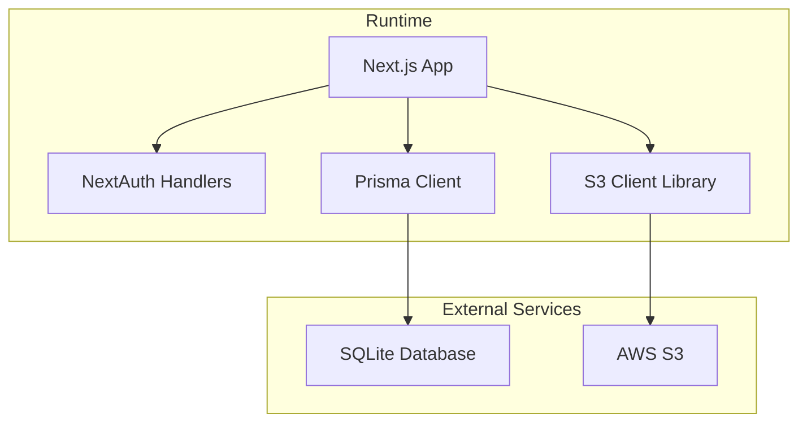
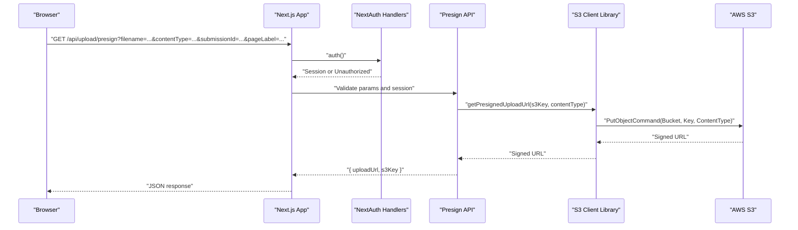
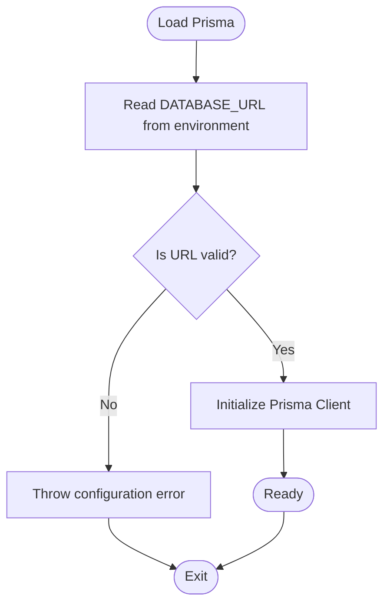
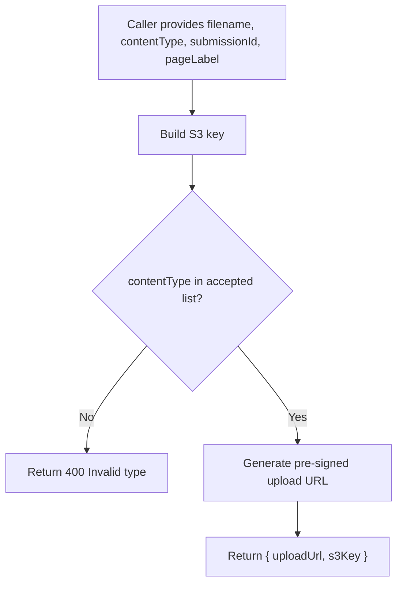
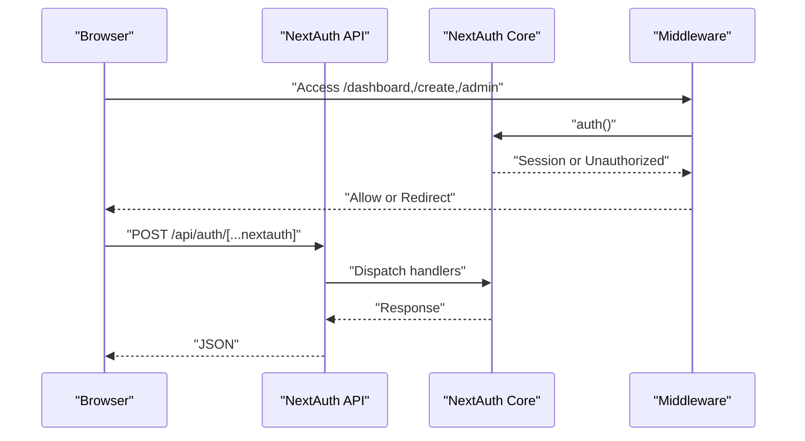
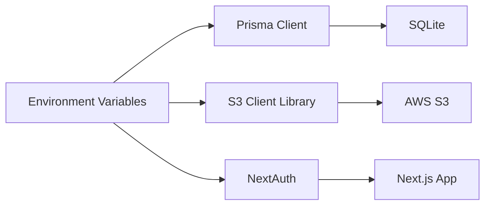

# Environment Variables & Secrets

<cite>
**Referenced Files in This Document**
- [package.json](file://package.json)
- [next.config.ts](file://next.config.ts)
- [prisma/schema.prisma](file://prisma/schema.prisma)
- [src/lib/prisma.ts](file://src/lib/prisma.ts)
- [src/lib/s3.ts](file://src/lib/s3.ts)
- [src/app/api/upload/presign/route.ts](file://src/app/api/upload/presign/route.ts)
- [src/app/api/auth/[...nextauth]/route.ts](file://src/app/api/auth/[...nextauth]/route.ts)
- [src/middleware.ts](file://src/middleware.ts)
- [src/components/Providers.tsx](file://src/components/Providers.tsx)
- [src/components/create/ImageUploader.tsx](file://src/components/create/ImageUploader.tsx)
</cite>

## Table of Contents
1. [Introduction](#introduction)
2. [Project Structure](#project-structure)
3. [Core Components](#core-components)
4. [Architecture Overview](#architecture-overview)
5. [Detailed Component Analysis](#detailed-component-analysis)
6. [Dependency Analysis](#dependency-analysis)
7. [Performance Considerations](#performance-considerations)
8. [Troubleshooting Guide](#troubleshooting-guide)
9. [Conclusion](#conclusion)
10. [Appendices](#appendices)

## Introduction
This document explains how environment variables and secrets are used in Titchybook Creator. It covers required variables, naming conventions, data types, validation requirements, security best practices, and operational differences between local development and production. It also provides examples of .env file structure, Docker environment configuration, CI/CD variable management, and common configuration pitfalls with debugging guidance.

## Project Structure
The application relies on environment variables for:
- Authentication via NextAuth (external provider configuration is present but does not read secret values from environment in the current code)
- Database connectivity (SQLite via Prisma)
- AWS S3 integration (region, credentials, bucket)

**Diagram sources**
- [src/lib/prisma.ts:1-10](file://src/lib/prisma.ts#L1-L10)
- [src/lib/s3.ts:1-81](file://src/lib/s3.ts#L1-L81)
- [prisma/schema.prisma:5-8](file://prisma/schema.prisma#L5-L8)

**Section sources**
- [package.json:1-43](file://package.json#L1-L43)
- [next.config.ts:1-8](file://next.config.ts#L1-L8)
- [prisma/schema.prisma:1-48](file://prisma/schema.prisma#L1-L48)
- [src/lib/prisma.ts:1-10](file://src/lib/prisma.ts#L1-L10)
- [src/lib/s3.ts:1-81](file://src/lib/s3.ts#L1-L81)

## Core Components
This section enumerates the environment variables used by the application and their roles.

- DATABASE_URL
  - Purpose: Prisma datasource URL for SQLite
  - Type: String (URL)
  - Required: Yes
  - Validation: Must be a valid SQLite connection URL
  - Notes: Used in Prisma schema via environment variable substitution

- AWS_REGION
  - Purpose: AWS region for S3 client initialization
  - Type: String (region identifier)
  - Required: Yes
  - Validation: Must match a valid AWS region
  - Notes: Used when constructing the S3 client

- AWS_ACCESS_KEY_ID
  - Purpose: AWS access key ID for S3 client credentials
  - Type: String (access key)
  - Required: Yes
  - Validation: Must be a valid AWS access key
  - Notes: Used when constructing the S3 client

- AWS_SECRET_ACCESS_KEY
  - Purpose: AWS secret access key for S3 client credentials
  - Type: String (secret key)
  - Required: Yes
  - Validation: Must be a valid AWS secret key
  - Notes: Used when constructing the S3 client

- S3_BUCKET_NAME
  - Purpose: Target S3 bucket name for uploads/downloads
  - Type: String (bucket name)
  - Required: Yes
  - Validation: Must be a valid S3 bucket name in the configured region
  - Notes: Used to construct S3 keys and commands

- NEXT_PUBLIC_AWS_BUCKET_URL
  - Purpose: Public base URL for S3 bucket objects (used by clients)
  - Type: String (HTTP/HTTPS URL)
  - Required: Yes (for client-side asset resolution)
  - Validation: Must be a valid HTTPS URL pointing to the bucket
  - Notes: Used by the frontend to resolve public URLs

- NEXTAUTH_URL
  - Purpose: Base URL for NextAuth routes and redirects
  - Type: String (HTTP/HTTPS URL)
  - Required: Yes (for NextAuth)
  - Validation: Must be reachable and match deployment domain
  - Notes: Used by NextAuth for callback URLs and issuer metadata

- NEXTAUTH_SECRET
  - Purpose: Secret key for signing NextAuth JWT tokens
  - Type: String (high-entropy secret)
  - Required: Yes (for NextAuth)
  - Validation: Must be sufficiently long and random
  - Notes: Used by NextAuth to sign and encrypt sessions

Security note: The current NextAuth configuration uses a credentials provider and does not read external provider secrets from environment variables. However, the JWT signing secret and base URL remain mandatory.

**Section sources**
- [prisma/schema.prisma:5-8](file://prisma/schema.prisma#L5-L8)
- [src/lib/s3.ts:8-16](file://src/lib/s3.ts#L8-L16)
- [src/app/api/upload/presign/route.ts:1-37](file://src/app/api/upload/presign/route.ts#L1-L37)
- [src/app/api/auth/[...nextauth]/route.ts](file://src/app/api/auth/[...nextauth]/route.ts#L1-L4)
- [src/middleware.ts:1-6](file://src/middleware.ts#L1-L6)
- [src/components/Providers.tsx:1-7](file://src/components/Providers.tsx#L1-L7)

## Architecture Overview
The runtime reads environment variables to configure:
- Prisma client for SQLite
- AWS SDK S3 client for uploads/downloads
- NextAuth for authentication

**Diagram sources**
- [src/app/api/upload/presign/route.ts:1-37](file://src/app/api/upload/presign/route.ts#L1-L37)
- [src/lib/s3.ts:18-28](file://src/lib/s3.ts#L18-L28)
- [src/middleware.ts:1-6](file://src/middleware.ts#L1-L6)

## Detailed Component Analysis

### Database Connectivity (Prisma)
- Variable: DATABASE_URL
- Role: Provides the Prisma datasource URL for SQLite
- Behavior: Loaded via Prisma schema environment substitution
- Validation: Must be a valid SQLite URL; misconfiguration leads to startup failures

**Diagram sources**
- [prisma/schema.prisma:5-8](file://prisma/schema.prisma#L5-L8)
- [src/lib/prisma.ts:1-10](file://src/lib/prisma.ts#L1-L10)

**Section sources**
- [prisma/schema.prisma:5-8](file://prisma/schema.prisma#L5-L8)
- [src/lib/prisma.ts:1-10](file://src/lib/prisma.ts#L1-L10)

### AWS S3 Integration
- Variables: AWS_REGION, AWS_ACCESS_KEY_ID, AWS_SECRET_ACCESS_KEY, S3_BUCKET_NAME, NEXT_PUBLIC_AWS_BUCKET_URL
- Role: Configure S3 client, generate pre-signed URLs, and resolve public URLs
- Behavior:
  - S3 client is constructed using region and credentials
  - Pre-signed upload/download URLs are generated for temporary access
  - Frontend resolves public URLs using NEXT_PUBLIC_AWS_BUCKET_URL

**Diagram sources**
- [src/app/api/upload/presign/route.ts:1-37](file://src/app/api/upload/presign/route.ts#L1-L37)
- [src/lib/s3.ts:18-28](file://src/lib/s3.ts#L18-L28)
- [src/components/create/ImageUploader.tsx:42-51](file://src/components/create/ImageUploader.tsx#L42-L51)

**Section sources**
- [src/lib/s3.ts:1-81](file://src/lib/s3.ts#L1-L81)
- [src/app/api/upload/presign/route.ts:1-37](file://src/app/api/upload/presign/route.ts#L1-L37)
- [src/components/create/ImageUploader.tsx:1-148](file://src/components/create/ImageUploader.tsx#L1-L148)

### NextAuth Configuration
- Variables: NEXTAUTH_URL, NEXTAUTH_SECRET
- Role: Configure NextAuth base URL and JWT signing secret
- Behavior: NextAuth handlers are exposed via API routes; middleware enforces protected routes

**Diagram sources**
- [src/app/api/auth/[...nextauth]/route.ts](file://src/app/api/auth/[...nextauth]/route.ts#L1-L4)
- [src/middleware.ts:1-6](file://src/middleware.ts#L1-L6)
- [src/components/Providers.tsx:1-7](file://src/components/Providers.tsx#L1-L7)

**Section sources**
- [src/app/api/auth/[...nextauth]/route.ts](file://src/app/api/auth/[...nextauth]/route.ts#L1-L4)
- [src/middleware.ts:1-6](file://src/middleware.ts#L1-L6)
- [src/components/Providers.tsx:1-7](file://src/components/Providers.tsx#L1-L7)

## Dependency Analysis
The following diagram shows how environment variables influence components at runtime.

**Diagram sources**
- [prisma/schema.prisma:5-8](file://prisma/schema.prisma#L5-L8)
- [src/lib/s3.ts:8-16](file://src/lib/s3.ts#L8-L16)
- [src/app/api/auth/[...nextauth]/route.ts](file://src/app/api/auth/[...nextauth]/route.ts#L1-L4)

**Section sources**
- [prisma/schema.prisma:5-8](file://prisma/schema.prisma#L5-L8)
- [src/lib/s3.ts:1-81](file://src/lib/s3.ts#L1-L81)
- [src/app/api/auth/[...nextauth]/route.ts](file://src/app/api/auth/[...nextauth]/route.ts#L1-L4)

## Performance Considerations
- Minimize environment variable reads by caching values after initial load (already handled implicitly by process environment)
- Avoid frequent re-initialization of AWS SDK clients; reuse instances where possible
- Use short-lived pre-signed URLs to reduce exposure windows
- Keep bucket policies restrictive to limit access surface

## Troubleshooting Guide
Common configuration errors and resolutions:
- Missing or invalid DATABASE_URL
  - Symptom: Application fails to start or Prisma client initialization errors
  - Resolution: Ensure DATABASE_URL points to a valid SQLite URL

- Missing AWS_REGION or invalid region
  - Symptom: S3 client creation errors or signature mismatches
  - Resolution: Set AWS_REGION to a valid AWS region

- Missing or incorrect AWS_ACCESS_KEY_ID / AWS_SECRET_ACCESS_KEY
  - Symptom: Permission denied errors when generating pre-signed URLs or accessing S3
  - Resolution: Verify credentials and ensure they have appropriate S3 permissions

- Missing S3_BUCKET_NAME
  - Symptom: Pre-sign URL generation fails or bucket not found
  - Resolution: Set S3_BUCKET_NAME to the target bucket

- Missing NEXT_PUBLIC_AWS_BUCKET_URL
  - Symptom: Client cannot resolve public URLs for assets
  - Resolution: Set NEXT_PUBLIC_AWS_BUCKET_URL to the HTTPS endpoint of the bucket

- Missing NEXTAUTH_URL or NEXTAUTH_SECRET
  - Symptom: NextAuth callback failures or JWT signing errors
  - Resolution: Set NEXTAUTH_URL to the reachable base URL and NEXTAUTH_SECRET to a strong secret

Debugging techniques:
- Log environment variables during startup to confirm values are loaded
- Test pre-signed URL generation independently to isolate S3 configuration issues
- Validate NextAuth callbacks using a simple test route
- Use AWS CLI or SDK to verify credentials and bucket access outside the app

**Section sources**
- [prisma/schema.prisma:5-8](file://prisma/schema.prisma#L5-L8)
- [src/lib/s3.ts:8-16](file://src/lib/s3.ts#L8-L16)
- [src/app/api/upload/presign/route.ts:1-37](file://src/app/api/upload/presign/route.ts#L1-L37)
- [src/app/api/auth/[...nextauth]/route.ts](file://src/app/api/auth/[...nextauth]/route.ts#L1-L4)

## Conclusion
Titchybook Creator requires a small set of environment variables to connect to the database, integrate with AWS S3, and secure NextAuth operations. Correctly setting and validating these variables is essential for reliable operation. Follow the security and operational guidance herein to maintain safe and robust deployments across environments.

## Appendices

### Environment Variable Reference
- DATABASE_URL: Prisma datasource URL for SQLite
- AWS_REGION: AWS region for S3 client
- AWS_ACCESS_KEY_ID: AWS access key ID
- AWS_SECRET_ACCESS_KEY: AWS secret access key
- S3_BUCKET_NAME: Target S3 bucket name
- NEXT_PUBLIC_AWS_BUCKET_URL: Public HTTPS URL for S3 objects
- NEXTAUTH_URL: Base URL for NextAuth
- NEXTAUTH_SECRET: Secret for signing JWTs

### Example .env File Structure
- DATABASE_URL=...
- AWS_REGION=...
- AWS_ACCESS_KEY_ID=...
- AWS_SECRET_ACCESS_KEY=...
- S3_BUCKET_NAME=...
- NEXT_PUBLIC_AWS_BUCKET_URL=https://your-bucket.s3.amazonaws.com
- NEXTAUTH_URL=https://yourdomain.com
- NEXTAUTH_SECRET=...

### Docker Environment Configuration
- Define environment variables in the container or compose file
- Mount secrets via secure mechanisms (e.g., Docker secrets or Kubernetes secrets)
- Ensure NEXT_PUBLIC_* variables are available to the frontend build/runtime

### CI/CD Pipeline Variable Management
- Store secrets in your CI/CD system’s secret storage
- Inject variables at build and deploy time
- Use separate variables for development, staging, and production
- Rotate secrets regularly and update CI/CD variables accordingly

### Local Development vs Production Differences
- Local: Use local SQLite via DATABASE_URL; ensure AWS credentials are valid for testing
- Production: Use managed database and S3; restrict IAM policies; enforce HTTPS for NEXTAUTH_URL and NEXT_PUBLIC_AWS_BUCKET_URL