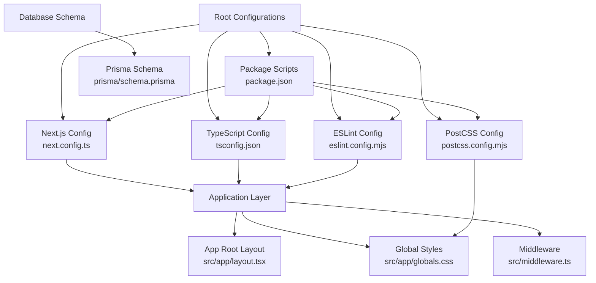
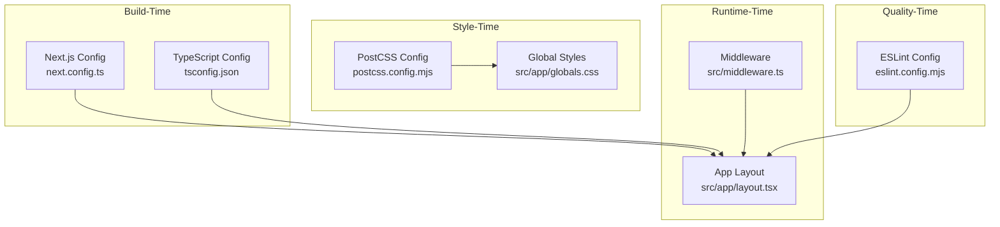
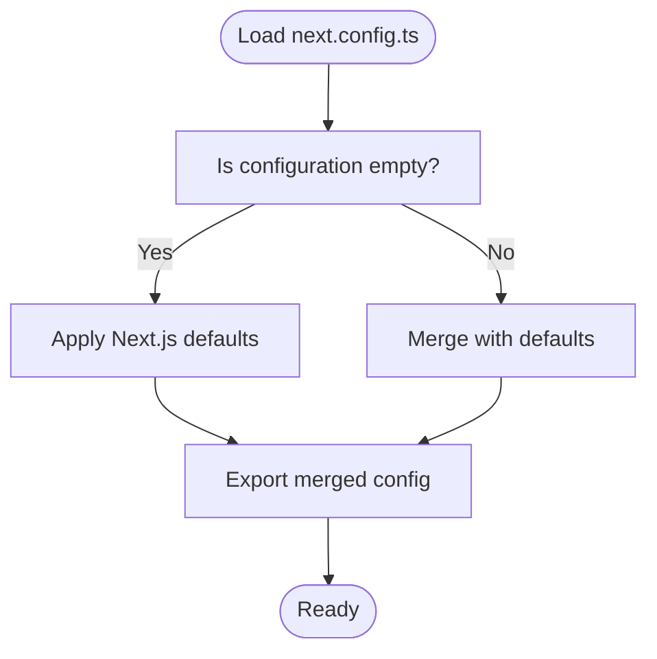
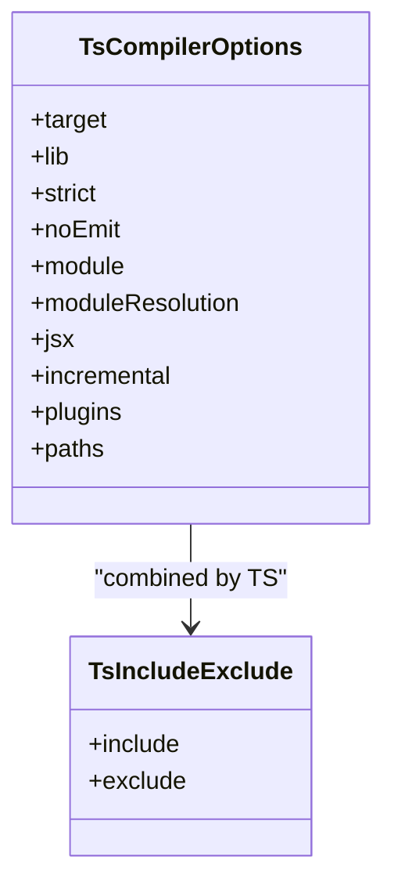
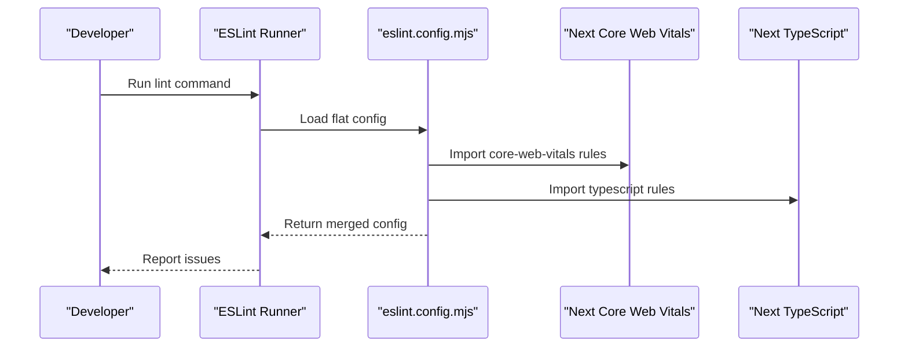
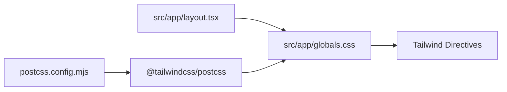
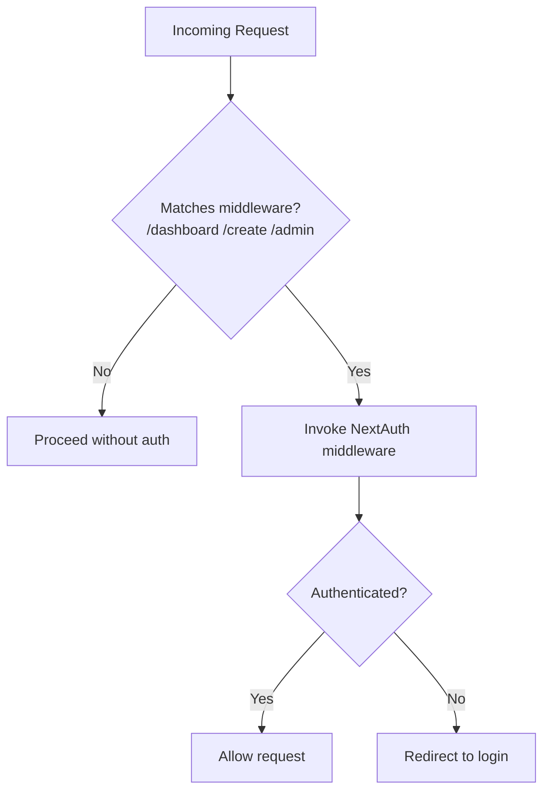
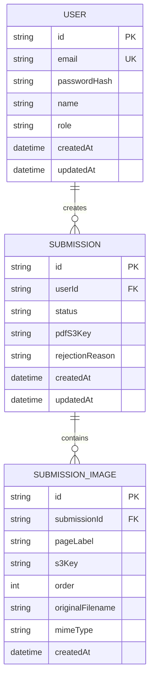
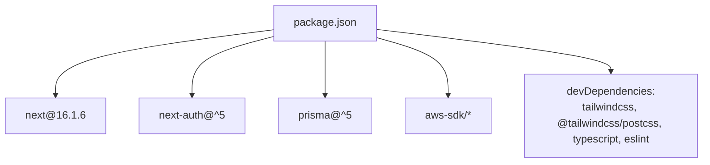

# Next.js & TypeScript Configuration

<cite>
**Referenced Files in This Document**
- [next.config.ts](file://next.config.ts)
- [tsconfig.json](file://tsconfig.json)
- [eslint.config.mjs](file://eslint.config.mjs)
- [postcss.config.mjs](file://postcss.config.mjs)
- [package.json](file://package.json)
- [src/app/layout.tsx](file://src/app/layout.tsx)
- [src/app/globals.css](file://src/app/globals.css)
- [src/middleware.ts](file://src/middleware.ts)
- [prisma/schema.prisma](file://prisma/schema.prisma)
</cite>

## Table of Contents
1. [Introduction](#introduction)
2. [Project Structure](#project-structure)
3. [Core Components](#core-components)
4. [Architecture Overview](#architecture-overview)
5. [Detailed Component Analysis](#detailed-component-analysis)
6. [Dependency Analysis](#dependency-analysis)
7. [Performance Considerations](#performance-considerations)
8. [Troubleshooting Guide](#troubleshooting-guide)
9. [Conclusion](#conclusion)

## Introduction
This document explains the Next.js and TypeScript configuration for Titchybook Creator. It covers Next.js configuration options, build and runtime behavior, TypeScript compiler settings, path aliases, ESLint configuration, Prettier integration via editor tooling, and PostCSS/Tailwind CSS setup. It also outlines development server scripts, production build and start commands, and provides troubleshooting guidance for common configuration issues.

## Project Structure
The project follows a Next.js App Router structure with a dedicated configuration layer for Next.js, TypeScript, ESLint, and PostCSS. Key configuration files reside at the repository root, while application-level assets and styles live under src.

**Diagram sources**
- [next.config.ts:1-8](file://next.config.ts#L1-L8)
- [tsconfig.json:1-35](file://tsconfig.json#L1-L35)
- [eslint.config.mjs:1-19](file://eslint.config.mjs#L1-L19)
- [postcss.config.mjs:1-8](file://postcss.config.mjs#L1-L8)
- [package.json:1-43](file://package.json#L1-L43)
- [src/app/layout.tsx:1-42](file://src/app/layout.tsx#L1-L42)
- [src/app/globals.css:1-27](file://src/app/globals.css#L1-L27)
- [src/middleware.ts:1-6](file://src/middleware.ts#L1-L6)
- [prisma/schema.prisma:1-48](file://prisma/schema.prisma#L1-L48)

**Section sources**
- [package.json:1-43](file://package.json#L1-L43)
- [next.config.ts:1-8](file://next.config.ts#L1-L8)
- [tsconfig.json:1-35](file://tsconfig.json#L1-L35)
- [eslint.config.mjs:1-19](file://eslint.config.mjs#L1-L19)
- [postcss.config.mjs:1-8](file://postcss.config.mjs#L1-L8)
- [src/app/layout.tsx:1-42](file://src/app/layout.tsx#L1-L42)
- [src/app/globals.css:1-27](file://src/app/globals.css#L1-L27)
- [src/middleware.ts:1-6](file://src/middleware.ts#L1-L6)
- [prisma/schema.prisma:1-48](file://prisma/schema.prisma#L1-L48)

## Core Components
- Next.js configuration: Minimal configuration file present; experimental features and advanced build flags are not enabled in the current setup.
- TypeScript configuration: Strict mode enabled, bundler module resolution, path aliases configured, and incremental compilation enabled.
- ESLint configuration: Uses Next.js recommended configs for core web vitals and TypeScript support, with explicit overrides for default ignores.
- PostCSS/Tailwind CSS: Tailwind v4 plugin configured via PostCSS; global CSS imports Tailwind directives.
- Middleware: NextAuth.js-based middleware with route matchers for protected routes.
- Prisma schema: SQLite datasource with user, submission, and submission image models.

**Section sources**
- [next.config.ts:1-8](file://next.config.ts#L1-L8)
- [tsconfig.json:1-35](file://tsconfig.json#L1-L35)
- [eslint.config.mjs:1-19](file://eslint.config.mjs#L1-L19)
- [postcss.config.mjs:1-8](file://postcss.config.mjs#L1-L8)
- [src/middleware.ts:1-6](file://src/middleware.ts#L1-L6)
- [prisma/schema.prisma:1-48](file://prisma/schema.prisma#L1-L48)

## Architecture Overview
The configuration architecture centers on four pillars:
- Build-time: Next.js and TypeScript compile-time settings.
- Quality-time: ESLint enforcing standards and Next.js-specific rules.
- Style-time: PostCSS with Tailwind CSS for styling.
- Runtime-time: Middleware and application layout orchestration.

**Diagram sources**
- [next.config.ts:1-8](file://next.config.ts#L1-L8)
- [tsconfig.json:1-35](file://tsconfig.json#L1-L35)
- [eslint.config.mjs:1-19](file://eslint.config.mjs#L1-L19)
- [postcss.config.mjs:1-8](file://postcss.config.mjs#L1-L8)
- [src/app/globals.css:1-27](file://src/app/globals.css#L1-L27)
- [src/middleware.ts:1-6](file://src/middleware.ts#L1-L6)
- [src/app/layout.tsx:1-42](file://src/app/layout.tsx#L1-L42)

## Detailed Component Analysis

### Next.js Configuration
- Purpose: Centralized Next.js configuration file.
- Current state: Empty configuration object; no experimental features or advanced build flags are enabled.
- Implications:
  - Defaults apply for asset handling, static export, and runtime behavior.
  - Consider enabling experimental features (e.g., SWC-related optimizations) only after validating compatibility with the current dependency set.

**Diagram sources**
- [next.config.ts:1-8](file://next.config.ts#L1-L8)

**Section sources**
- [next.config.ts:1-8](file://next.config.ts#L1-L8)

### TypeScript Configuration
- Compiler options:
  - Target and library: ES2017 with DOM and ESNext APIs.
  - Strictness: Enabled strict type checking.
  - Emit control: No emit during build (Next.js handles emission).
  - Module system: ESNext with bundler module resolution.
  - JSX: React JSX transform.
  - Incremental builds: Enabled for faster rebuilds.
  - Plugins: Next.js TS plugin integrated.
  - Paths: Alias @/* mapped to ./src/*.
- Include/exclude:
  - Includes Next environment types and TypeScript sources.
  - Excludes node_modules globally.

**Diagram sources**
- [tsconfig.json:1-35](file://tsconfig.json#L1-L35)

**Section sources**
- [tsconfig.json:1-35](file://tsconfig.json#L1-L35)

### ESLint Configuration
- Configuration approach: Uses the modern flat config format with ESLint’s defineConfig.
- Presets:
  - Next.js Core Web Vitals rules.
  - Next.js TypeScript rules.
- Overrides:
  - Explicitly re-includes Next.js build artifacts and environment declarations that are otherwise ignored by default.

**Diagram sources**
- [eslint.config.mjs:1-19](file://eslint.config.mjs#L1-L19)

**Section sources**
- [eslint.config.mjs:1-19](file://eslint.config.mjs#L1-L19)

### PostCSS and Tailwind CSS Integration
- PostCSS configuration:
  - Plugin: Tailwind CSS PostCSS plugin configured.
- Global styles:
  - Imports Tailwind directives.
  - Defines theme tokens and media-query-based dark mode.
- App layout:
  - Uses Next font variables and global CSS.

**Diagram sources**
- [postcss.config.mjs:1-8](file://postcss.config.mjs#L1-L8)
- [src/app/globals.css:1-27](file://src/app/globals.css#L1-L27)
- [src/app/layout.tsx:1-42](file://src/app/layout.tsx#L1-L42)

**Section sources**
- [postcss.config.mjs:1-8](file://postcss.config.mjs#L1-L8)
- [src/app/globals.css:1-27](file://src/app/globals.css#L1-L27)
- [src/app/layout.tsx:1-42](file://src/app/layout.tsx#L1-L42)

### Middleware and Routing
- Middleware:
  - Wraps NextAuth.js auth guard.
  - Applies matchers to protected routes (dashboard, create, admin).
- Implications:
  - Authentication enforced for matched paths; ensure NextAuth configuration is present and environment variables are set.

**Diagram sources**
- [src/middleware.ts:1-6](file://src/middleware.ts#L1-L6)

**Section sources**
- [src/middleware.ts:1-6](file://src/middleware.ts#L1-L6)

### Prisma Schema and Environment
- Schema highlights:
  - SQLite datasource via DATABASE_URL.
  - Models: User, Submission, SubmissionImage with relations and indexes.
- Seed script:
  - Defined under package.json prisma section to seed data via tsx.

**Diagram sources**
- [prisma/schema.prisma:1-48](file://prisma/schema.prisma#L1-L48)

**Section sources**
- [prisma/schema.prisma:1-48](file://prisma/schema.prisma#L1-L48)
- [package.json:26-28](file://package.json#L26-L28)

## Dependency Analysis
- Next.js version and scripts:
  - Next.js version pinned; scripts include dev, build, start, and lint.
- Dev dependencies:
  - Tailwind CSS v4 plugin and PostCSS plugin.
  - TypeScript and ESLint ecosystem aligned with Next.js 16.1.6.
- Runtime dependencies:
  - Next, NextAuth, AWS SDKs, Prisma client, PDF generation, and UI libraries.

**Diagram sources**
- [package.json:1-43](file://package.json#L1-L43)

**Section sources**
- [package.json:1-43](file://package.json#L1-L43)

## Performance Considerations
- Next.js configuration:
  - Consider enabling SWC-based transforms and minification via Next.js flags if not already implied by the installed version.
  - Enable React profiling and bundle analyzer for insights when diagnosing performance regressions.
- TypeScript:
  - Keep incremental builds enabled for faster local iteration.
  - Prefer bundler module resolution to align with Next.js and reduce module duplication.
- ESLint:
  - Run lint in CI with caching to avoid redundant work.
- PostCSS/Tailwind:
  - Ensure purge/content configuration is optimized for production builds to remove unused CSS.
- Middleware:
  - Keep matchers minimal to reduce unnecessary auth checks.

[No sources needed since this section provides general guidance]

## Troubleshooting Guide
- Next.js configuration appears empty:
  - If experimental features or advanced flags are needed, add them to next.config.ts and validate with a local build.
- TypeScript path aliases not resolving:
  - Verify the alias in tsconfig.json matches imports and that the bundler module resolution is set appropriately.
- ESLint not reporting issues:
  - Confirm the lint script runs and that the flat config merges Next.js presets correctly; check for overrides that may exclude relevant files.
- Tailwind CSS not applying:
  - Ensure PostCSS plugin is present and Tailwind directives are imported in global CSS; confirm the app layout consumes the global stylesheet.
- Middleware redirect loops:
  - Review middleware matchers and NextAuth configuration; ensure login routes are excluded from auth guards.
- Prisma seed failures:
  - Confirm DATABASE_URL is set and the seed script executes via tsx as defined in package.json.

**Section sources**
- [next.config.ts:1-8](file://next.config.ts#L1-L8)
- [tsconfig.json:1-35](file://tsconfig.json#L1-L35)
- [eslint.config.mjs:1-19](file://eslint.config.mjs#L1-L19)
- [postcss.config.mjs:1-8](file://postcss.config.mjs#L1-L8)
- [src/app/globals.css:1-27](file://src/app/globals.css#L1-L27)
- [src/middleware.ts:1-6](file://src/middleware.ts#L1-L6)
- [package.json:26-28](file://package.json#L26-L28)

## Conclusion
Titchybook Creator’s configuration is streamlined and aligned with Next.js 16.1.6 defaults. The setup leverages strict TypeScript settings, path aliases, ESLint with Next.js presets, and Tailwind CSS via PostCSS. For production hardening, consider enabling Next.js-specific optimizations, optimizing Tailwind purge settings, and adding environment-specific configurations. The middleware and Prisma schema provide a solid foundation for authentication and data modeling.