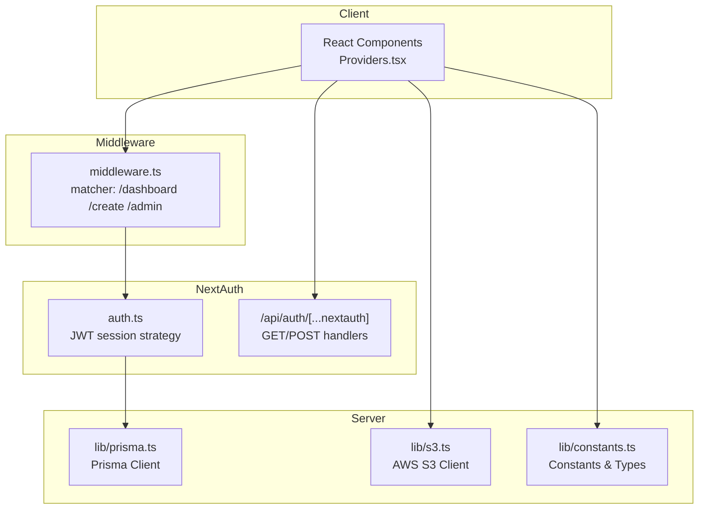
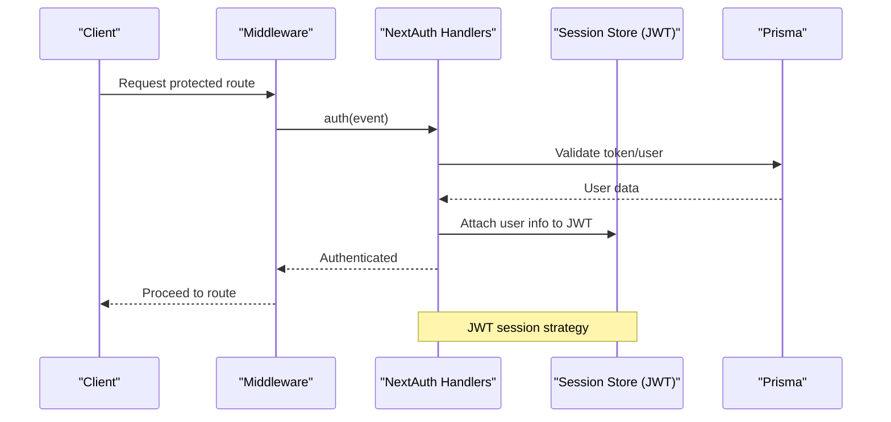
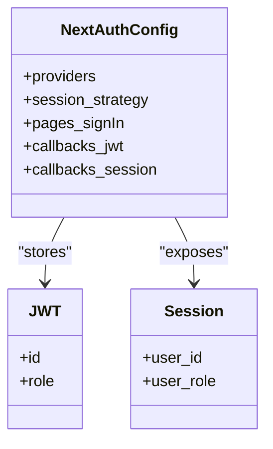
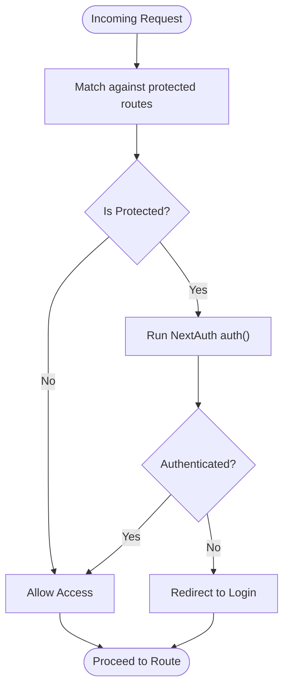
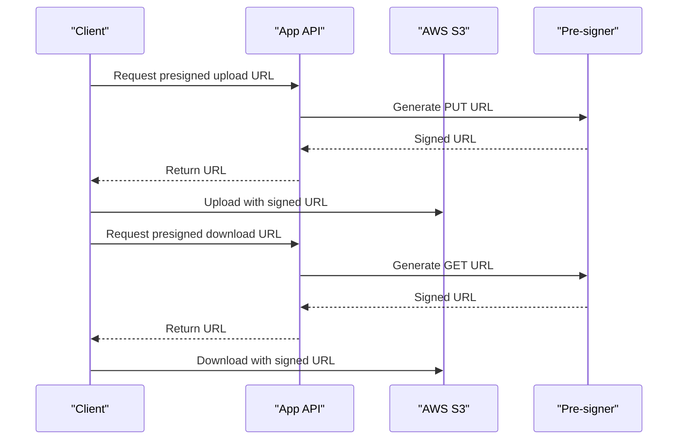
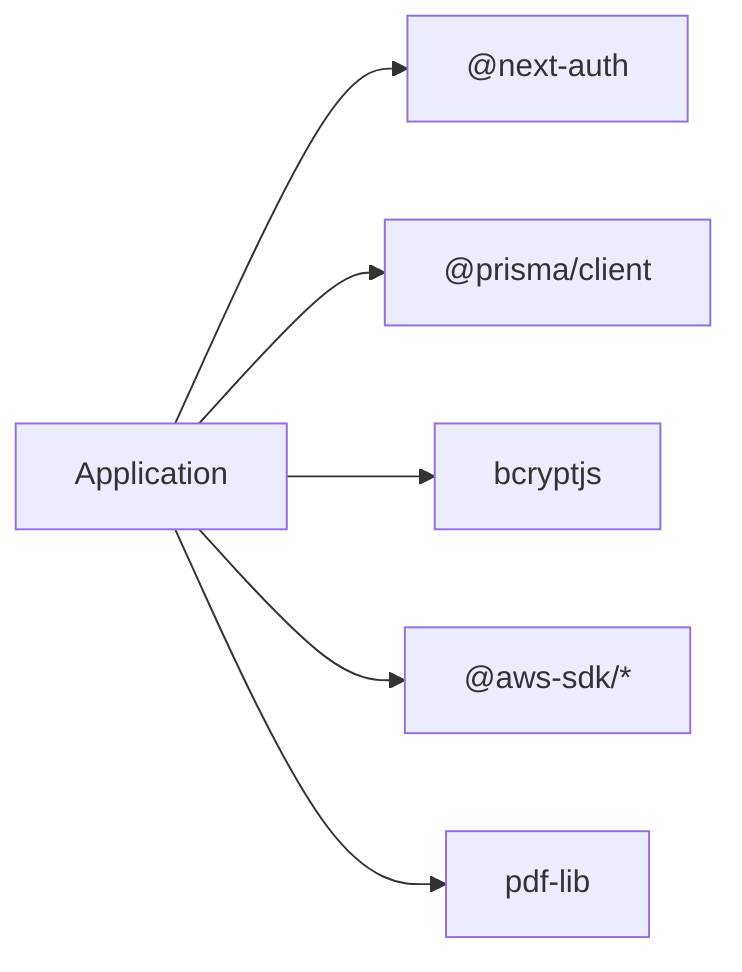

# Security & Deployment Settings

<cite>
**Referenced Files in This Document**
- [src/middleware.ts](file://src/middleware.ts)
- [src/auth.ts](file://src/auth.ts)
- [src/app/api/auth/[...nextauth]/route.ts](file://src/app/api/auth/[...nextauth]/route.ts)
- [src/components/Providers.tsx](file://src/components/Providers.tsx)
- [src/lib/constants.ts](file://src/lib/constants.ts)
- [src/lib/prisma.ts](file://src/lib/prisma.ts)
- [src/lib/s3.ts](file://src/lib/s3.ts)
- [src/app/layout.tsx](file://src/app/layout.tsx)
- [next.config.ts](file://next.config.ts)
- [package.json](file://package.json)
</cite>

## Table of Contents
1. [Introduction](#introduction)
2. [Project Structure](#project-structure)
3. [Core Components](#core-components)
4. [Architecture Overview](#architecture-overview)
5. [Detailed Component Analysis](#detailed-component-analysis)
6. [Dependency Analysis](#dependency-analysis)
7. [Performance Considerations](#performance-considerations)
8. [Security Configuration](#security-configuration)
9. [Deployment Settings](#deployment-settings)
10. [Security Audit & Compliance](#security-audit--compliance)
11. [Troubleshooting Guide](#troubleshooting-guide)
12. [Conclusion](#conclusion)

## Introduction
This document provides comprehensive guidance for securing and deploying Titchybook Creator. It focuses on NextAuth security settings (session management, cookie configuration, CSRF protection), middleware-based route protection, authentication enforcement, access control, security headers, CORS policies, content security policies, production deployment optimization, asset compression, performance monitoring, security audit procedures, vulnerability assessment, incident response protocols, compliance requirements, data protection measures, and security monitoring setup.

## Project Structure
The application follows a Next.js App Router structure with dedicated authentication, middleware, and API routes. Authentication is handled via NextAuth with JWT strategy, while middleware enforces protected routes. AWS S3 integration is used for signed URLs to manage uploads and downloads securely.

**Diagram sources**
- [src/middleware.ts:1-5](file://src/middleware.ts#L1-L5)
- [src/auth.ts:27-79](file://src/auth.ts#L27-L79)
- [src/app/api/auth/[...nextauth]/route.ts:1-3](file://src/app/api/auth/[...nextauth]/route.ts#L1-L3)
- [src/lib/prisma.ts:1-9](file://src/lib/prisma.ts#L1-L9)
- [src/lib/s3.ts:1-51](file://src/lib/s3.ts#L1-L51)
- [src/lib/constants.ts:1-49](file://src/lib/constants.ts#L1-L49)

**Section sources**
- [src/middleware.ts:1-5](file://src/middleware.ts#L1-L5)
- [src/auth.ts:27-79](file://src/auth.ts#L27-L79)
- [src/app/api/auth/[...nextauth]/route.ts:1-3](file://src/app/api/auth/[...nextauth]/route.ts#L1-L3)
- [src/lib/prisma.ts:1-9](file://src/lib/prisma.ts#L1-L9)
- [src/lib/s3.ts:1-51](file://src/lib/s3.ts#L1-L51)
- [src/lib/constants.ts:1-49](file://src/lib/constants.ts#L1-L49)

## Core Components
- NextAuth configuration with JWT session strategy, credentials provider, and custom callbacks for user roles.
- Middleware enforcing authentication on protected routes.
- Provider wrapper for session management in the client.
- AWS S3 integration with pre-signed URLs for secure uploads/downloads.
- Prisma client initialization and constants for submission statuses and image constraints.

**Section sources**
- [src/auth.ts:27-79](file://src/auth.ts#L27-L79)
- [src/middleware.ts:1-5](file://src/middleware.ts#L1-L5)
- [src/components/Providers.tsx:1-8](file://src/components/Providers.tsx#L1-L8)
- [src/lib/s3.ts:1-51](file://src/lib/s3.ts#L1-L51)
- [src/lib/prisma.ts:1-9](file://src/lib/prisma.ts#L1-L9)
- [src/lib/constants.ts:1-49](file://src/lib/constants.ts#L1-L49)

## Architecture Overview
The authentication flow integrates NextAuth with a custom credentials provider and JWT session storage. Middleware intercepts requests to protected routes and enforces authentication. The client uses SessionProvider to propagate session state. S3 pre-signed URLs enable controlled access to storage resources.

**Diagram sources**
- [src/middleware.ts:1-5](file://src/middleware.ts#L1-L5)
- [src/app/api/auth/[...nextauth]/route.ts:1-3](file://src/app/api/auth/[...nextauth]/route.ts#L1-L3)
- [src/auth.ts:27-79](file://src/auth.ts#L27-L79)
- [src/lib/prisma.ts:1-9](file://src/lib/prisma.ts#L1-L9)

## Detailed Component Analysis

### NextAuth Security Settings
- Session Management: JWT strategy is configured, enabling stateless sessions stored in the browser. This reduces server-side session storage overhead and simplifies scaling.
- Cookie Configuration: No explicit cookie settings are defined in the configuration. Default NextAuth cookie behavior applies. Consider setting secure, sameSite, httpOnly, and domain attributes for production environments.
- CSRF Protection: NextAuth v5 provides built-in CSRF protection for OAuth flows. For custom credentials-based flows, ensure anti-CSRF tokens are validated on the client and server when submitting sensitive forms.
- Access Control: Use NextAuth callbacks to attach roles to the JWT and session, enabling route-level access control checks.

**Diagram sources**
- [src/auth.ts:27-79](file://src/auth.ts#L27-L79)

**Section sources**
- [src/auth.ts:27-79](file://src/auth.ts#L27-L79)

### Middleware Configuration for Route Protection
- Authentication Enforcement: The middleware exports NextAuth’s auth function and restricts access to protected routes using a matcher array targeting dashboard, create, and admin paths.
- Access Control: Combine middleware with NextAuth callbacks to check roles and enforce granular permissions per route.

**Diagram sources**
- [src/middleware.ts:1-5](file://src/middleware.ts#L1-L5)

**Section sources**
- [src/middleware.ts:1-5](file://src/middleware.ts#L1-L5)

### Client Session Provider
- SessionProvider wraps the application to enable real-time session updates and hydration across components.

**Section sources**
- [src/components/Providers.tsx:1-8](file://src/components/Providers.tsx#L1-L8)

### AWS S3 Integration and Pre-signed URLs
- Pre-signed Upload URLs: Generated with limited expiration to allow temporary uploads to S3.
- Pre-signed Download URLs: Generated for controlled access to stored assets.
- Security Considerations: Limit bucket policies, use least-privilege IAM roles, and rotate credentials regularly.

**Diagram sources**
- [src/lib/s3.ts:18-36](file://src/lib/s3.ts#L18-L36)

**Section sources**
- [src/lib/s3.ts:1-51](file://src/lib/s3.ts#L1-L51)

### Prisma Client Initialization
- Global singleton pattern prevents multiple Prisma clients in development and ensures proper cleanup in non-production environments.

**Section sources**
- [src/lib/prisma.ts:1-9](file://src/lib/prisma.ts#L1-L9)

### Constants and Validation
- Submission status enum and accepted image types define safe defaults for uploads and processing.
- MAX_FILE_SIZE constant enforces client-side and server-side limits.

**Section sources**
- [src/lib/constants.ts:1-49](file://src/lib/constants.ts#L1-L49)

## Dependency Analysis
External dependencies relevant to security and deployment include NextAuth, Prisma, bcryptjs, AWS SDK, and PDF libraries. Production readiness requires pinning versions, enabling strict TypeScript checks, and configuring environment variables for secrets.

**Diagram sources**
- [package.json:11-28](file://package.json#L11-L28)

**Section sources**
- [package.json:11-28](file://package.json#L11-L28)

## Performance Considerations
- Build Optimization: Enable Next.js production builds and analyze bundle sizes using profiling tools.
- Asset Compression: Leverage Next.js image optimization and consider compression for static assets.
- Caching: Implement appropriate cache headers for static resources and API responses.
- Monitoring: Integrate performance monitoring (e.g., tracing, metrics) to track latency and throughput.

[No sources needed since this section provides general guidance]

## Security Configuration
- Cookies: Configure secure, httpOnly, sameSite, and domain attributes for production deployments.
- CSRF Protection: Validate anti-CSRF tokens for sensitive form submissions.
- Content Security Policy (CSP): Restrict script sources, frame ancestors, and external resource loading.
- CORS: Define allowed origins, methods, and headers for API endpoints.
- Security Headers: Add HSTS, X-Frame-Options, X-Content-Type-Options, Referrer-Policy, Permissions-Policy.
- Secrets Management: Store secrets in environment variables and avoid committing them to version control.
- Role-Based Access Control (RBAC): Enforce RBAC using NextAuth callbacks and middleware checks.

[No sources needed since this section provides general guidance]

## Deployment Settings
- Environment Variables: Define required environment variables for NextAuth, AWS, and database connections.
- Build Configuration: Use next.config.ts for advanced Next.js settings if needed.
- Runtime: Run production builds with next start and configure process managers (PM2, systemd) for reliability.
- Observability: Set up logging, metrics, and alerting for health checks and error rates.

**Section sources**
- [next.config.ts:1-8](file://next.config.ts#L1-L8)
- [package.json:5-9](file://package.json#L5-L9)

## Security Audit & Compliance
- Vulnerability Assessment: Regularly scan dependencies for known vulnerabilities and apply patches promptly.
- Penetration Testing: Conduct authorized penetration tests on staging environments.
- Data Protection: Encrypt sensitive data at rest and in transit. Implement data retention and deletion policies.
- Compliance: Align with applicable regulations (e.g., GDPR, CCPA) for data handling and user consent.
- Incident Response: Establish an incident response plan with escalation paths, communication protocols, and remediation steps.

[No sources needed since this section provides general guidance]

## Troubleshooting Guide
- Authentication Issues: Verify NextAuth configuration, environment variables, and database connectivity.
- Middleware Failures: Confirm matcher patterns and that auth() is exported correctly.
- S3 Upload/Download Failures: Check IAM permissions, bucket policies, and pre-signed URL expiration.
- Session Not Persisting: Ensure SessionProvider is wrapping the application and cookies are set properly.

**Section sources**
- [src/middleware.ts:1-5](file://src/middleware.ts#L1-L5)
- [src/components/Providers.tsx:1-8](file://src/components/Providers.tsx#L1-L8)
- [src/lib/s3.ts:1-51](file://src/lib/s3.ts#L1-L51)
- [src/lib/prisma.ts:1-9](file://src/lib/prisma.ts#L1-L9)

## Conclusion
Titchybook Creator leverages NextAuth with JWT sessions and middleware-based route protection. Strengthen security by configuring cookies, implementing CSRF protection, adding CSP and CORS policies, and enforcing RBAC. Prepare for production with robust environment management, performance monitoring, and compliance-aligned data protection. Establish continuous security auditing, vulnerability assessments, and incident response procedures to maintain a secure deployment.

[No sources needed since this section summarizes without analyzing specific files]