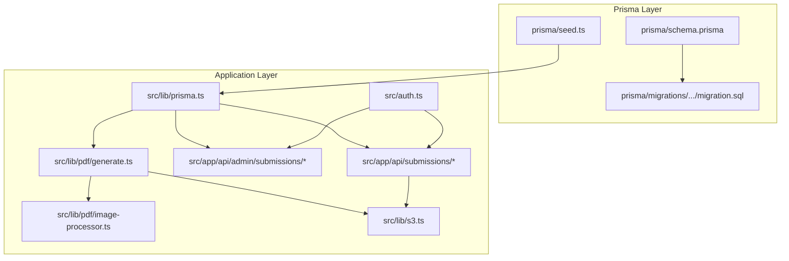
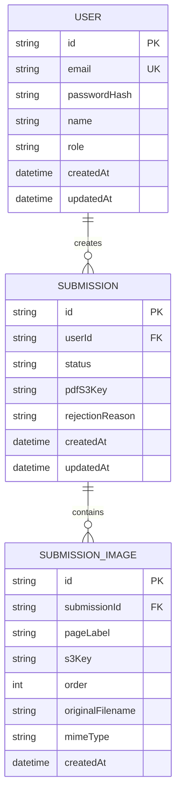
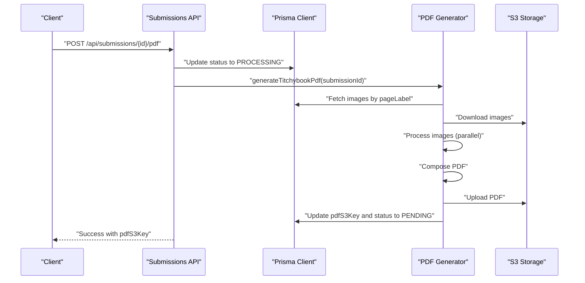
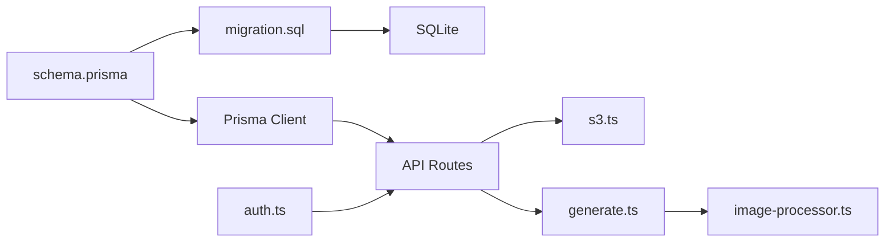

# Database Design

<cite>
**Referenced Files in This Document**
- [schema.prisma](file://prisma/schema.prisma)
- [migration.sql](file://prisma/migrations/20260316171130_init/migration.sql)
- [seed.ts](file://prisma/seed.ts)
- [prisma.ts](file://src/lib/prisma.ts)
- [constants.ts](file://src/lib/constants.ts)
- [auth.ts](file://src/auth.ts)
- [route.ts](file://src/app/api/submissions/route.ts)
- [route.ts](file://src/app/api/submissions/[id]/route.ts)
- [route.ts](file://src/app/api/submissions/[id]/pdf/route.ts)
- [route.ts](file://src/app/api/admin/submissions/route.ts)
- [route.ts](file://src/app/api/admin/submissions/[id]/route.ts)
- [generate.ts](file://src/lib/pdf/generate.ts)
- [image-processor.ts](file://src/lib/pdf/image-processor.ts)
- [s3.ts](file://src/lib/s3.ts)
</cite>

## Table of Contents
1. [Introduction](#introduction)
2. [Project Structure](#project-structure)
3. [Core Components](#core-components)
4. [Architecture Overview](#architecture-overview)
5. [Detailed Component Analysis](#detailed-component-analysis)
6. [Dependency Analysis](#dependency-analysis)
7. [Performance Considerations](#performance-considerations)
8. [Troubleshooting Guide](#troubleshooting-guide)
9. [Conclusion](#conclusion)
10. [Appendices](#appendices)

## Introduction
This document describes the database design for Titchybook Creator, focusing on the data model, relationships, constraints, and operational flows. It covers:
- The User model with authentication fields, roles, and timestamps
- The Submission model for tracking booklet creation, status lifecycle, and user relationships
- The SubmissionImage model for page image metadata, file references, and ordering
- Foreign keys, indexes, and constraints
- Prisma schema definitions and migration processes
- Database seeding and environment configuration
- Sample data examples and common query patterns
- Validation rules, business constraints, and referential integrity
- Performance considerations and indexing strategies

## Project Structure
The database schema is defined in Prisma and materialized via SQL migrations. Application code integrates with the database through Prisma client and enforces validation and business rules at runtime.

**Diagram sources**
- [schema.prisma:1-48](file://prisma/schema.prisma#L1-L48)
- [migration.sql:1-45](file://prisma/migrations/20260316171130_init/migration.sql#L1-L45)
- [seed.ts:1-36](file://prisma/seed.ts#L1-L36)
- [prisma.ts:1-10](file://src/lib/prisma.ts#L1-L10)
- [auth.ts:1-80](file://src/auth.ts#L1-L80)
- [route.ts:1-96](file://src/app/api/submissions/route.ts#L1-L96)
- [route.ts:1-38](file://src/app/api/admin/submissions/route.ts#L1-L38)
- [generate.ts:1-112](file://src/lib/pdf/generate.ts#L1-L112)
- [image-processor.ts:1-30](file://src/lib/pdf/image-processor.ts#L1-L30)
- [s3.ts:1-81](file://src/lib/s3.ts#L1-L81)

**Section sources**
- [schema.prisma:1-48](file://prisma/schema.prisma#L1-L48)
- [migration.sql:1-45](file://prisma/migrations/20260316171130_init/migration.sql#L1-L45)
- [prisma.ts:1-10](file://src/lib/prisma.ts#L1-L10)

## Core Components
This section documents each model, its fields, constraints, and relationships.

- User
  - Purpose: Stores authentication and profile data for creators and administrators.
  - Key fields:
    - id: String, primary key, generated by Prisma
    - email: String, unique, used for login
    - passwordHash: String, bcrypt-hashed password
    - name: String?, optional display name
    - role: String, default "USER"; supports "ADMIN"
    - createdAt/updatedAt: Timestamps managed by Prisma
  - Relationships:
    - One-to-many with Submission via userId
  - Constraints:
    - Unique index on email enforced by Prisma and SQL migration

- Submission
  - Purpose: Represents a single booklet creation request by a user.
  - Key fields:
    - id: String, primary key
    - userId: String, foreign key to User
    - status: String, default "PENDING"; values include PENDING, APPROVED, REJECTED, PROCESSING
    - pdfS3Key: String?, nullable S3 key for generated PDF
    - rejectionReason: String?, nullable reason when rejected
    - createdAt/updatedAt: Timestamps
  - Relationships:
    - Belongs to User (one-to-many)
    - One-to-many with SubmissionImage via submissionId
  - Indexes:
    - Index on userId for efficient user-scoped queries
  - Constraints:
    - Foreign key constraint on userId referencing User(id)
    - Default status "PENDING"

- SubmissionImage
  - Purpose: Stores metadata and file references for each page image in a submission.
  - Key fields:
    - id: String, primary key
    - submissionId: String, foreign key to Submission
    - pageLabel: String, identifies the page (e.g., FRONT_COVER, PAGE_2, ..., PAGE_7, BACK_COVER)
    - s3Key: String, S3 key for the uploaded image
    - order: Int, page ordering (0–7)
    - originalFilename: String, original filename
    - mimeType: String, e.g., image/jpeg, image/png, image/webp
    - createdAt: DateTime, managed by Prisma
  - Relationships:
    - Belongs to Submission (one-to-many)
  - Indexes:
    - Index on submissionId for efficient per-submission queries
  - Constraints:
    - Foreign key constraint on submissionId referencing Submission(id) with cascade delete
    - No explicit unique constraint on pageLabel within a submission; validation ensures uniqueness at runtime

**Section sources**
- [schema.prisma:10-47](file://prisma/schema.prisma#L10-L47)
- [migration.sql:1-45](file://prisma/migrations/20260316171130_init/migration.sql#L1-L45)
- [constants.ts:6-16](file://src/lib/constants.ts#L6-L16)

## Architecture Overview
The database architecture centers around three entities with clear ownership and referential integrity. Users create Submissions, which contain ordered SubmissionImages. PDF generation updates Submission records with S3 keys and status transitions.

**Diagram sources**
- [schema.prisma:10-47](file://prisma/schema.prisma#L10-L47)
- [migration.sql:1-45](file://prisma/migrations/20260316171130_init/migration.sql#L1-L45)

## Detailed Component Analysis

### User Model
- Authentication fields:
  - email: unique, used for login
  - passwordHash: bcrypt-hashed
- Roles:
  - role defaults to "USER"
  - "ADMIN" role is supported and enforced in admin APIs
- Timestamps:
  - createdAt and updatedAt managed by Prisma
- Relationships:
  - submissions: one-to-many

Validation and constraints:
- Unique email enforced at DB level and Prisma level
- Role values validated by application logic and admin endpoints

**Section sources**
- [schema.prisma:10-19](file://prisma/schema.prisma#L10-L19)
- [migration.sql:2-10](file://prisma/migrations/20260316171130_init/migration.sql#L2-L10)
- [auth.ts:43-57](file://src/auth.ts#L43-L57)
- [seed.ts:17-25](file://prisma/seed.ts#L17-L25)

### Submission Model
- Purpose: Tracks a single booklet creation request.
- Status lifecycle:
  - PENDING (default)
  - PROCESSING (set during PDF generation)
  - APPROVED or REJECTED (set by admins)
- Ownership:
  - userId links to User
- PDF integration:
  - pdfS3Key stores S3 key for generated PDF
  - rejectionReason captures admin feedback
- Ordering and inclusion:
  - Images are included in queries and ordered by SubmissionImage.order

API flows:
- Creation validates page labels and counts, then creates Submission with images in a transaction
- Retrieval filters by current user unless admin
- Admin endpoint lists submissions with optional status filtering and pre-signed PDF URLs

**Section sources**
- [schema.prisma:21-33](file://prisma/schema.prisma#L21-L33)
- [migration.sql:12-22](file://prisma/migrations/20260316171130_init/migration.sql#L12-L22)
- [constants.ts:6-16](file://src/lib/constants.ts#L6-L16)
- [route.ts:35-95](file://src/app/api/submissions/route.ts#L35-L95)
- [route.ts:6-36](file://src/app/api/submissions/[id]/route.ts#L6-L36)
- [route.ts:6-37](file://src/app/api/admin/submissions/route.ts#L6-L37)

### SubmissionImage Model
- Metadata:
  - pageLabel: one of eight predefined labels
  - s3Key: S3 key for the uploaded image
  - order: integer 0–7
  - originalFilename and mimeType: file metadata
- Ordering:
  - Images are ordered ascending by order field
- Deletion behavior:
  - On Submission deletion, images cascade due to foreign key constraint

Validation and constraints:
- pageLabel and order validated by application-level schemas
- Unique pageLabel enforced by application logic (ensures exactly one image per label)
- S3 keys managed by application and stored in DB

**Section sources**
- [schema.prisma:35-47](file://prisma/schema.prisma#L35-L47)
- [migration.sql:24-35](file://prisma/migrations/20260316171130_init/migration.sql#L24-L35)
- [constants.ts:18-27](file://src/lib/constants.ts#L18-L27)
- [route.ts:8-18](file://src/app/api/submissions/route.ts#L8-L18)

### PDF Generation Workflow
- Status transitions:
  - Before generation, Submission.status set to PROCESSING
  - After successful generation, Submission.status set to PENDING
- Data preparation:
  - Fetches images grouped by pageLabel
  - Downloads all images from S3 in parallel
  - Processes images (resize, crop, rotate) in parallel
  - Composes A4 landscape PDF using pdf-lib
  - Uploads PDF to S3 and updates Submission.pdfS3Key
- Access control:
  - Only authorized users can trigger generation
  - Admins can regenerate PDFs and approve/reject

**Diagram sources**
- [route.ts:5-26](file://src/app/api/submissions/[id]/pdf/route.ts#L5-L26)
- [generate.ts:23-111](file://src/lib/pdf/generate.ts#L23-L111)
- [s3.ts:38-64](file://src/lib/s3.ts#L38-L64)

**Section sources**
- [generate.ts:23-111](file://src/lib/pdf/generate.ts#L23-L111)
- [image-processor.ts:9-29](file://src/lib/pdf/image-processor.ts#L9-L29)
- [s3.ts:38-80](file://src/lib/s3.ts#L38-L80)

### Admin Submission Management
- Approve/Reject:
  - Admins can change status and optionally set rejectionReason
- Bulk listing:
  - Admins can list submissions with optional status filter
  - Pre-signed download URLs are generated for PDFs when available

**Section sources**
- [route.ts:12-62](file://src/app/api/admin/submissions/[id]/route.ts#L12-L62)
- [route.ts:6-37](file://src/app/api/admin/submissions/route.ts#L6-L37)

## Dependency Analysis
- Prisma schema defines models and relations
- Migration SQL reflects Prisma schema to SQLite
- Application code uses Prisma client for CRUD and transactions
- Authentication integrates with User model and session roles
- PDF generation depends on Submission and SubmissionImage data plus S3

**Diagram sources**
- [schema.prisma:1-48](file://prisma/schema.prisma#L1-L48)
- [migration.sql:1-45](file://prisma/migrations/20260316171130_init/migration.sql#L1-L45)
- [prisma.ts:1-10](file://src/lib/prisma.ts#L1-L10)
- [auth.ts:1-80](file://src/auth.ts#L1-L80)
- [route.ts:1-96](file://src/app/api/submissions/route.ts#L1-L96)
- [generate.ts:1-112](file://src/lib/pdf/generate.ts#L1-L112)
- [image-processor.ts:1-30](file://src/lib/pdf/image-processor.ts#L1-L30)
- [s3.ts:1-81](file://src/lib/s3.ts#L1-L81)

**Section sources**
- [schema.prisma:1-48](file://prisma/schema.prisma#L1-L48)
- [migration.sql:1-45](file://prisma/migrations/20260316171130_init/migration.sql#L1-L45)
- [prisma.ts:1-10](file://src/lib/prisma.ts#L1-L10)
- [auth.ts:1-80](file://src/auth.ts#L1-L80)

## Performance Considerations
- Indexes
  - User.email: unique index for fast login and existence checks
  - Submission.userId: index for user-scoped queries
  - SubmissionImage.submissionId: index for per-submission image queries
- Query patterns
  - Include images ordered by order asc to avoid extra sorting
  - Admin listing uses status filter to reduce result sets
- Concurrency and consistency
  - PDF generation sets status to PROCESSING to prevent concurrent runs
  - Transactions ensure atomic creation of Submission with images
- I/O optimization
  - Parallel downloads and processing of images during PDF generation
  - Pre-signed URLs for S3 uploads/downloads minimize latency

[No sources needed since this section provides general guidance]

## Troubleshooting Guide
- Unauthorized access
  - Ensure session contains user id and role; admin endpoints require role "ADMIN"
- Missing images during PDF generation
  - Each pageLabel must be present; generator throws if any are missing
- Duplicate page labels
  - Application enforces uniqueness per submission; ensure distinct labels
- Foreign key violations
  - Deleting a Submission with images requires cascade behavior; ensure cascade is enabled
- Status transitions
  - PROCESSING prevents concurrent generation; ensure cleanup on failure

**Section sources**
- [route.ts:26-28](file://src/app/api/submissions/[id]/route.ts#L26-L28)
- [route.ts:16-18](file://src/app/api/admin/submissions/[id]/route.ts#L16-L18)
- [generate.ts:44-47](file://src/lib/pdf/generate.ts#L44-L47)
- [route.ts:54-61](file://src/app/api/submissions/route.ts#L54-L61)

## Conclusion
The Titchybook Creator database design cleanly separates concerns:
- User authentication and roles
- Submission lifecycle with status management
- Per-page image metadata and ordering
- Strong referential integrity and indexes
- Practical validation and constraints enforced by application code
This foundation supports scalable creation, review, and delivery of booklets while maintaining data integrity and performance.

[No sources needed since this section summarizes without analyzing specific files]

## Appendices

### Prisma Schema Definitions
- User: id, email (unique), passwordHash, name, role (default "USER"), createdAt, updatedAt
- Submission: id, userId (FK), status (default "PENDING"), pdfS3Key, rejectionReason, createdAt, updatedAt
- SubmissionImage: id, submissionId (FK), pageLabel, s3Key, order, originalFilename, mimeType, createdAt

**Section sources**
- [schema.prisma:10-47](file://prisma/schema.prisma#L10-L47)

### Migration Summary
- Creates User, Submission, and SubmissionImage tables
- Adds unique index on User.email
- Adds indexes on Submission.userId and SubmissionImage.submissionId
- Defines foreign key constraints with appropriate actions

**Section sources**
- [migration.sql:1-45](file://prisma/migrations/20260316171130_init/migration.sql#L1-L45)

### Database Seeding
- Seeds an admin user with hashed password from environment variables
- Skips if admin already exists

**Section sources**
- [seed.ts:7-28](file://prisma/seed.ts#L7-L28)

### Sample Data Examples
- User
  - id: generated
  - email: unique
  - passwordHash: bcrypt hash
  - role: "USER" or "ADMIN"
- Submission
  - id: generated
  - userId: existing user id
  - status: "PENDING"
  - pdfS3Key: null initially
  - rejectionReason: null initially
- SubmissionImage
  - id: generated
  - submissionId: existing submission id
  - pageLabel: one of eight labels
  - s3Key: S3 key for uploaded image
  - order: 0–7
  - originalFilename: original filename
  - mimeType: image/jpeg, image/png, or image/webp

**Section sources**
- [constants.ts:18-27](file://src/lib/constants.ts#L18-L27)
- [route.ts:8-18](file://src/app/api/submissions/route.ts#L8-L18)

### Common Query Patterns
- List current user’s submissions with images ordered by page order
- Admin list submissions with optional status filter and pre-signed PDF URLs
- Retrieve a single submission with images and optional pre-signed PDF URL
- Create a submission with images in a single transaction

**Section sources**
- [route.ts:20-33](file://src/app/api/submissions/route.ts#L20-L33)
- [route.ts:17-36](file://src/app/api/admin/submissions/route.ts#L17-L36)
- [route.ts:17-35](file://src/app/api/submissions/[id]/route.ts#L17-L35)

### Data Validation Rules and Business Constraints
- Exactly 8 images required with distinct pageLabels
- Order must be integer 0–7
- Accepted MIME types: image/jpeg, image/png, image/webp
- Maximum file size 10MB
- Status transitions: PROCESSING during generation, then PENDING or APPROVED/REJECTED by admin
- Admin-only actions: approve/reject, bulk listing with pre-signed PDF URLs

**Section sources**
- [route.ts:8-18](file://src/app/api/submissions/route.ts#L8-L18)
- [route.ts:54-61](file://src/app/api/submissions/route.ts#L54-L61)
- [constants.ts:42-49](file://src/lib/constants.ts#L42-L49)
- [route.ts:7-10](file://src/app/api/admin/submissions/[id]/route.ts#L7-L10)

### Referential Integrity
- Submission.userId references User(id) with RESTRICT on delete
- SubmissionImage.submissionId references Submission(id) with CASCADE on delete
- Unique index on User.email

**Section sources**
- [migration.sql:21-34](file://prisma/migrations/20260316171130_init/migration.sql#L21-L34)
- [schema.prisma:23-38](file://prisma/schema.prisma#L23-L38)

### Indexing Strategies
- User.email: unique index for login and deduplication
- Submission.userId: index for user-scoped queries
- SubmissionImage.submissionId: index for per-submission image queries
- Consider adding composite indexes if frequently filtered by status and createdAt

**Section sources**
- [migration.sql:37-44](file://prisma/migrations/20260316171130_init/migration.sql#L37-L44)
- [schema.prisma:32-46](file://prisma/schema.prisma#L32-L46)