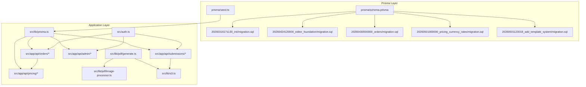
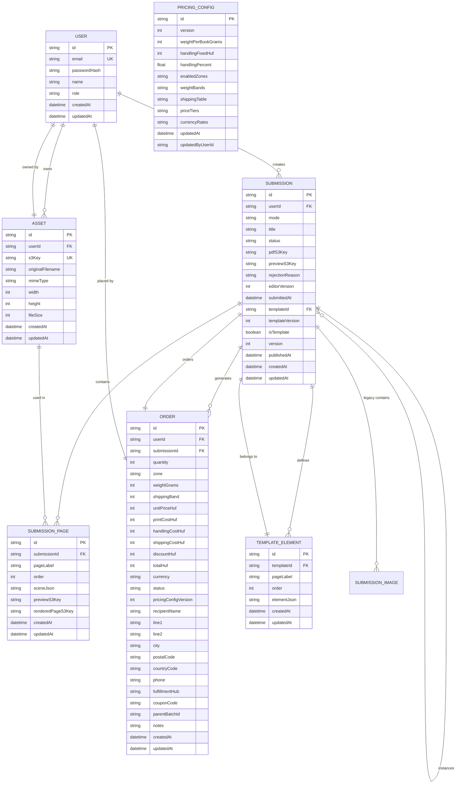
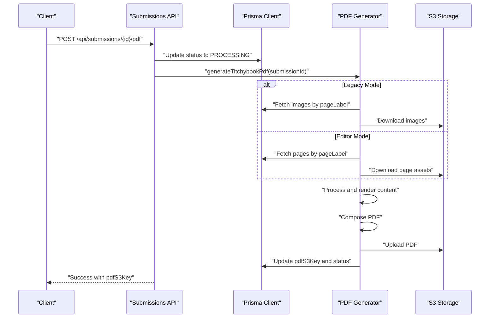
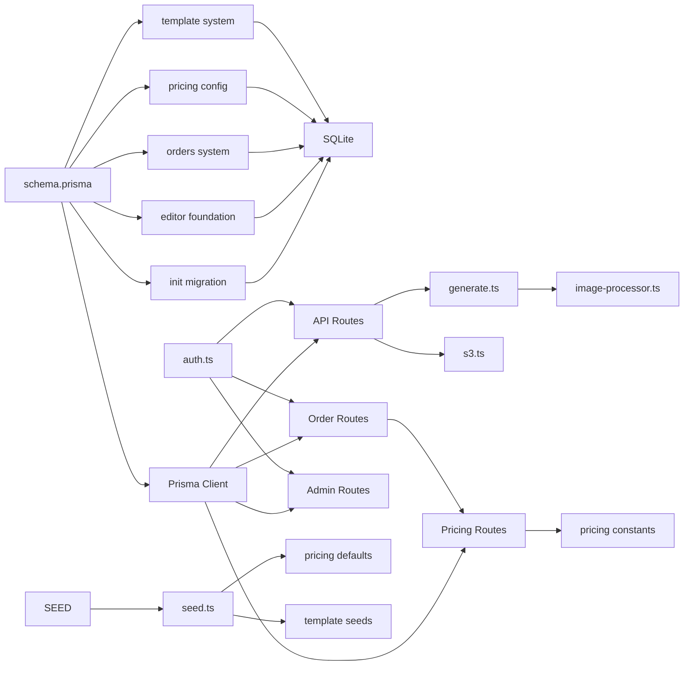

# Database Design

<cite>
**Referenced Files in This Document**
- [schema.prisma](file://prisma/schema.prisma)
- [migration.sql](file://prisma/migrations/20260316171130_init/migration.sql)
- [migration.sql](file://prisma/migrations/20260424120000_editor_foundation/migration.sql)
- [migration.sql](file://prisma/migrations/20260430000000_orders/migration.sql)
- [migration.sql](file://prisma/migrations/20260501000000_pricing_currency_rates/migration.sql)
- [migration.sql](file://prisma/migrations/20260501123018_add_template_system/migration.sql)
- [seed.ts](file://prisma/seed.ts)
- [prisma.ts](file://src/lib/prisma.ts)
- [constants.ts](file://src/lib/constants.ts)
- [editor/constants.ts](file://src/lib/editor/constants.ts)
- [pricing/constants.ts](file://src/lib/pricing/constants.ts)
- [auth.ts](file://src/auth.ts)
- [route.ts](file://src/app/api/submissions/route.ts)
- [route.ts](file://src/app/api/submissions/[id]/route.ts)
- [route.ts](file://src/app/api/submissions/[id]/pdf/route.ts)
- [route.ts](file://src/app/api/admin/submissions/route.ts)
- [route.ts](file://src/app/api/admin/submissions/[id]/route.ts)
- [route.ts](file://src/app/api/orders/route.ts)
- [route.ts](file://src/app/api/admin/pricing-config/route.ts)
- [generate.ts](file://src/lib/pdf/generate.ts)
- [image-processor.ts](file://src/lib/pdf/image-processor.ts)
- [s3.ts](file://src/lib/s3.ts)
</cite>

## Update Summary
**Changes Made**
- Added comprehensive template system with SubmissionTemplate and TemplateElement models
- Introduced asset management system with Asset model for reusable media
- Enhanced Submission model with editor-based modes and template relationships
- Added order management system with Order and PricingConfig models
- Expanded page-based editing with SubmissionPage model replacing legacy images
- Added pricing configuration system with currency rate support
- Updated migration history to reflect new schema evolution

## Table of Contents
1. [Introduction](#introduction)
2. [Project Structure](#project-structure)
3. [Core Components](#core-components)
4. [Architecture Overview](#architecture-overview)
5. [Detailed Component Analysis](#detailed-component-analysis)
6. [Dependency Analysis](#dependency-analysis)
7. [Performance Considerations](#performance-considerations)
8. [Troubleshooting Guide](#troubleshooting-guide)
9. [Conclusion](#conclusion)
10. [Appendices](#appendices)

## Introduction
This document describes the comprehensive database design for Titchybook Creator, covering the expanded data model supporting the full editor ecosystem. The schema now includes:
- Enhanced User model with authentication, roles, and relationships to assets, submissions, and orders
- Advanced Submission model supporting multiple creation modes (legacy upload, editor, template)
- Template system with SubmissionTemplate and TemplateElement for reusable designs
- Asset management for reusable media across projects
- Order management with pricing configuration and currency support
- Page-based editing system replacing legacy image-centric approach
- Comprehensive foreign key relationships, indexes, and constraints
- Prisma schema definitions across multiple migration phases
- Database seeding with templates and pricing configuration
- Sample data examples and advanced query patterns
- Validation rules, business constraints, and referential integrity
- Performance considerations and indexing strategies for the expanded schema

## Project Structure
The database schema is defined through Prisma with a multi-phase migration strategy, evolving from basic submission management to a comprehensive editor ecosystem. The schema now supports template-based creation, asset management, order processing, and international pricing.

**Diagram sources**
- [schema.prisma:1-178](file://prisma/schema.prisma#L1-L178)
- [migration.sql:1-45](file://prisma/migrations/20260316171130_init/migration.sql#L1-L45)
- [migration.sql:1-51](file://prisma/migrations/20260424120000_editor_foundation/migration.sql#L1-L51)
- [migration.sql:1-59](file://prisma/migrations/20260430000000_orders/migration.sql#L1-L59)
- [migration.sql:1-7](file://prisma/migrations/20260501000000_pricing_currency_rates/migration.sql#L1-L7)
- [migration.sql:1-51](file://prisma/migrations/20260501123018_add_template_system/migration.sql#L1-L51)
- [seed.ts:1-350](file://prisma/seed.ts#L1-L350)

**Section sources**
- [schema.prisma:1-178](file://prisma/schema.prisma#L1-L178)
- [migration.sql:1-45](file://prisma/migrations/20260316171130_init/migration.sql#L1-L45)
- [migration.sql:1-51](file://prisma/migrations/20260424120000_editor_foundation/migration.sql#L1-L51)
- [migration.sql:1-59](file://prisma/migrations/20260430000000_orders/migration.sql#L1-L59)
- [migration.sql:1-7](file://prisma/migrations/20260501000000_pricing_currency_rates/migration.sql#L1-L7)
- [migration.sql:1-51](file://prisma/migrations/20260501123018_add_template_system/migration.sql#L1-L51)
- [prisma.ts:1-10](file://src/lib/prisma.ts#L1-L10)

## Core Components
This section documents the expanded model set supporting the comprehensive editor ecosystem.

### User Model
- Purpose: Central authentication and profile management for creators and administrators
- Key fields:
  - id: String, primary key, cuid()
  - email: String, unique, used for login
  - passwordHash: String, bcrypt-hashed password
  - name: String?, optional display name
  - role: String, default "USER"; supports "ADMIN"
  - assets: Asset[] array relationship
  - submissions: Submission[] array relationship  
  - orders: Order[] array relationship
  - createdAt/updatedAt: Timestamps managed by Prisma
- Relationships:
  - One-to-many with Asset via userId
  - One-to-many with Submission via userId
  - One-to-many with Order via userId
- Constraints:
  - Unique index on email enforced by Prisma and SQL migration

### Submission Model (Enhanced)
- Purpose: Represents booklet creation requests with multiple creation modes and template support
- Key fields:
  - id: String, primary key, cuid()
  - userId: String, foreign key to User
  - mode: String, default "LEGACY_UPLOAD"; supports "EDITOR", "TEMPLATE"
  - title: String?, optional project title
  - status: String, default "PENDING"; includes "DRAFT", "PROCESSING", "APPROVED", "REJECTED", "FAILED"
  - pdfS3Key: String?, nullable S3 key for generated PDF
  - previewS3Key: String?, nullable S3 key for preview
  - rejectionReason: String?, nullable reason when rejected
  - editorVersion: Int, default 1, tracks editor compatibility
  - submittedAt: DateTime?, timestamp when submitted
  - templateId: String?, self-reference to parent template (set on instances)
  - templateVersion: Int?, snapshot of template version when instance created
  - isTemplate: Boolean, default false, true for template submissions
  - version: Int, default 1, template version counter (incremented on publish)
  - publishedAt: DateTime?, when template was published
  - createdAt/updatedAt: Timestamps
- Relationships:
  - Belongs to User (one-to-many)
  - One-to-many with SubmissionImage via submissionId
  - One-to-many with SubmissionPage via submissionId
  - One-to-many with Order via submissionId
  - One-to-many with TemplateElement via templateId (relation "TemplateElements")
  - One-to-many with Submission via templateId (relation "TemplateInstances")
  - One-to-one with Template via templateId (relation "TemplateInstances")
- Indexes:
  - Index on userId for efficient user-scoped queries
  - Index on isTemplate for template filtering
  - Index on templateId for template relationships
- Constraints:
  - Foreign key constraint on userId referencing User(id)
  - Foreign key constraint on templateId referencing Submission(id) with SET NULL on delete
  - Default status "PENDING"

### SubmissionPage Model (New)
- Purpose: Stores page-level editing data for the modern editor system
- Key fields:
  - id: String, primary key, cuid()
  - submissionId: String, foreign key to Submission
  - pageLabel: String, identifies the page (e.g., FRONT_COVER, PAGE_2, ..., PAGE_7, BACK_COVER)
  - order: Int, page ordering (0–7)
  - sceneJson: String, default "{}", JSON of editor scene data
  - previewS3Key: String?, nullable S3 key for page preview
  - renderedPageS3Key: String?, nullable S3 key for rendered page
  - createdAt/updatedAt: Timestamps
- Relationships:
  - Belongs to Submission (one-to-many)
- Indexes:
  - Index on submissionId for efficient per-submission queries
- Constraints:
  - Foreign key constraint on submissionId referencing Submission(id) with cascade delete
  - Unique constraint on (submissionId, pageLabel)
  - Unique constraint on (submissionId, order)

### Asset Model (New)
- Purpose: Manages reusable media assets across projects
- Key fields:
  - id: String, primary key, cuid()
  - userId: String, foreign key to User
  - s3Key: String, unique, S3 key for the asset
  - originalFilename: String, original filename
  - mimeType: String, e.g., image/jpeg, image/png, image/webp
  - width: Int?, nullable width in pixels
  - height: Int?, nullable height in pixels
  - fileSize: Int, file size in bytes
  - createdAt/updatedAt: Timestamps
- Relationships:
  - Belongs to User (one-to-many)
- Indexes:
  - Index on userId for efficient user-scoped queries
- Constraints:
  - Unique constraint on s3Key
  - Foreign key constraint on userId referencing User(id)

### Order Model (New)
- Purpose: Manages customer orders with comprehensive pricing and shipping
- Key fields:
  - id: String, primary key, cuid()
  - userId: String, foreign key to User
  - submissionId: String, foreign key to Submission
  - quantity: Int, number of copies
  - zone: String, shipping zone identifier
  - weightGrams: Int, total weight in grams
  - shippingBand: Int, weight band index
  - unitPriceHuf: Int, unit price in Hungarian Forint
  - printCostHuf: Int, print cost in HUF
  - handlingCostHuf: Int, default 0, handling fee in HUF
  - shippingCostHuf: Int, shipping cost in HUF
  - discountHuf: Int, default 0, discount in HUF
  - totalHuf: Int, total cost in HUF
  - currency: String, default "HUF", target currency
  - status: String, default "PENDING_PAYMENT", order lifecycle status
  - pricingConfigVersion: Int, version of pricing config used
  - recipientName: String, shipping recipient
  - line1/line2: String?, shipping address lines
  - city: String, shipping city
  - postalCode: String, shipping postal code
  - countryCode: String, shipping country code
  - phone: String?, recipient phone
  - fulfillmentHub: String?, future-proofing field
  - couponCode: String?, future-proofing field
  - parentBatchId: String?, future-proofing field
  - notes: String?, administrative notes
  - createdAt/updatedAt: Timestamps
- Relationships:
  - Belongs to User (one-to-many)
  - Belongs to Submission (one-to-many)
- Indexes:
  - Index on userId for efficient user-scoped queries
  - Index on submissionId for efficient submission-scoped queries
  - Index on status for order filtering
- Constraints:
  - Foreign key constraint on userId referencing User(id)
  - Foreign key constraint on submissionId referencing Submission(id)

### TemplateElement Model (New)
- Purpose: Stores reusable editor elements within templates
- Key fields:
  - id: String, primary key, cuid()
  - templateId: String, foreign key to Submission (template)
  - pageLabel: String, page identifier for element placement
  - order: Int, rendering order within page
  - elementJson: String, JSON string of the element data
  - createdAt/updatedAt: Timestamps
- Relationships:
  - Belongs to Submission (template) (one-to-many)
- Indexes:
  - Index on templateId for efficient template queries
  - Index on (templateId, pageLabel) for page-specific queries
- Constraints:
  - Foreign key constraint on templateId referencing Submission(id) with cascade delete

### PricingConfig Model (New)
- Purpose: Centralized pricing configuration with currency support
- Key fields:
  - id: String, primary key, default "default"
  - version: Int, default 1, configuration version
  - weightPerBookGrams: Int, default 6, weight per book in grams
  - handlingFixedHuf: Int, default 0, fixed handling cost in HUF
  - handlingPercent: Float, default 0, percentage handling cost
  - enabledZones: String, JSON string of enabled shipping zones
  - weightBands: String, JSON string of weight bands
  - shippingTable: String, JSON string of per-zone shipping costs
  - priceTiers: String, JSON string of volume discount tiers
  - currencyRates: String, default JSON rates, HUF→currency conversion factors
  - updatedAt: DateTime, timestamp of last update
  - updatedByUserId: String?, user who last updated configuration
- Constraints:
  - Single row constraint via default id "default"
  - Currency rates stored as JSON string with HUF base

**Section sources**
- [schema.prisma:10-178](file://prisma/schema.prisma#L10-L178)
- [migration.sql:1-45](file://prisma/migrations/20260316171130_init/migration.sql#L1-L45)
- [migration.sql:1-51](file://prisma/migrations/20260424120000_editor_foundation/migration.sql#L1-L51)
- [migration.sql:1-59](file://prisma/migrations/20260430000000_orders/migration.sql#L1-L59)
- [migration.sql:1-7](file://prisma/migrations/20260501000000_pricing_currency_rates/migration.sql#L1-L7)
- [migration.sql:1-51](file://prisma/migrations/20260501123018_add_template_system/migration.sql#L1-L51)
- [constants.ts:6-59](file://src/lib/constants.ts#L6-L59)
- [editor/constants.ts:1-21](file://src/lib/editor/constants.ts#L1-L21)
- [pricing/constants.ts:1-132](file://src/lib/pricing/constants.ts#L1-L132)

## Architecture Overview
The database architecture now centers around five core entities with sophisticated relationships supporting the complete editor ecosystem. Users create Submissions (either legacy uploads, editor-created, or templates), which contain either images or pages depending on mode. Templates provide reusable design systems with associated elements. Assets enable media reuse across projects. Orders connect approved submissions to customer purchases with comprehensive pricing.

**Diagram sources**
- [schema.prisma:10-178](file://prisma/schema.prisma#L10-L178)
- [migration.sql:1-45](file://prisma/migrations/20260316171130_init/migration.sql#L1-L45)
- [migration.sql:1-51](file://prisma/migrations/20260424120000_editor_foundation/migration.sql#L1-L51)
- [migration.sql:1-59](file://prisma/migrations/20260430000000_orders/migration.sql#L1-L59)
- [migration.sql:1-7](file://prisma/migrations/20260501000000_pricing_currency_rates/migration.sql#L1-L7)
- [migration.sql:1-51](file://prisma/migrations/20260501123018_add_template_system/migration.sql#L1-L51)

## Detailed Component Analysis

### User Model
- Authentication fields:
  - email: unique, used for login
  - passwordHash: bcrypt-hashed
- Roles:
  - role defaults to "USER"
  - "ADMIN" role is supported and enforced in admin APIs
- Extended relationships:
  - assets: one-to-many for media management
  - submissions: one-to-many for project management
  - orders: one-to-many for purchase history
- Timestamps:
  - createdAt and updatedAt managed by Prisma
- Validation and constraints:
  - Unique email enforced at DB level and Prisma level
  - Role values validated by application logic and admin endpoints

**Section sources**
- [schema.prisma:10-21](file://prisma/schema.prisma#L10-L21)
- [migration.sql:2-10](file://prisma/migrations/20260316171130_init/migration.sql#L2-L10)
- [auth.ts:43-57](file://src/auth.ts#L43-L57)
- [seed.ts:22-43](file://prisma/seed.ts#L22-L43)

### Enhanced Submission Model
- Multiple creation modes:
  - LEGACY_UPLOAD: traditional image-based creation
  - EDITOR: modern page-based editing
  - TEMPLATE: reusable design templates
- Template system:
  - isTemplate flag distinguishes templates from instances
  - templateId links instances to parent templates
  - version tracking for template evolution
  - publishedAt timestamp for template lifecycle
- Status lifecycle expansion:
  - DRAFT: initial state for editor templates
  - PENDING/APPROVED/REJECTED/PROCESSING/FAILED: comprehensive workflow
- Enhanced metadata:
  - title for project identification
  - previewS3Key for real-time previews
  - editorVersion for compatibility tracking
  - submittedAt for audit trails
- Relationship management:
  - Supports both legacy images and modern pages
  - Template relationships for design reuse
  - Order generation for approved submissions

**Section sources**
- [schema.prisma:23-55](file://prisma/schema.prisma#L23-L55)
- [migration.sql:1-7](file://prisma/migrations/20260424120000_editor_foundation/migration.sql#L1-L7)
- [migration.sql:13-44](file://prisma/migrations/20260501123018_add_template_system/migration.sql#L13-L44)
- [constants.ts:6-26](file://src/lib/constants.ts#L6-L26)
- [route.ts:30-92](file://src/app/api/submissions/route.ts#L30-L92)

### SubmissionPage Model (Modern Editor System)
- Purpose: Replaces legacy image-centric approach with page-based editing
- Scene data management:
  - sceneJson stores complete editor state as JSON
  - Supports complex layouts with multiple elements
  - Version tracking for editor compatibility
- Page organization:
  - pageLabel with predefined set of labels
  - order field for page sequence
  - Unique constraints prevent duplicates
- Preview and rendering:
  - previewS3Key for real-time previews
  - renderedPageS3Key for final page output
- Integration:
  - Seamlessly replaces SubmissionImage for EDITOR mode
  - Maintains backward compatibility with legacy submissions

**Section sources**
- [schema.prisma:71-86](file://prisma/schema.prisma#L71-L86)
- [migration.sql:8-20](file://prisma/migrations/20260424120000_editor_foundation/migration.sql#L8-L20)
- [constants.ts:28-50](file://src/lib/constants.ts#L28-L50)
- [editor/constants.ts:3-8](file://src/lib/editor/constants.ts#L3-L8)

### Asset Model (Media Management)
- Purpose: Centralized asset management for reusable media across projects
- Media metadata:
  - s3Key: unique S3 identifier
  - originalFilename: preserves original naming
  - mimeType: supports standard image formats
  - dimensions: width and height for responsive design
  - fileSize: byte count for storage management
- Organization:
  - userId ownership for personal asset libraries
  - Index on userId for efficient querying
- Integration:
  - Assets can be referenced by multiple pages
  - Supports both user-uploaded and system-provided assets

**Section sources**
- [schema.prisma:88-102](file://prisma/schema.prisma#L88-L102)
- [migration.sql:22-35](file://prisma/migrations/20260424120000_editor_foundation/migration.sql#L22-L35)
- [constants.ts:52-58](file://src/lib/constants.ts#L52-L58)

### Order Model (E-commerce System)
- Purpose: Complete order management with comprehensive pricing
- Order details:
  - quantity: number of copies requested
  - shipping address: complete recipient information
  - status: full lifecycle management (PENDING_PAYMENT, PAID, IN_PRODUCTION, SHIPPED, DELIVERED, CANCELLED)
- Pricing integration:
  - Links to PricingConfig for calculation consistency
  - Currency support with conversion rates
  - Volume discounts via price tiers
- Weight and shipping:
  - Automatic weight calculation from quantity and book weight
  - Band-based shipping cost calculation
  - Multi-zone shipping support
- Audit trail:
  - Created and updated timestamps
  - Pricing configuration version tracking

**Section sources**
- [schema.prisma:104-148](file://prisma/schema.prisma#L104-L148)
- [migration.sql:1-34](file://prisma/migrations/20260430000000_orders/migration.sql#L1-L34)
- [pricing/constants.ts:61-84](file://src/lib/pricing/constants.ts#L61-L84)
- [route.ts:27-130](file://src/app/api/orders/route.ts#L27-L130)

### Template System (Design Reuse)
- Template creation:
  - isTemplate flag marks template submissions
  - version tracking for template evolution
  - publishedAt timestamp for template lifecycle
- Template elements:
  - TemplateElement stores reusable editor components
  - pageLabel association for targeted placement
  - order field for rendering priority
  - elementJson stores serialized element data
- Instance management:
  - templateId links instances to parent templates
  - templateVersion snapshot for historical accuracy
  - TemplateInstances relation for template usage tracking
- Seed data:
  - Three sample templates: Birthday Card, Photo Journal, Minimalist Zine
  - Each template includes proper page structure and starter elements

**Section sources**
- [schema.prisma:150-162](file://prisma/schema.prisma#L150-L162)
- [migration.sql:1-11](file://prisma/migrations/20260501123018_add_template_system/migration.sql#L1-L11)
- [seed.ts:75-336](file://prisma/seed.ts#L75-L336)

### Pricing Configuration System
- Centralized configuration:
  - Single default row with id "default"
  - Version tracking for configuration changes
  - updatedAt timestamp for audit trails
- Pricing parameters:
  - weightPerBookGrams: base weight per book
  - handling costs: fixed and percentage components
  - shipping zones: configurable geographic coverage
  - weight bands: tiered pricing structure
  - price tiers: volume discount ladder
- Currency support:
  - currencyRates JSON field with HUF as base
  - Default rates for EUR and GBP
  - Configurable per region
- Integration:
  - Orders reference pricingConfigVersion for consistency
  - Real-time calculation using current configuration

**Section sources**
- [schema.prisma:164-178](file://prisma/schema.prisma#L164-L178)
- [migration.sql:37-49](file://prisma/migrations/20260430000000_orders/migration.sql#L37-L49)
- [migration.sql:1-7](file://prisma/migrations/20260501000000_pricing_currency_rates/migration.sql#L1-L7)
- [pricing/constants.ts:11-132](file://src/lib/pricing/constants.ts#L11-L132)
- [seed.ts:45-73](file://prisma/seed.ts#L45-L73)

### PDF Generation Workflow (Enhanced)
- Mode-aware generation:
  - Legacy mode: generates from SubmissionImage data
  - Editor mode: generates from SubmissionPage scene data
  - Template mode: generates from template elements
- Status transitions:
  - Before generation, Submission.status set to PROCESSING
  - After successful generation, Submission.status set to PENDING
  - Template publishing sets status to APPROVED
- Data preparation:
  - Fetches pages grouped by pageLabel for editor mode
  - Downloads all images from S3 in parallel
  - Processes images and renders pages in parallel
  - Composes A4 landscape PDF using pdf-lib
  - Uploads PDF to S3 and updates Submission.pdfS3Key
- Access control:
  - Only authorized users can trigger generation
  - Admins can regenerate PDFs and approve/reject
  - Template publishing requires admin approval

**Diagram sources**
- [route.ts:5-26](file://src/app/api/submissions/[id]/pdf/route.ts#L5-L26)
- [generate.ts:23-111](file://src/lib/pdf/generate.ts#L23-L111)
- [s3.ts:38-64](file://src/lib/s3.ts#L38-L64)

**Section sources**
- [generate.ts:23-111](file://src/lib/pdf/generate.ts#L23-L111)
- [image-processor.ts:9-29](file://src/lib/pdf/image-processor.ts#L9-L29)
- [s3.ts:38-80](file://src/lib/s3.ts#L38-L80)

### Admin Submission Management (Expanded)
- Template management:
  - Admins can publish/unpublish templates
  - Template version tracking and incrementing
  - Template element management
- Enhanced approval workflow:
  - Approve/Reject with rejectionReason
  - Bulk listing with status filtering
  - Template-specific admin views
- Pricing configuration:
  - Admin pricing configuration management
  - Currency rate updates
  - Zone and weight band adjustments
- Order management:
  - Full order lifecycle management
  - Status transition validation
  - Shipment tracking integration

**Section sources**
- [route.ts:12-62](file://src/app/api/admin/submissions/[id]/route.ts#L12-L62)
- [route.ts:6-37](file://src/app/api/admin/submissions/route.ts#L6-L37)
- [route.ts:1-200](file://src/app/api/admin/pricing-config/route.ts#L1-L200)

## Dependency Analysis
The expanded schema introduces several new dependency chains supporting the comprehensive editor ecosystem.

**Diagram sources**
- [schema.prisma:1-178](file://prisma/schema.prisma#L1-L178)
- [migration.sql:1-45](file://prisma/migrations/20260316171130_init/migration.sql#L1-L45)
- [migration.sql:1-51](file://prisma/migrations/20260424120000_editor_foundation/migration.sql#L1-L51)
- [migration.sql:1-59](file://prisma/migrations/20260430000000_orders/migration.sql#L1-L59)
- [migration.sql:1-7](file://prisma/migrations/20260501000000_pricing_currency_rates/migration.sql#L1-L7)
- [migration.sql:1-51](file://prisma/migrations/20260501123018_add_template_system/migration.sql#L1-L51)
- [prisma.ts:1-10](file://src/lib/prisma.ts#L1-L10)
- [auth.ts:1-80](file://src/auth.ts#L1-L80)
- [route.ts:1-147](file://src/app/api/submissions/route.ts#L1-L147)
- [route.ts:1-131](file://src/app/api/orders/route.ts#L1-L131)
- [pricing/constants.ts:1-132](file://src/lib/pricing/constants.ts#L1-L132)
- [seed.ts:1-350](file://prisma/seed.ts#L1-L350)

**Section sources**
- [schema.prisma:1-178](file://prisma/schema.prisma#L1-L178)
- [migration.sql:1-45](file://prisma/migrations/20260316171130_init/migration.sql#L1-L45)
- [migration.sql:1-51](file://prisma/migrations/20260424120000_editor_foundation/migration.sql#L1-L51)
- [migration.sql:1-59](file://prisma/migrations/20260430000000_orders/migration.sql#L1-L59)
- [migration.sql:1-7](file://prisma/migrations/20260501000000_pricing_currency_rates/migration.sql#L1-L7)
- [migration.sql:1-51](file://prisma/migrations/20260501123018_add_template_system/migration.sql#L1-L51)
- [prisma.ts:1-10](file://src/lib/prisma.ts#L1-L10)
- [auth.ts:1-80](file://src/auth.ts#L1-L80)

## Performance Considerations
- Enhanced indexing strategy:
  - User.email: unique index for fast login and existence checks
  - Submission.userId: index for user-scoped queries
  - Submission.isTemplate: index for template filtering
  - Submission.templateId: index for template relationships
  - SubmissionPage.submissionId: index for per-submission page queries
  - Asset.userId: index for user asset libraries
  - Order.userId: index for user order history
  - Order.submissionId: index for submission order tracking
  - Order.status: index for order lifecycle filtering
  - TemplateElement.templateId: index for template element queries
- Query optimization patterns:
  - Include pages ordered by order asc for editor mode
  - Include images ordered by order asc for legacy mode
  - Admin listing uses status filter and template flags
  - Template queries use isTemplate and publishedAt filters
- Concurrency and consistency:
  - PDF generation sets status to PROCESSING to prevent concurrent runs
  - Transactions ensure atomic creation of Submission with pages/images
  - Template version snapshots prevent data drift
- I/O optimization:
  - Parallel downloads and processing of images and page assets
  - Pre-signed URLs for S3 uploads/downloads minimize latency
  - Template element caching for frequently used components
- Storage considerations:
  - Separate S3 buckets for different content types
  - Asset deduplication based on s3Key
  - Template element compression for JSON storage

## Troubleshooting Guide
- Template-related issues:
  - Ensure template is published (publishedAt set) before creating instances
  - Template version increments on publish; verify templateVersion matches expected version
  - Template elements must match pageLabels defined in PAGE_LABELS
- Editor vs legacy mode conflicts:
  - Legacy mode submissions use SubmissionImage; editor mode uses SubmissionPage
  - Cannot mix pageLabel and order constraints between modes
  - Scene data must be valid JSON matching editor schema
- Asset management problems:
  - s3Key must be unique across all assets
  - Asset dimensions and file sizes should be properly recorded
  - Asset ownership verification required for access
- Order processing errors:
  - Only approved submissions can generate orders
  - Pricing configuration must be loaded successfully
  - Currency rates must be valid JSON format
  - Shipping zones must be enabled in pricing configuration
- Database integrity issues:
  - TemplateId foreign key constraints require valid template references
  - TemplateElement unique constraints prevent duplicate page elements
  - Asset unique constraints prevent duplicate S3 keys
- Performance bottlenecks:
  - Missing indexes cause slow template queries
  - Large JSON payloads in sceneJson may impact query performance
  - Unoptimized template element queries require proper indexing

**Section sources**
- [route.ts:26-28](file://src/app/api/submissions/[id]/route.ts#L26-L28)
- [route.ts:16-18](file://src/app/api/admin/submissions/[id]/route.ts#L16-L18)
- [generate.ts:44-47](file://src/lib/pdf/generate.ts#L44-L47)
- [route.ts:54-61](file://src/app/api/submissions/route.ts#L54-L61)
- [seed.ts:75-336](file://prisma/seed.ts#L75-L336)

## Conclusion
The Titchybook Creator database design now supports a comprehensive editor ecosystem with:
- Flexible submission modes accommodating legacy and modern workflows
- Robust template system enabling design reuse and brand consistency
- Centralized asset management for media organization
- Complete order management with international pricing and shipping
- Sophisticated pricing configuration with currency support
- Strong referential integrity across all relationships
- Comprehensive indexing strategy for optimal performance
- Practical validation and constraints enforced by application logic

This foundation enables scalable creation, editing, templating, and commercialization of booklets while maintaining data integrity, performance, and extensibility for future enhancements.

## Appendices

### Prisma Schema Definitions (Complete)
- User: id, email (unique), passwordHash, name, role (default "USER"), assets[], submissions[], orders[], createdAt, updatedAt
- Submission: id, userId (FK), mode (default "LEGACY_UPLOAD"), title, status (default "PENDING"), pdfS3Key, previewS3Key, rejectionReason, editorVersion (default 1), submittedAt, templateId, templateVersion, isTemplate (default false), version (default 1), publishedAt, createdAt, updatedAt
- SubmissionPage: id, submissionId (FK), pageLabel, order, sceneJson (default "{}"), previewS3Key, renderedPageS3Key, createdAt, updatedAt
- Asset: id, userId (FK), s3Key (unique), originalFilename, mimeType, width, height, fileSize, createdAt, updatedAt
- Order: id, userId (FK), submissionId (FK), quantity, zone, weightGrams, shippingBand, unitPriceHuf, printCostHuf, handlingCostHuf (default 0), shippingCostHuf, discountHuf (default 0), totalHuf, currency (default "HUF"), status (default "PENDING_PAYMENT"), pricingConfigVersion, recipientName, line1, line2, city, postalCode, countryCode, phone, fulfillmentHub, couponCode, parentBatchId, notes, createdAt, updatedAt
- TemplateElement: id, templateId (FK), pageLabel, order, elementJson, createdAt, updatedAt
- PricingConfig: id (default "default"), version (default 1), weightPerBookGrams (default 6), handlingFixedHuf (default 0), handlingPercent (default 0), enabledZones (JSON), weightBands (JSON), shippingTable (JSON), priceTiers (JSON), currencyRates (default JSON rates), updatedAt, updatedByUserId

**Section sources**
- [schema.prisma:10-178](file://prisma/schema.prisma#L10-L178)

### Migration History
- Initial schema (20260316171130): User, Submission, SubmissionImage tables with basic relationships
- Editor foundation (20260424120000): Added Submission.mode, title, previewS3Key, editorVersion, submittedAt; introduced SubmissionPage, Asset tables
- Orders system (20260430000000): Added Order, PricingConfig tables with pricing calculations
- Currency rates (20260501000000): Enhanced PricingConfig with currencyRates JSON field
- Template system (20260501123018): Added TemplateElement table and enhanced Submission with template relationships

**Section sources**
- [migration.sql:1-45](file://prisma/migrations/20260316171130_init/migration.sql#L1-L45)
- [migration.sql:1-51](file://prisma/migrations/20260424120000_editor_foundation/migration.sql#L1-L51)
- [migration.sql:1-59](file://prisma/migrations/20260430000000_orders/migration.sql#L1-L59)
- [migration.sql:1-7](file://prisma/migrations/20260501000000_pricing_currency_rates/migration.sql#L1-L7)
- [migration.sql:1-51](file://prisma/migrations/20260501123018_add_template_system/migration.sql#L1-L51)

### Database Seeding (Enhanced)
- Admin user creation with hashed password from environment variables
- Pricing configuration seeding with default rates, zones, and tiers
- Template seeding with three sample templates: Birthday Card, Photo Journal, Minimalist Zine
- Each template includes proper page structure and starter elements
- Template elements include text and shape components with proper styling

**Section sources**
- [seed.ts:22-73](file://prisma/seed.ts#L22-L73)
- [seed.ts:75-336](file://prisma/seed.ts#L75-L336)

### Sample Data Examples (Comprehensive)
- User
  - id: generated cuid()
  - email: unique email address
  - passwordHash: bcrypt hash
  - role: "USER" or "ADMIN"
  - assets[], submissions[], orders[]: relationship arrays
- Submission (Legacy)
  - id: generated cuid()
  - userId: existing user id
  - mode: "LEGACY_UPLOAD"
  - status: "PENDING"
  - images[]: array of 8 SubmissionImage objects
- Submission (Editor)
  - id: generated cuid()
  - userId: existing user id
  - mode: "EDITOR"
  - status: "DRAFT"
  - pages[]: array of 8 SubmissionPage objects with sceneJson
- Submission (Template)
  - id: generated cuid()
  - userId: existing user id
  - mode: "TEMPLATE"
  - isTemplate: true
  - version: 1
  - publishedAt: timestamp
  - templateElements[]: array of TemplateElement objects
- Asset
  - id: generated cuid()
  - userId: existing user id
  - s3Key: unique S3 identifier
  - originalFilename: original filename
  - mimeType: image/jpeg, image/png, or image/webp
  - width/height: dimensions in pixels
  - fileSize: size in bytes
- Order
  - id: generated cuid()
  - userId: existing user id
  - submissionId: existing approved submission id
  - quantity: number of copies
  - zone: shipping zone identifier
  - totalHuf: calculated total in HUF
  - status: "PENDING_PAYMENT"
  - shippingAddress: complete recipient information
- TemplateElement
  - id: generated cuid()
  - templateId: existing template id
  - pageLabel: matching template page label
  - order: rendering priority
  - elementJson: serialized element data

**Section sources**
- [constants.ts:28-59](file://src/lib/constants.ts#L28-L59)
- [editor/constants.ts:1-21](file://src/lib/editor/constants.ts#L1-L21)
- [pricing/constants.ts:11-132](file://src/lib/pricing/constants.ts#L11-L132)
- [route.ts:8-92](file://src/app/api/submissions/route.ts#L8-L92)
- [seed.ts:90-336](file://prisma/seed.ts#L90-L336)

### Common Query Patterns (Expanded)
- List current user's submissions with appropriate mode handling:
  - Legacy: include images ordered by order asc
  - Editor: include pages ordered by order asc
  - Templates: filter by isTemplate = true
- Admin template management:
  - List templates with version and publishedAt
  - Get template with all templateElements
  - Filter by templateId for instance management
- Asset management:
  - List user's assets with pagination
  - Search assets by filename or MIME type
  - Asset usage tracking across pages
- Order processing:
  - List user orders with submission details
  - Calculate order totals using current pricing config
  - Filter orders by status for fulfillment
- Pricing configuration:
  - Load current pricing config for calculations
  - Validate shipping zones and rates
  - Currency conversion for international customers
- Complex joins:
  - Submission with user, pages, and orders
  - Template with templateElements and instances
  - User with assets and submissions

**Section sources**
- [route.ts:30-92](file://src/app/api/submissions/route.ts#L30-L92)
- [route.ts:10-25](file://src/app/api/orders/route.ts#L10-L25)
- [seed.ts:75-336](file://prisma/seed.ts#L75-L336)

### Data Validation Rules and Business Constraints (Enhanced)
- Submission validation:
  - Exactly 8 pages required for editor mode with distinct pageLabels
  - Exactly 8 images required for legacy mode with distinct pageLabels
  - Order must be integer 0–7 for both modes
  - Accepted MIME types: image/jpeg, image/png, image/webp
  - Maximum file size 10MB
  - Status transitions: DRAFT → PENDING → APPROVED/REJECTED/PROCESSING
  - Template versioning: automatic increment on publish
- Template system:
  - Template elements must match template pageLabels
  - Template instances inherit templateVersion snapshot
  - Template publishing requires admin approval
- Asset management:
  - s3Key uniqueness across all assets
  - Asset ownership verification required
  - Dimension and file size validation
- Order processing:
  - Only approved submissions can generate orders
  - Pricing configuration must be loaded successfully
  - Currency rates must be valid JSON format
  - Shipping zones must be enabled
  - Quantity validation against weight bands
- Pricing configuration:
  - Currency rates stored as JSON with HUF base
  - Weight bands and shipping tables must be valid arrays
  - Price tiers must be valid range definitions
- Admin-only actions:
  - Template publishing/unpublishing
  - Pricing configuration updates
  - Order status transitions
  - User role management

**Section sources**
- [route.ts:8-92](file://src/app/api/submissions/route.ts#L8-L92)
- [route.ts:27-130](file://src/app/api/orders/route.ts#L27-L130)
- [constants.ts:52-59](file://src/lib/constants.ts#L52-L59)
- [pricing/constants.ts:11-132](file://src/lib/pricing/constants.ts#L11-L132)
- [route.ts:7-10](file://src/app/api/admin/submissions/[id]/route.ts#L7-L10)

### Referential Integrity (Enhanced)
- User relationships:
  - User(id) with RESTRICT on delete for assets and submissions
  - CASCADE on delete for orders (when user deleted)
- Submission relationships:
  - User(id) with RESTRICT on delete
  - TemplateInstance templateId with SET NULL on delete
  - TemplateElement templateId with CASCADE on delete
- Page and image relationships:
  - Submission(id) with CASCADE on delete for both pages and images
- Asset relationships:
  - User(id) with RESTRICT on delete
  - Unique s3Key constraint
- Order relationships:
  - User(id) with RESTRICT on delete
  - Submission(id) with RESTRICT on delete
- Template relationships:
  - TemplateElement(templateId) with CASCADE on delete
  - TemplateInstances(templateId) with SET NULL on delete
- Index enforcement:
  - Unique indexes on User.email and Asset.s3Key
  - Composite indexes on SubmissionPage (submissionId, pageLabel) and (submissionId, order)
  - Multi-column indexes on Submission (userId, isTemplate) and (userId, templateId)

**Section sources**
- [migration.sql:21-35](file://prisma/migrations/20260316171130_init/migration.sql#L21-L35)
- [migration.sql:34-51](file://prisma/migrations/20260424120000_editor_foundation/migration.sql#L34-L51)
- [migration.sql:32-34](file://prisma/migrations/20260430000000_orders/migration.sql#L32-L34)
- [migration.sql:34-44](file://prisma/migrations/20260501123018_add_template_system/migration.sql#L34-L44)

### Indexing Strategies (Comprehensive)
- Primary table indexes:
  - User.email: unique index for login and deduplication
  - Submission.userId: index for user-scoped queries
  - Submission.isTemplate: index for template filtering
  - Submission.templateId: index for template relationships
  - SubmissionPage.submissionId: index for per-submission page queries
  - Asset.userId: index for user asset libraries
  - Asset.s3Key: unique index for asset lookup
  - Order.userId: index for user order history
  - Order.submissionId: index for submission order tracking
  - Order.status: index for order lifecycle filtering
  - TemplateElement.templateId: index for template element queries
- Composite indexes:
  - SubmissionPage(submissionId, pageLabel): unique constraint
  - SubmissionPage(submissionId, order): unique constraint
  - TemplateElement(templateId, pageLabel): page-specific queries
- Performance considerations:
  - Consider adding indexes on Submission(isTemplate, status) for template filtering
  - Consider adding indexes on Submission(userId, createdAt) for user activity
  - Consider adding indexes on Order(status, createdAt) for order reporting
  - Consider adding indexes on TemplateElement(pageLabel, order) for element ordering
- Query optimization:
  - Include pages/images ordered by their respective order fields
  - Use appropriate filters for template vs instance queries
  - Leverage unique constraints to prevent duplicate entries
  - Optimize template element queries with proper indexing

**Section sources**
- [migration.sql:37-44](file://prisma/migrations/20260316171130_init/migration.sql#L37-L44)
- [migration.sql:37-51](file://prisma/migrations/20260424120000_editor_foundation/migration.sql#L37-L51)
- [migration.sql:51-59](file://prisma/migrations/20260430000000_orders/migration.sql#L51-L59)
- [migration.sql:46-51](file://prisma/migrations/20260501123018_add_template_system/migration.sql#L46-L51)
- [schema.prisma:52-86](file://prisma/schema.prisma#L52-L86)
- [schema.prisma:101-148](file://prisma/schema.prisma#L101-L148)
- [schema.prisma:160-162](file://prisma/schema.prisma#L160-L162)