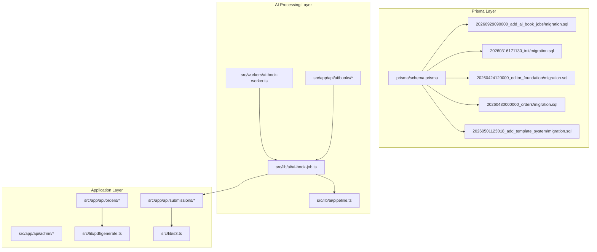
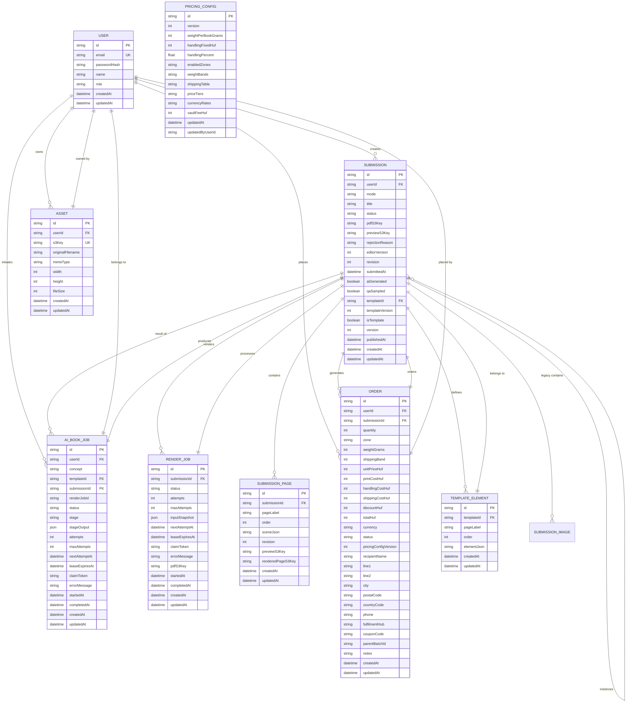
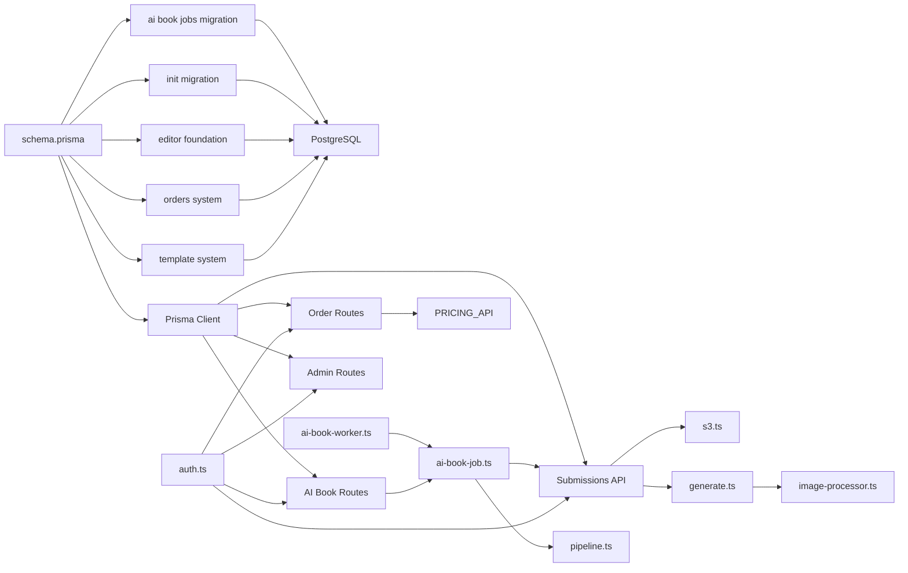

# Database Design

<cite>
**Referenced Files in This Document**
- [schema.prisma](file://prisma/schema.prisma)
- [migration.sql](file://prisma/migrations/20260929090000_add_ai_book_jobs/migration.sql)
- [ai-book-worker.ts](file://src/workers/ai-book-worker.ts)
- [ai-book-job.ts](file://src/lib/ai/ai-book-job.ts)
- [pipeline.ts](file://src/lib/ai/pipeline.ts)
- [route.ts](file://src/app/api/ai/books/route.ts)
- [route.ts](file://src/app/api/ai/books/[id]/route.ts)
</cite>

## Update Summary
**Changes Made**
- Enhanced Submission model with aiGenerated and qaSampled fields for AI pipeline tracking
- Added new AiBookJob table for autonomous AI book creation lifecycle management
- Implemented lease/heartbeat/fencing mechanisms for distributed job processing
- Integrated AI book worker system with stage-based pipeline processing
- Added API endpoints for AI book job creation and status polling
- Updated database schema with comprehensive indexing for job queue operations

## Table of Contents
1. [Introduction](#introduction)
2. [Project Structure](#project-structure)
3. [Core Components](#core-components)
4. [Architecture Overview](#architecture-overview)
5. [Detailed Component Analysis](#detailed-component-analysis)
6. [Dependency Analysis](#dependency-analysis)
7. [Performance Considerations](#performance-considerations)
8. [Troubleshooting Guide](#troubleshooting-guide)
9. [Conclusion](#conclusion)
10. [Appendices](#appendices)

## Introduction
This document describes the comprehensive database design for Titchybook Creator, now enhanced with autonomous AI book creation capabilities. The schema includes the original editor ecosystem plus new AI pipeline components that enable end-to-end automated booklet generation with quality assurance workflows. Key additions include:
- Enhanced Submission model with aiGenerated and qaSampled flags for AI pipeline tracking
- New AiBookJob table implementing distributed job processing with lease/heartbeat/fencing
- Stage-based pipeline architecture (CONCEPT → CONTENT → COMPOSE → RENDER → QA)
- Robust error handling with retry mechanisms and terminal failure states
- Comprehensive indexing strategy optimized for concurrent job processing
- Integration with existing template system and rendering infrastructure

## Project Structure
The database schema has evolved to support both traditional manual creation and autonomous AI-generated books through a sophisticated job processing system.

```mermaid
graph TB
subgraph "Prisma Layer"
PRISMA_SCHEMA["prisma/schema.prisma"]
AI_MIG["20260929090000_add_ai_book_jobs/migration.sql"]
INIT_MIG["20260316171130_init/migration.sql"]
EDITOR_MIG["20260424120000_editor_foundation/migration.sql"]
ORDERS_MIG["20260430000000_orders/migration.sql"]
TEMPLATE_MIG["20260501123018_add_template_system/migration.sql"]
end
subgraph "AI Processing Layer"
AI_WORKER["src/workers/ai-book-worker.ts"]
JOB_MANAGER["src/lib/ai/ai-book-job.ts"]
PIPELINE["src/lib/ai/pipeline.ts"]
API_ROUTES["src/app/api/ai/books/*"]
end
subgraph "Application Layer"
SUB_API["src/app/api/submissions/*"]
ORDER_API["src/app/api/orders/*"]
ADMIN_API["src/app/api/admin/*"]
PDF_GEN["src/lib/pdf/generate.ts"]
S3["src/lib/s3.ts"]
end
PRISMA_SCHEMA --> AI_MIG
PRISMA_SCHEMA --> INIT_MIG
PRISMA_SCHEMA --> EDITOR_MIG
PRISMA_SCHEMA --> ORDERS_MIG
PRISMA_SCHEMA --> TEMPLATE_MIG
AI_WORKER --> JOB_MANAGER
JOB_MANAGER --> PIPELINE
API_ROUTES --> JOB_MANAGER
JOB_MANAGER --> SUB_API
SUB_API --> S3
ORDER_API --> PDF_GEN
```

**Diagram sources**
- [schema.prisma:1-275](file://prisma/schema.prisma#L1-L275)
- [migration.sql:1-47](file://prisma/migrations/20260929090000_add_ai_book_jobs/migration.sql#L1-L47)
- [ai-book-worker.ts:1-34](file://src/workers/ai-book-worker.ts#L1-L34)
- [ai-book-job.ts:1-173](file://src/lib/ai/ai-book-job.ts#L1-L173)
- [pipeline.ts:1-365](file://src/lib/ai/pipeline.ts#L1-L365)
- [route.ts:1-53](file://src/app/api/ai/books/route.ts#L1-L53)

## Core Components
This section documents the enhanced model set supporting both manual and AI-driven booklet creation workflows.

### Enhanced Submission Model
**Updated** - Now includes AI pipeline tracking fields

- Purpose: Represents booklet creation requests with multiple creation modes including AI-generated content
- Key fields:
  - id: String, primary key, cuid()
  - userId: String, foreign key to User
  - mode: String, default "LEGACY_UPLOAD"; supports "EDITOR", "TEMPLATE"
  - title: String?, optional project title
  - status: String, default "PENDING"; includes "DRAFT", "PROCESSING", "APPROVED", "REJECTED", "FAILED"
  - pdfS3Key: String?, nullable S3 key for generated PDF
  - previewS3Key: String?, nullable S3 key for preview
  - rejectionReason: String?, nullable reason when rejected
  - editorVersion: Int, default 1, tracks editor compatibility
  - revision: Int, default 0, version counter for submissions
  - submittedAt: DateTime?, timestamp when submitted
  - **aiGenerated**: Boolean, default false, marks AI-created submissions
  - **qaSampled**: Boolean, default false, flags submissions for admin spot-check after auto-approval
  - templateId: String?, self-reference to parent template (set on instances)
  - templateVersion: Int?, snapshot of template version when instance created
  - isTemplate: Boolean, default false, true for template submissions
  - version: Int, default 1, template version counter (incremented on publish)
  - publishedAt: DateTime?, when template was published
  - createdAt/updatedAt: Timestamps
- Relationships:
  - Belongs to User (one-to-many)
  - One-to-many with SubmissionImage via submissionId
  - One-to-many with SubmissionPage via submissionId
  - One-to-many with Order via submissionId
  - One-to-many with TemplateElement via templateId (relation "TemplateElements")
  - One-to-many with Submission via templateId (relation "TemplateInstances")
  - One-to-one with Template via templateId (relation "TemplateInstances")
  - One-to-many with AiBookJob via submissionId
- Indexes:
  - Index on userId for efficient user-scoped queries
  - Index on isTemplate for template filtering
  - Index on templateId for template relationships

**Section sources**
- [schema.prisma:33-73](file://prisma/schema.prisma#L33-L73)
- [migration.sql:1-3](file://prisma/migrations/20260929090000_add_ai_book_jobs/migration.sql#L1-L3)

### AiBookJob Model (New)
- Purpose: Manages autonomous AI book creation jobs with distributed processing capabilities
- Key fields:
  - id: String, primary key, cuid()
  - userId: String, foreign key to User
  - concept: String, user prompt (max 2000 chars enforced in API)
  - templateId: String?, optional user-chosen template; otherwise AI-selected
  - submissionId: String?, set once COMPOSE succeeds
  - renderJobId: String?, set once RENDER is enqueued
  - status: String, default "QUEUED"; supports "PROCESSING", "COMPLETED", "FAILED"
  - stage: String, default "CONCEPT"; supports "CONTENT", "COMPOSE", "RENDER", "QA"
  - stageOutput: Json?, persists per-stage output { contentPlan?, templateId?, qaReport? }
  - attempts: Int, default 0, tracks retry attempts
  - maxAttempts: Int, default 3, maximum retry attempts before failure
  - nextAttemptAt: DateTime, default now(), scheduled retry time
  - leaseExpiresAt: DateTime?, lease expiration for distributed processing
  - claimToken: String?, unique token for job ownership
  - errorMessage: String?, error details for failed jobs
  - startedAt: DateTime?, when job processing began
  - completedAt: DateTime?, when job finished successfully
  - createdAt/updatedAt: Timestamps
- Relationships:
  - Belongs to User (one-to-many)
  - Belongs to Submission (one-to-many, nullable until COMPOSE stage)
- Indexes:
  - Index on userId for user-specific job queries
  - Index on submissionId for submission-related job tracking
  - Composite index on (status, nextAttemptAt) for job scheduling
  - Composite index on (status, leaseExpiresAt) for lease recovery

**Section sources**
- [schema.prisma:223-250](file://prisma/schema.prisma#L223-L250)
- [migration.sql:5-47](file://prisma/migrations/20260929090000_add_ai_book_jobs/migration.sql#L5-L47)

### RenderJob Model (Enhanced)
**Updated** - Now integrated with AI book pipeline

- Purpose: Manages PDF rendering jobs with distributed processing capabilities
- Key fields:
  - id: String, primary key, cuid()
  - submissionId: String, foreign key to Submission
  - status: String, default "QUEUED"; supports "PROCESSING", "COMPLETED", "FAILED"
  - attempts: Int, default 0, tracks retry attempts
  - maxAttempts: Int, default 3, maximum retry attempts before failure
  - inputSnapshot: Json?, preserves rendering input data
  - nextAttemptAt: DateTime, default now(), scheduled retry time
  - leaseExpiresAt: DateTime?, lease expiration for distributed processing
  - claimToken: String?, unique token for job ownership
  - errorMessage: String?, error details for failed jobs
  - pdfS3Key: String?, generated PDF location
  - startedAt: DateTime?, when job processing began
  - completedAt: DateTime?, when job finished successfully
  - createdAt/updatedAt: Timestamps
- Relationships:
  - Belongs to Submission (one-to-many)
- Indexes:
  - Index on submissionId for submission-related queries
  - Index on status for job status filtering
  - Composite index on (status, nextAttemptAt) for job scheduling
  - Composite index on (status, leaseExpiresAt) for lease recovery

**Section sources**
- [schema.prisma:252-275](file://prisma/schema.prisma#L252-L275)

## Architecture Overview
The database architecture now centers around six core entities with sophisticated relationships supporting both manual and AI-driven creation workflows. Users create Submissions through traditional methods or AI pipelines, which contain either images or pages depending on mode. Templates provide reusable design systems with associated elements. Assets enable media reuse across projects. Orders connect approved submissions to customer purchases with comprehensive pricing. The new AiBookJob system manages autonomous AI book creation with robust distributed processing capabilities.

```mermaid
erDiagram
USER {
string id PK
string email UK
string passwordHash
string name
string role
datetime createdAt
datetime updatedAt
}
SUBMISSION {
string id PK
string userId FK
string mode
string title
string status
string pdfS3Key
string previewS3Key
string rejectionReason
int editorVersion
int revision
datetime submittedAt
boolean aiGenerated
boolean qaSampled
string templateId FK
int templateVersion
boolean isTemplate
int version
datetime publishedAt
datetime createdAt
datetime updatedAt
}
AI_BOOK_JOB {
string id PK
string userId FK
string concept
string templateId FK
string submissionId FK
string renderJobId
string status
string stage
json stageOutput
int attempts
int maxAttempts
datetime nextAttemptAt
datetime leaseExpiresAt
string claimToken
string errorMessage
datetime startedAt
datetime completedAt
datetime createdAt
datetime updatedAt
}
RENDER_JOB {
string id PK
string submissionId FK
string status
int attempts
int maxAttempts
json inputSnapshot
datetime nextAttemptAt
datetime leaseExpiresAt
string claimToken
string errorMessage
string pdfS3Key
datetime startedAt
datetime completedAt
datetime createdAt
datetime updatedAt
}
SUBMISSION_PAGE {
string id PK
string submissionId FK
string pageLabel
int order
string sceneJson
int revision
string previewS3Key
string renderedPageS3Key
datetime createdAt
datetime updatedAt
}
ASSET {
string id PK
string userId FK
string s3Key UK
string originalFilename
string mimeType
int width
int height
int fileSize
datetime createdAt
datetime updatedAt
}
ORDER {
string id PK
string userId FK
string submissionId FK
int quantity
string zone
int weightGrams
int shippingBand
int unitPriceHuf
int printCostHuf
int handlingCostHuf
int shippingCostHuf
int discountHuf
int totalHuf
string currency
string status
int pricingConfigVersion
string recipientName
string line1
string line2
string city
string postalCode
string countryCode
string phone
string fulfilmentHub
string couponCode
string parentBatchId
string notes
datetime createdAt
datetime updatedAt
}
TEMPLATE_ELEMENT {
string id PK
string templateId FK
string pageLabel
int order
string elementJson
datetime createdAt
datetime updatedAt
}
PRICING_CONFIG {
string id PK
int version
int weightPerBookGrams
int handlingFixedHuf
float handlingPercent
string enabledZones
string weightBands
string shippingTable
string priceTiers
string currencyRates
int vaultFeeHuf
datetime updatedAt
string updatedByUserId
}
USER ||--o{ SUBMISSION : "creates"
USER ||--o{ ASSET : "owns"
USER ||--o{ ORDER : "places"
USER ||--o{ AI_BOOK_JOB : "initiates"
SUBMISSION ||--o{ SUBMISSION_PAGE : "contains"
SUBMISSION ||--o{ SUBMISSION_IMAGE : "legacy contains"
SUBMISSION ||--o{ ORDER : "generates"
SUBMISSION ||--o{ RENDER_JOB : "renders"
SUBMISSION ||--o{ AI_BOOK_JOB : "result of"
SUBMISSION ||--o{ TEMPLATE_ELEMENT : "defines"
SUBMISSION ||--o{ SUBMISSION : "instances"
AI_BOOK_JOB ||--|| USER : "belongs to"
AI_BOOK_JOB ||--|| SUBMISSION : "produces"
RENDER_JOB ||--|| SUBMISSION : "processes"
ASSET ||--|| USER : "owned by"
ORDER ||--|| SUBMISSION : "orders"
ORDER ||--|| USER : "placed by"
TEMPLATE_ELEMENT ||--|| SUBMISSION : "belongs to"
```

**Diagram sources**
- [schema.prisma:10-275](file://prisma/schema.prisma#L10-L275)

## Detailed Component Analysis

### Enhanced Submission Model (AI Pipeline Integration)
**Updated** - Now supports AI-generated content tracking

- Multiple creation modes:
  - LEGACY_UPLOAD: traditional image-based creation
  - EDITOR: modern page-based editing
  - TEMPLATE: reusable design templates
- AI pipeline integration:
  - aiGenerated flag marks submissions created end-to-end by AI pipeline
  - qaSampled flag indicates submissions selected for admin quality review
  - revision field tracks version history for AI-generated content
- Template system:
  - isTemplate flag distinguishes templates from instances
  - templateId links instances to parent templates
  - version tracking for template evolution
  - publishedAt timestamp for template lifecycle
- Status lifecycle expansion:
  - DRAFT: initial state for editor templates
  - PENDING/APPROVED/REJECTED/PROCESSING/FAILED: comprehensive workflow
- Enhanced metadata:
  - title for project identification
  - previewS3Key for real-time previews
  - editorVersion for compatibility tracking
  - submittedAt for audit trails
- Relationship management:
  - Supports both legacy images and modern pages
  - Template relationships for design reuse
  - Order generation for approved submissions
  - AI book job tracking for automated creation

**Section sources**
- [schema.prisma:33-73](file://prisma/schema.prisma#L33-L73)
- [pipeline.ts:272-287](file://src/lib/ai/pipeline.ts#L272-L287)

### AiBookJob Model (Distributed Job Processing)
- Purpose: Manages autonomous AI book creation with robust distributed processing
- Job lifecycle:
  - QUEUED: initial state when job is created
  - PROCESSING: active processing by worker nodes
  - COMPLETED: successful completion with all stages done
  - FAILED: terminal failure after exhausting retries
- Stage progression:
  - CONCEPT: template selection and slot analysis
  - CONTENT: AI-generated content planning
  - COMPOSE: submission instance creation/update
  - RENDER: PDF generation coordination
  - QA: automated quality assurance checks
- Distributed processing features:
  - Lease mechanism prevents concurrent processing
  - Heartbeat system maintains job ownership
  - Fencing ensures atomic state transitions
  - Retry logic with exponential backoff
- State persistence:
  - stageOutput captures intermediate results
  - attempt tracking for retry management
  - timestamp tracking for performance monitoring
- Integration points:
  - Links to User for ownership tracking
  - Optional Submission reference after COMPOSE stage
  - RenderJob coordination for PDF generation

**Section sources**
- [schema.prisma:223-250](file://prisma/schema.prisma#L223-L250)
- [ai-book-job.ts:1-173](file://src/lib/ai/ai-book-job.ts#L1-L173)

### RenderJob Model (Rendering Pipeline Integration)
**Updated** - Enhanced for AI pipeline coordination

- Purpose: Manages PDF rendering with distributed processing capabilities
- Integration with AI pipeline:
  - Coordinated by AiBookJob during RENDER stage
  - Automatic retry logic for transient failures
  - Lease-based exclusive processing
- Rendering workflow:
  - QUEUED: waiting for available workers
  - PROCESSING: active PDF generation
  - COMPLETED: successful PDF creation
  - FAILED: rendering failure after retries
- Performance optimization:
  - Input snapshot preservation for debugging
  - Attempt tracking with configurable limits
  - Lease mechanism for distributed processing
- Output management:
  - pdfS3Key stores generated PDF location
  - Error message capture for troubleshooting
  - Timestamp tracking for performance metrics

**Section sources**
- [schema.prisma:252-275](file://prisma/schema.prisma#L252-L275)
- [pipeline.ts:223-266](file://src/lib/ai/pipeline.ts#L223-L266)

### AI Book Worker System
- Purpose: Background worker process for autonomous AI book creation
- Worker lifecycle:
  - Polling loop for job acquisition
  - Graceful shutdown with cleanup
  - Signal handling for process management
- Job processing:
  - Claims jobs using distributed locking
  - Executes multi-stage pipeline
  - Handles errors and retries automatically
- Configuration:
  - Configurable polling interval (AI_WORKER_POLL_MS)
  - Process timeout for cleanup
  - Environment-based settings

**Section sources**
- [ai-book-worker.ts:1-34](file://src/workers/ai-book-worker.ts#L1-L34)

### AI Book Job Management
- Purpose: Core logic for job lifecycle management with distributed processing
- Key functions:
  - enqueueAiBookJob: Creates new jobs with rate limiting
  - claimAiBookJob: Atomically claims jobs with lease
  - heartbeatAiBookJob: Extends job lease periodically
  - advanceStage: Progresses through pipeline stages
  - completeAiBook: Finalizes successful jobs
  - failAiBook: Handles job failures with retry logic
- Distributed processing features:
  - PostgreSQL advisory locks for concurrency control
  - Lease expiration for automatic job recovery
  - Claim tokens for ownership verification
  - Atomic transactions for state consistency

**Section sources**
- [ai-book-job.ts:1-173](file://src/lib/ai/ai-book-job.ts#L1-L173)

### AI Pipeline Processing
- Purpose: Orchestrates the multi-stage AI book creation workflow
- Stage implementation:
  - CONCEPT: Template selection and text slot analysis
  - CONTENT: AI-generated content planning with validation
  - COMPOSE: Submission instance creation or update
  - RENDER: PDF generation coordination with retry logic
  - QA: Automated quality assurance with sampling
- Error handling:
  - TerminalError for unrecoverable failures
  - RetryableError for recoverable issues
  - LeaseLostError for distributed processing conflicts
- Quality assurance:
  - Automated checklist validation
  - Random sampling for admin review
  - Retry logic for temporary failures

**Section sources**
- [pipeline.ts:1-365](file://src/lib/ai/pipeline.ts#L1-L365)

### API Endpoints (AI Books)
**New** - RESTful interfaces for AI book management

- POST /api/ai/books: Create new AI book job
  - Validates concept length (1-2000 characters)
  - Optional templateId parameter
  - Rate limiting per user (10 second cooldown)
  - Returns jobId with 202 Accepted status
- GET /api/ai/books/:id: Poll job status
  - Authorization required
  - Admin access for any job
  - Returns current stage, status, and progress
  - Includes QA report if available

**Section sources**
- [route.ts:1-53](file://src/app/api/ai/books/route.ts#L1-L53)
- [route.ts:1-36](file://src/app/api/ai/books/[id]/route.ts#L1-L36)

## Dependency Analysis
The expanded schema introduces several new dependency chains supporting the autonomous AI book creation system alongside the existing editor ecosystem.

```mermaid
graph LR
SCHEMA["schema.prisma"] --> AI_MIG["ai book jobs migration"]
SCHEMA --> INIT_MIG["init migration"]
SCHEMA --> EDITOR_MIG["editor foundation"]
SCHEMA --> ORDERS_MIG["orders system"]
SCHEMA --> TEMPLATE_MIG["template system"]
AI_MIG --> DB["PostgreSQL"]
INIT_MIG --> DB
EDITOR_MIG --> DB
ORDERS_MIG --> DB
TEMPLATE_MIG --> DB
SCHEMA --> PC["Prisma Client"]
PC --> AI_API["AI Book Routes"]
PC --> SUB_API["Submissions API"]
PC --> ORDER_API["Order Routes"]
PC --> ADMIN_API["Admin Routes"]
AI_WORKER["ai-book-worker.ts"] --> JOB_MANAGER["ai-book-job.ts"]
JOB_MANAGER --> PIPELINE["pipeline.ts"]
AI_API --> JOB_MANAGER
JOB_MANAGER --> SUB_API
AUTH["auth.ts"] --> AI_API
AUTH --> SUB_API
AUTH --> ORDER_API
AUTH --> ADMIN_API
SUB_API --> S3["s3.ts"]
SUB_API --> PDF["generate.ts"]
ORDER_API --> PRICING_API
PDF --> IMGPROC["image-processor.ts"]
```

**Diagram sources**
- [schema.prisma:1-275](file://prisma/schema.prisma#L1-L275)
- [migration.sql:1-47](file://prisma/migrations/20260929090000_add_ai_book_jobs/migration.sql#L1-L47)
- [ai-book-worker.ts:1-34](file://src/workers/ai-book-worker.ts#L1-L34)
- [ai-book-job.ts:1-173](file://src/lib/ai/ai-book-job.ts#L1-L173)
- [pipeline.ts:1-365](file://src/lib/ai/pipeline.ts#L1-L365)
- [route.ts:1-53](file://src/app/api/ai/books/route.ts#L1-L53)

## Performance Considerations
- Enhanced indexing strategy for AI pipeline:
  - AiBookJob.userId: index for user-specific job queries
  - AiBookJob.submissionId: index for submission-related tracking
  - AiBookJob.status_nextAttemptAt: composite index for job scheduling
  - AiBookJob.status_leaseExpiresAt: composite index for lease recovery
  - RenderJob.status: index for job status filtering
  - RenderJob.status_nextAttemptAt: composite index for scheduling
  - RenderJob.status_leaseExpiresAt: composite index for lease recovery
- Query optimization patterns:
  - FOR UPDATE SKIP LOCKED for concurrent job claiming
  - Atomic updates with lease expiration checks
  - Batch processing for large-scale operations
  - Connection pooling for high-throughput scenarios
- Concurrency and consistency:
  - PostgreSQL advisory locks prevent duplicate processing
  - Lease mechanism ensures single-writer semantics
  - Heartbeat system maintains job ownership
  - Transactional integrity for state transitions
- I/O optimization:
  - Parallel processing of independent stages
  - Streaming responses for long-running operations
  - Efficient JSON serialization for stage outputs
  - Optimized S3 operations for large assets
- Storage considerations:
  - Compressed JSON storage for stage outputs
  - Efficient indexing for frequent query patterns
  - Partitioning strategies for large datasets
  - Archive policies for completed jobs

## Troubleshooting Guide
- AI book job issues:
  - Check job status and stage progression
  - Verify lease expiration for stuck jobs
  - Monitor attempt counts and retry logic
  - Review error messages for specific failure reasons
- Distributed processing problems:
  - Ensure proper lease management and heartbeats
  - Verify claim token consistency across processes
  - Check for concurrent access conflicts
  - Monitor database connection pool utilization
- Pipeline stage failures:
  - CONCEPT: Template availability and text slot validation
  - CONTENT: AI service configuration and response parsing
  - COMPOSE: Template instance creation and override application
  - RENDER: PDF generation resources and S3 connectivity
  - QA: Quality checklist configuration and sampling rates
- Performance bottlenecks:
  - Missing indexes cause slow job queries
  - Large JSON payloads impact query performance
  - Database connection exhaustion under load
  - Memory pressure from concurrent job processing
- Data integrity issues:
  - Foreign key constraints require valid references
  - Unique constraints prevent duplicate entries
  - Lease token conflicts indicate concurrent access
  - Stage progression violations suggest logic errors

**Section sources**
- [ai-book-job.ts:63-78](file://src/lib/ai/ai-book-job.ts#L63-L78)
- [pipeline.ts:313-365](file://src/lib/ai/pipeline.ts#L313-L365)
- [route.ts:19-52](file://src/app/api/ai/books/route.ts#L19-L52)

## Conclusion
The Titchybook Creator database design now supports a comprehensive creation ecosystem with both manual and autonomous AI-driven workflows. The enhanced Submission model accommodates AI-generated content tracking, while the new AiBookJob system provides robust distributed processing capabilities for end-to-end automated booklet creation. Key achievements include:
- Flexible submission modes accommodating legacy, editor, template, and AI workflows
- Robust template system enabling design reuse and brand consistency
- Centralized asset management for media organization
- Complete order management with international pricing and shipping
- Sophisticated pricing configuration with currency support
- Autonomous AI book creation with multi-stage pipeline processing
- Distributed job processing with lease/heartbeat/fencing mechanisms
- Strong referential integrity across all relationships
- Comprehensive indexing strategy for optimal performance
- Practical validation and constraints enforced by application logic

This foundation enables scalable creation, editing, templating, AI automation, and commercialization of booklets while maintaining data integrity, performance, and extensibility for future enhancements.

## Appendices

### Prisma Schema Definitions (Complete)
- User: id, email (unique), passwordHash, name, role (default "USER"), audience, businessName, businessType, companySize, assets[], submissions[], orders[], aiBookJobs[], createdAt, updatedAt
- Submission: id, userId (FK), mode (default "LEGACY_UPLOAD"), title, status (default "PENDING"), pdfS3Key, previewS3Key, rejectionReason, editorVersion (default 1), revision (default 0), submittedAt, aiGenerated (default false), qaSampled (default false), templateId, templateVersion, isTemplate (default false), version (default 1), publishedAt, images[], pages[], orders[], vaultEntries[], renderJobs[], aiBookJobs[], templateElements[], instances[], template, createdAt, updatedAt
- SubmissionImage: id, submissionId (FK), pageLabel, s3Key, order, originalFilename, mimeType, createdAt
- SubmissionPage: id, submissionId (FK), pageLabel, order, sceneJson (default "{}"), revision (default 0), previewS3Key, renderedPageS3Key, createdAt, updatedAt
- Asset: id, userId (FK), s3Key (unique), originalFilename, mimeType, width, height, fileSize, createdAt, updatedAt
- Order: id, userId (FK), submissionId (FK), quantity, zone, weightGrams, shippingBand, vaultAddOn (default false), vaultFeeHuf (default 0), unitPriceHuf, printCostHuf, handlingCostHuf (default 0), shippingCostHuf, discountHuf (default 0), totalHuf, currency (default "HUF"), status (default "PENDING_PAYMENT"), pricingConfigVersion, recipientName, line1, line2, city, postalCode, countryCode, phone, fulfilmentHub, couponCode, parentBatchId, notes, vaultEntries[], createdAt, updatedAt
- TemplateElement: id, templateId (FK), pageLabel, order, elementJson, createdAt, updatedAt
- PricingConfig: id (default "default"), version (default 1), weightPerBookGrams (default 6), handlingFixedHuf (default 0), handlingPercent (default 0), enabledZones (JSON), weightBands (JSON), shippingTable (JSON), priceTiers (JSON), currencyRates (default JSON rates), vaultFeeHuf (default 2000), updatedAt, updatedByUserId
- VaultEntry: id, orderId (FK), submissionId (FK), title, authorName, quantity (default 2), status (default "STORED"), storedAt (default now()), withdrawnAt, createdAt, updatedAt
- AiBookJob: id, userId (FK), concept, templateId, submissionId, renderJobId, status (default "QUEUED"), stage (default "CONCEPT"), stageOutput, attempts (default 0), maxAttempts (default 3), nextAttemptAt (default now()), leaseExpiresAt, claimToken, errorMessage, startedAt, completedAt, createdAt, updatedAt
- RenderJob: id, submissionId (FK), status (default "QUEUED"), attempts (default 0), maxAttempts (default 3), inputSnapshot, nextAttemptAt (default now()), leaseExpiresAt, claimToken, errorMessage, pdfS3Key, startedAt, completedAt, createdAt, updatedAt

**Section sources**
- [schema.prisma:10-275](file://prisma/schema.prisma#L10-L275)

### Migration History
- Initial schema (20260316171130): User, Submission, SubmissionImage tables with basic relationships
- Editor foundation (20260424120000): Added Submission.mode, title, previewS3Key, editorVersion, submittedAt; introduced SubmissionPage, Asset tables
- Orders system (20260430000000): Added Order, PricingConfig tables with pricing calculations
- Currency rates (20260501000000): Enhanced PricingConfig with currencyRates JSON field
- Template system (20260501123018): Added TemplateElement table and enhanced Submission with template relationships
- Password reset fields (20260601120033): Added password reset functionality
- Vault storage (20260604085357): Added VaultEntry table for secure storage
- Business and render jobs repair (20260921090000): Fixed business registration and render job schemas
- Durable queue and revisions (20260921091000): Enhanced queue durability and added revision tracking
- AI book jobs (20260929090000): Added aiGenerated and qaSampled fields to Submission, created AiBookJob table with comprehensive indexing

**Section sources**
- [migration.sql:1-47](file://prisma/migrations/20260929090000_add_ai_book_jobs/migration.sql#L1-L47)

### Database Seeding (Enhanced)
- Admin user creation with hashed password from environment variables
- Pricing configuration seeding with default rates, zones, and tiers
- Template seeding with three sample templates: Birthday Card, Photo Journal, Minimalist Zine
- Each template includes proper page structure and starter elements
- Template elements include text and shape components with proper styling
- AI book job initialization with proper status and stage defaults

**Section sources**
- [seed.ts:22-73](file://prisma/seed.ts#L22-L73)
- [seed.ts:75-336](file://prisma/seed.ts#L75-L336)

### Sample Data Examples (Comprehensive)
- User
  - id: generated cuid()
  - email: unique email address
  - passwordHash: bcrypt hash
  - role: "USER" or "ADMIN"
  - audience: "creator" or "business"
  - assets[], submissions[], orders[], aiBookJobs[]: relationship arrays
- Submission (Legacy)
  - id: generated cuid()
  - userId: existing user id
  - mode: "LEGACY_UPLOAD"
  - status: "PENDING"
  - aiGenerated: false
  - qaSampled: false
  - images[]: array of 8 SubmissionImage objects
- Submission (Editor)
  - id: generated cuid()
  - userId: existing user id
  - mode: "EDITOR"
  - status: "DRAFT"
  - aiGenerated: false
  - qaSampled: false
  - pages[]: array of 8 SubmissionPage objects with sceneJson
- Submission (AI-Generated)
  - id: generated cuid()
  - userId: existing user id
  - mode: "EDITOR"
  - status: "APPROVED"
  - aiGenerated: true
  - qaSampled: true/false (randomly sampled)
  - pages[]: AI-generated content
- AiBookJob
  - id: generated cuid()
  - userId: existing user id
  - concept: user's book description (max 2000 chars)
  - templateId: optional template reference
  - submissionId: set after COMPOSE stage
  - status: "QUEUED" → "PROCESSING" → "COMPLETED" or "FAILED"
  - stage: "CONCEPT" → "CONTENT" → "COMPOSE" → "RENDER" → "QA"
  - attempts: incremented on each retry
  - leaseExpiresAt: set during processing
  - claimToken: unique ownership identifier
- RenderJob
  - id: generated cuid()
  - submissionId: existing submission id
  - status: "QUEUED" → "PROCESSING" → "COMPLETED" or "FAILED"
  - attempts: retry counter
  - leaseExpiresAt: processing lease
  - pdfS3Key: generated PDF location

**Section sources**
- [constants.ts:28-59](file://src/lib/constants.ts#L28-L59)
- [editor/constants.ts:1-21](file://src/lib/editor/constants.ts#L1-L21)
- [pricing/constants.ts:11-132](file://src/lib/pricing/constants.ts#L11-L132)
- [route.ts:8-52](file://src/app/api/ai/books/route.ts#L8-L52)
- [ai-book-job.ts:39-57](file://src/lib/ai/ai-book-job.ts#L39-L57)

### Common Query Patterns (Expanded)
- List current user's submissions with appropriate mode handling:
  - Legacy: include images ordered by order asc
  - Editor: include pages ordered by order asc
  - Templates: filter by isTemplate = true
  - AI-generated: filter by aiGenerated = true
- AI book job management:
  - Create new job with concept and optional template
  - Poll job status and stage progression
  - Filter jobs by user and status
  - Track job attempts and retry schedules
- Admin template management:
  - List templates with version and publishedAt
  - Get template with all templateElements
  - Filter by templateId for instance management
- Asset management:
  - List user's assets with pagination
  - Search assets by filename or MIME type
  - Asset usage tracking across pages
- Order processing:
  - List user orders with submission details
  - Calculate order totals using current pricing config
  - Filter orders by status for fulfillment
- Complex joins:
  - Submission with user, pages, and orders
  - Template with templateElements and instances
  - User with assets, submissions, and AI book jobs
  - AiBookJob with related Submission and RenderJob

**Section sources**
- [route.ts:30-92](file://src/app/api/submissions/route.ts#L30-L92)
- [route.ts:10-25](file://src/app/api/orders/route.ts#L10-L25)
- [route.ts:19-52](file://src/app/api/ai/books/route.ts#L19-L52)
- [route.ts:8-35](file://src/app/api/ai/books/[id]/route.ts#L8-L35)
- [seed.ts:75-336](file://prisma/seed.ts#L75-L336)

### Data Validation Rules and Business Constraints (Enhanced)
- Submission validation:
  - Exactly 8 pages required for editor mode with distinct pageLabels
  - Exactly 8 images required for legacy mode with distinct pageLabels
  - Order must be integer 0–7 for both modes
  - Accepted MIME types: image/jpeg, image/png, image/webp
  - Maximum file size 10MB
  - Status transitions: DRAFT → PENDING → APPROVED/REJECTED/PROCESSING
  - Template versioning: automatic increment on publish
  - AI-generated submissions: aiGenerated flag set automatically
  - QA sampling: qaSampled randomly assigned based on configured rate
- AI book job validation:
  - Concept length: 1-2000 characters
  - TemplateId must reference approved template if provided
  - Rate limiting: one job per user per 10 seconds
  - Active job limit: configurable maximum concurrent jobs
  - Stage progression: strict ordering (CONCEPT → CONTENT → COMPOSE → RENDER → QA)
  - Retry logic: exponential backoff with configurable max attempts
- Template system:
  - Template elements must match template pageLabels
  - Template instances inherit templateVersion snapshot
  - Template publishing requires admin approval
- Asset management:
  - s3Key uniqueness across all assets
  - Asset ownership verification required
  - Dimension and file size validation
- Order processing:
  - Only approved submissions can generate orders
  - Pricing configuration must be loaded successfully
  - Currency rates must be valid JSON format
  - Shipping zones must be enabled
  - Quantity validation against weight bands
- Pricing configuration:
  - Currency rates stored as JSON with HUF base
  - Weight bands and shipping tables must be valid arrays
  - Price tiers must be valid range definitions
- Admin-only actions:
  - Template publishing/unpublishing
  - Pricing configuration updates
  - Order status transitions
  - User role management
  - AI book job monitoring and intervention

**Section sources**
- [route.ts:8-52](file://src/app/api/ai/books/route.ts#L8-L52)
- [route.ts:8-35](file://src/app/api/ai/books/[id]/route.ts#L8-L35)
- [ai-book-job.ts:39-57](file://src/lib/ai/ai-book-job.ts#L39-L57)
- [pipeline.ts:30-36](file://src/lib/ai/pipeline.ts#L30-L36)
- [route.ts:27-130](file://src/app/api/orders/route.ts#L27-L130)
- [constants.ts:52-59](file://src/lib/constants.ts#L52-L59)
- [pricing/constants.ts:11-132](file://src/lib/pricing/constants.ts#L11-L132)
- [route.ts:7-10](file://src/app/api/admin/submissions/[id]/route.ts#L7-L10)

### Referential Integrity (Enhanced)
- User relationships:
  - User(id) with RESTRICT on delete for assets, submissions, and aiBookJobs
  - CASCADE on delete for orders (when user deleted)
- Submission relationships:
  - User(id) with RESTRICT on delete
  - TemplateInstance templateId with SET NULL on delete
  - TemplateElement templateId with CASCADE on delete
  - AiBookJob submissionId with SET NULL on delete
- Page and image relationships:
  - Submission(id) with CASCADE on delete for both pages and images
- Asset relationships:
  - User(id) with RESTRICT on delete
  - Unique s3Key constraint
- Order relationships:
  - User(id) with RESTRICT on delete
  - Submission(id) with RESTRICT on delete
- Template relationships:
  - TemplateElement(templateId) with CASCADE on delete
  - TemplateInstances(templateId) with SET NULL on delete
- AI book job relationships:
  - User(id) with RESTRICT on delete
  - Submission(id) with SET NULL on delete
  - RenderJob coordination through submissionId
- Index enforcement:
  - Unique indexes on User.email and Asset.s3Key
  - Composite indexes on SubmissionPage (submissionId, pageLabel) and (submissionId, order)
  - Multi-column indexes on Submission (userId, isTemplate) and (userId, templateId)
  - Composite indexes on AiBookJob (status, nextAttemptAt) and (status, leaseExpiresAt)
  - Composite indexes on RenderJob (status, nextAttemptAt) and (status, leaseExpiresAt)

**Section sources**
- [migration.sql:42-47](file://prisma/migrations/20260929090000_add_ai_book_jobs/migration.sql#L42-L47)
- [migration.sql:37-44](file://prisma/migrations/20260316171130_init/migration.sql#L37-L44)
- [migration.sql:34-51](file://prisma/migrations/20260424120000_editor_foundation/migration.sql#L34-L51)
- [migration.sql:32-34](file://prisma/migrations/20260430000000_orders/migration.sql#L32-L34)
- [migration.sql:34-44](file://prisma/migrations/20260501123018_add_template_system/migration.sql#L34-L44)

### Indexing Strategies (Comprehensive)
- Primary table indexes:
  - User.email: unique index for login and deduplication
  - Submission.userId: index for user-scoped queries
  - Submission.isTemplate: index for template filtering
  - Submission.templateId: index for template relationships
  - SubmissionPage.submissionId: index for per-submission page queries
  - Asset.userId: index for user asset libraries
  - Asset.s3Key: unique index for asset lookup
  - Order.userId: index for user order history
  - Order.submissionId: index for submission order tracking
  - Order.status: index for order lifecycle filtering
  - TemplateElement.templateId: index for template element queries
  - AiBookJob.userId: index for user-specific job queries
  - AiBookJob.submissionId: index for submission-related tracking
  - AiBookJob.status_nextAttemptAt: composite index for job scheduling
  - AiBookJob.status_leaseExpiresAt: composite index for lease recovery
  - RenderJob.submissionId: index for submission-related queries
  - RenderJob.status: index for job status filtering
  - RenderJob.status_nextAttemptAt: composite index for scheduling
  - RenderJob.status_leaseExpiresAt: composite index for lease recovery
- Composite indexes:
  - SubmissionPage(submissionId, pageLabel): unique constraint
  - SubmissionPage(submissionId, order): unique constraint
  - TemplateElement(templateId, pageLabel): page-specific queries
- Performance considerations:
  - Consider adding indexes on Submission(isTemplate, status) for template filtering
  - Consider adding indexes on Submission(userId, createdAt) for user activity
  - Consider adding indexes on Order(status, createdAt) for order reporting
  - Consider adding indexes on TemplateElement(pageLabel, order) for element ordering
  - Consider partitioning AiBookJob by status for large-scale deployments
  - Consider archiving completed jobs to separate tables
- Query optimization:
  - Include pages/images ordered by their respective order fields
  - Use appropriate filters for template vs instance queries
  - Leverage unique constraints to prevent duplicate entries
  - Optimize template element queries with proper indexing
  - Use FOR UPDATE SKIP LOCKED for concurrent job claiming
  - Implement efficient lease expiration checks

**Section sources**
- [migration.sql:30-40](file://prisma/migrations/20260929090000_add_ai_book_jobs/migration.sql#L30-L40)
- [migration.sql:37-44](file://prisma/migrations/20260316171130_init/migration.sql#L37-L44)
- [migration.sql:37-51](file://prisma/migrations/20260424120000_editor_foundation/migration.sql#L37-L51)
- [migration.sql:51-59](file://prisma/migrations/20260430000000_orders/migration.sql#L51-L59)
- [migration.sql:46-51](file://prisma/migrations/20260501123018_add_template_system/migration.sql#L46-L51)
- [schema.prisma:70-73](file://prisma/schema.prisma#L70-L73)
- [schema.prisma:102-105](file://prisma/schema.prisma#L102-L105)
- [schema.prisma:169-172](file://prisma/schema.prisma#L169-L172)
- [schema.prisma:184-186](file://prisma/schema.prisma#L184-L186)
- [schema.prisma:246-250](file://prisma/schema.prisma#L246-L250)
- [schema.prisma:270-274](file://prisma/schema.prisma#L270-L274)