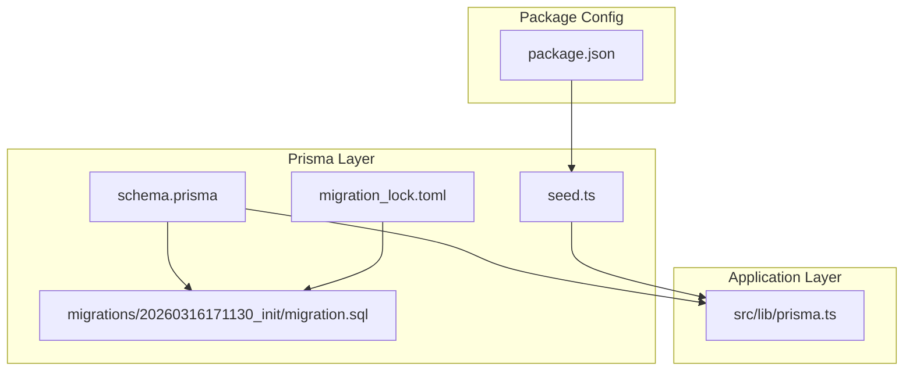
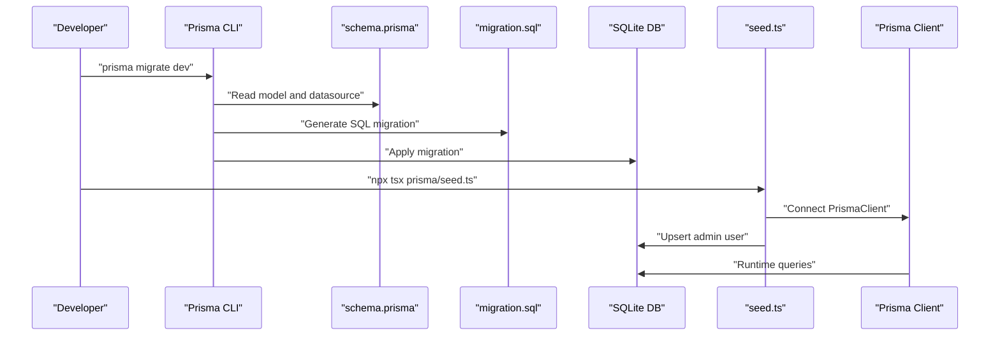
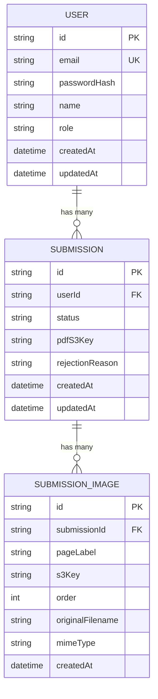
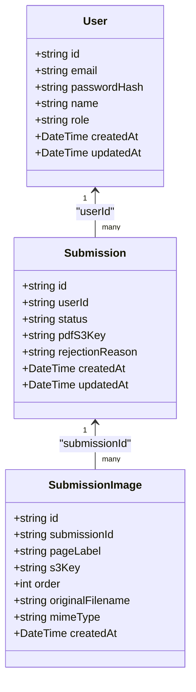
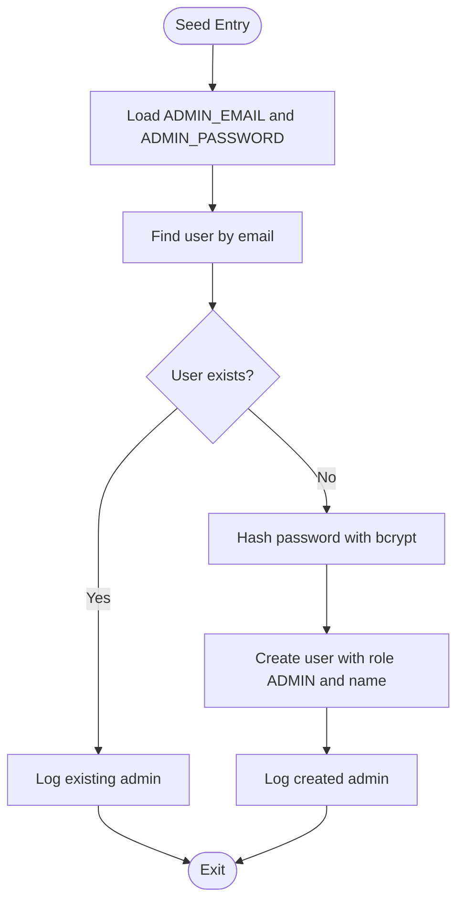
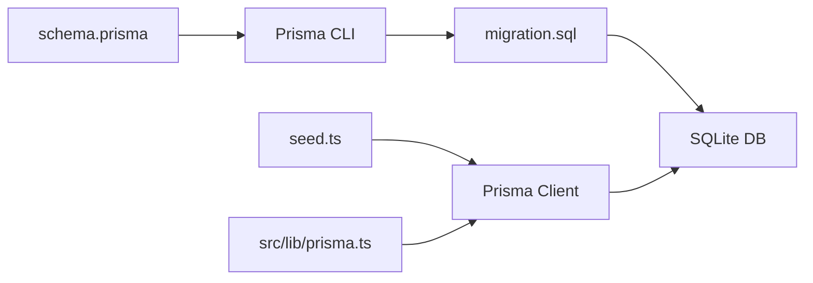

# Migrations & Seeding

<cite>
**Referenced Files in This Document**
- [schema.prisma](file://prisma/schema.prisma)
- [20260316171130_init/migration.sql](file://prisma/migrations/20260316171130_init/migration.sql)
- [seed.ts](file://prisma/seed.ts)
- [migration_lock.toml](file://prisma/migrations/migration_lock.toml)
- [prisma.ts](file://src/lib/prisma.ts)
- [package.json](file://package.json)
- [README.md](file://README.md)
</cite>

## Table of Contents
1. [Introduction](#introduction)
2. [Project Structure](#project-structure)
3. [Core Components](#core-components)
4. [Architecture Overview](#architecture-overview)
5. [Detailed Component Analysis](#detailed-component-analysis)
6. [Dependency Analysis](#dependency-analysis)
7. [Performance Considerations](#performance-considerations)
8. [Troubleshooting Guide](#troubleshooting-guide)
9. [Conclusion](#conclusion)
10. [Appendices](#appendices)

## Introduction
This document explains Titchybook Creator’s database migration and seeding processes. It covers the initial migration structure, Prisma’s migration workflow and schema versioning, the seeding script for admin user creation, and operational guidance for development, staging, and production environments. It also provides best practices for schema changes, data preservation, environment-specific configurations, troubleshooting, conflict resolution, and testing strategies.

## Project Structure
The database-related assets live under the prisma directory:
- schema.prisma defines the Prisma data model and datasource configuration.
- migrations/20260316171130_init/migration.sql is the initial migration SQL.
- seed.ts seeds the database with an admin user.
- migration_lock.toml tracks the migration provider.
- src/lib/prisma.ts exposes a singleton PrismaClient instance used across the app.
- package.json configures Prisma and the seed command.

**Diagram sources**
- [schema.prisma:1-48](file://prisma/schema.prisma#L1-L48)
- [20260316171130_init/migration.sql:1-45](file://prisma/migrations/20260316171130_init/migration.sql#L1-L45)
- [seed.ts:1-36](file://prisma/seed.ts#L1-L36)
- [migration_lock.toml:1-3](file://prisma/migrations/migration_lock.toml#L1-L3)
- [prisma.ts:1-10](file://src/lib/prisma.ts#L1-L10)
- [package.json:26-28](file://package.json#L26-L28)

**Section sources**
- [schema.prisma:1-48](file://prisma/schema.prisma#L1-L48)
- [20260316171130_init/migration.sql:1-45](file://prisma/migrations/20260316171130_init/migration.sql#L1-L45)
- [seed.ts:1-36](file://prisma/seed.ts#L1-L36)
- [migration_lock.toml:1-3](file://prisma/migrations/migration_lock.toml#L1-L3)
- [prisma.ts:1-10](file://src/lib/prisma.ts#L1-L10)
- [package.json:26-28](file://package.json#L26-L28)

## Core Components
- Initial migration SQL: Creates the User, Submission, and SubmissionImage tables, sets up foreign keys, and creates indexes for performance and referential integrity.
- Prisma schema: Defines the data model, relations, defaults, and indexes. The datasource uses SQLite with DATABASE_URL from environment variables.
- Seed script: Creates an admin user if one does not exist, hashing the password and setting role and name.
- Migration lock: Tracks the provider to prevent accidental mismatches.
- Prisma client integration: A singleton PrismaClient is exported for use across the application.

**Section sources**
- [20260316171130_init/migration.sql:1-45](file://prisma/migrations/20260316171130_init/migration.sql#L1-L45)
- [schema.prisma:1-48](file://prisma/schema.prisma#L1-L48)
- [seed.ts:1-36](file://prisma/seed.ts#L1-L36)
- [migration_lock.toml:1-3](file://prisma/migrations/migration_lock.toml#L1-L3)
- [prisma.ts:1-10](file://src/lib/prisma.ts#L1-L10)

## Architecture Overview
The migration and seeding pipeline connects Prisma’s declarative schema to the runtime database client and seed script.

**Diagram sources**
- [schema.prisma:1-8](file://prisma/schema.prisma#L1-L8)
- [20260316171130_init/migration.sql:1-45](file://prisma/migrations/20260316171130_init/migration.sql#L1-L45)
- [seed.ts:1-36](file://prisma/seed.ts#L1-L36)
- [prisma.ts:1-10](file://src/lib/prisma.ts#L1-L10)
- [package.json:26-28](file://package.json#L26-L28)

## Detailed Component Analysis

### Initial Migration: Table Creation, Constraints, and Indexes
The initial migration defines three tables with primary keys, foreign keys, defaults, and indexes:
- User: Unique email, default role, timestamps.
- Submission: Foreign key to User, default status, optional PDF S3 key and rejection reason, timestamps.
- SubmissionImage: Foreign key to Submission with cascade delete, ordering and metadata fields, timestamps.

Indexes:
- Unique index on User.email.
- Index on Submission.userId.
- Index on SubmissionImage.submissionId.

**Diagram sources**
- [20260316171130_init/migration.sql:1-45](file://prisma/migrations/20260316171130_init/migration.sql#L1-L45)

**Section sources**
- [20260316171130_init/migration.sql:1-45](file://prisma/migrations/20260316171130_init/migration.sql#L1-L45)

### Prisma Schema: Model, Relations, Defaults, and Indexes
The Prisma schema models the same entities and relationships:
- User with email uniqueness, default role, timestamps.
- Submission with relation to User, default status, timestamps, and an index on userId.
- SubmissionImage with relation to Submission and cascade deletion, plus an index on submissionId.

**Diagram sources**
- [schema.prisma:10-47](file://prisma/schema.prisma#L10-L47)

**Section sources**
- [schema.prisma:1-48](file://prisma/schema.prisma#L1-L48)

### Seeding Script: Admin User Creation and Defaults
The seed script:
- Loads environment variables for admin credentials.
- Checks if an admin user already exists.
- Hashes the password and creates a user with ADMIN role and name.
- Logs outcomes and disconnects the client.

**Diagram sources**
- [seed.ts:7-28](file://prisma/seed.ts#L7-L28)

**Section sources**
- [seed.ts:1-36](file://prisma/seed.ts#L1-L36)

### Migration Lock and Provider Tracking
The migration lock file records the provider to ensure migration consistency across environments.

**Section sources**
- [migration_lock.toml:1-3](file://prisma/migrations/migration_lock.toml#L1-L3)

### Prisma Client Integration in Application
The application exports a singleton PrismaClient instance to avoid multiple clients and reduce overhead.

**Section sources**
- [prisma.ts:1-10](file://src/lib/prisma.ts#L1-L10)

## Dependency Analysis
- Prisma CLI generates SQL from schema.prisma and applies it to the database.
- The seed script depends on Prisma Client and bcrypt for secure password hashing.
- The application uses the Prisma Client singleton for runtime queries.

**Diagram sources**
- [schema.prisma:1-8](file://prisma/schema.prisma#L1-L8)
- [20260316171130_init/migration.sql:1-45](file://prisma/migrations/20260316171130_init/migration.sql#L1-L45)
- [seed.ts:1-36](file://prisma/seed.ts#L1-L36)
- [prisma.ts:1-10](file://src/lib/prisma.ts#L1-L10)
- [package.json:26-28](file://package.json#L26-L28)

**Section sources**
- [schema.prisma:1-8](file://prisma/schema.prisma#L1-L8)
- [20260316171130_init/migration.sql:1-45](file://prisma/migrations/20260316171130_init/migration.sql#L1-L45)
- [seed.ts:1-36](file://prisma/seed.ts#L1-L36)
- [prisma.ts:1-10](file://src/lib/prisma.ts#L1-L10)
- [package.json:26-28](file://package.json#L26-L28)

## Performance Considerations
- Indexes: The initial migration adds indexes on foreign keys and unique identifiers to speed up joins and lookups.
- Defaults: Using database defaults for timestamps reduces application-side overhead.
- Cascading deletes: SubmissionImage rows are automatically cleaned up when a Submission is deleted, preventing orphaned rows.

[No sources needed since this section provides general guidance]

## Troubleshooting Guide
Common issues and resolutions:
- Migration conflicts or unexpected state:
  - Verify the migration provider in migration_lock.toml matches the configured datasource provider.
  - Re-run the migration command to reconcile differences.
- Seed failures:
  - Ensure environment variables for admin credentials are set or use defaults.
  - Confirm the database is migrated before seeding.
- Runtime connection issues:
  - Confirm DATABASE_URL is set and accessible to the application.
  - Use the Prisma Client singleton to avoid multiple connections.

**Section sources**
- [migration_lock.toml:1-3](file://prisma/migrations/migration_lock.toml#L1-L3)
- [seed.ts:7-28](file://prisma/seed.ts#L7-L28)
- [prisma.ts:1-10](file://src/lib/prisma.ts#L1-L10)

## Conclusion
The project establishes a clear migration and seeding foundation using Prisma. The initial migration defines robust tables and indexes, the schema enforces relations and defaults, and the seed script reliably provisions an admin user. Following the best practices below will keep schema evolution safe and predictable across environments.

[No sources needed since this section summarizes without analyzing specific files]

## Appendices

### Migration Commands and Workflow
- Development migration: Use the Prisma CLI to generate and apply migrations from schema changes.
- Seeding: Run the seed command configured in package.json to initialize default data.
- Production: Apply migrations and seed in CI/CD pipelines before deploying.

**Section sources**
- [package.json:26-28](file://package.json#L26-L28)
- [schema.prisma:1-8](file://prisma/schema.prisma#L1-L8)

### Rollback Procedures
- SQLite limitations: Rolling back migrations in SQLite can be challenging. Prefer creating corrective migrations rather than rolling back.
- Safe rollback strategy: Create a new migration that reverts schema changes and data updates, then apply it.

[No sources needed since this section provides general guidance]

### Production Deployment Considerations
- Environment variables: Ensure DATABASE_URL is set in production.
- Migration safety: Always run migrations before starting the application in production.
- Seed timing: Seed only once per environment or guard against duplicates in scripts.

**Section sources**
- [schema.prisma:5-8](file://prisma/schema.prisma#L5-L8)
- [seed.ts:7-28](file://prisma/seed.ts#L7-L28)

### Best Practices for Schema Changes
- Use Prisma’s migration workflow to evolve the schema safely.
- Add indexes for frequently queried foreign keys and unique fields.
- Keep defaults at the database level to simplify application logic.
- Test schema changes in a staging environment before applying to production.

**Section sources**
- [schema.prisma:1-48](file://prisma/schema.prisma#L1-L48)
- [20260316171130_init/migration.sql:1-45](file://prisma/migrations/20260316171130_init/migration.sql#L1-L45)

### Data Preservation During Migrations
- Avoid destructive changes to existing data; prefer adding columns and populating defaults.
- Use nullable columns and defaults to preserve historical data while evolving schema.
- Validate referential integrity with foreign keys and cascades.

**Section sources**
- [20260316171130_init/migration.sql:21-34](file://prisma/migrations/20260316171130_init/migration.sql#L21-L34)

### Environment-Specific Configurations
- Local development: Use a local SQLite file path in DATABASE_URL.
- Staging/Production: Use a managed database URL and secrets manager for credentials.
- Seed customization: Override admin credentials via environment variables.

**Section sources**
- [schema.prisma:5-8](file://prisma/schema.prisma#L5-L8)
- [seed.ts:7-28](file://prisma/seed.ts#L7-L28)

### Testing Strategies for Database Changes
- Unit/integration tests: Use a separate test database and run migrations before tests.
- Snapshot tests: Compare generated SQL migrations to expected outputs.
- CI/CD: Automate migration checks and seed runs in pipelines.

[No sources needed since this section provides general guidance]